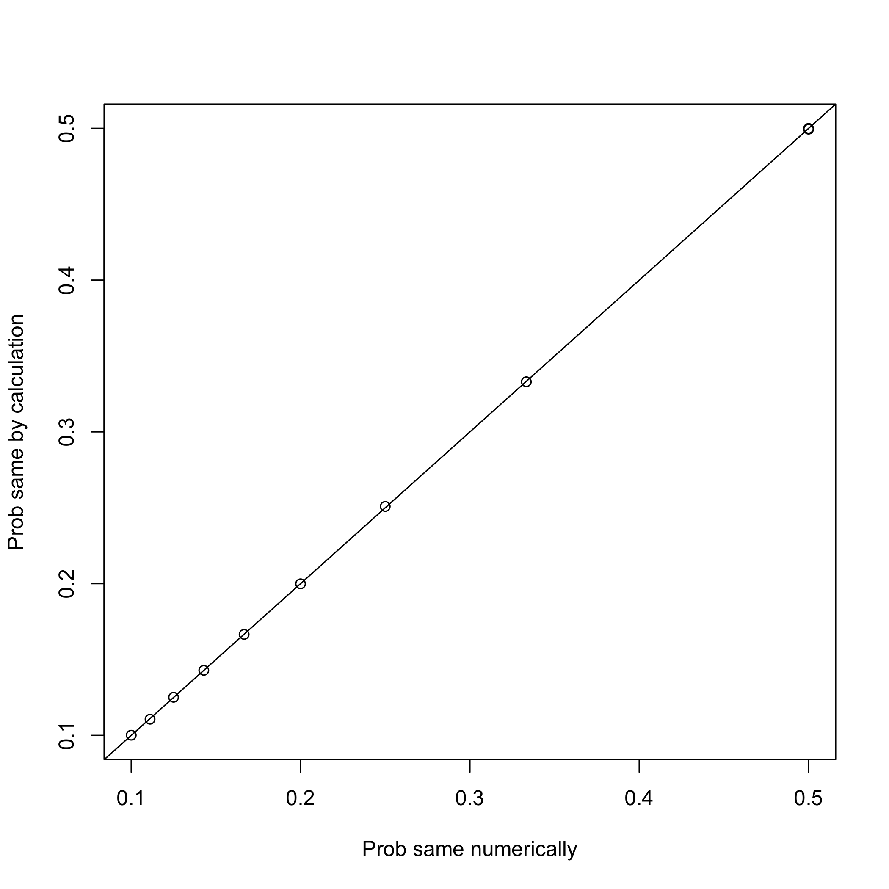
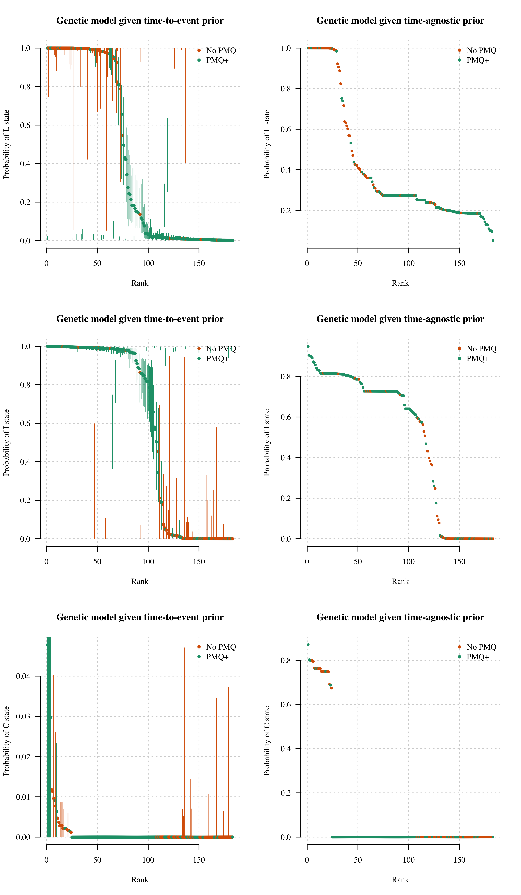
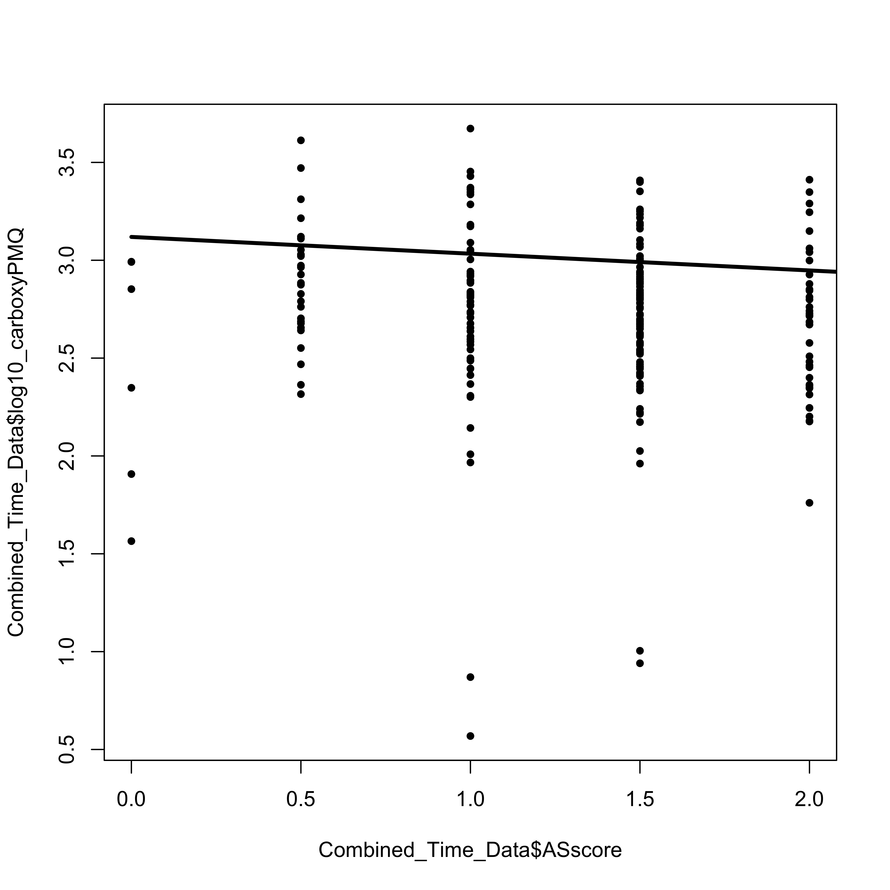
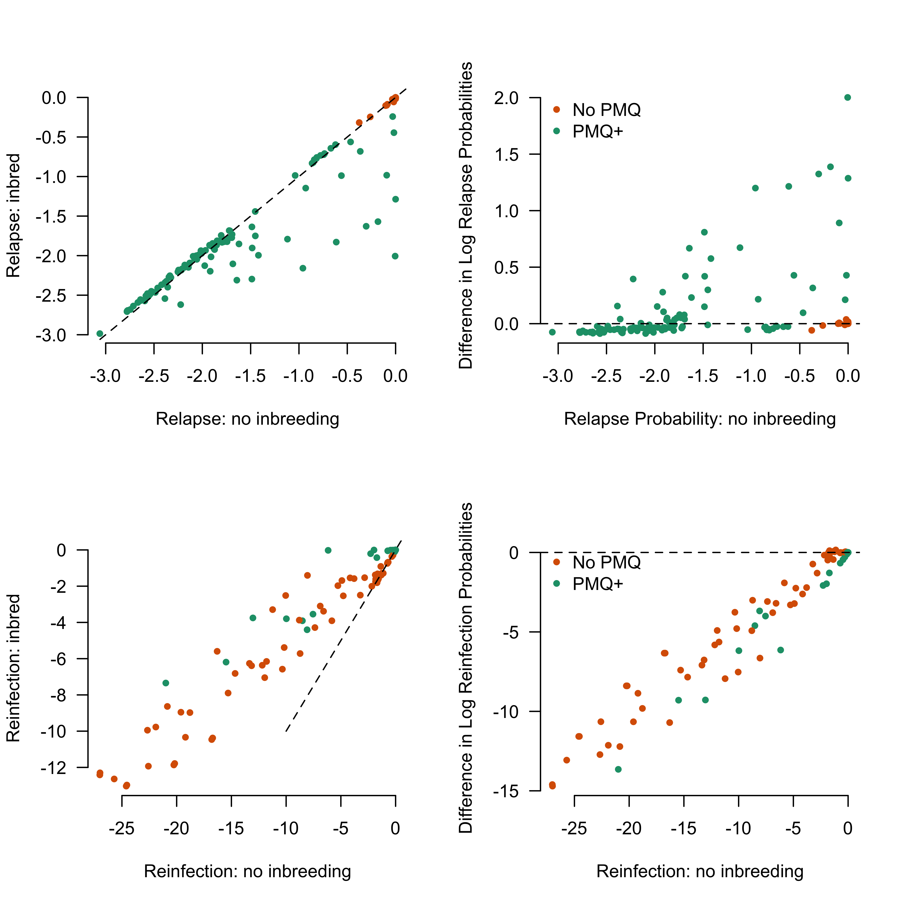

# Preamble

Load R packages, functions and data.


Summary of the data and the whole of the VHX data set versus the subset typed (in terms of number of episodes):


```
## Number of individuals with at least one episode typed: 217
```

```
## Number of episodes typed: 710
```

```
## Number of recurrences typed: 494
```

```
## 
## Overall in the dataset: breakdown by treatment group (individuals typed):
```

```
## 
##  AS CHQ PMQ 
##  13  90 114
```

```
## 
## Within VHX: breakdown by treatment group (VHX individuals typed):
```

```
## 
##  AS CHQ PMQ 
##  13  90  34
```

```
## 
## From BPD trial there are 80 individuals with total of 167 episodes typed (enrollment: 79; recurrent 88)
```

```
## From VHX trial there are 137 individuals with total of 543 episodes typed (enrollment: 137; recurrent 406)
```


```
## [1] 644
```

```
## [1] 655
```

```
## VHX: for 27 of 137 VHX individual/s selected for genotyping: 1 to 7 of their episodes were not typed (total of 52 episodes untyped summing over the 27 individuals)
```

```
## BPD: of 81 of the people who recurred: 1 person/people with 1 recurrence/s was not selected for genotyping. Of 4 of 80 BPD individual/s selected for genotyping: 1 to 1 of their episodes were not typed (4 episodes summing over the 4 individuals). Of the 4 episodes not typed 3 were recurrences. In total there were 92 recurrences: 4 untyped.
```

<!-- -->


<!-- -->

Summary of complexity of infection based on numbers of alleles observed. This is broken down by enrollment episodes (this is independent of drug given) and subsequent recurrences which could be drug dependent.

<!-- -->

```
## 
## Call:
## glm(formula = MOI ~ enrollment + drug, family = "poisson", data = data.frame(MOI = COIs$MOI - 
##     1, enrollment = as.numeric(COIs$Enrollment), drug = COIs$PMQ))
## 
## Deviance Residuals: 
##     Min       1Q   Median       3Q      Max  
## -0.9526  -0.8065  -0.7595   0.6986   2.9375  
## 
## Coefficients:
##             Estimate Std. Error z value Pr(>|z|)    
## (Intercept) -1.24337    0.09667 -12.862  < 2e-16 ***
## enrollment   0.45306    0.13982   3.240  0.00119 ** 
## drug         0.12007    0.18533   0.648  0.51707    
## ---
## Signif. codes:  0 '***' 0.001 '**' 0.01 '*' 0.05 '.' 0.1 ' ' 1
## 
## (Dispersion parameter for poisson family taken to be 1)
## 
##     Null deviance: 619.82  on 709  degrees of freedom
## Residual deviance: 609.30  on 707  degrees of freedom
## AIC: 1057.2
## 
## Number of Fisher Scoring iterations: 6
```

```
## Mean complexity of recurrent episodes is 1.29, and mean complexity of enrollment episodes is 1.45
```

```
## Median COI in VHX and BPD: 1 and 1, respectively
```

```
## 30 of 710 episodes (4 percent) with COI greater than or equal to 3
```


From this Poisson regression, there appears to be evidence that enrollment episodes have higher complexities of infection than recurrences. This implies that relapses are more likely to be single hypnozoite activated infections?


# Allele frequencies

First we define the set of microsatellite markers used in this analysis:


We use a multinomial-dirichlet model with subjective weight $\omega$. $\omega = 0$ recovers the empirical allele frequencies. 


```
## Number of episodes used to compute frequencies: 216
```


Calculate the effective marker cardinality for each microsatellite marker using a simulation approach.

<!-- -->

```
## The effective marker cardinality for PV.3.502 with 13 observed alleles is 7.03
## The effective marker cardinality for PV.3.27 with 33 observed alleles is 13.74
## The effective marker cardinality for PV.ms8 with 46 observed alleles is 28.12
## The effective marker cardinality for PV.1.501 with 17 observed alleles is 12.99
## The effective marker cardinality for PV.ms1 with 7 observed alleles is 4.31
## The effective marker cardinality for PV.ms5 with 24 observed alleles is 12
## The effective marker cardinality for PV.ms6 with 25 observed alleles is 11.93
## The effective marker cardinality for PV.ms7 with 14 observed alleles is 6.9
## The effective marker cardinality for PV.ms16 with 39 observed alleles is 19.91
```

```
## The mean effective marker cardinality is 12.98, range: 4.3 to 28.1
```


## Plotting allele frequencies

These are the mean posterior allele frequencies (dots) and 95\% credible intervals (bars) given pooled enrollment data and $\omega=$ `D_weight_Prior`.  

<!-- -->


# Computing the probability of relatedness across infections

The approach is Bayesian and consists of the following:

* A prior probability vector for the recurrence state from the time-to-event model
* An allele frequency estimate from the posterior distribution of allele frequencies
* A likelihood based on the genetic data of being a *relapse*, a *recrudescence*, or a *reinfection* given the observed microsatellite data.

The following iterates through each individual and computes the probability of relatedness states.


```
## Number of individuals with at least two episodes typed: 212
```

```
## Number of episodes in individuals with at least two episodes: 705
```

```
## Number of recurrences typed: 493
```


## Load the time-to-event priors


## Computation using full dataset 

We use all 9MS markers (when available).


### Full posterior computation


# Plot results


## Going from time-to-event prior to posterior

Plotted by radical cure versus no radical cure, as that is the most informative distinction here.

<!-- -->

Probability of states, ordered from most to least likely:

<!-- -->


# BPD Final plot


```
## The mean percentage of recurrences which are estimated to be relapses is 16%
```

<!-- -->


# Extra computations for VHX: too complex episodes


We remove the IDs that can be straightforwardly calculated:


We blow up the pooled analysis into all pairs within individuals:


Construct adjacency graphs and compute probabilities of relapse and reinfection.


```
## [1] "removing"
## [1] "removing"
```

<!-- -->

```
## The Coatney style plot is showing 486 recurrences in 208 individuals
```

<!-- -->
Individuals who appear to relapse very late (more than 300 days after last episode):


```
## The episode ids of interest are: VHX_235_3
## The episode ids of interest are: BPD_27_2
```

```
##          ID Episode Episode_Identifier Treatment MOI_id
## 60   BPD_27       1           BPD_27_1       PMQ      1
## 61   BPD_27       2           BPD_27_2       PMQ      1
## 62   BPD_27       2           BPD_27_2       PMQ      2
## 355 VHX_235       1          VHX_235_1       CHQ      1
## 356 VHX_235       1          VHX_235_1       CHQ      2
## 357 VHX_235       2          VHX_235_2       CHQ      1
## 358 VHX_235       3          VHX_235_3       CHQ      1
##     timeSinceLastEpisode timeSinceEnrolment PV.1.501 PV.3.27 PV.3.502
## 60                     0                  0        3      33        7
## 61                   308                308        3      33        7
## 62                   308                308        3      35        7
## 355                    0                  0        1       5        2
## 356                    0                  0        1       5        2
## 357                   21                 21        1       5        3
## 358                  309                330        1       5        3
##     PV.ms1 PV.ms16 PV.ms5 PV.ms6 PV.ms7 PV.ms8
## 60       4      27     24     15      5     17
## 61       4      27     24     15      5     17
## 62       4      27     24     15      5     17
## 355      3      23     13      9     10     12
## 356      3      23     13     15     10     33
## 357      4      20     13      9     10     12
## 358      4      23     11     15     10     12
```


The summaries of the final dataset:

```
## 
##  AS CHQ PMQ 
##  11  88 109
```

```
## In no-primaquine individuals, the weighted average of relapses is 99.3 (96.8-99.9)
```

```
## In no-primaquine individuals, the weighted average of recrudescences is 0.3 (0.1-0.6)
```

```
## In no-primaquine individuals, the weighted average of reinfections is 0.4 (0-2.6)
```

```
## In primaquine treated individuals, the weighted average of relapses is 14.3 (12.3-16.7)
```

```
## In primaquine treated individuals, the weighted average of recrudescences is 0 (0-0.3)
```

```
## In primaquine treated individuals, the weighted average of reinfections is 85.7 (83.3-87.5)
```

# False positive rate of relapse

We want to know how often our model estimates evidence of relapse across pairs of episodes when the episodes are in different people (i.e. have not possibility of being a relapse)


```
## The false-positive discovery rate of the genetic model is estimated as 2.15 percent. 
##                    
## This is based on 90194 pairwise comparisons
```

# Analysis of radical cure efficacy in BPD

Almost all episodes in BPD were typed. Therefore we can estimate the true efficacy comparing with historical controls (VHX).


Now we look at whether the PK (carboxy-primaquine) can predict failure:
First we add the carboxy to the dataset:

```
## [1] "BPD_34"
```

We exclude the two recurrences seen in patient BPD_444


```
## Generalized linear mixed model fit by maximum likelihood (Laplace
##   Approximation) [glmerMod]
##  Family: binomial  ( logit )
## Formula: Failure_YN ~ log10_carboxyPMQ + NumberDaysPMQ + (1 | patientid)
##    Data: Combined_Time_Data[ind_keep, ]
## 
##      AIC      BIC   logLik deviance df.resid 
##    119.8    138.1    -55.9    111.8      717 
## 
## Scaled residuals: 
##     Min      1Q  Median      3Q     Max 
## -0.5862 -0.1303 -0.1095 -0.0912 13.6453 
## 
## Random effects:
##  Groups    Name        Variance  Std.Dev. 
##  patientid (Intercept) 1.624e-14 1.274e-07
## Number of obs: 721, groups:  patientid, 639
## 
## Fixed effects:
##                  Estimate Std. Error z value Pr(>|z|)    
## (Intercept)       2.48402    1.77436   1.400 0.161529    
## log10_carboxyPMQ -1.73527    0.49252  -3.523 0.000426 ***
## NumberDaysPMQ    -0.18324    0.09035  -2.028 0.042554 *  
## ---
## Signif. codes:  0 '***' 0.001 '**' 0.01 '*' 0.05 '.' 0.1 ' ' 1
## 
## Correlation of Fixed Effects:
##             (Intr) l10_PM
## lg10_crbPMQ -0.860       
## NumbrDysPMQ -0.728  0.315
```

<!-- -->

Now we remove outliers and fit the same model (CPMQ outliers)
<!-- -->

```
## Generalized linear mixed model fit by maximum likelihood (Laplace
##   Approximation) [glmerMod]
##  Family: binomial  ( logit )
## Formula: Failure_YN ~ log10_carboxyPMQ + NumberDaysPMQ + (1 | patientid)
##    Data: Combined_Time_Data[ind_keep & !outliers14 & !outliers7, ]
## 
##      AIC      BIC   logLik deviance df.resid 
##    111.1    129.3    -51.5    103.1      706 
## 
## Scaled residuals: 
##     Min      1Q  Median      3Q     Max 
## -0.2424 -0.1310 -0.1126 -0.0957 12.0783 
## 
## Random effects:
##  Groups    Name        Variance Std.Dev. 
##  patientid (Intercept) 8.03e-14 2.834e-07
## Number of obs: 710, groups:  patientid, 632
## 
## Fixed effects:
##                  Estimate Std. Error z value Pr(>|z|)
## (Intercept)        0.3447     3.5327   0.098    0.922
## log10_carboxyPMQ  -1.0646     1.0163  -1.048    0.295
## NumberDaysPMQ     -0.1550     0.1091  -1.421    0.155
## 
## Correlation of Fixed Effects:
##             (Intr) l10_PM
## lg10_crbPMQ -0.962       
## NumbrDysPMQ -0.724  0.524
```

Compare results with and without outliers:

<!-- -->

Now we calculate a compressed dataset and failure for each individual


```
## The primaquine failure rate in the 655 individuals is 2.59% (2.02-3.47) over the course of 522 years total follow-up.
```


This won't go into this paper but looking out of interest:
  
  Does 2D6 correlate with carboxy ?
  
  
  ```
  ## Linear mixed model fit by REML ['lmerMod']
  ## Formula: log10_carboxyPMQ ~ ASscore + NumberDaysPMQ + (1 | patientid)
  ##    Data: Combined_Time_Data
  ## 
  ## REML criterion at convergence: 190.6
  ## 
  ## Scaled residuals: 
  ##     Min      1Q  Median      3Q     Max 
  ## -4.6041 -0.2741  0.0758  0.3798  5.0223 
  ## 
  ## Random effects:
  ##  Groups    Name        Variance Std.Dev.
  ##  patientid (Intercept) 0.07392  0.2719  
  ##  Residual              0.06576  0.2564  
  ## Number of obs: 234, groups:  patientid, 154
  ## 
  ## Fixed effects:
  ##                Estimate Std. Error t value
  ## (Intercept)    3.535077   0.113075  31.263
  ## ASscore       -0.085651   0.056897  -1.505
  ## NumberDaysPMQ -0.059412   0.006522  -9.109
  ## 
  ## Correlation of Fixed Effects:
  ##             (Intr) ASscor
  ## ASscore     -0.697       
  ## NumbrDysPMQ -0.710  0.055
  ```
  
  <!-- -->
  
  
  
  ```
  ## 
  ## Call:
  ## glm(formula = Failure_YN ~ ASscore, family = "binomial", data = Combined_2D6data)
  ## 
  ## Deviance Residuals: 
  ##     Min       1Q   Median       3Q      Max  
  ## -0.3616  -0.2074  -0.1566  -0.1566   2.7748  
  ## 
  ## Coefficients:
  ##             Estimate Std. Error z value Pr(>|z|)  
  ## (Intercept)   -2.695      1.518  -1.776   0.0758 .
  ## ASscore       -1.134      1.327  -0.854   0.3930  
  ## ---
  ## Signif. codes:  0 '***' 0.001 '**' 0.01 '*' 0.05 '.' 0.1 ' ' 1
  ## 
  ## (Dispersion parameter for binomial family taken to be 1)
  ## 
  ##     Null deviance: 20.065  on 111  degrees of freedom
  ## Residual deviance: 19.366  on 110  degrees of freedom
  ##   (2 observations deleted due to missingness)
  ## AIC: 23.366
  ## 
  ## Number of Fisher Scoring iterations: 7
  ```
  
  
  # Extra Analyses
  
  ## Looking at the effect of inbreeding coefficient
  
  Our model has a parameter $\alpha$ which defines the level of inbreeding within the population.
  Taylor is developing methods for the estimation of $\alpha$ from genetic data (in preparation).
  
  We look at the sensitivity of the results (all the above is with $\alpha=0$) for a reasonable upper bound of $\alpha=0.175$.
  
  We rerun the analysis on the single run isolates (low computational complexity):
  
  
  
  <!-- -->
  
  Interpretation: Adding the inbreeding coefficent slightly changes some of the probabilities of relapse for some primaquine treated individuals (only green dots are being shifted).
  This means that inbreeding would imply that fewer of the primaquine treated episodes are relapses, implying higher efficacy of the drug.
  
  For the non-primaquine group, it is just tempering the very low probabilities of reinfection seen for some episodes.
  
  In conclusion, this isn't changing the results significantly and would imply a greater primaquine efficacy that reported in the paper.
