# Preamble

Load R packages, functions and data.


Summary of the data and the whole of the VHX data set versus the subset typed (in terms of number of episodes):


```
## Number of individuals with at least one episode typed: 164
```

```
## Number of episodes typed: 599
```

```
## Number of recurrences typed: 435
```

```
## Warning: package 'bindrcpp' was built under R version 3.4.4
```

```
## Number of individuals with at least two episodes typed: 159
```

```
## Number of episodes individuals with at least two episodes typed: 594
```

```
## Number of recurrences typed: 435
```


```
## Of 75 of 82 VHX individual/s selected for genotyping, 1 to 2 of their episodes were not typed
```

```
## Of 76 of 77 BPD individual/s selected for genotyping, 1 to 1 of their episodes were not typed
```

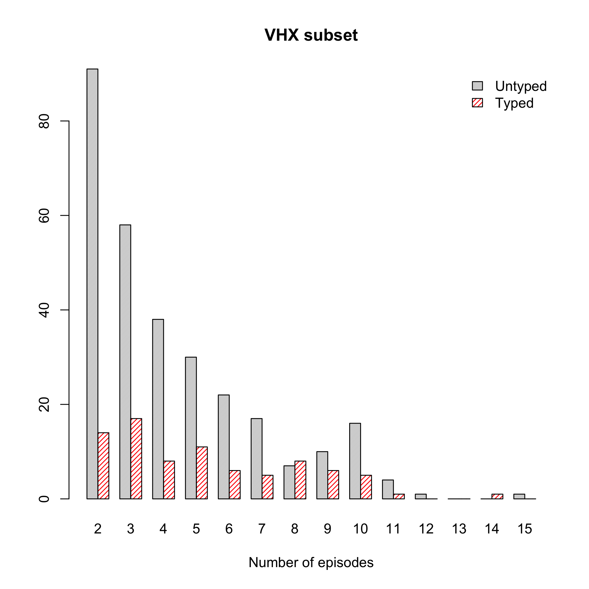<!-- -->

Summary of complexity of infection based on numbers of alleles observed 

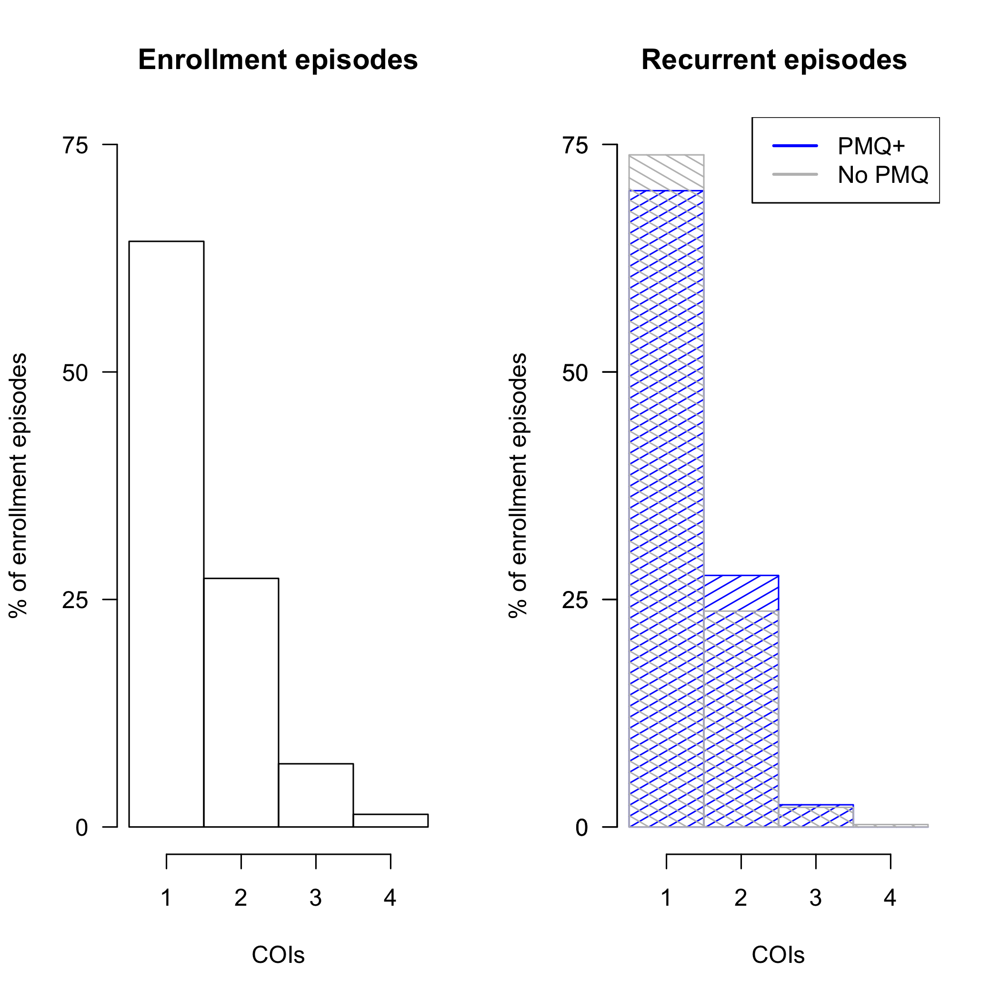<!-- -->

```
## Median COI in VHX and BPD: 1 and 1, respectively
```

```
## Number of episodes with COI >= 3: 15 of 594 (2.53 percent)
```

Define the sets of microsatellite markers for the various datasets.


# Allele frequencies

We use a multinomial-dirichlet model with subjective weight $\omega$. $\omega = 0$ recovers unweighted empirical allele frequencies. 


```
## Number of episodes used to compute frequencies: 159
```


## Plotting allele frequencies

These are the mean posterior allele frequencies (dots) and 95\% credible intervals (bars) given pooled enrollment data and $\omega=$ `D_weight_Prior`.  

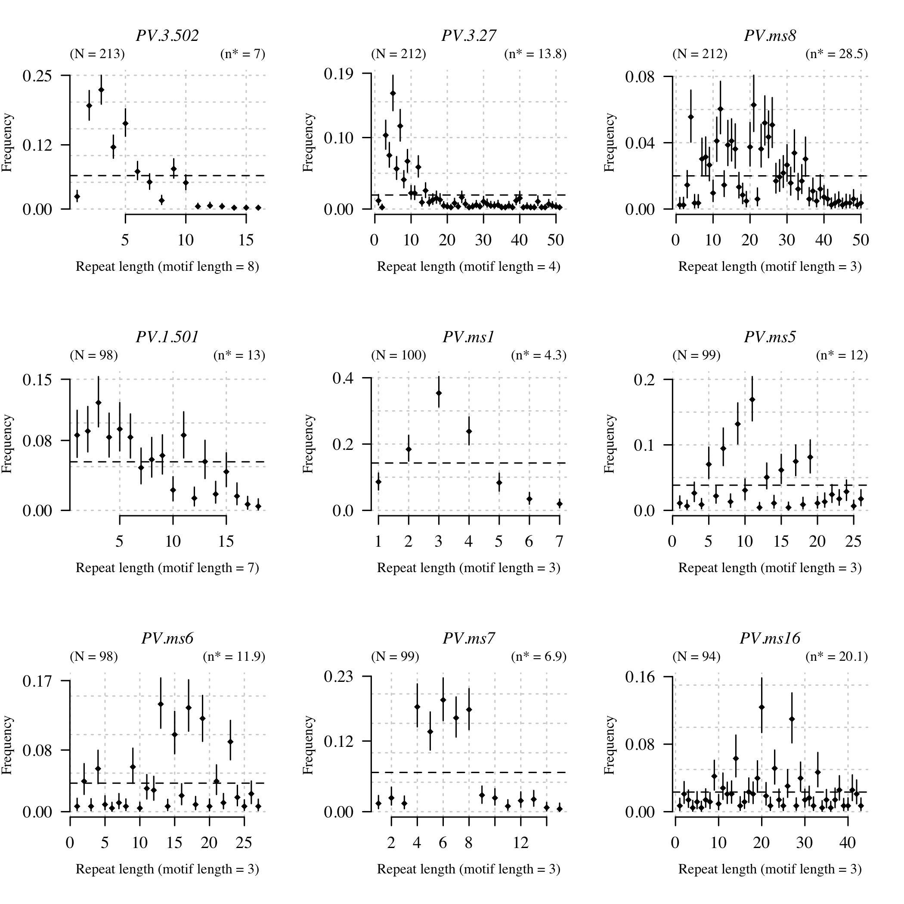<!-- -->


# Computing the probability of relatedness across infections

The approach is Bayesian and consists of the following:

* A prior probability vector for the recurrence state from the time-to-event model
* An allele frequency estimate from the posterior distribution of allele frequencies
* A likelihood based on the genetic data of being a *relapse*, a *recrudescence*, or a *reinfection* given the observed microsatellite data.

The following iterates through each individual and computes the probability of relatedness states.

## Load the time-to-event priors


## Computation using full dataset 

We use all 9MS markers (when available).


### Full posterior computation


# Plot results


## Going from time-to-event prior to posterior

Plotted by radical cure versus no radical cure, as that is the most informative distinction here.

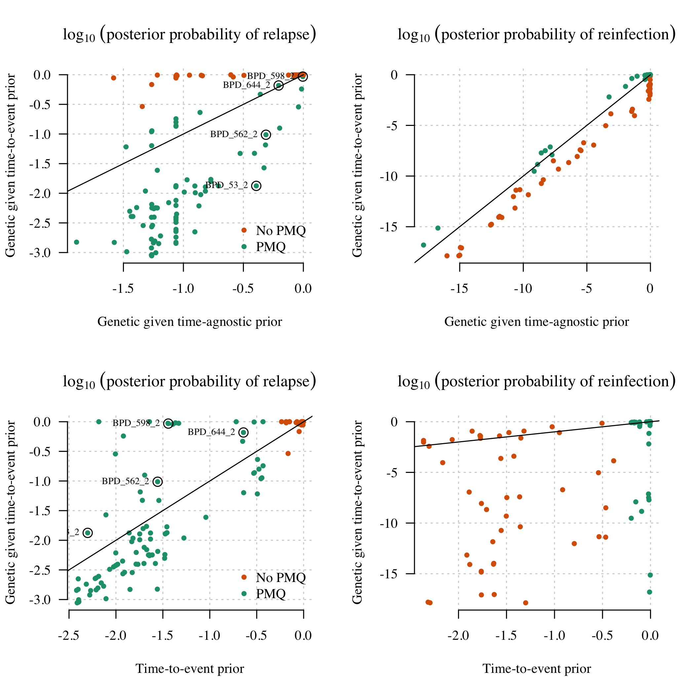<!-- -->

Probability of states, ordered from most to least likely:

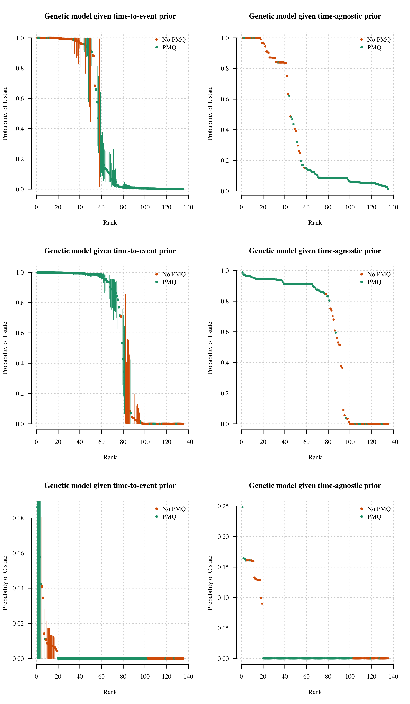<!-- -->


# BPD Final plot


```
## The mean percentage of recurrences which are estimated to be relapses is 16%
```

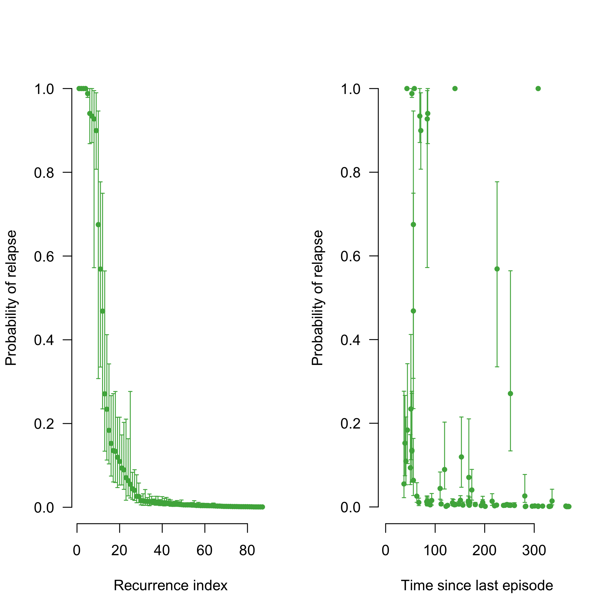<!-- -->


# Extra computations for VHX: too complex episodes


We remove the IDs that can be straightforwardly calculated:


We blow up the pooled analysis into all pairs within individuals:


Construct adjacency graphs and compute probabilities of relapse and reinfection.


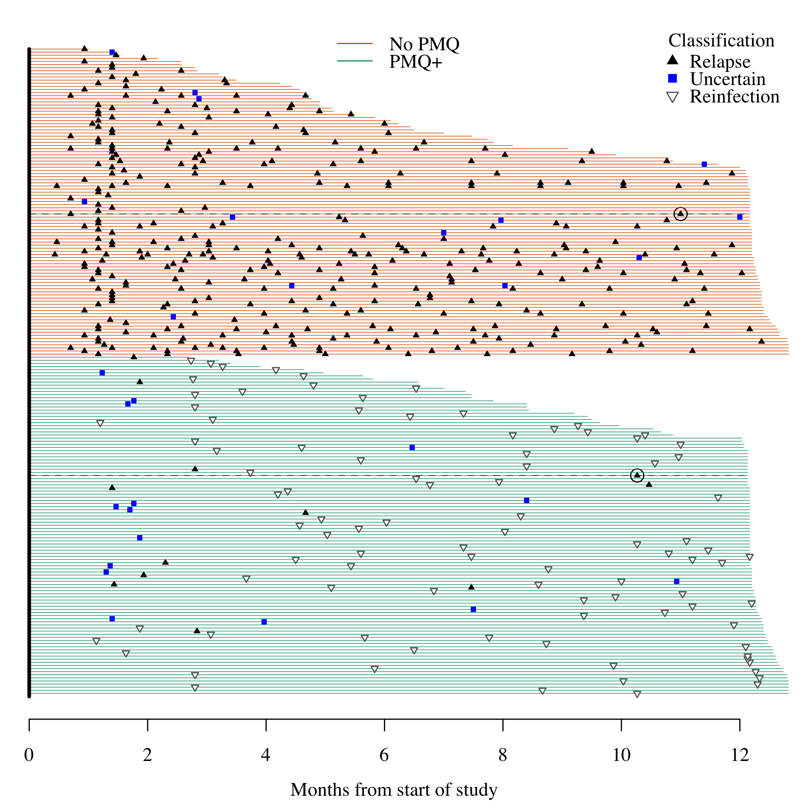<!-- -->

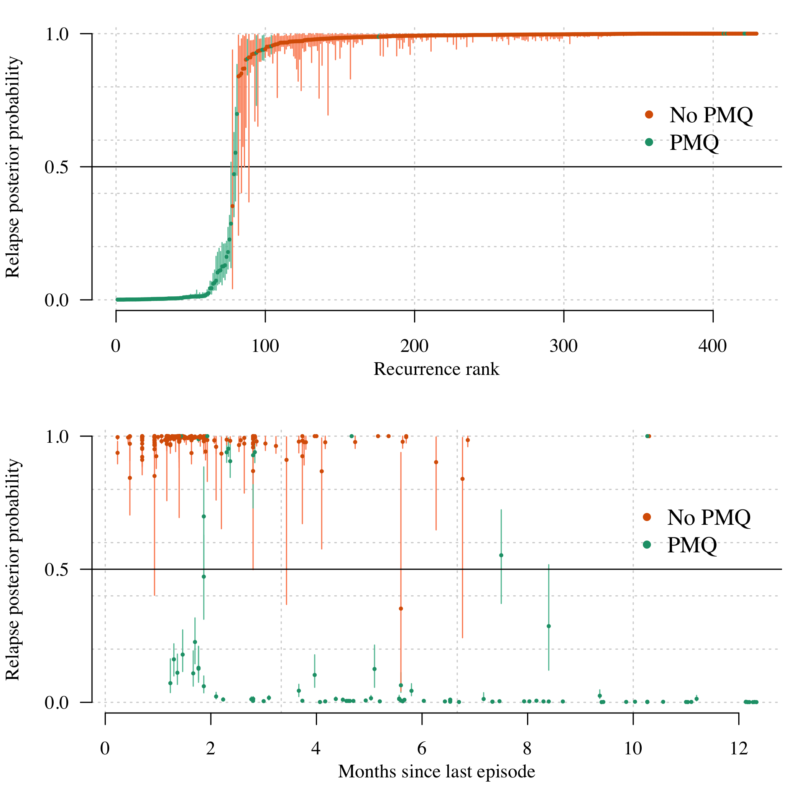<!-- -->
Individuals who appear to relapse very late (more than 300 days after last episode):


```
## The episode ids of interest are: VHX_235_3
## The episode ids of interest are: BPD_27_2
```

```
##          ID       Date MOI_id PV.1.501 PV.3.27 PV.3.502 PV.ms1 PV.ms16
## 60   BPD_27 2012-03-28      1        3      23        7      4       9
## 61   BPD_27 2013-01-30      1        3      23        7      4       9
## 62   BPD_27 2013-01-30      2        3      24        7      4       9
## 313 VHX_235 2010-07-20      1        1       6        1      3      NA
## 314 VHX_235 2010-07-20      2        1       6        1      3      NA
## 315 VHX_235 2010-08-10      1        1       6        2      4      NA
## 316 VHX_235 2011-06-15      1        1       6        2      4      NA
##     PV.ms5 PV.ms6 PV.ms7 PV.ms8 timeSinceEnrolment timeSinceLastEpisode
## 60      11      5      2     13                  0                   NA
## 61      11      5      2     13                308                  308
## 62      11      5      2     13                308                  308
## 313      7      9     NA     12                  0                   NA
## 314      7     12     NA     32                  0                   NA
## 315      7      9     NA     12                 21                   21
## 316      6     12     NA     12                330                  309
##     Episode Episode_Identifier
## 60        1           BPD_27_1
## 61        2           BPD_27_2
## 62        2           BPD_27_2
## 313       1          VHX_235_1
## 314       1          VHX_235_1
## 315       2          VHX_235_2
## 316       3          VHX_235_3
```


The summaries of the final dataset:

```
## 
##  2  3 
## 80 79
```

```
## In chloroquine monotherapy individuals, the weighted average of relapses is 99.4 (97.5-99.9)
```

```
## In chloroquine monotherapy individuals, the weighted average of recrudescences is 0.2 (0.1-0.6)
```

```
## In chloroquine monotherapy individuals, the weighted average of reinfections is 0.4 (0-1.9)
```

```
## In primaquine treated individuals, the weighted average of relapses is 16.7 (14.3-19.4)
```

```
## In primaquine treated individuals, the weighted average of recrudescences is 0 (0-0.4)
```

```
## In primaquine treated individuals, the weighted average of reinfections is 83.3 (80.6-85.2)
```


# False positive rate of relapse

We want to know how often our model estimates evidence of relapse across pairs of episodes when the episodes are in different people (i.e. have not possibility of being a relapse)


The `false-positive' rate is given as

```
## [1] 1.5
```

Merging with the village information


# Analysis of radical cure efficacy in BPD

Almost all episodes in BPD were typed. Therefore we can estimate the true efficacy comparing with historical controls (VHX).


Now we look at whether the PK (carboxy-primaquine) can predict failure:
First we add the carboxy to the dataset:

```
## [1] "BPD_34"
```

We exclude the two recurrences seen in patient BPD_444


```
## Loading required package: lme4
```

```
## Warning: package 'lme4' was built under R version 3.4.4
```

```
## Generalized linear mixed model fit by maximum likelihood (Laplace
##   Approximation) [glmerMod]
##  Family: binomial  ( logit )
## Formula: Failure_YN ~ log10_carboxyPMQ + NumberDaysPMQ + (1 | patientid)
##    Data: Combined_Time_Data[ind_keep, ]
## 
##      AIC      BIC   logLik deviance df.resid 
##    121.8    140.1    -56.9    113.8      717 
## 
## Scaled residuals: 
##     Min      1Q  Median      3Q     Max 
## -0.6000 -0.1321 -0.1111 -0.0964 12.0800 
## 
## Random effects:
##  Groups    Name        Variance Std.Dev.
##  patientid (Intercept) 1e-14    1e-07   
## Number of obs: 721, groups:  patientid, 639
## 
## Fixed effects:
##                  Estimate Std. Error z value Pr(>|z|)    
## (Intercept)       1.71413    1.80008   0.952 0.340970    
## log10_carboxyPMQ -1.65313    0.49917  -3.312 0.000927 ***
## NumberDaysPMQ    -0.12824    0.08859  -1.448 0.147750    
## ---
## Signif. codes:  0 '***' 0.001 '**' 0.01 '*' 0.05 '.' 0.1 ' ' 1
## 
## Correlation of Fixed Effects:
##             (Intr) l10_PM
## lg10_crbPMQ -0.854       
## NumbrDysPMQ -0.730  0.305
```

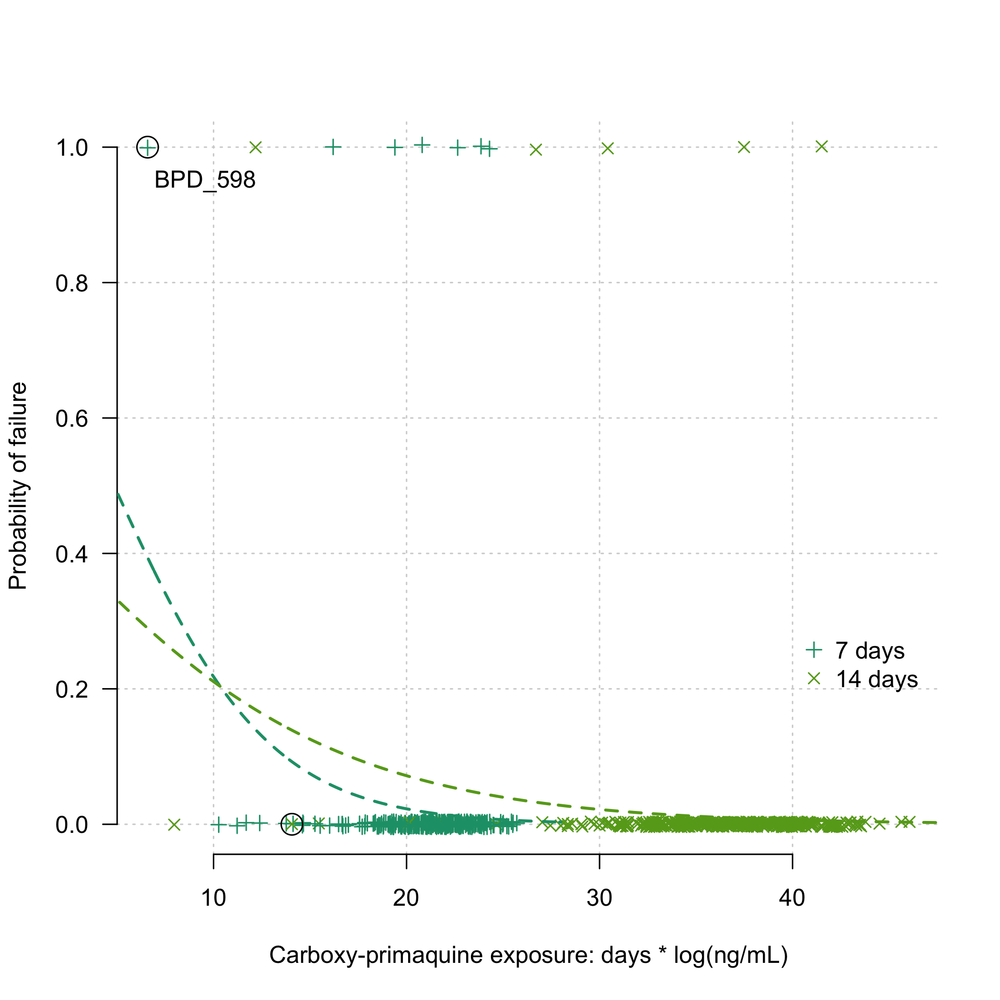<!-- -->

Now we remove outliers and fit the same model (CPMQ outliers)
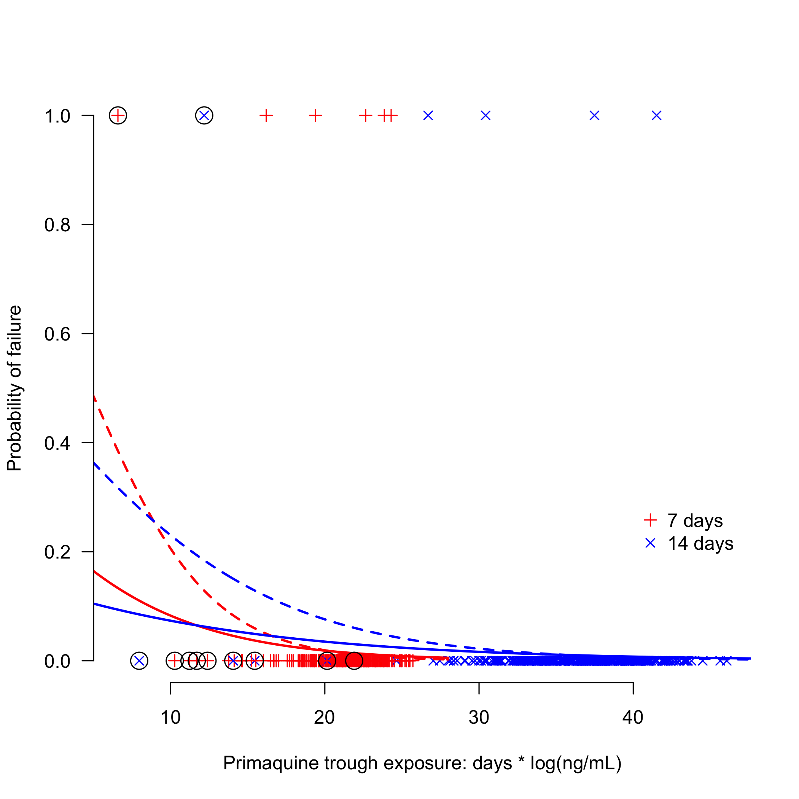<!-- -->

```
## Generalized linear mixed model fit by maximum likelihood (Laplace
##   Approximation) [glmerMod]
##  Family: binomial  ( logit )
## Formula: Failure_YN ~ log10_carboxyPMQ + NumberDaysPMQ + (1 | patientid)
##    Data: Combined_Time_Data[ind_keep & !outliers14 & !outliers7, ]
## 
##      AIC      BIC   logLik deviance df.resid 
##    112.6    130.8    -52.3    104.6      706 
## 
## Scaled residuals: 
##     Min      1Q  Median      3Q     Max 
## -0.1830 -0.1258 -0.1176 -0.1091 10.0147 
## 
## Random effects:
##  Groups    Name        Variance  Std.Dev. 
##  patientid (Intercept) 8.597e-15 9.272e-08
## Number of obs: 710, groups:  patientid, 632
## 
## Fixed effects:
##                  Estimate Std. Error z value Pr(>|z|)
## (Intercept)      -1.51726    3.78244  -0.401    0.688
## log10_carboxyPMQ -0.68942    1.07364  -0.642    0.521
## NumberDaysPMQ    -0.07475    0.11039  -0.677    0.498
## 
## Correlation of Fixed Effects:
##             (Intr) l10_PM
## lg10_crbPMQ -0.964       
## NumbrDysPMQ -0.754  0.566
```

Compare results with and without outliers:

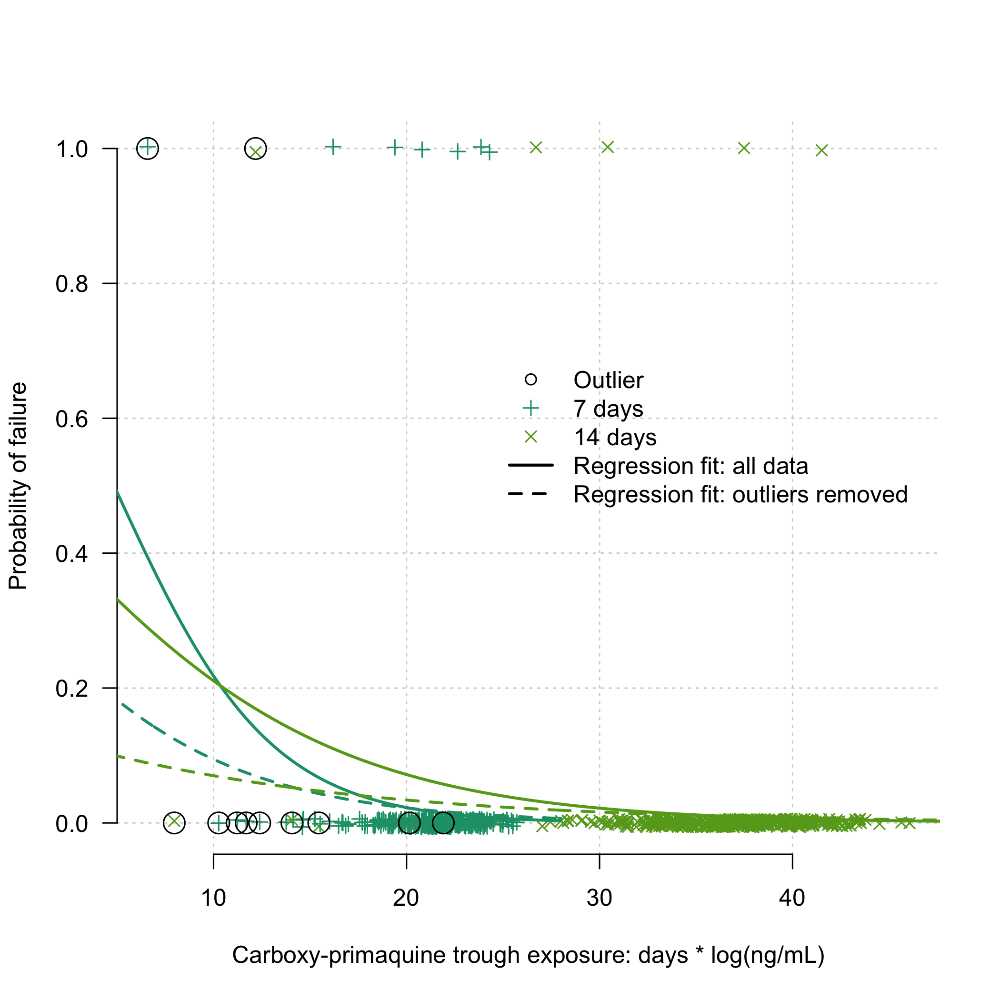<!-- -->

Now we calculate a compressed dataset and failure for each individual


```
## The primaquine failure rate in the 655 individuals is 2.56% (2.02-3.41) over the course of 522 years total follow-up.
```


This won't go into this paper but looking out of interest:

Does 2D6 correlate with carboxy ?


```
## Linear mixed model fit by REML ['lmerMod']
## Formula: log10_carboxyPMQ ~ ASscore + NumberDaysPMQ + (1 | patientid)
##    Data: Combined_Time_Data
## 
## REML criterion at convergence: 190.6
## 
## Scaled residuals: 
##     Min      1Q  Median      3Q     Max 
## -4.6041 -0.2741  0.0758  0.3798  5.0223 
## 
## Random effects:
##  Groups    Name        Variance Std.Dev.
##  patientid (Intercept) 0.07392  0.2719  
##  Residual              0.06576  0.2564  
## Number of obs: 234, groups:  patientid, 154
## 
## Fixed effects:
##                Estimate Std. Error t value
## (Intercept)    3.535077   0.113075  31.263
## ASscore       -0.085651   0.056897  -1.505
## NumberDaysPMQ -0.059412   0.006522  -9.109
## 
## Correlation of Fixed Effects:
##             (Intr) ASscor
## ASscore     -0.697       
## NumbrDysPMQ -0.710  0.055
```

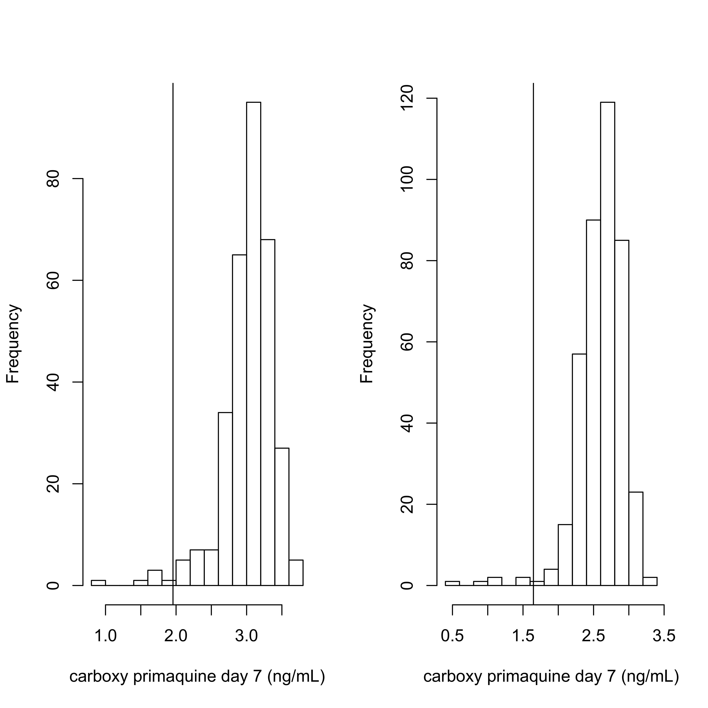<!-- -->


```
## 
## Call:
## glm(formula = Failure_YN ~ ASscore, family = "binomial", data = Combined_2D6data)
## 
## Deviance Residuals: 
##     Min       1Q   Median       3Q      Max  
## -0.6641  -0.5239  -0.4639  -0.4101   2.2439  
## 
## Coefficients:
##             Estimate Std. Error z value Pr(>|z|)  
## (Intercept)  -1.3996     0.7596  -1.843   0.0654 .
## ASscore      -0.5170     0.5785  -0.894   0.3715  
## ---
## Signif. codes:  0 '***' 0.001 '**' 0.01 '*' 0.05 '.' 0.1 ' ' 1
## 
## (Dispersion parameter for binomial family taken to be 1)
## 
##     Null deviance: 80.910  on 113  degrees of freedom
## Residual deviance: 80.129  on 112  degrees of freedom
## AIC: 84.129
## 
## Number of Fisher Scoring iterations: 4
```


