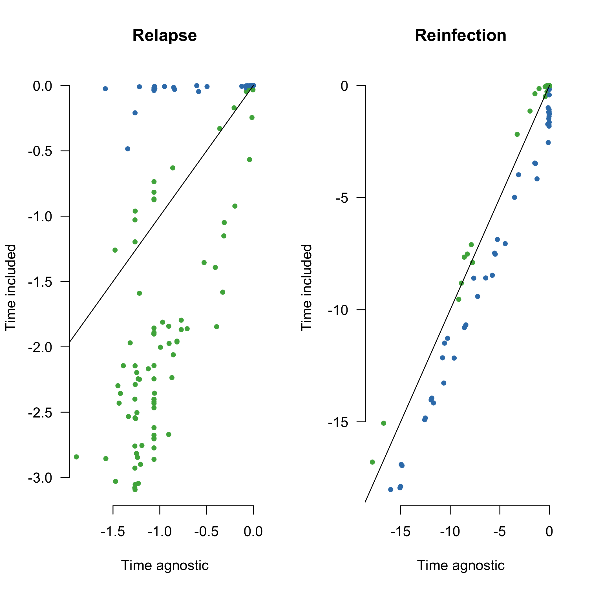
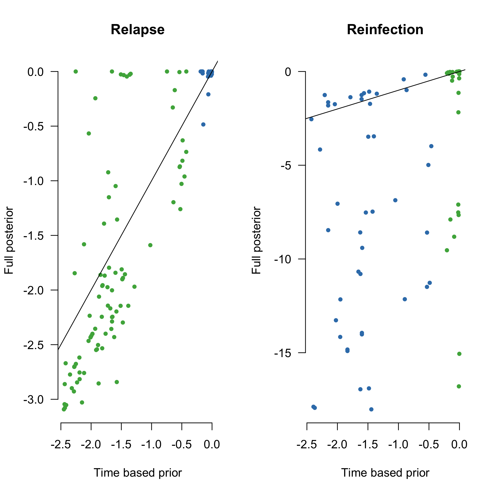
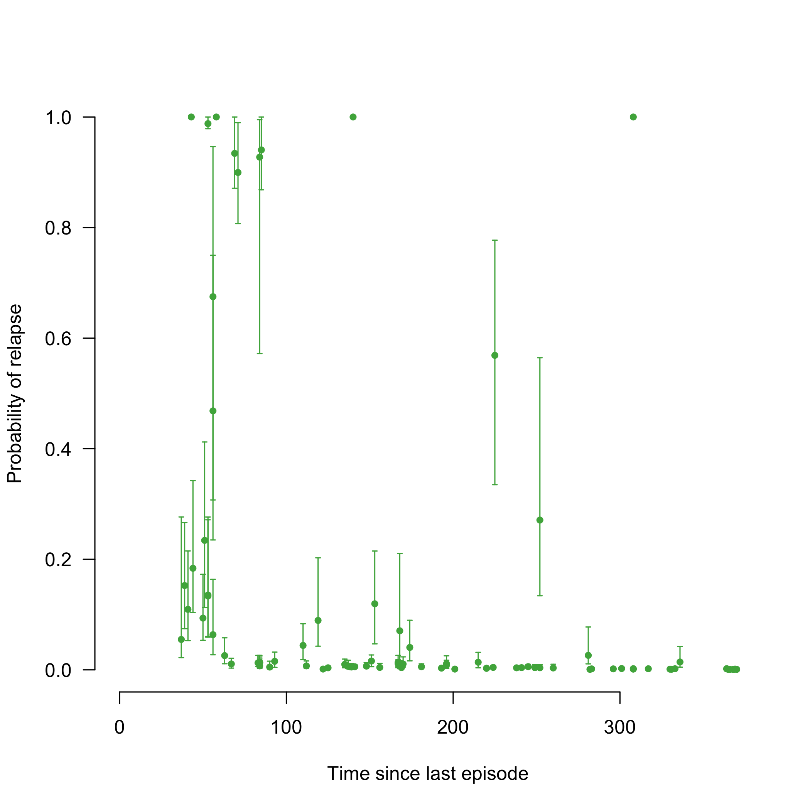

# Preamble

Load R packages, functions and data.


Define the sets of microsatellite markers for the various datasets.


```r
MSs_VHX = c("PV.3.502","PV.3.27","PV.ms8","PV.1.501","PV.ms1","PV.ms5","PV.ms6")
MSs_all = c("PV.3.502","PV.3.27","PV.ms8","PV.1.501","PV.ms1","PV.ms5","PV.ms6",
            "PV.ms7","PV.ms16")
MSs_BPD = MSs_all
MSs_Main = c('PV.3.27', 'PV.3.502', 'PV.ms8') # These are typed for all episodes (the core group)
```


```r
# We also remove MS data for which there are no recurrent data
N_episodes_typed = table(MS_pooled$ID[!duplicated(MS_pooled$Episode_Identifier)])
MS_pooled = filter(MS_pooled, ID %in% names(N_episodes_typed[N_episodes_typed>1]))
```


The approach is fully Bayesian and consists of the following:

* A prior probability vector for the recurrence state
* A likelihood based on the genetic data of being a *relapse*, a *recrudescence*, or a *reinfection* given the observed microsatellite data.

# Allele frequencies

There are a few ways of computing these. A natural first approach is to use the monoclonal data. However, some alleles are only seen in polyclonal infections, rending this approach not viable. A statistically rigorous approach would be to use a model for MS allele frequencies (e.g. Escalante 2015). At the moment we are using the empirical allele frequencies from the a specified dataset, with a Dirichlet-esque weight of 5 (5 pseudo-observations). 
Setting the weight to 0 recovers unweighted empirical allele frequencies. 


```
## Number of episodes used to compute frequencies: 164
```


## Plotting allele frequencies

These are the observed allele frequencies in the pooled data. We show 80% credible intervals (lo)

<!-- -->


# Computing the probability of relatedness across infections

The following iterates through each individual and computes the probability of relatedness states.

## Load the time-to-event priors


```r
inds = grepl('mean_theta', colnames(Mod3_ThetaEstimates)) # Extract mean
Episode_Identifier = Mod3_ThetaEstimates$Episode_Identifier
p = data.frame(Episode_Identifier = Episode_Identifier, Mod3_ThetaEstimates[,inds],
               stringsAsFactors = F) # Reformat
colnames(p) = c('Episode_Identifier', 'C', 'L', 'I')

genetic_AND_time_data_eps = intersect(p$Episode_Identifier, MS_pooled$Episode_Identifier)
p = p[p$Episode_Identifier %in% genetic_AND_time_data_eps,]
Post_samples_matrix = Post_samples_matrix[Post_samples_matrix$Episode_Identifier %in% genetic_AND_time_data_eps,]
```


## Computation using full dataset 

We use all 9MS markers (when available).


### Full posterior computation


# Plot results

These dataframes are sorted by episode number so the columns correspond between them. We make some data.frames that store the results for ease of plotting.


```r
mycols = brewer.pal(n=3, name = 'Set1')
thetas_9MS = arrange(thetas_9MS, Episode_Identifier)
thetas_9MS_Tagnostic = arrange(thetas_9MS_Tagnostic, Episode_Identifier)

Time_Estimates_1 = filter(Mod3_ThetaEstimates, 
                          Episode_Identifier %in% thetas_9MS$Episode_Identifier)
Time_Estimates_1 = arrange(Time_Estimates_1, Episode_Identifier)

thetas_9MS$drug = Time_Estimates_1$arm_num
thetas_9MS_Tagnostic$drug = Time_Estimates_1$arm_num

# for plotting
thetas_9MS$drug_col = mapvalues(x = thetas_9MS$drug, 
                                c('AS','CHQ','CHQ/PMQ'), mycols)
```

```
## The following `from` values were not present in `x`: AS
```

```r
thetas_9MS_Tagnostic$drug_col = mapvalues(x = thetas_9MS_Tagnostic$drug, 
                                          c('AS','CHQ','CHQ/PMQ'), mycols)
```

```
## The following `from` values were not present in `x`: AS
```


## Going from time-to-event prior to posterior

There is some interesting correlation structure here - not quite sure what's happening exactly.
Have broken it down by radical cure and no radical cure, as that is quite a big piece of information!


```r
if(CREATE_PLOTS){
  par(mfrow=c(1,2),las=1, bty='n')
  # Time agnostic versus full posterior 
  plot(log10(thetas_9MS_Tagnostic$L), log10(thetas_9MS$L), 
       col = thetas_9MS$drug_col, main = 'Relapse',pch=20,
       xlab = 'Time agnostic', ylab = 'Time included')
  lines(-10:0,-10:0)
  plot(log10(thetas_9MS_Tagnostic$I), log10(thetas_9MS$I), 
       col=thetas_9MS$drug_col, main = 'Reinfection',pch=20,
       xlab = 'Time agnostic', ylab = 'Time included')
  lines(-20:0,-20:0)
  
  ##### Prior versus full posterior
  plot(log10(Time_Estimates_1$Relapse_mean_theta),
       log10(thetas_9MS$L),main = 'Relapse',
       col=thetas_9MS$drug_col,pch=20,
       xlab = 'Time based prior', ylab = 'Full posterior')
  lines(-10:10,-10:10)
  plot(log10(Time_Estimates_1$ReInfection_mean_theta),
       log10(thetas_9MS$I),main = 'Reinfection',
       col=thetas_9MS$drug_col,pch=20,
       xlab = 'Time based prior', ylab = 'Full posterior')
  lines(-10:10,-10:10)
}
```

<!-- --><!-- -->

Probability of relapse, ordered from most to least likely:

```r
if(CREATE_PLOTS){
  par(las=1, bty='n')
  reLapse_ordered = sort.int(thetas_9MS$L, decreasing = TRUE, index.return = TRUE)
  plot(reLapse_ordered$x, pch=20, col = thetas_9MS$drug_col[reLapse_ordered$ix],
       xlab = 'Recurrence index', ylab = 'Probability of relapse state',
       main = 'Full posterior: reLapse')
  CI = cbind(apply(
    Thetas_full_post[reLapse_ordered$i,grep('L',colnames(Thetas_full_post)),],
    1, quantile, probs = 0.025), 
    apply(Thetas_full_post[reLapse_ordered$i,grep('L',colnames(Thetas_full_post)),],
          1, quantile, probs = 0.975))
  for(i in 1:length(reLapse_ordered$x)){
    if(diff(CI[i,]) > 0.005) arrows(i,CI[i,1],i,CI[i,2], 
                                    length = 0.02,angle = 90, 
                                    code = 3,
                                    col=thetas_9MS$drug_col[reLapse_ordered$ix[i]])
  }
  
  legend('topright',col = mycols[2:3], legend = c('No radical cure','Radical cure'),pch=18)
  
  reLapse_ordered_Tagn = sort.int(thetas_9MS_Tagnostic$L, 
                                  decreasing = TRUE, index.return = TRUE)
  plot(reLapse_ordered_Tagn$x, pch=20, cex=.8,
       col = thetas_9MS_Tagnostic$drug_col[reLapse_ordered_Tagn$ix],
       xlab = 'Recurrence index', ylab = 'Probability of relapse state',
       main = 'Time agnostic posterior: reLapse')
  legend('topright',col = mycols[2:3], 
         legend = c('No radical cure','Radical cure'),pch=18)
}
```

<!-- --><!-- -->

Probability of reinfection, ordered from most to least likely:

```r
if(CREATE_PLOTS){
  
  par(las=1, bty='n')
  reinfection_ordered = sort.int(thetas_9MS$I, decreasing = TRUE, index.return = TRUE)
  plot(reinfection_ordered$x, pch=18, col = thetas_9MS$drug_col[reinfection_ordered$ix],
       xlab = 'Recurrence index', ylab = 'Probability of reinfection state',
       main = 'Full posterior: reInfection')
  legend('topright',col = 1:2, legend = c('No radical cure','Radical cure'),pch=18)
  
  reinfection_ordered_Tagn = sort.int(thetas_9MS_Tagnostic$I, decreasing = TRUE, index.return = TRUE)
  plot(reinfection_ordered_Tagn$x, pch=18, cex=.8,
       col = thetas_9MS_Tagnostic$drug_col[reinfection_ordered_Tagn$ix],
       xlab = 'Recurrence index', ylab = 'Probability of reinfection state',
       main = 'Time agnostic posterior: reInfection')
  legend('topright',col = 1:2, legend = c('No radical cure','Radical cure'),pch=18)
}
```

<!-- --><!-- -->

Probability of recrudescence, ordered from most to least likely:

```r
if(CREATE_PLOTS){
  par(las=1, bty='n')
  recrud_ordered = sort.int(thetas_9MS$C, decreasing = TRUE, index.return = TRUE)
  plot(recrud_ordered$x, pch=18, col = thetas_9MS$drug_col[recrud_ordered$ix],
       xlab = 'Recurrence index', ylab = 'Probability of recrudescence state',
       main = 'Full posterior: reCrudescence')
  legend('topright',col = 1:2, legend = c('No radical cure','Radical cure'),pch=18)
  
  recrud_ordered_Tagn = sort.int(thetas_9MS_Tagnostic$C, decreasing = TRUE, index.return = TRUE)
  plot(recrud_ordered_Tagn$x, pch=18, cex=.8,
       col = thetas_9MS_Tagnostic$drug_col[recrud_ordered_Tagn$ix],
       xlab = 'Recurrence index', ylab = 'Probability of recrudescence state',
       main = 'Time agnostic posterior: reCrudescence')
  legend('topright',col = 1:2, legend = c('No radical cure','Radical cure'),pch=18)
}
```

<!-- --><!-- -->

# BPD Final Plot


```r
BPD_data = Thetas_full_post[grep('BPD',rownames(Thetas_full_post)),]
Thetas_BPD = thetas_9MS[grep('BPD', thetas_9MS$Episode_Identifier),]

par(las=1, bty='n')
reLapse_ordered = sort.int(Thetas_BPD$L, decreasing = TRUE, index.return = TRUE)
plot(reLapse_ordered$x, pch=20, col = Thetas_BPD$drug_col[reLapse_ordered$ix],
     xlab = 'Recurrence index', ylab = 'Probability of relapse state',
     main = '')
CI = cbind(apply(
  BPD_data[reLapse_ordered$ix,grep('L',colnames(BPD_data)),],
  1, quantile, probs = 0.025), 
  apply(BPD_data[reLapse_ordered$ix,grep('L',colnames(BPD_data)),],
        1, quantile, probs = 0.975))
for(i in 1:length(reLapse_ordered$x)){
  if(diff(CI[i,]) > 0.005) arrows(i,CI[i,1],i,CI[i,2], 
                                  length = 0.02,angle = 90, 
                                  code = 3,
                                  col=Thetas_BPD$drug_col[reLapse_ordered$ix[i]])
}
```

<!-- -->

```r
writeLines(sprintf('The mean percentage of recurrences which are estimated to be relapses is %s%%',
                   round(100*sum(Thetas_BPD$L + Thetas_BPD$C)/nrow(Thetas_BPD))))
```

```
## The mean percentage of recurrences which are estimated to be relapses is 15%
```

```r
MS_pooled = MS_pooled[!duplicated(MS_pooled$Episode_Identifier),]

plot(NA,NA,xlim=c(0,max(MS_pooled$timeSinceLastEpisode,na.rm=T)), ylim=c(0,1),
     ylab = 'Probability of relapse', xlab = 'Time since last episode')
for(i in 1:length(reLapse_ordered$x)){
  kk = reLapse_ordered$ix[i]
  x_time = MS_pooled$timeSinceLastEpisode[Thetas_BPD$Episode_Identifier[kk]==
                                          MS_pooled$Episode_Identifier]
  points(x_time,
         Thetas_BPD$L[kk], pch=20, col=mycols[3])
  if(diff(CI[i,]) > 0.005) arrows(x_time,CI[i,1],x_time,CI[i,2], 
                                  length = 0.02,angle = 90, 
                                  code = 3,
                                  col=Thetas_BPD$drug_col[reLapse_ordered$ix[i]])
}
```

<!-- -->


# Extra computations for VHX: too complex episodes


We remove the IDs that can be straightforwardly calculated:

```r
ind_calculated = which(MS_pooled$Episode_Identifier %in% thetas_9MS$Episode_Identifier)
IDs_calculated = unique(MS_pooled$ID[ind_calculated])
IDs_remaining = unique(MS_pooled$ID[! MS_pooled$ID %in% IDs_calculated])
```

We blow up the pooled analysis into all pairs within individuals:


Construct adjacency graphs and compute probabilities of relapse and reinfection.

```r
MS_pooled$L_or_C_state = 
  MS_pooled$ClusterID = 
  MS_pooled$TotalEpisodes = NA

# Arrange by complexity
# Get single rows per episode (throw away the extra MOI information)
MS_inflated = MS_inflated[!duplicated(MS_inflated$Episode_Identifier) & MS_inflated$Episode>1,]
Res$ID_True = MS_inflated$ID_True
Res$First_EpNumber = MS_inflated$First_EpNumber
Res$Second_EpNumber = MS_inflated$Second_EpNumber
MS_inflated$ID = as.factor(MS_inflated$ID)
MS_inflated$NumberClusters = NA

## Threshold value
Epsilons = 0.5

# Iterate through the ones we can calculate in one go
episodes_full_model = unique(Thetas_full_post$Episode_Identifier)
for(ep in episodes_full_model){
  MS_pooled$L_or_C_state[MS_pooled$Episode_Identifier==ep] =
    as.numeric(apply(Thetas_full_post[Thetas_full_post$Episode_Identifier==ep,
                                      grep('L',colnames(Thetas_full_post))],
                     1,quantile, probs=0.5) > Epsilons[1]) + 1
}

Graphs_lower = list()

for(i in 1:length(IDs_remaining)){
  id = IDs_remaining[i]
  Neps = max(MS_inflated$Second_EpNumber[MS_inflated$ID_True==id])
  Adj_Matrix = array(0, dim = c(Neps,Neps))
  diag(Adj_Matrix) = 1/2
  colnames(Adj_Matrix) = 1:Neps
  rownames(Adj_Matrix) = 1:Neps
  # Just looking at reLapse
  Doubles_Thetas = filter(Res, ID_True==id)
  Is = Doubles_Thetas$First_EpNumber
  Js = Doubles_Thetas$Second_EpNumber
  for(k in 1:nrow(Doubles_Thetas)){
    Adj_Matrix[Is[k],Js[k]] = Doubles_Thetas$L_min[k]
  }
  Adj_Matrix = Adj_Matrix + t(Adj_Matrix)
  
  # We're using two Epsilon values to see the uncertain ones
  Adj_Matrix_lower = Adj_Matrix_upper = Adj_Matrix
  Adj_Matrix_lower[ Adj_Matrix < Epsilons[1] ] = 0
  Adj_Matrix_lower[ Adj_Matrix >= Epsilons[1] ] = 1
  Graphs_lower[[i]] = graph_from_adjacency_matrix(Adj_Matrix_lower, 
                                                  mode = "undirected",diag = F)
  
  
  # Add the number of clusters to the non-inflated MS dataset
  MS_pooled$TotalEpisodes[MS_pooled$ID==id] = Neps
  MS_pooled$NumberClusters[MS_pooled$ID==id] = components(Graphs_lower[[i]])$no
  # Add the membership of each cluster
  MS_pooled$ClusterID[MS_pooled$ID==id] = components(Graphs_lower[[i]])$membership
  MS_pooled$L_or_C_state[MS_pooled$ID==id] = as.numeric(duplicated(components(Graphs_lower[[i]])$membership))+1
  
}

MS_pooled$Drug = MS_pooled$FU = NA
for(id in MS_pooled$ID){
  ind = MS_pooled$ID==id
  MS_pooled$TotalEpisodes[ind] = max(MS_pooled$Episode[ind])
  MS_pooled$Drug[ind] = as.numeric(
    Combined_Time_Data$arm_num[Combined_Time_Data$patientid==id][1] == 'CHQ/PMQ') + 2
  MS_pooled$FU[ind] = Combined_Time_Data$FU_time[Combined_Time_Data$patientid==id][1]
}

MS_pooled = arrange(MS_pooled, Drug, desc(FU), desc(TotalEpisodes))
```


```r
## Time series data colored by genetic STATE: classification
mycols_states = c('black','red') # colors for states - need uncertain ones as well
mycols_drugs = brewer.pal(n=3, name = 'Set1')

ids = unique(MS_pooled$ID)

par(las=1, bty='n', cex.axis=.3, mar=c(3,0,1,1))
plot(NA, NA, xlim = c(0,370), ylim = c(1,length(ids)),
     xaxt='n', yaxt='n')
mtext(text = 'Days from start of study', side = 1, line=2, cex=1.3)
axis(1, at = seq(0,370, by=60), cex.axis=1.5)
cc = 0
for(i in 1:length(ids)){
  
  id = ids[i]
  ind = which(MS_pooled$ID==id & MS_pooled$Episode>1)
  Neps = length(ind)
  
  
  lines(c(0,MS_pooled$FU[ind[1]]), 
        c(i,i), lty=1, 
        lwd=.5, col= mycols_drugs[MS_pooled$Drug[ind[1]]])
  if(Neps > 0){
    cols = mycols_states[MS_pooled$L_or_C_state[ind]]
    points(MS_pooled$timeSinceEnrolment[ind], rep(i,Neps), pch=MS_pooled$L_or_C_state[ind]+14, 
           col=cols,cex=.6)
  }
}
```

<!-- -->


