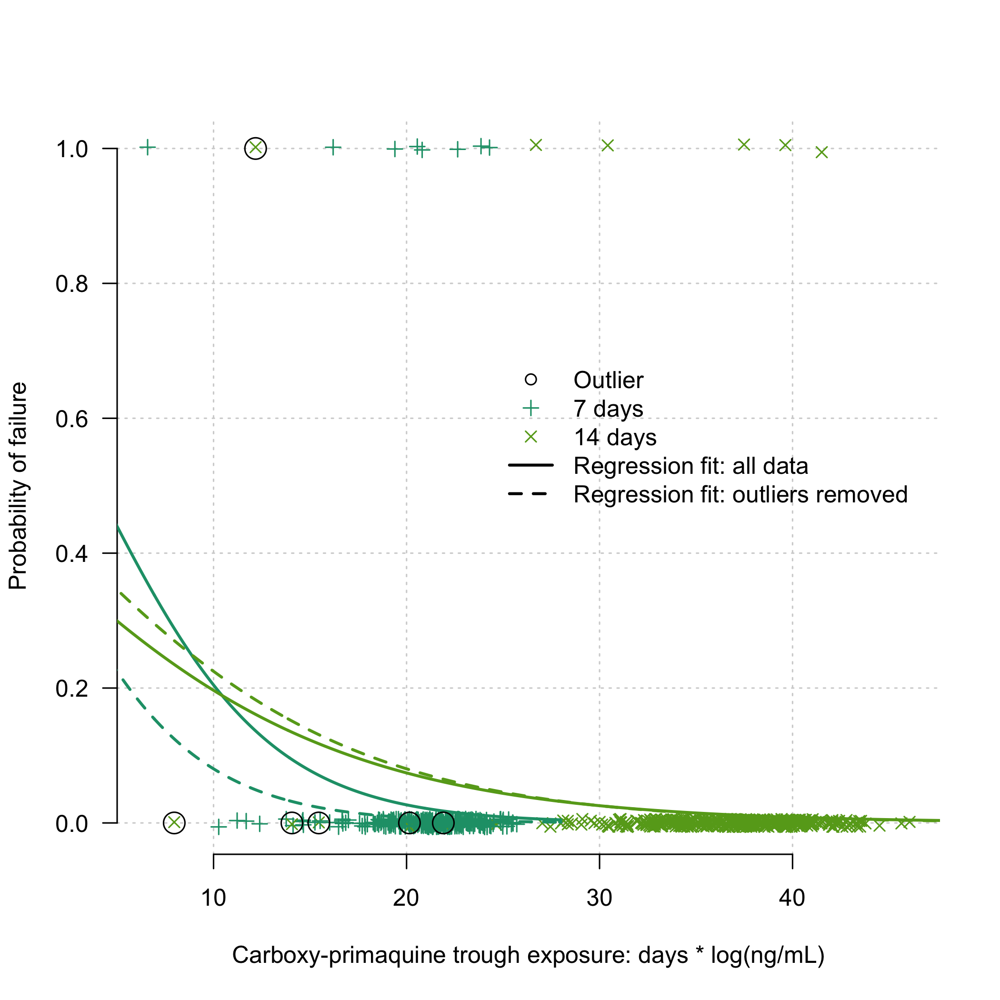

# Preamble

Load R packages, functions and data.


Summary of the data and the whole of the VHX data versus the subset typed (in terms of number of episodes):

```
## Number of individuals with at least one episode typed: 164
```

```
## Number of episodes typed: 599
```

```
## Number of recurrences typed: 435
```

```
## Warning: package 'bindrcpp' was built under R version 3.4.4
```

```
## Number of individuals with at least two episodes typed: 159
```

```
## Number of recurrences typed: 435
```

<!-- -->


Define the sets of microsatellite markers for the various datasets.


The approach is fully Bayesian and consists of the following:

* A prior probability vector for the recurrence state
* A likelihood based on the genetic data of being a *relapse*, a *recrudescence*, or a *reinfection* given the observed microsatellite data.

# Allele frequencies

We use a multinomial-dirichlet model with subjective weight. Setting the weight to 0 recovers unweighted empirical allele frequencies. 


```
## Number of episodes used to compute frequencies: 159
```


## Plotting allele frequencies

These are the observed allele frequencies in the pooled data. We show 80% credible intervals (lo) (Aimee: seems to be 95%)

<!-- -->


# Computing the probability of relatedness across infections

The following iterates through each individual and computes the probability of relatedness states.

## Load the time-to-event priors


## Computation using full dataset 

We use all 9MS markers (when available).


### Full posterior computation


# Plot results

These dataframes are sorted by episode number so the columns correspond between them. We make some data.frames that store the results for ease of plotting.


```
## The following `from` values were not present in `x`: AS
## The following `from` values were not present in `x`: AS
```


## Going from time-to-event prior to posterior

Have broken it down by radical cure and no radical cure, as that is the most informative distinction here.

<!-- -->

Probability of relapse, ordered from most to least likely:
<!-- -->

Probability of reinfection, ordered from most to least likely:
<!-- -->

Probability of recrudescence, ordered from most to least likely:
<!-- -->

# BPD Final Plot


```
## The mean percentage of recurrences which are estimated to be relapses is 15%
```

<!-- -->


# Extra computations for VHX: too complex episodes


We remove the IDs that can be straightforwardly calculated:


We blow up the pooled analysis into all pairs within individuals:


Construct adjacency graphs and compute probabilities of relapse and reinfection.


<!-- -->

<!-- -->
Individuals who appear to relapse very late (more than 300 days after last episode):

```
## The episode ids of interest are: VHX_235_3
## The episode ids of interest are: BPD_27_2
```

```
##          ID       Date MOI_id PV.1.501 PV.3.27 PV.3.502 PV.ms1 PV.ms16
## 60   BPD_27 2012-03-28      1        3      23        7      4       9
## 61   BPD_27 2013-01-30      1        3      23        7      4       9
## 62   BPD_27 2013-01-30      2        3      24        7      4       9
## 313 VHX_235 2010-07-20      1        1       6        1      3      NA
## 314 VHX_235 2010-07-20      2        1       6        1      3      NA
## 315 VHX_235 2010-08-10      1        1       6        2      4      NA
## 316 VHX_235 2011-06-15      1        1       6        2      4      NA
##     PV.ms5 PV.ms6 PV.ms7 PV.ms8 timeSinceEnrolment timeSinceLastEpisode
## 60      11      5      2     13                  0                   NA
## 61      11      5      2     13                308                  308
## 62      11      5      2     13                308                  308
## 313      7      9     NA     12                  0                   NA
## 314      7     12     NA     32                  0                   NA
## 315      7      9     NA     12                 21                   21
## 316      6     12     NA     12                330                  309
##     Episode Episode_Identifier
## 60        1           BPD_27_1
## 61        2           BPD_27_2
## 62        2           BPD_27_2
## 313       1          VHX_235_1
## 314       1          VHX_235_1
## 315       2          VHX_235_2
## 316       3          VHX_235_3
```


The summaries of the final dataset:

```
## 
##  2  3 
## 80 79
```

```
## In chloroquine monotherapy individuals, the weighted average of relapses is 98.7 (96.1-99.8)
```

```
## In chloroquine monotherapy individuals, the weighted average of recrudescences is 0.7 (0.2-1.1)
```

```
## In chloroquine monotherapy individuals, the weighted average of reinfections is 0.7 (0-2.8)
```

```
## In chloroquine+primaquine individuals, the weighted average of relapses is 15.1 (13-17.6)
```

```
## In chloroquine+primaquine individuals, the weighted average of recrudescences is 0.3 (0-0.5)
```

```
## In chloroquine+primaquine individuals, the weighted average of reinfections is 84.6 (82.3-86.5)
```


# False positive rate of relapse

We want to know how often our model estimates evidence of relapse across pairs of episodes when the episodes are in different people (e.g.)


```
## NULL
```


# Analysis of radical cure efficacy in BPD

Almost all episodes in BPD were typed. Therefore we can estimate the true efficacy comparing with historical controls (VHX).


Now we look at whether the PK (carboxy-primaquine) can predict failure:
First we add the carboxy to the dataset:

```
## [1] "BPD_34"
```

We exclude the two recurrences seen in patient BPD_444


```
## Loading required package: lme4
```

```
## Warning: package 'lme4' was built under R version 3.4.4
```

```
## Generalized linear mixed model fit by maximum likelihood (Laplace
##   Approximation) [glmerMod]
##  Family: binomial  ( logit )
## Formula: Failure_YN ~ log10_carboxyPMQ + NumberDaysPMQ + (1 | patientid)
##    Data: Combined_Time_Data[ind_keep, ]
## 
##      AIC      BIC   logLik deviance df.resid 
##    111.7    130.0    -51.9    103.7      717 
## 
## Scaled residuals: 
##     Min      1Q  Median      3Q     Max 
## -0.6235 -0.1240 -0.1033 -0.0877 13.9869 
## 
## Random effects:
##  Groups    Name        Variance Std.Dev.
##  patientid (Intercept) 4e-14    2e-07   
## Number of obs: 721, groups:  patientid, 639
## 
## Fixed effects:
##                  Estimate Std. Error z value Pr(>|z|)    
## (Intercept)       2.37784    1.80708   1.316  0.18822    
## log10_carboxyPMQ -1.80752    0.50118  -3.607  0.00031 ***
## NumberDaysPMQ    -0.16389    0.09316  -1.759  0.07855 .  
## ---
## Signif. codes:  0 '***' 0.001 '**' 0.01 '*' 0.05 '.' 0.1 ' ' 1
## 
## Correlation of Fixed Effects:
##             (Intr) l10_PM
## lg10_crbPMQ -0.848       
## NumbrDysPMQ -0.734  0.302
```

<!-- -->

Now we remove outliers and fit the same model (CPMQ outliers)
<!-- -->

```
## Generalized linear mixed model fit by maximum likelihood (Laplace
##   Approximation) [glmerMod]
##  Family: binomial  ( logit )
## Formula: Failure_YN ~ log10_carboxyPMQ + NumberDaysPMQ + (1 | patientid)
##    Data: Combined_Time_Data[ind_keep & !outliers14 & !outliers7, ]
## 
##      AIC      BIC   logLik deviance df.resid 
##    103.1    121.3    -47.5     95.1      706 
## 
## Scaled residuals: 
##     Min      1Q  Median      3Q     Max 
## -0.2239 -0.1221 -0.1085 -0.0949 12.1470 
## 
## Random effects:
##  Groups    Name        Variance  Std.Dev. 
##  patientid (Intercept) 1.519e-13 3.897e-07
## Number of obs: 710, groups:  patientid, 632
## 
## Fixed effects:
##                  Estimate Std. Error z value Pr(>|z|)
## (Intercept)        0.0649     3.7394   0.017    0.986
## log10_carboxyPMQ  -1.0923     1.0769  -1.014    0.310
## NumberDaysPMQ     -0.1300     0.1138  -1.143    0.253
## 
## Correlation of Fixed Effects:
##             (Intr) l10_PM
## lg10_crbPMQ -0.961       
## NumbrDysPMQ -0.731  0.530
```

Compare results with and without outliers:

<!-- -->

Now we calculate a compressed dataset and failure for each individual


```
## The primaquine failure rate in the 655 individuals is 2.34% (1.84-3.06) over the course of 522 years total follow-up.
```


This won't go into this paper but looking out of interest:

Does 2D6 correlate with carboxy ?


```
## Linear mixed model fit by REML ['lmerMod']
## Formula: log10_carboxyPMQ ~ ASscore + NumberDaysPMQ + (1 | patientid)
##    Data: Combined_Time_Data
## 
## REML criterion at convergence: 190.6
## 
## Scaled residuals: 
##     Min      1Q  Median      3Q     Max 
## -4.6041 -0.2741  0.0758  0.3798  5.0223 
## 
## Random effects:
##  Groups    Name        Variance Std.Dev.
##  patientid (Intercept) 0.07392  0.2719  
##  Residual              0.06576  0.2564  
## Number of obs: 234, groups:  patientid, 154
## 
## Fixed effects:
##                Estimate Std. Error t value
## (Intercept)    3.535077   0.113075  31.263
## ASscore       -0.085651   0.056897  -1.505
## NumberDaysPMQ -0.059412   0.006522  -9.109
## 
## Correlation of Fixed Effects:
##             (Intr) ASscor
## ASscore     -0.697       
## NumbrDysPMQ -0.710  0.055
```

<!-- -->


```
## 
## Call:
## glm(formula = Failure_YN ~ ASscore, family = "binomial", data = Combined_2D6data)
## 
## Deviance Residuals: 
##     Min       1Q   Median       3Q      Max  
## -0.6742  -0.5070  -0.4377  -0.3772   2.3146  
## 
## Coefficients:
##             Estimate Std. Error z value Pr(>|z|)  
## (Intercept)  -1.3658     0.7702  -1.773   0.0762 .
## ASscore      -0.6209     0.5954  -1.043   0.2971  
## ---
## Signif. codes:  0 '***' 0.001 '**' 0.01 '*' 0.05 '.' 0.1 ' ' 1
## 
## (Dispersion parameter for binomial family taken to be 1)
## 
##     Null deviance: 76.721  on 113  degrees of freedom
## Residual deviance: 75.659  on 112  degrees of freedom
## AIC: 79.659
## 
## Number of Fisher Scoring iterations: 5
```


