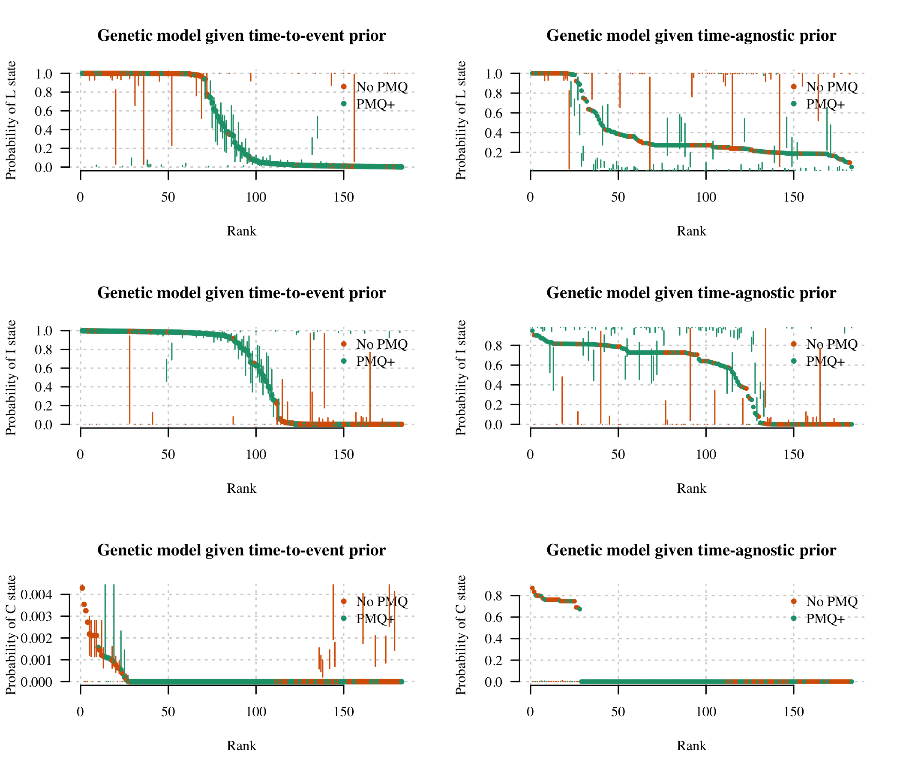

# Preamble

Load R packages, functions and data.


Summary of the data and the whole of the VHX data versus the subset typed (in terms of number of episodes):

```
## Number of individuals with at least one episode typed: 164
```

```
## Number of episodes typed: 599
```

```
## Number of recurrences typed: 435
```

```
## Warning: package 'bindrcpp' was built under R version 3.4.4
```

```
## Number of individuals with at least two episodes typed: 159
```

```
## Number of recurrences typed: 435
```

<!-- -->


Define the sets of microsatellite markers for the various datasets.


```r
MSs_VHX = c("PV.3.502","PV.3.27","PV.ms8","PV.1.501","PV.ms1","PV.ms5","PV.ms6")
MSs_all = c("PV.3.502","PV.3.27","PV.ms8","PV.1.501","PV.ms1","PV.ms5","PV.ms6",
            "PV.ms7","PV.ms16")
MSs_BPD = MSs_all
MSs_Main = c('PV.3.27', 'PV.3.502', 'PV.ms8') # These are typed for all episodes (the core group)
```


The approach is fully Bayesian and consists of the following:

* A prior probability vector for the recurrence state
* A likelihood based on the genetic data of being a *relapse*, a *recrudescence*, or a *reinfection* given the observed microsatellite data.

# Allele frequencies

We use a multinomial-dirichlet model with subjective weight. Setting the weight to 0 recovers unweighted empirical allele frequencies. 


```
## Number of episodes used to compute frequencies: 159
```


## Plotting allele frequencies

These are the observed allele frequencies in the pooled data. We show 80% credible intervals (lo) (Aimee: seems to be 95%)

<!-- -->


# Computing the probability of relatedness across infections

The following iterates through each individual and computes the probability of relatedness states.

## Load the time-to-event priors


```r
inds = grepl('mean_theta', colnames(Mod3_ThetaEstimates)) # Extract mean
Episode_Identifier = Mod3_ThetaEstimates$Episode_Identifier
p = data.frame(Episode_Identifier = Episode_Identifier, Mod3_ThetaEstimates[,inds],
               stringsAsFactors = F) # Reformat
colnames(p) = c('Episode_Identifier', 'C', 'L', 'I')

genetic_AND_time_data_eps = intersect(p$Episode_Identifier, MS_pooled$Episode_Identifier)
p = p[p$Episode_Identifier %in% genetic_AND_time_data_eps,]
Post_samples_matrix = Post_samples_matrix[Post_samples_matrix$Episode_Identifier %in% genetic_AND_time_data_eps,]
```


## Computation using full dataset 

We use all 9MS markers (when available).


### Full posterior computation


# Plot results

These dataframes are sorted by episode number so the columns correspond between them. We make some data.frames that store the results for ease of plotting.


```r
mycols = brewer.pal(n=3, name = 'Set1')
thetas_9MS = arrange(thetas_9MS, Episode_Identifier)
thetas_9MS_Tagnostic = arrange(thetas_9MS_Tagnostic, Episode_Identifier)

Time_Estimates_1 = filter(Mod3_ThetaEstimates, 
                          Episode_Identifier %in% thetas_9MS$Episode_Identifier)
Time_Estimates_1 = arrange(Time_Estimates_1, Episode_Identifier)

thetas_9MS$drug = Time_Estimates_1$arm_num
thetas_9MS_Tagnostic$drug = Time_Estimates_1$arm_num

# for plotting
thetas_9MS$drug_col = mapvalues(x = thetas_9MS$drug, 
                                c('AS','CHQ','CHQ/PMQ'), mycols)
```

```
## The following `from` values were not present in `x`: AS
```

```r
thetas_9MS_Tagnostic$drug_col = mapvalues(x = thetas_9MS_Tagnostic$drug, 
                                          c('AS','CHQ','CHQ/PMQ'), mycols)
```

```
## The following `from` values were not present in `x`: AS
```


```r
BPD_data = Thetas_full_post[grep('BPD',rownames(Thetas_full_post)),]
Thetas_BPD = thetas_9MS[grep('BPD', thetas_9MS$Episode_Identifier),]


# Added by Aimee: some examples
# Colour some specific examples 
example_inds = grepl('_644_', Thetas_BPD$Episode_Identifier) | 
  grepl('BPD_598_', Thetas_BPD$Episode_Identifier) | 
  grepl('BPD_562_', Thetas_BPD$Episode_Identifier) |
  grepl('BPD_53_', Thetas_BPD$Episode_Identifier) 
example_ids = Thetas_BPD$Episode_Identifier[example_inds]
example_inds_times = MS_pooled$timeSinceLastEpisode[MS_pooled$Episode_Identifier %in% example_ids]
Tagnostic_example_inds = thetas_9MS_Tagnostic$Episode_Identifier %in% example_ids
thetas9MS_example_inds = thetas_9MS$Episode_Identifier %in% example_ids
Time1_example_inds = Time_Estimates_1$Episode_Identifier %in% example_ids
```

## Going from time-to-event prior to posterior

Have broken it down by radical cure and no radical cure, as that is the most informative distinction here.


```r
if(CREATE_PLOTS){
  par(mfrow=c(2,2),las=1, bty='n')
  # Time agnostic versus full posterior 
  plot(log10(thetas_9MS_Tagnostic$L), log10(thetas_9MS$L), 
       col = thetas_9MS$drug_col, main = 'Relapse',pch=20,
       xlab = 'Time agnostic', ylab = 'Time included')
  lines(-10:0,-10:0)
  
  # Annotate by examples
  points(x = log10(thetas_9MS_Tagnostic$L[Tagnostic_example_inds]), 
         y = log10(thetas_9MS$L[thetas9MS_example_inds]), 
         pch=1, cex = 1.5, col='black')
  text(x = log10(thetas_9MS_Tagnostic$L[Tagnostic_example_inds]), 
       y = log10(thetas_9MS$L[thetas9MS_example_inds]), 
       labels = example_ids, pos = 2, cex = 0.7)
  
  plot(log10(thetas_9MS_Tagnostic$I), log10(thetas_9MS$I), 
       col=thetas_9MS$drug_col, main = 'Reinfection',pch=20,
       xlab = 'Time agnostic', ylab = 'Time included')
  lines(-20:0,-20:0)
  
  
  ##### Prior versus full posterior
  plot(log10(Time_Estimates_1$Relapse_mean_theta),
       log10(thetas_9MS$L),main = 'Relapse',
       col=thetas_9MS$drug_col,pch=20,
       xlab = 'Time based prior', ylab = 'Full posterior')
  lines(-10:10,-10:10)
  
  # Annotate by examples
  points(x = log10(Time_Estimates_1$Relapse_mean_theta[Time1_example_inds]), 
         y = log10(thetas_9MS$L[thetas9MS_example_inds]), 
         pch=1, cex = 1.5, col='black')
  text(x = log10(Time_Estimates_1$Relapse_mean_theta[Time1_example_inds]), 
       y = log10(thetas_9MS$L[thetas9MS_example_inds]), 
       labels = example_ids, pos = 2, cex = 0.7)
  
  plot(log10(Time_Estimates_1$ReInfection_mean_theta),
       log10(thetas_9MS$I),main = 'Reinfection',
       col=thetas_9MS$drug_col,pch=20,
       xlab = 'Time based prior', ylab = 'Full posterior')
  lines(-10:10,-10:10)
  
}
```

<!-- -->

Probability of relapse, ordered from most to least likely:

```r
if(CREATE_PLOTS){
  
  par(mfrow=c(1,2),las=1, bty='n')
  
  reLapse_ordered = sort.int(thetas_9MS$L, decreasing = TRUE, index.return = TRUE)
  plot(reLapse_ordered$x, pch=20, col = thetas_9MS$drug_col[reLapse_ordered$ix],
       xlab = 'Recurrence index', ylab = 'Probability of relapse state',
       main = 'Full posterior: reLapse')
  CI = cbind(apply(
    Thetas_full_post[reLapse_ordered$i,grep('L',colnames(Thetas_full_post)),],
    1, quantile, probs = 0.025), 
    apply(Thetas_full_post[reLapse_ordered$i,grep('L',colnames(Thetas_full_post)),],
          1, quantile, probs = 0.975))
  for(i in 1:length(reLapse_ordered$x)){
    if(diff(CI[i,]) > 0.005) arrows(i,CI[i,1],i,CI[i,2], 
                                    length = 0.02,angle = 90, 
                                    code = 3,
                                    col=thetas_9MS$drug_col[reLapse_ordered$ix[i]])
  }
  
  legend('topright',col = mycols[2:3], bty = 'n', 
         legend = c('No radical cure','Radical cure'),pch=20)
  
  reLapse_ordered_Tagn = sort.int(thetas_9MS_Tagnostic$L, 
                                  decreasing = TRUE, index.return = TRUE)
  plot(reLapse_ordered_Tagn$x, pch=20, cex=.8,
       col = thetas_9MS_Tagnostic$drug_col[reLapse_ordered_Tagn$ix],
       xlab = 'Recurrence index', ylab = 'Probability of relapse state',
       main = 'Time agnostic posterior: reLapse')
  legend('topright',col = mycols[2:3], bty = 'n', 
         legend = c('No radical cure','Radical cure'),pch=20)
}
```

<!-- -->

Probability of reinfection, ordered from most to least likely:

```r
if(CREATE_PLOTS){
  
  par(mfrow=c(1,2),las=1, bty='n')
  reinfection_ordered = sort.int(thetas_9MS$I, decreasing = TRUE, index.return = TRUE)
  plot(reinfection_ordered$x, pch=20, col = thetas_9MS$drug_col[reinfection_ordered$ix],
       xlab = 'Recurrence index', ylab = 'Probability of reinfection state',
       main = 'Full posterior: reInfection')
  legend('topright',col = mycols[2:3],bty = 'n',  
         legend = c('No radical cure','Radical cure'),pch=20)
  
  reinfection_ordered_Tagn = sort.int(thetas_9MS_Tagnostic$I, decreasing = TRUE, index.return = TRUE)
  plot(reinfection_ordered_Tagn$x, pch=20, cex=.8,
       col = thetas_9MS_Tagnostic$drug_col[reinfection_ordered_Tagn$ix],
       xlab = 'Recurrence index', ylab = 'Probability of reinfection state',
       main = 'Time agnostic posterior: reInfection')
  legend('topright',col = mycols[2:3],bty = 'n',  
         legend = c('No radical cure','Radical cure'),pch=20)
}
```

<!-- -->

Probability of recrudescence, ordered from most to least likely:

```r
if(CREATE_PLOTS){
  par(mfrow=c(1,2),las=1, bty='n')
  recrud_ordered = sort.int(thetas_9MS$C, decreasing = TRUE, index.return = TRUE)
  plot(recrud_ordered$x, pch=20, col = thetas_9MS$drug_col[recrud_ordered$ix],
       xlab = 'Recurrence index', ylab = 'Probability of recrudescence state',
       main = 'Full posterior: reCrudescence')
  legend('topright',col = mycols[2:3],bty = 'n',  
         legend = c('No radical cure','Radical cure'),pch=20)
  
  recrud_ordered_Tagn = sort.int(thetas_9MS_Tagnostic$C, decreasing = TRUE, index.return = TRUE)
  plot(recrud_ordered_Tagn$x, pch=20, cex=.8,
       col = thetas_9MS_Tagnostic$drug_col[recrud_ordered_Tagn$ix],
       xlab = 'Recurrence index', ylab = 'Probability of recrudescence state',
       main = 'Time agnostic posterior: reCrudescence')
  legend('topright',col = mycols[2:3],bty = 'n',  
         legend = c('No radical cure','Radical cure'),pch=20)
}
```

<!-- -->

# BPD Final Plot


```r
if(CREATE_PLOTS){
  
  # Get rid of duplicated episode IDs (MOI > 1)
  MS_pooled_summary = MS_pooled[!duplicated(MS_pooled$Episode_Identifier),]
  par(mfrow=c(1,2),las=1, bty='n')
  reLapse_ordered = sort.int(Thetas_BPD$L, decreasing = TRUE, index.return = TRUE)
  plot(reLapse_ordered$x, pch=20, col = Thetas_BPD$drug_col[reLapse_ordered$ix],
       xlab = 'Recurrence index', ylab = 'Probability of relapse',
       main = '')
  CI = cbind(apply(
    BPD_data[reLapse_ordered$ix,grep('L',colnames(BPD_data)),],
    1, quantile, probs = 0.025), 
    apply(BPD_data[reLapse_ordered$ix,grep('L',colnames(BPD_data)),],
          1, quantile, probs = 0.975))
  for(i in 1:length(reLapse_ordered$x)){
    if(diff(CI[i,]) > 0.005) arrows(i,CI[i,1],i,CI[i,2], 
                                    length = 0.02,angle = 90, 
                                    code = 3,
                                    col=Thetas_BPD$drug_col[reLapse_ordered$ix[i]])
  }
  
  
  
  writeLines(sprintf('The mean percentage of recurrences which are estimated to be relapses is %s%%',
                     round(100*sum(Thetas_BPD$L + Thetas_BPD$C)/nrow(Thetas_BPD))))
  
  
  plot(NA,NA,xlim=c(0,max(MS_pooled_summary$timeSinceLastEpisode,na.rm=T)), ylim=c(0,1),
       ylab = 'Probability of relapse', xlab = 'Time since last episode')
  for(i in 1:length(reLapse_ordered$x)){
    kk = reLapse_ordered$ix[i]
    x_time = MS_pooled_summary$timeSinceLastEpisode[Thetas_BPD$Episode_Identifier[kk]==
                                                      MS_pooled_summary$Episode_Identifier]
    points(x_time,
           Thetas_BPD$L[kk], pch=20, col=mycols[3])
    if(diff(CI[i,]) > 0.005) arrows(x_time,CI[i,1],x_time,CI[i,2], 
                                    length = 0.02,angle = 90, 
                                    code = 3,
                                    col=Thetas_BPD$drug_col[reLapse_ordered$ix[i]])
  }
  
  # Annotate by examples
  # points(example_inds_times,Thetas_BPD$L[example_inds], pch=1, cex = 1.5, col='black')
  # text(x = example_inds_times, y = Thetas_BPD$L[example_inds], 
  #      labels = example_ids, pos =3)
}
```

```
## The mean percentage of recurrences which are estimated to be relapses is 15%
```

<!-- -->


# Extra computations for VHX: too complex episodes


We remove the IDs that can be straightforwardly calculated:

```r
ind_calculated = which(MS_pooled_summary$Episode_Identifier %in% thetas_9MS$Episode_Identifier)
IDs_calculated = unique(MS_pooled_summary$ID[ind_calculated])
IDs_remaining = unique(MS_pooled_summary$ID[! MS_pooled_summary$ID %in% IDs_calculated])
```

We blow up the pooled analysis into all pairs within individuals:


Construct adjacency graphs and compute probabilities of relapse and reinfection.

```r
MS_pooled_summary$L_or_C_state = MS_pooled_summary$TotalEpisodes = NA
MS_pooled_summary$L_lower = MS_pooled_summary$L_upper = MS_pooled_summary$L_mean = NA
MS_pooled_summary$C_lower = MS_pooled_summary$C_upper = MS_pooled_summary$C_mean = NA
MS_pooled_summary$I_lower = MS_pooled_summary$I_upper = MS_pooled_summary$I_mean = NA
# Arrange by complexity
# Get single rows per episode (throw away the extra MOI information)
MS_inflated = MS_inflated[!duplicated(MS_inflated$Episode_Identifier) & MS_inflated$Episode>1,]
Res$ID_True = MS_inflated$ID_True
Res$First_EpNumber = MS_inflated$First_EpNumber
Res$Second_EpNumber = MS_inflated$Second_EpNumber


## Threshold value for classification
Epsilon = 0.5

# Iterate through the ones we can calculate in one go
episodes_full_model = unique(Thetas_full_post$Episode_Identifier)
cols_remove = grep('Episode_Identifier', colnames(Thetas_full_post))
Thetas_full_post = Thetas_full_post[, -cols_remove]
for(ep in episodes_full_model){
  ind1 = (MS_pooled_summary$Episode_Identifier==ep)
  ind2 = rownames(Thetas_full_post)==ep
  
  ## Summaries for relapse
  MS_pooled_summary$L_upper[ind1] = quantile(unlist(Thetas_full_post[ind2, grep('L',colnames(Thetas_full_post))]),
                                             probs=0.9)
  MS_pooled_summary$L_lower[ind1] = quantile(unlist(Thetas_full_post[ind2, grep('L',colnames(Thetas_full_post))]),
                                             probs=0.1)
  MS_pooled_summary$L_mean[ind1] = quantile(unlist(Thetas_full_post[ind2, grep('L',colnames(Thetas_full_post))]),
                                            probs=0.5)
  
  ## Summaries for recrudescence
  MS_pooled_summary$C_upper[ind1] = quantile(unlist(Thetas_full_post[ind2, grep('C',colnames(Thetas_full_post))]),
                                             probs=0.9)
  MS_pooled_summary$C_lower[ind1] = quantile(unlist(Thetas_full_post[ind2, grep('C',colnames(Thetas_full_post))]),
                                             probs=0.1)
  MS_pooled_summary$C_mean[ind1] = quantile(unlist(Thetas_full_post[ind2, grep('C',colnames(Thetas_full_post))]),
                                            probs=0.5)
  
  ## Summaries for reinfection
  MS_pooled_summary$I_upper[ind1] = quantile(unlist(Thetas_full_post[ind2, grep('I',colnames(Thetas_full_post))]),
                                             probs=0.9)
  MS_pooled_summary$I_lower[ind1] = quantile(unlist(Thetas_full_post[ind2, grep('I',colnames(Thetas_full_post))]),
                                             probs=0.1)
  MS_pooled_summary$I_mean[ind1] = quantile(unlist(Thetas_full_post[ind2, grep('I',colnames(Thetas_full_post))]),
                                            probs=0.5)
  
  # Just going to classify on relapse versus reinfection
  if(MS_pooled_summary$L_upper[ind1] < Epsilon){
    MS_pooled_summary$L_or_C_state[ind1] = 'I'
  } else if(MS_pooled_summary$L_lower[ind1] > Epsilon){
    MS_pooled_summary$L_or_C_state[ind1] = 'L'
  } else if(MS_pooled_summary$L_upper[ind1] > Epsilon & MS_pooled_summary$L_lower[ind1] < Epsilon){
    MS_pooled_summary$L_or_C_state[ind1] = 'Uncertain'
  }
}

for(i in 1:length(IDs_remaining)){
  id = IDs_remaining[i]
  Doubles_Thetas = filter(Res, ID_True==id)
  
  for(ep in unique(Doubles_Thetas$Second_EpNumber)){
    ind1 = which(MS_pooled_summary$ID==id & MS_pooled_summary$Episode==ep)
    ind2 = which(Doubles_Thetas$Second_EpNumber == ep)
    
    MS_pooled_summary$L_lower[ind1] = mean(Doubles_Thetas$L_min[ind2])
    MS_pooled_summary$L_upper[ind1] = mean(Doubles_Thetas$L_max[ind2])
    MS_pooled_summary$L_mean[ind1] = mean(Doubles_Thetas$L_mean[ind2])
    
    MS_pooled_summary$C_lower[ind1] = mean(Doubles_Thetas$C_min[ind2])
    MS_pooled_summary$C_upper[ind1] = mean(Doubles_Thetas$C_max[ind2])
    MS_pooled_summary$C_mean[ind1] = mean(Doubles_Thetas$C_mean[ind2])
    
    MS_pooled_summary$I_lower[ind1] = mean(Doubles_Thetas$I_min[ind2])
    MS_pooled_summary$I_upper[ind1] = mean(Doubles_Thetas$I_max[ind2])
    MS_pooled_summary$I_mean[ind1] = mean(Doubles_Thetas$I_mean[ind2])
    
    if(!is.na(MS_pooled_summary$L_upper[ind1])){
      if(MS_pooled_summary$L_upper[ind1] < MS_pooled_summary$L_lower[ind1]){
        print(id)
      }
      if(MS_pooled_summary$L_upper[ind1] < Epsilon){
        MS_pooled_summary$L_or_C_state[ind1] = 'I'
      }
      if(MS_pooled_summary$L_lower[ind1] > Epsilon){
        MS_pooled_summary$L_or_C_state[ind1] = 'L'
      }
      if(MS_pooled_summary$L_upper[ind1] > Epsilon & 
         MS_pooled_summary$L_lower[ind1] < Epsilon){
        MS_pooled_summary$L_or_C_state[ind1] = 'Uncertain'
      }
    }
  }
  
}

MS_pooled_summary$Drug = MS_pooled_summary$FU = NA
for(id in MS_pooled_summary$ID){
  ind = MS_pooled_summary$ID==id
  MS_pooled_summary$TotalEpisodes[ind] = max(MS_pooled_summary$Episode[ind])
  MS_pooled_summary$Drug[ind] = as.numeric(
    Combined_Time_Data$arm_num[Combined_Time_Data$patientid==id][1] == 'CHQ/PMQ') + 2
  MS_pooled_summary$FU[ind] = Combined_Time_Data$FU_time[Combined_Time_Data$patientid==id][1]
}

MS_pooled_summary$Plotting_pch_Values = 
  as.numeric(mapvalues(MS_pooled_summary$L_or_C_state, 
                       from = c('L','Uncertain','I'), to = 15:17))
MS_pooled_summary$Plotting_col_Values = 
  as.numeric(mapvalues(MS_pooled_summary$L_or_C_state, 
                       from = c('L','Uncertain','I'), to = 1:3))
```


```r
if(CREATE_PLOTS){
  ## Time series data colored by genetic STATE: classification
  mycols_states = c('red','yellow','black') # colors for states - need uncertain ones as well
  mycols_drugs = brewer.pal(n=3, name = 'Set1')
  
  # Only the recurrences for which we can compute estimates of recurrence state
  MS_final = filter(MS_pooled_summary, !is.na(L_mean))
  MS_final = arrange(MS_final, desc(Drug), desc(FU), desc(TotalEpisodes))
  ids = unique(MS_final$ID)
  
  par(las=1, bty='n', cex.axis=.3, mar=c(3,0,1,1))
  plot(NA, NA, xlim = c(0,370), ylim = c(1,length(ids)),
       xaxt='n', yaxt='n')
  mtext(text = 'Days from start of study', side = 1, line=2, cex=1.3)
  axis(1, at = seq(0,370, by=60), cex.axis=1.5)
  
  for(i in 1:length(ids)){
    
    id = ids[i]
    ind = which(MS_final$ID==id)
    
    # Add the follow up time line
    lines(c(0,MS_final$FU[ind[1]]), 
          c(i,i), lty=1, 
          lwd=.5, col= mycols_drugs[MS_final$Drug[ind[1]]])
    
    cols = mycols_states[MS_final$Plotting_col_Values[ind]]
    points(MS_final$timeSinceEnrolment[ind], rep(i,length(ind)), 
           pch=MS_final$Plotting_pch_Values[ind], 
           col=cols,cex=.6)
    
    # For highlighting long-latency
    # Add the follow up time line
    if(id == 'VHX_235' | id == 'BPD_27'){
      lines(c(0,MS_final$FU[ind[1]]), 
            c(i,i), lty = 'dashed', 
            lwd=.5, col= 'black')
      
      cols = mycols_states[MS_final$Plotting_col_Values[ind]]
      points(MS_final$timeSinceEnrolment[ind], rep(i,length(ind)), 
             pch=1, 
             col='black',cex=1)}
    
  }
  lines(x = c(0,0), y = c(0,length(ids)),lwd=3)
  # Hacky colour legend
  legend('topright', col = c('red', 'black', 'yellow',mycols_drugs[2:3]), 
         pch = c(15,17,16, NA,NA), cex = 0.7, bty = 'n', 
         lty = c(NA,NA,NA,1,1), lwd = c(NA,NA,NA,2,2),
         legend = c('Classified relapse', 'Classified reinfection', 'Uncertain',
                    'No radical cure', 'Radical cure'))
}
```

<!-- -->


```r
if(CREATE_PLOTS){
  par(las=1, mfcol = c(2,1), mar=c(3,4,1,1), bty='n')
  MS_final = arrange(MS_final, L_mean)
  plot(1:nrow(MS_final), MS_final$L_mean,
       col = mycols_drugs[MS_final$Drug], 
       pch=20, cex=.3, yaxt='n', ylab='')
  axis(2, at = c(0,.5,1))
  polygon(c(1:nrow(MS_final), rev(1:nrow(MS_final))), 
          y = c(MS_final$L_lower,
                rev(MS_final$L_upper)), 
          border = NA, col = rgb(1, 0, 0,0.5))
  points(1:nrow(MS_final), MS_final$L_mean, 
         col = mycols_drugs[MS_final$Drug], 
         pch=20, cex=.5)
  mtext(side = 1, text = 'Recurrence index', line = 2)
  mtext(side = 2, text = 'Relapse probability', line = 3,las=3)
  legend('bottomright', col = mycols_drugs[2:3], 
         pch = 20, cex = 1.3, bty = 'n', 
         legend = c('No radical cure','Radical cure'))
  
  plot(MS_final$timeSinceLastEpisode, MS_final$L_mean,
       col = mycols_drugs[MS_final$Drug], 
       pch=20, cex=.51, xlab = '',yaxt='n',
       ylab = '')
  axis(2, at = c(0,.5,1))
  for(i in 1:nrow(MS_final)){
    
    if(abs(MS_final$L_upper[i] - MS_final$L_lower[i]) > 0.005){
      arrows(x0 = MS_final$timeSinceLastEpisode[i],
             y0 = MS_final$L_lower[i],
             x1=MS_final$timeSinceLastEpisode[i],
             y1 = MS_final$L_upper[i],
             length = 0.02,angle = 90, 
             code = 3,
             col=mycols_drugs[MS_final$Drug[i]])
    }
    i=i+1
  }
  mtext(side = 1, text = 'Days since last episode', line = 2)
  mtext(side = 2, text = 'Relapse probability', line = 3,las=3)
}
```

<!-- -->
Individuals who appear to relapse very late (more than 300 days after last episode):

```r
MS_pooled = reformat_MSdata(MS_pooled)
IDs_late_relapse = MS_final[which(MS_final$timeSinceLastEpisode>300 & MS_final$L_lower>.9),'ID']

writeLines(sprintf('The episode ids of interest are: %s',
                   MS_final[which(MS_final$timeSinceLastEpisode>300 & MS_final$L_lower>.9),
                            'Episode_Identifier']))
```

```
## The episode ids of interest are: VHX_235_3
## The episode ids of interest are: BPD_27_2
```

```r
library(knitr)
#ColorPlot_MSdata(MS_data = MS_pooled[MS_pooled$ID%in%IDs_late_relapse,])

print( MS_pooled[MS_pooled$ID%in%IDs_late_relapse,])
```

```
##          ID       Date MOI_id PV.1.501 PV.3.27 PV.3.502 PV.ms1 PV.ms16
## 60   BPD_27 2012-03-28      1        3      23        7      4       9
## 61   BPD_27 2013-01-30      1        3      23        7      4       9
## 62   BPD_27 2013-01-30      2        3      24        7      4       9
## 313 VHX_235 2010-07-20      1        1       6        1      3      NA
## 314 VHX_235 2010-07-20      2        1       6        1      3      NA
## 315 VHX_235 2010-08-10      1        1       6        2      4      NA
## 316 VHX_235 2011-06-15      1        1       6        2      4      NA
##     PV.ms5 PV.ms6 PV.ms7 PV.ms8 timeSinceEnrolment timeSinceLastEpisode
## 60      11      5      2     13                  0                   NA
## 61      11      5      2     13                308                  308
## 62      11      5      2     13                308                  308
## 313      7      9     NA     12                  0                   NA
## 314      7     12     NA     32                  0                   NA
## 315      7      9     NA     12                 21                   21
## 316      6     12     NA     12                330                  309
##     Episode Episode_Identifier
## 60        1           BPD_27_1
## 61        2           BPD_27_2
## 62        2           BPD_27_2
## 313       1          VHX_235_1
## 314       1          VHX_235_1
## 315       2          VHX_235_2
## 316       3          VHX_235_3
```


The summaries of the final dataset:

```r
table(MS_final$Drug[!duplicated(MS_final$ID)]) # James, this sums to 159 - surely should sum to 164? Have we lost 5 people somewhere? 
```

```
## 
##  2  3 
## 80 79
```

```r
# Yes: gotten rid of the 5 people who don't have recurrent episodes

ind_CQ = MS_final$Drug==2
writeLines(sprintf('In chloroquine monotherapy individuals, the weighted average of relapses is %s (%s-%s)',
                   round(100*sum(MS_final$L_mean[ind_CQ])/sum(ind_CQ),1),
                   round(100*sum(MS_final$L_lower[ind_CQ])/sum(ind_CQ),1),
                   round(100*sum(MS_final$L_upper[ind_CQ])/sum(ind_CQ),1)))
```

```
## In chloroquine monotherapy individuals, the weighted average of relapses is 98.6 (96-99.8)
```

```r
writeLines(sprintf('In chloroquine monotherapy individuals, the weighted average of recrudescences is %s (%s-%s)',
                   round(100*sum(MS_final$C_mean[ind_CQ],na.rm=T)/sum(ind_CQ),1),
                   round(100*sum(MS_final$C_lower[ind_CQ],na.rm=T)/sum(ind_CQ),1),
                   round(100*sum(MS_final$C_upper[ind_CQ],na.rm=T)/sum(ind_CQ),1)))
```

```
## In chloroquine monotherapy individuals, the weighted average of recrudescences is 0.7 (0.2-1.1)
```

```r
writeLines(sprintf('In chloroquine monotherapy individuals, the weighted average of reinfections is %s (%s-%s)',
                   round(100*sum(MS_final$I_mean[ind_CQ],na.rm=T)/sum(ind_CQ),1),
                   round(100*sum(MS_final$I_lower[ind_CQ],na.rm=T)/sum(ind_CQ),1),
                   round(100*sum(MS_final$I_upper[ind_CQ],na.rm=T)/sum(ind_CQ),1)))
```

```
## In chloroquine monotherapy individuals, the weighted average of reinfections is 0.7 (0-2.9)
```

```r
ind_PMQ = MS_final$Drug==3
writeLines(sprintf('In chloroquine+primaquine individuals, the weighted average of relapses is %s (%s-%s)',
                   round(100*sum(MS_final$L_mean[ind_PMQ])/sum(ind_PMQ),1),
                   round(100*sum(MS_final$L_lower[ind_PMQ])/sum(ind_PMQ),1),
                   round(100*sum(MS_final$L_upper[ind_PMQ])/sum(ind_PMQ),1)))
```

```
## In chloroquine+primaquine individuals, the weighted average of relapses is 15 (12.8-17.4)
```

```r
writeLines(sprintf('In chloroquine+primaquine individuals, the weighted average of recrudescences is %s (%s-%s)',
                   round(100*sum(MS_final$C_mean[ind_PMQ],na.rm=T)/sum(ind_PMQ),1),
                   round(100*sum(MS_final$C_lower[ind_PMQ],na.rm=T)/sum(ind_PMQ),1),
                   round(100*sum(MS_final$C_upper[ind_PMQ],na.rm=T)/sum(ind_PMQ),1)))
```

```
## In chloroquine+primaquine individuals, the weighted average of recrudescences is 0.3 (0-0.5)
```

```r
writeLines(sprintf('In chloroquine+primaquine individuals, the weighted average of reinfections is %s (%s-%s)',
                   round(100*sum(MS_final$I_mean[ind_PMQ],na.rm=T)/sum(ind_PMQ),1),
                   round(100*sum(MS_final$I_lower[ind_PMQ],na.rm=T)/sum(ind_PMQ),1),
                   round(100*sum(MS_final$I_upper[ind_PMQ],na.rm=T)/sum(ind_PMQ),1)))
```

```
## In chloroquine+primaquine individuals, the weighted average of reinfections is 84.7 (82.5-86.7)
```


# False positive rate of relapse

We want to know how often our model estimates evidence of relapse across pairs of episodes when the episodes are in different people (e.g.)


```r
if(RUN_MODELS_CLUSTER_INFLATED){
  # The pooled MS data from BPD and VHX
  load('../RData/GeneticModel/MS_data_PooledAnalysis.RData')
  tic()
  APC_MS_data = Make_All_Pairwise_Comparisons(MS_data = MS_pooled, ncores=42)
  save(APC_MS_data, file = 'APC_MS_data.bigRData')
  toc()
  Inflated_Results = post_prob_CLI(MS_data = APC_MS_data, 
                                   Fs = Fs_Combined, 
                                   UpperComplexity = 10^6, 
                                   verbose = F,
                                   cores = 42)
  save(Inflated_Results, file = 'Inflated_Results.bigRData')
  
} else {
  # load('Inflated_Results.bigRData')
  # load('APC_MS_data.bigRData')
}
```

```
## NULL
```


# Analysis of radical cure efficacy in BPD

Almost all episodes in BPD were typed. Therefore we can estimate the true efficacy comparing with historical controls (VHX).


```r
BPD_data = Combined_Time_Data[grep('BPD', Combined_Time_Data$patientid),]
hist(table(BPD_data$patientid),breaks = seq(0.5,3.5,by=1),main='',
     xlab = '', xaxt='n')
axis(1, at = 1:3, labels = c('Enrollment\nonly','1\nrecurrence','2\nrecurrences'),
     tick = FALSE)
```

<!-- -->

```r
BPD_data$Episode_Identifier = apply(BPD_data,1,
                                              function(x){
  paste(x['patientid'],x['episode'],sep='_')} )

# iterate over recurrences and use either the joint posterior or if missing the time probability
BPD_data$Reinfection_Probability=
  BPD_data$Reinfection_Probability_LL=
  BPD_data$Reinfection_Probability_UL = NA
ind_recurrences = which(BPD_data$episode>1)
sss=0
for(i in ind_recurrences){
  ep_id = BPD_data$Episode_Identifier[i]
  if(ep_id %in% MS_final$Episode_Identifier){
    BPD_data$Reinfection_Probability[i] =
      MS_final$I_mean[MS_final$Episode_Identifier==ep_id]
    BPD_data$Reinfection_Probability_UL[i] =
      MS_final$I_upper[MS_final$Episode_Identifier==ep_id]
    BPD_data$Reinfection_Probability_LL[i] =
      MS_final$I_lower[MS_final$Episode_Identifier==ep_id]
  } else {
    BPD_data$Reinfection_Probability[i] =
      Mod3_ThetaEstimates$ReInfection_mean_theta[Mod3_ThetaEstimates$Episode_Identifier==ep_id]
    BPD_data$Reinfection_Probability_UL[i] =
      Mod3_ThetaEstimates$ReInfection_975_theta[Mod3_ThetaEstimates$Episode_Identifier==ep_id]
    BPD_data$Reinfection_Probability_LL[i] =
      Mod3_ThetaEstimates$ReInfection_025_theta[Mod3_ThetaEstimates$Episode_Identifier==ep_id]
    sss=sss+1
  }
}
```


```r
writeLines(sprintf('%s recurrences did not have MS data to inform posterior probability',sss))
```

```
## 5 recurrences did not have MS data to inform posterior probability
```

```r
writeLines(sprintf('Number of recurrences without posterior probability assigned: %s',
                   sum(is.na(BPD_data$Reinfection_Probability[ind_recurrences]))))
```

```
## Number of recurrences without posterior probability assigned: 0
```

```r
plot(ecdf(BPD_data$Reinfection_Probability), main='', xlab='Relapse probability')
```

<!-- -->

```r
# now we calculate the primaquine failure rate
# For individuals with multiple episodes this is P(Rec 1 not L)*P(Rec 2 not L)
N = length(unique(BPD_data$patientid))
N_recurring = 0
P_Not_Failure = P_Not_Failure_LL = P_Not_Failure_UL = 0
for(id in unique(BPD_data$patientid)){
  ind = which(BPD_data$patientid==id)
  if(length(ind)>1){
    N_recurring = N_recurring + 1
    P_Not_Failure = P_Not_Failure + prod(BPD_data$Reinfection_Probability[ind[-1]])
    P_Not_Failure_LL = P_Not_Failure_LL +
      prod(BPD_data$Reinfection_Probability_LL[ind[-1]])
    P_Not_Failure_UL = P_Not_Failure_UL +
      prod(BPD_data$Reinfection_Probability_UL[ind[-1]])
  }
}
P_Failure = (N_recurring-P_Not_Failure)/N
# invert the intervals here - optimistic for not failure = pessimistic for failure
P_Failure_UL = (N_recurring-P_Not_Failure_LL)/N
P_Failure_LL = (N_recurring-P_Not_Failure_UL)/N

writeLines(sprintf('The primaquine failure rate in the %s individuals is %s%% (%s-%s) over the course of %s years total follow-up.',
                 N, round(100*P_Failure,2),
                 round(100*P_Failure_LL,2),
                 round(100*P_Failure_UL,2), round(sum(BPD_data$FU_time[!duplicated(BPD_data$patientid)])/365)))
```

```
## The primaquine failure rate in the 655 individuals is 1.97% (1.69-2.28) over the course of 522 years total follow-up.
```


Now we look at whether the PK (carboxy-primaquine) can predict failure:

```r
BPD_data = arrange(BPD_data, patientid, episode)
load('../RData/PK_data/BPD_pk.RData')
BPD_pk = filter(BPD_pk, !is.na(Episode))
BPD_data$log10_carboxyPMQ = NA
BPD_data$log10_PMQ = NA
BPD_data$Failure = NA
for(i in 1:nrow(BPD_data)){
  id = BPD_data$patientid[i]
  ep_i = BPD_data$episode[i]
  all_id_eps = BPD_data$episode[BPD_data$patientid==id]
  pk_ind = BPD_pk$ID == id & BPD_pk$Episode==ep_i
  if(sum(pk_ind)>0){
    BPD_data$log10_carboxyPMQ[i] = mean(BPD_pk$log10_carboxyPQ_PK[pk_ind])
    BPD_data$log10_PMQ[i] = mean(BPD_pk$log10_PQ_PK[pk_ind])
  }
  if(ep_i < max(all_id_eps)) { # observed recurrence
    BPD_data$Failure[i] = 1-BPD_data$Reinfection_Probability[BPD_data$patientid==id & BPD_data$episode==(ep_i+1)]
  } else {
    # Going to put the estimates of failure from time to event model
    # this will take into account censoring
    #ind = which(Mod3_ThetaEstimates$patientid==id & Mod3_ThetaEstimates$episode==ep_i)
    BPD_data$Failure[i] = 0#1 - Mod3_ThetaEstimates$ReInfection_mean_theta[ind]
  }
}
```


```r
require(lme4)
```

```
## Loading required package: lme4
```

```
## Warning: package 'lme4' was built under R version 3.4.4
```

```r
# add a random effect term for patient ID
mod = lmer(Failure ~ log10_carboxyPMQ + log10_PMQ + (1 | patientid), data = BPD_data)
summary(mod)
```

```
## Linear mixed model fit by REML ['lmerMod']
## Formula: Failure ~ log10_carboxyPMQ + log10_PMQ + (1 | patientid)
##    Data: BPD_data
## 
## REML criterion at convergence: -1038.8
## 
## Scaled residuals: 
##     Min      1Q  Median      3Q     Max 
## -1.3384 -0.2130 -0.1237 -0.0450  8.8369 
## 
## Random effects:
##  Groups    Name        Variance  Std.Dev. 
##  patientid (Intercept) 8.802e-19 9.382e-10
##  Residual              1.348e-02 1.161e-01
## Number of obs: 721, groups:  patientid, 639
## 
## Fixed effects:
##                  Estimate Std. Error t value
## (Intercept)       0.21771    0.04490   4.849
## log10_carboxyPMQ -0.08410    0.01904  -4.418
## log10_PMQ         0.04494    0.01396   3.219
## 
## Correlation of Fixed Effects:
##             (Intr) lg10_cPMQ
## lg10_crbPMQ -0.986          
## log10_PMQ    0.729 -0.820
```

So there is a predictive effect of carboxy primaquine on drug failure. 


```r
#BPD_data = filter(BPD_data, episode==1)
BPD_data$Failure_YN = as.numeric(BPD_data$Failure > 0.5)
mod1 = glmer(Failure_YN ~ log10_carboxyPMQ + (1 | patientid), 
             data = BPD_data, family='binomial')
summary(mod1)
```

```
## Generalized linear mixed model fit by maximum likelihood (Laplace
##   Approximation) [glmerMod]
##  Family: binomial  ( logit )
## Formula: Failure_YN ~ log10_carboxyPMQ + (1 | patientid)
##    Data: BPD_data
## 
##      AIC      BIC   logLik deviance df.resid 
##    112.8    126.6    -53.4    106.8      718 
## 
## Scaled residuals: 
##     Min      1Q  Median      3Q     Max 
## -0.6238 -0.1315 -0.1084 -0.0887 15.2799 
## 
## Random effects:
##  Groups    Name        Variance  Std.Dev. 
##  patientid (Intercept) 2.042e-14 1.429e-07
## Number of obs: 721, groups:  patientid, 639
## 
## Fixed effects:
##                  Estimate Std. Error z value Pr(>|z|)   
## (Intercept)      -0.06011    1.31405  -0.046  0.96352   
## log10_carboxyPMQ -1.55359    0.51873  -2.995  0.00274 **
## ---
## Signif. codes:  0 '***' 0.001 '**' 0.01 '*' 0.05 '.' 0.1 ' ' 1
## 
## Correlation of Fixed Effects:
##             (Intr)
## lg10_crbPMQ -0.972
```

```r
plot(BPD_data$log10_carboxyPMQ, BPD_data$Failure_YN,pch='+',
     xlab = 'Carboxy PMQ', ylab = 'Failure probability')
xs=seq(0,4,by=.01)
lines(xs, predict(mod1, newdata = data.frame(log10_carboxyPMQ=xs,
                                             patientid='new'),
                  allow.new.levels=T,
                    type = 'response'), col='red', lwd=3)
```

<!-- -->

This won't go into this paper but looking out of interest:

Does 2D6 correlate with carboxy ?


```r
TwoD6_dat = read.csv('../RData/PK_data/TwoD6&Vivax Genotyping_ASscore.csv')
TwoD6_dat$ID = apply(TwoD6_dat, 1, function(x) paste(x['Study'],as.integer(x['Patient.ID']),sep = '_'))
TwoD6_dat$Phenotype = mapvalues(TwoD6_dat$X2D6.Phenotype, 
                                from = c('PM','IM', 'EM'), to = 1:3)
BPD_data$ASscore = NA
for(i in 1:nrow(BPD_data)){
  id = BPD_data$patientid[i]
  if(sum(TwoD6_dat$ID==id)>0){
    BPD_data$ASscore[i] = TwoD6_dat$AS.score[TwoD6_dat$ID==id]
  }
}

mod_2D6 = lm(log10_carboxyPMQ ~ ASscore, data = BPD_data)
summary(mod_2D6)
```

```
## 
## Call:
## lm(formula = log10_carboxyPMQ ~ ASscore, data = BPD_data)
## 
## Residuals:
##      Min       1Q   Median       3Q      Max 
## -2.16328 -0.19914  0.03915  0.20937  0.94095 
## 
## Coefficients:
##             Estimate Std. Error t value Pr(>|t|)    
## (Intercept)  2.79889    0.07745  36.136   <2e-16 ***
## ASscore     -0.06682    0.05536  -1.207    0.229    
## ---
## Signif. codes:  0 '***' 0.001 '**' 0.01 '*' 0.05 '.' 0.1 ' ' 1
## 
## Residual standard error: 0.4211 on 232 degrees of freedom
##   (513 observations deleted due to missingness)
## Multiple R-squared:  0.00624,	Adjusted R-squared:  0.001956 
## F-statistic: 1.457 on 1 and 232 DF,  p-value: 0.2287
```

```r
plot(BPD_data$ASscore, BPD_data$log10_carboxyPMQ, pch=20)
lines(xs, predict(mod_2D6, data.frame(ASscore=xs)),lwd=3)
```

<!-- -->


