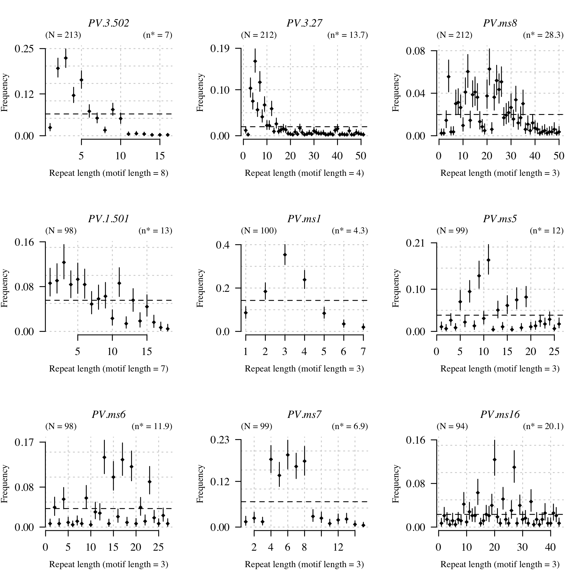
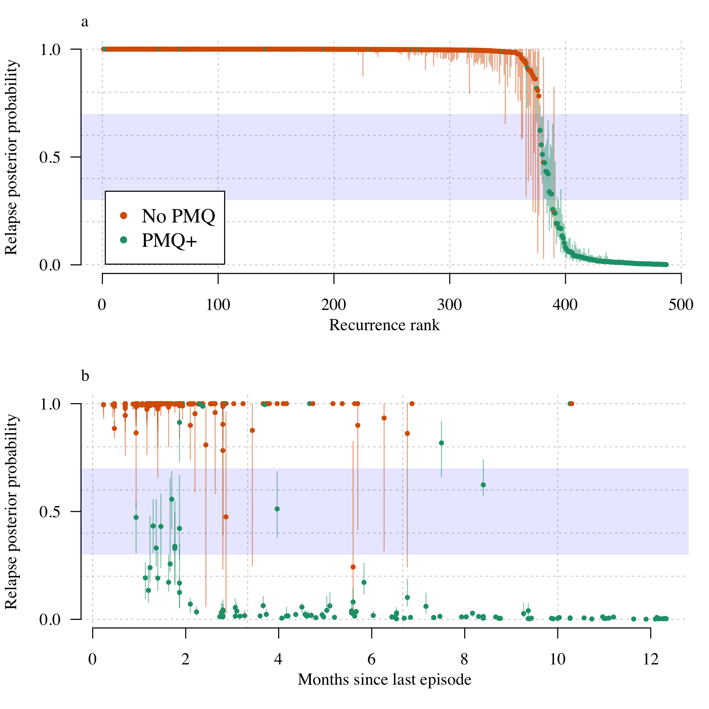

# Preamble

Load R packages, functions and data.


Summary of the data and the whole of the VHX data versus the subset typed (in terms of number of episodes):

```
## Number of individuals with at least one episode typed: 164
```

```
## Number of episodes typed: 599
```

```
## Number of recurrences typed: 435
```

```
## Warning: package 'bindrcpp' was built under R version 3.4.4
```

```
## Number of individuals with at least two episodes typed: 159
```

```
## Number of recurrences typed: 435
```

<!-- -->


Define the sets of microsatellite markers for the various datasets.


The approach is fully Bayesian and consists of the following:

* A prior probability vector for the recurrence state
* A likelihood based on the genetic data of being a *relapse*, a *recrudescence*, or a *reinfection* given the observed microsatellite data.

# Allele frequencies

We use a multinomial-dirichlet model with subjective weight. Setting the weight to 0 recovers unweighted empirical allele frequencies. 


```
## Number of episodes used to compute frequencies: 159
```


## Plotting allele frequencies

These are the observed allele frequencies in the pooled data. We show 80% credible intervals (lo) (Aimee: seems to be 95%)

<!-- -->


# Computing the probability of relatedness across infections

The following iterates through each individual and computes the probability of relatedness states.

## Load the time-to-event priors


## Computation using full dataset 

We use all 9MS markers (when available).


### Full posterior computation


# Plot results

These dataframes are sorted by episode number so the columns correspond between them. We make some data.frames that store the results for ease of plotting.


```
## The following `from` values were not present in `x`: AS
## The following `from` values were not present in `x`: AS
```


## Going from time-to-event prior to posterior

Have broken it down by radical cure and no radical cure, as that is the most informative distinction here.

<!-- -->

Probability of relapse, ordered from most to least likely:
<!-- -->

Probability of reinfection, ordered from most to least likely:
<!-- -->

Probability of recrudescence, ordered from most to least likely:
<!-- -->

# BPD Final Plot


```
## The mean percentage of recurrences which are estimated to be relapses is 15%
```

<!-- -->


# Extra computations for VHX: too complex episodes


We remove the IDs that can be straightforwardly calculated:


We blow up the pooled analysis into all pairs within individuals:


Construct adjacency graphs and compute probabilities of relapse and reinfection.


<!-- -->

<!-- -->
Individuals who appear to relapse very late (more than 300 days after last episode):

```
## The episode ids of interest are: VHX_235_3
## The episode ids of interest are: BPD_27_2
```

```
##          ID       Date MOI_id PV.1.501 PV.3.27 PV.3.502 PV.ms1 PV.ms16
## 60   BPD_27 2012-03-28      1        3      23        7      4       9
## 61   BPD_27 2013-01-30      1        3      23        7      4       9
## 62   BPD_27 2013-01-30      2        3      24        7      4       9
## 313 VHX_235 2010-07-20      1        1       6        1      3      NA
## 314 VHX_235 2010-07-20      2        1       6        1      3      NA
## 315 VHX_235 2010-08-10      1        1       6        2      4      NA
## 316 VHX_235 2011-06-15      1        1       6        2      4      NA
##     PV.ms5 PV.ms6 PV.ms7 PV.ms8 timeSinceEnrolment timeSinceLastEpisode
## 60      11      5      2     13                  0                   NA
## 61      11      5      2     13                308                  308
## 62      11      5      2     13                308                  308
## 313      7      9     NA     12                  0                   NA
## 314      7     12     NA     32                  0                   NA
## 315      7      9     NA     12                 21                   21
## 316      6     12     NA     12                330                  309
##     Episode Episode_Identifier
## 60        1           BPD_27_1
## 61        2           BPD_27_2
## 62        2           BPD_27_2
## 313       1          VHX_235_1
## 314       1          VHX_235_1
## 315       2          VHX_235_2
## 316       3          VHX_235_3
```


The summaries of the final dataset:

```
## 
##  2  3 
## 80 79
```

```
## In chloroquine monotherapy individuals, the weighted average of relapses is 98.6 (96-99.8)
```

```
## In chloroquine monotherapy individuals, the weighted average of recrudescences is 0.7 (0.2-1.1)
```

```
## In chloroquine monotherapy individuals, the weighted average of reinfections is 0.7 (0-2.9)
```

```
## In chloroquine+primaquine individuals, the weighted average of relapses is 15 (12.8-17.4)
```

```
## In chloroquine+primaquine individuals, the weighted average of recrudescences is 0.3 (0-0.5)
```

```
## In chloroquine+primaquine individuals, the weighted average of reinfections is 84.7 (82.5-86.7)
```


# False positive rate of relapse

We want to know how often our model estimates evidence of relapse across pairs of episodes when the episodes are in different people (e.g.)


```
## NULL
```


# Analysis of radical cure efficacy in BPD

Almost all episodes in BPD were typed. Therefore we can estimate the true efficacy comparing with historical controls (VHX).

<!-- -->


```
## 5 recurrences did not have MS data to inform posterior probability
```

```
## Number of recurrences without posterior probability assigned: 0
```

<!-- -->

```
## The primaquine failure rate in the 655 individuals is 1.97% (1.69-2.28) over the course of 522 years total follow-up.
```


Now we look at whether the PK (carboxy-primaquine) can predict failure:


```
## Linear mixed model fit by REML ['lmerMod']
## Formula: Failure ~ log10_carboxyPMQ + log10_PMQ + (1 | patientid)
##    Data: BPD_data
## 
## REML criterion at convergence: -1038.8
## 
## Scaled residuals: 
##     Min      1Q  Median      3Q     Max 
## -1.3384 -0.2130 -0.1237 -0.0450  8.8369 
## 
## Random effects:
##  Groups    Name        Variance  Std.Dev. 
##  patientid (Intercept) 8.802e-19 9.382e-10
##  Residual              1.348e-02 1.161e-01
## Number of obs: 721, groups:  patientid, 639
## 
## Fixed effects:
##                  Estimate Std. Error t value
## (Intercept)       0.21771    0.04490   4.849
## log10_carboxyPMQ -0.08410    0.01904  -4.418
## log10_PMQ         0.04494    0.01396   3.219
## 
## Correlation of Fixed Effects:
##             (Intr) lg10_cPMQ
## lg10_crbPMQ -0.986          
## log10_PMQ    0.729 -0.820
```

So there is a predictive effect of carboxy primaquine on drug failure. 


```
## Generalized linear mixed model fit by maximum likelihood (Laplace
##   Approximation) [glmerMod]
##  Family: binomial  ( logit )
## Formula: Failure_YN ~ log10_carboxyPMQ + (1 | patientid)
##    Data: BPD_data
## 
##      AIC      BIC   logLik deviance df.resid 
##    112.8    126.6    -53.4    106.8      718 
## 
## Scaled residuals: 
##     Min      1Q  Median      3Q     Max 
## -0.6238 -0.1315 -0.1084 -0.0887 15.2799 
## 
## Random effects:
##  Groups    Name        Variance  Std.Dev. 
##  patientid (Intercept) 2.042e-14 1.429e-07
## Number of obs: 721, groups:  patientid, 639
## 
## Fixed effects:
##                  Estimate Std. Error z value Pr(>|z|)   
## (Intercept)      -0.06011    1.31405  -0.046  0.96352   
## log10_carboxyPMQ -1.55359    0.51873  -2.995  0.00274 **
## ---
## Signif. codes:  0 '***' 0.001 '**' 0.01 '*' 0.05 '.' 0.1 ' ' 1
## 
## Correlation of Fixed Effects:
##             (Intr)
## lg10_crbPMQ -0.972
```

<!-- -->

This won't go into this paper but looking out of interest:

Does 2D6 correlate with carboxy ?


```
## 
## Call:
## lm(formula = log10_carboxyPMQ ~ ASscore, data = BPD_data)
## 
## Residuals:
##      Min       1Q   Median       3Q      Max 
## -2.16328 -0.19914  0.03915  0.20937  0.94095 
## 
## Coefficients:
##             Estimate Std. Error t value Pr(>|t|)    
## (Intercept)  2.79889    0.07745  36.136   <2e-16 ***
## ASscore     -0.06682    0.05536  -1.207    0.229    
## ---
## Signif. codes:  0 '***' 0.001 '**' 0.01 '*' 0.05 '.' 0.1 ' ' 1
## 
## Residual standard error: 0.4211 on 232 degrees of freedom
##   (513 observations deleted due to missingness)
## Multiple R-squared:  0.00624,	Adjusted R-squared:  0.001956 
## F-statistic: 1.457 on 1 and 232 DF,  p-value: 0.2287
```

<!-- -->


