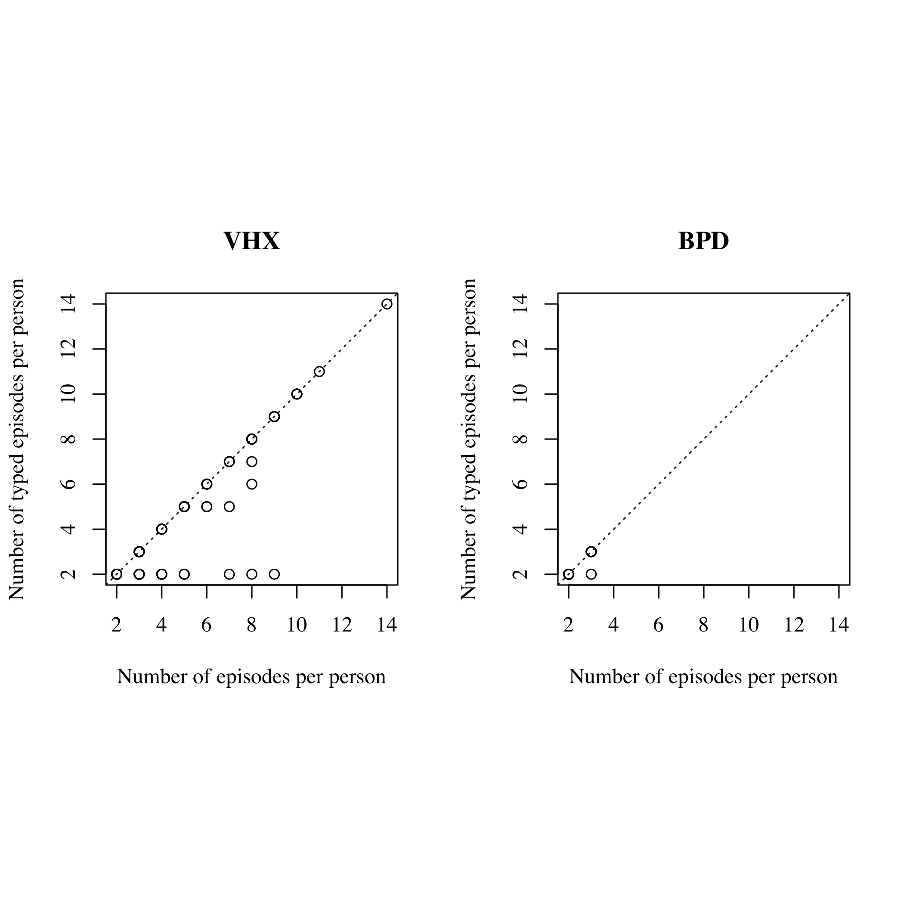
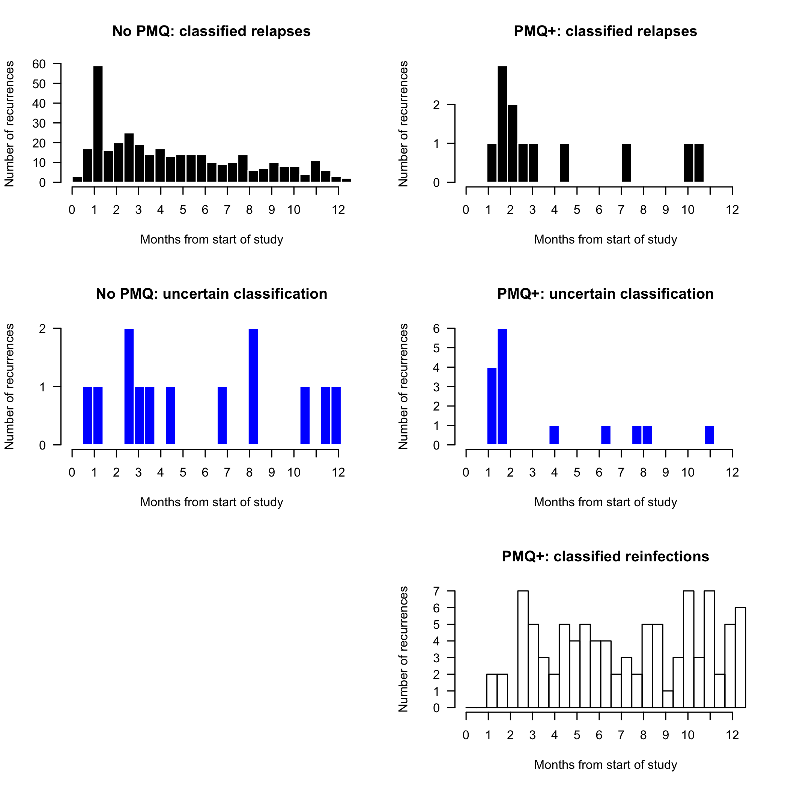
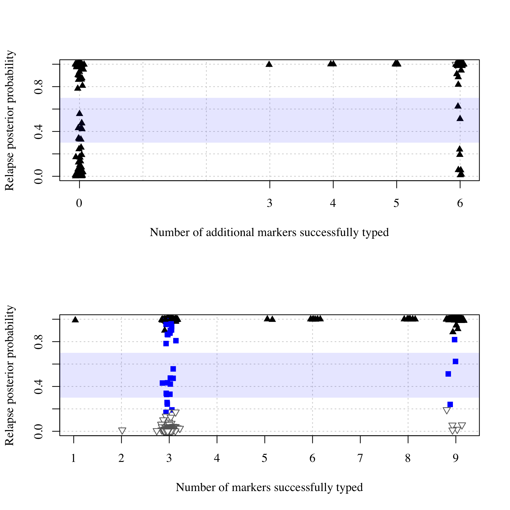

# Preamble

Load R packages, functions and data.


```r
#============================================================
# First let's extract some summaries and format the data frames 
# ahead of summaries and analyses
#============================================================
total_patient_names = unique(Combined_Time_Data$patientid)
total_patient_count = length(total_patient_names)

# Add a variable with trial, drug arm (if VHX) and partner (if BPD - since drug arm was labelled CQ for all BPD for modelling purpose)
ind_VHX_ctd = grepl('VHX', Combined_Time_Data$patientid)
Combined_Time_Data$trial_arm_partner = NA
Combined_Time_Data$trial_arm_partner[ind_VHX_ctd] = paste('VHX', Combined_Time_Data$arm_num[ind_VHX_ctd])
Combined_Time_Data$trial_arm_partner[!ind_VHX_ctd] = paste('BPD', Combined_Time_Data$PMQ_partner[!ind_VHX_ctd])

# Note that Combined_Time_Data has censored rows for patients
Combined_Time_Data_no_cnsd_rows = Combined_Time_Data[Combined_Time_Data$Censored != 1,] # remove censored rows
uncensored_patientid_vector = Combined_Time_Data_no_cnsd_rows$patientid # vector of patientids excluding censored rows (inc. duplicates)

# names of patients who recurred
recur_patient_names = names(which(table(uncensored_patientid_vector) > 1))

# Treatment of all those who recurred
recur_patient_treatment = sapply(recur_patient_names, function(id){
  inds = Combined_Time_Data$patientid == id
  treatment = unique(Combined_Time_Data$trial_arm_partner[inds])
  if(length(treatment) >1){stop('More than one treatment')}else{treatment}
})

# Number of episodes per persons 
All_VHX_epi_count = table(uncensored_patientid_vector[grepl('VHX_',uncensored_patientid_vector)]) 
All_BPD_epi_count = table(uncensored_patientid_vector[grepl('BPD_',uncensored_patientid_vector)]) 

# Add trial, drug arm (if VHX) and partner (if BPD - see above) to genetic data 
MS_pooled$trial_arm_partner = sapply(1:nrow(MS_pooled), function(i){unique(Combined_Time_Data$trial_arm_partner[Combined_Time_Data$patientid==MS_pooled$ID[i]])})

# Collapse rows due to complex infections (COI > 2)
MS_pooled_summary = MS_pooled[!duplicated(MS_pooled$Episode_Identifier),] 
```


# Summary of the clinical trial data (features in Table 1 of the main text)


```
## 
## Number of patients: 1299 (644 in VHX; 655 in BPD)
```

```
## 
## Number of patients by treatment:
```

```
## 
##      VHX AS     VHX CHQ VHX CHQ/PMQ     BPD CHQ      BPD DP 
##         224         222         198         329         326
```

```
## 
## Number of patients who recurred by treatment, Nr:
```

```
## recur_patient_treatment
##      VHX AS     VHX CHQ VHX CHQ/PMQ     BPD CHQ      BPD DP 
##         177         165          35          47          34
```

```
## 
## Percent of N patients who recurred by treatment:
```

```
## recur_patient_treatment
##      VHX AS     VHX CHQ VHX CHQ/PMQ     BPD CHQ      BPD DP 
##          39          36           8          10           7
```

```
## 
## Number of individuals with at least one episode typed by treatment:
```

```
## 
##      VHX AS     VHX CHQ VHX CHQ/PMQ     BPD CHQ      BPD DP 
##          13          90          34          46          34
```

```
## 
## Percent of Nr individuals with at least one episode typed by treatment:
```

```
## 
##      VHX AS     VHX CHQ VHX CHQ/PMQ     BPD CHQ      BPD DP 
##           7          55          97          98         100
```

```
## 
## Number of individuals with at least one recurrence typed by treatment:
```

```
## 
##      VHX AS     VHX CHQ VHX CHQ/PMQ     BPD CHQ      BPD DP 
##          13          90          32          46          32
```

```
## 
## Percent of Nr individuals with at least one recurrence typed by treatment:
```

```
## 
##      VHX AS     VHX CHQ VHX CHQ/PMQ     BPD CHQ      BPD DP 
##           7          55          91          98          94
```

```
## 
## Number of recurrences by treatment:
```

```
## 
##      VHX AS     VHX CHQ VHX CHQ/PMQ     BPD CHQ      BPD DP 
##         722         587          40          53          39
```

```
## 
## Number of recurrences typed by treatment:
```

```
## 
##      VHX AS     VHX CHQ VHX CHQ/PMQ     BPD CHQ      BPD DP 
##          13         358          35          52          36
```

```
## 
## Percent of R recurrences typed by treatment:
```

```
## 
##      VHX AS     VHX CHQ VHX CHQ/PMQ     BPD CHQ      BPD DP 
##           2          61          88          98          92
```

```
## 
## 
## From BPD trial there are 80 individuals with total of 167 episodes typed (enrollment: 79; recurrent 88)
```

```
## From VHX trial there are 137 individuals with total of 543 episodes typed (enrollment: 137; recurrent 406)
```

# Next we summarise the number of episodes typed in people with one or more episodes typed


```r
#=================================================================
# Number of episodes typed conditional on a person being selected for genotyping
#=================================================================
# No. of typed episodes per person with one or more typed episodes in VHX and BPD
no_of_typed_epi_per_person_typed_VHX = table(MS_pooled_summary$ID[grepl('VHX',MS_pooled_summary$ID)])  
no_of_typed_epi_per_person_typed_BPD = table(MS_pooled_summary$ID[grepl('BPD',MS_pooled_summary$ID)])  

# No. of total episodes per person with one or more typed episodes in VHX and BPD
no_of_epi_per_person_typed_VHX = All_VHX_epi_count[names(All_VHX_epi_count) %in% names(no_of_typed_epi_per_person_typed_VHX)]
no_of_epi_per_person_typed_BPD = All_BPD_epi_count[names(All_BPD_epi_count) %in% names(no_of_typed_epi_per_person_typed_BPD)]

#-------------------------
# VHX data set summary: brief because genotyping VHX was not exhaustive
#-------------------------
X0 = length(no_of_typed_epi_per_person_typed_VHX) # Number of people typed
ind_untyped = no_of_epi_per_person_typed_VHX != no_of_typed_epi_per_person_typed_VHX
X1 = sum(ind_untyped) # Number of people selected for genotyping but some episodes untyped
# How many untyped per person with incomplete set of episodes typed:
X2 = range(no_of_epi_per_person_typed_VHX[ind_untyped] - no_of_typed_epi_per_person_typed_VHX[ind_untyped]) 
X3 = sum(no_of_epi_per_person_typed_VHX - no_of_typed_epi_per_person_typed_VHX) # Total number untyped
writeLines(sprintf('\nVHX: for %s of %s VHX individual/s selected for genotyping: %s to %s of their episodes were not typed (total of %s episodes untyped summing over the %s individuals)',X1,X0,X2[1],X2[2],X3,X1))
```

```
## 
## VHX: for 27 of 137 VHX individual/s selected for genotyping: 1 to 7 of their episodes were not typed (total of 52 episodes untyped summing over the 27 individuals)
```

```r
# How about for those who received PMQ in VHX? 
no_of_typed_epi_per_person_typed_VHX_PMQ = table(MS_pooled_summary$ID[MS_pooled_summary$trial_arm_partner == "VHX CHQ/PMQ"])
no_of_epi_per_person_typed_VHX_PMQ = All_VHX_epi_count[names(All_VHX_epi_count) %in% names(no_of_typed_epi_per_person_typed_VHX_PMQ)]
X0 = length(no_of_typed_epi_per_person_typed_VHX_PMQ) # Number of people typed
ind_untyped = no_of_epi_per_person_typed_VHX_PMQ != no_of_typed_epi_per_person_typed_VHX_PMQ
X1 = sum(ind_untyped) # Number of people selected for genotyping but some episodes untyped
# How many untyped per person with incomplete set of episodes typed:
X2 = range(no_of_epi_per_person_typed_VHX_PMQ[ind_untyped] - no_of_typed_epi_per_person_typed_VHX_PMQ[ind_untyped]) 
X3 = sum(no_of_epi_per_person_typed_VHX_PMQ - no_of_typed_epi_per_person_typed_VHX_PMQ) # Total number untyped
writeLines(sprintf('\nVHX: for %s of %s PMQ+ treated VHX individual/s selected for genotyping: %s to %s of their episodes were not typed (total of %s episodes untyped summing over the %s individuals)',X1,X0,X2[1],X2[2],X3,X1))
```

```
## 
## VHX: for 4 of 34 PMQ+ treated VHX individual/s selected for genotyping: 1 to 1 of their episodes were not typed (total of 4 episodes untyped summing over the 4 individuals)
```

```r
PMQ_treated_VHX_ids = names(no_of_typed_epi_per_person_typed_VHX_PMQ)

#-------------------------
# BPD data set: comprehensive because genotyping BPD was exhaustive
#-------------------------
# How many people who experience one or more recurrences had one or more episodes genotyped? 
recurrences = All_BPD_epi_count[All_BPD_epi_count > 1]-1
indivs_who_recurred = names(recurrences)
indivs_who_were_typed = names(no_of_typed_epi_per_person_typed_BPD)
indivs_who_were_not_typed = indivs_who_recurred[!indivs_who_recurred %in% indivs_who_were_typed]

# Summary over individuals typed 
X0 = length(indivs_who_were_typed) # Number of people typed
ind_untyped = no_of_epi_per_person_typed_BPD != no_of_typed_epi_per_person_typed_BPD
X1 = sum(ind_untyped) # Number of episodes untyped
# How many untyped per person with incomplete set of episodes typed:
X2 = range(no_of_epi_per_person_typed_BPD[ind_untyped] - no_of_typed_epi_per_person_typed_BPD[ind_untyped])  
X3 = sum(no_of_epi_per_person_typed_BPD - no_of_typed_epi_per_person_typed_BPD)  # Total number untyped

# Individuals with not all episodes typed
ind_missing_typed_epi <- names(which(no_of_epi_per_person_typed_BPD != no_of_typed_epi_per_person_typed_BPD)) 

# All episodes of the BPD individuals missing one or episodes
X4 = lapply(ind_missing_typed_epi, function(x){
  ind = grepl(x, uncensored_patientid_vector)
  Combined_Time_Data_no_cnsd_rows$episode[ind]
})

# Typed episodes of the BPD individuals missing one or episodes
X5 = lapply(ind_missing_typed_epi, function(x){
  ind = grepl(x, MS_pooled_summary$ID)
  MS_pooled_summary$Episode[ind]
})

X6 = lapply(1:length(X5), function(i){setdiff(X4[[i]], X5[[i]])}) # Not typed episodes
X7 = sum(sapply(X6, function(x)sum(x>1))) # Not typed recurrence

writeLines(paste(sprintf('\nBPD: of %s of the people who recurred: %s person/people with %s recurrence/s was not selected for genotyping.',
                         length(unique(indivs_who_recurred)), 
                         length(unique(indivs_who_were_not_typed)), 
                         recurrences[indivs_who_were_not_typed]), 
                 sprintf('Of %s of %s BPD individual/s selected for genotyping: %s to %s of their episodes were not typed (%s episodes summing over the %s individuals).', X1,X0,X2[1],X2[2],X3,X1), 
                 sprintf('Of the %s episodes not typed %s were recurrences.',X3, X7),
                 sprintf('In total there were %s recurrences: %s untyped.', sum(recurrences), recurrences[indivs_who_were_not_typed] + X7)))
```

```
## 
## BPD: of 81 of the people who recurred: 1 person/people with 1 recurrence/s was not selected for genotyping. Of 4 of 80 BPD individual/s selected for genotyping: 1 to 1 of their episodes were not typed (4 episodes summing over the 4 individuals). Of the 4 episodes not typed 3 were recurrences. In total there were 92 recurrences: 4 untyped.
```

These findings are summarised in the following plot.  

<!-- -->


```r
#=================================================================
# Visual check of difference in episode counts between VHX 
# that where genetically typed and not
#=================================================================
# Condition on CQ since these were the ones selected for genotyping 
CQ_ind_epi <- Combined_Time_Data_no_cnsd_rows$arm_num == "CHQ" 
# vector of patientids excluding censored rows and those without CQ
uncensored_patientid_vector = Combined_Time_Data_no_cnsd_rows$patientid[CQ_ind_epi] 
# Number of episodes per person VHX
All_VHX_epi_count = table(uncensored_patientid_vector[grepl('VHX_',uncensored_patientid_vector)]) 

# Condition on those that have one or more recurrence
All_VHX_rec_count = All_VHX_epi_count[All_VHX_epi_count > 1] 
x1 = no_of_epi_per_person_typed_VHX
x2 = All_VHX_rec_count[!names(All_VHX_rec_count) %in% names(x1)] # No of epi per person untyped
# setequal(names(x1), names(x2)) # Check mutually exclusive
# setequal(names(x2), unique(names(MS_pooled_summary$ID))) # Further check 
max_rec = max(All_VHX_rec_count)
```

<!-- -->

# Summary of complexity of infection (COI) based on numbers of alleles observed. 

This section is broken down by enrollment episodes (this is independent of drug given) and subsequent recurrences which could be drug dependent.


```r
COIs = data.frame(t(sapply(unique(MS_pooled$Episode_Identifier), function(x){
  ind = which(MS_pooled$Episode_Identifier == x)
  c(MOI=max(MS_pooled$MOI_id[ind]),
    Enrollment = MS_pooled$Episode[ind[1]] == 1,
    Drug = MS_pooled$Treatment[ind[1]], 
    Episode = MS_pooled$Episode[ind[1]])
})))

COIs$Enrollment = as.logical(COIs$Enrollment) # Converts factor to logical
COIs$PMQ = 0 
COIs$PMQ[!COIs$Enrollment & COIs$Drug=='PMQ']=1 # This is under the original analysis where drug randomisation only applies to recurrence
COIs$MOI = as.numeric(as.character(COIs$MOI))-1 # Why minus one? 
COIs$Episode = as.numeric(as.character(COIs$Episode))
COIs_PMQ = COIs[COIs$Drug == 'PMQ',] # partition since another approach looks for a stronger signal in a partitioned data set
COIs_noPMQ = COIs[!COIs$Drug == 'PMQ',]
```


```r
# If we partition by receipt of PMQ under the hypothesis that if relapses are less diverse
# enrolment effect should dissappear in partion who received PMQ: Yes
# And if if increasingly few hypnozoites awake over time, should see and effect of Episode in the non PMQ: No
mod1 = glm(MOI ~ Enrollment + Episode, family = 'poisson', data = COIs_PMQ)
mod2 = glm(MOI ~ Enrollment + Episode, family = 'poisson', data = COIs_noPMQ)
summary(mod1)
```

```
## 
## Call:
## glm(formula = MOI ~ Enrollment + Episode, family = "poisson", 
##     data = COIs_PMQ)
## 
## Deviance Residuals: 
##     Min       1Q   Median       3Q      Max  
## -0.9258  -0.8308  -0.7898   0.9044   2.7685  
## 
## Coefficients:
##                Estimate Std. Error z value Pr(>|z|)  
## (Intercept)     -1.8004     0.9651  -1.866   0.0621 .
## EnrollmentTRUE   0.4189     0.5567   0.752   0.4519  
## Episode          0.3177     0.4428   0.717   0.4731  
## ---
## Signif. codes:  0 '***' 0.001 '**' 0.01 '*' 0.05 '.' 0.1 ' ' 1
## 
## (Dispersion parameter for poisson family taken to be 1)
## 
##     Null deviance: 202.73  on 235  degrees of freedom
## Residual deviance: 202.18  on 233  degrees of freedom
## AIC: 351.85
## 
## Number of Fisher Scoring iterations: 6
```

```r
summary(mod2)
```

```
## 
## Call:
## glm(formula = MOI ~ Enrollment + Episode, family = "poisson", 
##     data = COIs_noPMQ)
## 
## Deviance Residuals: 
##     Min       1Q   Median       3Q      Max  
## -1.0703  -0.7629  -0.7586   0.5099   2.9291  
## 
## Coefficients:
##                Estimate Std. Error z value Pr(>|z|)    
## (Intercept)    -1.22681    0.20376  -6.021 1.73e-09 ***
## EnrollmentTRUE  0.67339    0.21322   3.158  0.00159 ** 
## Episode        -0.00377    0.04092  -0.092  0.92660    
## ---
## Signif. codes:  0 '***' 0.001 '**' 0.01 '*' 0.05 '.' 0.1 ' ' 1
## 
## (Dispersion parameter for poisson family taken to be 1)
## 
##     Null deviance: 416.98  on 473  degrees of freedom
## Residual deviance: 400.46  on 471  degrees of freedom
## AIC: 704.71
## 
## Number of Fisher Scoring iterations: 6
```

<!-- -->

```
## 
## Call:
## glm(formula = MOI ~ enrollment + drug, family = "poisson", data = data.frame(MOI = COIs$MOI, 
##     enrollment = as.numeric(COIs$Enrollment), drug = COIs$PMQ))
## 
## Deviance Residuals: 
##     Min       1Q   Median       3Q      Max  
## -0.9526  -0.8065  -0.7595   0.6986   2.9375  
## 
## Coefficients:
##             Estimate Std. Error z value Pr(>|z|)    
## (Intercept) -1.24337    0.09667 -12.862  < 2e-16 ***
## enrollment   0.45306    0.13982   3.240  0.00119 ** 
## drug         0.12007    0.18533   0.648  0.51707    
## ---
## Signif. codes:  0 '***' 0.001 '**' 0.01 '*' 0.05 '.' 0.1 ' ' 1
## 
## (Dispersion parameter for poisson family taken to be 1)
## 
##     Null deviance: 619.82  on 709  degrees of freedom
## Residual deviance: 609.30  on 707  degrees of freedom
## AIC: 1057.2
## 
## Number of Fisher Scoring iterations: 6
```

```
## Mean complexity of recurrent episodes is 1.29, and mean complexity of enrollment episodes is 1.45
```

```
## Median COI in VHX and BPD: 0 and 0, respectively
```

```
## 4 of 710 episodes (1 percent) with COI greater than or equal to 3
```


From this Poisson regression, there appears to be evidence that enrollment episodes have higher complexities of infection than recurrences. This implies that relapses are more likely to be single hypnozoite activated infections? - XXXX 


# Allele frequencies

First we define the set of microsatellite markers used in this analysis:

```r
MSs_all = c("PV.3.502","PV.3.27","PV.ms8",
            "PV.1.501","PV.ms1","PV.ms5",
            "PV.ms6","PV.ms7","PV.ms16")
```

We use a multinomial-dirichlet model with subjective weight $\omega$. $\omega = 0$ recovers the empirical allele frequencies. 


```
## Number of episodes used to compute frequencies: 216
```


```r
#==================================================================
# Save a data set of monoclonal data and allele frequencies for
# relatedness estimation (this was analysed elsewhere)
#==================================================================
monoclonal_names = rownames(COIs)[COIs$MOI == 1]
#monoclonal_data = MS_pooled[MS_pooled$Episode_Identifier%in%monoclonal_names, ]
# save(monoclonal_data, Fs_Combined, file = '../RData/Data_for_relatedness.RData')
```

Calculate the effective marker cardinality for each microsatellite marker using a simulation approach.


```r
N = 10^6
Effective_Allele_size = list()
for(ms in MSs_all){
  n = 1/sum(Fs_Combined[[ms]]^2)
  writeLines(sprintf('The effective cardinality for %s with %s observed alleles is %s', ms, length(Fs_Combined[[ms]]), round(n,2)))
  
  Effective_Allele_size[[ms]] = round(n,1)
}
```

```
## The effective cardinality for PV.3.502 with 16 observed alleles is 7.01
## The effective cardinality for PV.3.27 with 51 observed alleles is 13.74
## The effective cardinality for PV.ms8 with 50 observed alleles is 28.32
## The effective cardinality for PV.1.501 with 18 observed alleles is 12.97
## The effective cardinality for PV.ms1 with 7 observed alleles is 4.31
## The effective cardinality for PV.ms5 with 26 observed alleles is 11.96
## The effective cardinality for PV.ms6 with 27 observed alleles is 11.91
## The effective cardinality for PV.ms7 with 15 observed alleles is 6.91
## The effective cardinality for PV.ms16 with 43 observed alleles is 20.11
```

```r
# The mean and range in our data set
writeLines(sprintf('The mean effective marker cardinality is %s, range: %s to %s', 
                   round(mean(unlist(Effective_Allele_size)),2), 
                   round(min(unlist(Effective_Allele_size)),2), 
                   round(max(unlist(Effective_Allele_size)),2)))
```

```
## The mean effective marker cardinality is 13.02, range: 4.3 to 28.3
```

```r
# Equivalent number of biallelic SNPs
sum(logb(unlist(Effective_Allele_size), base = 1.5)) # realistic SNPs
```

```
## [1] 53.82317
```

```r
sum(logb(unlist(Effective_Allele_size), base = 2)) # ideal SNPs
```

```
## [1] 31.48454
```


## Plotting allele frequencies

These are the mean posterior allele frequencies (dots) and 95\% credible intervals (bars) given pooled enrollment data and $\omega=$ `D_weight_Prior`.

<!-- -->

# Summaries of samples selected to be genotyped at additional 6 markers 


```r
# Extract MS names
MS_core = MSs_all[1:3] # 1) core MSs
MS_addn = MSs_all[4:length(MSs_all)] # additionally typed MSs

# Format dataframe
MS_typd = MS_pooled_summary # Rename before relaplacing allele information with binary
MS_typd[,MSs_all][!is.na(MS_typd[,MSs_all])] = 1 # Replace allele information with binary

# Extract numbers of markers typed 
MS_core_count = length(MS_core) - rowSums(is.na(MS_typd[,MS_core])) # Extract number of markers typed per episode
MS_typd_count = length(MSs_all) - rowSums(is.na(MS_typd[,MSs_all])) # Extract number of markers typed per episode
MS_addn_count = length(MS_addn) - rowSums(is.na(MS_typd[,MS_addn])) # Extract the number of additional markers typed per episode
MS_addn_count_recurrent = length(MS_addn) - rowSums(is.na(MS_typd[MS_typd$Episode > 1,MS_addn])) # Extract the number of additional markers typed per recurrent episode

names(MS_typd_count) = names(MS_addn_count) = names(MS_core_count) = MS_typd$Episode_Identifier # Name by episode

# Logical indeces
BPD_ind = grepl('BPD_', MS_typd$ID) # BPD individuals
VHX_ind = grepl('VHX_', MS_typd$ID) # VHX individuals
```

Summaries across all samples selected


```r
#==========================================================================
# Summaries of core and additional (non-core) typed
# Zero samples failed at 6 of 6 non-core markers (email from Mallika June 12 2019)
# As such, zero non-core marker data means that zero additional were attempted 
#==========================================================================
writeLines(sprintf('\nNumbers of %s samples partioned by number of markers successfully typed:', sum(table(MS_typd_count))))
```

```
## 
## Numbers of 710 samples partioned by number of markers successfully typed:
```

```r
table(MS_typd_count)
```

```
## MS_typd_count
##   1   2   3   5   6   7   8   9 
##   1   3 343   3   8   1  13 338
```

```r
writeLines(sprintf('\nNumbers of %s samples partioned by number of core markers successfully typed:', sum(table(MS_core_count))))
```

```
## 
## Numbers of 710 samples partioned by number of core markers successfully typed:
```

```r
table(MS_core_count) 
```

```
## MS_core_count
##   0   1   2   3 
##   7   4   6 693
```

```r
writeLines(sprintf('\nNumbers of %s samples partioned by number of non-core markers successfully typed:', sum(table(MS_addn_count))))
```

```
## 
## Numbers of 710 samples partioned by number of non-core markers successfully typed:
```

```r
table(MS_addn_count) 
```

```
## MS_addn_count
##   0   1   3   4   5   6 
## 346   1   1   4  11 347
```

```r
writeLines(sprintf('\nNumbers of %s recurrent samples partioned by number of non-core markers successfully typed:', sum(table(MS_addn_count_recurrent) )))
```

```
## 
## Numbers of 494 recurrent samples partioned by number of non-core markers successfully typed:
```

```r
table(MS_addn_count_recurrent) 
```

```
## MS_addn_count_recurrent
##   0   3   4   5   6 
## 230   1   2   8 253
```

```r
#=================================================
# Episodes with missing core: share with Mallika
Episodes_missing_core = names(MS_core_count)[(which(MS_core_count < 3))] # Names 
Data_missing_core = MS_typd[MS_typd$Episode_Identifier %in% Episodes_missing_core, ] # All data 
MSData_missing_core = Data_missing_core[, c(MS_core, MS_addn)] # MS Data
rownames(MSData_missing_core) = Data_missing_core$Episode_Identifier # name rows
#write.csv(x = MSData_missing_core, file = '~/Dropbox/Genotyping/MSData_missing_core.csv', row.names = T) # Print
#=================================================

writeLines(sprintf('\nNumber of enrolment samples successfully genotyped at additional (non-core) markers: %s of %s (%s percent, %s VHX, %s BPD)',
                   sum(MS_typd$Episode[MS_addn_count > 0] == 1),
                   sum(MS_typd$Episode == 1), 
                   round(100*sum(MS_typd$Episode[MS_addn_count > 0] == 1)/sum(MS_typd$Episode == 1)), 
                   sum(MS_typd$Episode[VHX_ind][MS_addn_count[VHX_ind] > 0] == 1), # VHX
                   sum(MS_typd$Episode[BPD_ind][MS_addn_count[BPD_ind] > 0] == 1))) # BPD
```

```
## 
## Number of enrolment samples successfully genotyped at additional (non-core) markers: 100 of 216 (46 percent, 85 VHX, 15 BPD)
```

```r
writeLines(sprintf('Number of recurrent samples successfully genotyped at additional (non-core) markers: %s of %s (%s percent, %s VHX, %s BPD)',
                   sum(MS_typd$Episode[MS_addn_count > 0] != 1),
                   sum(MS_typd$Episode != 1), 
                   round(100*sum(MS_typd$Episode[MS_addn_count > 0] != 1)/sum(MS_typd$Episode != 1)), 
                   sum(MS_typd$Episode[VHX_ind][MS_addn_count[VHX_ind] > 0] != 1), # VHX
                   sum(MS_typd$Episode[BPD_ind][MS_addn_count[BPD_ind] > 0] != 1))) # BPD
```

```
## Number of recurrent samples successfully genotyped at additional (non-core) markers: 264 of 494 (53 percent, 249 VHX, 15 BPD)
```

```r
writeLines(sprintf('Of those successfully genotyped at additional (non-core) markers, number genotyped at all six: %s of %s (%s percent, %s VHX, %s BPD)',
                   sum(MS_addn_count[MS_addn_count > 0] == 6), 
                   sum(MS_addn_count > 0),
                   round(100*sum(MS_addn_count[MS_addn_count > 0] == 6)/sum(MS_addn_count > 0)), 
                   sum(MS_addn_count[VHX_ind][MS_addn_count[VHX_ind] > 0] == 6), # VHX
                   sum(MS_addn_count[BPD_ind][MS_addn_count[BPD_ind] > 0] == 6))) # BPD
```

```
## Of those successfully genotyped at additional (non-core) markers, number genotyped at all six: 347 of 364 (95 percent, 317 VHX, 30 BPD)
```

# Now we remove MS data for individuals who miss paired enrolment and recurrent data in preparation for recurrent state inference


```r
# First we remove MS data for which there are either no recurrent data or no enrolment data 
IDs_Enrolment_n_Recurrent_typed = sapply(unique(MS_pooled_summary$ID), function(id){
  inds = MS_pooled_summary$ID == id
  episodes = MS_pooled_summary$Episode[inds] 
  if(!1 %in% episodes){print(sprintf('enrolment missing for %s',id))}
  if(!length(episodes) > 1){print(sprintf('recurrent missing for %s',id))}
  if(length(episodes) > 1 & 1 %in% episodes){id}else{NA}  # one or more recurrent and contains and enrolment episode 
})
```

```
## [1] "recurrent missing for BPD_150"
## [1] "recurrent missing for BPD_453"
## [1] "enrolment missing for BPD_564"
## [1] "recurrent missing for BPD_564"
## [1] "recurrent missing for VHX_111"
## [1] "recurrent missing for VHX_557"
```

```r
# Check that 'BPD_564' had only a single recurrence thus unanalzable: yes
MS_pooled$Episode[MS_pooled$ID == 'BPD_564'] 
```

```
## [1] 2
```

```r
writeLines(sprintf('\nIndividuals removed due to missing enrolment or no recurrent data: \n %s', 
                   paste(IDs_Enrolment_n_Recurrent_typed[is.na(IDs_Enrolment_n_Recurrent_typed)], collapse = ' ')))
```

```
## 
## Individuals removed due to missing enrolment or no recurrent data: 
##  NA NA NA NA NA
```

```r
#-----------------------------------------------------
# Redefine dataframes XXX Consider re-nameing so code is more robust
#-----------------------------------------------------
MS_pooled = filter(MS_pooled, ID %in% IDs_Enrolment_n_Recurrent_typed[!is.na(IDs_Enrolment_n_Recurrent_typed)])
MS_pooled_summary = MS_pooled[!duplicated(MS_pooled$Episode_Identifier),]  # recreate pooled summary dataset
MS_typd = MS_pooled_summary # Rename before relaplacing allele information with binary
MS_typd[,MSs_all][!is.na(MS_typd[,MSs_all])] = 1 # Replace allele information with binary

recur_ind = MS_pooled$Episode > 1
writeLines('\nNumber of individuals with at least one paired recurrence typed by treatment:')
```

```
## 
## Number of individuals with at least one paired recurrence typed by treatment:
```

```r
table(MS_pooled$trial_arm_partner[recur_ind][!duplicated(MS_pooled$ID[recur_ind])])[treatment_order]
```

```
## 
##      VHX AS     VHX CHQ VHX CHQ/PMQ     BPD CHQ      BPD DP 
##          13          90          32          46          31
```

```r
writeLines('\nPercent of Nr individuals with at least one paired recurrence typed by treatment:') 
```

```
## 
## Percent of Nr individuals with at least one paired recurrence typed by treatment:
```

```r
round(100*table(MS_pooled$trial_arm_partner[recur_ind][!duplicated(MS_pooled$ID[recur_ind])])[names(Nr)]/Nr)[treatment_order]
```

```
## 
##      VHX AS     VHX CHQ VHX CHQ/PMQ     BPD CHQ      BPD DP 
##           7          55          91          98          91
```

```r
recur_ind = MS_pooled_summary$Episode > 1
writeLines('\nNumber of paired recurrences typed by treatment:')
```

```
## 
## Number of paired recurrences typed by treatment:
```

```r
table(MS_pooled_summary$trial_arm_partner[recur_ind])[treatment_order]
```

```
## 
##      VHX AS     VHX CHQ VHX CHQ/PMQ     BPD CHQ      BPD DP 
##          13         358          35          52          35
```

```r
writeLines('\nPercent of paired recurrences typed by treatment:') 
```

```
## 
## Percent of paired recurrences typed by treatment:
```

```r
round(100*table(MS_pooled_summary$trial_arm_partner[recur_ind])[names(R)]/R)[treatment_order] 
```

```
## 
##      VHX AS     VHX CHQ VHX CHQ/PMQ     BPD CHQ      BPD DP 
##           2          61          88          98          90
```

```r
writeLines(sprintf('\nNumber of individuals with one or more paired recurrence: %s',
                   length(unique(MS_pooled$ID))))
```

```
## 
## Number of individuals with one or more paired recurrence: 212
```

```r
writeLines(sprintf('Number of episodes in individuals with one or more paired recurrence: %s',
                   length(unique(MS_pooled$Episode_Identifier))))
```

```
## Number of episodes in individuals with one or more paired recurrence: 705
```

```r
writeLines(sprintf('Number of paired recurrences: %s',
                   length(unique(MS_pooled$Episode_Identifier[MS_pooled$Episode>1]))))
```

```
## Number of paired recurrences: 493
```

```r
# To add to Table 3
# Re-extract number of add. markers typed per episode
MS_addn_count_recurrent = length(MS_addn) - rowSums(is.na(MS_typd[MS_typd$Episode > 1,MS_addn])) 
names(MS_addn_count_recurrent) = MS_typd[MS_typd$Episode > 1,'Episode_Identifier']
writeLines(sprintf('\nNumbers of %s paired recurrent samples partioned by number of non-core markers successfully typed:', sum(table(MS_addn_count_recurrent))))
```

```
## 
## Numbers of 493 paired recurrent samples partioned by number of non-core markers successfully typed:
```

```r
table(MS_addn_count_recurrent) 
```

```
## MS_addn_count_recurrent
##   0   3   4   5   6 
## 229   1   2   8 253
```


# Computing the probability of relatedness across infections

The approach is Bayesian and consists of the following:

* A prior probability vector for the recurrence state from the time-to-event model
* An allele frequency estimate from the posterior distribution of allele frequencies
* A likelihood based on the genetic data of being a *relapse*, a *recrudescence*, or a *reinfection* given the observed microsatellite data.

The following iterates through each individual and computes the probability of relatedness states.

## Load the time-to-event priors


```r
inds = grepl('mean_theta', colnames(Mod2_ThetaEstimates)) # Extract mean
p = data.frame(Episode_Identifier = Mod2_ThetaEstimates$Episode_Identifier, 
               Mod2_ThetaEstimates[,inds], stringsAsFactors = F) # Reformat
colnames(p) = gsub(pattern = 'Recrudescence_mean_theta',replacement = 'C',x = colnames(p))
colnames(p) = gsub(pattern = 'Relapse_mean_theta',replacement = 'L',x = colnames(p))
colnames(p) = gsub(pattern = 'ReInfection_mean_theta',replacement = 'I',x = colnames(p))

# Get prior estimates for only those with genetic data
genetic_AND_time_data_eps = intersect(p$Episode_Identifier, MS_pooled$Episode_Identifier)
p = p[p$Episode_Identifier %in% genetic_AND_time_data_eps,]

# Extract posterior estimates only if running full posterior simple or inflated
if(RUN_MODELS_FULL_POSTERIOR | RUN_MODELS_FULL_POSTERIOR_INFLATED){
  Post_samples_matrix = Post_samples_matrix[Post_samples_matrix$Episode_Identifier %in% genetic_AND_time_data_eps,]
}
```


## Computation


```r
# Remove upper complexity ids if EXCLUDE_COMPLEX = T
# This substantially speeds up the analysis
if(EXCLUDE_COMPLEX){
  load('../RData/UpperComplexityIDs.RData') # IDs to avoid
  ep_ids_excluded = unique(MS_pooled$Episode_Identifier[MS_pooled$ID %in% UpperComplexityIDs])
  MS_pooled = MS_pooled[!MS_pooled$ID %in% UpperComplexityIDs,]
  writeLines(sprintf('This is excluding data from %s individuals, totalling %s vivax episodes',
                     length(UpperComplexityIDs), length(ep_ids_excluded)))
}
```


### Full posterior computation: non-complex cases
#### Using the time-to-event prior


For genetic only efficacy estimate, run time agnostic (i.e. genetic only)


# Plot results (thus far we have results for individuals with one or two recurrences only)


```r
# Output of time-to-event model (sorted by episode number s.t. columns correspond)
Time_Estimates_1 = filter(Mod2_ThetaEstimates, Episode_Identifier %in% thetas_9MS$Episode_Identifier)
Time_Estimates_1 = arrange(Time_Estimates_1, Episode_Identifier)

# Outputs of genetic model with time prior 
# sorted by episode number s.t. columns correspond and drug added
thetas_9MS = arrange(thetas_9MS, Episode_Identifier)
thetas_9MS$drug = Time_Estimates_1$arm_num # Add drug

# Outputs of genetic model without time prior 
# sorted by episode number s.t. columns correspond and drug added
thetas_9MS_Tagnostic = arrange(thetas_9MS_Tagnostic, Episode_Identifier)
thetas_9MS_Tagnostic$drug = Time_Estimates_1$arm_num # Add drug
```

## Going from time-to-event prior to posterior

Plotted by radical cure versus no radical cure, as that is the most informative distinction here.

<!-- -->

```
## Based on time-to-event alone, 65 of 66 No PMQ classified as relapse
```

```
## Based on genetic alone, 19 of 66 No PMQ classified as relapse
```

```
## Based on all available data, 61 of 66 No PMQ classified as relapse
```

```
## Based on time-to-event alone, 0 of 120 PMQ+ classified as relapse
```

```
## Based on genetic alone, 13 of 120 PMQ+ classified as relapse
```

```
## Based on all available data, 13 of 120 PMQ+ classified as relapse
```

Probability of states, ordered from most to least likely:

XXX Need to sort plotting bug - apparently appears only after first run

<!-- -->


#### Extra computations for VHX: complex episodes

We remove the IDs that can be straightforwardly calculated:


```r
ind_calculated = which(MS_pooled_summary$Episode_Identifier %in% thetas_9MS$Episode_Identifier)
IDs_calculated = unique(MS_pooled_summary$ID[ind_calculated])
IDs_remaining = unique(MS_pooled_summary$ID[! MS_pooled_summary$ID %in% IDs_calculated])
writeLines(sprintf('individuals with more than two recurrences: %s',length(IDs_remaining)))
```

```
## individuals with more than two recurrences: 54
```

We blow up the pooled analysis into all pairs within individuals:


Construct adjacency graphs and compute probabilities of relapse and reinfection.


```r
MS_pooled_summary$L_or_C_state = MS_pooled_summary$TotalEpisodes = NA
MS_pooled_summary$L_lower = MS_pooled_summary$L_upper = MS_pooled_summary$L_median = NA
MS_pooled_summary$C_lower = MS_pooled_summary$C_upper = MS_pooled_summary$C_median = NA
MS_pooled_summary$I_lower = MS_pooled_summary$I_upper = MS_pooled_summary$I_median = NA
# Arrange by complexity
# Get single rows per episode (throw away the extra MOI information)
MS_inflated_summary = MS_inflated[!duplicated(MS_inflated$Episode_Identifier) & 
                                    MS_inflated$Episode==2,]
Results_Inflated$Episode_Identifier = as.character(rownames(Results_Inflated))

for(i in 1:nrow(MS_inflated_summary)){
  if(!length(which(MS_inflated_summary$Episode_Identifier[i] == 
                   Results_Inflated$Episode_Identifier))>0){
    MS_inflated_summary = MS_inflated_summary[-i,]
    print('removing')
  }
}
```

```
## [1] "removing"
## [1] "removing"
```

```r
Results_Inflated$ID_True = NA
Results_Inflated$First_EpNumber = NA
Results_Inflated$Second_EpNumber = NA
# The ordering has changed so need to be careful about naming
for(i in 1:nrow(Results_Inflated)){
  ind_MS_inflated = which(MS_inflated_summary$Episode_Identifier==Results_Inflated$Episode_Identifier[i])
  Results_Inflated$ID_True[i] = 
    MS_inflated_summary$ID_True[ind_MS_inflated]
  Results_Inflated$First_EpNumber[i] =
    MS_inflated_summary$First_EpNumber[ind_MS_inflated]
  Results_Inflated$Second_EpNumber[i] =
    MS_inflated_summary$Second_EpNumber[ind_MS_inflated]
}


# Iterate through the ones we can calculate in one go
episodes_full_model = unique(thetas_9MS$Episode_Identifier)
for(ep in episodes_full_model){
  ind1 = MS_pooled_summary$Episode_Identifier==ep
  ind2 = thetas_9MS$Episode_Identifier==ep
  
  ## Summaries for relapse
  L_cols = grep('L',colnames(thetas_9MS))
  MS_pooled_summary$L_upper[ind1] = thetas_9MS[ind2, paste('L','97.5%',sep='')]
  MS_pooled_summary$L_lower[ind1] = thetas_9MS[ind2, paste('L','2.5%',sep='')]
  MS_pooled_summary$L_median[ind1] = thetas_9MS[ind2, paste('L','50%',sep='')]
  
  ## Summaries for recrudescence
  C_cols = grep('C',colnames(thetas_9MS))
  MS_pooled_summary$C_upper[ind1] = thetas_9MS[ind2, paste('C','97.5%',sep='')]
  MS_pooled_summary$C_lower[ind1] = thetas_9MS[ind2, paste('C','2.5%',sep='')]
  MS_pooled_summary$C_median[ind1] = thetas_9MS[ind2, paste('C','50%',sep='')]
  
  ## Summaries for reinfection
  I_cols = grep('I',colnames(thetas_9MS))
  MS_pooled_summary$I_upper[ind1] = thetas_9MS[ind2, paste('I','97.5%',sep='')]
  MS_pooled_summary$I_lower[ind1] = thetas_9MS[ind2, paste('I','2.5%',sep='')]
  MS_pooled_summary$I_median[ind1] = thetas_9MS[ind2, paste('I','50%',sep='')]
  
  # Just going to classify on relapse versus reinfection
  if(!is.na(MS_pooled_summary$L_upper[ind1])){
    if(MS_pooled_summary$L_upper[ind1]+MS_pooled_summary$C_upper[ind1] < Epsilon_lower){
      MS_pooled_summary$L_or_C_state[ind1] = 'I'
    } else if(MS_pooled_summary$L_lower[ind1]+MS_pooled_summary$C_lower[ind1] > Epsilon_upper){
      MS_pooled_summary$L_or_C_state[ind1] = 'L'
    } else {
      MS_pooled_summary$L_or_C_state[ind1] = 'Uncertain'
    }
  } else {
    MS_pooled_summary$L_or_C_state[ind1] = NA
  }
}
```


```r
####******** Complex cases *******####################
# Now iterate through the complex ones
for(i in 1:length(IDs_remaining)){
  id = IDs_remaining[i]
  Doubles_Thetas = filter(Results_Inflated, ID_True==id)
  
  for(ep in unique(Doubles_Thetas$Second_EpNumber)){
    # indices on the MS_pooled_summary
    ind1 = which(MS_pooled_summary$ID==id & MS_pooled_summary$Episode==ep)
    # indices on Doubles thetas: looking for relapse evidence
    ind2 = which(Doubles_Thetas$Second_EpNumber == ep)
    # index for recrudescence evidence
    ind3 = which(Doubles_Thetas$Second_EpNumber == ep &
                   Doubles_Thetas$First_EpNumber == (ep-1))
    
    best_match_relapse = which.max(Doubles_Thetas[ind2, paste('L','50%',sep='')])
    if(length(best_match_relapse)>0){
      # Relapse probability
      MS_pooled_summary$L_lower[ind1] = Doubles_Thetas[ind2[best_match_relapse], paste('L','2.5%',sep='')]
      MS_pooled_summary$L_upper[ind1] = Doubles_Thetas[ind2[best_match_relapse], paste('L','97.5%',sep='')]
      MS_pooled_summary$L_median[ind1] = Doubles_Thetas[ind2[best_match_relapse], paste('L','50%',sep='')]
      
      # Reinfection probability
      MS_pooled_summary$I_lower[ind1] = Doubles_Thetas[ind2[best_match_relapse], paste('I','2.5%',sep='')]
      MS_pooled_summary$I_upper[ind1] = Doubles_Thetas[ind2[best_match_relapse], paste('I','97.5%',sep='')]
      MS_pooled_summary$I_median[ind1] = Doubles_Thetas[ind2[best_match_relapse], paste('I','50%',sep='')]
      
      # Recrudescence probability
      if(length(ind3)>0){ 
        # we can compute using previous episode
        MS_pooled_summary$C_lower[ind1] = Doubles_Thetas[ind3, paste('C','2.5%',sep='')]
        MS_pooled_summary$C_upper[ind1] = Doubles_Thetas[ind3, paste('C','97.5%',sep='')]
        MS_pooled_summary$C_median[ind1] = Doubles_Thetas[ind3, paste('C','50%',sep='')]
      }  
      if(is.na(MS_pooled_summary$C_median[ind1])){
        MS_pooled_summary$C_lower[ind1] =
          1-MS_pooled_summary$L_lower[ind1]+MS_pooled_summary$I_lower[ind1]
        MS_pooled_summary$C_upper[ind1] = 
          1-MS_pooled_summary$L_upper[ind1]+MS_pooled_summary$I_upper[ind1]
        MS_pooled_summary$C_median[ind1] = 
          1-MS_pooled_summary$L_median[ind1]+MS_pooled_summary$I_median[ind1]
      }
      
    }
    if(!is.na(MS_pooled_summary$C_median[ind1])){
      if(MS_pooled_summary$L_upper[ind1] < MS_pooled_summary$L_lower[ind1]){
        writeLines(sprintf('Problem with ID %s',id))
        stop()
      }
      if(MS_pooled_summary$L_upper[ind1]+MS_pooled_summary$C_upper[ind1] < Epsilon_lower){
        MS_pooled_summary$L_or_C_state[ind1] = 'I'
      } else if(MS_pooled_summary$L_lower[ind1]+MS_pooled_summary$C_lower[ind1] > Epsilon_upper){
        MS_pooled_summary$L_or_C_state[ind1] = 'L'
      } else {
        MS_pooled_summary$L_or_C_state[ind1] = 'Uncertain'
      }
    }
  }
}

MS_pooled_summary$Drug = MS_pooled_summary$FU = NA
for(id in MS_pooled_summary$ID){
  ind = MS_pooled_summary$ID==id
  MS_pooled_summary$TotalEpisodes[ind] = max(MS_pooled_summary$Episode[ind])
  MS_pooled_summary$Drug[ind] = as.numeric(
    Combined_Time_Data$arm_num[Combined_Time_Data$patientid==id][1] == 'CHQ/PMQ') + 2
  MS_pooled_summary$FU[ind] = Combined_Time_Data$FU_time[Combined_Time_Data$patientid==id][1]
}
MS_pooled_summary$Plotting_pch_Values = 
  as.numeric(mapvalues(MS_pooled_summary$L_or_C_state, from = c('L','Uncertain','I'), to = c(17,15,25)))
MS_pooled_summary$Plotting_col_Values = 
  as.numeric(mapvalues(MS_pooled_summary$L_or_C_state, from = c('L','Uncertain','I'), to = 1:3))
```


```r
# How many too complex to generate estimate for? 
ind_recur = MS_pooled_summary$Episode > 1 # Filter out enrollment
ind_complex_recur = is.na(MS_pooled_summary$L_median[ind_recur])
no_complex_recur = sum(ind_complex_recur) # Recurrences with NAs
recur_removed = MS_pooled_summary$Episode_Identifier[ind_recur][ind_complex_recur]

# How many of the complex infections result in the loss of an individual
N_episodes_typed = table(MS_pooled_summary$ID)
indiv_removed = names(which(N_episodes_typed[MS_pooled_summary$ID[ind_recur][ind_complex_recur]] <= 2)) 
no_indiv_removed = length(indiv_removed)

# Final number of people with recurrences analysed total and by trial
indiv_recur_analysed = length(unique(MS_pooled_summary$ID[ind_recur][!ind_complex_recur])) 
BPD_indiv_recur_analysed = sum(grepl('BPD', unique(MS_pooled_summary$ID[ind_recur][!ind_complex_recur])))
VHX_indiv_recur_analysed = sum(grepl('VHX', unique(MS_pooled_summary$ID[ind_recur][!ind_complex_recur]))) 

writeLines(sprintf('\nOf %s recurrences analysed, %s were too complex to estimate recurrence state probabilities: \n%s, \nresulting in probability estimates for a total of %s recurrences from %s individuals (%s BPD and %s VHX)',
                   sum(ind_recur), no_complex_recur,  
                   paste(recur_removed, collapse = ' '), 
                   sum(!ind_complex_recur), 
                   indiv_recur_analysed, BPD_indiv_recur_analysed, VHX_indiv_recur_analysed))
```

```
## 
## Of 493 recurrences analysed, 6 were too complex to estimate recurrence state probabilities: 
## VHX_239_2 VHX_33_2 VHX_39_2 VHX_461_2 VHX_52_2 VHX_583_2, 
## resulting in probability estimates for a total of 487 recurrences from 208 individuals (77 BPD and 131 VHX)
```

```r
# Which drug arms do the unanalysed recurrences/individuals come from? 
X0 = filter(MS_pooled_summary[MS_pooled_summary$Episode == 1,], ID %in% indiv_removed)
X1 = X0$trial_arm_partner; names(X1) = X0$ID
writeLines('\nIndividuals ommited due to computation complexity: ')
```

```
## 
## Individuals ommited due to computation complexity:
```

```r
X1
```

```
##   VHX_239    VHX_39   VHX_461    VHX_52 
##  "VHX AS" "VHX CHQ"  "VHX AS" "VHX CHQ"
```

```r
X0 = filter(MS_pooled_summary, Episode_Identifier %in% recur_removed)
X1 = X0$trial_arm_partner; names(X1) = X0$Episode_Identifier
writeLines('\nRecurrences ommited due to computation complexity:')
```

```
## 
## Recurrences ommited due to computation complexity:
```

```r
X1
```

```
##     VHX_239_2      VHX_33_2      VHX_39_2     VHX_461_2      VHX_52_2 
##      "VHX AS"     "VHX CHQ"     "VHX CHQ"      "VHX AS"     "VHX CHQ" 
##     VHX_583_2 
## "VHX CHQ/PMQ"
```

```r
recur_ind = MS_pooled_summary$Episode > 1
X0 = filter(MS_pooled_summary[recur_ind,], !ID %in% indiv_removed)
writeLines('\nNumber of individuals with at least one paired recurrence typed and analysed by treatment:')
```

```
## 
## Number of individuals with at least one paired recurrence typed and analysed by treatment:
```

```r
table(X0[!duplicated(X0$ID),'trial_arm_partner'])[treatment_order]
```

```
## 
##      VHX AS     VHX CHQ VHX CHQ/PMQ     BPD CHQ      BPD DP 
##          11          88          32          46          31
```

```r
writeLines('\nPercent of Nr individuals with at least one paired recurrence typed  and analysed by treatment:') 
```

```
## 
## Percent of Nr individuals with at least one paired recurrence typed  and analysed by treatment:
```

```r
round(100*table(X0[!duplicated(X0$ID),'trial_arm_partner'])[names(Nr)]/Nr)[treatment_order]
```

```
## 
##      VHX AS     VHX CHQ VHX CHQ/PMQ     BPD CHQ      BPD DP 
##           6          53          91          98          91
```

```r
recur_ind = MS_pooled_summary$Episode > 1
X0 = filter(MS_pooled_summary[recur_ind,], !Episode_Identifier %in% recur_removed)
writeLines('\nNumber of paired recurrences typed by treatment:')
```

```
## 
## Number of paired recurrences typed by treatment:
```

```r
table(X0$trial_arm_partner)[treatment_order]
```

```
## 
##      VHX AS     VHX CHQ VHX CHQ/PMQ     BPD CHQ      BPD DP 
##          11         355          34          52          35
```

```r
writeLines('\nPercent of paired recurrences typed by treatment:') 
```

```
## 
## Percent of paired recurrences typed by treatment:
```

```r
round(100*table(X0$trial_arm_partner)[names(R)]/R)[treatment_order] 
```

```
## 
##      VHX AS     VHX CHQ VHX CHQ/PMQ     BPD CHQ      BPD DP 
##           2          60          85          98          90
```


```
## Zero accounts of unconverged probablistic phasing
```

<!-- -->

```
## The Coatney style plot is showing 487 recurrences in 208 individuals
```

We show a histogram representation of these classification outputs as suggested by reviewer:

```r
par(las=1, mfcol=c(3,2))
hist(MS_final$timeSinceEnrolment[MS_final$Plotting_col_Values==1 &
                                   MS_final$Treatment != 'PMQ'],
     main = 'No PMQ: classified relapses', xlab = 'Months from start of study',
     xaxt='n', ylab = 'Number of recurrences',  col = 'black', border = 'white',
     breaks = seq(0, 390, by = 14))
axis(1, at = 30*(0:12), labels = 0:12)
hist(MS_final$timeSinceEnrolment[MS_final$Plotting_col_Values==2 &
                                   MS_final$Treatment != 'PMQ'],
     main = 'No PMQ: uncertain classification',  ylab = 'Number of recurrences',
     xlab = 'Months from start of study', xaxt='n', yaxt='n',
     breaks = seq(0, 390, by = 14), col = mycols_states_bg[2], border = 'white')
axis(1, at = 30*(0:12), labels = 0:12)
axis(2, at = 0:2)
plot(NA,NA,xlab='',ylab='',xlim=c(0,1),ylim=c(0,1),xaxt='n',yaxt='n',bty='n')

hist(MS_final$timeSinceEnrolment[MS_final$Plotting_col_Values==1 &
                                   MS_final$Treatment == 'PMQ'],
     main = 'PMQ+: classified relapses', ylab = 'Number of recurrences',
     xlab = 'Months from start of study', xaxt='n',yaxt='n',
     breaks = seq(0, 390, by = 14), col = 'black', border = 'white')
axis(1, at = 30*(0:12), labels = 0:12)
axis(2, at = 0:2)
hist(MS_final$timeSinceEnrolment[MS_final$Plotting_col_Values==2 &
                                   MS_final$Treatment == 'PMQ'],
     main = 'PMQ+: uncertain classification',ylab = 'Number of recurrences', 
     xlab = 'Months from start of study', xaxt='n',
     col = mycols_states_bg[2],breaks = seq(0, 390, by = 14), border = 'white')
axis(1, at = 30*(0:12), labels = 0:12)

hist(MS_final$timeSinceEnrolment[MS_final$Plotting_col_Values==3 &
                                   MS_final$Treatment == 'PMQ'],
     main = 'PMQ+: classified reinfections',ylab = 'Number of recurrences', 
     xlab = 'Months from start of study', xaxt='n',
     breaks = seq(0, 390, by = 14))
axis(1, at = 30*(0:12), labels = 0:12)
```

<!-- -->


<!-- -->

Individuals who appear to relapse very late (more than 300 days after last episode):

```r
MS_pooled = reformat_MSdata(MS_pooled)
IDs_late_relapse = MS_final[which(MS_final$timeSinceLastEpisode>300 & MS_final$L_lower>.9),'ID']

writeLines(sprintf('The episode ids of interest are: %s',
                   MS_final[which(MS_final$timeSinceLastEpisode>300 & MS_final$L_lower>.9),
                            'Episode_Identifier']))
```

```
## The episode ids of interest are: VHX_235_3
## The episode ids of interest are: BPD_27_2
```

```r
print(MS_pooled[MS_pooled$ID%in%IDs_late_relapse,])
```

```
##          ID Episode Episode_Identifier Treatment MOI_id
## 60   BPD_27       1           BPD_27_1       PMQ      1
## 61   BPD_27       2           BPD_27_2       PMQ      1
## 62   BPD_27       2           BPD_27_2       PMQ      2
## 355 VHX_235       1          VHX_235_1       CHQ      1
## 356 VHX_235       1          VHX_235_1       CHQ      2
## 357 VHX_235       2          VHX_235_2       CHQ      1
## 358 VHX_235       3          VHX_235_3       CHQ      1
##     timeSinceLastEpisode timeSinceEnrolment PV.1.501 PV.3.27 PV.3.502
## 60                     0                  0        3      33        7
## 61                   308                308        3      33        7
## 62                   308                308        3      35        7
## 355                    0                  0        1       5        2
## 356                    0                  0        1       5        2
## 357                   21                 21        1       5        3
## 358                  309                330        1       5        3
##     PV.ms1 PV.ms16 PV.ms5 PV.ms6 PV.ms7 PV.ms8 trial_arm_partner
## 60       4      27     24     15      5     17           BPD CHQ
## 61       4      27     24     15      5     17           BPD CHQ
## 62       4      27     24     15      5     17           BPD CHQ
## 355      3      23     13      9     10     12           VHX CHQ
## 356      3      23     13     15     10     33           VHX CHQ
## 357      4      20     13      9     10     12           VHX CHQ
## 358      4      23     11     15     10     12           VHX CHQ
```


The summaries of the final dataset. Results for all those genotyped who did not receive primaquine (artesunate or chloroquine monotherapy):

```
## 
##  AS CHQ PMQ 
##  11  88 109
```


```
## In no-primaquine individuals, the weighted average of relapse is 99.1 (96-99.9), for 366 recurrences
```

```
## In no-primaquine individuals, the weighted average of recrudescences is 0.3 (0.2-0.5), for 366 recurrences
```

```
## In no-primaquine individuals, the weighted average of reinfections is 0.8 (0.1-3.8), for 366 recurrences
```

Results for all those genotyped who did receive primaquine (VHX and BPD studies combined):

```
## In primaquine treated individuals, the weighted average of relapses is 17 (14.4-20.7), for 121 recurrences
```

```
## In primaquine treated individuals, the weighted average of recrudescences is 0 (0-0), for 121 recurrences
```

```
## In primaquine treated individuals, the weighted average of reinfections is 83 (79.2-85.6), for 121 recurrences
```

Results for all those genotyped who did receive primaquine in the VHX study (unknown denominator)

```
## In primaquine treated individuals (VHX), the weighted average of relapses is 10.8 (8.8-13.3), for 34 recurrences
```

```
## In primaquine treated individuals (VHX), the weighted average of recrudescences is 0 (0-0), for 34 recurrences
```

```
## In primaquine treated individuals (VHX), the weighted average of reinfections is 89.2 (86.7-91.2), for 34 recurrences
```

Results for all those genotyped who did receive primaquine in the BPD study (known denominator)

```
## In primaquine treated individuals (BPD), the weighted average of relapses is 19.4 (16.6-23.7), for 87 recurrences
```

```
## In primaquine treated individuals (BPD), the weighted average of recrudescences is 0.007 (0.003-0.017), for 87 recurrences
```

```
## In primaquine treated individuals (BPD), the weighted average of reinfections is 80.6 (76.3-83.4), for 87 recurrences
```

# False positive rate of relapse

We want to know how often our model estimates evidence of relapse across pairs of episodes when the episodes are in different people (i.e. have no possibility of being a relapse)


```r
if(RUN_MODELS_FALSE_POSITIVE){
  # check if the massive pairwise dataset has been made, if not make it 
  if(!"APC_MSdata.bigRData"%in%list.files(path = '../RData/LargeFiles/')){
    # The pooled MS data from BPD and VHX
    load('../RData/GeneticModel/MS_data_PooledAnalysis.RData')
    tic()
    APC_MSdata = Make_All_Pairwise_Comparisons(MS_data = MS_pooled, ncores=Ncores)
    save(APC_MSdata, file = '../RData/LargeFiles/APC_MSdata.bigRData')
    toc()
  } 
  load('../RData/LargeFiles/APC_MSdata.bigRData')
  writeLines(sprintf('The inflated across individuals pairwise episode comparison dataset is available, there are %s pairwise comparisons, now running the analysis...', length(unique(APC_MSdata$ID))))
  # Run the genetic model on the pairwise data
  tic()
  Inflated_Results = post_prob_CLI(MSdata = APC_MSdata, 
                                   Fs = Fs_Combined, 
                                   UpperComplexity = 10^6, 
                                   verbose = T,
                                   cores = Ncores)
  toc()
  save(Inflated_Results, file = '../RData/LargeFiles/Inflated_Results.bigRData')
} else {
  load('../RData/LargeFiles/Inflated_Results.bigRData')
  Inflated_Results = Inflated_Results[!is.na(Inflated_Results$L),]
  load('../RData/LargeFiles/APC_MSdata.bigRData')
}
```

```
## The inflated across individuals pairwise episode comparison dataset is available, there are 250303 pairwise comparisons, now running the analysis...
## 
## Setting up parameters to do computation....
## 
## Using population prior probabilities of recurrence states
## 
## Skipping the following IDs because they are too complex either due to 4 or more episodes or cumulative COI greater than 6: 
##  APC_EP1%BPD_108_1%EP2%BPD_402_1, APC_EP1%BPD_108_1%EP2%VHX_239_1, APC_EP1%BPD_108_1%EP2%VHX_39_2, APC_EP1%BPD_108_1%EP2%VHX_583_1, APC_EP1%BPD_34_2%EP2%BPD_402_1, APC_EP1%BPD_34_2%EP2%VHX_239_1, APC_EP1%BPD_34_2%EP2%VHX_39_2, APC_EP1%BPD_34_2%EP2%VHX_583_1, APC_EP1%BPD_402_1%EP2%BPD_598_1, APC_EP1%BPD_402_1%EP2%VHX_104_1, APC_EP1%BPD_402_1%EP2%VHX_16_1, APC_EP1%BPD_402_1%EP2%VHX_16_5, APC_EP1%BPD_402_1%EP2%VHX_211_1, APC_EP1%BPD_402_1%EP2%VHX_214_2, APC_EP1%BPD_402_1%EP2%VHX_225_10, APC_EP1%BPD_402_1%EP2%VHX_225_3, APC_EP1%BPD_402_1%EP2%VHX_239_1, APC_EP1%BPD_402_1%EP2%VHX_33_1, APC_EP1%BPD_402_1%EP2%VHX_33_2, APC_EP1%BPD_402_1%EP2%VHX_33_7, APC_EP1%BPD_402_1%EP2%VHX_370_1, APC_EP1%BPD_402_1%EP2%VHX_39_1, APC_EP1%BPD_402_1%EP2%VHX_39_2, APC_EP1%BPD_402_1%EP2%VHX_457_1, APC_EP1%BPD_402_1%EP2%VHX_461_1, APC_EP1%BPD_402_1%EP2%VHX_461_2, APC_EP1%BPD_402_1%EP2%VHX_52_1, APC_EP1%BPD_402_1%EP2%VHX_52_2, APC_EP1%BPD_402_1%EP2%VHX_526_4, APC_EP1%BPD_402_1%EP2%VHX_532_1, APC_EP1%BPD_402_1%EP2%VHX_551_1, APC_EP1%BPD_402_1%EP2%VHX_56_2, APC_EP1%BPD_402_1%EP2%VHX_583_1, APC_EP1%BPD_402_1%EP2%VHX_59_1, APC_EP1%BPD_402_1%EP2%VHX_646_1, APC_EP1%BPD_598_1%EP2%VHX_239_1, APC_EP1%BPD_598_1%EP2%VHX_39_2, APC_EP1%BPD_598_1%EP2%VHX_583_1, APC_EP1%VHX_104_1%EP2%VHX_239_1, APC_EP1%VHX_104_1%EP2%VHX_39_2, APC_EP1%VHX_104_1%EP2%VHX_583_1, APC_EP1%VHX_16_1%EP2%VHX_239_1, APC_EP1%VHX_16_1%EP2%VHX_39_2, APC_EP1%VHX_16_1%EP2%VHX_583_1, APC_EP1%VHX_16_5%EP2%VHX_239_1, APC_EP1%VHX_16_5%EP2%VHX_39_2, APC_EP1%VHX_16_5%EP2%VHX_583_1, APC_EP1%VHX_211_1%EP2%VHX_239_1, APC_EP1%VHX_211_1%EP2%VHX_39_2, APC_EP1%VHX_211_1%EP2%VHX_583_1, APC_EP1%VHX_214_2%EP2%VHX_239_1, APC_EP1%VHX_214_2%EP2%VHX_39_2, APC_EP1%VHX_214_2%EP2%VHX_583_1, APC_EP1%VHX_225_10%EP2%VHX_239_1, APC_EP1%VHX_225_10%EP2%VHX_39_2, APC_EP1%VHX_225_10%EP2%VHX_583_1, APC_EP1%VHX_225_3%EP2%VHX_239_1, APC_EP1%VHX_225_3%EP2%VHX_39_2, APC_EP1%VHX_225_3%EP2%VHX_583_1, APC_EP1%VHX_239_1%EP2%VHX_33_1, APC_EP1%VHX_239_1%EP2%VHX_33_2, APC_EP1%VHX_239_1%EP2%VHX_33_7, APC_EP1%VHX_239_1%EP2%VHX_370_1, APC_EP1%VHX_239_1%EP2%VHX_39_1, APC_EP1%VHX_239_1%EP2%VHX_39_2, APC_EP1%VHX_239_1%EP2%VHX_457_1, APC_EP1%VHX_239_1%EP2%VHX_461_1, APC_EP1%VHX_239_1%EP2%VHX_461_2, APC_EP1%VHX_239_1%EP2%VHX_52_1, APC_EP1%VHX_239_1%EP2%VHX_52_2, APC_EP1%VHX_239_1%EP2%VHX_526_4, APC_EP1%VHX_239_1%EP2%VHX_532_1, APC_EP1%VHX_239_1%EP2%VHX_551_1, APC_EP1%VHX_239_1%EP2%VHX_56_2, APC_EP1%VHX_239_1%EP2%VHX_583_1, APC_EP1%VHX_239_1%EP2%VHX_59_1, APC_EP1%VHX_239_1%EP2%VHX_646_1, APC_EP1%VHX_33_1%EP2%VHX_39_2, APC_EP1%VHX_33_1%EP2%VHX_583_1, APC_EP1%VHX_33_2%EP2%VHX_39_2, APC_EP1%VHX_33_2%EP2%VHX_583_1, APC_EP1%VHX_33_7%EP2%VHX_39_2, APC_EP1%VHX_33_7%EP2%VHX_583_1, APC_EP1%VHX_370_1%EP2%VHX_39_2, APC_EP1%VHX_370_1%EP2%VHX_583_1, APC_EP1%VHX_39_1%EP2%VHX_583_1, APC_EP1%VHX_39_2%EP2%VHX_457_1, APC_EP1%VHX_39_2%EP2%VHX_461_1, APC_EP1%VHX_39_2%EP2%VHX_461_2, APC_EP1%VHX_39_2%EP2%VHX_52_1, APC_EP1%VHX_39_2%EP2%VHX_52_2, APC_EP1%VHX_39_2%EP2%VHX_526_4, APC_EP1%VHX_39_2%EP2%VHX_532_1, APC_EP1%VHX_39_2%EP2%VHX_551_1, APC_EP1%VHX_39_2%EP2%VHX_56_2, APC_EP1%VHX_39_2%EP2%VHX_583_1, APC_EP1%VHX_39_2%EP2%VHX_59_1, APC_EP1%VHX_39_2%EP2%VHX_646_1, APC_EP1%VHX_457_1%EP2%VHX_583_1, APC_EP1%VHX_461_1%EP2%VHX_583_1, APC_EP1%VHX_461_2%EP2%VHX_583_1, APC_EP1%VHX_52_1%EP2%VHX_583_1, APC_EP1%VHX_52_2%EP2%VHX_583_1, APC_EP1%VHX_526_4%EP2%VHX_583_1, APC_EP1%VHX_532_1%EP2%VHX_583_1, APC_EP1%VHX_551_1%EP2%VHX_583_1, APC_EP1%VHX_56_2%EP2%VHX_583_1, APC_EP1%VHX_583_1%EP2%VHX_59_1, APC_EP1%VHX_583_1%EP2%VHX_646_1
## 
## Total number of IDs with calculable posterior probabilities: 250194
## 
## The following episodes compatible with more than 50 haploid genotypes will be phased probabilistically: 
##  APC_EP1%BPD_103_1%EP2%VHX_198_1_2, APC_EP1%BPD_103_1%EP2%VHX_225_10_2, APC_EP1%BPD_103_1%EP2%VHX_239_1_2, APC_EP1%BPD_103_1%EP2%VHX_33_1_2, APC_EP1%BPD_103_1%EP2%VHX_33_2_2, APC_EP1%BPD_103_1%EP2%VHX_39_1_2, APC_EP1%BPD_103_1%EP2%VHX_39_2_2, APC_EP1%BPD_103_1%EP2%VHX_461_1_2, APC_EP1%BPD_103_1%EP2%VHX_461_2_2, APC_EP1%BPD_103_1%EP2%VHX_489_3_2, APC_EP1%BPD_103_1%EP2%VHX_501_1_2, APC_EP1%BPD_103_1%EP2%VHX_534_7_2, APC_EP1%BPD_103_1%EP2%VHX_551_1_2, APC_EP1%BPD_103_1%EP2%VHX_551_3_2, APC_EP1%BPD_103_1%EP2%VHX_583_1_2, APC_EP1%BPD_103_1%EP2%VHX_646_1_2, APC_EP1%BPD_103_1%EP2%VHX_646_11_2, APC_EP1%BPD_103_1%EP2%VHX_646_8_2, APC_EP1%BPD_103_1%EP2%VHX_97_2_2, APC_EP1%BPD_103_2%EP2%VHX_198_1_2, APC_EP1%BPD_103_2%EP2%VHX_225_10_2, APC_EP1%BPD_103_2%EP2%VHX_239_1_2, APC_EP1%BPD_103_2%EP2%VHX_33_1_2, APC_EP1%BPD_103_2%EP2%VHX_33_2_2, APC_EP1%BPD_103_2%EP2%VHX_39_1_2, APC_EP1%BPD_103_2%EP2%VHX_39_2_2, APC_EP1%BPD_103_2%EP2%VHX_461_1_2, APC_EP1%BPD_103_2%EP2%VHX_461_2_2, APC_EP1%BPD_103_2%EP2%VHX_489_3_2, APC_EP1%BPD_103_2%EP2%VHX_501_1_2, APC_EP1%BPD_103_2%EP2%VHX_534_7_2, APC_EP1%BPD_103_2%EP2%VHX_551_1_2, APC_EP1%BPD_103_2%EP2%VHX_551_3_2, APC_EP1%BPD_103_2%EP2%VHX_583_1_2, APC_EP1%BPD_103_2%EP2%VHX_646_1_2, APC_EP1%BPD_103_2%EP2%VHX_646_11_2, APC_EP1%BPD_103_2%EP2%VHX_646_8_2, APC_EP1%BPD_103_2%EP2%VHX_97_2_2, APC_EP1%BPD_108_1%EP2%VHX_198_1_2, APC_EP1%BPD_108_1%EP2%VHX_225_10_2, APC_EP1%BPD_108_1%EP2%VHX_33_1_2, APC_EP1%BPD_108_1%EP2%VHX_33_2_2, APC_EP1%BPD_108_1%EP2%VHX_39_1_2, APC_EP1%BPD_108_1%EP2%VHX_461_1_2, APC_EP1%BPD_108_1%EP2%VHX_461_2_2, APC_EP1%BPD_108_1%EP2%VHX_489_3_2, APC_EP1%BPD_108_1%EP2%VHX_501_1_2, APC_EP1%BPD_108_1%EP2%VHX_534_7_2, APC_EP1%BPD_108_1%EP2%VHX_551_1_2, APC_EP1%BPD_108_1%EP2%VHX_551_3_2, APC_EP1%BPD_108_1%EP2%VHX_646_1_2, APC_EP1%BPD_108_1%EP2%VHX_646_11_2, APC_EP1%BPD_108_1%EP2%VHX_646_8_2, APC_EP1%BPD_108_1%EP2%VHX_97_2_2, APC_EP1%BPD_108_2%EP2%VHX_198_1_2, APC_EP1%BPD_108_2%EP2%VHX_225_10_2, APC_EP1%BPD_108_2%EP2%VHX_239_1_2, APC_EP1%BPD_108_2%EP2%VHX_33_1_2, APC_EP1%BPD_108_2%EP2%VHX_33_2_2, APC_EP1%BPD_108_2%EP2%VHX_39_1_2, APC_EP1%BPD_108_2%EP2%VHX_39_2_2, APC_EP1%BPD_108_2%EP2%VHX_461_1_2, APC_EP1%BPD_108_2%EP2%VHX_461_2_2, APC_EP1%BPD_108_2%EP2%VHX_489_3_2, APC_EP1%BPD_108_2%EP2%VHX_501_1_2, APC_EP1%BPD_108_2%EP2%VHX_534_7_2, APC_EP1%BPD_108_2%EP2%VHX_551_1_2, APC_EP1%BPD_108_2%EP2%VHX_551_3_2, APC_EP1%BPD_108_2%EP2%VHX_583_1_2, APC_EP1%BPD_108_2%EP2%VHX_646_1_2, APC_EP1%BPD_108_2%EP2%VHX_646_11_2, APC_EP1%BPD_108_2%EP2%VHX_646_8_2, APC_EP1%BPD_108_2%EP2%VHX_97_2_2, APC_EP1%BPD_124_1%EP2%VHX_198_1_2, APC_EP1%BPD_124_1%EP2%VHX_225_10_2, APC_EP1%BPD_124_1%EP2%VHX_239_1_2, APC_EP1%BPD_124_1%EP2%VHX_33_1_2, APC_EP1%BPD_124_1%EP2%VHX_33_2_2, APC_EP1%BPD_124_1%EP2%VHX_39_1_2, APC_EP1%BPD_124_1%EP2%VHX_39_2_2, APC_EP1%BPD_124_1%EP2%VHX_461_1_2, APC_EP1%BPD_124_1%EP2%VHX_461_2_2, APC_EP1%BPD_124_1%EP2%VHX_489_3_2, APC_EP1%BPD_124_1%EP2%VHX_501_1_2, APC_EP1%BPD_124_1%EP2%VHX_534_7_2, APC_EP1%BPD_124_1%EP2%VHX_551_1_2, APC_EP1%BPD_124_1%EP2%VHX_551_3_2, APC_EP1%BPD_124_1%EP2%VHX_583_1_2, APC_EP1%BPD_124_1%EP2%VHX_646_1_2, APC_EP1%BPD_124_1%EP2%VHX_646_11_2, APC_EP1%BPD_124_1%EP2%VHX_646_8_2, APC_EP1%BPD_124_1%EP2%VHX_97_2_2, APC_EP1%BPD_124_2%EP2%VHX_198_1_2, APC_EP1%BPD_124_2%EP2%VHX_225_10_2, APC_EP1%BPD_124_2%EP2%VHX_239_1_2, APC_EP1%BPD_124_2%EP2%VHX_33_1_2, APC_EP1%BPD_124_2%EP2%VHX_33_2_2, APC_EP1%BPD_124_2%EP2%VHX_39_1_2, APC_EP1%BPD_124_2%EP2%VHX_39_2_2, APC_EP1%BPD_124_2%EP2%VHX_461_1_2, APC_EP1%BPD_124_2%EP2%VHX_461_2_2, APC_EP1%BPD_124_2%EP2%VHX_489_3_2, APC_EP1%BPD_124_2%EP2%VHX_501_1_2, APC_EP1%BPD_124_2%EP2%VHX_534_7_2, APC_EP1%BPD_124_2%EP2%VHX_551_1_2, APC_EP1%BPD_124_2%EP2%VHX_551_3_2, APC_EP1%BPD_124_2%EP2%VHX_583_1_2, APC_EP1%BPD_124_2%EP2%VHX_646_1_2, APC_EP1%BPD_124_2%EP2%VHX_646_11_2, APC_EP1%BPD_124_2%EP2%VHX_646_8_2, APC_EP1%BPD_124_2%EP2%VHX_97_2_2, APC_EP1%BPD_130_1%EP2%VHX_198_1_2, APC_EP1%BPD_130_1%EP2%VHX_225_10_2, APC_EP1%BPD_130_1%EP2%VHX_239_1_2, APC_EP1%BPD_130_1%EP2%VHX_33_1_2, APC_EP1%BPD_130_1%EP2%VHX_33_2_2, APC_EP1%BPD_130_1%EP2%VHX_39_1_2, APC_EP1%BPD_130_1%EP2%VHX_39_2_2, APC_EP1%BPD_130_1%EP2%VHX_461_1_2, APC_EP1%BPD_130_1%EP2%VHX_461_2_2, APC_EP1%BPD_130_1%EP2%VHX_489_3_2, APC_EP1%BPD_130_1%EP2%VHX_501_1_2, APC_EP1%BPD_130_1%EP2%VHX_534_7_2, APC_EP1%BPD_130_1%EP2%VHX_551_1_2, APC_EP1%BPD_130_1%EP2%VHX_551_3_2, APC_EP1%BPD_130_1%EP2%VHX_583_1_2, APC_EP1%BPD_130_1%EP2%VHX_646_1_2, APC_EP1%BPD_130_1%EP2%VHX_646_11_2, APC_EP1%BPD_130_1%EP2%VHX_646_8_2, APC_EP1%BPD_130_1%EP2%VHX_97_2_2, APC_EP1%BPD_130_2%EP2%VHX_198_1_2, APC_EP1%BPD_130_2%EP2%VHX_225_10_2, APC_EP1%BPD_130_2%EP2%VHX_239_1_2, APC_EP1%BPD_130_2%EP2%VHX_33_1_2, APC_EP1%BPD_130_2%EP2%VHX_33_2_2, APC_EP1%BPD_130_2%EP2%VHX_39_1_2, APC_EP1%BPD_130_2%EP2%VHX_39_2_2, APC_EP1%BPD_130_2%EP2%VHX_461_1_2, APC_EP1%BPD_130_2%EP2%VHX_461_2_2, APC_EP1%BPD_130_2%EP2%VHX_489_3_2, APC_EP1%BPD_130_2%EP2%VHX_501_1_2, APC_EP1%BPD_130_2%EP2%VHX_534_7_2, APC_EP1%BPD_130_2%EP2%VHX_551_1_2, APC_EP1%BPD_130_2%EP2%VHX_551_3_2, APC_EP1%BPD_130_2%EP2%VHX_583_1_2, APC_EP1%BPD_130_2%EP2%VHX_646_1_2, APC_EP1%BPD_130_2%EP2%VHX_646_11_2, APC_EP1%BPD_130_2%EP2%VHX_646_8_2, APC_EP1%BPD_130_2%EP2%VHX_97_2_2, APC_EP1%BPD_137_1%EP2%VHX_198_1_2, APC_EP1%BPD_137_1%EP2%VHX_225_10_2, APC_EP1%BPD_137_1%EP2%VHX_239_1_2, APC_EP1%BPD_137_1%EP2%VHX_33_1_2, APC_EP1%BPD_137_1%EP2%VHX_33_2_2, APC_EP1%BPD_137_1%EP2%VHX_39_1_2, APC_EP1%BPD_137_1%EP2%VHX_39_2_2, APC_EP1%BPD_137_1%EP2%VHX_461_1_2, APC_EP1%BPD_137_1%EP2%VHX_461_2_2, APC_EP1%BPD_137_1%EP2%VHX_489_3_2, APC_EP1%BPD_137_1%EP2%VHX_501_1_2, APC_EP1%BPD_137_1%EP2%VHX_534_7_2, APC_EP1%BPD_137_1%EP2%VHX_551_1_2, APC_EP1%BPD_137_1%EP2%VHX_551_3_2, APC_EP1%BPD_137_1%EP2%VHX_583_1_2, APC_EP1%BPD_137_1%EP2%VHX_646_1_2, APC_EP1%BPD_137_1%EP2%VHX_646_11_2, APC_EP1%BPD_137_1%EP2%VHX_646_8_2, APC_EP1%BPD_137_1%EP2%VHX_97_2_2, APC_EP1%BPD_137_2%EP2%VHX_198_1_2, APC_EP1%BPD_137_2%EP2%VHX_225_10_2, APC_EP1%BPD_137_2%EP2%VHX_239_1_2, APC_EP1%BPD_137_2%EP2%VHX_33_1_2, APC_EP1%BPD_137_2%EP2%VHX_33_2_2, APC_EP1%BPD_137_2%EP2%VHX_39_1_2, APC_EP1%BPD_137_2%EP2%VHX_39_2_2, APC_EP1%BPD_137_2%EP2%VHX_461_1_2, APC_EP1%BPD_137_2%EP2%VHX_461_2_2, APC_EP1%BPD_137_2%EP2%VHX_489_3_2, APC_EP1%BPD_137_2%EP2%VHX_501_1_2, APC_EP1%BPD_137_2%EP2%VHX_534_7_2, APC_EP1%BPD_137_2%EP2%VHX_551_1_2, APC_EP1%BPD_137_2%EP2%VHX_551_3_2, APC_EP1%BPD_137_2%EP2%VHX_583_1_2, APC_EP1%BPD_137_2%EP2%VHX_646_1_2, APC_EP1%BPD_137_2%EP2%VHX_646_11_2, APC_EP1%BPD_137_2%EP2%VHX_646_8_2, APC_EP1%BPD_137_2%EP2%VHX_97_2_2, APC_EP1%BPD_150_1%EP2%VHX_198_1_2, APC_EP1%BPD_150_1%EP2%VHX_225_10_2, APC_EP1%BPD_150_1%EP2%VHX_239_1_2, APC_EP1%BPD_150_1%EP2%VHX_33_1_2, APC_EP1%BPD_150_1%EP2%VHX_33_2_2, APC_EP1%BPD_150_1%EP2%VHX_39_1_2, APC_EP1%BPD_150_1%EP2%VHX_39_2_2, APC_EP1%BPD_150_1%EP2%VHX_461_1_2, APC_EP1%BPD_150_1%EP2%VHX_461_2_2, APC_EP1%BPD_150_1%EP2%VHX_489_3_2, APC_EP1%BPD_150_1%EP2%VHX_501_1_2, APC_EP1%BPD_150_1%EP2%VHX_534_7_2, APC_EP1%BPD_150_1%EP2%VHX_551_1_2, APC_EP1%BPD_150_1%EP2%VHX_551_3_2, APC_EP1%BPD_150_1%EP2%VHX_583_1_2, APC_EP1%BPD_150_1%EP2%VHX_646_1_2, APC_EP1%BPD_150_1%EP2%VHX_646_11_2, APC_EP1%BPD_150_1%EP2%VHX_646_8_2, APC_EP1%BPD_150_1%EP2%VHX_97_2_2, APC_EP1%BPD_153_1%EP2%VHX_198_1_2, APC_EP1%BPD_153_1%EP2%VHX_225_10_2, APC_EP1%BPD_153_1%EP2%VHX_239_1_2, APC_EP1%BPD_153_1%EP2%VHX_33_1_2, APC_EP1%BPD_153_1%EP2%VHX_33_2_2, APC_EP1%BPD_153_1%EP2%VHX_39_1_2, APC_EP1%BPD_153_1%EP2%VHX_39_2_2, APC_EP1%BPD_153_1%EP2%VHX_461_1_2, APC_EP1%BPD_153_1%EP2%VHX_461_2_2, APC_EP1%BPD_153_1%EP2%VHX_489_3_2, APC_EP1%BPD_153_1%EP2%VHX_501_1_2, APC_EP1%BPD_153_1%EP2%VHX_534_7_2, APC_EP1%BPD_153_1%EP2%VHX_551_1_2, APC_EP1%BPD_153_1%EP2%VHX_551_3_2, APC_EP1%BPD_153_1%EP2%VHX_583_1_2, APC_EP1%BPD_153_1%EP2%VHX_646_1_2, APC_EP1%BPD_153_1%EP2%VHX_646_11_2, APC_EP1%BPD_153_1%EP2%VHX_646_8_2, APC_EP1%BPD_153_1%EP2%VHX_97_2_2, APC_EP1%BPD_153_2%EP2%VHX_198_1_2, APC_EP1%BPD_153_2%EP2%VHX_225_10_2, APC_EP1%BPD_153_2%EP2%VHX_239_1_2, APC_EP1%BPD_153_2%EP2%VHX_33_1_2, APC_EP1%BPD_153_2%EP2%VHX_33_2_2, APC_EP1%BPD_153_2%EP2%VHX_39_1_2, APC_EP1%BPD_153_2%EP2%VHX_39_2_2, APC_EP1%BPD_153_2%EP2%VHX_461_1_2, APC_EP1%BPD_153_2%EP2%VHX_461_2_2, APC_EP1%BPD_153_2%EP2%VHX_489_3_2, APC_EP1%BPD_153_2%EP2%VHX_501_1_2, APC_EP1%BPD_153_2%EP2%VHX_534_7_2, APC_EP1%BPD_153_2%EP2%VHX_551_1_2, APC_EP1%BPD_153_2%EP2%VHX_551_3_2, APC_EP1%BPD_153_2%EP2%VHX_583_1_2, APC_EP1%BPD_153_2%EP2%VHX_646_1_2, APC_EP1%BPD_153_2%EP2%VHX_646_11_2, APC_EP1%BPD_153_2%EP2%VHX_646_8_2, APC_EP1%BPD_153_2%EP2%VHX_97_2_2, APC_EP1%BPD_179_1%EP2%VHX_198_1_2, APC_EP1%BPD_179_1%EP2%VHX_225_10_2, APC_EP1%BPD_179_1%EP2%VHX_239_1_2, APC_EP1%BPD_179_1%EP2%VHX_33_1_2, APC_EP1%BPD_179_1%EP2%VHX_33_2_2, APC_EP1%BPD_179_1%EP2%VHX_39_1_2, APC_EP1%BPD_179_1%EP2%VHX_39_2_2, APC_EP1%BPD_179_1%EP2%VHX_461_1_2, APC_EP1%BPD_179_1%EP2%VHX_461_2_2, APC_EP1%BPD_179_1%EP2%VHX_489_3_2, APC_EP1%BPD_179_1%EP2%VHX_501_1_2, APC_EP1%BPD_179_1%EP2%VHX_534_7_2, APC_EP1%BPD_179_1%EP2%VHX_551_1_2, APC_EP1%BPD_179_1%EP2%VHX_551_3_2, APC_EP1%BPD_179_1%EP2%VHX_583_1_2, APC_EP1%BPD_179_1%EP2%VHX_646_1_2, APC_EP1%BPD_179_1%EP2%VHX_646_11_2, APC_EP1%BPD_179_1%EP2%VHX_646_8_2, APC_EP1%BPD_179_1%EP2%VHX_97_2_2, APC_EP1%BPD_179_2%EP2%VHX_198_1_2, APC_EP1%BPD_179_2%EP2%VHX_225_10_2, APC_EP1%BPD_179_2%EP2%VHX_239_1_2, APC_EP1%BPD_179_2%EP2%VHX_33_1_2, APC_EP1%BPD_179_2%EP2%VHX_33_2_2, APC_EP1%BPD_179_2%EP2%VHX_39_1_2, APC_EP1%BPD_179_2%EP2%VHX_39_2_2, APC_EP1%BPD_179_2%EP2%VHX_461_1_2, APC_EP1%BPD_179_2%EP2%VHX_461_2_2, APC_EP1%BPD_179_2%EP2%VHX_489_3_2, APC_EP1%BPD_179_2%EP2%VHX_501_1_2, APC_EP1%BPD_179_2%EP2%VHX_534_7_2, APC_EP1%BPD_179_2%EP2%VHX_551_1_2, APC_EP1%BPD_179_2%EP2%VHX_551_3_2, APC_EP1%BPD_179_2%EP2%VHX_583_1_2, APC_EP1%BPD_179_2%EP2%VHX_646_1_2, APC_EP1%BPD_179_2%EP2%VHX_646_11_2, APC_EP1%BPD_179_2%EP2%VHX_646_8_2, APC_EP1%BPD_179_2%EP2%VHX_97_2_2, APC_EP1%BPD_182_1%EP2%VHX_198_1_2, APC_EP1%BPD_182_1%EP2%VHX_225_10_2, APC_EP1%BPD_182_1%EP2%VHX_239_1_2, APC_EP1%BPD_182_1%EP2%VHX_33_1_2, APC_EP1%BPD_182_1%EP2%VHX_33_2_2, APC_EP1%BPD_182_1%EP2%VHX_39_1_2, APC_EP1%BPD_182_1%EP2%VHX_39_2_2, APC_EP1%BPD_182_1%EP2%VHX_461_1_2, APC_EP1%BPD_182_1%EP2%VHX_461_2_2, APC_EP1%BPD_182_1%EP2%VHX_489_3_2, APC_EP1%BPD_182_1%EP2%VHX_501_1_2, APC_EP1%BPD_182_1%EP2%VHX_534_7_2, APC_EP1%BPD_182_1%EP2%VHX_551_1_2, APC_EP1%BPD_182_1%EP2%VHX_551_3_2, APC_EP1%BPD_182_1%EP2%VHX_583_1_2, APC_EP1%BPD_182_1%EP2%VHX_646_1_2, APC_EP1%BPD_182_1%EP2%VHX_646_11_2, APC_EP1%BPD_182_1%EP2%VHX_646_8_2, APC_EP1%BPD_182_1%EP2%VHX_97_2_2, APC_EP1%BPD_182_2%EP2%VHX_198_1_2, APC_EP1%BPD_182_2%EP2%VHX_225_10_2, APC_EP1%BPD_182_2%EP2%VHX_239_1_2, APC_EP1%BPD_182_2%EP2%VHX_33_1_2, APC_EP1%BPD_182_2%EP2%VHX_33_2_2, APC_EP1%BPD_182_2%EP2%VHX_39_1_2, APC_EP1%BPD_182_2%EP2%VHX_39_2_2, APC_EP1%BPD_182_2%EP2%VHX_461_1_2, APC_EP1%BPD_182_2%EP2%VHX_461_2_2, APC_EP1%BPD_182_2%EP2%VHX_489_3_2, APC_EP1%BPD_182_2%EP2%VHX_501_1_2, APC_EP1%BPD_182_2%EP2%VHX_534_7_2, APC_EP1%BPD_182_2%EP2%VHX_551_1_2, APC_EP1%BPD_182_2%EP2%VHX_551_3_2, APC_EP1%BPD_182_2%EP2%VHX_583_1_2, APC_EP1%BPD_182_2%EP2%VHX_646_1_2, APC_EP1%BPD_182_2%EP2%VHX_646_11_2, APC_EP1%BPD_182_2%EP2%VHX_646_8_2, APC_EP1%BPD_182_2%EP2%VHX_97_2_2, APC_EP1%BPD_185_1%EP2%VHX_198_1_2, APC_EP1%BPD_185_1%EP2%VHX_225_10_2, APC_EP1%BPD_185_1%EP2%VHX_239_1_2, APC_EP1%BPD_185_1%EP2%VHX_33_1_2, APC_EP1%BPD_185_1%EP2%VHX_33_2_2, APC_EP1%BPD_185_1%EP2%VHX_39_1_2, APC_EP1%BPD_185_1%EP2%VHX_39_2_2, APC_EP1%BPD_185_1%EP2%VHX_461_1_2, APC_EP1%BPD_185_1%EP2%VHX_461_2_2, APC_EP1%BPD_185_1%EP2%VHX_489_3_2, APC_EP1%BPD_185_1%EP2%VHX_501_1_2, APC_EP1%BPD_185_1%EP2%VHX_534_7_2, APC_EP1%BPD_185_1%EP2%VHX_551_1_2, APC_EP1%BPD_185_1%EP2%VHX_551_3_2, APC_EP1%BPD_185_1%EP2%VHX_583_1_2, APC_EP1%BPD_185_1%EP2%VHX_646_1_2, APC_EP1%BPD_185_1%EP2%VHX_646_11_2, APC_EP1%BPD_185_1%EP2%VHX_646_8_2, APC_EP1%BPD_185_1%EP2%VHX_97_2_2, APC_EP1%BPD_185_2%EP2%VHX_198_1_2, APC_EP1%BPD_185_2%EP2%VHX_225_10_2, APC_EP1%BPD_185_2%EP2%VHX_239_1_2, APC_EP1%BPD_185_2%EP2%VHX_33_1_2, APC_EP1%BPD_185_2%EP2%VHX_33_2_2, APC_EP1%BPD_185_2%EP2%VHX_39_1_2, APC_EP1%BPD_185_2%EP2%VHX_39_2_2, APC_EP1%BPD_185_2%EP2%VHX_461_1_2, APC_EP1%BPD_185_2%EP2%VHX_461_2_2, APC_EP1%BPD_185_2%EP2%VHX_489_3_2, APC_EP1%BPD_185_2%EP2%VHX_501_1_2, APC_EP1%BPD_185_2%EP2%VHX_534_7_2, APC_EP1%BPD_185_2%EP2%VHX_551_1_2, APC_EP1%BPD_185_2%EP2%VHX_551_3_2, APC_EP1%BPD_185_2%EP2%VHX_583_1_2, APC_EP1%BPD_185_2%EP2%VHX_646_1_2, APC_EP1%BPD_185_2%EP2%VHX_646_11_2, APC_EP1%BPD_185_2%EP2%VHX_646_8_2, APC_EP1%BPD_185_2%EP2%VHX_97_2_2, APC_EP1%BPD_191_1%EP2%VHX_198_1_2, APC_EP1%BPD_191_1%EP2%VHX_225_10_2, APC_EP1%BPD_191_1%EP2%VHX_239_1_2, APC_EP1%BPD_191_1%EP2%VHX_33_1_2, APC_EP1%BPD_191_1%EP2%VHX_33_2_2, APC_EP1%BPD_191_1%EP2%VHX_39_1_2, APC_EP1%BPD_191_1%EP2%VHX_39_2_2, APC_EP1%BPD_191_1%EP2%VHX_461_1_2, APC_EP1%BPD_191_1%EP2%VHX_461_2_2, APC_EP1%BPD_191_1%EP2%VHX_489_3_2, APC_EP1%BPD_191_1%EP2%VHX_501_1_2, APC_EP1%BPD_191_1%EP2%VHX_534_7_2, APC_EP1%BPD_191_1%EP2%VHX_551_1_2, APC_EP1%BPD_191_1%EP2%VHX_551_3_2, APC_EP1%BPD_191_1%EP2%VHX_583_1_2, APC_EP1%BPD_191_1%EP2%VHX_646_1_2, APC_EP1%BPD_191_1%EP2%VHX_646_11_2, APC_EP1%BPD_191_1%EP2%VHX_646_8_2, APC_EP1%BPD_191_1%EP2%VHX_97_2_2, APC_EP1%BPD_191_2%EP2%VHX_198_1_2, APC_EP1%BPD_191_2%EP2%VHX_225_10_2, APC_EP1%BPD_191_2%EP2%VHX_239_1_2, APC_EP1%BPD_191_2%EP2%VHX_33_1_2, APC_EP1%BPD_191_2%EP2%VHX_33_2_2, APC_EP1%BPD_191_2%EP2%VHX_39_1_2, APC_EP1%BPD_191_2%EP2%VHX_39_2_2, APC_EP1%BPD_191_2%EP2%VHX_461_1_2, APC_EP1%BPD_191_2%EP2%VHX_461_2_2, APC_EP1%BPD_191_2%EP2%VHX_489_3_2, APC_EP1%BPD_191_2%EP2%VHX_501_1_2, APC_EP1%BPD_191_2%EP2%VHX_534_7_2, APC_EP1%BPD_191_2%EP2%VHX_551_1_2, APC_EP1%BPD_191_2%EP2%VHX_551_3_2, APC_EP1%BPD_191_2%EP2%VHX_583_1_2, APC_EP1%BPD_191_2%EP2%VHX_646_1_2, APC_EP1%BPD_191_2%EP2%VHX_646_11_2, APC_EP1%BPD_191_2%EP2%VHX_646_8_2, APC_EP1%BPD_191_2%EP2%VHX_97_2_2, APC_EP1%BPD_196_1%EP2%VHX_198_1_2, APC_EP1%BPD_196_1%EP2%VHX_225_10_2, APC_EP1%BPD_196_1%EP2%VHX_239_1_2, APC_EP1%BPD_196_1%EP2%VHX_33_1_2, APC_EP1%BPD_196_1%EP2%VHX_33_2_2, APC_EP1%BPD_196_1%EP2%VHX_39_1_2, APC_EP1%BPD_196_1%EP2%VHX_39_2_2, APC_EP1%BPD_196_1%EP2%VHX_461_1_2, APC_EP1%BPD_196_1%EP2%VHX_461_2_2, APC_EP1%BPD_196_1%EP2%VHX_489_3_2, APC_EP1%BPD_196_1%EP2%VHX_501_1_2, APC_EP1%BPD_196_1%EP2%VHX_534_7_2, APC_EP1%BPD_196_1%EP2%VHX_551_1_2, APC_EP1%BPD_196_1%EP2%VHX_551_3_2, APC_EP1%BPD_196_1%EP2%VHX_583_1_2, APC_EP1%BPD_196_1%EP2%VHX_646_1_2, APC_EP1%BPD_196_1%EP2%VHX_646_11_2, APC_EP1%BPD_196_1%EP2%VHX_646_8_2, APC_EP1%BPD_196_1%EP2%VHX_97_2_2, APC_EP1%BPD_196_2%EP2%VHX_198_1_2, APC_EP1%BPD_196_2%EP2%VHX_225_10_2, APC_EP1%BPD_196_2%EP2%VHX_239_1_2, APC_EP1%BPD_196_2%EP2%VHX_33_1_2, APC_EP1%BPD_196_2%EP2%VHX_33_2_2, APC_EP1%BPD_196_2%EP2%VHX_39_1_2, APC_EP1%BPD_196_2%EP2%VHX_39_2_2, APC_EP1%BPD_196_2%EP2%VHX_461_1_2, APC_EP1%BPD_196_2%EP2%VHX_461_2_2, APC_EP1%BPD_196_2%EP2%VHX_489_3_2, APC_EP1%BPD_196_2%EP2%VHX_501_1_2, APC_EP1%BPD_196_2%EP2%VHX_534_7_2, APC_EP1%BPD_196_2%EP2%VHX_551_1_2, APC_EP1%BPD_196_2%EP2%VHX_551_3_2, APC_EP1%BPD_196_2%EP2%VHX_583_1_2, APC_EP1%BPD_196_2%EP2%VHX_646_1_2, APC_EP1%BPD_196_2%EP2%VHX_646_11_2, APC_EP1%BPD_196_2%EP2%VHX_646_8_2, APC_EP1%BPD_196_2%EP2%VHX_97_2_2, APC_EP1%BPD_2_1%EP2%VHX_198_1_2, APC_EP1%BPD_2_1%EP2%VHX_225_10_2, APC_EP1%BPD_2_1%EP2%VHX_239_1_2, APC_EP1%BPD_2_1%EP2%VHX_33_1_2, APC_EP1%BPD_2_1%EP2%VHX_33_2_2, APC_EP1%BPD_2_1%EP2%VHX_39_1_2, APC_EP1%BPD_2_1%EP2%VHX_39_2_2, APC_EP1%BPD_2_1%EP2%VHX_461_1_2, APC_EP1%BPD_2_1%EP2%VHX_461_2_2, APC_EP1%BPD_2_1%EP2%VHX_489_3_2, APC_EP1%BPD_2_1%EP2%VHX_501_1_2, APC_EP1%BPD_2_1%EP2%VHX_534_7_2, APC_EP1%BPD_2_1%EP2%VHX_551_1_2, APC_EP1%BPD_2_1%EP2%VHX_551_3_2, APC_EP1%BPD_2_1%EP2%VHX_583_1_2, APC_EP1%BPD_2_1%EP2%VHX_646_1_2, APC_EP1%BPD_2_1%EP2%VHX_646_11_2, APC_EP1%BPD_2_1%EP2%VHX_646_8_2, APC_EP1%BPD_2_1%EP2%VHX_97_2_2, APC_EP1%BPD_2_2%EP2%VHX_198_1_2, APC_EP1%BPD_2_2%EP2%VHX_225_10_2, APC_EP1%BPD_2_2%EP2%VHX_239_1_2, APC_EP1%BPD_2_2%EP2%VHX_33_1_2, APC_EP1%BPD_2_2%EP2%VHX_33_2_2, APC_EP1%BPD_2_2%EP2%VHX_39_1_2, APC_EP1%BPD_2_2%EP2%VHX_39_2_2, APC_EP1%BPD_2_2%EP2%VHX_461_1_2, APC_EP1%BPD_2_2%EP2%VHX_461_2_2, APC_EP1%BPD_2_2%EP2%VHX_489_3_2, APC_EP1%BPD_2_2%EP2%VHX_501_1_2, APC_EP1%BPD_2_2%EP2%VHX_534_7_2, APC_EP1%BPD_2_2%EP2%VHX_551_1_2, APC_EP1%BPD_2_2%EP2%VHX_551_3_2, APC_EP1%BPD_2_2%EP2%VHX_583_1_2, APC_EP1%BPD_2_2%EP2%VHX_646_1_2, APC_EP1%BPD_2_2%EP2%VHX_646_11_2, APC_EP1%BPD_2_2%EP2%VHX_646_8_2, APC_EP1%BPD_2_2%EP2%VHX_97_2_2, APC_EP1%BPD_205_1%EP2%VHX_198_1_2, APC_EP1%BPD_205_1%EP2%VHX_225_10_2, APC_EP1%BPD_205_1%EP2%VHX_239_1_2, APC_EP1%BPD_205_1%EP2%VHX_33_1_2, APC_EP1%BPD_205_1%EP2%VHX_33_2_2, APC_EP1%BPD_205_1%EP2%VHX_39_1_2, APC_EP1%BPD_205_1%EP2%VHX_39_2_2, APC_EP1%BPD_205_1%EP2%VHX_461_1_2, APC_EP1%BPD_205_1%EP2%VHX_461_2_2, APC_EP1%BPD_205_1%EP2%VHX_489_3_2, APC_EP1%BPD_205_1%EP2%VHX_501_1_2, APC_EP1%BPD_205_1%EP2%VHX_534_7_2, APC_EP1%BPD_205_1%EP2%VHX_551_1_2, APC_EP1%BPD_205_1%EP2%VHX_551_3_2, APC_EP1%BPD_205_1%EP2%VHX_583_1_2, APC_EP1%BPD_205_1%EP2%VHX_646_1_2, APC_EP1%BPD_205_1%EP2%VHX_646_11_2, APC_EP1%BPD_205_1%EP2%VHX_646_8_2, APC_EP1%BPD_205_1%EP2%VHX_97_2_2, APC_EP1%BPD_205_2%EP2%VHX_198_1_2, APC_EP1%BPD_205_2%EP2%VHX_225_10_2, APC_EP1%BPD_205_2%EP2%VHX_239_1_2, APC_EP1%BPD_205_2%EP2%VHX_33_1_2, APC_EP1%BPD_205_2%EP2%VHX_33_2_2, APC_EP1%BPD_205_2%EP2%VHX_39_1_2, APC_EP1%BPD_205_2%EP2%VHX_39_2_2, APC_EP1%BPD_205_2%EP2%VHX_461_1_2, APC_EP1%BPD_205_2%EP2%VHX_461_2_2, APC_EP1%BPD_205_2%EP2%VHX_489_3_2, APC_EP1%BPD_205_2%EP2%VHX_501_1_2, APC_EP1%BPD_205_2%EP2%VHX_534_7_2, APC_EP1%BPD_205_2%EP2%VHX_551_1_2, APC_EP1%BPD_205_2%EP2%VHX_551_3_2, APC_EP1%BPD_205_2%EP2%VHX_583_1_2, APC_EP1%BPD_205_2%EP2%VHX_646_1_2, APC_EP1%BPD_205_2%EP2%VHX_646_11_2, APC_EP1%BPD_205_2%EP2%VHX_646_8_2, APC_EP1%BPD_205_2%EP2%VHX_97_2_2, APC_EP1%BPD_221_1%EP2%VHX_198_1_2, APC_EP1%BPD_221_1%EP2%VHX_225_10_2, APC_EP1%BPD_221_1%EP2%VHX_239_1_2, APC_EP1%BPD_221_1%EP2%VHX_33_1_2, APC_EP1%BPD_221_1%EP2%VHX_33_2_2, APC_EP1%BPD_221_1%EP2%VHX_39_1_2, APC_EP1%BPD_221_1%EP2%VHX_39_2_2, APC_EP1%BPD_221_1%EP2%VHX_461_1_2, APC_EP1%BPD_221_1%EP2%VHX_461_2_2, APC_EP1%BPD_221_1%EP2%VHX_489_3_2, APC_EP1%BPD_221_1%EP2%VHX_501_1_2, APC_EP1%BPD_221_1%EP2%VHX_534_7_2, APC_EP1%BPD_221_1%EP2%VHX_551_1_2, APC_EP1%BPD_221_1%EP2%VHX_551_3_2, APC_EP1%BPD_221_1%EP2%VHX_583_1_2, APC_EP1%BPD_221_1%EP2%VHX_646_1_2, APC_EP1%BPD_221_1%EP2%VHX_646_11_2, APC_EP1%BPD_221_1%EP2%VHX_646_8_2, APC_EP1%BPD_221_1%EP2%VHX_97_2_2, APC_EP1%BPD_221_2%EP2%VHX_198_1_2, APC_EP1%BPD_221_2%EP2%VHX_225_10_2, APC_EP1%BPD_221_2%EP2%VHX_239_1_2, APC_EP1%BPD_221_2%EP2%VHX_33_1_2, APC_EP1%BPD_221_2%EP2%VHX_33_2_2, APC_EP1%BPD_221_2%EP2%VHX_39_1_2, APC_EP1%BPD_221_2%EP2%VHX_39_2_2, APC_EP1%BPD_221_2%EP2%VHX_461_1_2, APC_EP1%BPD_221_2%EP2%VHX_461_2_2, APC_EP1%BPD_221_2%EP2%VHX_489_3_2, APC_EP1%BPD_221_2%EP2%VHX_501_1_2, APC_EP1%BPD_221_2%EP2%VHX_534_7_2, APC_EP1%BPD_221_2%EP2%VHX_551_1_2, APC_EP1%BPD_221_2%EP2%VHX_551_3_2, APC_EP1%BPD_221_2%EP2%VHX_583_1_2, APC_EP1%BPD_221_2%EP2%VHX_646_1_2, APC_EP1%BPD_221_2%EP2%VHX_646_11_2, APC_EP1%BPD_221_2%EP2%VHX_646_8_2, APC_EP1%BPD_221_2%EP2%VHX_97_2_2, APC_EP1%BPD_228_1%EP2%VHX_198_1_2, APC_EP1%BPD_228_1%EP2%VHX_225_10_2, APC_EP1%BPD_228_1%EP2%VHX_239_1_2, APC_EP1%BPD_228_1%EP2%VHX_33_1_2, APC_EP1%BPD_228_1%EP2%VHX_33_2_2, APC_EP1%BPD_228_1%EP2%VHX_39_1_2, APC_EP1%BPD_228_1%EP2%VHX_39_2_2, APC_EP1%BPD_228_1%EP2%VHX_461_1_2, APC_EP1%BPD_228_1%EP2%VHX_461_2_2, APC_EP1%BPD_228_1%EP2%VHX_489_3_2, APC_EP1%BPD_228_1%EP2%VHX_501_1_2, APC_EP1%BPD_228_1%EP2%VHX_534_7_2, APC_EP1%BPD_228_1%EP2%VHX_551_1_2, APC_EP1%BPD_228_1%EP2%VHX_551_3_2, APC_EP1%BPD_228_1%EP2%VHX_583_1_2, APC_EP1%BPD_228_1%EP2%VHX_646_1_2, APC_EP1%BPD_228_1%EP2%VHX_646_11_2, APC_EP1%BPD_228_1%EP2%VHX_646_8_2, APC_EP1%BPD_228_1%EP2%VHX_97_2_2, APC_EP1%BPD_228_2%EP2%VHX_198_1_2, APC_EP1%BPD_228_2%EP2%VHX_225_10_2, APC_EP1%BPD_228_2%EP2%VHX_239_1_2, APC_EP1%BPD_228_2%EP2%VHX_33_1_2, APC_EP1%BPD_228_2%EP2%VHX_33_2_2, APC_EP1%BPD_228_2%EP2%VHX_39_1_2, APC_EP1%BPD_228_2%EP2%VHX_39_2_2, APC_EP1%BPD_228_2%EP2%VHX_461_1_2, APC_EP1%BPD_228_2%EP2%VHX_461_2_2, APC_EP1%BPD_228_2%EP2%VHX_489_3_2, APC_EP1%BPD_228_2%EP2%VHX_501_1_2, APC_EP1%BPD_228_2%EP2%VHX_534_7_2, APC_EP1%BPD_228_2%EP2%VHX_551_1_2, APC_EP1%BPD_228_2%EP2%VHX_551_3_2, APC_EP1%BPD_228_2%EP2%VHX_583_1_2, APC_EP1%BPD_228_2%EP2%VHX_646_1_2, APC_EP1%BPD_228_2%EP2%VHX_646_11_2, APC_EP1%BPD_228_2%EP2%VHX_646_8_2, APC_EP1%BPD_228_2%EP2%VHX_97_2_2, APC_EP1%BPD_23_1%EP2%VHX_198_1_2, APC_EP1%BPD_23_1%EP2%VHX_225_10_2, APC_EP1%BPD_23_1%EP2%VHX_239_1_2, APC_EP1%BPD_23_1%EP2%VHX_33_1_2, APC_EP1%BPD_23_1%EP2%VHX_33_2_2, APC_EP1%BPD_23_1%EP2%VHX_39_1_2, APC_EP1%BPD_23_1%EP2%VHX_39_2_2, APC_EP1%BPD_23_1%EP2%VHX_461_1_2, APC_EP1%BPD_23_1%EP2%VHX_461_2_2, APC_EP1%BPD_23_1%EP2%VHX_489_3_2, APC_EP1%BPD_23_1%EP2%VHX_501_1_2, APC_EP1%BPD_23_1%EP2%VHX_534_7_2, APC_EP1%BPD_23_1%EP2%VHX_551_1_2, APC_EP1%BPD_23_1%EP2%VHX_551_3_2, APC_EP1%BPD_23_1%EP2%VHX_583_1_2, APC_EP1%BPD_23_1%EP2%VHX_646_1_2, APC_EP1%BPD_23_1%EP2%VHX_646_11_2, APC_EP1%BPD_23_1%EP2%VHX_646_8_2, APC_EP1%BPD_23_1%EP2%VHX_97_2_2, APC_EP1%BPD_23_2%EP2%VHX_198_1_2, APC_EP1%BPD_23_2%EP2%VHX_225_10_2, APC_EP1%BPD_23_2%EP2%VHX_239_1_2, APC_EP1%BPD_23_2%EP2%VHX_33_1_2, APC_EP1%BPD_23_2%EP2%VHX_33_2_2, APC_EP1%BPD_23_2%EP2%VHX_39_1_2, APC_EP1%BPD_23_2%EP2%VHX_39_2_2, APC_EP1%BPD_23_2%EP2%VHX_461_1_2, APC_EP1%BPD_23_2%EP2%VHX_461_2_2, APC_EP1%BPD_23_2%EP2%VHX_489_3_2, APC_EP1%BPD_23_2%EP2%VHX_501_1_2, APC_EP1%BPD_23_2%EP2%VHX_534_7_2, APC_EP1%BPD_23_2%EP2%VHX_551_1_2, APC_EP1%BPD_23_2%EP2%VHX_551_3_2, APC_EP1%BPD_23_2%EP2%VHX_583_1_2, APC_EP1%BPD_23_2%EP2%VHX_646_1_2, APC_EP1%BPD_23_2%EP2%VHX_646_11_2, APC_EP1%BPD_23_2%EP2%VHX_646_8_2, APC_EP1%BPD_23_2%EP2%VHX_97_2_2, APC_EP1%BPD_232_1%EP2%VHX_198_1_2, APC_EP1%BPD_232_1%EP2%VHX_225_10_2, APC_EP1%BPD_232_1%EP2%VHX_239_1_2, APC_EP1%BPD_232_1%EP2%VHX_33_1_2, APC_EP1%BPD_232_1%EP2%VHX_33_2_2, APC_EP1%BPD_232_1%EP2%VHX_39_1_2, APC_EP1%BPD_232_1%EP2%VHX_39_2_2, APC_EP1%BPD_232_1%EP2%VHX_461_1_2, APC_EP1%BPD_232_1%EP2%VHX_461_2_2, APC_EP1%BPD_232_1%EP2%VHX_489_3_2, APC_EP1%BPD_232_1%EP2%VHX_501_1_2, APC_EP1%BPD_232_1%EP2%VHX_534_7_2, APC_EP1%BPD_232_1%EP2%VHX_551_1_2, APC_EP1%BPD_232_1%EP2%VHX_551_3_2, APC_EP1%BPD_232_1%EP2%VHX_583_1_2, APC_EP1%BPD_232_1%EP2%VHX_646_1_2, APC_EP1%BPD_232_1%EP2%VHX_646_11_2, APC_EP1%BPD_232_1%EP2%VHX_646_8_2, APC_EP1%BPD_232_1%EP2%VHX_97_2_2, APC_EP1%BPD_232_2%EP2%VHX_198_1_2, APC_EP1%BPD_232_2%EP2%VHX_225_10_2, APC_EP1%BPD_232_2%EP2%VHX_239_1_2, APC_EP1%BPD_232_2%EP2%VHX_33_1_2, APC_EP1%BPD_232_2%EP2%VHX_33_2_2, APC_EP1%BPD_232_2%EP2%VHX_39_1_2, APC_EP1%BPD_232_2%EP2%VHX_39_2_2, APC_EP1%BPD_232_2%EP2%VHX_461_1_2, APC_EP1%BPD_232_2%EP2%VHX_461_2_2, APC_EP1%BPD_232_2%EP2%VHX_489_3_2, APC_EP1%BPD_232_2%EP2%VHX_501_1_2, APC_EP1%BPD_232_2%EP2%VHX_534_7_2, APC_EP1%BPD_232_2%EP2%VHX_551_1_2, APC_EP1%BPD_232_2%EP2%VHX_551_3_2, APC_EP1%BPD_232_2%EP2%VHX_583_1_2, APC_EP1%BPD_232_2%EP2%VHX_646_1_2, APC_EP1%BPD_232_2%EP2%VHX_646_11_2, APC_EP1%BPD_232_2%EP2%VHX_646_8_2, APC_EP1%BPD_232_2%EP2%VHX_97_2_2, APC_EP1%BPD_232_3%EP2%VHX_198_1_2, APC_EP1%BPD_232_3%EP2%VHX_225_10_2, APC_EP1%BPD_232_3%EP2%VHX_239_1_2, APC_EP1%BPD_232_3%EP2%VHX_33_1_2, APC_EP1%BPD_232_3%EP2%VHX_33_2_2, APC_EP1%BPD_232_3%EP2%VHX_39_1_2, APC_EP1%BPD_232_3%EP2%VHX_39_2_2, APC_EP1%BPD_232_3%EP2%VHX_461_1_2, APC_EP1%BPD_232_3%EP2%VHX_461_2_2, APC_EP1%BPD_232_3%EP2%VHX_489_3_2, APC_EP1%BPD_232_3%EP2%VHX_501_1_2, APC_EP1%BPD_232_3%EP2%VHX_534_7_2, APC_EP1%BPD_232_3%EP2%VHX_551_1_2, APC_EP1%BPD_232_3%EP2%VHX_551_3_2, APC_EP1%BPD_232_3%EP2%VHX_583_1_2, APC_EP1%BPD_232_3%EP2%VHX_646_1_2, APC_EP1%BPD_232_3%EP2%VHX_646_11_2, APC_EP1%BPD_232_3%EP2%VHX_646_8_2, APC_EP1%BPD_232_3%EP2%VHX_97_2_2, APC_EP1%BPD_234_1%EP2%VHX_198_1_2, APC_EP1%BPD_234_1%EP2%VHX_225_10_2, APC_EP1%BPD_234_1%EP2%VHX_239_1_2, APC_EP1%BPD_234_1%EP2%VHX_33_1_2, APC_EP1%BPD_234_1%EP2%VHX_33_2_2, APC_EP1%BPD_234_1%EP2%VHX_39_1_2, APC_EP1%BPD_234_1%EP2%VHX_39_2_2, APC_EP1%BPD_234_1%EP2%VHX_461_1_2, APC_EP1%BPD_234_1%EP2%VHX_461_2_2, APC_EP1%BPD_234_1%EP2%VHX_489_3_2, APC_EP1%BPD_234_1%EP2%VHX_501_1_2, APC_EP1%BPD_234_1%EP2%VHX_534_7_2, APC_EP1%BPD_234_1%EP2%VHX_551_1_2, APC_EP1%BPD_234_1%EP2%VHX_551_3_2, APC_EP1%BPD_234_1%EP2%VHX_583_1_2, APC_EP1%BPD_234_1%EP2%VHX_646_1_2, APC_EP1%BPD_234_1%EP2%VHX_646_11_2, APC_EP1%BPD_234_1%EP2%VHX_646_8_2, APC_EP1%BPD_234_1%EP2%VHX_97_2_2, APC_EP1%BPD_234_2%EP2%VHX_198_1_2, APC_EP1%BPD_234_2%EP2%VHX_225_10_2, APC_EP1%BPD_234_2%EP2%VHX_239_1_2, APC_EP1%BPD_234_2%EP2%VHX_33_1_2, APC_EP1%BPD_234_2%EP2%VHX_33_2_2, APC_EP1%BPD_234_2%EP2%VHX_39_1_2, APC_EP1%BPD_234_2%EP2%VHX_39_2_2, APC_EP1%BPD_234_2%EP2%VHX_461_1_2, APC_EP1%BPD_234_2%EP2%VHX_461_2_2, APC_EP1%BPD_234_2%EP2%VHX_489_3_2, APC_EP1%BPD_234_2%EP2%VHX_501_1_2, APC_EP1%BPD_234_2%EP2%VHX_534_7_2, APC_EP1%BPD_234_2%EP2%VHX_551_1_2, APC_EP1%BPD_234_2%EP2%VHX_551_3_2, APC_EP1%BPD_234_2%EP2%VHX_583_1_2, APC_EP1%BPD_234_2%EP2%VHX_646_1_2, APC_EP1%BPD_234_2%EP2%VHX_646_11_2, APC_EP1%BPD_234_2%EP2%VHX_646_8_2, APC_EP1%BPD_234_2%EP2%VHX_97_2_2, APC_EP1%BPD_234_3%EP2%VHX_198_1_2, APC_EP1%BPD_234_3%EP2%VHX_225_10_2, APC_EP1%BPD_234_3%EP2%VHX_239_1_2, APC_EP1%BPD_234_3%EP2%VHX_33_1_2, APC_EP1%BPD_234_3%EP2%VHX_33_2_2, APC_EP1%BPD_234_3%EP2%VHX_39_1_2, APC_EP1%BPD_234_3%EP2%VHX_39_2_2, APC_EP1%BPD_234_3%EP2%VHX_461_1_2, APC_EP1%BPD_234_3%EP2%VHX_461_2_2, APC_EP1%BPD_234_3%EP2%VHX_489_3_2, APC_EP1%BPD_234_3%EP2%VHX_501_1_2, APC_EP1%BPD_234_3%EP2%VHX_534_7_2, APC_EP1%BPD_234_3%EP2%VHX_551_1_2, APC_EP1%BPD_234_3%EP2%VHX_551_3_2, APC_EP1%BPD_234_3%EP2%VHX_583_1_2, APC_EP1%BPD_234_3%EP2%VHX_646_1_2, APC_EP1%BPD_234_3%EP2%VHX_646_11_2, APC_EP1%BPD_234_3%EP2%VHX_646_8_2, APC_EP1%BPD_234_3%EP2%VHX_97_2_2, APC_EP1%BPD_247_1%EP2%VHX_198_1_2, APC_EP1%BPD_247_1%EP2%VHX_225_10_2, APC_EP1%BPD_247_1%EP2%VHX_239_1_2, APC_EP1%BPD_247_1%EP2%VHX_33_1_2, APC_EP1%BPD_247_1%EP2%VHX_33_2_2, APC_EP1%BPD_247_1%EP2%VHX_39_1_2, APC_EP1%BPD_247_1%EP2%VHX_39_2_2, APC_EP1%BPD_247_1%EP2%VHX_461_1_2, APC_EP1%BPD_247_1%EP2%VHX_461_2_2, APC_EP1%BPD_247_1%EP2%VHX_489_3_2, APC_EP1%BPD_247_1%EP2%VHX_501_1_2, APC_EP1%BPD_247_1%EP2%VHX_534_7_2, APC_EP1%BPD_247_1%EP2%VHX_551_1_2, APC_EP1%BPD_247_1%EP2%VHX_551_3_2, APC_EP1%BPD_247_1%EP2%VHX_583_1_2, APC_EP1%BPD_247_1%EP2%VHX_646_1_2, APC_EP1%BPD_247_1%EP2%VHX_646_11_2, APC_EP1%BPD_247_1%EP2%VHX_646_8_2, APC_EP1%BPD_247_1%EP2%VHX_97_2_2, APC_EP1%BPD_247_2%EP2%VHX_198_1_2, APC_EP1%BPD_247_2%EP2%VHX_225_10_2, APC_EP1%BPD_247_2%EP2%VHX_239_1_2, APC_EP1%BPD_247_2%EP2%VHX_33_1_2, APC_EP1%BPD_247_2%EP2%VHX_33_2_2, APC_EP1%BPD_247_2%EP2%VHX_39_1_2, APC_EP1%BPD_247_2%EP2%VHX_39_2_2, APC_EP1%BPD_247_2%EP2%VHX_461_1_2, APC_EP1%BPD_247_2%EP2%VHX_461_2_2, APC_EP1%BPD_247_2%EP2%VHX_489_3_2, APC_EP1%BPD_247_2%EP2%VHX_501_1_2, APC_EP1%BPD_247_2%EP2%VHX_534_7_2, APC_EP1%BPD_247_2%EP2%VHX_551_1_2, APC_EP1%BPD_247_2%EP2%VHX_551_3_2, APC_EP1%BPD_247_2%EP2%VHX_583_1_2, APC_EP1%BPD_247_2%EP2%VHX_646_1_2, APC_EP1%BPD_247_2%EP2%VHX_646_11_2, APC_EP1%BPD_247_2%EP2%VHX_646_8_2, APC_EP1%BPD_247_2%EP2%VHX_97_2_2, APC_EP1%BPD_25_1%EP2%VHX_198_1_2, APC_EP1%BPD_25_1%EP2%VHX_225_10_2, APC_EP1%BPD_25_1%EP2%VHX_239_1_2, APC_EP1%BPD_25_1%EP2%VHX_33_1_2, APC_EP1%BPD_25_1%EP2%VHX_33_2_2, APC_EP1%BPD_25_1%EP2%VHX_39_1_2, APC_EP1%BPD_25_1%EP2%VHX_39_2_2, APC_EP1%BPD_25_1%EP2%VHX_461_1_2, APC_EP1%BPD_25_1%EP2%VHX_461_2_2, APC_EP1%BPD_25_1%EP2%VHX_489_3_2, APC_EP1%BPD_25_1%EP2%VHX_501_1_2, APC_EP1%BPD_25_1%EP2%VHX_534_7_2, APC_EP1%BPD_25_1%EP2%VHX_551_1_2, APC_EP1%BPD_25_1%EP2%VHX_551_3_2, APC_EP1%BPD_25_1%EP2%VHX_583_1_2, APC_EP1%BPD_25_1%EP2%VHX_646_1_2, APC_EP1%BPD_25_1%EP2%VHX_646_11_2, APC_EP1%BPD_25_1%EP2%VHX_646_8_2, APC_EP1%BPD_25_1%EP2%VHX_97_2_2, APC_EP1%BPD_25_2%EP2%VHX_198_1_2, APC_EP1%BPD_25_2%EP2%VHX_225_10_2, APC_EP1%BPD_25_2%EP2%VHX_239_1_2, APC_EP1%BPD_25_2%EP2%VHX_33_1_2, APC_EP1%BPD_25_2%EP2%VHX_33_2_2, APC_EP1%BPD_25_2%EP2%VHX_39_1_2, APC_EP1%BPD_25_2%EP2%VHX_39_2_2, APC_EP1%BPD_25_2%EP2%VHX_461_1_2, APC_EP1%BPD_25_2%EP2%VHX_461_2_2, APC_EP1%BPD_25_2%EP2%VHX_489_3_2, APC_EP1%BPD_25_2%EP2%VHX_501_1_2, APC_EP1%BPD_25_2%EP2%VHX_534_7_2, APC_EP1%BPD_25_2%EP2%VHX_551_1_2, APC_EP1%BPD_25_2%EP2%VHX_551_3_2, APC_EP1%BPD_25_2%EP2%VHX_583_1_2, APC_EP1%BPD_25_2%EP2%VHX_646_1_2, APC_EP1%BPD_25_2%EP2%VHX_646_11_2, APC_EP1%BPD_25_2%EP2%VHX_646_8_2, APC_EP1%BPD_25_2%EP2%VHX_97_2_2, APC_EP1%BPD_253_1%EP2%VHX_198_1_2, APC_EP1%BPD_253_1%EP2%VHX_225_10_2, APC_EP1%BPD_253_1%EP2%VHX_239_1_2, APC_EP1%BPD_253_1%EP2%VHX_33_1_2, APC_EP1%BPD_253_1%EP2%VHX_33_2_2, APC_EP1%BPD_253_1%EP2%VHX_39_1_2, APC_EP1%BPD_253_1%EP2%VHX_39_2_2, APC_EP1%BPD_253_1%EP2%VHX_461_1_2, APC_EP1%BPD_253_1%EP2%VHX_461_2_2, APC_EP1%BPD_253_1%EP2%VHX_489_3_2, APC_EP1%BPD_253_1%EP2%VHX_501_1_2, APC_EP1%BPD_253_1%EP2%VHX_534_7_2, APC_EP1%BPD_253_1%EP2%VHX_551_1_2, APC_EP1%BPD_253_1%EP2%VHX_551_3_2, APC_EP1%BPD_253_1%EP2%VHX_583_1_2, APC_EP1%BPD_253_1%EP2%VHX_646_1_2, APC_EP1%BPD_253_1%EP2%VHX_646_11_2, APC_EP1%BPD_253_1%EP2%VHX_646_8_2, APC_EP1%BPD_253_1%EP2%VHX_97_2_2, APC_EP1%BPD_253_2%EP2%VHX_198_1_2, APC_EP1%BPD_253_2%EP2%VHX_225_10_2, APC_EP1%BPD_253_2%EP2%VHX_239_1_2, APC_EP1%BPD_253_2%EP2%VHX_33_1_2, APC_EP1%BPD_253_2%EP2%VHX_33_2_2, APC_EP1%BPD_253_2%EP2%VHX_39_1_2, APC_EP1%BPD_253_2%EP2%VHX_39_2_2, APC_EP1%BPD_253_2%EP2%VHX_461_1_2, APC_EP1%BPD_253_2%EP2%VHX_461_2_2, APC_EP1%BPD_253_2%EP2%VHX_489_3_2, APC_EP1%BPD_253_2%EP2%VHX_501_1_2, APC_EP1%BPD_253_2%EP2%VHX_534_7_2, APC_EP1%BPD_253_2%EP2%VHX_551_1_2, APC_EP1%BPD_253_2%EP2%VHX_551_3_2, APC_EP1%BPD_253_2%EP2%VHX_583_1_2, APC_EP1%BPD_253_2%EP2%VHX_646_1_2, APC_EP1%BPD_253_2%EP2%VHX_646_11_2, APC_EP1%BPD_253_2%EP2%VHX_646_8_2, APC_EP1%BPD_253_2%EP2%VHX_97_2_2, APC_EP1%BPD_253_3%EP2%VHX_198_1_2, APC_EP1%BPD_253_3%EP2%VHX_225_10_2, APC_EP1%BPD_253_3%EP2%VHX_239_1_2, APC_EP1%BPD_253_3%EP2%VHX_33_1_2, APC_EP1%BPD_253_3%EP2%VHX_33_2_2, APC_EP1%BPD_253_3%EP2%VHX_39_1_2, APC_EP1%BPD_253_3%EP2%VHX_39_2_2, APC_EP1%BPD_253_3%EP2%VHX_461_1_2, APC_EP1%BPD_253_3%EP2%VHX_461_2_2, APC_EP1%BPD_253_3%EP2%VHX_489_3_2, APC_EP1%BPD_253_3%EP2%VHX_501_1_2, APC_EP1%BPD_253_3%EP2%VHX_534_7_2, APC_EP1%BPD_253_3%EP2%VHX_551_1_2, APC_EP1%BPD_253_3%EP2%VHX_551_3_2, APC_EP1%BPD_253_3%EP2%VHX_583_1_2, APC_EP1%BPD_253_3%EP2%VHX_646_1_2, APC_EP1%BPD_253_3%EP2%VHX_646_11_2, APC_EP1%BPD_253_3%EP2%VHX_646_8_2, APC_EP1%BPD_253_3%EP2%VHX_97_2_2, APC_EP1%BPD_27_1%EP2%VHX_198_1_2, APC_EP1%BPD_27_1%EP2%VHX_225_10_2, APC_EP1%BPD_27_1%EP2%VHX_239_1_2, APC_EP1%BPD_27_1%EP2%VHX_33_1_2, APC_EP1%BPD_27_1%EP2%VHX_33_2_2, APC_EP1%BPD_27_1%EP2%VHX_39_1_2, APC_EP1%BPD_27_1%EP2%VHX_39_2_2, APC_EP1%BPD_27_1%EP2%VHX_461_1_2, APC_EP1%BPD_27_1%EP2%VHX_461_2_2, APC_EP1%BPD_27_1%EP2%VHX_489_3_2, APC_EP1%BPD_27_1%EP2%VHX_501_1_2, APC_EP1%BPD_27_1%EP2%VHX_534_7_2, APC_EP1%BPD_27_1%EP2%VHX_551_1_2, APC_EP1%BPD_27_1%EP2%VHX_551_3_2, APC_EP1%BPD_27_1%EP2%VHX_583_1_2, APC_EP1%BPD_27_1%EP2%VHX_646_1_2, APC_EP1%BPD_27_1%EP2%VHX_646_11_2, APC_EP1%BPD_27_1%EP2%VHX_646_8_2, APC_EP1%BPD_27_1%EP2%VHX_97_2_2, APC_EP1%BPD_27_2%EP2%VHX_198_1_2, APC_EP1%BPD_27_2%EP2%VHX_225_10_2, APC_EP1%BPD_27_2%EP2%VHX_239_1_2, APC_EP1%BPD_27_2%EP2%VHX_33_1_2, APC_EP1%BPD_27_2%EP2%VHX_33_2_2, APC_EP1%BPD_27_2%EP2%VHX_39_1_2, APC_EP1%BPD_27_2%EP2%VHX_39_2_2, APC_EP1%BPD_27_2%EP2%VHX_461_1_2, APC_EP1%BPD_27_2%EP2%VHX_461_2_2, APC_EP1%BPD_27_2%EP2%VHX_489_3_2, APC_EP1%BPD_27_2%EP2%VHX_501_1_2, APC_EP1%BPD_27_2%EP2%VHX_534_7_2, APC_EP1%BPD_27_2%EP2%VHX_551_1_2, APC_EP1%BPD_27_2%EP2%VHX_551_3_2, APC_EP1%BPD_27_2%EP2%VHX_583_1_2, APC_EP1%BPD_27_2%EP2%VHX_646_1_2, APC_EP1%BPD_27_2%EP2%VHX_646_11_2, APC_EP1%BPD_27_2%EP2%VHX_646_8_2, APC_EP1%BPD_27_2%EP2%VHX_97_2_2, APC_EP1%BPD_28_1%EP2%VHX_198_1_2, APC_EP1%BPD_28_1%EP2%VHX_225_10_2, APC_EP1%BPD_28_1%EP2%VHX_239_1_2, APC_EP1%BPD_28_1%EP2%VHX_33_1_2, APC_EP1%BPD_28_1%EP2%VHX_33_2_2, APC_EP1%BPD_28_1%EP2%VHX_39_1_2, APC_EP1%BPD_28_1%EP2%VHX_39_2_2, APC_EP1%BPD_28_1%EP2%VHX_461_1_2, APC_EP1%BPD_28_1%EP2%VHX_461_2_2, APC_EP1%BPD_28_1%EP2%VHX_489_3_2, APC_EP1%BPD_28_1%EP2%VHX_501_1_2, APC_EP1%BPD_28_1%EP2%VHX_534_7_2, APC_EP1%BPD_28_1%EP2%VHX_551_1_2, APC_EP1%BPD_28_1%EP2%VHX_551_3_2, APC_EP1%BPD_28_1%EP2%VHX_583_1_2, APC_EP1%BPD_28_1%EP2%VHX_646_1_2, APC_EP1%BPD_28_1%EP2%VHX_646_11_2, APC_EP1%BPD_28_1%EP2%VHX_646_8_2, APC_EP1%BPD_28_1%EP2%VHX_97_2_2, APC_EP1%BPD_28_2%EP2%VHX_198_1_2, APC_EP1%BPD_28_2%EP2%VHX_225_10_2, APC_EP1%BPD_28_2%EP2%VHX_239_1_2, APC_EP1%BPD_28_2%EP2%VHX_33_1_2, APC_EP1%BPD_28_2%EP2%VHX_33_2_2, APC_EP1%BPD_28_2%EP2%VHX_39_1_2, APC_EP1%BPD_28_2%EP2%VHX_39_2_2, APC_EP1%BPD_28_2%EP2%VHX_461_1_2, APC_EP1%BPD_28_2%EP2%VHX_461_2_2, APC_EP1%BPD_28_2%EP2%VHX_489_3_2, APC_EP1%BPD_28_2%EP2%VHX_501_1_2, APC_EP1%BPD_28_2%EP2%VHX_534_7_2, APC_EP1%BPD_28_2%EP2%VHX_551_1_2, APC_EP1%BPD_28_2%EP2%VHX_551_3_2, APC_EP1%BPD_28_2%EP2%VHX_583_1_2, APC_EP1%BPD_28_2%EP2%VHX_646_1_2, APC_EP1%BPD_28_2%EP2%VHX_646_11_2, APC_EP1%BPD_28_2%EP2%VHX_646_8_2, APC_EP1%BPD_28_2%EP2%VHX_97_2_2, APC_EP1%BPD_280_1%EP2%VHX_198_1_2, APC_EP1%BPD_280_1%EP2%VHX_225_10_2, APC_EP1%BPD_280_1%EP2%VHX_239_1_2, APC_EP1%BPD_280_1%EP2%VHX_33_1_2, APC_EP1%BPD_280_1%EP2%VHX_33_2_2, APC_EP1%BPD_280_1%EP2%VHX_39_1_2, APC_EP1%BPD_280_1%EP2%VHX_39_2_2, APC_EP1%BPD_280_1%EP2%VHX_461_1_2, APC_EP1%BPD_280_1%EP2%VHX_461_2_2, APC_EP1%BPD_280_1%EP2%VHX_489_3_2, APC_EP1%BPD_280_1%EP2%VHX_501_1_2, APC_EP1%BPD_280_1%EP2%VHX_534_7_2, APC_EP1%BPD_280_1%EP2%VHX_551_1_2, APC_EP1%BPD_280_1%EP2%VHX_551_3_2, APC_EP1%BPD_280_1%EP2%VHX_583_1_2, APC_EP1%BPD_280_1%EP2%VHX_646_1_2, APC_EP1%BPD_280_1%EP2%VHX_646_11_2, APC_EP1%BPD_280_1%EP2%VHX_646_8_2, APC_EP1%BPD_280_1%EP2%VHX_97_2_2, APC_EP1%BPD_280_2%EP2%VHX_198_1_2, APC_EP1%BPD_280_2%EP2%VHX_225_10_2, APC_EP1%BPD_280_2%EP2%VHX_239_1_2, APC_EP1%BPD_280_2%EP2%VHX_33_1_2, APC_EP1%BPD_280_2%EP2%VHX_33_2_2, APC_EP1%BPD_280_2%EP2%VHX_39_1_2, APC_EP1%BPD_280_2%EP2%VHX_39_2_2, APC_EP1%BPD_280_2%EP2%VHX_461_1_2, APC_EP1%BPD_280_2%EP2%VHX_461_2_2, APC_EP1%BPD_280_2%EP2%VHX_489_3_2, APC_EP1%BPD_280_2%EP2%VHX_501_1_2, APC_EP1%BPD_280_2%EP2%VHX_534_7_2, APC_EP1%BPD_280_2%EP2%VHX_551_1_2, APC_EP1%BPD_280_2%EP2%VHX_551_3_2, APC_EP1%BPD_280_2%EP2%VHX_583_1_2, APC_EP1%BPD_280_2%EP2%VHX_646_1_2, APC_EP1%BPD_280_2%EP2%VHX_646_11_2, APC_EP1%BPD_280_2%EP2%VHX_646_8_2, APC_EP1%BPD_280_2%EP2%VHX_97_2_2, APC_EP1%BPD_286_1%EP2%VHX_198_1_2, APC_EP1%BPD_286_1%EP2%VHX_225_10_2, APC_EP1%BPD_286_1%EP2%VHX_239_1_2, APC_EP1%BPD_286_1%EP2%VHX_33_1_2, APC_EP1%BPD_286_1%EP2%VHX_33_2_2, APC_EP1%BPD_286_1%EP2%VHX_39_1_2, APC_EP1%BPD_286_1%EP2%VHX_39_2_2, APC_EP1%BPD_286_1%EP2%VHX_461_1_2, APC_EP1%BPD_286_1%EP2%VHX_461_2_2, APC_EP1%BPD_286_1%EP2%VHX_489_3_2, APC_EP1%BPD_286_1%EP2%VHX_501_1_2, APC_EP1%BPD_286_1%EP2%VHX_534_7_2, APC_EP1%BPD_286_1%EP2%VHX_551_1_2, APC_EP1%BPD_286_1%EP2%VHX_551_3_2, APC_EP1%BPD_286_1%EP2%VHX_583_1_2, APC_EP1%BPD_286_1%EP2%VHX_646_1_2, APC_EP1%BPD_286_1%EP2%VHX_646_11_2, APC_EP1%BPD_286_1%EP2%VHX_646_8_2, APC_EP1%BPD_286_1%EP2%VHX_97_2_2, APC_EP1%BPD_286_2%EP2%VHX_198_1_2, APC_EP1%BPD_286_2%EP2%VHX_225_10_2, APC_EP1%BPD_286_2%EP2%VHX_239_1_2, APC_EP1%BPD_286_2%EP2%VHX_33_1_2, APC_EP1%BPD_286_2%EP2%VHX_33_2_2, APC_EP1%BPD_286_2%EP2%VHX_39_1_2, APC_EP1%BPD_286_2%EP2%VHX_39_2_2, APC_EP1%BPD_286_2%EP2%VHX_461_1_2, APC_EP1%BPD_286_2%EP2%VHX_461_2_2, APC_EP1%BPD_286_2%EP2%VHX_489_3_2, APC_EP1%BPD_286_2%EP2%VHX_501_1_2, APC_EP1%BPD_286_2%EP2%VHX_534_7_2, APC_EP1%BPD_286_2%EP2%VHX_551_1_2, APC_EP1%BPD_286_2%EP2%VHX_551_3_2, APC_EP1%BPD_286_2%EP2%VHX_583_1_2, APC_EP1%BPD_286_2%EP2%VHX_646_1_2, APC_EP1%BPD_286_2%EP2%VHX_646_11_2, APC_EP1%BPD_286_2%EP2%VHX_646_8_2, APC_EP1%BPD_286_2%EP2%VHX_97_2_2, APC_EP1%BPD_299_1%EP2%VHX_198_1_2, APC_EP1%BPD_299_1%EP2%VHX_225_10_2, APC_EP1%BPD_299_1%EP2%VHX_239_1_2, APC_EP1%BPD_299_1%EP2%VHX_33_1_2, APC_EP1%BPD_299_1%EP2%VHX_33_2_2, APC_EP1%BPD_299_1%EP2%VHX_39_1_2, APC_EP1%BPD_299_1%EP2%VHX_39_2_2, APC_EP1%BPD_299_1%EP2%VHX_461_1_2, APC_EP1%BPD_299_1%EP2%VHX_461_2_2, APC_EP1%BPD_299_1%EP2%VHX_489_3_2, APC_EP1%BPD_299_1%EP2%VHX_501_1_2, APC_EP1%BPD_299_1%EP2%VHX_534_7_2, APC_EP1%BPD_299_1%EP2%VHX_551_1_2, APC_EP1%BPD_299_1%EP2%VHX_551_3_2, APC_EP1%BPD_299_1%EP2%VHX_583_1_2, APC_EP1%BPD_299_1%EP2%VHX_646_1_2, APC_EP1%BPD_299_1%EP2%VHX_646_11_2, APC_EP1%BPD_299_1%EP2%VHX_646_8_2, APC_EP1%BPD_299_1%EP2%VHX_97_2_2, APC_EP1%BPD_299_2%EP2%VHX_198_1_2, APC_EP1%BPD_299_2%EP2%VHX_225_10_2, APC_EP1%BPD_299_2%EP2%VHX_239_1_2, APC_EP1%BPD_299_2%EP2%VHX_33_1_2, APC_EP1%BPD_299_2%EP2%VHX_33_2_2, APC_EP1%BPD_299_2%EP2%VHX_39_1_2, APC_EP1%BPD_299_2%EP2%VHX_39_2_2, APC_EP1%BPD_299_2%EP2%VHX_461_1_2, APC_EP1%BPD_299_2%EP2%VHX_461_2_2, APC_EP1%BPD_299_2%EP2%VHX_489_3_2, APC_EP1%BPD_299_2%EP2%VHX_501_1_2, APC_EP1%BPD_299_2%EP2%VHX_534_7_2, APC_EP1%BPD_299_2%EP2%VHX_551_1_2, APC_EP1%BPD_299_2%EP2%VHX_551_3_2, APC_EP1%BPD_299_2%EP2%VHX_583_1_2, APC_EP1%BPD_299_2%EP2%VHX_646_1_2, APC_EP1%BPD_299_2%EP2%VHX_646_11_2, APC_EP1%BPD_299_2%EP2%VHX_646_8_2, APC_EP1%BPD_299_2%EP2%VHX_97_2_2, APC_EP1%BPD_314_1%EP2%VHX_198_1_2, APC_EP1%BPD_314_1%EP2%VHX_225_10_2, APC_EP1%BPD_314_1%EP2%VHX_239_1_2, APC_EP1%BPD_314_1%EP2%VHX_33_1_2, APC_EP1%BPD_314_1%EP2%VHX_33_2_2, APC_EP1%BPD_314_1%EP2%VHX_39_1_2, APC_EP1%BPD_314_1%EP2%VHX_39_2_2, APC_EP1%BPD_314_1%EP2%VHX_461_1_2, APC_EP1%BPD_314_1%EP2%VHX_461_2_2, APC_EP1%BPD_314_1%EP2%VHX_489_3_2, APC_EP1%BPD_314_1%EP2%VHX_501_1_2, APC_EP1%BPD_314_1%EP2%VHX_534_7_2, APC_EP1%BPD_314_1%EP2%VHX_551_1_2, APC_EP1%BPD_314_1%EP2%VHX_551_3_2, APC_EP1%BPD_314_1%EP2%VHX_583_1_2, APC_EP1%BPD_314_1%EP2%VHX_646_1_2, APC_EP1%BPD_314_1%EP2%VHX_646_11_2, APC_EP1%BPD_314_1%EP2%VHX_646_8_2, APC_EP1%BPD_314_1%EP2%VHX_97_2_2, APC_EP1%BPD_314_2%EP2%VHX_198_1_2, APC_EP1%BPD_314_2%EP2%VHX_225_10_2, APC_EP1%BPD_314_2%EP2%VHX_239_1_2, APC_EP1%BPD_314_2%EP2%VHX_33_1_2, APC_EP1%BPD_314_2%EP2%VHX_33_2_2, APC_EP1%BPD_314_2%EP2%VHX_39_1_2, APC_EP1%BPD_314_2%EP2%VHX_39_2_2, APC_EP1%BPD_314_2%EP2%VHX_461_1_2, APC_EP1%BPD_314_2%EP2%VHX_461_2_2, APC_EP1%BPD_314_2%EP2%VHX_489_3_2, APC_EP1%BPD_314_2%EP2%VHX_501_1_2, APC_EP1%BPD_314_2%EP2%VHX_534_7_2, APC_EP1%BPD_314_2%EP2%VHX_551_1_2, APC_EP1%BPD_314_2%EP2%VHX_551_3_2, APC_EP1%BPD_314_2%EP2%VHX_583_1_2, APC_EP1%BPD_314_2%EP2%VHX_646_1_2, APC_EP1%BPD_314_2%EP2%VHX_646_11_2, APC_EP1%BPD_314_2%EP2%VHX_646_8_2, APC_EP1%BPD_314_2%EP2%VHX_97_2_2, APC_EP1%BPD_328_1%EP2%VHX_198_1_2, APC_EP1%BPD_328_1%EP2%VHX_225_10_2, APC_EP1%BPD_328_1%EP2%VHX_239_1_2, APC_EP1%BPD_328_1%EP2%VHX_33_1_2, APC_EP1%BPD_328_1%EP2%VHX_33_2_2, APC_EP1%BPD_328_1%EP2%VHX_39_1_2, APC_EP1%BPD_328_1%EP2%VHX_39_2_2, APC_EP1%BPD_328_1%EP2%VHX_461_1_2, APC_EP1%BPD_328_1%EP2%VHX_461_2_2, APC_EP1%BPD_328_1%EP2%VHX_489_3_2, APC_EP1%BPD_328_1%EP2%VHX_501_1_2, APC_EP1%BPD_328_1%EP2%VHX_534_7_2, APC_EP1%BPD_328_1%EP2%VHX_551_1_2, APC_EP1%BPD_328_1%EP2%VHX_551_3_2, APC_EP1%BPD_328_1%EP2%VHX_583_1_2, APC_EP1%BPD_328_1%EP2%VHX_646_1_2, APC_EP1%BPD_328_1%EP2%VHX_646_11_2, APC_EP1%BPD_328_1%EP2%VHX_646_8_2, APC_EP1%BPD_328_1%EP2%VHX_97_2_2, APC_EP1%BPD_328_2%EP2%VHX_198_1_2, APC_EP1%BPD_328_2%EP2%VHX_225_10_2, APC_EP1%BPD_328_2%EP2%VHX_239_1_2, APC_EP1%BPD_328_2%EP2%VHX_33_1_2, APC_EP1%BPD_328_2%EP2%VHX_33_2_2, APC_EP1%BPD_328_2%EP2%VHX_39_1_2, APC_EP1%BPD_328_2%EP2%VHX_39_2_2, APC_EP1%BPD_328_2%EP2%VHX_461_1_2, APC_EP1%BPD_328_2%EP2%VHX_461_2_2, APC_EP1%BPD_328_2%EP2%VHX_489_3_2, APC_EP1%BPD_328_2%EP2%VHX_501_1_2, APC_EP1%BPD_328_2%EP2%VHX_534_7_2, APC_EP1%BPD_328_2%EP2%VHX_551_1_2, APC_EP1%BPD_328_2%EP2%VHX_551_3_2, APC_EP1%BPD_328_2%EP2%VHX_583_1_2, APC_EP1%BPD_328_2%EP2%VHX_646_1_2, APC_EP1%BPD_328_2%EP2%VHX_646_11_2, APC_EP1%BPD_328_2%EP2%VHX_646_8_2, APC_EP1%BPD_328_2%EP2%VHX_97_2_2, APC_EP1%BPD_33_1%EP2%VHX_198_1_2, APC_EP1%BPD_33_1%EP2%VHX_225_10_2, APC_EP1%BPD_33_1%EP2%VHX_239_1_2, APC_EP1%BPD_33_1%EP2%VHX_33_1_2, APC_EP1%BPD_33_1%EP2%VHX_33_2_2, APC_EP1%BPD_33_1%EP2%VHX_39_1_2, APC_EP1%BPD_33_1%EP2%VHX_39_2_2, APC_EP1%BPD_33_1%EP2%VHX_461_1_2, APC_EP1%BPD_33_1%EP2%VHX_461_2_2, APC_EP1%BPD_33_1%EP2%VHX_489_3_2, APC_EP1%BPD_33_1%EP2%VHX_501_1_2, APC_EP1%BPD_33_1%EP2%VHX_534_7_2, APC_EP1%BPD_33_1%EP2%VHX_551_1_2, APC_EP1%BPD_33_1%EP2%VHX_551_3_2, APC_EP1%BPD_33_1%EP2%VHX_583_1_2, APC_EP1%BPD_33_1%EP2%VHX_646_1_2, APC_EP1%BPD_33_1%EP2%VHX_646_11_2, APC_EP1%BPD_33_1%EP2%VHX_646_8_2, APC_EP1%BPD_33_1%EP2%VHX_97_2_2, APC_EP1%BPD_33_2%EP2%VHX_198_1_2, APC_EP1%BPD_33_2%EP2%VHX_225_10_2, APC_EP1%BPD_33_2%EP2%VHX_239_1_2, APC_EP1%BPD_33_2%EP2%VHX_33_1_2, APC_EP1%BPD_33_2%EP2%VHX_33_2_2, APC_EP1%BPD_33_2%EP2%VHX_39_1_2, APC_EP1%BPD_33_2%EP2%VHX_39_2_2, APC_EP1%BPD_33_2%EP2%VHX_461_1_2, APC_EP1%BPD_33_2%EP2%VHX_461_2_2, APC_EP1%BPD_33_2%EP2%VHX_489_3_2, APC_EP1%BPD_33_2%EP2%VHX_501_1_2, APC_EP1%BPD_33_2%EP2%VHX_534_7_2, APC_EP1%BPD_33_2%EP2%VHX_551_1_2, APC_EP1%BPD_33_2%EP2%VHX_551_3_2, APC_EP1%BPD_33_2%EP2%VHX_583_1_2, APC_EP1%BPD_33_2%EP2%VHX_646_1_2, APC_EP1%BPD_33_2%EP2%VHX_646_11_2, APC_EP1%BPD_33_2%EP2%VHX_646_8_2, APC_EP1%BPD_33_2%EP2%VHX_97_2_2, APC_EP1%BPD_330_1%EP2%VHX_198_1_2, APC_EP1%BPD_330_1%EP2%VHX_225_10_2, APC_EP1%BPD_330_1%EP2%VHX_239_1_2, APC_EP1%BPD_330_1%EP2%VHX_33_1_2, APC_EP1%BPD_330_1%EP2%VHX_33_2_2, APC_EP1%BPD_330_1%EP2%VHX_39_1_2, APC_EP1%BPD_330_1%EP2%VHX_39_2_2, APC_EP1%BPD_330_1%EP2%VHX_461_1_2, APC_EP1%BPD_330_1%EP2%VHX_461_2_2, APC_EP1%BPD_330_1%EP2%VHX_489_3_2, APC_EP1%BPD_330_1%EP2%VHX_501_1_2, APC_EP1%BPD_330_1%EP2%VHX_534_7_2, APC_EP1%BPD_330_1%EP2%VHX_551_1_2, APC_EP1%BPD_330_1%EP2%VHX_551_3_2, APC_EP1%BPD_330_1%EP2%VHX_583_1_2, APC_EP1%BPD_330_1%EP2%VHX_646_1_2, APC_EP1%BPD_330_1%EP2%VHX_646_11_2, APC_EP1%BPD_330_1%EP2%VHX_646_8_2, APC_EP1%BPD_330_1%EP2%VHX_97_2_2, APC_EP1%BPD_330_2%EP2%VHX_198_1_2, APC_EP1%BPD_330_2%EP2%VHX_225_10_2, APC_EP1%BPD_330_2%EP2%VHX_239_1_2, APC_EP1%BPD_330_2%EP2%VHX_33_1_2, APC_EP1%BPD_330_2%EP2%VHX_33_2_2, APC_EP1%BPD_330_2%EP2%VHX_39_1_2, APC_EP1%BPD_330_2%EP2%VHX_39_2_2, APC_EP1%BPD_330_2%EP2%VHX_461_1_2, APC_EP1%BPD_330_2%EP2%VHX_461_2_2, APC_EP1%BPD_330_2%EP2%VHX_489_3_2, APC_EP1%BPD_330_2%EP2%VHX_501_1_2, APC_EP1%BPD_330_2%EP2%VHX_534_7_2, APC_EP1%BPD_330_2%EP2%VHX_551_1_2, APC_EP1%BPD_330_2%EP2%VHX_551_3_2, APC_EP1%BPD_330_2%EP2%VHX_583_1_2, APC_EP1%BPD_330_2%EP2%VHX_646_1_2, APC_EP1%BPD_330_2%EP2%VHX_646_11_2, APC_EP1%BPD_330_2%EP2%VHX_646_8_2, APC_EP1%BPD_330_2%EP2%VHX_97_2_2, APC_EP1%BPD_34_1%EP2%VHX_198_1_2, APC_EP1%BPD_34_1%EP2%VHX_225_10_2, APC_EP1%BPD_34_1%EP2%VHX_239_1_2, APC_EP1%BPD_34_1%EP2%VHX_33_1_2, APC_EP1%BPD_34_1%EP2%VHX_33_2_2, APC_EP1%BPD_34_1%EP2%VHX_39_1_2, APC_EP1%BPD_34_1%EP2%VHX_39_2_2, APC_EP1%BPD_34_1%EP2%VHX_461_1_2, APC_EP1%BPD_34_1%EP2%VHX_461_2_2, APC_EP1%BPD_34_1%EP2%VHX_489_3_2, APC_EP1%BPD_34_1%EP2%VHX_501_1_2, APC_EP1%BPD_34_1%EP2%VHX_534_7_2, APC_EP1%BPD_34_1%EP2%VHX_551_1_2, APC_EP1%BPD_34_1%EP2%VHX_551_3_2, APC_EP1%BPD_34_1%EP2%VHX_583_1_2, APC_EP1%BPD_34_1%EP2%VHX_646_1_2, APC_EP1%BPD_34_1%EP2%VHX_646_11_2, APC_EP1%BPD_34_1%EP2%VHX_646_8_2, APC_EP1%BPD_34_1%EP2%VHX_97_2_2, APC_EP1%BPD_34_2%EP2%VHX_198_1_2, APC_EP1%BPD_34_2%EP2%VHX_225_10_2, APC_EP1%BPD_34_2%EP2%VHX_33_1_2, APC_EP1%BPD_34_2%EP2%VHX_33_2_2, APC_EP1%BPD_34_2%EP2%VHX_39_1_2, APC_EP1%BPD_34_2%EP2%VHX_461_1_2, APC_EP1%BPD_34_2%EP2%VHX_461_2_2, APC_EP1%BPD_34_2%EP2%VHX_489_3_2, APC_EP1%BPD_34_2%EP2%VHX_501_1_2, APC_EP1%BPD_34_2%EP2%VHX_534_7_2, APC_EP1%BPD_34_2%EP2%VHX_551_1_2, APC_EP1%BPD_34_2%EP2%VHX_551_3_2, APC_EP1%BPD_34_2%EP2%VHX_646_1_2, APC_EP1%BPD_34_2%EP2%VHX_646_11_2, APC_EP1%BPD_34_2%EP2%VHX_646_8_2, APC_EP1%BPD_34_2%EP2%VHX_97_2_2, APC_EP1%BPD_341_1%EP2%VHX_198_1_2, APC_EP1%BPD_341_1%EP2%VHX_225_10_2, APC_EP1%BPD_341_1%EP2%VHX_239_1_2, APC_EP1%BPD_341_1%EP2%VHX_33_1_2, APC_EP1%BPD_341_1%EP2%VHX_33_2_2, APC_EP1%BPD_341_1%EP2%VHX_39_1_2, APC_EP1%BPD_341_1%EP2%VHX_39_2_2, APC_EP1%BPD_341_1%EP2%VHX_461_1_2, APC_EP1%BPD_341_1%EP2%VHX_461_2_2, APC_EP1%BPD_341_1%EP2%VHX_489_3_2, APC_EP1%BPD_341_1%EP2%VHX_501_1_2, APC_EP1%BPD_341_1%EP2%VHX_534_7_2, APC_EP1%BPD_341_1%EP2%VHX_551_1_2, APC_EP1%BPD_341_1%EP2%VHX_551_3_2, APC_EP1%BPD_341_1%EP2%VHX_583_1_2, APC_EP1%BPD_341_1%EP2%VHX_646_1_2, APC_EP1%BPD_341_1%EP2%VHX_646_11_2, APC_EP1%BPD_341_1%EP2%VHX_646_8_2, APC_EP1%BPD_341_1%EP2%VHX_97_2_2, APC_EP1%BPD_341_2%EP2%VHX_198_1_2, APC_EP1%BPD_341_2%EP2%VHX_225_10_2, APC_EP1%BPD_341_2%EP2%VHX_239_1_2, APC_EP1%BPD_341_2%EP2%VHX_33_1_2, APC_EP1%BPD_341_2%EP2%VHX_33_2_2, APC_EP1%BPD_341_2%EP2%VHX_39_1_2, APC_EP1%BPD_341_2%EP2%VHX_39_2_2, APC_EP1%BPD_341_2%EP2%VHX_461_1_2, APC_EP1%BPD_341_2%EP2%VHX_461_2_2, APC_EP1%BPD_341_2%EP2%VHX_489_3_2, APC_EP1%BPD_341_2%EP2%VHX_501_1_2, APC_EP1%BPD_341_2%EP2%VHX_534_7_2, APC_EP1%BPD_341_2%EP2%VHX_551_1_2, APC_EP1%BPD_341_2%EP2%VHX_551_3_2, APC_EP1%BPD_341_2%EP2%VHX_583_1_2, APC_EP1%BPD_341_2%EP2%VHX_646_1_2, APC_EP1%BPD_341_2%EP2%VHX_646_11_2, APC_EP1%BPD_341_2%EP2%VHX_646_8_2, APC_EP1%BPD_341_2%EP2%VHX_97_2_2, APC_EP1%BPD_347_1%EP2%VHX_198_1_2, APC_EP1%BPD_347_1%EP2%VHX_225_10_2, APC_EP1%BPD_347_1%EP2%VHX_239_1_2, APC_EP1%BPD_347_1%EP2%VHX_33_1_2, APC_EP1%BPD_347_1%EP2%VHX_33_2_2, APC_EP1%BPD_347_1%EP2%VHX_39_1_2, APC_EP1%BPD_347_1%EP2%VHX_39_2_2, APC_EP1%BPD_347_1%EP2%VHX_461_1_2, APC_EP1%BPD_347_1%EP2%VHX_461_2_2, APC_EP1%BPD_347_1%EP2%VHX_489_3_2, APC_EP1%BPD_347_1%EP2%VHX_501_1_2, APC_EP1%BPD_347_1%EP2%VHX_534_7_2, APC_EP1%BPD_347_1%EP2%VHX_551_1_2, APC_EP1%BPD_347_1%EP2%VHX_551_3_2, APC_EP1%BPD_347_1%EP2%VHX_583_1_2, APC_EP1%BPD_347_1%EP2%VHX_646_1_2, APC_EP1%BPD_347_1%EP2%VHX_646_11_2, APC_EP1%BPD_347_1%EP2%VHX_646_8_2, APC_EP1%BPD_347_1%EP2%VHX_97_2_2, APC_EP1%BPD_347_2%EP2%VHX_198_1_2, APC_EP1%BPD_347_2%EP2%VHX_225_10_2, APC_EP1%BPD_347_2%EP2%VHX_239_1_2, APC_EP1%BPD_347_2%EP2%VHX_33_1_2, APC_EP1%BPD_347_2%EP2%VHX_33_2_2, APC_EP1%BPD_347_2%EP2%VHX_39_1_2, APC_EP1%BPD_347_2%EP2%VHX_39_2_2, APC_EP1%BPD_347_2%EP2%VHX_461_1_2, APC_EP1%BPD_347_2%EP2%VHX_461_2_2, APC_EP1%BPD_347_2%EP2%VHX_489_3_2, APC_EP1%BPD_347_2%EP2%VHX_501_1_2, APC_EP1%BPD_347_2%EP2%VHX_534_7_2, APC_EP1%BPD_347_2%EP2%VHX_551_1_2, APC_EP1%BPD_347_2%EP2%VHX_551_3_2, APC_EP1%BPD_347_2%EP2%VHX_583_1_2, APC_EP1%BPD_347_2%EP2%VHX_646_1_2, APC_EP1%BPD_347_2%EP2%VHX_646_11_2, APC_EP1%BPD_347_2%EP2%VHX_646_8_2, APC_EP1%BPD_347_2%EP2%VHX_97_2_2, APC_EP1%BPD_347_3%EP2%VHX_198_1_2, APC_EP1%BPD_347_3%EP2%VHX_225_10_2, APC_EP1%BPD_347_3%EP2%VHX_239_1_2, APC_EP1%BPD_347_3%EP2%VHX_33_1_2, APC_EP1%BPD_347_3%EP2%VHX_33_2_2, APC_EP1%BPD_347_3%EP2%VHX_39_1_2, APC_EP1%BPD_347_3%EP2%VHX_39_2_2, APC_EP1%BPD_347_3%EP2%VHX_461_1_2, APC_EP1%BPD_347_3%EP2%VHX_461_2_2, APC_EP1%BPD_347_3%EP2%VHX_489_3_2, APC_EP1%BPD_347_3%EP2%VHX_501_1_2, APC_EP1%BPD_347_3%EP2%VHX_534_7_2, APC_EP1%BPD_347_3%EP2%VHX_551_1_2, APC_EP1%BPD_347_3%EP2%VHX_551_3_2, APC_EP1%BPD_347_3%EP2%VHX_583_1_2, APC_EP1%BPD_347_3%EP2%VHX_646_1_2, APC_EP1%BPD_347_3%EP2%VHX_646_11_2, APC_EP1%BPD_347_3%EP2%VHX_646_8_2, APC_EP1%BPD_347_3%EP2%VHX_97_2_2, APC_EP1%BPD_349_1%EP2%VHX_198_1_2, APC_EP1%BPD_349_1%EP2%VHX_225_10_2, APC_EP1%BPD_349_1%EP2%VHX_239_1_2, APC_EP1%BPD_349_1%EP2%VHX_33_1_2, APC_EP1%BPD_349_1%EP2%VHX_33_2_2, APC_EP1%BPD_349_1%EP2%VHX_39_1_2, APC_EP1%BPD_349_1%EP2%VHX_39_2_2, APC_EP1%BPD_349_1%EP2%VHX_461_1_2, APC_EP1%BPD_349_1%EP2%VHX_461_2_2, APC_EP1%BPD_349_1%EP2%VHX_489_3_2, APC_EP1%BPD_349_1%EP2%VHX_501_1_2, APC_EP1%BPD_349_1%EP2%VHX_534_7_2, APC_EP1%BPD_349_1%EP2%VHX_551_1_2, APC_EP1%BPD_349_1%EP2%VHX_551_3_2, APC_EP1%BPD_349_1%EP2%VHX_583_1_2, APC_EP1%BPD_349_1%EP2%VHX_646_1_2, APC_EP1%BPD_349_1%EP2%VHX_646_11_2, APC_EP1%BPD_349_1%EP2%VHX_646_8_2, APC_EP1%BPD_349_1%EP2%VHX_97_2_2, APC_EP1%BPD_349_2%EP2%VHX_198_1_2, APC_EP1%BPD_349_2%EP2%VHX_225_10_2, APC_EP1%BPD_349_2%EP2%VHX_239_1_2, APC_EP1%BPD_349_2%EP2%VHX_33_1_2, APC_EP1%BPD_349_2%EP2%VHX_33_2_2, APC_EP1%BPD_349_2%EP2%VHX_39_1_2, APC_EP1%BPD_349_2%EP2%VHX_39_2_2, APC_EP1%BPD_349_2%EP2%VHX_461_1_2, APC_EP1%BPD_349_2%EP2%VHX_461_2_2, APC_EP1%BPD_349_2%EP2%VHX_489_3_2, APC_EP1%BPD_349_2%EP2%VHX_501_1_2, APC_EP1%BPD_349_2%EP2%VHX_534_7_2, APC_EP1%BPD_349_2%EP2%VHX_551_1_2, APC_EP1%BPD_349_2%EP2%VHX_551_3_2, APC_EP1%BPD_349_2%EP2%VHX_583_1_2, APC_EP1%BPD_349_2%EP2%VHX_646_1_2, APC_EP1%BPD_349_2%EP2%VHX_646_11_2, APC_EP1%BPD_349_2%EP2%VHX_646_8_2, APC_EP1%BPD_349_2%EP2%VHX_97_2_2, APC_EP1%BPD_402_1%EP2%VHX_198_1_2, APC_EP1%BPD_402_1%EP2%VHX_489_3_2, APC_EP1%BPD_402_1%EP2%VHX_501_1_2, APC_EP1%BPD_402_1%EP2%VHX_534_7_2, APC_EP1%BPD_402_1%EP2%VHX_551_3_2, APC_EP1%BPD_402_1%EP2%VHX_646_11_2, APC_EP1%BPD_402_1%EP2%VHX_646_8_2, APC_EP1%BPD_402_1%EP2%VHX_97_2_2, APC_EP1%BPD_402_2%EP2%VHX_198_1_2, APC_EP1%BPD_402_2%EP2%VHX_225_10_2, APC_EP1%BPD_402_2%EP2%VHX_239_1_2, APC_EP1%BPD_402_2%EP2%VHX_33_1_2, APC_EP1%BPD_402_2%EP2%VHX_33_2_2, APC_EP1%BPD_402_2%EP2%VHX_39_1_2, APC_EP1%BPD_402_2%EP2%VHX_39_2_2, APC_EP1%BPD_402_2%EP2%VHX_461_1_2, APC_EP1%BPD_402_2%EP2%VHX_461_2_2, APC_EP1%BPD_402_2%EP2%VHX_489_3_2, APC_EP1%BPD_402_2%EP2%VHX_501_1_2, APC_EP1%BPD_402_2%EP2%VHX_534_7_2, APC_EP1%BPD_402_2%EP2%VHX_551_1_2, APC_EP1%BPD_402_2%EP2%VHX_551_3_2, APC_EP1%BPD_402_2%EP2%VHX_583_1_2, APC_EP1%BPD_402_2%EP2%VHX_646_1_2, APC_EP1%BPD_402_2%EP2%VHX_646_11_2, APC_EP1%BPD_402_2%EP2%VHX_646_8_2, APC_EP1%BPD_402_2%EP2%VHX_97_2_2, APC_EP1%BPD_42_1%EP2%VHX_198_1_2, APC_EP1%BPD_42_1%EP2%VHX_225_10_2, APC_EP1%BPD_42_1%EP2%VHX_239_1_2, APC_EP1%BPD_42_1%EP2%VHX_33_1_2, APC_EP1%BPD_42_1%EP2%VHX_33_2_2, APC_EP1%BPD_42_1%EP2%VHX_39_1_2, APC_EP1%BPD_42_1%EP2%VHX_39_2_2, APC_EP1%BPD_42_1%EP2%VHX_461_1_2, APC_EP1%BPD_42_1%EP2%VHX_461_2_2, APC_EP1%BPD_42_1%EP2%VHX_489_3_2, APC_EP1%BPD_42_1%EP2%VHX_501_1_2, APC_EP1%BPD_42_1%EP2%VHX_534_7_2, APC_EP1%BPD_42_1%EP2%VHX_551_1_2, APC_EP1%BPD_42_1%EP2%VHX_551_3_2, APC_EP1%BPD_42_1%EP2%VHX_583_1_2, APC_EP1%BPD_42_1%EP2%VHX_646_1_2, APC_EP1%BPD_42_1%EP2%VHX_646_11_2, APC_EP1%BPD_42_1%EP2%VHX_646_8_2, APC_EP1%BPD_42_1%EP2%VHX_97_2_2, APC_EP1%BPD_42_2%EP2%VHX_198_1_2, APC_EP1%BPD_42_2%EP2%VHX_225_10_2, APC_EP1%BPD_42_2%EP2%VHX_239_1_2, APC_EP1%BPD_42_2%EP2%VHX_33_1_2, APC_EP1%BPD_42_2%EP2%VHX_33_2_2, APC_EP1%BPD_42_2%EP2%VHX_39_1_2, APC_EP1%BPD_42_2%EP2%VHX_39_2_2, APC_EP1%BPD_42_2%EP2%VHX_461_1_2, APC_EP1%BPD_42_2%EP2%VHX_461_2_2, APC_EP1%BPD_42_2%EP2%VHX_489_3_2, APC_EP1%BPD_42_2%EP2%VHX_501_1_2, APC_EP1%BPD_42_2%EP2%VHX_534_7_2, APC_EP1%BPD_42_2%EP2%VHX_551_1_2, APC_EP1%BPD_42_2%EP2%VHX_551_3_2, APC_EP1%BPD_42_2%EP2%VHX_583_1_2, APC_EP1%BPD_42_2%EP2%VHX_646_1_2, APC_EP1%BPD_42_2%EP2%VHX_646_11_2, APC_EP1%BPD_42_2%EP2%VHX_646_8_2, APC_EP1%BPD_42_2%EP2%VHX_97_2_2, APC_EP1%BPD_444_1%EP2%VHX_198_1_2, APC_EP1%BPD_444_1%EP2%VHX_225_10_2, APC_EP1%BPD_444_1%EP2%VHX_239_1_2, APC_EP1%BPD_444_1%EP2%VHX_33_1_2, APC_EP1%BPD_444_1%EP2%VHX_33_2_2, APC_EP1%BPD_444_1%EP2%VHX_39_1_2, APC_EP1%BPD_444_1%EP2%VHX_39_2_2, APC_EP1%BPD_444_1%EP2%VHX_461_1_2, APC_EP1%BPD_444_1%EP2%VHX_461_2_2, APC_EP1%BPD_444_1%EP2%VHX_489_3_2, APC_EP1%BPD_444_1%EP2%VHX_501_1_2, APC_EP1%BPD_444_1%EP2%VHX_534_7_2, APC_EP1%BPD_444_1%EP2%VHX_551_1_2, APC_EP1%BPD_444_1%EP2%VHX_551_3_2, APC_EP1%BPD_444_1%EP2%VHX_583_1_2, APC_EP1%BPD_444_1%EP2%VHX_646_1_2, APC_EP1%BPD_444_1%EP2%VHX_646_11_2, APC_EP1%BPD_444_1%EP2%VHX_646_8_2, APC_EP1%BPD_444_1%EP2%VHX_97_2_2, APC_EP1%BPD_444_2%EP2%VHX_198_1_2, APC_EP1%BPD_444_2%EP2%VHX_225_10_2, APC_EP1%BPD_444_2%EP2%VHX_239_1_2, APC_EP1%BPD_444_2%EP2%VHX_33_1_2, APC_EP1%BPD_444_2%EP2%VHX_33_2_2, APC_EP1%BPD_444_2%EP2%VHX_39_1_2, APC_EP1%BPD_444_2%EP2%VHX_39_2_2, APC_EP1%BPD_444_2%EP2%VHX_461_1_2, APC_EP1%BPD_444_2%EP2%VHX_461_2_2, APC_EP1%BPD_444_2%EP2%VHX_489_3_2, APC_EP1%BPD_444_2%EP2%VHX_501_1_2, APC_EP1%BPD_444_2%EP2%VHX_534_7_2, APC_EP1%BPD_444_2%EP2%VHX_551_1_2, APC_EP1%BPD_444_2%EP2%VHX_551_3_2, APC_EP1%BPD_444_2%EP2%VHX_583_1_2, APC_EP1%BPD_444_2%EP2%VHX_646_1_2, APC_EP1%BPD_444_2%EP2%VHX_646_11_2, APC_EP1%BPD_444_2%EP2%VHX_646_8_2, APC_EP1%BPD_444_2%EP2%VHX_97_2_2, APC_EP1%BPD_444_3%EP2%VHX_198_1_2, APC_EP1%BPD_444_3%EP2%VHX_225_10_2, APC_EP1%BPD_444_3%EP2%VHX_239_1_2, APC_EP1%BPD_444_3%EP2%VHX_33_1_2, APC_EP1%BPD_444_3%EP2%VHX_33_2_2, APC_EP1%BPD_444_3%EP2%VHX_39_1_2, APC_EP1%BPD_444_3%EP2%VHX_39_2_2, APC_EP1%BPD_444_3%EP2%VHX_461_1_2, APC_EP1%BPD_444_3%EP2%VHX_461_2_2, APC_EP1%BPD_444_3%EP2%VHX_489_3_2, APC_EP1%BPD_444_3%EP2%VHX_501_1_2, APC_EP1%BPD_444_3%EP2%VHX_534_7_2, APC_EP1%BPD_444_3%EP2%VHX_551_1_2, APC_EP1%BPD_444_3%EP2%VHX_551_3_2, APC_EP1%BPD_444_3%EP2%VHX_583_1_2, APC_EP1%BPD_444_3%EP2%VHX_646_1_2, APC_EP1%BPD_444_3%EP2%VHX_646_11_2, APC_EP1%BPD_444_3%EP2%VHX_646_8_2, APC_EP1%BPD_444_3%EP2%VHX_97_2_2, APC_EP1%BPD_45_1%EP2%VHX_198_1_2, APC_EP1%BPD_45_1%EP2%VHX_225_10_2, APC_EP1%BPD_45_1%EP2%VHX_239_1_2, APC_EP1%BPD_45_1%EP2%VHX_33_1_2, APC_EP1%BPD_45_1%EP2%VHX_33_2_2, APC_EP1%BPD_45_1%EP2%VHX_39_1_2, APC_EP1%BPD_45_1%EP2%VHX_39_2_2, APC_EP1%BPD_45_1%EP2%VHX_461_1_2, APC_EP1%BPD_45_1%EP2%VHX_461_2_2, APC_EP1%BPD_45_1%EP2%VHX_489_3_2, APC_EP1%BPD_45_1%EP2%VHX_501_1_2, APC_EP1%BPD_45_1%EP2%VHX_534_7_2, APC_EP1%BPD_45_1%EP2%VHX_551_1_2, APC_EP1%BPD_45_1%EP2%VHX_551_3_2, APC_EP1%BPD_45_1%EP2%VHX_583_1_2, APC_EP1%BPD_45_1%EP2%VHX_646_1_2, APC_EP1%BPD_45_1%EP2%VHX_646_11_2, APC_EP1%BPD_45_1%EP2%VHX_646_8_2, APC_EP1%BPD_45_1%EP2%VHX_97_2_2, APC_EP1%BPD_45_2%EP2%VHX_198_1_2, APC_EP1%BPD_45_2%EP2%VHX_225_10_2, APC_EP1%BPD_45_2%EP2%VHX_239_1_2, APC_EP1%BPD_45_2%EP2%VHX_33_1_2, APC_EP1%BPD_45_2%EP2%VHX_33_2_2, APC_EP1%BPD_45_2%EP2%VHX_39_1_2, APC_EP1%BPD_45_2%EP2%VHX_39_2_2, APC_EP1%BPD_45_2%EP2%VHX_461_1_2, APC_EP1%BPD_45_2%EP2%VHX_461_2_2, APC_EP1%BPD_45_2%EP2%VHX_489_3_2, APC_EP1%BPD_45_2%EP2%VHX_501_1_2, APC_EP1%BPD_45_2%EP2%VHX_534_7_2, APC_EP1%BPD_45_2%EP2%VHX_551_1_2, APC_EP1%BPD_45_2%EP2%VHX_551_3_2, APC_EP1%BPD_45_2%EP2%VHX_583_1_2, APC_EP1%BPD_45_2%EP2%VHX_646_1_2, APC_EP1%BPD_45_2%EP2%VHX_646_11_2, APC_EP1%BPD_45_2%EP2%VHX_646_8_2, APC_EP1%BPD_45_2%EP2%VHX_97_2_2, APC_EP1%BPD_45_3%EP2%VHX_198_1_2, APC_EP1%BPD_45_3%EP2%VHX_225_10_2, APC_EP1%BPD_45_3%EP2%VHX_239_1_2, APC_EP1%BPD_45_3%EP2%VHX_33_1_2, APC_EP1%BPD_45_3%EP2%VHX_33_2_2, APC_EP1%BPD_45_3%EP2%VHX_39_1_2, APC_EP1%BPD_45_3%EP2%VHX_39_2_2, APC_EP1%BPD_45_3%EP2%VHX_461_1_2, APC_EP1%BPD_45_3%EP2%VHX_461_2_2, APC_EP1%BPD_45_3%EP2%VHX_489_3_2, APC_EP1%BPD_45_3%EP2%VHX_501_1_2, APC_EP1%BPD_45_3%EP2%VHX_534_7_2, APC_EP1%BPD_45_3%EP2%VHX_551_1_2, APC_EP1%BPD_45_3%EP2%VHX_551_3_2, APC_EP1%BPD_45_3%EP2%VHX_583_1_2, APC_EP1%BPD_45_3%EP2%VHX_646_1_2, APC_EP1%BPD_45_3%EP2%VHX_646_11_2, APC_EP1%BPD_45_3%EP2%VHX_646_8_2, APC_EP1%BPD_45_3%EP2%VHX_97_2_2, APC_EP1%BPD_450_1%EP2%VHX_198_1_2, APC_EP1%BPD_450_1%EP2%VHX_225_10_2, APC_EP1%BPD_450_1%EP2%VHX_239_1_2, APC_EP1%BPD_450_1%EP2%VHX_33_1_2, APC_EP1%BPD_450_1%EP2%VHX_33_2_2, APC_EP1%BPD_450_1%EP2%VHX_39_1_2, APC_EP1%BPD_450_1%EP2%VHX_39_2_2, APC_EP1%BPD_450_1%EP2%VHX_461_1_2, APC_EP1%BPD_450_1%EP2%VHX_461_2_2, APC_EP1%BPD_450_1%EP2%VHX_489_3_2, APC_EP1%BPD_450_1%EP2%VHX_501_1_2, APC_EP1%BPD_450_1%EP2%VHX_534_7_2, APC_EP1%BPD_450_1%EP2%VHX_551_1_2, APC_EP1%BPD_450_1%EP2%VHX_551_3_2, APC_EP1%BPD_450_1%EP2%VHX_583_1_2, APC_EP1%BPD_450_1%EP2%VHX_646_1_2, APC_EP1%BPD_450_1%EP2%VHX_646_11_2, APC_EP1%BPD_450_1%EP2%VHX_646_8_2, APC_EP1%BPD_450_1%EP2%VHX_97_2_2, APC_EP1%BPD_450_2%EP2%VHX_198_1_2, APC_EP1%BPD_450_2%EP2%VHX_225_10_2, APC_EP1%BPD_450_2%EP2%VHX_239_1_2, APC_EP1%BPD_450_2%EP2%VHX_33_1_2, APC_EP1%BPD_450_2%EP2%VHX_33_2_2, APC_EP1%BPD_450_2%EP2%VHX_39_1_2, APC_EP1%BPD_450_2%EP2%VHX_39_2_2, APC_EP1%BPD_450_2%EP2%VHX_461_1_2, APC_EP1%BPD_450_2%EP2%VHX_461_2_2, APC_EP1%BPD_450_2%EP2%VHX_489_3_2, APC_EP1%BPD_450_2%EP2%VHX_501_1_2, APC_EP1%BPD_450_2%EP2%VHX_534_7_2, APC_EP1%BPD_450_2%EP2%VHX_551_1_2, APC_EP1%BPD_450_2%EP2%VHX_551_3_2, APC_EP1%BPD_450_2%EP2%VHX_583_1_2, APC_EP1%BPD_450_2%EP2%VHX_646_1_2, APC_EP1%BPD_450_2%EP2%VHX_646_11_2, APC_EP1%BPD_450_2%EP2%VHX_646_8_2, APC_EP1%BPD_450_2%EP2%VHX_97_2_2, APC_EP1%BPD_453_1%EP2%VHX_198_1_2, APC_EP1%BPD_453_1%EP2%VHX_225_10_2, APC_EP1%BPD_453_1%EP2%VHX_239_1_2, APC_EP1%BPD_453_1%EP2%VHX_33_1_2, APC_EP1%BPD_453_1%EP2%VHX_33_2_2, APC_EP1%BPD_453_1%EP2%VHX_39_1_2, APC_EP1%BPD_453_1%EP2%VHX_39_2_2, APC_EP1%BPD_453_1%EP2%VHX_461_1_2, APC_EP1%BPD_453_1%EP2%VHX_461_2_2, APC_EP1%BPD_453_1%EP2%VHX_489_3_2, APC_EP1%BPD_453_1%EP2%VHX_501_1_2, APC_EP1%BPD_453_1%EP2%VHX_534_7_2, APC_EP1%BPD_453_1%EP2%VHX_551_1_2, APC_EP1%BPD_453_1%EP2%VHX_551_3_2, APC_EP1%BPD_453_1%EP2%VHX_583_1_2, APC_EP1%BPD_453_1%EP2%VHX_646_1_2, APC_EP1%BPD_453_1%EP2%VHX_646_11_2, APC_EP1%BPD_453_1%EP2%VHX_646_8_2, APC_EP1%BPD_453_1%EP2%VHX_97_2_2, APC_EP1%BPD_455_1%EP2%VHX_198_1_2, APC_EP1%BPD_455_1%EP2%VHX_225_10_2, APC_EP1%BPD_455_1%EP2%VHX_239_1_2, APC_EP1%BPD_455_1%EP2%VHX_33_1_2, APC_EP1%BPD_455_1%EP2%VHX_33_2_2, APC_EP1%BPD_455_1%EP2%VHX_39_1_2, APC_EP1%BPD_455_1%EP2%VHX_39_2_2, APC_EP1%BPD_455_1%EP2%VHX_461_1_2, APC_EP1%BPD_455_1%EP2%VHX_461_2_2, APC_EP1%BPD_455_1%EP2%VHX_489_3_2, APC_EP1%BPD_455_1%EP2%VHX_501_1_2, APC_EP1%BPD_455_1%EP2%VHX_534_7_2, APC_EP1%BPD_455_1%EP2%VHX_551_1_2, APC_EP1%BPD_455_1%EP2%VHX_551_3_2, APC_EP1%BPD_455_1%EP2%VHX_583_1_2, APC_EP1%BPD_455_1%EP2%VHX_646_1_2, APC_EP1%BPD_455_1%EP2%VHX_646_11_2, APC_EP1%BPD_455_1%EP2%VHX_646_8_2, APC_EP1%BPD_455_1%EP2%VHX_97_2_2, APC_EP1%BPD_455_2%EP2%VHX_198_1_2, APC_EP1%BPD_455_2%EP2%VHX_225_10_2, APC_EP1%BPD_455_2%EP2%VHX_239_1_2, APC_EP1%BPD_455_2%EP2%VHX_33_1_2, APC_EP1%BPD_455_2%EP2%VHX_33_2_2, APC_EP1%BPD_455_2%EP2%VHX_39_1_2, APC_EP1%BPD_455_2%EP2%VHX_39_2_2, APC_EP1%BPD_455_2%EP2%VHX_461_1_2, APC_EP1%BPD_455_2%EP2%VHX_461_2_2, APC_EP1%BPD_455_2%EP2%VHX_489_3_2, APC_EP1%BPD_455_2%EP2%VHX_501_1_2, APC_EP1%BPD_455_2%EP2%VHX_534_7_2, APC_EP1%BPD_455_2%EP2%VHX_551_1_2, APC_EP1%BPD_455_2%EP2%VHX_551_3_2, APC_EP1%BPD_455_2%EP2%VHX_583_1_2, APC_EP1%BPD_455_2%EP2%VHX_646_1_2, APC_EP1%BPD_455_2%EP2%VHX_646_11_2, APC_EP1%BPD_455_2%EP2%VHX_646_8_2, APC_EP1%BPD_455_2%EP2%VHX_97_2_2, APC_EP1%BPD_455_3%EP2%VHX_198_1_2, APC_EP1%BPD_455_3%EP2%VHX_225_10_2, APC_EP1%BPD_455_3%EP2%VHX_239_1_2, APC_EP1%BPD_455_3%EP2%VHX_33_1_2, APC_EP1%BPD_455_3%EP2%VHX_33_2_2, APC_EP1%BPD_455_3%EP2%VHX_39_1_2, APC_EP1%BPD_455_3%EP2%VHX_39_2_2, APC_EP1%BPD_455_3%EP2%VHX_461_1_2, APC_EP1%BPD_455_3%EP2%VHX_461_2_2, APC_EP1%BPD_455_3%EP2%VHX_489_3_2, APC_EP1%BPD_455_3%EP2%VHX_501_1_2, APC_EP1%BPD_455_3%EP2%VHX_534_7_2, APC_EP1%BPD_455_3%EP2%VHX_551_1_2, APC_EP1%BPD_455_3%EP2%VHX_551_3_2, APC_EP1%BPD_455_3%EP2%VHX_583_1_2, APC_EP1%BPD_455_3%EP2%VHX_646_1_2, APC_EP1%BPD_455_3%EP2%VHX_646_11_2, APC_EP1%BPD_455_3%EP2%VHX_646_8_2, APC_EP1%BPD_455_3%EP2%VHX_97_2_2, APC_EP1%BPD_457_1%EP2%VHX_198_1_2, APC_EP1%BPD_457_1%EP2%VHX_225_10_2, APC_EP1%BPD_457_1%EP2%VHX_239_1_2, APC_EP1%BPD_457_1%EP2%VHX_33_1_2, APC_EP1%BPD_457_1%EP2%VHX_33_2_2, APC_EP1%BPD_457_1%EP2%VHX_39_1_2, APC_EP1%BPD_457_1%EP2%VHX_39_2_2, APC_EP1%BPD_457_1%EP2%VHX_461_1_2, APC_EP1%BPD_457_1%EP2%VHX_461_2_2, APC_EP1%BPD_457_1%EP2%VHX_489_3_2, APC_EP1%BPD_457_1%EP2%VHX_501_1_2, APC_EP1%BPD_457_1%EP2%VHX_534_7_2, APC_EP1%BPD_457_1%EP2%VHX_551_1_2, APC_EP1%BPD_457_1%EP2%VHX_551_3_2, APC_EP1%BPD_457_1%EP2%VHX_583_1_2, APC_EP1%BPD_457_1%EP2%VHX_646_1_2, APC_EP1%BPD_457_1%EP2%VHX_646_11_2, APC_EP1%BPD_457_1%EP2%VHX_646_8_2, APC_EP1%BPD_457_1%EP2%VHX_97_2_2, APC_EP1%BPD_457_2%EP2%VHX_198_1_2, APC_EP1%BPD_457_2%EP2%VHX_225_10_2, APC_EP1%BPD_457_2%EP2%VHX_239_1_2, APC_EP1%BPD_457_2%EP2%VHX_33_1_2, APC_EP1%BPD_457_2%EP2%VHX_33_2_2, APC_EP1%BPD_457_2%EP2%VHX_39_1_2, APC_EP1%BPD_457_2%EP2%VHX_39_2_2, APC_EP1%BPD_457_2%EP2%VHX_461_1_2, APC_EP1%BPD_457_2%EP2%VHX_461_2_2, APC_EP1%BPD_457_2%EP2%VHX_489_3_2, APC_EP1%BPD_457_2%EP2%VHX_501_1_2, APC_EP1%BPD_457_2%EP2%VHX_534_7_2, APC_EP1%BPD_457_2%EP2%VHX_551_1_2, APC_EP1%BPD_457_2%EP2%VHX_551_3_2, APC_EP1%BPD_457_2%EP2%VHX_583_1_2, APC_EP1%BPD_457_2%EP2%VHX_646_1_2, APC_EP1%BPD_457_2%EP2%VHX_646_11_2, APC_EP1%BPD_457_2%EP2%VHX_646_8_2, APC_EP1%BPD_457_2%EP2%VHX_97_2_2, APC_EP1%BPD_46_1%EP2%VHX_198_1_2, APC_EP1%BPD_46_1%EP2%VHX_225_10_2, APC_EP1%BPD_46_1%EP2%VHX_239_1_2, APC_EP1%BPD_46_1%EP2%VHX_33_1_2, APC_EP1%BPD_46_1%EP2%VHX_33_2_2, APC_EP1%BPD_46_1%EP2%VHX_39_1_2, APC_EP1%BPD_46_1%EP2%VHX_39_2_2, APC_EP1%BPD_46_1%EP2%VHX_461_1_2, APC_EP1%BPD_46_1%EP2%VHX_461_2_2, APC_EP1%BPD_46_1%EP2%VHX_489_3_2, APC_EP1%BPD_46_1%EP2%VHX_501_1_2, APC_EP1%BPD_46_1%EP2%VHX_534_7_2, APC_EP1%BPD_46_1%EP2%VHX_551_1_2, APC_EP1%BPD_46_1%EP2%VHX_551_3_2, APC_EP1%BPD_46_1%EP2%VHX_583_1_2, APC_EP1%BPD_46_1%EP2%VHX_646_1_2, APC_EP1%BPD_46_1%EP2%VHX_646_11_2, APC_EP1%BPD_46_1%EP2%VHX_646_8_2, APC_EP1%BPD_46_1%EP2%VHX_97_2_2, APC_EP1%BPD_46_2%EP2%VHX_198_1_2, APC_EP1%BPD_46_2%EP2%VHX_225_10_2, APC_EP1%BPD_46_2%EP2%VHX_239_1_2, APC_EP1%BPD_46_2%EP2%VHX_33_1_2, APC_EP1%BPD_46_2%EP2%VHX_33_2_2, APC_EP1%BPD_46_2%EP2%VHX_39_1_2, APC_EP1%BPD_46_2%EP2%VHX_39_2_2, APC_EP1%BPD_46_2%EP2%VHX_461_1_2, APC_EP1%BPD_46_2%EP2%VHX_461_2_2, APC_EP1%BPD_46_2%EP2%VHX_489_3_2, APC_EP1%BPD_46_2%EP2%VHX_501_1_2, APC_EP1%BPD_46_2%EP2%VHX_534_7_2, APC_EP1%BPD_46_2%EP2%VHX_551_1_2, APC_EP1%BPD_46_2%EP2%VHX_551_3_2, APC_EP1%BPD_46_2%EP2%VHX_583_1_2, APC_EP1%BPD_46_2%EP2%VHX_646_1_2, APC_EP1%BPD_46_2%EP2%VHX_646_11_2, APC_EP1%BPD_46_2%EP2%VHX_646_8_2, APC_EP1%BPD_46_2%EP2%VHX_97_2_2, APC_EP1%BPD_474_1%EP2%VHX_198_1_2, APC_EP1%BPD_474_1%EP2%VHX_225_10_2, APC_EP1%BPD_474_1%EP2%VHX_239_1_2, APC_EP1%BPD_474_1%EP2%VHX_33_1_2, APC_EP1%BPD_474_1%EP2%VHX_33_2_2, APC_EP1%BPD_474_1%EP2%VHX_39_1_2, APC_EP1%BPD_474_1%EP2%VHX_39_2_2, APC_EP1%BPD_474_1%EP2%VHX_461_1_2, APC_EP1%BPD_474_1%EP2%VHX_461_2_2, APC_EP1%BPD_474_1%EP2%VHX_489_3_2, APC_EP1%BPD_474_1%EP2%VHX_501_1_2, APC_EP1%BPD_474_1%EP2%VHX_534_7_2, APC_EP1%BPD_474_1%EP2%VHX_551_1_2, APC_EP1%BPD_474_1%EP2%VHX_551_3_2, APC_EP1%BPD_474_1%EP2%VHX_583_1_2, APC_EP1%BPD_474_1%EP2%VHX_646_1_2, APC_EP1%BPD_474_1%EP2%VHX_646_11_2, APC_EP1%BPD_474_1%EP2%VHX_646_8_2, APC_EP1%BPD_474_1%EP2%VHX_97_2_2, APC_EP1%BPD_474_2%EP2%VHX_198_1_2, APC_EP1%BPD_474_2%EP2%VHX_225_10_2, APC_EP1%BPD_474_2%EP2%VHX_239_1_2, APC_EP1%BPD_474_2%EP2%VHX_33_1_2, APC_EP1%BPD_474_2%EP2%VHX_33_2_2, APC_EP1%BPD_474_2%EP2%VHX_39_1_2, APC_EP1%BPD_474_2%EP2%VHX_39_2_2, APC_EP1%BPD_474_2%EP2%VHX_461_1_2, APC_EP1%BPD_474_2%EP2%VHX_461_2_2, APC_EP1%BPD_474_2%EP2%VHX_489_3_2, APC_EP1%BPD_474_2%EP2%VHX_501_1_2, APC_EP1%BPD_474_2%EP2%VHX_534_7_2, APC_EP1%BPD_474_2%EP2%VHX_551_1_2, APC_EP1%BPD_474_2%EP2%VHX_551_3_2, APC_EP1%BPD_474_2%EP2%VHX_583_1_2, APC_EP1%BPD_474_2%EP2%VHX_646_1_2, APC_EP1%BPD_474_2%EP2%VHX_646_11_2, APC_EP1%BPD_474_2%EP2%VHX_646_8_2, APC_EP1%BPD_474_2%EP2%VHX_97_2_2, APC_EP1%BPD_475_1%EP2%VHX_198_1_2, APC_EP1%BPD_475_1%EP2%VHX_225_10_2, APC_EP1%BPD_475_1%EP2%VHX_239_1_2, APC_EP1%BPD_475_1%EP2%VHX_33_1_2, APC_EP1%BPD_475_1%EP2%VHX_33_2_2, APC_EP1%BPD_475_1%EP2%VHX_39_1_2, APC_EP1%BPD_475_1%EP2%VHX_39_2_2, APC_EP1%BPD_475_1%EP2%VHX_461_1_2, APC_EP1%BPD_475_1%EP2%VHX_461_2_2, APC_EP1%BPD_475_1%EP2%VHX_489_3_2, APC_EP1%BPD_475_1%EP2%VHX_501_1_2, APC_EP1%BPD_475_1%EP2%VHX_534_7_2, APC_EP1%BPD_475_1%EP2%VHX_551_1_2, APC_EP1%BPD_475_1%EP2%VHX_551_3_2, APC_EP1%BPD_475_1%EP2%VHX_583_1_2, APC_EP1%BPD_475_1%EP2%VHX_646_1_2, APC_EP1%BPD_475_1%EP2%VHX_646_11_2, APC_EP1%BPD_475_1%EP2%VHX_646_8_2, APC_EP1%BPD_475_1%EP2%VHX_97_2_2, APC_EP1%BPD_475_2%EP2%VHX_198_1_2, APC_EP1%BPD_475_2%EP2%VHX_225_10_2, APC_EP1%BPD_475_2%EP2%VHX_239_1_2, APC_EP1%BPD_475_2%EP2%VHX_33_1_2, APC_EP1%BPD_475_2%EP2%VHX_33_2_2, APC_EP1%BPD_475_2%EP2%VHX_39_1_2, APC_EP1%BPD_475_2%EP2%VHX_39_2_2, APC_EP1%BPD_475_2%EP2%VHX_461_1_2, APC_EP1%BPD_475_2%EP2%VHX_461_2_2, APC_EP1%BPD_475_2%EP2%VHX_489_3_2, APC_EP1%BPD_475_2%EP2%VHX_501_1_2, APC_EP1%BPD_475_2%EP2%VHX_534_7_2, APC_EP1%BPD_475_2%EP2%VHX_551_1_2, APC_EP1%BPD_475_2%EP2%VHX_551_3_2, APC_EP1%BPD_475_2%EP2%VHX_583_1_2, APC_EP1%BPD_475_2%EP2%VHX_646_1_2, APC_EP1%BPD_475_2%EP2%VHX_646_11_2, APC_EP1%BPD_475_2%EP2%VHX_646_8_2, APC_EP1%BPD_475_2%EP2%VHX_97_2_2, APC_EP1%BPD_512_1%EP2%VHX_198_1_2, APC_EP1%BPD_512_1%EP2%VHX_225_10_2, APC_EP1%BPD_512_1%EP2%VHX_239_1_2, APC_EP1%BPD_512_1%EP2%VHX_33_1_2, APC_EP1%BPD_512_1%EP2%VHX_33_2_2, APC_EP1%BPD_512_1%EP2%VHX_39_1_2, APC_EP1%BPD_512_1%EP2%VHX_39_2_2, APC_EP1%BPD_512_1%EP2%VHX_461_1_2, APC_EP1%BPD_512_1%EP2%VHX_461_2_2, APC_EP1%BPD_512_1%EP2%VHX_489_3_2, APC_EP1%BPD_512_1%EP2%VHX_501_1_2, APC_EP1%BPD_512_1%EP2%VHX_534_7_2, APC_EP1%BPD_512_1%EP2%VHX_551_1_2, APC_EP1%BPD_512_1%EP2%VHX_551_3_2, APC_EP1%BPD_512_1%EP2%VHX_583_1_2, APC_EP1%BPD_512_1%EP2%VHX_646_1_2, APC_EP1%BPD_512_1%EP2%VHX_646_11_2, APC_EP1%BPD_512_1%EP2%VHX_646_8_2, APC_EP1%BPD_512_1%EP2%VHX_97_2_2, APC_EP1%BPD_512_2%EP2%VHX_198_1_2, APC_EP1%BPD_512_2%EP2%VHX_225_10_2, APC_EP1%BPD_512_2%EP2%VHX_239_1_2, APC_EP1%BPD_512_2%EP2%VHX_33_1_2, APC_EP1%BPD_512_2%EP2%VHX_33_2_2, APC_EP1%BPD_512_2%EP2%VHX_39_1_2, APC_EP1%BPD_512_2%EP2%VHX_39_2_2, APC_EP1%BPD_512_2%EP2%VHX_461_1_2, APC_EP1%BPD_512_2%EP2%VHX_461_2_2, APC_EP1%BPD_512_2%EP2%VHX_489_3_2, APC_EP1%BPD_512_2%EP2%VHX_501_1_2, APC_EP1%BPD_512_2%EP2%VHX_534_7_2, APC_EP1%BPD_512_2%EP2%VHX_551_1_2, APC_EP1%BPD_512_2%EP2%VHX_551_3_2, APC_EP1%BPD_512_2%EP2%VHX_583_1_2, APC_EP1%BPD_512_2%EP2%VHX_646_1_2, APC_EP1%BPD_512_2%EP2%VHX_646_11_2, APC_EP1%BPD_512_2%EP2%VHX_646_8_2, APC_EP1%BPD_512_2%EP2%VHX_97_2_2, APC_EP1%BPD_514_1%EP2%VHX_198_1_2, APC_EP1%BPD_514_1%EP2%VHX_225_10_2, APC_EP1%BPD_514_1%EP2%VHX_239_1_2, APC_EP1%BPD_514_1%EP2%VHX_33_1_2, APC_EP1%BPD_514_1%EP2%VHX_33_2_2, APC_EP1%BPD_514_1%EP2%VHX_39_1_2, APC_EP1%BPD_514_1%EP2%VHX_39_2_2, APC_EP1%BPD_514_1%EP2%VHX_461_1_2, APC_EP1%BPD_514_1%EP2%VHX_461_2_2, APC_EP1%BPD_514_1%EP2%VHX_489_3_2, APC_EP1%BPD_514_1%EP2%VHX_501_1_2, APC_EP1%BPD_514_1%EP2%VHX_534_7_2, APC_EP1%BPD_514_1%EP2%VHX_551_1_2, APC_EP1%BPD_514_1%EP2%VHX_551_3_2, APC_EP1%BPD_514_1%EP2%VHX_583_1_2, APC_EP1%BPD_514_1%EP2%VHX_646_1_2, APC_EP1%BPD_514_1%EP2%VHX_646_11_2, APC_EP1%BPD_514_1%EP2%VHX_646_8_2, APC_EP1%BPD_514_1%EP2%VHX_97_2_2, APC_EP1%BPD_514_2%EP2%VHX_198_1_2, APC_EP1%BPD_514_2%EP2%VHX_225_10_2, APC_EP1%BPD_514_2%EP2%VHX_239_1_2, APC_EP1%BPD_514_2%EP2%VHX_33_1_2, APC_EP1%BPD_514_2%EP2%VHX_33_2_2, APC_EP1%BPD_514_2%EP2%VHX_39_1_2, APC_EP1%BPD_514_2%EP2%VHX_39_2_2, APC_EP1%BPD_514_2%EP2%VHX_461_1_2, APC_EP1%BPD_514_2%EP2%VHX_461_2_2, APC_EP1%BPD_514_2%EP2%VHX_489_3_2, APC_EP1%BPD_514_2%EP2%VHX_501_1_2, APC_EP1%BPD_514_2%EP2%VHX_534_7_2, APC_EP1%BPD_514_2%EP2%VHX_551_1_2, APC_EP1%BPD_514_2%EP2%VHX_551_3_2, APC_EP1%BPD_514_2%EP2%VHX_583_1_2, APC_EP1%BPD_514_2%EP2%VHX_646_1_2, APC_EP1%BPD_514_2%EP2%VHX_646_11_2, APC_EP1%BPD_514_2%EP2%VHX_646_8_2, APC_EP1%BPD_514_2%EP2%VHX_97_2_2, APC_EP1%BPD_518_1%EP2%VHX_198_1_2, APC_EP1%BPD_518_1%EP2%VHX_225_10_2, APC_EP1%BPD_518_1%EP2%VHX_239_1_2, APC_EP1%BPD_518_1%EP2%VHX_33_1_2, APC_EP1%BPD_518_1%EP2%VHX_33_2_2, APC_EP1%BPD_518_1%EP2%VHX_39_1_2, APC_EP1%BPD_518_1%EP2%VHX_39_2_2, APC_EP1%BPD_518_1%EP2%VHX_461_1_2, APC_EP1%BPD_518_1%EP2%VHX_461_2_2, APC_EP1%BPD_518_1%EP2%VHX_489_3_2, APC_EP1%BPD_518_1%EP2%VHX_501_1_2, APC_EP1%BPD_518_1%EP2%VHX_534_7_2, APC_EP1%BPD_518_1%EP2%VHX_551_1_2, APC_EP1%BPD_518_1%EP2%VHX_551_3_2, APC_EP1%BPD_518_1%EP2%VHX_583_1_2, APC_EP1%BPD_518_1%EP2%VHX_646_1_2, APC_EP1%BPD_518_1%EP2%VHX_646_11_2, APC_EP1%BPD_518_1%EP2%VHX_646_8_2, APC_EP1%BPD_518_1%EP2%VHX_97_2_2, APC_EP1%BPD_518_2%EP2%VHX_198_1_2, APC_EP1%BPD_518_2%EP2%VHX_225_10_2, APC_EP1%BPD_518_2%EP2%VHX_239_1_2, APC_EP1%BPD_518_2%EP2%VHX_33_1_2, APC_EP1%BPD_518_2%EP2%VHX_33_2_2, APC_EP1%BPD_518_2%EP2%VHX_39_1_2, APC_EP1%BPD_518_2%EP2%VHX_39_2_2, APC_EP1%BPD_518_2%EP2%VHX_461_1_2, APC_EP1%BPD_518_2%EP2%VHX_461_2_2, APC_EP1%BPD_518_2%EP2%VHX_489_3_2, APC_EP1%BPD_518_2%EP2%VHX_501_1_2, APC_EP1%BPD_518_2%EP2%VHX_534_7_2, APC_EP1%BPD_518_2%EP2%VHX_551_1_2, APC_EP1%BPD_518_2%EP2%VHX_551_3_2, APC_EP1%BPD_518_2%EP2%VHX_583_1_2, APC_EP1%BPD_518_2%EP2%VHX_646_1_2, APC_EP1%BPD_518_2%EP2%VHX_646_11_2, APC_EP1%BPD_518_2%EP2%VHX_646_8_2, APC_EP1%BPD_518_2%EP2%VHX_97_2_2, APC_EP1%BPD_524_1%EP2%VHX_198_1_2, APC_EP1%BPD_524_1%EP2%VHX_225_10_2, APC_EP1%BPD_524_1%EP2%VHX_239_1_2, APC_EP1%BPD_524_1%EP2%VHX_33_1_2, APC_EP1%BPD_524_1%EP2%VHX_33_2_2, APC_EP1%BPD_524_1%EP2%VHX_39_1_2, APC_EP1%BPD_524_1%EP2%VHX_39_2_2, APC_EP1%BPD_524_1%EP2%VHX_461_1_2, APC_EP1%BPD_524_1%EP2%VHX_461_2_2, APC_EP1%BPD_524_1%EP2%VHX_489_3_2, APC_EP1%BPD_524_1%EP2%VHX_501_1_2, APC_EP1%BPD_524_1%EP2%VHX_534_7_2, APC_EP1%BPD_524_1%EP2%VHX_551_1_2, APC_EP1%BPD_524_1%EP2%VHX_551_3_2, APC_EP1%BPD_524_1%EP2%VHX_583_1_2, APC_EP1%BPD_524_1%EP2%VHX_646_1_2, APC_EP1%BPD_524_1%EP2%VHX_646_11_2, APC_EP1%BPD_524_1%EP2%VHX_646_8_2, APC_EP1%BPD_524_1%EP2%VHX_97_2_2, APC_EP1%BPD_524_2%EP2%VHX_198_1_2, APC_EP1%BPD_524_2%EP2%VHX_225_10_2, APC_EP1%BPD_524_2%EP2%VHX_239_1_2, APC_EP1%BPD_524_2%EP2%VHX_33_1_2, APC_EP1%BPD_524_2%EP2%VHX_33_2_2, APC_EP1%BPD_524_2%EP2%VHX_39_1_2, APC_EP1%BPD_524_2%EP2%VHX_39_2_2, APC_EP1%BPD_524_2%EP2%VHX_461_1_2, APC_EP1%BPD_524_2%EP2%VHX_461_2_2, APC_EP1%BPD_524_2%EP2%VHX_489_3_2, APC_EP1%BPD_524_2%EP2%VHX_501_1_2, APC_EP1%BPD_524_2%EP2%VHX_534_7_2, APC_EP1%BPD_524_2%EP2%VHX_551_1_2, APC_EP1%BPD_524_2%EP2%VHX_551_3_2, APC_EP1%BPD_524_2%EP2%VHX_583_1_2, APC_EP1%BPD_524_2%EP2%VHX_646_1_2, APC_EP1%BPD_524_2%EP2%VHX_646_11_2, APC_EP1%BPD_524_2%EP2%VHX_646_8_2, APC_EP1%BPD_524_2%EP2%VHX_97_2_2, APC_EP1%BPD_529_1%EP2%VHX_198_1_2, APC_EP1%BPD_529_1%EP2%VHX_225_10_2, APC_EP1%BPD_529_1%EP2%VHX_239_1_2, APC_EP1%BPD_529_1%EP2%VHX_33_1_2, APC_EP1%BPD_529_1%EP2%VHX_33_2_2, APC_EP1%BPD_529_1%EP2%VHX_39_1_2, APC_EP1%BPD_529_1%EP2%VHX_39_2_2, APC_EP1%BPD_529_1%EP2%VHX_461_1_2, APC_EP1%BPD_529_1%EP2%VHX_461_2_2, APC_EP1%BPD_529_1%EP2%VHX_489_3_2, APC_EP1%BPD_529_1%EP2%VHX_501_1_2, APC_EP1%BPD_529_1%EP2%VHX_534_7_2, APC_EP1%BPD_529_1%EP2%VHX_551_1_2, APC_EP1%BPD_529_1%EP2%VHX_551_3_2, APC_EP1%BPD_529_1%EP2%VHX_583_1_2, APC_EP1%BPD_529_1%EP2%VHX_646_1_2, APC_EP1%BPD_529_1%EP2%VHX_646_11_2, APC_EP1%BPD_529_1%EP2%VHX_646_8_2, APC_EP1%BPD_529_1%EP2%VHX_97_2_2, APC_EP1%BPD_529_2%EP2%VHX_198_1_2, APC_EP1%BPD_529_2%EP2%VHX_225_10_2, APC_EP1%BPD_529_2%EP2%VHX_239_1_2, APC_EP1%BPD_529_2%EP2%VHX_33_1_2, APC_EP1%BPD_529_2%EP2%VHX_33_2_2, APC_EP1%BPD_529_2%EP2%VHX_39_1_2, APC_EP1%BPD_529_2%EP2%VHX_39_2_2, APC_EP1%BPD_529_2%EP2%VHX_461_1_2, APC_EP1%BPD_529_2%EP2%VHX_461_2_2, APC_EP1%BPD_529_2%EP2%VHX_489_3_2, APC_EP1%BPD_529_2%EP2%VHX_501_1_2, APC_EP1%BPD_529_2%EP2%VHX_534_7_2, APC_EP1%BPD_529_2%EP2%VHX_551_1_2, APC_EP1%BPD_529_2%EP2%VHX_551_3_2, APC_EP1%BPD_529_2%EP2%VHX_583_1_2, APC_EP1%BPD_529_2%EP2%VHX_646_1_2, APC_EP1%BPD_529_2%EP2%VHX_646_11_2, APC_EP1%BPD_529_2%EP2%VHX_646_8_2, APC_EP1%BPD_529_2%EP2%VHX_97_2_2, APC_EP1%BPD_53_1%EP2%VHX_198_1_2, APC_EP1%BPD_53_1%EP2%VHX_225_10_2, APC_EP1%BPD_53_1%EP2%VHX_239_1_2, APC_EP1%BPD_53_1%EP2%VHX_33_1_2, APC_EP1%BPD_53_1%EP2%VHX_33_2_2, APC_EP1%BPD_53_1%EP2%VHX_39_1_2, APC_EP1%BPD_53_1%EP2%VHX_39_2_2, APC_EP1%BPD_53_1%EP2%VHX_461_1_2, APC_EP1%BPD_53_1%EP2%VHX_461_2_2, APC_EP1%BPD_53_1%EP2%VHX_489_3_2, APC_EP1%BPD_53_1%EP2%VHX_501_1_2, APC_EP1%BPD_53_1%EP2%VHX_534_7_2, APC_EP1%BPD_53_1%EP2%VHX_551_1_2, APC_EP1%BPD_53_1%EP2%VHX_551_3_2, APC_EP1%BPD_53_1%EP2%VHX_583_1_2, APC_EP1%BPD_53_1%EP2%VHX_646_1_2, APC_EP1%BPD_53_1%EP2%VHX_646_11_2, APC_EP1%BPD_53_1%EP2%VHX_646_8_2, APC_EP1%BPD_53_1%EP2%VHX_97_2_2, APC_EP1%BPD_53_2%EP2%VHX_198_1_2, APC_EP1%BPD_53_2%EP2%VHX_225_10_2, APC_EP1%BPD_53_2%EP2%VHX_239_1_2, APC_EP1%BPD_53_2%EP2%VHX_33_1_2, APC_EP1%BPD_53_2%EP2%VHX_33_2_2, APC_EP1%BPD_53_2%EP2%VHX_39_1_2, APC_EP1%BPD_53_2%EP2%VHX_39_2_2, APC_EP1%BPD_53_2%EP2%VHX_461_1_2, APC_EP1%BPD_53_2%EP2%VHX_461_2_2, APC_EP1%BPD_53_2%EP2%VHX_489_3_2, APC_EP1%BPD_53_2%EP2%VHX_501_1_2, APC_EP1%BPD_53_2%EP2%VHX_534_7_2, APC_EP1%BPD_53_2%EP2%VHX_551_1_2, APC_EP1%BPD_53_2%EP2%VHX_551_3_2, APC_EP1%BPD_53_2%EP2%VHX_583_1_2, APC_EP1%BPD_53_2%EP2%VHX_646_1_2, APC_EP1%BPD_53_2%EP2%VHX_646_11_2, APC_EP1%BPD_53_2%EP2%VHX_646_8_2, APC_EP1%BPD_53_2%EP2%VHX_97_2_2, APC_EP1%BPD_534_1%EP2%VHX_198_1_2, APC_EP1%BPD_534_1%EP2%VHX_225_10_2, APC_EP1%BPD_534_1%EP2%VHX_239_1_2, APC_EP1%BPD_534_1%EP2%VHX_33_1_2, APC_EP1%BPD_534_1%EP2%VHX_33_2_2, APC_EP1%BPD_534_1%EP2%VHX_39_1_2, APC_EP1%BPD_534_1%EP2%VHX_39_2_2, APC_EP1%BPD_534_1%EP2%VHX_461_1_2, APC_EP1%BPD_534_1%EP2%VHX_461_2_2, APC_EP1%BPD_534_1%EP2%VHX_489_3_2, APC_EP1%BPD_534_1%EP2%VHX_501_1_2, APC_EP1%BPD_534_1%EP2%VHX_534_7_2, APC_EP1%BPD_534_1%EP2%VHX_551_1_2, APC_EP1%BPD_534_1%EP2%VHX_551_3_2, APC_EP1%BPD_534_1%EP2%VHX_583_1_2, APC_EP1%BPD_534_1%EP2%VHX_646_1_2, APC_EP1%BPD_534_1%EP2%VHX_646_11_2, APC_EP1%BPD_534_1%EP2%VHX_646_8_2, APC_EP1%BPD_534_1%EP2%VHX_97_2_2, APC_EP1%BPD_534_2%EP2%VHX_198_1_2, APC_EP1%BPD_534_2%EP2%VHX_225_10_2, APC_EP1%BPD_534_2%EP2%VHX_239_1_2, APC_EP1%BPD_534_2%EP2%VHX_33_1_2, APC_EP1%BPD_534_2%EP2%VHX_33_2_2, APC_EP1%BPD_534_2%EP2%VHX_39_1_2, APC_EP1%BPD_534_2%EP2%VHX_39_2_2, APC_EP1%BPD_534_2%EP2%VHX_461_1_2, APC_EP1%BPD_534_2%EP2%VHX_461_2_2, APC_EP1%BPD_534_2%EP2%VHX_489_3_2, APC_EP1%BPD_534_2%EP2%VHX_501_1_2, APC_EP1%BPD_534_2%EP2%VHX_534_7_2, APC_EP1%BPD_534_2%EP2%VHX_551_1_2, APC_EP1%BPD_534_2%EP2%VHX_551_3_2, APC_EP1%BPD_534_2%EP2%VHX_583_1_2, APC_EP1%BPD_534_2%EP2%VHX_646_1_2, APC_EP1%BPD_534_2%EP2%VHX_646_11_2, APC_EP1%BPD_534_2%EP2%VHX_646_8_2, APC_EP1%BPD_534_2%EP2%VHX_97_2_2, APC_EP1%BPD_536_1%EP2%VHX_198_1_2, APC_EP1%BPD_536_1%EP2%VHX_225_10_2, APC_EP1%BPD_536_1%EP2%VHX_239_1_2, APC_EP1%BPD_536_1%EP2%VHX_33_1_2, APC_EP1%BPD_536_1%EP2%VHX_33_2_2, APC_EP1%BPD_536_1%EP2%VHX_39_1_2, APC_EP1%BPD_536_1%EP2%VHX_39_2_2, APC_EP1%BPD_536_1%EP2%VHX_461_1_2, APC_EP1%BPD_536_1%EP2%VHX_461_2_2, APC_EP1%BPD_536_1%EP2%VHX_489_3_2, APC_EP1%BPD_536_1%EP2%VHX_501_1_2, APC_EP1%BPD_536_1%EP2%VHX_534_7_2, APC_EP1%BPD_536_1%EP2%VHX_551_1_2, APC_EP1%BPD_536_1%EP2%VHX_551_3_2, APC_EP1%BPD_536_1%EP2%VHX_583_1_2, APC_EP1%BPD_536_1%EP2%VHX_646_1_2, APC_EP1%BPD_536_1%EP2%VHX_646_11_2, APC_EP1%BPD_536_1%EP2%VHX_646_8_2, APC_EP1%BPD_536_1%EP2%VHX_97_2_2, APC_EP1%BPD_536_2%EP2%VHX_198_1_2, APC_EP1%BPD_536_2%EP2%VHX_225_10_2, APC_EP1%BPD_536_2%EP2%VHX_239_1_2, APC_EP1%BPD_536_2%EP2%VHX_33_1_2, APC_EP1%BPD_536_2%EP2%VHX_33_2_2, APC_EP1%BPD_536_2%EP2%VHX_39_1_2, APC_EP1%BPD_536_2%EP2%VHX_39_2_2, APC_EP1%BPD_536_2%EP2%VHX_461_1_2, APC_EP1%BPD_536_2%EP2%VHX_461_2_2, APC_EP1%BPD_536_2%EP2%VHX_489_3_2, APC_EP1%BPD_536_2%EP2%VHX_501_1_2, APC_EP1%BPD_536_2%EP2%VHX_534_7_2, APC_EP1%BPD_536_2%EP2%VHX_551_1_2, APC_EP1%BPD_536_2%EP2%VHX_551_3_2, APC_EP1%BPD_536_2%EP2%VHX_583_1_2, APC_EP1%BPD_536_2%EP2%VHX_646_1_2, APC_EP1%BPD_536_2%EP2%VHX_646_11_2, APC_EP1%BPD_536_2%EP2%VHX_646_8_2, APC_EP1%BPD_536_2%EP2%VHX_97_2_2, APC_EP1%BPD_539_1%EP2%VHX_198_1_2, APC_EP1%BPD_539_1%EP2%VHX_225_10_2, APC_EP1%BPD_539_1%EP2%VHX_239_1_2, APC_EP1%BPD_539_1%EP2%VHX_33_1_2, APC_EP1%BPD_539_1%EP2%VHX_33_2_2, APC_EP1%BPD_539_1%EP2%VHX_39_1_2, APC_EP1%BPD_539_1%EP2%VHX_39_2_2, APC_EP1%BPD_539_1%EP2%VHX_461_1_2, APC_EP1%BPD_539_1%EP2%VHX_461_2_2, APC_EP1%BPD_539_1%EP2%VHX_489_3_2, APC_EP1%BPD_539_1%EP2%VHX_501_1_2, APC_EP1%BPD_539_1%EP2%VHX_534_7_2, APC_EP1%BPD_539_1%EP2%VHX_551_1_2, APC_EP1%BPD_539_1%EP2%VHX_551_3_2, APC_EP1%BPD_539_1%EP2%VHX_583_1_2, APC_EP1%BPD_539_1%EP2%VHX_646_1_2, APC_EP1%BPD_539_1%EP2%VHX_646_11_2, APC_EP1%BPD_539_1%EP2%VHX_646_8_2, APC_EP1%BPD_539_1%EP2%VHX_97_2_2, APC_EP1%BPD_539_2%EP2%VHX_198_1_2, APC_EP1%BPD_539_2%EP2%VHX_225_10_2, APC_EP1%BPD_539_2%EP2%VHX_239_1_2, APC_EP1%BPD_539_2%EP2%VHX_33_1_2, APC_EP1%BPD_539_2%EP2%VHX_33_2_2, APC_EP1%BPD_539_2%EP2%VHX_39_1_2, APC_EP1%BPD_539_2%EP2%VHX_39_2_2, APC_EP1%BPD_539_2%EP2%VHX_461_1_2, APC_EP1%BPD_539_2%EP2%VHX_461_2_2, APC_EP1%BPD_539_2%EP2%VHX_489_3_2, APC_EP1%BPD_539_2%EP2%VHX_501_1_2, APC_EP1%BPD_539_2%EP2%VHX_534_7_2, APC_EP1%BPD_539_2%EP2%VHX_551_1_2, APC_EP1%BPD_539_2%EP2%VHX_551_3_2, APC_EP1%BPD_539_2%EP2%VHX_583_1_2, APC_EP1%BPD_539_2%EP2%VHX_646_1_2, APC_EP1%BPD_539_2%EP2%VHX_646_11_2, APC_EP1%BPD_539_2%EP2%VHX_646_8_2, APC_EP1%BPD_539_2%EP2%VHX_97_2_2, APC_EP1%BPD_54_1%EP2%VHX_198_1_2, APC_EP1%BPD_54_1%EP2%VHX_225_10_2, APC_EP1%BPD_54_1%EP2%VHX_239_1_2, APC_EP1%BPD_54_1%EP2%VHX_33_1_2, APC_EP1%BPD_54_1%EP2%VHX_33_2_2, APC_EP1%BPD_54_1%EP2%VHX_39_1_2, APC_EP1%BPD_54_1%EP2%VHX_39_2_2, APC_EP1%BPD_54_1%EP2%VHX_461_1_2, APC_EP1%BPD_54_1%EP2%VHX_461_2_2, APC_EP1%BPD_54_1%EP2%VHX_489_3_2, APC_EP1%BPD_54_1%EP2%VHX_501_1_2, APC_EP1%BPD_54_1%EP2%VHX_534_7_2, APC_EP1%BPD_54_1%EP2%VHX_551_1_2, APC_EP1%BPD_54_1%EP2%VHX_551_3_2, APC_EP1%BPD_54_1%EP2%VHX_583_1_2, APC_EP1%BPD_54_1%EP2%VHX_646_1_2, APC_EP1%BPD_54_1%EP2%VHX_646_11_2, APC_EP1%BPD_54_1%EP2%VHX_646_8_2, APC_EP1%BPD_54_1%EP2%VHX_97_2_2, APC_EP1%BPD_54_2%EP2%VHX_198_1_2, APC_EP1%BPD_54_2%EP2%VHX_225_10_2, APC_EP1%BPD_54_2%EP2%VHX_239_1_2, APC_EP1%BPD_54_2%EP2%VHX_33_1_2, APC_EP1%BPD_54_2%EP2%VHX_33_2_2, APC_EP1%BPD_54_2%EP2%VHX_39_1_2, APC_EP1%BPD_54_2%EP2%VHX_39_2_2, APC_EP1%BPD_54_2%EP2%VHX_461_1_2, APC_EP1%BPD_54_2%EP2%VHX_461_2_2, APC_EP1%BPD_54_2%EP2%VHX_489_3_2, APC_EP1%BPD_54_2%EP2%VHX_501_1_2, APC_EP1%BPD_54_2%EP2%VHX_534_7_2, APC_EP1%BPD_54_2%EP2%VHX_551_1_2, APC_EP1%BPD_54_2%EP2%VHX_551_3_2, APC_EP1%BPD_54_2%EP2%VHX_583_1_2, APC_EP1%BPD_54_2%EP2%VHX_646_1_2, APC_EP1%BPD_54_2%EP2%VHX_646_11_2, APC_EP1%BPD_54_2%EP2%VHX_646_8_2, APC_EP1%BPD_54_2%EP2%VHX_97_2_2, APC_EP1%BPD_562_1%EP2%VHX_198_1_2, APC_EP1%BPD_562_1%EP2%VHX_225_10_2, APC_EP1%BPD_562_1%EP2%VHX_239_1_2, APC_EP1%BPD_562_1%EP2%VHX_33_1_2, APC_EP1%BPD_562_1%EP2%VHX_33_2_2, APC_EP1%BPD_562_1%EP2%VHX_39_1_2, APC_EP1%BPD_562_1%EP2%VHX_39_2_2, APC_EP1%BPD_562_1%EP2%VHX_461_1_2, APC_EP1%BPD_562_1%EP2%VHX_461_2_2, APC_EP1%BPD_562_1%EP2%VHX_489_3_2, APC_EP1%BPD_562_1%EP2%VHX_501_1_2, APC_EP1%BPD_562_1%EP2%VHX_534_7_2, APC_EP1%BPD_562_1%EP2%VHX_551_1_2, APC_EP1%BPD_562_1%EP2%VHX_551_3_2, APC_EP1%BPD_562_1%EP2%VHX_583_1_2, APC_EP1%BPD_562_1%EP2%VHX_646_1_2, APC_EP1%BPD_562_1%EP2%VHX_646_11_2, APC_EP1%BPD_562_1%EP2%VHX_646_8_2, APC_EP1%BPD_562_1%EP2%VHX_97_2_2, APC_EP1%BPD_562_2%EP2%VHX_198_1_2, APC_EP1%BPD_562_2%EP2%VHX_225_10_2, APC_EP1%BPD_562_2%EP2%VHX_239_1_2, APC_EP1%BPD_562_2%EP2%VHX_33_1_2, APC_EP1%BPD_562_2%EP2%VHX_33_2_2, APC_EP1%BPD_562_2%EP2%VHX_39_1_2, APC_EP1%BPD_562_2%EP2%VHX_39_2_2, APC_EP1%BPD_562_2%EP2%VHX_461_1_2, APC_EP1%BPD_562_2%EP2%VHX_461_2_2, APC_EP1%BPD_562_2%EP2%VHX_489_3_2, APC_EP1%BPD_562_2%EP2%VHX_501_1_2, APC_EP1%BPD_562_2%EP2%VHX_534_7_2, APC_EP1%BPD_562_2%EP2%VHX_551_1_2, APC_EP1%BPD_562_2%EP2%VHX_551_3_2, APC_EP1%BPD_562_2%EP2%VHX_583_1_2, APC_EP1%BPD_562_2%EP2%VHX_646_1_2, APC_EP1%BPD_562_2%EP2%VHX_646_11_2, APC_EP1%BPD_562_2%EP2%VHX_646_8_2, APC_EP1%BPD_562_2%EP2%VHX_97_2_2, APC_EP1%BPD_563_1%EP2%VHX_198_1_2, APC_EP1%BPD_563_1%EP2%VHX_225_10_2, APC_EP1%BPD_563_1%EP2%VHX_239_1_2, APC_EP1%BPD_563_1%EP2%VHX_33_1_2, APC_EP1%BPD_563_1%EP2%VHX_33_2_2, APC_EP1%BPD_563_1%EP2%VHX_39_1_2, APC_EP1%BPD_563_1%EP2%VHX_39_2_2, APC_EP1%BPD_563_1%EP2%VHX_461_1_2, APC_EP1%BPD_563_1%EP2%VHX_461_2_2, APC_EP1%BPD_563_1%EP2%VHX_489_3_2, APC_EP1%BPD_563_1%EP2%VHX_501_1_2, APC_EP1%BPD_563_1%EP2%VHX_534_7_2, APC_EP1%BPD_563_1%EP2%VHX_551_1_2, APC_EP1%BPD_563_1%EP2%VHX_551_3_2, APC_EP1%BPD_563_1%EP2%VHX_583_1_2, APC_EP1%BPD_563_1%EP2%VHX_646_1_2, APC_EP1%BPD_563_1%EP2%VHX_646_11_2, APC_EP1%BPD_563_1%EP2%VHX_646_8_2, APC_EP1%BPD_563_1%EP2%VHX_97_2_2, APC_EP1%BPD_563_2%EP2%VHX_198_1_2, APC_EP1%BPD_563_2%EP2%VHX_225_10_2, APC_EP1%BPD_563_2%EP2%VHX_239_1_2, APC_EP1%BPD_563_2%EP2%VHX_33_1_2, APC_EP1%BPD_563_2%EP2%VHX_33_2_2, APC_EP1%BPD_563_2%EP2%VHX_39_1_2, APC_EP1%BPD_563_2%EP2%VHX_39_2_2, APC_EP1%BPD_563_2%EP2%VHX_461_1_2, APC_EP1%BPD_563_2%EP2%VHX_461_2_2, APC_EP1%BPD_563_2%EP2%VHX_489_3_2, APC_EP1%BPD_563_2%EP2%VHX_501_1_2, APC_EP1%BPD_563_2%EP2%VHX_534_7_2, APC_EP1%BPD_563_2%EP2%VHX_551_1_2, APC_EP1%BPD_563_2%EP2%VHX_551_3_2, APC_EP1%BPD_563_2%EP2%VHX_583_1_2, APC_EP1%BPD_563_2%EP2%VHX_646_1_2, APC_EP1%BPD_563_2%EP2%VHX_646_11_2, APC_EP1%BPD_563_2%EP2%VHX_646_8_2, APC_EP1%BPD_563_2%EP2%VHX_97_2_2, APC_EP1%BPD_564_2%EP2%VHX_198_1_2, APC_EP1%BPD_564_2%EP2%VHX_225_10_2, APC_EP1%BPD_564_2%EP2%VHX_239_1_2, APC_EP1%BPD_564_2%EP2%VHX_33_1_2, APC_EP1%BPD_564_2%EP2%VHX_33_2_2, APC_EP1%BPD_564_2%EP2%VHX_39_1_2, APC_EP1%BPD_564_2%EP2%VHX_39_2_2, APC_EP1%BPD_564_2%EP2%VHX_461_1_2, APC_EP1%BPD_564_2%EP2%VHX_461_2_2, APC_EP1%BPD_564_2%EP2%VHX_489_3_2, APC_EP1%BPD_564_2%EP2%VHX_501_1_2, APC_EP1%BPD_564_2%EP2%VHX_534_7_2, APC_EP1%BPD_564_2%EP2%VHX_551_1_2, APC_EP1%BPD_564_2%EP2%VHX_551_3_2, APC_EP1%BPD_564_2%EP2%VHX_583_1_2, APC_EP1%BPD_564_2%EP2%VHX_646_1_2, APC_EP1%BPD_564_2%EP2%VHX_646_11_2, APC_EP1%BPD_564_2%EP2%VHX_646_8_2, APC_EP1%BPD_564_2%EP2%VHX_97_2_2, APC_EP1%BPD_565_1%EP2%VHX_198_1_2, APC_EP1%BPD_565_1%EP2%VHX_225_10_2, APC_EP1%BPD_565_1%EP2%VHX_239_1_2, APC_EP1%BPD_565_1%EP2%VHX_33_1_2, APC_EP1%BPD_565_1%EP2%VHX_33_2_2, APC_EP1%BPD_565_1%EP2%VHX_39_1_2, APC_EP1%BPD_565_1%EP2%VHX_39_2_2, APC_EP1%BPD_565_1%EP2%VHX_461_1_2, APC_EP1%BPD_565_1%EP2%VHX_461_2_2, APC_EP1%BPD_565_1%EP2%VHX_489_3_2, APC_EP1%BPD_565_1%EP2%VHX_501_1_2, APC_EP1%BPD_565_1%EP2%VHX_534_7_2, APC_EP1%BPD_565_1%EP2%VHX_551_1_2, APC_EP1%BPD_565_1%EP2%VHX_551_3_2, APC_EP1%BPD_565_1%EP2%VHX_583_1_2, APC_EP1%BPD_565_1%EP2%VHX_646_1_2, APC_EP1%BPD_565_1%EP2%VHX_646_11_2, APC_EP1%BPD_565_1%EP2%VHX_646_8_2, APC_EP1%BPD_565_1%EP2%VHX_97_2_2, APC_EP1%BPD_565_2%EP2%VHX_198_1_2, APC_EP1%BPD_565_2%EP2%VHX_225_10_2, APC_EP1%BPD_565_2%EP2%VHX_239_1_2, APC_EP1%BPD_565_2%EP2%VHX_33_1_2, APC_EP1%BPD_565_2%EP2%VHX_33_2_2, APC_EP1%BPD_565_2%EP2%VHX_39_1_2, APC_EP1%BPD_565_2%EP2%VHX_39_2_2, APC_EP1%BPD_565_2%EP2%VHX_461_1_2, APC_EP1%BPD_565_2%EP2%VHX_461_2_2, APC_EP1%BPD_565_2%EP2%VHX_489_3_2, APC_EP1%BPD_565_2%EP2%VHX_501_1_2, APC_EP1%BPD_565_2%EP2%VHX_534_7_2, APC_EP1%BPD_565_2%EP2%VHX_551_1_2, APC_EP1%BPD_565_2%EP2%VHX_551_3_2, APC_EP1%BPD_565_2%EP2%VHX_583_1_2, APC_EP1%BPD_565_2%EP2%VHX_646_1_2, APC_EP1%BPD_565_2%EP2%VHX_646_11_2, APC_EP1%BPD_565_2%EP2%VHX_646_8_2, APC_EP1%BPD_565_2%EP2%VHX_97_2_2, APC_EP1%BPD_577_1%EP2%VHX_198_1_2, APC_EP1%BPD_577_1%EP2%VHX_225_10_2, APC_EP1%BPD_577_1%EP2%VHX_239_1_2, APC_EP1%BPD_577_1%EP2%VHX_33_1_2, APC_EP1%BPD_577_1%EP2%VHX_33_2_2, APC_EP1%BPD_577_1%EP2%VHX_39_1_2, APC_EP1%BPD_577_1%EP2%VHX_39_2_2, APC_EP1%BPD_577_1%EP2%VHX_461_1_2, APC_EP1%BPD_577_1%EP2%VHX_461_2_2, APC_EP1%BPD_577_1%EP2%VHX_489_3_2, APC_EP1%BPD_577_1%EP2%VHX_501_1_2, APC_EP1%BPD_577_1%EP2%VHX_534_7_2, APC_EP1%BPD_577_1%EP2%VHX_551_1_2, APC_EP1%BPD_577_1%EP2%VHX_551_3_2, APC_EP1%BPD_577_1%EP2%VHX_583_1_2, APC_EP1%BPD_577_1%EP2%VHX_646_1_2, APC_EP1%BPD_577_1%EP2%VHX_646_11_2, APC_EP1%BPD_577_1%EP2%VHX_646_8_2, APC_EP1%BPD_577_1%EP2%VHX_97_2_2, APC_EP1%BPD_577_2%EP2%VHX_198_1_2, APC_EP1%BPD_577_2%EP2%VHX_225_10_2, APC_EP1%BPD_577_2%EP2%VHX_239_1_2, APC_EP1%BPD_577_2%EP2%VHX_33_1_2, APC_EP1%BPD_577_2%EP2%VHX_33_2_2, APC_EP1%BPD_577_2%EP2%VHX_39_1_2, APC_EP1%BPD_577_2%EP2%VHX_39_2_2, APC_EP1%BPD_577_2%EP2%VHX_461_1_2, APC_EP1%BPD_577_2%EP2%VHX_461_2_2, APC_EP1%BPD_577_2%EP2%VHX_489_3_2, APC_EP1%BPD_577_2%EP2%VHX_501_1_2, APC_EP1%BPD_577_2%EP2%VHX_534_7_2, APC_EP1%BPD_577_2%EP2%VHX_551_1_2, APC_EP1%BPD_577_2%EP2%VHX_551_3_2, APC_EP1%BPD_577_2%EP2%VHX_583_1_2, APC_EP1%BPD_577_2%EP2%VHX_646_1_2, APC_EP1%BPD_577_2%EP2%VHX_646_11_2, APC_EP1%BPD_577_2%EP2%VHX_646_8_2, APC_EP1%BPD_577_2%EP2%VHX_97_2_2, APC_EP1%BPD_581_1%EP2%VHX_198_1_2, APC_EP1%BPD_581_1%EP2%VHX_225_10_2, APC_EP1%BPD_581_1%EP2%VHX_239_1_2, APC_EP1%BPD_581_1%EP2%VHX_33_1_2, APC_EP1%BPD_581_1%EP2%VHX_33_2_2, APC_EP1%BPD_581_1%EP2%VHX_39_1_2, APC_EP1%BPD_581_1%EP2%VHX_39_2_2, APC_EP1%BPD_581_1%EP2%VHX_461_1_2, APC_EP1%BPD_581_1%EP2%VHX_461_2_2, APC_EP1%BPD_581_1%EP2%VHX_489_3_2, APC_EP1%BPD_581_1%EP2%VHX_501_1_2, APC_EP1%BPD_581_1%EP2%VHX_534_7_2, APC_EP1%BPD_581_1%EP2%VHX_551_1_2, APC_EP1%BPD_581_1%EP2%VHX_551_3_2, APC_EP1%BPD_581_1%EP2%VHX_583_1_2, APC_EP1%BPD_581_1%EP2%VHX_646_1_2, APC_EP1%BPD_581_1%EP2%VHX_646_11_2, APC_EP1%BPD_581_1%EP2%VHX_646_8_2, APC_EP1%BPD_581_1%EP2%VHX_97_2_2, APC_EP1%BPD_581_2%EP2%VHX_198_1_2, APC_EP1%BPD_581_2%EP2%VHX_225_10_2, APC_EP1%BPD_581_2%EP2%VHX_239_1_2, APC_EP1%BPD_581_2%EP2%VHX_33_1_2, APC_EP1%BPD_581_2%EP2%VHX_33_2_2, APC_EP1%BPD_581_2%EP2%VHX_39_1_2, APC_EP1%BPD_581_2%EP2%VHX_39_2_2, APC_EP1%BPD_581_2%EP2%VHX_461_1_2, APC_EP1%BPD_581_2%EP2%VHX_461_2_2, APC_EP1%BPD_581_2%EP2%VHX_489_3_2, APC_EP1%BPD_581_2%EP2%VHX_501_1_2, APC_EP1%BPD_581_2%EP2%VHX_534_7_2, APC_EP1%BPD_581_2%EP2%VHX_551_1_2, APC_EP1%BPD_581_2%EP2%VHX_551_3_2, APC_EP1%BPD_581_2%EP2%VHX_583_1_2, APC_EP1%BPD_581_2%EP2%VHX_646_1_2, APC_EP1%BPD_581_2%EP2%VHX_646_11_2, APC_EP1%BPD_581_2%EP2%VHX_646_8_2, APC_EP1%BPD_581_2%EP2%VHX_97_2_2, APC_EP1%BPD_585_1%EP2%VHX_198_1_2, APC_EP1%BPD_585_1%EP2%VHX_225_10_2, APC_EP1%BPD_585_1%EP2%VHX_239_1_2, APC_EP1%BPD_585_1%EP2%VHX_33_1_2, APC_EP1%BPD_585_1%EP2%VHX_33_2_2, APC_EP1%BPD_585_1%EP2%VHX_39_1_2, APC_EP1%BPD_585_1%EP2%VHX_39_2_2, APC_EP1%BPD_585_1%EP2%VHX_461_1_2, APC_EP1%BPD_585_1%EP2%VHX_461_2_2, APC_EP1%BPD_585_1%EP2%VHX_489_3_2, APC_EP1%BPD_585_1%EP2%VHX_501_1_2, APC_EP1%BPD_585_1%EP2%VHX_534_7_2, APC_EP1%BPD_585_1%EP2%VHX_551_1_2, APC_EP1%BPD_585_1%EP2%VHX_551_3_2, APC_EP1%BPD_585_1%EP2%VHX_583_1_2, APC_EP1%BPD_585_1%EP2%VHX_646_1_2, APC_EP1%BPD_585_1%EP2%VHX_646_11_2, APC_EP1%BPD_585_1%EP2%VHX_646_8_2, APC_EP1%BPD_585_1%EP2%VHX_97_2_2, APC_EP1%BPD_585_2%EP2%VHX_198_1_2, APC_EP1%BPD_585_2%EP2%VHX_225_10_2, APC_EP1%BPD_585_2%EP2%VHX_239_1_2, APC_EP1%BPD_585_2%EP2%VHX_33_1_2, APC_EP1%BPD_585_2%EP2%VHX_33_2_2, APC_EP1%BPD_585_2%EP2%VHX_39_1_2, APC_EP1%BPD_585_2%EP2%VHX_39_2_2, APC_EP1%BPD_585_2%EP2%VHX_461_1_2, APC_EP1%BPD_585_2%EP2%VHX_461_2_2, APC_EP1%BPD_585_2%EP2%VHX_489_3_2, APC_EP1%BPD_585_2%EP2%VHX_501_1_2, APC_EP1%BPD_585_2%EP2%VHX_534_7_2, APC_EP1%BPD_585_2%EP2%VHX_551_1_2, APC_EP1%BPD_585_2%EP2%VHX_551_3_2, APC_EP1%BPD_585_2%EP2%VHX_583_1_2, APC_EP1%BPD_585_2%EP2%VHX_646_1_2, APC_EP1%BPD_585_2%EP2%VHX_646_11_2, APC_EP1%BPD_585_2%EP2%VHX_646_8_2, APC_EP1%BPD_585_2%EP2%VHX_97_2_2, APC_EP1%BPD_598_1%EP2%VHX_198_1_2, APC_EP1%BPD_598_1%EP2%VHX_225_10_2, APC_EP1%BPD_598_1%EP2%VHX_33_1_2, APC_EP1%BPD_598_1%EP2%VHX_33_2_2, APC_EP1%BPD_598_1%EP2%VHX_39_1_2, APC_EP1%BPD_598_1%EP2%VHX_461_1_2, APC_EP1%BPD_598_1%EP2%VHX_461_2_2, APC_EP1%BPD_598_1%EP2%VHX_489_3_2, APC_EP1%BPD_598_1%EP2%VHX_501_1_2, APC_EP1%BPD_598_1%EP2%VHX_534_7_2, APC_EP1%BPD_598_1%EP2%VHX_551_1_2, APC_EP1%BPD_598_1%EP2%VHX_551_3_2, APC_EP1%BPD_598_1%EP2%VHX_646_1_2, APC_EP1%BPD_598_1%EP2%VHX_646_11_2, APC_EP1%BPD_598_1%EP2%VHX_646_8_2, APC_EP1%BPD_598_1%EP2%VHX_97_2_2, APC_EP1%BPD_598_2%EP2%VHX_198_1_2, APC_EP1%BPD_598_2%EP2%VHX_225_10_2, APC_EP1%BPD_598_2%EP2%VHX_239_1_2, APC_EP1%BPD_598_2%EP2%VHX_33_1_2, APC_EP1%BPD_598_2%EP2%VHX_33_2_2, APC_EP1%BPD_598_2%EP2%VHX_39_1_2, APC_EP1%BPD_598_2%EP2%VHX_39_2_2, APC_EP1%BPD_598_2%EP2%VHX_461_1_2, APC_EP1%BPD_598_2%EP2%VHX_461_2_2, APC_EP1%BPD_598_2%EP2%VHX_489_3_2, APC_EP1%BPD_598_2%EP2%VHX_501_1_2, APC_EP1%BPD_598_2%EP2%VHX_534_7_2, APC_EP1%BPD_598_2%EP2%VHX_551_1_2, APC_EP1%BPD_598_2%EP2%VHX_551_3_2, APC_EP1%BPD_598_2%EP2%VHX_583_1_2, APC_EP1%BPD_598_2%EP2%VHX_646_1_2, APC_EP1%BPD_598_2%EP2%VHX_646_11_2, APC_EP1%BPD_598_2%EP2%VHX_646_8_2, APC_EP1%BPD_598_2%EP2%VHX_97_2_2, APC_EP1%BPD_604_1%EP2%VHX_198_1_2, APC_EP1%BPD_604_1%EP2%VHX_225_10_2, APC_EP1%BPD_604_1%EP2%VHX_239_1_2, APC_EP1%BPD_604_1%EP2%VHX_33_1_2, APC_EP1%BPD_604_1%EP2%VHX_33_2_2, APC_EP1%BPD_604_1%EP2%VHX_39_1_2, APC_EP1%BPD_604_1%EP2%VHX_39_2_2, APC_EP1%BPD_604_1%EP2%VHX_461_1_2, APC_EP1%BPD_604_1%EP2%VHX_461_2_2, APC_EP1%BPD_604_1%EP2%VHX_489_3_2, APC_EP1%BPD_604_1%EP2%VHX_501_1_2, APC_EP1%BPD_604_1%EP2%VHX_534_7_2, APC_EP1%BPD_604_1%EP2%VHX_551_1_2, APC_EP1%BPD_604_1%EP2%VHX_551_3_2, APC_EP1%BPD_604_1%EP2%VHX_583_1_2, APC_EP1%BPD_604_1%EP2%VHX_646_1_2, APC_EP1%BPD_604_1%EP2%VHX_646_11_2, APC_EP1%BPD_604_1%EP2%VHX_646_8_2, APC_EP1%BPD_604_1%EP2%VHX_97_2_2, APC_EP1%BPD_604_2%EP2%VHX_198_1_2, APC_EP1%BPD_604_2%EP2%VHX_225_10_2, APC_EP1%BPD_604_2%EP2%VHX_239_1_2, APC_EP1%BPD_604_2%EP2%VHX_33_1_2, APC_EP1%BPD_604_2%EP2%VHX_33_2_2, APC_EP1%BPD_604_2%EP2%VHX_39_1_2, APC_EP1%BPD_604_2%EP2%VHX_39_2_2, APC_EP1%BPD_604_2%EP2%VHX_461_1_2, APC_EP1%BPD_604_2%EP2%VHX_461_2_2, APC_EP1%BPD_604_2%EP2%VHX_489_3_2, APC_EP1%BPD_604_2%EP2%VHX_501_1_2, APC_EP1%BPD_604_2%EP2%VHX_534_7_2, APC_EP1%BPD_604_2%EP2%VHX_551_1_2, APC_EP1%BPD_604_2%EP2%VHX_551_3_2, APC_EP1%BPD_604_2%EP2%VHX_583_1_2, APC_EP1%BPD_604_2%EP2%VHX_646_1_2, APC_EP1%BPD_604_2%EP2%VHX_646_11_2, APC_EP1%BPD_604_2%EP2%VHX_646_8_2, APC_EP1%BPD_604_2%EP2%VHX_97_2_2, APC_EP1%BPD_606_1%EP2%VHX_198_1_2, APC_EP1%BPD_606_1%EP2%VHX_225_10_2, APC_EP1%BPD_606_1%EP2%VHX_239_1_2, APC_EP1%BPD_606_1%EP2%VHX_33_1_2, APC_EP1%BPD_606_1%EP2%VHX_33_2_2, APC_EP1%BPD_606_1%EP2%VHX_39_1_2, APC_EP1%BPD_606_1%EP2%VHX_39_2_2, APC_EP1%BPD_606_1%EP2%VHX_461_1_2, APC_EP1%BPD_606_1%EP2%VHX_461_2_2, APC_EP1%BPD_606_1%EP2%VHX_489_3_2, APC_EP1%BPD_606_1%EP2%VHX_501_1_2, APC_EP1%BPD_606_1%EP2%VHX_534_7_2, APC_EP1%BPD_606_1%EP2%VHX_551_1_2, APC_EP1%BPD_606_1%EP2%VHX_551_3_2, APC_EP1%BPD_606_1%EP2%VHX_583_1_2, APC_EP1%BPD_606_1%EP2%VHX_646_1_2, APC_EP1%BPD_606_1%EP2%VHX_646_11_2, APC_EP1%BPD_606_1%EP2%VHX_646_8_2, APC_EP1%BPD_606_1%EP2%VHX_97_2_2, APC_EP1%BPD_606_2%EP2%VHX_198_1_2, APC_EP1%BPD_606_2%EP2%VHX_225_10_2, APC_EP1%BPD_606_2%EP2%VHX_239_1_2, APC_EP1%BPD_606_2%EP2%VHX_33_1_2, APC_EP1%BPD_606_2%EP2%VHX_33_2_2, APC_EP1%BPD_606_2%EP2%VHX_39_1_2, APC_EP1%BPD_606_2%EP2%VHX_39_2_2, APC_EP1%BPD_606_2%EP2%VHX_461_1_2, APC_EP1%BPD_606_2%EP2%VHX_461_2_2, APC_EP1%BPD_606_2%EP2%VHX_489_3_2, APC_EP1%BPD_606_2%EP2%VHX_501_1_2, APC_EP1%BPD_606_2%EP2%VHX_534_7_2, APC_EP1%BPD_606_2%EP2%VHX_551_1_2, APC_EP1%BPD_606_2%EP2%VHX_551_3_2, APC_EP1%BPD_606_2%EP2%VHX_583_1_2, APC_EP1%BPD_606_2%EP2%VHX_646_1_2, APC_EP1%BPD_606_2%EP2%VHX_646_11_2, APC_EP1%BPD_606_2%EP2%VHX_646_8_2, APC_EP1%BPD_606_2%EP2%VHX_97_2_2, APC_EP1%BPD_634_1%EP2%VHX_198_1_2, APC_EP1%BPD_634_1%EP2%VHX_225_10_2, APC_EP1%BPD_634_1%EP2%VHX_239_1_2, APC_EP1%BPD_634_1%EP2%VHX_33_1_2, APC_EP1%BPD_634_1%EP2%VHX_33_2_2, APC_EP1%BPD_634_1%EP2%VHX_39_1_2, APC_EP1%BPD_634_1%EP2%VHX_39_2_2, APC_EP1%BPD_634_1%EP2%VHX_461_1_2, APC_EP1%BPD_634_1%EP2%VHX_461_2_2, APC_EP1%BPD_634_1%EP2%VHX_489_3_2, APC_EP1%BPD_634_1%EP2%VHX_501_1_2, APC_EP1%BPD_634_1%EP2%VHX_534_7_2, APC_EP1%BPD_634_1%EP2%VHX_551_1_2, APC_EP1%BPD_634_1%EP2%VHX_551_3_2, APC_EP1%BPD_634_1%EP2%VHX_583_1_2, APC_EP1%BPD_634_1%EP2%VHX_646_1_2, APC_EP1%BPD_634_1%EP2%VHX_646_11_2, APC_EP1%BPD_634_1%EP2%VHX_646_8_2, APC_EP1%BPD_634_1%EP2%VHX_97_2_2, APC_EP1%BPD_634_2%EP2%VHX_198_1_2, APC_EP1%BPD_634_2%EP2%VHX_225_10_2, APC_EP1%BPD_634_2%EP2%VHX_239_1_2, APC_EP1%BPD_634_2%EP2%VHX_33_1_2, APC_EP1%BPD_634_2%EP2%VHX_33_2_2, APC_EP1%BPD_634_2%EP2%VHX_39_1_2, APC_EP1%BPD_634_2%EP2%VHX_39_2_2, APC_EP1%BPD_634_2%EP2%VHX_461_1_2, APC_EP1%BPD_634_2%EP2%VHX_461_2_2, APC_EP1%BPD_634_2%EP2%VHX_489_3_2, APC_EP1%BPD_634_2%EP2%VHX_501_1_2, APC_EP1%BPD_634_2%EP2%VHX_534_7_2, APC_EP1%BPD_634_2%EP2%VHX_551_1_2, APC_EP1%BPD_634_2%EP2%VHX_551_3_2, APC_EP1%BPD_634_2%EP2%VHX_583_1_2, APC_EP1%BPD_634_2%EP2%VHX_646_1_2, APC_EP1%BPD_634_2%EP2%VHX_646_11_2, APC_EP1%BPD_634_2%EP2%VHX_646_8_2, APC_EP1%BPD_634_2%EP2%VHX_97_2_2, APC_EP1%BPD_636_1%EP2%VHX_198_1_2, APC_EP1%BPD_636_1%EP2%VHX_225_10_2, APC_EP1%BPD_636_1%EP2%VHX_239_1_2, APC_EP1%BPD_636_1%EP2%VHX_33_1_2, APC_EP1%BPD_636_1%EP2%VHX_33_2_2, APC_EP1%BPD_636_1%EP2%VHX_39_1_2, APC_EP1%BPD_636_1%EP2%VHX_39_2_2, APC_EP1%BPD_636_1%EP2%VHX_461_1_2, APC_EP1%BPD_636_1%EP2%VHX_461_2_2, APC_EP1%BPD_636_1%EP2%VHX_489_3_2, APC_EP1%BPD_636_1%EP2%VHX_501_1_2, APC_EP1%BPD_636_1%EP2%VHX_534_7_2, APC_EP1%BPD_636_1%EP2%VHX_551_1_2, APC_EP1%BPD_636_1%EP2%VHX_551_3_2, APC_EP1%BPD_636_1%EP2%VHX_583_1_2, APC_EP1%BPD_636_1%EP2%VHX_646_1_2, APC_EP1%BPD_636_1%EP2%VHX_646_11_2, APC_EP1%BPD_636_1%EP2%VHX_646_8_2, APC_EP1%BPD_636_1%EP2%VHX_97_2_2, APC_EP1%BPD_636_2%EP2%VHX_198_1_2, APC_EP1%BPD_636_2%EP2%VHX_225_10_2, APC_EP1%BPD_636_2%EP2%VHX_239_1_2, APC_EP1%BPD_636_2%EP2%VHX_33_1_2, APC_EP1%BPD_636_2%EP2%VHX_33_2_2, APC_EP1%BPD_636_2%EP2%VHX_39_1_2, APC_EP1%BPD_636_2%EP2%VHX_39_2_2, APC_EP1%BPD_636_2%EP2%VHX_461_1_2, APC_EP1%BPD_636_2%EP2%VHX_461_2_2, APC_EP1%BPD_636_2%EP2%VHX_489_3_2, APC_EP1%BPD_636_2%EP2%VHX_501_1_2, APC_EP1%BPD_636_2%EP2%VHX_534_7_2, APC_EP1%BPD_636_2%EP2%VHX_551_1_2, APC_EP1%BPD_636_2%EP2%VHX_551_3_2, APC_EP1%BPD_636_2%EP2%VHX_583_1_2, APC_EP1%BPD_636_2%EP2%VHX_646_1_2, APC_EP1%BPD_636_2%EP2%VHX_646_11_2, APC_EP1%BPD_636_2%EP2%VHX_646_8_2, APC_EP1%BPD_636_2%EP2%VHX_97_2_2, APC_EP1%BPD_641_1%EP2%VHX_198_1_2, APC_EP1%BPD_641_1%EP2%VHX_225_10_2, APC_EP1%BPD_641_1%EP2%VHX_239_1_2, APC_EP1%BPD_641_1%EP2%VHX_33_1_2, APC_EP1%BPD_641_1%EP2%VHX_33_2_2, APC_EP1%BPD_641_1%EP2%VHX_39_1_2, APC_EP1%BPD_641_1%EP2%VHX_39_2_2, APC_EP1%BPD_641_1%EP2%VHX_461_1_2, APC_EP1%BPD_641_1%EP2%VHX_461_2_2, APC_EP1%BPD_641_1%EP2%VHX_489_3_2, APC_EP1%BPD_641_1%EP2%VHX_501_1_2, APC_EP1%BPD_641_1%EP2%VHX_534_7_2, APC_EP1%BPD_641_1%EP2%VHX_551_1_2, APC_EP1%BPD_641_1%EP2%VHX_551_3_2, APC_EP1%BPD_641_1%EP2%VHX_583_1_2, APC_EP1%BPD_641_1%EP2%VHX_646_1_2, APC_EP1%BPD_641_1%EP2%VHX_646_11_2, APC_EP1%BPD_641_1%EP2%VHX_646_8_2, APC_EP1%BPD_641_1%EP2%VHX_97_2_2, APC_EP1%BPD_641_2%EP2%VHX_198_1_2, APC_EP1%BPD_641_2%EP2%VHX_225_10_2, APC_EP1%BPD_641_2%EP2%VHX_239_1_2, APC_EP1%BPD_641_2%EP2%VHX_33_1_2, APC_EP1%BPD_641_2%EP2%VHX_33_2_2, APC_EP1%BPD_641_2%EP2%VHX_39_1_2, APC_EP1%BPD_641_2%EP2%VHX_39_2_2, APC_EP1%BPD_641_2%EP2%VHX_461_1_2, APC_EP1%BPD_641_2%EP2%VHX_461_2_2, APC_EP1%BPD_641_2%EP2%VHX_489_3_2, APC_EP1%BPD_641_2%EP2%VHX_501_1_2, APC_EP1%BPD_641_2%EP2%VHX_534_7_2, APC_EP1%BPD_641_2%EP2%VHX_551_1_2, APC_EP1%BPD_641_2%EP2%VHX_551_3_2, APC_EP1%BPD_641_2%EP2%VHX_583_1_2, APC_EP1%BPD_641_2%EP2%VHX_646_1_2, APC_EP1%BPD_641_2%EP2%VHX_646_11_2, APC_EP1%BPD_641_2%EP2%VHX_646_8_2, APC_EP1%BPD_641_2%EP2%VHX_97_2_2, APC_EP1%BPD_644_1%EP2%VHX_198_1_2, APC_EP1%BPD_644_1%EP2%VHX_225_10_2, APC_EP1%BPD_644_1%EP2%VHX_239_1_2, APC_EP1%BPD_644_1%EP2%VHX_33_1_2, APC_EP1%BPD_644_1%EP2%VHX_33_2_2, APC_EP1%BPD_644_1%EP2%VHX_39_1_2, APC_EP1%BPD_644_1%EP2%VHX_39_2_2, APC_EP1%BPD_644_1%EP2%VHX_461_1_2, APC_EP1%BPD_644_1%EP2%VHX_461_2_2, APC_EP1%BPD_644_1%EP2%VHX_489_3_2, APC_EP1%BPD_644_1%EP2%VHX_501_1_2, APC_EP1%BPD_644_1%EP2%VHX_534_7_2, APC_EP1%BPD_644_1%EP2%VHX_551_1_2, APC_EP1%BPD_644_1%EP2%VHX_551_3_2, APC_EP1%BPD_644_1%EP2%VHX_583_1_2, APC_EP1%BPD_644_1%EP2%VHX_646_1_2, APC_EP1%BPD_644_1%EP2%VHX_646_11_2, APC_EP1%BPD_644_1%EP2%VHX_646_8_2, APC_EP1%BPD_644_1%EP2%VHX_97_2_2, APC_EP1%BPD_644_2%EP2%VHX_198_1_2, APC_EP1%BPD_644_2%EP2%VHX_225_10_2, APC_EP1%BPD_644_2%EP2%VHX_239_1_2, APC_EP1%BPD_644_2%EP2%VHX_33_1_2, APC_EP1%BPD_644_2%EP2%VHX_33_2_2, APC_EP1%BPD_644_2%EP2%VHX_39_1_2, APC_EP1%BPD_644_2%EP2%VHX_39_2_2, APC_EP1%BPD_644_2%EP2%VHX_461_1_2, APC_EP1%BPD_644_2%EP2%VHX_461_2_2, APC_EP1%BPD_644_2%EP2%VHX_489_3_2, APC_EP1%BPD_644_2%EP2%VHX_501_1_2, APC_EP1%BPD_644_2%EP2%VHX_534_7_2, APC_EP1%BPD_644_2%EP2%VHX_551_1_2, APC_EP1%BPD_644_2%EP2%VHX_551_3_2, APC_EP1%BPD_644_2%EP2%VHX_583_1_2, APC_EP1%BPD_644_2%EP2%VHX_646_1_2, APC_EP1%BPD_644_2%EP2%VHX_646_11_2, APC_EP1%BPD_644_2%EP2%VHX_646_8_2, APC_EP1%BPD_644_2%EP2%VHX_97_2_2, APC_EP1%BPD_677_1%EP2%VHX_198_1_2, APC_EP1%BPD_677_1%EP2%VHX_225_10_2, APC_EP1%BPD_677_1%EP2%VHX_239_1_2, APC_EP1%BPD_677_1%EP2%VHX_33_1_2, APC_EP1%BPD_677_1%EP2%VHX_33_2_2, APC_EP1%BPD_677_1%EP2%VHX_39_1_2, APC_EP1%BPD_677_1%EP2%VHX_39_2_2, APC_EP1%BPD_677_1%EP2%VHX_461_1_2, APC_EP1%BPD_677_1%EP2%VHX_461_2_2, APC_EP1%BPD_677_1%EP2%VHX_489_3_2, APC_EP1%BPD_677_1%EP2%VHX_501_1_2, APC_EP1%BPD_677_1%EP2%VHX_534_7_2, APC_EP1%BPD_677_1%EP2%VHX_551_1_2, APC_EP1%BPD_677_1%EP2%VHX_551_3_2, APC_EP1%BPD_677_1%EP2%VHX_583_1_2, APC_EP1%BPD_677_1%EP2%VHX_646_1_2, APC_EP1%BPD_677_1%EP2%VHX_646_11_2, APC_EP1%BPD_677_1%EP2%VHX_646_8_2, APC_EP1%BPD_677_1%EP2%VHX_97_2_2, APC_EP1%BPD_677_2%EP2%VHX_198_1_2, APC_EP1%BPD_677_2%EP2%VHX_225_10_2, APC_EP1%BPD_677_2%EP2%VHX_239_1_2, APC_EP1%BPD_677_2%EP2%VHX_33_1_2, APC_EP1%BPD_677_2%EP2%VHX_33_2_2, APC_EP1%BPD_677_2%EP2%VHX_39_1_2, APC_EP1%BPD_677_2%EP2%VHX_39_2_2, APC_EP1%BPD_677_2%EP2%VHX_461_1_2, APC_EP1%BPD_677_2%EP2%VHX_461_2_2, APC_EP1%BPD_677_2%EP2%VHX_489_3_2, APC_EP1%BPD_677_2%EP2%VHX_501_1_2, APC_EP1%BPD_677_2%EP2%VHX_534_7_2, APC_EP1%BPD_677_2%EP2%VHX_551_1_2, APC_EP1%BPD_677_2%EP2%VHX_551_3_2, APC_EP1%BPD_677_2%EP2%VHX_583_1_2, APC_EP1%BPD_677_2%EP2%VHX_646_1_2, APC_EP1%BPD_677_2%EP2%VHX_646_11_2, APC_EP1%BPD_677_2%EP2%VHX_646_8_2, APC_EP1%BPD_677_2%EP2%VHX_97_2_2, APC_EP1%BPD_677_3%EP2%VHX_198_1_2, APC_EP1%BPD_677_3%EP2%VHX_225_10_2, APC_EP1%BPD_677_3%EP2%VHX_239_1_2, APC_EP1%BPD_677_3%EP2%VHX_33_1_2, APC_EP1%BPD_677_3%EP2%VHX_33_2_2, APC_EP1%BPD_677_3%EP2%VHX_39_1_2, APC_EP1%BPD_677_3%EP2%VHX_39_2_2, APC_EP1%BPD_677_3%EP2%VHX_461_1_2, APC_EP1%BPD_677_3%EP2%VHX_461_2_2, APC_EP1%BPD_677_3%EP2%VHX_489_3_2, APC_EP1%BPD_677_3%EP2%VHX_501_1_2, APC_EP1%BPD_677_3%EP2%VHX_534_7_2, APC_EP1%BPD_677_3%EP2%VHX_551_1_2, APC_EP1%BPD_677_3%EP2%VHX_551_3_2, APC_EP1%BPD_677_3%EP2%VHX_583_1_2, APC_EP1%BPD_677_3%EP2%VHX_646_1_2, APC_EP1%BPD_677_3%EP2%VHX_646_11_2, APC_EP1%BPD_677_3%EP2%VHX_646_8_2, APC_EP1%BPD_677_3%EP2%VHX_97_2_2, APC_EP1%BPD_679_1%EP2%VHX_198_1_2, APC_EP1%BPD_679_1%EP2%VHX_225_10_2, APC_EP1%BPD_679_1%EP2%VHX_239_1_2, APC_EP1%BPD_679_1%EP2%VHX_33_1_2, APC_EP1%BPD_679_1%EP2%VHX_33_2_2, APC_EP1%BPD_679_1%EP2%VHX_39_1_2, APC_EP1%BPD_679_1%EP2%VHX_39_2_2, APC_EP1%BPD_679_1%EP2%VHX_461_1_2, APC_EP1%BPD_679_1%EP2%VHX_461_2_2, APC_EP1%BPD_679_1%EP2%VHX_489_3_2, APC_EP1%BPD_679_1%EP2%VHX_501_1_2, APC_EP1%BPD_679_1%EP2%VHX_534_7_2, APC_EP1%BPD_679_1%EP2%VHX_551_1_2, APC_EP1%BPD_679_1%EP2%VHX_551_3_2, APC_EP1%BPD_679_1%EP2%VHX_583_1_2, APC_EP1%BPD_679_1%EP2%VHX_646_1_2, APC_EP1%BPD_679_1%EP2%VHX_646_11_2, APC_EP1%BPD_679_1%EP2%VHX_646_8_2, APC_EP1%BPD_679_1%EP2%VHX_97_2_2, APC_EP1%BPD_679_2%EP2%VHX_198_1_2, APC_EP1%BPD_679_2%EP2%VHX_225_10_2, APC_EP1%BPD_679_2%EP2%VHX_239_1_2, APC_EP1%BPD_679_2%EP2%VHX_33_1_2, APC_EP1%BPD_679_2%EP2%VHX_33_2_2, APC_EP1%BPD_679_2%EP2%VHX_39_1_2, APC_EP1%BPD_679_2%EP2%VHX_39_2_2, APC_EP1%BPD_679_2%EP2%VHX_461_1_2, APC_EP1%BPD_679_2%EP2%VHX_461_2_2, APC_EP1%BPD_679_2%EP2%VHX_489_3_2, APC_EP1%BPD_679_2%EP2%VHX_501_1_2, APC_EP1%BPD_679_2%EP2%VHX_534_7_2, APC_EP1%BPD_679_2%EP2%VHX_551_1_2, APC_EP1%BPD_679_2%EP2%VHX_551_3_2, APC_EP1%BPD_679_2%EP2%VHX_583_1_2, APC_EP1%BPD_679_2%EP2%VHX_646_1_2, APC_EP1%BPD_679_2%EP2%VHX_646_11_2, APC_EP1%BPD_679_2%EP2%VHX_646_8_2, APC_EP1%BPD_679_2%EP2%VHX_97_2_2, APC_EP1%BPD_68_1%EP2%VHX_198_1_2, APC_EP1%BPD_68_1%EP2%VHX_225_10_2, APC_EP1%BPD_68_1%EP2%VHX_239_1_2, APC_EP1%BPD_68_1%EP2%VHX_33_1_2, APC_EP1%BPD_68_1%EP2%VHX_33_2_2, APC_EP1%BPD_68_1%EP2%VHX_39_1_2, APC_EP1%BPD_68_1%EP2%VHX_39_2_2, APC_EP1%BPD_68_1%EP2%VHX_461_1_2, APC_EP1%BPD_68_1%EP2%VHX_461_2_2, APC_EP1%BPD_68_1%EP2%VHX_489_3_2, APC_EP1%BPD_68_1%EP2%VHX_501_1_2, APC_EP1%BPD_68_1%EP2%VHX_534_7_2, APC_EP1%BPD_68_1%EP2%VHX_551_1_2, APC_EP1%BPD_68_1%EP2%VHX_551_3_2, APC_EP1%BPD_68_1%EP2%VHX_583_1_2, APC_EP1%BPD_68_1%EP2%VHX_646_1_2, APC_EP1%BPD_68_1%EP2%VHX_646_11_2, APC_EP1%BPD_68_1%EP2%VHX_646_8_2, APC_EP1%BPD_68_1%EP2%VHX_97_2_2, APC_EP1%BPD_68_2%EP2%VHX_198_1_2, APC_EP1%BPD_68_2%EP2%VHX_225_10_2, APC_EP1%BPD_68_2%EP2%VHX_239_1_2, APC_EP1%BPD_68_2%EP2%VHX_33_1_2, APC_EP1%BPD_68_2%EP2%VHX_33_2_2, APC_EP1%BPD_68_2%EP2%VHX_39_1_2, APC_EP1%BPD_68_2%EP2%VHX_39_2_2, APC_EP1%BPD_68_2%EP2%VHX_461_1_2, APC_EP1%BPD_68_2%EP2%VHX_461_2_2, APC_EP1%BPD_68_2%EP2%VHX_489_3_2, APC_EP1%BPD_68_2%EP2%VHX_501_1_2, APC_EP1%BPD_68_2%EP2%VHX_534_7_2, APC_EP1%BPD_68_2%EP2%VHX_551_1_2, APC_EP1%BPD_68_2%EP2%VHX_551_3_2, APC_EP1%BPD_68_2%EP2%VHX_583_1_2, APC_EP1%BPD_68_2%EP2%VHX_646_1_2, APC_EP1%BPD_68_2%EP2%VHX_646_11_2, APC_EP1%BPD_68_2%EP2%VHX_646_8_2, APC_EP1%BPD_68_2%EP2%VHX_97_2_2, APC_EP1%BPD_68_3%EP2%VHX_198_1_2, APC_EP1%BPD_68_3%EP2%VHX_225_10_2, APC_EP1%BPD_68_3%EP2%VHX_239_1_2, APC_EP1%BPD_68_3%EP2%VHX_33_1_2, APC_EP1%BPD_68_3%EP2%VHX_33_2_2, APC_EP1%BPD_68_3%EP2%VHX_39_1_2, APC_EP1%BPD_68_3%EP2%VHX_39_2_2, APC_EP1%BPD_68_3%EP2%VHX_461_1_2, APC_EP1%BPD_68_3%EP2%VHX_461_2_2, APC_EP1%BPD_68_3%EP2%VHX_489_3_2, APC_EP1%BPD_68_3%EP2%VHX_501_1_2, APC_EP1%BPD_68_3%EP2%VHX_534_7_2, APC_EP1%BPD_68_3%EP2%VHX_551_1_2, APC_EP1%BPD_68_3%EP2%VHX_551_3_2, APC_EP1%BPD_68_3%EP2%VHX_583_1_2, APC_EP1%BPD_68_3%EP2%VHX_646_1_2, APC_EP1%BPD_68_3%EP2%VHX_646_11_2, APC_EP1%BPD_68_3%EP2%VHX_646_8_2, APC_EP1%BPD_68_3%EP2%VHX_97_2_2, APC_EP1%BPD_70_1%EP2%VHX_198_1_2, APC_EP1%BPD_70_1%EP2%VHX_225_10_2, APC_EP1%BPD_70_1%EP2%VHX_239_1_2, APC_EP1%BPD_70_1%EP2%VHX_33_1_2, APC_EP1%BPD_70_1%EP2%VHX_33_2_2, APC_EP1%BPD_70_1%EP2%VHX_39_1_2, APC_EP1%BPD_70_1%EP2%VHX_39_2_2, APC_EP1%BPD_70_1%EP2%VHX_461_1_2, APC_EP1%BPD_70_1%EP2%VHX_461_2_2, APC_EP1%BPD_70_1%EP2%VHX_489_3_2, APC_EP1%BPD_70_1%EP2%VHX_501_1_2, APC_EP1%BPD_70_1%EP2%VHX_534_7_2, APC_EP1%BPD_70_1%EP2%VHX_551_1_2, APC_EP1%BPD_70_1%EP2%VHX_551_3_2, APC_EP1%BPD_70_1%EP2%VHX_583_1_2, APC_EP1%BPD_70_1%EP2%VHX_646_1_2, APC_EP1%BPD_70_1%EP2%VHX_646_11_2, APC_EP1%BPD_70_1%EP2%VHX_646_8_2, APC_EP1%BPD_70_1%EP2%VHX_97_2_2, APC_EP1%BPD_70_2%EP2%VHX_198_1_2, APC_EP1%BPD_70_2%EP2%VHX_225_10_2, APC_EP1%BPD_70_2%EP2%VHX_239_1_2, APC_EP1%BPD_70_2%EP2%VHX_33_1_2, APC_EP1%BPD_70_2%EP2%VHX_33_2_2, APC_EP1%BPD_70_2%EP2%VHX_39_1_2, APC_EP1%BPD_70_2%EP2%VHX_39_2_2, APC_EP1%BPD_70_2%EP2%VHX_461_1_2, APC_EP1%BPD_70_2%EP2%VHX_461_2_2, APC_EP1%BPD_70_2%EP2%VHX_489_3_2, APC_EP1%BPD_70_2%EP2%VHX_501_1_2, APC_EP1%BPD_70_2%EP2%VHX_534_7_2, APC_EP1%BPD_70_2%EP2%VHX_551_1_2, APC_EP1%BPD_70_2%EP2%VHX_551_3_2, APC_EP1%BPD_70_2%EP2%VHX_583_1_2, APC_EP1%BPD_70_2%EP2%VHX_646_1_2, APC_EP1%BPD_70_2%EP2%VHX_646_11_2, APC_EP1%BPD_70_2%EP2%VHX_646_8_2, APC_EP1%BPD_70_2%EP2%VHX_97_2_2, APC_EP1%BPD_70_3%EP2%VHX_198_1_2, APC_EP1%BPD_70_3%EP2%VHX_225_10_2, APC_EP1%BPD_70_3%EP2%VHX_239_1_2, APC_EP1%BPD_70_3%EP2%VHX_33_1_2, APC_EP1%BPD_70_3%EP2%VHX_33_2_2, APC_EP1%BPD_70_3%EP2%VHX_39_1_2, APC_EP1%BPD_70_3%EP2%VHX_39_2_2, APC_EP1%BPD_70_3%EP2%VHX_461_1_2, APC_EP1%BPD_70_3%EP2%VHX_461_2_2, APC_EP1%BPD_70_3%EP2%VHX_489_3_2, APC_EP1%BPD_70_3%EP2%VHX_501_1_2, APC_EP1%BPD_70_3%EP2%VHX_534_7_2, APC_EP1%BPD_70_3%EP2%VHX_551_1_2, APC_EP1%BPD_70_3%EP2%VHX_551_3_2, APC_EP1%BPD_70_3%EP2%VHX_583_1_2, APC_EP1%BPD_70_3%EP2%VHX_646_1_2, APC_EP1%BPD_70_3%EP2%VHX_646_11_2, APC_EP1%BPD_70_3%EP2%VHX_646_8_2, APC_EP1%BPD_70_3%EP2%VHX_97_2_2, APC_EP1%BPD_72_1%EP2%VHX_198_1_2, APC_EP1%BPD_72_1%EP2%VHX_225_10_2, APC_EP1%BPD_72_1%EP2%VHX_239_1_2, APC_EP1%BPD_72_1%EP2%VHX_33_1_2, APC_EP1%BPD_72_1%EP2%VHX_33_2_2, APC_EP1%BPD_72_1%EP2%VHX_39_1_2, APC_EP1%BPD_72_1%EP2%VHX_39_2_2, APC_EP1%BPD_72_1%EP2%VHX_461_1_2, APC_EP1%BPD_72_1%EP2%VHX_461_2_2, APC_EP1%BPD_72_1%EP2%VHX_489_3_2, APC_EP1%BPD_72_1%EP2%VHX_501_1_2, APC_EP1%BPD_72_1%EP2%VHX_534_7_2, APC_EP1%BPD_72_1%EP2%VHX_551_1_2, APC_EP1%BPD_72_1%EP2%VHX_551_3_2, APC_EP1%BPD_72_1%EP2%VHX_583_1_2, APC_EP1%BPD_72_1%EP2%VHX_646_1_2, APC_EP1%BPD_72_1%EP2%VHX_646_11_2, APC_EP1%BPD_72_1%EP2%VHX_646_8_2, APC_EP1%BPD_72_1%EP2%VHX_97_2_2, APC_EP1%BPD_72_2%EP2%VHX_198_1_2, APC_EP1%BPD_72_2%EP2%VHX_225_10_2, APC_EP1%BPD_72_2%EP2%VHX_239_1_2, APC_EP1%BPD_72_2%EP2%VHX_33_1_2, APC_EP1%BPD_72_2%EP2%VHX_33_2_2, APC_EP1%BPD_72_2%EP2%VHX_39_1_2, APC_EP1%BPD_72_2%EP2%VHX_39_2_2, APC_EP1%BPD_72_2%EP2%VHX_461_1_2, APC_EP1%BPD_72_2%EP2%VHX_461_2_2, APC_EP1%BPD_72_2%EP2%VHX_489_3_2, APC_EP1%BPD_72_2%EP2%VHX_501_1_2, APC_EP1%BPD_72_2%EP2%VHX_534_7_2, APC_EP1%BPD_72_2%EP2%VHX_551_1_2, APC_EP1%BPD_72_2%EP2%VHX_551_3_2, APC_EP1%BPD_72_2%EP2%VHX_583_1_2, APC_EP1%BPD_72_2%EP2%VHX_646_1_2, APC_EP1%BPD_72_2%EP2%VHX_646_11_2, APC_EP1%BPD_72_2%EP2%VHX_646_8_2, APC_EP1%BPD_72_2%EP2%VHX_97_2_2, APC_EP1%BPD_77_1%EP2%VHX_198_1_2, APC_EP1%BPD_77_1%EP2%VHX_225_10_2, APC_EP1%BPD_77_1%EP2%VHX_239_1_2, APC_EP1%BPD_77_1%EP2%VHX_33_1_2, APC_EP1%BPD_77_1%EP2%VHX_33_2_2, APC_EP1%BPD_77_1%EP2%VHX_39_1_2, APC_EP1%BPD_77_1%EP2%VHX_39_2_2, APC_EP1%BPD_77_1%EP2%VHX_461_1_2, APC_EP1%BPD_77_1%EP2%VHX_461_2_2, APC_EP1%BPD_77_1%EP2%VHX_489_3_2, APC_EP1%BPD_77_1%EP2%VHX_501_1_2, APC_EP1%BPD_77_1%EP2%VHX_534_7_2, APC_EP1%BPD_77_1%EP2%VHX_551_1_2, APC_EP1%BPD_77_1%EP2%VHX_551_3_2, APC_EP1%BPD_77_1%EP2%VHX_583_1_2, APC_EP1%BPD_77_1%EP2%VHX_646_1_2, APC_EP1%BPD_77_1%EP2%VHX_646_11_2, APC_EP1%BPD_77_1%EP2%VHX_646_8_2, APC_EP1%BPD_77_1%EP2%VHX_97_2_2, APC_EP1%BPD_77_2%EP2%VHX_198_1_2, APC_EP1%BPD_77_2%EP2%VHX_225_10_2, APC_EP1%BPD_77_2%EP2%VHX_239_1_2, APC_EP1%BPD_77_2%EP2%VHX_33_1_2, APC_EP1%BPD_77_2%EP2%VHX_33_2_2, APC_EP1%BPD_77_2%EP2%VHX_39_1_2, APC_EP1%BPD_77_2%EP2%VHX_39_2_2, APC_EP1%BPD_77_2%EP2%VHX_461_1_2, APC_EP1%BPD_77_2%EP2%VHX_461_2_2, APC_EP1%BPD_77_2%EP2%VHX_489_3_2, APC_EP1%BPD_77_2%EP2%VHX_501_1_2, APC_EP1%BPD_77_2%EP2%VHX_534_7_2, APC_EP1%BPD_77_2%EP2%VHX_551_1_2, APC_EP1%BPD_77_2%EP2%VHX_551_3_2, APC_EP1%BPD_77_2%EP2%VHX_583_1_2, APC_EP1%BPD_77_2%EP2%VHX_646_1_2, APC_EP1%BPD_77_2%EP2%VHX_646_11_2, APC_EP1%BPD_77_2%EP2%VHX_646_8_2, APC_EP1%BPD_77_2%EP2%VHX_97_2_2, APC_EP1%BPD_78_1%EP2%VHX_198_1_2, APC_EP1%BPD_78_1%EP2%VHX_225_10_2, APC_EP1%BPD_78_1%EP2%VHX_239_1_2, APC_EP1%BPD_78_1%EP2%VHX_33_1_2, APC_EP1%BPD_78_1%EP2%VHX_33_2_2, APC_EP1%BPD_78_1%EP2%VHX_39_1_2, APC_EP1%BPD_78_1%EP2%VHX_39_2_2, APC_EP1%BPD_78_1%EP2%VHX_461_1_2, APC_EP1%BPD_78_1%EP2%VHX_461_2_2, APC_EP1%BPD_78_1%EP2%VHX_489_3_2, APC_EP1%BPD_78_1%EP2%VHX_501_1_2, APC_EP1%BPD_78_1%EP2%VHX_534_7_2, APC_EP1%BPD_78_1%EP2%VHX_551_1_2, APC_EP1%BPD_78_1%EP2%VHX_551_3_2, APC_EP1%BPD_78_1%EP2%VHX_583_1_2, APC_EP1%BPD_78_1%EP2%VHX_646_1_2, APC_EP1%BPD_78_1%EP2%VHX_646_11_2, APC_EP1%BPD_78_1%EP2%VHX_646_8_2, APC_EP1%BPD_78_1%EP2%VHX_97_2_2, APC_EP1%BPD_78_2%EP2%VHX_198_1_2, APC_EP1%BPD_78_2%EP2%VHX_225_10_2, APC_EP1%BPD_78_2%EP2%VHX_239_1_2, APC_EP1%BPD_78_2%EP2%VHX_33_1_2, APC_EP1%BPD_78_2%EP2%VHX_33_2_2, APC_EP1%BPD_78_2%EP2%VHX_39_1_2, APC_EP1%BPD_78_2%EP2%VHX_39_2_2, APC_EP1%BPD_78_2%EP2%VHX_461_1_2, APC_EP1%BPD_78_2%EP2%VHX_461_2_2, APC_EP1%BPD_78_2%EP2%VHX_489_3_2, APC_EP1%BPD_78_2%EP2%VHX_501_1_2, APC_EP1%BPD_78_2%EP2%VHX_534_7_2, APC_EP1%BPD_78_2%EP2%VHX_551_1_2, APC_EP1%BPD_78_2%EP2%VHX_551_3_2, APC_EP1%BPD_78_2%EP2%VHX_583_1_2, APC_EP1%BPD_78_2%EP2%VHX_646_1_2, APC_EP1%BPD_78_2%EP2%VHX_646_11_2, APC_EP1%BPD_78_2%EP2%VHX_646_8_2, APC_EP1%BPD_78_2%EP2%VHX_97_2_2, APC_EP1%BPD_82_1%EP2%VHX_198_1_2, APC_EP1%BPD_82_1%EP2%VHX_225_10_2, APC_EP1%BPD_82_1%EP2%VHX_239_1_2, APC_EP1%BPD_82_1%EP2%VHX_33_1_2, APC_EP1%BPD_82_1%EP2%VHX_33_2_2, APC_EP1%BPD_82_1%EP2%VHX_39_1_2, APC_EP1%BPD_82_1%EP2%VHX_39_2_2, APC_EP1%BPD_82_1%EP2%VHX_461_1_2, APC_EP1%BPD_82_1%EP2%VHX_461_2_2, APC_EP1%BPD_82_1%EP2%VHX_489_3_2, APC_EP1%BPD_82_1%EP2%VHX_501_1_2, APC_EP1%BPD_82_1%EP2%VHX_534_7_2, APC_EP1%BPD_82_1%EP2%VHX_551_1_2, APC_EP1%BPD_82_1%EP2%VHX_551_3_2, APC_EP1%BPD_82_1%EP2%VHX_583_1_2, APC_EP1%BPD_82_1%EP2%VHX_646_1_2, APC_EP1%BPD_82_1%EP2%VHX_646_11_2, APC_EP1%BPD_82_1%EP2%VHX_646_8_2, APC_EP1%BPD_82_1%EP2%VHX_97_2_2, APC_EP1%BPD_82_2%EP2%VHX_198_1_2, APC_EP1%BPD_82_2%EP2%VHX_225_10_2, APC_EP1%BPD_82_2%EP2%VHX_239_1_2, APC_EP1%BPD_82_2%EP2%VHX_33_1_2, APC_EP1%BPD_82_2%EP2%VHX_33_2_2, APC_EP1%BPD_82_2%EP2%VHX_39_1_2, APC_EP1%BPD_82_2%EP2%VHX_39_2_2, APC_EP1%BPD_82_2%EP2%VHX_461_1_2, APC_EP1%BPD_82_2%EP2%VHX_461_2_2, APC_EP1%BPD_82_2%EP2%VHX_489_3_2, APC_EP1%BPD_82_2%EP2%VHX_501_1_2, APC_EP1%BPD_82_2%EP2%VHX_534_7_2, APC_EP1%BPD_82_2%EP2%VHX_551_1_2, APC_EP1%BPD_82_2%EP2%VHX_551_3_2, APC_EP1%BPD_82_2%EP2%VHX_583_1_2, APC_EP1%BPD_82_2%EP2%VHX_646_1_2, APC_EP1%BPD_82_2%EP2%VHX_646_11_2, APC_EP1%BPD_82_2%EP2%VHX_646_8_2, APC_EP1%BPD_82_2%EP2%VHX_97_2_2, APC_EP1%BPD_91_1%EP2%VHX_198_1_2, APC_EP1%BPD_91_1%EP2%VHX_225_10_2, APC_EP1%BPD_91_1%EP2%VHX_239_1_2, APC_EP1%BPD_91_1%EP2%VHX_33_1_2, APC_EP1%BPD_91_1%EP2%VHX_33_2_2, APC_EP1%BPD_91_1%EP2%VHX_39_1_2, APC_EP1%BPD_91_1%EP2%VHX_39_2_2, APC_EP1%BPD_91_1%EP2%VHX_461_1_2, APC_EP1%BPD_91_1%EP2%VHX_461_2_2, APC_EP1%BPD_91_1%EP2%VHX_489_3_2, APC_EP1%BPD_91_1%EP2%VHX_501_1_2, APC_EP1%BPD_91_1%EP2%VHX_534_7_2, APC_EP1%BPD_91_1%EP2%VHX_551_1_2, APC_EP1%BPD_91_1%EP2%VHX_551_3_2, APC_EP1%BPD_91_1%EP2%VHX_583_1_2, APC_EP1%BPD_91_1%EP2%VHX_646_1_2, APC_EP1%BPD_91_1%EP2%VHX_646_11_2, APC_EP1%BPD_91_1%EP2%VHX_646_8_2, APC_EP1%BPD_91_1%EP2%VHX_97_2_2, APC_EP1%BPD_91_2%EP2%VHX_198_1_2, APC_EP1%BPD_91_2%EP2%VHX_225_10_2, APC_EP1%BPD_91_2%EP2%VHX_239_1_2, APC_EP1%BPD_91_2%EP2%VHX_33_1_2, APC_EP1%BPD_91_2%EP2%VHX_33_2_2, APC_EP1%BPD_91_2%EP2%VHX_39_1_2, APC_EP1%BPD_91_2%EP2%VHX_39_2_2, APC_EP1%BPD_91_2%EP2%VHX_461_1_2, APC_EP1%BPD_91_2%EP2%VHX_461_2_2, APC_EP1%BPD_91_2%EP2%VHX_489_3_2, APC_EP1%BPD_91_2%EP2%VHX_501_1_2, APC_EP1%BPD_91_2%EP2%VHX_534_7_2, APC_EP1%BPD_91_2%EP2%VHX_551_1_2, APC_EP1%BPD_91_2%EP2%VHX_551_3_2, APC_EP1%BPD_91_2%EP2%VHX_583_1_2, APC_EP1%BPD_91_2%EP2%VHX_646_1_2, APC_EP1%BPD_91_2%EP2%VHX_646_11_2, APC_EP1%BPD_91_2%EP2%VHX_646_8_2, APC_EP1%BPD_91_2%EP2%VHX_97_2_2, APC_EP1%BPD_95_1%EP2%VHX_198_1_2, APC_EP1%BPD_95_1%EP2%VHX_225_10_2, APC_EP1%BPD_95_1%EP2%VHX_239_1_2, APC_EP1%BPD_95_1%EP2%VHX_33_1_2, APC_EP1%BPD_95_1%EP2%VHX_33_2_2, APC_EP1%BPD_95_1%EP2%VHX_39_1_2, APC_EP1%BPD_95_1%EP2%VHX_39_2_2, APC_EP1%BPD_95_1%EP2%VHX_461_1_2, APC_EP1%BPD_95_1%EP2%VHX_461_2_2, APC_EP1%BPD_95_1%EP2%VHX_489_3_2, APC_EP1%BPD_95_1%EP2%VHX_501_1_2, APC_EP1%BPD_95_1%EP2%VHX_534_7_2, APC_EP1%BPD_95_1%EP2%VHX_551_1_2, APC_EP1%BPD_95_1%EP2%VHX_551_3_2, APC_EP1%BPD_95_1%EP2%VHX_583_1_2, APC_EP1%BPD_95_1%EP2%VHX_646_1_2, APC_EP1%BPD_95_1%EP2%VHX_646_11_2, APC_EP1%BPD_95_1%EP2%VHX_646_8_2, APC_EP1%BPD_95_1%EP2%VHX_97_2_2, APC_EP1%BPD_95_2%EP2%VHX_198_1_2, APC_EP1%BPD_95_2%EP2%VHX_225_10_2, APC_EP1%BPD_95_2%EP2%VHX_239_1_2, APC_EP1%BPD_95_2%EP2%VHX_33_1_2, APC_EP1%BPD_95_2%EP2%VHX_33_2_2, APC_EP1%BPD_95_2%EP2%VHX_39_1_2, APC_EP1%BPD_95_2%EP2%VHX_39_2_2, APC_EP1%BPD_95_2%EP2%VHX_461_1_2, APC_EP1%BPD_95_2%EP2%VHX_461_2_2, APC_EP1%BPD_95_2%EP2%VHX_489_3_2, APC_EP1%BPD_95_2%EP2%VHX_501_1_2, APC_EP1%BPD_95_2%EP2%VHX_534_7_2, APC_EP1%BPD_95_2%EP2%VHX_551_1_2, APC_EP1%BPD_95_2%EP2%VHX_551_3_2, APC_EP1%BPD_95_2%EP2%VHX_583_1_2, APC_EP1%BPD_95_2%EP2%VHX_646_1_2, APC_EP1%BPD_95_2%EP2%VHX_646_11_2, APC_EP1%BPD_95_2%EP2%VHX_646_8_2, APC_EP1%BPD_95_2%EP2%VHX_97_2_2, APC_EP1%VHX_104_1%EP2%VHX_198_1_2, APC_EP1%VHX_104_1%EP2%VHX_225_10_2, APC_EP1%VHX_104_1%EP2%VHX_33_1_2, APC_EP1%VHX_104_1%EP2%VHX_33_2_2, APC_EP1%VHX_104_1%EP2%VHX_39_1_2, APC_EP1%VHX_104_1%EP2%VHX_461_1_2, APC_EP1%VHX_104_1%EP2%VHX_461_2_2, APC_EP1%VHX_104_1%EP2%VHX_489_3_2, APC_EP1%VHX_104_1%EP2%VHX_501_1_2, APC_EP1%VHX_104_1%EP2%VHX_534_7_2, APC_EP1%VHX_104_1%EP2%VHX_551_1_2, APC_EP1%VHX_104_1%EP2%VHX_551_3_2, APC_EP1%VHX_104_1%EP2%VHX_646_1_2, APC_EP1%VHX_104_1%EP2%VHX_646_11_2, APC_EP1%VHX_104_1%EP2%VHX_646_8_2, APC_EP1%VHX_104_1%EP2%VHX_97_2_2, APC_EP1%VHX_104_2%EP2%VHX_198_1_2, APC_EP1%VHX_104_2%EP2%VHX_225_10_2, APC_EP1%VHX_104_2%EP2%VHX_239_1_2, APC_EP1%VHX_104_2%EP2%VHX_33_1_2, APC_EP1%VHX_104_2%EP2%VHX_33_2_2, APC_EP1%VHX_104_2%EP2%VHX_39_1_2, APC_EP1%VHX_104_2%EP2%VHX_39_2_2, APC_EP1%VHX_104_2%EP2%VHX_461_1_2, APC_EP1%VHX_104_2%EP2%VHX_461_2_2, APC_EP1%VHX_104_2%EP2%VHX_489_3_2, APC_EP1%VHX_104_2%EP2%VHX_501_1_2, APC_EP1%VHX_104_2%EP2%VHX_534_7_2, APC_EP1%VHX_104_2%EP2%VHX_551_1_2, APC_EP1%VHX_104_2%EP2%VHX_551_3_2, APC_EP1%VHX_104_2%EP2%VHX_583_1_2, APC_EP1%VHX_104_2%EP2%VHX_646_1_2, APC_EP1%VHX_104_2%EP2%VHX_646_11_2, APC_EP1%VHX_104_2%EP2%VHX_646_8_2, APC_EP1%VHX_104_2%EP2%VHX_97_2_2, APC_EP1%VHX_104_3%EP2%VHX_198_1_2, APC_EP1%VHX_104_3%EP2%VHX_225_10_2, APC_EP1%VHX_104_3%EP2%VHX_239_1_2, APC_EP1%VHX_104_3%EP2%VHX_33_1_2, APC_EP1%VHX_104_3%EP2%VHX_33_2_2, APC_EP1%VHX_104_3%EP2%VHX_39_1_2, APC_EP1%VHX_104_3%EP2%VHX_39_2_2, APC_EP1%VHX_104_3%EP2%VHX_461_1_2, APC_EP1%VHX_104_3%EP2%VHX_461_2_2, APC_EP1%VHX_104_3%EP2%VHX_489_3_2, APC_EP1%VHX_104_3%EP2%VHX_501_1_2, APC_EP1%VHX_104_3%EP2%VHX_534_7_2, APC_EP1%VHX_104_3%EP2%VHX_551_1_2, APC_EP1%VHX_104_3%EP2%VHX_551_3_2, APC_EP1%VHX_104_3%EP2%VHX_583_1_2, APC_EP1%VHX_104_3%EP2%VHX_646_1_2, APC_EP1%VHX_104_3%EP2%VHX_646_11_2, APC_EP1%VHX_104_3%EP2%VHX_646_8_2, APC_EP1%VHX_104_3%EP2%VHX_97_2_2, APC_EP1%VHX_111_1%EP2%VHX_198_1_2, APC_EP1%VHX_111_1%EP2%VHX_225_10_2, APC_EP1%VHX_111_1%EP2%VHX_239_1_2, APC_EP1%VHX_111_1%EP2%VHX_33_1_2, APC_EP1%VHX_111_1%EP2%VHX_33_2_2, APC_EP1%VHX_111_1%EP2%VHX_39_1_2, APC_EP1%VHX_111_1%EP2%VHX_39_2_2, APC_EP1%VHX_111_1%EP2%VHX_461_1_2, APC_EP1%VHX_111_1%EP2%VHX_461_2_2, APC_EP1%VHX_111_1%EP2%VHX_489_3_2, APC_EP1%VHX_111_1%EP2%VHX_501_1_2, APC_EP1%VHX_111_1%EP2%VHX_534_7_2, APC_EP1%VHX_111_1%EP2%VHX_551_1_2, APC_EP1%VHX_111_1%EP2%VHX_551_3_2, APC_EP1%VHX_111_1%EP2%VHX_583_1_2, APC_EP1%VHX_111_1%EP2%VHX_646_1_2, APC_EP1%VHX_111_1%EP2%VHX_646_11_2, APC_EP1%VHX_111_1%EP2%VHX_646_8_2, APC_EP1%VHX_111_1%EP2%VHX_97_2_2, APC_EP1%VHX_112_1%EP2%VHX_198_1_2, APC_EP1%VHX_112_1%EP2%VHX_225_10_2, APC_EP1%VHX_112_1%EP2%VHX_239_1_2, APC_EP1%VHX_112_1%EP2%VHX_33_1_2, APC_EP1%VHX_112_1%EP2%VHX_33_2_2, APC_EP1%VHX_112_1%EP2%VHX_39_1_2, APC_EP1%VHX_112_1%EP2%VHX_39_2_2, APC_EP1%VHX_112_1%EP2%VHX_461_1_2, APC_EP1%VHX_112_1%EP2%VHX_461_2_2, APC_EP1%VHX_112_1%EP2%VHX_489_3_2, APC_EP1%VHX_112_1%EP2%VHX_501_1_2, APC_EP1%VHX_112_1%EP2%VHX_534_7_2, APC_EP1%VHX_112_1%EP2%VHX_551_1_2, APC_EP1%VHX_112_1%EP2%VHX_551_3_2, APC_EP1%VHX_112_1%EP2%VHX_583_1_2, APC_EP1%VHX_112_1%EP2%VHX_646_1_2, APC_EP1%VHX_112_1%EP2%VHX_646_11_2, APC_EP1%VHX_112_1%EP2%VHX_646_8_2, APC_EP1%VHX_112_1%EP2%VHX_97_2_2, APC_EP1%VHX_112_2%EP2%VHX_198_1_2, APC_EP1%VHX_112_2%EP2%VHX_225_10_2, APC_EP1%VHX_112_2%EP2%VHX_239_1_2, APC_EP1%VHX_112_2%EP2%VHX_33_1_2, APC_EP1%VHX_112_2%EP2%VHX_33_2_2, APC_EP1%VHX_112_2%EP2%VHX_39_1_2, APC_EP1%VHX_112_2%EP2%VHX_39_2_2, APC_EP1%VHX_112_2%EP2%VHX_461_1_2, APC_EP1%VHX_112_2%EP2%VHX_461_2_2, APC_EP1%VHX_112_2%EP2%VHX_489_3_2, APC_EP1%VHX_112_2%EP2%VHX_501_1_2, APC_EP1%VHX_112_2%EP2%VHX_534_7_2, APC_EP1%VHX_112_2%EP2%VHX_551_1_2, APC_EP1%VHX_112_2%EP2%VHX_551_3_2, APC_EP1%VHX_112_2%EP2%VHX_583_1_2, APC_EP1%VHX_112_2%EP2%VHX_646_1_2, APC_EP1%VHX_112_2%EP2%VHX_646_11_2, APC_EP1%VHX_112_2%EP2%VHX_646_8_2, APC_EP1%VHX_112_2%EP2%VHX_97_2_2, APC_EP1%VHX_113_1%EP2%VHX_198_1_2, APC_EP1%VHX_113_1%EP2%VHX_225_10_2, APC_EP1%VHX_113_1%EP2%VHX_239_1_2, APC_EP1%VHX_113_1%EP2%VHX_33_1_2, APC_EP1%VHX_113_1%EP2%VHX_33_2_2, APC_EP1%VHX_113_1%EP2%VHX_39_1_2, APC_EP1%VHX_113_1%EP2%VHX_39_2_2, APC_EP1%VHX_113_1%EP2%VHX_461_1_2, APC_EP1%VHX_113_1%EP2%VHX_461_2_2, APC_EP1%VHX_113_1%EP2%VHX_489_3_2, APC_EP1%VHX_113_1%EP2%VHX_501_1_2, APC_EP1%VHX_113_1%EP2%VHX_534_7_2, APC_EP1%VHX_113_1%EP2%VHX_551_1_2, APC_EP1%VHX_113_1%EP2%VHX_551_3_2, APC_EP1%VHX_113_1%EP2%VHX_583_1_2, APC_EP1%VHX_113_1%EP2%VHX_646_1_2, APC_EP1%VHX_113_1%EP2%VHX_646_11_2, APC_EP1%VHX_113_1%EP2%VHX_646_8_2, APC_EP1%VHX_113_1%EP2%VHX_97_2_2, APC_EP1%VHX_113_2%EP2%VHX_198_1_2, APC_EP1%VHX_113_2%EP2%VHX_225_10_2, APC_EP1%VHX_113_2%EP2%VHX_239_1_2, APC_EP1%VHX_113_2%EP2%VHX_33_1_2, APC_EP1%VHX_113_2%EP2%VHX_33_2_2, APC_EP1%VHX_113_2%EP2%VHX_39_1_2, APC_EP1%VHX_113_2%EP2%VHX_39_2_2, APC_EP1%VHX_113_2%EP2%VHX_461_1_2, APC_EP1%VHX_113_2%EP2%VHX_461_2_2, APC_EP1%VHX_113_2%EP2%VHX_489_3_2, APC_EP1%VHX_113_2%EP2%VHX_501_1_2, APC_EP1%VHX_113_2%EP2%VHX_534_7_2, APC_EP1%VHX_113_2%EP2%VHX_551_1_2, APC_EP1%VHX_113_2%EP2%VHX_551_3_2, APC_EP1%VHX_113_2%EP2%VHX_583_1_2, APC_EP1%VHX_113_2%EP2%VHX_646_1_2, APC_EP1%VHX_113_2%EP2%VHX_646_11_2, APC_EP1%VHX_113_2%EP2%VHX_646_8_2, APC_EP1%VHX_113_2%EP2%VHX_97_2_2, APC_EP1%VHX_113_3%EP2%VHX_198_1_2, APC_EP1%VHX_113_3%EP2%VHX_225_10_2, APC_EP1%VHX_113_3%EP2%VHX_239_1_2, APC_EP1%VHX_113_3%EP2%VHX_33_1_2, APC_EP1%VHX_113_3%EP2%VHX_33_2_2, APC_EP1%VHX_113_3%EP2%VHX_39_1_2, APC_EP1%VHX_113_3%EP2%VHX_39_2_2, APC_EP1%VHX_113_3%EP2%VHX_461_1_2, APC_EP1%VHX_113_3%EP2%VHX_461_2_2, APC_EP1%VHX_113_3%EP2%VHX_489_3_2, APC_EP1%VHX_113_3%EP2%VHX_501_1_2, APC_EP1%VHX_113_3%EP2%VHX_534_7_2, APC_EP1%VHX_113_3%EP2%VHX_551_1_2, APC_EP1%VHX_113_3%EP2%VHX_551_3_2, APC_EP1%VHX_113_3%EP2%VHX_583_1_2, APC_EP1%VHX_113_3%EP2%VHX_646_1_2, APC_EP1%VHX_113_3%EP2%VHX_646_11_2, APC_EP1%VHX_113_3%EP2%VHX_646_8_2, APC_EP1%VHX_113_3%EP2%VHX_97_2_2, APC_EP1%VHX_113_4%EP2%VHX_198_1_2, APC_EP1%VHX_113_4%EP2%VHX_225_10_2, APC_EP1%VHX_113_4%EP2%VHX_239_1_2, APC_EP1%VHX_113_4%EP2%VHX_33_1_2, APC_EP1%VHX_113_4%EP2%VHX_33_2_2, APC_EP1%VHX_113_4%EP2%VHX_39_1_2, APC_EP1%VHX_113_4%EP2%VHX_39_2_2, APC_EP1%VHX_113_4%EP2%VHX_461_1_2, APC_EP1%VHX_113_4%EP2%VHX_461_2_2, APC_EP1%VHX_113_4%EP2%VHX_489_3_2, APC_EP1%VHX_113_4%EP2%VHX_501_1_2, APC_EP1%VHX_113_4%EP2%VHX_534_7_2, APC_EP1%VHX_113_4%EP2%VHX_551_1_2, APC_EP1%VHX_113_4%EP2%VHX_551_3_2, APC_EP1%VHX_113_4%EP2%VHX_583_1_2, APC_EP1%VHX_113_4%EP2%VHX_646_1_2, APC_EP1%VHX_113_4%EP2%VHX_646_11_2, APC_EP1%VHX_113_4%EP2%VHX_646_8_2, APC_EP1%VHX_113_4%EP2%VHX_97_2_2, APC_EP1%VHX_113_5%EP2%VHX_198_1_2, APC_EP1%VHX_113_5%EP2%VHX_225_10_2, APC_EP1%VHX_113_5%EP2%VHX_239_1_2, APC_EP1%VHX_113_5%EP2%VHX_33_1_2, APC_EP1%VHX_113_5%EP2%VHX_33_2_2, APC_EP1%VHX_113_5%EP2%VHX_39_1_2, APC_EP1%VHX_113_5%EP2%VHX_39_2_2, APC_EP1%VHX_113_5%EP2%VHX_461_1_2, APC_EP1%VHX_113_5%EP2%VHX_461_2_2, APC_EP1%VHX_113_5%EP2%VHX_489_3_2, APC_EP1%VHX_113_5%EP2%VHX_501_1_2, APC_EP1%VHX_113_5%EP2%VHX_534_7_2, APC_EP1%VHX_113_5%EP2%VHX_551_1_2, APC_EP1%VHX_113_5%EP2%VHX_551_3_2, APC_EP1%VHX_113_5%EP2%VHX_583_1_2, APC_EP1%VHX_113_5%EP2%VHX_646_1_2, APC_EP1%VHX_113_5%EP2%VHX_646_11_2, APC_EP1%VHX_113_5%EP2%VHX_646_8_2, APC_EP1%VHX_113_5%EP2%VHX_97_2_2, APC_EP1%VHX_113_6%EP2%VHX_198_1_2, APC_EP1%VHX_113_6%EP2%VHX_225_10_2, APC_EP1%VHX_113_6%EP2%VHX_239_1_2, APC_EP1%VHX_113_6%EP2%VHX_33_1_2, APC_EP1%VHX_113_6%EP2%VHX_33_2_2, APC_EP1%VHX_113_6%EP2%VHX_39_1_2, APC_EP1%VHX_113_6%EP2%VHX_39_2_2, APC_EP1%VHX_113_6%EP2%VHX_461_1_2, APC_EP1%VHX_113_6%EP2%VHX_461_2_2, APC_EP1%VHX_113_6%EP2%VHX_489_3_2, APC_EP1%VHX_113_6%EP2%VHX_501_1_2, APC_EP1%VHX_113_6%EP2%VHX_534_7_2, APC_EP1%VHX_113_6%EP2%VHX_551_1_2, APC_EP1%VHX_113_6%EP2%VHX_551_3_2, APC_EP1%VHX_113_6%EP2%VHX_583_1_2, APC_EP1%VHX_113_6%EP2%VHX_646_1_2, APC_EP1%VHX_113_6%EP2%VHX_646_11_2, APC_EP1%VHX_113_6%EP2%VHX_646_8_2, APC_EP1%VHX_113_6%EP2%VHX_97_2_2, APC_EP1%VHX_117_1%EP2%VHX_198_1_2, APC_EP1%VHX_117_1%EP2%VHX_225_10_2, APC_EP1%VHX_117_1%EP2%VHX_239_1_2, APC_EP1%VHX_117_1%EP2%VHX_33_1_2, APC_EP1%VHX_117_1%EP2%VHX_33_2_2, APC_EP1%VHX_117_1%EP2%VHX_39_1_2, APC_EP1%VHX_117_1%EP2%VHX_39_2_2, APC_EP1%VHX_117_1%EP2%VHX_461_1_2, APC_EP1%VHX_117_1%EP2%VHX_461_2_2, APC_EP1%VHX_117_1%EP2%VHX_489_3_2, APC_EP1%VHX_117_1%EP2%VHX_501_1_2, APC_EP1%VHX_117_1%EP2%VHX_534_7_2, APC_EP1%VHX_117_1%EP2%VHX_551_1_2, APC_EP1%VHX_117_1%EP2%VHX_551_3_2, APC_EP1%VHX_117_1%EP2%VHX_583_1_2, APC_EP1%VHX_117_1%EP2%VHX_646_1_2, APC_EP1%VHX_117_1%EP2%VHX_646_11_2, APC_EP1%VHX_117_1%EP2%VHX_646_8_2, APC_EP1%VHX_117_1%EP2%VHX_97_2_2, APC_EP1%VHX_117_2%EP2%VHX_198_1_2, APC_EP1%VHX_117_2%EP2%VHX_225_10_2, APC_EP1%VHX_117_2%EP2%VHX_239_1_2, APC_EP1%VHX_117_2%EP2%VHX_33_1_2, APC_EP1%VHX_117_2%EP2%VHX_33_2_2, APC_EP1%VHX_117_2%EP2%VHX_39_1_2, APC_EP1%VHX_117_2%EP2%VHX_39_2_2, APC_EP1%VHX_117_2%EP2%VHX_461_1_2, APC_EP1%VHX_117_2%EP2%VHX_461_2_2, APC_EP1%VHX_117_2%EP2%VHX_489_3_2, APC_EP1%VHX_117_2%EP2%VHX_501_1_2, APC_EP1%VHX_117_2%EP2%VHX_534_7_2, APC_EP1%VHX_117_2%EP2%VHX_551_1_2, APC_EP1%VHX_117_2%EP2%VHX_551_3_2, APC_EP1%VHX_117_2%EP2%VHX_583_1_2, APC_EP1%VHX_117_2%EP2%VHX_646_1_2, APC_EP1%VHX_117_2%EP2%VHX_646_11_2, APC_EP1%VHX_117_2%EP2%VHX_646_8_2, APC_EP1%VHX_117_2%EP2%VHX_97_2_2, APC_EP1%VHX_118_1%EP2%VHX_198_1_2, APC_EP1%VHX_118_1%EP2%VHX_225_10_2, APC_EP1%VHX_118_1%EP2%VHX_239_1_2, APC_EP1%VHX_118_1%EP2%VHX_33_1_2, APC_EP1%VHX_118_1%EP2%VHX_33_2_2, APC_EP1%VHX_118_1%EP2%VHX_39_1_2, APC_EP1%VHX_118_1%EP2%VHX_39_2_2, APC_EP1%VHX_118_1%EP2%VHX_461_1_2, APC_EP1%VHX_118_1%EP2%VHX_461_2_2, APC_EP1%VHX_118_1%EP2%VHX_489_3_2, APC_EP1%VHX_118_1%EP2%VHX_501_1_2, APC_EP1%VHX_118_1%EP2%VHX_534_7_2, APC_EP1%VHX_118_1%EP2%VHX_551_1_2, APC_EP1%VHX_118_1%EP2%VHX_551_3_2, APC_EP1%VHX_118_1%EP2%VHX_583_1_2, APC_EP1%VHX_118_1%EP2%VHX_646_1_2, APC_EP1%VHX_118_1%EP2%VHX_646_11_2, APC_EP1%VHX_118_1%EP2%VHX_646_8_2, APC_EP1%VHX_118_1%EP2%VHX_97_2_2, APC_EP1%VHX_118_2%EP2%VHX_198_1_2, APC_EP1%VHX_118_2%EP2%VHX_225_10_2, APC_EP1%VHX_118_2%EP2%VHX_239_1_2, APC_EP1%VHX_118_2%EP2%VHX_33_1_2, APC_EP1%VHX_118_2%EP2%VHX_33_2_2, APC_EP1%VHX_118_2%EP2%VHX_39_1_2, APC_EP1%VHX_118_2%EP2%VHX_39_2_2, APC_EP1%VHX_118_2%EP2%VHX_461_1_2, APC_EP1%VHX_118_2%EP2%VHX_461_2_2, APC_EP1%VHX_118_2%EP2%VHX_489_3_2, APC_EP1%VHX_118_2%EP2%VHX_501_1_2, APC_EP1%VHX_118_2%EP2%VHX_534_7_2, APC_EP1%VHX_118_2%EP2%VHX_551_1_2, APC_EP1%VHX_118_2%EP2%VHX_551_3_2, APC_EP1%VHX_118_2%EP2%VHX_583_1_2, APC_EP1%VHX_118_2%EP2%VHX_646_1_2, APC_EP1%VHX_118_2%EP2%VHX_646_11_2, APC_EP1%VHX_118_2%EP2%VHX_646_8_2, APC_EP1%VHX_118_2%EP2%VHX_97_2_2, APC_EP1%VHX_120_1%EP2%VHX_198_1_2, APC_EP1%VHX_120_1%EP2%VHX_225_10_2, APC_EP1%VHX_120_1%EP2%VHX_239_1_2, APC_EP1%VHX_120_1%EP2%VHX_33_1_2, APC_EP1%VHX_120_1%EP2%VHX_33_2_2, APC_EP1%VHX_120_1%EP2%VHX_39_1_2, APC_EP1%VHX_120_1%EP2%VHX_39_2_2, APC_EP1%VHX_120_1%EP2%VHX_461_1_2, APC_EP1%VHX_120_1%EP2%VHX_461_2_2, APC_EP1%VHX_120_1%EP2%VHX_489_3_2, APC_EP1%VHX_120_1%EP2%VHX_501_1_2, APC_EP1%VHX_120_1%EP2%VHX_534_7_2, APC_EP1%VHX_120_1%EP2%VHX_551_1_2, APC_EP1%VHX_120_1%EP2%VHX_551_3_2, APC_EP1%VHX_120_1%EP2%VHX_583_1_2, APC_EP1%VHX_120_1%EP2%VHX_646_1_2, APC_EP1%VHX_120_1%EP2%VHX_646_11_2, APC_EP1%VHX_120_1%EP2%VHX_646_8_2, APC_EP1%VHX_120_1%EP2%VHX_97_2_2, APC_EP1%VHX_120_2%EP2%VHX_198_1_2, APC_EP1%VHX_120_2%EP2%VHX_225_10_2, APC_EP1%VHX_120_2%EP2%VHX_239_1_2, APC_EP1%VHX_120_2%EP2%VHX_33_1_2, APC_EP1%VHX_120_2%EP2%VHX_33_2_2, APC_EP1%VHX_120_2%EP2%VHX_39_1_2, APC_EP1%VHX_120_2%EP2%VHX_39_2_2, APC_EP1%VHX_120_2%EP2%VHX_461_1_2, APC_EP1%VHX_120_2%EP2%VHX_461_2_2, APC_EP1%VHX_120_2%EP2%VHX_489_3_2, APC_EP1%VHX_120_2%EP2%VHX_501_1_2, APC_EP1%VHX_120_2%EP2%VHX_534_7_2, APC_EP1%VHX_120_2%EP2%VHX_551_1_2, APC_EP1%VHX_120_2%EP2%VHX_551_3_2, APC_EP1%VHX_120_2%EP2%VHX_583_1_2, APC_EP1%VHX_120_2%EP2%VHX_646_1_2, APC_EP1%VHX_120_2%EP2%VHX_646_11_2, APC_EP1%VHX_120_2%EP2%VHX_646_8_2, APC_EP1%VHX_120_2%EP2%VHX_97_2_2, APC_EP1%VHX_126_1%EP2%VHX_198_1_2, APC_EP1%VHX_126_1%EP2%VHX_225_10_2, APC_EP1%VHX_126_1%EP2%VHX_239_1_2, APC_EP1%VHX_126_1%EP2%VHX_33_1_2, APC_EP1%VHX_126_1%EP2%VHX_33_2_2, APC_EP1%VHX_126_1%EP2%VHX_39_1_2, APC_EP1%VHX_126_1%EP2%VHX_39_2_2, APC_EP1%VHX_126_1%EP2%VHX_461_1_2, APC_EP1%VHX_126_1%EP2%VHX_461_2_2, APC_EP1%VHX_126_1%EP2%VHX_489_3_2, APC_EP1%VHX_126_1%EP2%VHX_501_1_2, APC_EP1%VHX_126_1%EP2%VHX_534_7_2, APC_EP1%VHX_126_1%EP2%VHX_551_1_2, APC_EP1%VHX_126_1%EP2%VHX_551_3_2, APC_EP1%VHX_126_1%EP2%VHX_583_1_2, APC_EP1%VHX_126_1%EP2%VHX_646_1_2, APC_EP1%VHX_126_1%EP2%VHX_646_11_2, APC_EP1%VHX_126_1%EP2%VHX_646_8_2, APC_EP1%VHX_126_1%EP2%VHX_97_2_2, APC_EP1%VHX_126_2%EP2%VHX_198_1_2, APC_EP1%VHX_126_2%EP2%VHX_225_10_2, APC_EP1%VHX_126_2%EP2%VHX_239_1_2, APC_EP1%VHX_126_2%EP2%VHX_33_1_2, APC_EP1%VHX_126_2%EP2%VHX_33_2_2, APC_EP1%VHX_126_2%EP2%VHX_39_1_2, APC_EP1%VHX_126_2%EP2%VHX_39_2_2, APC_EP1%VHX_126_2%EP2%VHX_461_1_2, APC_EP1%VHX_126_2%EP2%VHX_461_2_2, APC_EP1%VHX_126_2%EP2%VHX_489_3_2, APC_EP1%VHX_126_2%EP2%VHX_501_1_2, APC_EP1%VHX_126_2%EP2%VHX_534_7_2, APC_EP1%VHX_126_2%EP2%VHX_551_1_2, APC_EP1%VHX_126_2%EP2%VHX_551_3_2, APC_EP1%VHX_126_2%EP2%VHX_583_1_2, APC_EP1%VHX_126_2%EP2%VHX_646_1_2, APC_EP1%VHX_126_2%EP2%VHX_646_11_2, APC_EP1%VHX_126_2%EP2%VHX_646_8_2, APC_EP1%VHX_126_2%EP2%VHX_97_2_2, APC_EP1%VHX_131_1%EP2%VHX_198_1_2, APC_EP1%VHX_131_1%EP2%VHX_225_10_2, APC_EP1%VHX_131_1%EP2%VHX_239_1_2, APC_EP1%VHX_131_1%EP2%VHX_33_1_2, APC_EP1%VHX_131_1%EP2%VHX_33_2_2, APC_EP1%VHX_131_1%EP2%VHX_39_1_2, APC_EP1%VHX_131_1%EP2%VHX_39_2_2, APC_EP1%VHX_131_1%EP2%VHX_461_1_2, APC_EP1%VHX_131_1%EP2%VHX_461_2_2, APC_EP1%VHX_131_1%EP2%VHX_489_3_2, APC_EP1%VHX_131_1%EP2%VHX_501_1_2, APC_EP1%VHX_131_1%EP2%VHX_534_7_2, APC_EP1%VHX_131_1%EP2%VHX_551_1_2, APC_EP1%VHX_131_1%EP2%VHX_551_3_2, APC_EP1%VHX_131_1%EP2%VHX_583_1_2, APC_EP1%VHX_131_1%EP2%VHX_646_1_2, APC_EP1%VHX_131_1%EP2%VHX_646_11_2, APC_EP1%VHX_131_1%EP2%VHX_646_8_2, APC_EP1%VHX_131_1%EP2%VHX_97_2_2, APC_EP1%VHX_131_2%EP2%VHX_198_1_2, APC_EP1%VHX_131_2%EP2%VHX_225_10_2, APC_EP1%VHX_131_2%EP2%VHX_239_1_2, APC_EP1%VHX_131_2%EP2%VHX_33_1_2, APC_EP1%VHX_131_2%EP2%VHX_33_2_2, APC_EP1%VHX_131_2%EP2%VHX_39_1_2, APC_EP1%VHX_131_2%EP2%VHX_39_2_2, APC_EP1%VHX_131_2%EP2%VHX_461_1_2, APC_EP1%VHX_131_2%EP2%VHX_461_2_2, APC_EP1%VHX_131_2%EP2%VHX_489_3_2, APC_EP1%VHX_131_2%EP2%VHX_501_1_2, APC_EP1%VHX_131_2%EP2%VHX_534_7_2, APC_EP1%VHX_131_2%EP2%VHX_551_1_2, APC_EP1%VHX_131_2%EP2%VHX_551_3_2, APC_EP1%VHX_131_2%EP2%VHX_583_1_2, APC_EP1%VHX_131_2%EP2%VHX_646_1_2, APC_EP1%VHX_131_2%EP2%VHX_646_11_2, APC_EP1%VHX_131_2%EP2%VHX_646_8_2, APC_EP1%VHX_131_2%EP2%VHX_97_2_2, APC_EP1%VHX_135_1%EP2%VHX_198_1_2, APC_EP1%VHX_135_1%EP2%VHX_225_10_2, APC_EP1%VHX_135_1%EP2%VHX_239_1_2, APC_EP1%VHX_135_1%EP2%VHX_33_1_2, APC_EP1%VHX_135_1%EP2%VHX_33_2_2, APC_EP1%VHX_135_1%EP2%VHX_39_1_2, APC_EP1%VHX_135_1%EP2%VHX_39_2_2, APC_EP1%VHX_135_1%EP2%VHX_461_1_2, APC_EP1%VHX_135_1%EP2%VHX_461_2_2, APC_EP1%VHX_135_1%EP2%VHX_489_3_2, APC_EP1%VHX_135_1%EP2%VHX_501_1_2, APC_EP1%VHX_135_1%EP2%VHX_534_7_2, APC_EP1%VHX_135_1%EP2%VHX_551_1_2, APC_EP1%VHX_135_1%EP2%VHX_551_3_2, APC_EP1%VHX_135_1%EP2%VHX_583_1_2, APC_EP1%VHX_135_1%EP2%VHX_646_1_2, APC_EP1%VHX_135_1%EP2%VHX_646_11_2, APC_EP1%VHX_135_1%EP2%VHX_646_8_2, APC_EP1%VHX_135_1%EP2%VHX_97_2_2, APC_EP1%VHX_135_2%EP2%VHX_198_1_2, APC_EP1%VHX_135_2%EP2%VHX_225_10_2, APC_EP1%VHX_135_2%EP2%VHX_239_1_2, APC_EP1%VHX_135_2%EP2%VHX_33_1_2, APC_EP1%VHX_135_2%EP2%VHX_33_2_2, APC_EP1%VHX_135_2%EP2%VHX_39_1_2, APC_EP1%VHX_135_2%EP2%VHX_39_2_2, APC_EP1%VHX_135_2%EP2%VHX_461_1_2, APC_EP1%VHX_135_2%EP2%VHX_461_2_2, APC_EP1%VHX_135_2%EP2%VHX_489_3_2, APC_EP1%VHX_135_2%EP2%VHX_501_1_2, APC_EP1%VHX_135_2%EP2%VHX_534_7_2, APC_EP1%VHX_135_2%EP2%VHX_551_1_2, APC_EP1%VHX_135_2%EP2%VHX_551_3_2, APC_EP1%VHX_135_2%EP2%VHX_583_1_2, APC_EP1%VHX_135_2%EP2%VHX_646_1_2, APC_EP1%VHX_135_2%EP2%VHX_646_11_2, APC_EP1%VHX_135_2%EP2%VHX_646_8_2, APC_EP1%VHX_135_2%EP2%VHX_97_2_2, APC_EP1%VHX_135_3%EP2%VHX_198_1_2, APC_EP1%VHX_135_3%EP2%VHX_225_10_2, APC_EP1%VHX_135_3%EP2%VHX_239_1_2, APC_EP1%VHX_135_3%EP2%VHX_33_1_2, APC_EP1%VHX_135_3%EP2%VHX_33_2_2, APC_EP1%VHX_135_3%EP2%VHX_39_1_2, APC_EP1%VHX_135_3%EP2%VHX_39_2_2, APC_EP1%VHX_135_3%EP2%VHX_461_1_2, APC_EP1%VHX_135_3%EP2%VHX_461_2_2, APC_EP1%VHX_135_3%EP2%VHX_489_3_2, APC_EP1%VHX_135_3%EP2%VHX_501_1_2, APC_EP1%VHX_135_3%EP2%VHX_534_7_2, APC_EP1%VHX_135_3%EP2%VHX_551_1_2, APC_EP1%VHX_135_3%EP2%VHX_551_3_2, APC_EP1%VHX_135_3%EP2%VHX_583_1_2, APC_EP1%VHX_135_3%EP2%VHX_646_1_2, APC_EP1%VHX_135_3%EP2%VHX_646_11_2, APC_EP1%VHX_135_3%EP2%VHX_646_8_2, APC_EP1%VHX_135_3%EP2%VHX_97_2_2, APC_EP1%VHX_14_1%EP2%VHX_198_1_2, APC_EP1%VHX_14_1%EP2%VHX_225_10_2, APC_EP1%VHX_14_1%EP2%VHX_239_1_2, APC_EP1%VHX_14_1%EP2%VHX_33_1_2, APC_EP1%VHX_14_1%EP2%VHX_33_2_2, APC_EP1%VHX_14_1%EP2%VHX_39_1_2, APC_EP1%VHX_14_1%EP2%VHX_39_2_2, APC_EP1%VHX_14_1%EP2%VHX_461_1_2, APC_EP1%VHX_14_1%EP2%VHX_461_2_2, APC_EP1%VHX_14_1%EP2%VHX_489_3_2, APC_EP1%VHX_14_1%EP2%VHX_501_1_2, APC_EP1%VHX_14_1%EP2%VHX_534_7_2, APC_EP1%VHX_14_1%EP2%VHX_551_1_2, APC_EP1%VHX_14_1%EP2%VHX_551_3_2, APC_EP1%VHX_14_1%EP2%VHX_583_1_2, APC_EP1%VHX_14_1%EP2%VHX_646_1_2, APC_EP1%VHX_14_1%EP2%VHX_646_11_2, APC_EP1%VHX_14_1%EP2%VHX_646_8_2, APC_EP1%VHX_14_1%EP2%VHX_97_2_2, APC_EP1%VHX_14_2%EP2%VHX_198_1_2, APC_EP1%VHX_14_2%EP2%VHX_225_10_2, APC_EP1%VHX_14_2%EP2%VHX_239_1_2, APC_EP1%VHX_14_2%EP2%VHX_33_1_2, APC_EP1%VHX_14_2%EP2%VHX_33_2_2, APC_EP1%VHX_14_2%EP2%VHX_39_1_2, APC_EP1%VHX_14_2%EP2%VHX_39_2_2, APC_EP1%VHX_14_2%EP2%VHX_461_1_2, APC_EP1%VHX_14_2%EP2%VHX_461_2_2, APC_EP1%VHX_14_2%EP2%VHX_489_3_2, APC_EP1%VHX_14_2%EP2%VHX_501_1_2, APC_EP1%VHX_14_2%EP2%VHX_534_7_2, APC_EP1%VHX_14_2%EP2%VHX_551_1_2, APC_EP1%VHX_14_2%EP2%VHX_551_3_2, APC_EP1%VHX_14_2%EP2%VHX_583_1_2, APC_EP1%VHX_14_2%EP2%VHX_646_1_2, APC_EP1%VHX_14_2%EP2%VHX_646_11_2, APC_EP1%VHX_14_2%EP2%VHX_646_8_2, APC_EP1%VHX_14_2%EP2%VHX_97_2_2, APC_EP1%VHX_16_1%EP2%VHX_198_1_2, APC_EP1%VHX_16_1%EP2%VHX_225_10_2, APC_EP1%VHX_16_1%EP2%VHX_33_1_2, APC_EP1%VHX_16_1%EP2%VHX_33_2_2, APC_EP1%VHX_16_1%EP2%VHX_39_1_2, APC_EP1%VHX_16_1%EP2%VHX_461_1_2, APC_EP1%VHX_16_1%EP2%VHX_461_2_2, APC_EP1%VHX_16_1%EP2%VHX_489_3_2, APC_EP1%VHX_16_1%EP2%VHX_501_1_2, APC_EP1%VHX_16_1%EP2%VHX_534_7_2, APC_EP1%VHX_16_1%EP2%VHX_551_1_2, APC_EP1%VHX_16_1%EP2%VHX_551_3_2, APC_EP1%VHX_16_1%EP2%VHX_646_1_2, APC_EP1%VHX_16_1%EP2%VHX_646_11_2, APC_EP1%VHX_16_1%EP2%VHX_646_8_2, APC_EP1%VHX_16_1%EP2%VHX_97_2_2, APC_EP1%VHX_16_2%EP2%VHX_198_1_2, APC_EP1%VHX_16_2%EP2%VHX_225_10_2, APC_EP1%VHX_16_2%EP2%VHX_239_1_2, APC_EP1%VHX_16_2%EP2%VHX_33_1_2, APC_EP1%VHX_16_2%EP2%VHX_33_2_2, APC_EP1%VHX_16_2%EP2%VHX_39_1_2, APC_EP1%VHX_16_2%EP2%VHX_39_2_2, APC_EP1%VHX_16_2%EP2%VHX_461_1_2, APC_EP1%VHX_16_2%EP2%VHX_461_2_2, APC_EP1%VHX_16_2%EP2%VHX_489_3_2, APC_EP1%VHX_16_2%EP2%VHX_501_1_2, APC_EP1%VHX_16_2%EP2%VHX_534_7_2, APC_EP1%VHX_16_2%EP2%VHX_551_1_2, APC_EP1%VHX_16_2%EP2%VHX_551_3_2, APC_EP1%VHX_16_2%EP2%VHX_583_1_2, APC_EP1%VHX_16_2%EP2%VHX_646_1_2, APC_EP1%VHX_16_2%EP2%VHX_646_11_2, APC_EP1%VHX_16_2%EP2%VHX_646_8_2, APC_EP1%VHX_16_2%EP2%VHX_97_2_2, APC_EP1%VHX_16_3%EP2%VHX_198_1_2, APC_EP1%VHX_16_3%EP2%VHX_225_10_2, APC_EP1%VHX_16_3%EP2%VHX_239_1_2, APC_EP1%VHX_16_3%EP2%VHX_33_1_2, APC_EP1%VHX_16_3%EP2%VHX_33_2_2, APC_EP1%VHX_16_3%EP2%VHX_39_1_2, APC_EP1%VHX_16_3%EP2%VHX_39_2_2, APC_EP1%VHX_16_3%EP2%VHX_461_1_2, APC_EP1%VHX_16_3%EP2%VHX_461_2_2, APC_EP1%VHX_16_3%EP2%VHX_489_3_2, APC_EP1%VHX_16_3%EP2%VHX_501_1_2, APC_EP1%VHX_16_3%EP2%VHX_534_7_2, APC_EP1%VHX_16_3%EP2%VHX_551_1_2, APC_EP1%VHX_16_3%EP2%VHX_551_3_2, APC_EP1%VHX_16_3%EP2%VHX_583_1_2, APC_EP1%VHX_16_3%EP2%VHX_646_1_2, APC_EP1%VHX_16_3%EP2%VHX_646_11_2, APC_EP1%VHX_16_3%EP2%VHX_646_8_2, APC_EP1%VHX_16_3%EP2%VHX_97_2_2, APC_EP1%VHX_16_4%EP2%VHX_198_1_2, APC_EP1%VHX_16_4%EP2%VHX_225_10_2, APC_EP1%VHX_16_4%EP2%VHX_239_1_2, APC_EP1%VHX_16_4%EP2%VHX_33_1_2, APC_EP1%VHX_16_4%EP2%VHX_33_2_2, APC_EP1%VHX_16_4%EP2%VHX_39_1_2, APC_EP1%VHX_16_4%EP2%VHX_39_2_2, APC_EP1%VHX_16_4%EP2%VHX_461_1_2, APC_EP1%VHX_16_4%EP2%VHX_461_2_2, APC_EP1%VHX_16_4%EP2%VHX_489_3_2, APC_EP1%VHX_16_4%EP2%VHX_501_1_2, APC_EP1%VHX_16_4%EP2%VHX_534_7_2, APC_EP1%VHX_16_4%EP2%VHX_551_1_2, APC_EP1%VHX_16_4%EP2%VHX_551_3_2, APC_EP1%VHX_16_4%EP2%VHX_583_1_2, APC_EP1%VHX_16_4%EP2%VHX_646_1_2, APC_EP1%VHX_16_4%EP2%VHX_646_11_2, APC_EP1%VHX_16_4%EP2%VHX_646_8_2, APC_EP1%VHX_16_4%EP2%VHX_97_2_2, APC_EP1%VHX_16_5%EP2%VHX_198_1_2, APC_EP1%VHX_16_5%EP2%VHX_225_10_2, APC_EP1%VHX_16_5%EP2%VHX_33_1_2, APC_EP1%VHX_16_5%EP2%VHX_33_2_2, APC_EP1%VHX_16_5%EP2%VHX_39_1_2, APC_EP1%VHX_16_5%EP2%VHX_461_1_2, APC_EP1%VHX_16_5%EP2%VHX_461_2_2, APC_EP1%VHX_16_5%EP2%VHX_489_3_2, APC_EP1%VHX_16_5%EP2%VHX_501_1_2, APC_EP1%VHX_16_5%EP2%VHX_534_7_2, APC_EP1%VHX_16_5%EP2%VHX_551_1_2, APC_EP1%VHX_16_5%EP2%VHX_551_3_2, APC_EP1%VHX_16_5%EP2%VHX_646_1_2, APC_EP1%VHX_16_5%EP2%VHX_646_11_2, APC_EP1%VHX_16_5%EP2%VHX_646_8_2, APC_EP1%VHX_16_5%EP2%VHX_97_2_2, APC_EP1%VHX_16_6%EP2%VHX_198_1_2, APC_EP1%VHX_16_6%EP2%VHX_225_10_2, APC_EP1%VHX_16_6%EP2%VHX_239_1_2, APC_EP1%VHX_16_6%EP2%VHX_33_1_2, APC_EP1%VHX_16_6%EP2%VHX_33_2_2, APC_EP1%VHX_16_6%EP2%VHX_39_1_2, APC_EP1%VHX_16_6%EP2%VHX_39_2_2, APC_EP1%VHX_16_6%EP2%VHX_461_1_2, APC_EP1%VHX_16_6%EP2%VHX_461_2_2, APC_EP1%VHX_16_6%EP2%VHX_489_3_2, APC_EP1%VHX_16_6%EP2%VHX_501_1_2, APC_EP1%VHX_16_6%EP2%VHX_534_7_2, APC_EP1%VHX_16_6%EP2%VHX_551_1_2, APC_EP1%VHX_16_6%EP2%VHX_551_3_2, APC_EP1%VHX_16_6%EP2%VHX_583_1_2, APC_EP1%VHX_16_6%EP2%VHX_646_1_2, APC_EP1%VHX_16_6%EP2%VHX_646_11_2, APC_EP1%VHX_16_6%EP2%VHX_646_8_2, APC_EP1%VHX_16_6%EP2%VHX_97_2_2, APC_EP1%VHX_16_7%EP2%VHX_198_1_2, APC_EP1%VHX_16_7%EP2%VHX_225_10_2, APC_EP1%VHX_16_7%EP2%VHX_239_1_2, APC_EP1%VHX_16_7%EP2%VHX_33_1_2, APC_EP1%VHX_16_7%EP2%VHX_33_2_2, APC_EP1%VHX_16_7%EP2%VHX_39_1_2, APC_EP1%VHX_16_7%EP2%VHX_39_2_2, APC_EP1%VHX_16_7%EP2%VHX_461_1_2, APC_EP1%VHX_16_7%EP2%VHX_461_2_2, APC_EP1%VHX_16_7%EP2%VHX_489_3_2, APC_EP1%VHX_16_7%EP2%VHX_501_1_2, APC_EP1%VHX_16_7%EP2%VHX_534_7_2, APC_EP1%VHX_16_7%EP2%VHX_551_1_2, APC_EP1%VHX_16_7%EP2%VHX_551_3_2, APC_EP1%VHX_16_7%EP2%VHX_583_1_2, APC_EP1%VHX_16_7%EP2%VHX_646_1_2, APC_EP1%VHX_16_7%EP2%VHX_646_11_2, APC_EP1%VHX_16_7%EP2%VHX_646_8_2, APC_EP1%VHX_16_7%EP2%VHX_97_2_2, APC_EP1%VHX_16_8%EP2%VHX_198_1_2, APC_EP1%VHX_16_8%EP2%VHX_225_10_2, APC_EP1%VHX_16_8%EP2%VHX_239_1_2, APC_EP1%VHX_16_8%EP2%VHX_33_1_2, APC_EP1%VHX_16_8%EP2%VHX_33_2_2, APC_EP1%VHX_16_8%EP2%VHX_39_1_2, APC_EP1%VHX_16_8%EP2%VHX_39_2_2, APC_EP1%VHX_16_8%EP2%VHX_461_1_2, APC_EP1%VHX_16_8%EP2%VHX_461_2_2, APC_EP1%VHX_16_8%EP2%VHX_489_3_2, APC_EP1%VHX_16_8%EP2%VHX_501_1_2, APC_EP1%VHX_16_8%EP2%VHX_534_7_2, APC_EP1%VHX_16_8%EP2%VHX_551_1_2, APC_EP1%VHX_16_8%EP2%VHX_551_3_2, APC_EP1%VHX_16_8%EP2%VHX_583_1_2, APC_EP1%VHX_16_8%EP2%VHX_646_1_2, APC_EP1%VHX_16_8%EP2%VHX_646_11_2, APC_EP1%VHX_16_8%EP2%VHX_646_8_2, APC_EP1%VHX_16_8%EP2%VHX_97_2_2, APC_EP1%VHX_163_1%EP2%VHX_198_1_2, APC_EP1%VHX_163_1%EP2%VHX_225_10_2, APC_EP1%VHX_163_1%EP2%VHX_239_1_2, APC_EP1%VHX_163_1%EP2%VHX_33_1_2, APC_EP1%VHX_163_1%EP2%VHX_33_2_2, APC_EP1%VHX_163_1%EP2%VHX_39_1_2, APC_EP1%VHX_163_1%EP2%VHX_39_2_2, APC_EP1%VHX_163_1%EP2%VHX_461_1_2, APC_EP1%VHX_163_1%EP2%VHX_461_2_2, APC_EP1%VHX_163_1%EP2%VHX_489_3_2, APC_EP1%VHX_163_1%EP2%VHX_501_1_2, APC_EP1%VHX_163_1%EP2%VHX_534_7_2, APC_EP1%VHX_163_1%EP2%VHX_551_1_2, APC_EP1%VHX_163_1%EP2%VHX_551_3_2, APC_EP1%VHX_163_1%EP2%VHX_583_1_2, APC_EP1%VHX_163_1%EP2%VHX_646_1_2, APC_EP1%VHX_163_1%EP2%VHX_646_11_2, APC_EP1%VHX_163_1%EP2%VHX_646_8_2, APC_EP1%VHX_163_1%EP2%VHX_97_2_2, APC_EP1%VHX_163_2%EP2%VHX_198_1_2, APC_EP1%VHX_163_2%EP2%VHX_225_10_2, APC_EP1%VHX_163_2%EP2%VHX_239_1_2, APC_EP1%VHX_163_2%EP2%VHX_33_1_2, APC_EP1%VHX_163_2%EP2%VHX_33_2_2, APC_EP1%VHX_163_2%EP2%VHX_39_1_2, APC_EP1%VHX_163_2%EP2%VHX_39_2_2, APC_EP1%VHX_163_2%EP2%VHX_461_1_2, APC_EP1%VHX_163_2%EP2%VHX_461_2_2, APC_EP1%VHX_163_2%EP2%VHX_489_3_2, APC_EP1%VHX_163_2%EP2%VHX_501_1_2, APC_EP1%VHX_163_2%EP2%VHX_534_7_2, APC_EP1%VHX_163_2%EP2%VHX_551_1_2, APC_EP1%VHX_163_2%EP2%VHX_551_3_2, APC_EP1%VHX_163_2%EP2%VHX_583_1_2, APC_EP1%VHX_163_2%EP2%VHX_646_1_2, APC_EP1%VHX_163_2%EP2%VHX_646_11_2, APC_EP1%VHX_163_2%EP2%VHX_646_8_2, APC_EP1%VHX_163_2%EP2%VHX_97_2_2, APC_EP1%VHX_164_1%EP2%VHX_198_1_2, APC_EP1%VHX_164_1%EP2%VHX_225_10_2, APC_EP1%VHX_164_1%EP2%VHX_239_1_2, APC_EP1%VHX_164_1%EP2%VHX_33_1_2, APC_EP1%VHX_164_1%EP2%VHX_33_2_2, APC_EP1%VHX_164_1%EP2%VHX_39_1_2, APC_EP1%VHX_164_1%EP2%VHX_39_2_2, APC_EP1%VHX_164_1%EP2%VHX_461_1_2, APC_EP1%VHX_164_1%EP2%VHX_461_2_2, APC_EP1%VHX_164_1%EP2%VHX_489_3_2, APC_EP1%VHX_164_1%EP2%VHX_501_1_2, APC_EP1%VHX_164_1%EP2%VHX_534_7_2, APC_EP1%VHX_164_1%EP2%VHX_551_1_2, APC_EP1%VHX_164_1%EP2%VHX_551_3_2, APC_EP1%VHX_164_1%EP2%VHX_583_1_2, APC_EP1%VHX_164_1%EP2%VHX_646_1_2, APC_EP1%VHX_164_1%EP2%VHX_646_11_2, APC_EP1%VHX_164_1%EP2%VHX_646_8_2, APC_EP1%VHX_164_1%EP2%VHX_97_2_2, APC_EP1%VHX_164_2%EP2%VHX_198_1_2, APC_EP1%VHX_164_2%EP2%VHX_225_10_2, APC_EP1%VHX_164_2%EP2%VHX_239_1_2, APC_EP1%VHX_164_2%EP2%VHX_33_1_2, APC_EP1%VHX_164_2%EP2%VHX_33_2_2, APC_EP1%VHX_164_2%EP2%VHX_39_1_2, APC_EP1%VHX_164_2%EP2%VHX_39_2_2, APC_EP1%VHX_164_2%EP2%VHX_461_1_2, APC_EP1%VHX_164_2%EP2%VHX_461_2_2, APC_EP1%VHX_164_2%EP2%VHX_489_3_2, APC_EP1%VHX_164_2%EP2%VHX_501_1_2, APC_EP1%VHX_164_2%EP2%VHX_534_7_2, APC_EP1%VHX_164_2%EP2%VHX_551_1_2, APC_EP1%VHX_164_2%EP2%VHX_551_3_2, APC_EP1%VHX_164_2%EP2%VHX_583_1_2, APC_EP1%VHX_164_2%EP2%VHX_646_1_2, APC_EP1%VHX_164_2%EP2%VHX_646_11_2, APC_EP1%VHX_164_2%EP2%VHX_646_8_2, APC_EP1%VHX_164_2%EP2%VHX_97_2_2, APC_EP1%VHX_18_1%EP2%VHX_198_1_2, APC_EP1%VHX_18_1%EP2%VHX_225_10_2, APC_EP1%VHX_18_1%EP2%VHX_239_1_2, APC_EP1%VHX_18_1%EP2%VHX_33_1_2, APC_EP1%VHX_18_1%EP2%VHX_33_2_2, APC_EP1%VHX_18_1%EP2%VHX_39_1_2, APC_EP1%VHX_18_1%EP2%VHX_39_2_2, APC_EP1%VHX_18_1%EP2%VHX_461_1_2, APC_EP1%VHX_18_1%EP2%VHX_461_2_2, APC_EP1%VHX_18_1%EP2%VHX_489_3_2, APC_EP1%VHX_18_1%EP2%VHX_501_1_2, APC_EP1%VHX_18_1%EP2%VHX_534_7_2, APC_EP1%VHX_18_1%EP2%VHX_551_1_2, APC_EP1%VHX_18_1%EP2%VHX_551_3_2, APC_EP1%VHX_18_1%EP2%VHX_583_1_2, APC_EP1%VHX_18_1%EP2%VHX_646_1_2, APC_EP1%VHX_18_1%EP2%VHX_646_11_2, APC_EP1%VHX_18_1%EP2%VHX_646_8_2, APC_EP1%VHX_18_1%EP2%VHX_97_2_2, APC_EP1%VHX_18_2%EP2%VHX_198_1_2, APC_EP1%VHX_18_2%EP2%VHX_225_10_2, APC_EP1%VHX_18_2%EP2%VHX_239_1_2, APC_EP1%VHX_18_2%EP2%VHX_33_1_2, APC_EP1%VHX_18_2%EP2%VHX_33_2_2, APC_EP1%VHX_18_2%EP2%VHX_39_1_2, APC_EP1%VHX_18_2%EP2%VHX_39_2_2, APC_EP1%VHX_18_2%EP2%VHX_461_1_2, APC_EP1%VHX_18_2%EP2%VHX_461_2_2, APC_EP1%VHX_18_2%EP2%VHX_489_3_2, APC_EP1%VHX_18_2%EP2%VHX_501_1_2, APC_EP1%VHX_18_2%EP2%VHX_534_7_2, APC_EP1%VHX_18_2%EP2%VHX_551_1_2, APC_EP1%VHX_18_2%EP2%VHX_551_3_2, APC_EP1%VHX_18_2%EP2%VHX_583_1_2, APC_EP1%VHX_18_2%EP2%VHX_646_1_2, APC_EP1%VHX_18_2%EP2%VHX_646_11_2, APC_EP1%VHX_18_2%EP2%VHX_646_8_2, APC_EP1%VHX_18_2%EP2%VHX_97_2_2, APC_EP1%VHX_192_1%EP2%VHX_198_1_2, APC_EP1%VHX_192_1%EP2%VHX_225_10_2, APC_EP1%VHX_192_1%EP2%VHX_239_1_2, APC_EP1%VHX_192_1%EP2%VHX_33_1_2, APC_EP1%VHX_192_1%EP2%VHX_33_2_2, APC_EP1%VHX_192_1%EP2%VHX_39_1_2, APC_EP1%VHX_192_1%EP2%VHX_39_2_2, APC_EP1%VHX_192_1%EP2%VHX_461_1_2, APC_EP1%VHX_192_1%EP2%VHX_461_2_2, APC_EP1%VHX_192_1%EP2%VHX_489_3_2, APC_EP1%VHX_192_1%EP2%VHX_501_1_2, APC_EP1%VHX_192_1%EP2%VHX_534_7_2, APC_EP1%VHX_192_1%EP2%VHX_551_1_2, APC_EP1%VHX_192_1%EP2%VHX_551_3_2, APC_EP1%VHX_192_1%EP2%VHX_583_1_2, APC_EP1%VHX_192_1%EP2%VHX_646_1_2, APC_EP1%VHX_192_1%EP2%VHX_646_11_2, APC_EP1%VHX_192_1%EP2%VHX_646_8_2, APC_EP1%VHX_192_1%EP2%VHX_97_2_2, APC_EP1%VHX_192_2%EP2%VHX_198_1_2, APC_EP1%VHX_192_2%EP2%VHX_225_10_2, APC_EP1%VHX_192_2%EP2%VHX_239_1_2, APC_EP1%VHX_192_2%EP2%VHX_33_1_2, APC_EP1%VHX_192_2%EP2%VHX_33_2_2, APC_EP1%VHX_192_2%EP2%VHX_39_1_2, APC_EP1%VHX_192_2%EP2%VHX_39_2_2, APC_EP1%VHX_192_2%EP2%VHX_461_1_2, APC_EP1%VHX_192_2%EP2%VHX_461_2_2, APC_EP1%VHX_192_2%EP2%VHX_489_3_2, APC_EP1%VHX_192_2%EP2%VHX_501_1_2, APC_EP1%VHX_192_2%EP2%VHX_534_7_2, APC_EP1%VHX_192_2%EP2%VHX_551_1_2, APC_EP1%VHX_192_2%EP2%VHX_551_3_2, APC_EP1%VHX_192_2%EP2%VHX_583_1_2, APC_EP1%VHX_192_2%EP2%VHX_646_1_2, APC_EP1%VHX_192_2%EP2%VHX_646_11_2, APC_EP1%VHX_192_2%EP2%VHX_646_8_2, APC_EP1%VHX_192_2%EP2%VHX_97_2_2, APC_EP1%VHX_192_3%EP2%VHX_198_1_2, APC_EP1%VHX_192_3%EP2%VHX_225_10_2, APC_EP1%VHX_192_3%EP2%VHX_239_1_2, APC_EP1%VHX_192_3%EP2%VHX_33_1_2, APC_EP1%VHX_192_3%EP2%VHX_33_2_2, APC_EP1%VHX_192_3%EP2%VHX_39_1_2, APC_EP1%VHX_192_3%EP2%VHX_39_2_2, APC_EP1%VHX_192_3%EP2%VHX_461_1_2, APC_EP1%VHX_192_3%EP2%VHX_461_2_2, APC_EP1%VHX_192_3%EP2%VHX_489_3_2, APC_EP1%VHX_192_3%EP2%VHX_501_1_2, APC_EP1%VHX_192_3%EP2%VHX_534_7_2, APC_EP1%VHX_192_3%EP2%VHX_551_1_2, APC_EP1%VHX_192_3%EP2%VHX_551_3_2, APC_EP1%VHX_192_3%EP2%VHX_583_1_2, APC_EP1%VHX_192_3%EP2%VHX_646_1_2, APC_EP1%VHX_192_3%EP2%VHX_646_11_2, APC_EP1%VHX_192_3%EP2%VHX_646_8_2, APC_EP1%VHX_192_3%EP2%VHX_97_2_2, APC_EP1%VHX_198_1%EP2%VHX_203_1_1, APC_EP1%VHX_198_1%EP2%VHX_203_2_1, APC_EP1%VHX_198_1%EP2%VHX_203_3_1, APC_EP1%VHX_198_1%EP2%VHX_203_4_1, APC_EP1%VHX_198_1%EP2%VHX_207_1_1, APC_EP1%VHX_198_1%EP2%VHX_207_2_1, APC_EP1%VHX_198_1%EP2%VHX_210_1_1, APC_EP1%VHX_198_1%EP2%VHX_210_2_1, APC_EP1%VHX_198_1%EP2%VHX_210_3_1, APC_EP1%VHX_198_1%EP2%VHX_210_4_1, APC_EP1%VHX_198_1%EP2%VHX_211_1_1, APC_EP1%VHX_198_1%EP2%VHX_211_2_1, APC_EP1%VHX_198_1%EP2%VHX_211_3_1, APC_EP1%VHX_198_1%EP2%VHX_211_4_1, APC_EP1%VHX_198_1%EP2%VHX_211_5_1, APC_EP1%VHX_198_1%EP2%VHX_214_1_1, APC_EP1%VHX_198_1%EP2%VHX_214_2_1, APC_EP1%VHX_198_1%EP2%VHX_214_3_1, APC_EP1%VHX_198_1%EP2%VHX_215_1_1, APC_EP1%VHX_198_1%EP2%VHX_215_2_1, APC_EP1%VHX_198_1%EP2%VHX_220_1_1, APC_EP1%VHX_198_1%EP2%VHX_220_2_1, APC_EP1%VHX_198_1%EP2%VHX_220_3_1, APC_EP1%VHX_198_1%EP2%VHX_221_1_1, APC_EP1%VHX_198_1%EP2%VHX_221_2_1, APC_EP1%VHX_198_1%EP2%VHX_221_3_1, APC_EP1%VHX_198_1%EP2%VHX_221_4_1, APC_EP1%VHX_198_1%EP2%VHX_221_5_1, APC_EP1%VHX_198_1%EP2%VHX_221_6_1, APC_EP1%VHX_198_1%EP2%VHX_221_7_1, APC_EP1%VHX_198_1%EP2%VHX_225_1_1, APC_EP1%VHX_198_1%EP2%VHX_225_10_1, APC_EP1%VHX_198_1%EP2%VHX_225_10_2, APC_EP1%VHX_198_1%EP2%VHX_225_2_1, APC_EP1%VHX_198_1%EP2%VHX_225_3_1, APC_EP1%VHX_198_1%EP2%VHX_225_4_1, APC_EP1%VHX_198_1%EP2%VHX_225_5_1, APC_EP1%VHX_198_1%EP2%VHX_225_6_1, APC_EP1%VHX_198_1%EP2%VHX_225_7_1, APC_EP1%VHX_198_1%EP2%VHX_225_8_1, APC_EP1%VHX_198_1%EP2%VHX_225_9_1, APC_EP1%VHX_198_1%EP2%VHX_226_1_1, APC_EP1%VHX_198_1%EP2%VHX_226_2_1, APC_EP1%VHX_198_1%EP2%VHX_229_1_1, APC_EP1%VHX_198_1%EP2%VHX_229_2_1, APC_EP1%VHX_198_1%EP2%VHX_235_1_1, APC_EP1%VHX_198_1%EP2%VHX_235_2_1, APC_EP1%VHX_198_1%EP2%VHX_235_3_1, APC_EP1%VHX_198_1%EP2%VHX_239_1_1, APC_EP1%VHX_198_1%EP2%VHX_239_1_2, APC_EP1%VHX_198_1%EP2%VHX_239_2_1, APC_EP1%VHX_198_1%EP2%VHX_25_1_1, APC_EP1%VHX_198_1%EP2%VHX_25_2_1, APC_EP1%VHX_198_1%EP2%VHX_250_1_1, APC_EP1%VHX_198_1%EP2%VHX_250_2_1, APC_EP1%VHX_198_1%EP2%VHX_250_3_1, APC_EP1%VHX_198_1%EP2%VHX_250_4_1, APC_EP1%VHX_198_1%EP2%VHX_250_5_1, APC_EP1%VHX_198_1%EP2%VHX_26_1_1, APC_EP1%VHX_198_1%EP2%VHX_26_10_1, APC_EP1%VHX_198_1%EP2%VHX_26_2_1, APC_EP1%VHX_198_1%EP2%VHX_26_3_1, APC_EP1%VHX_198_1%EP2%VHX_26_4_1, APC_EP1%VHX_198_1%EP2%VHX_26_5_1, APC_EP1%VHX_198_1%EP2%VHX_26_6_1, APC_EP1%VHX_198_1%EP2%VHX_26_7_1, APC_EP1%VHX_198_1%EP2%VHX_26_8_1, APC_EP1%VHX_198_1%EP2%VHX_26_9_1, APC_EP1%VHX_198_1%EP2%VHX_260_1_1, APC_EP1%VHX_198_1%EP2%VHX_260_2_1, APC_EP1%VHX_198_1%EP2%VHX_260_3_1, APC_EP1%VHX_198_1%EP2%VHX_260_4_1, APC_EP1%VHX_198_1%EP2%VHX_260_5_1, APC_EP1%VHX_198_1%EP2%VHX_260_6_1, APC_EP1%VHX_198_1%EP2%VHX_260_7_1, APC_EP1%VHX_198_1%EP2%VHX_260_8_1, APC_EP1%VHX_198_1%EP2%VHX_267_1_1, APC_EP1%VHX_198_1%EP2%VHX_267_2_1, APC_EP1%VHX_198_1%EP2%VHX_27_1_1, APC_EP1%VHX_198_1%EP2%VHX_27_2_1, APC_EP1%VHX_198_1%EP2%VHX_27_3_1, APC_EP1%VHX_198_1%EP2%VHX_281_1_1, APC_EP1%VHX_198_1%EP2%VHX_281_2_1, APC_EP1%VHX_198_1%EP2%VHX_282_1_1, APC_EP1%VHX_198_1%EP2%VHX_282_2_1, APC_EP1%VHX_198_1%EP2%VHX_291_1_1, APC_EP1%VHX_198_1%EP2%VHX_291_2_1, APC_EP1%VHX_198_1%EP2%VHX_291_3_1, APC_EP1%VHX_198_1%EP2%VHX_291_4_1, APC_EP1%VHX_198_1%EP2%VHX_291_5_1, APC_EP1%VHX_198_1%EP2%VHX_293_1_1, APC_EP1%VHX_198_1%EP2%VHX_293_2_1, APC_EP1%VHX_198_1%EP2%VHX_293_3_1, APC_EP1%VHX_198_1%EP2%VHX_293_4_1, APC_EP1%VHX_198_1%EP2%VHX_293_5_1, APC_EP1%VHX_198_1%EP2%VHX_293_6_1, APC_EP1%VHX_198_1%EP2%VHX_298_1_1, APC_EP1%VHX_198_1%EP2%VHX_298_2_1, APC_EP1%VHX_198_1%EP2%VHX_300_1_1, APC_EP1%VHX_198_1%EP2%VHX_300_2_1, APC_EP1%VHX_198_1%EP2%VHX_300_3_1, APC_EP1%VHX_198_1%EP2%VHX_302_1_1, APC_EP1%VHX_198_1%EP2%VHX_302_2_1, APC_EP1%VHX_198_1%EP2%VHX_311_1_1, APC_EP1%VHX_198_1%EP2%VHX_311_2_1, APC_EP1%VHX_198_1%EP2%VHX_313_1_1, APC_EP1%VHX_198_1%EP2%VHX_313_2_1, APC_EP1%VHX_198_1%EP2%VHX_313_3_1, APC_EP1%VHX_198_1%EP2%VHX_313_4_1, APC_EP1%VHX_198_1%EP2%VHX_313_5_1, APC_EP1%VHX_198_1%EP2%VHX_313_6_1, APC_EP1%VHX_198_1%EP2%VHX_313_7_1, APC_EP1%VHX_198_1%EP2%VHX_313_8_1, APC_EP1%VHX_198_1%EP2%VHX_313_9_1, APC_EP1%VHX_198_1%EP2%VHX_315_1_1, APC_EP1%VHX_198_1%EP2%VHX_315_2_1, APC_EP1%VHX_198_1%EP2%VHX_318_1_1, APC_EP1%VHX_198_1%EP2%VHX_318_2_1, APC_EP1%VHX_198_1%EP2%VHX_329_1_1, APC_EP1%VHX_198_1%EP2%VHX_329_2_1, APC_EP1%VHX_198_1%EP2%VHX_329_3_1, APC_EP1%VHX_198_1%EP2%VHX_329_4_1, APC_EP1%VHX_198_1%EP2%VHX_33_1_1, APC_EP1%VHX_198_1%EP2%VHX_33_1_2, APC_EP1%VHX_198_1%EP2%VHX_33_2_1, APC_EP1%VHX_198_1%EP2%VHX_33_2_2, APC_EP1%VHX_198_1%EP2%VHX_33_3_1, APC_EP1%VHX_198_1%EP2%VHX_33_4_1, APC_EP1%VHX_198_1%EP2%VHX_33_5_1, APC_EP1%VHX_198_1%EP2%VHX_33_6_1, APC_EP1%VHX_198_1%EP2%VHX_33_7_1, APC_EP1%VHX_198_1%EP2%VHX_33_8_1, APC_EP1%VHX_198_1%EP2%VHX_33_9_1, APC_EP1%VHX_198_1%EP2%VHX_330_1_1, APC_EP1%VHX_198_1%EP2%VHX_330_2_1, APC_EP1%VHX_198_1%EP2%VHX_330_3_1, APC_EP1%VHX_198_1%EP2%VHX_333_1_1, APC_EP1%VHX_198_1%EP2%VHX_333_2_1, APC_EP1%VHX_198_1%EP2%VHX_334_1_1, APC_EP1%VHX_198_1%EP2%VHX_334_2_1, APC_EP1%VHX_198_1%EP2%VHX_337_1_1, APC_EP1%VHX_198_1%EP2%VHX_337_2_1, APC_EP1%VHX_198_1%EP2%VHX_350_1_1, APC_EP1%VHX_198_1%EP2%VHX_350_10_1, APC_EP1%VHX_198_1%EP2%VHX_350_2_1, APC_EP1%VHX_198_1%EP2%VHX_350_3_1, APC_EP1%VHX_198_1%EP2%VHX_350_4_1, APC_EP1%VHX_198_1%EP2%VHX_350_5_1, APC_EP1%VHX_198_1%EP2%VHX_350_6_1, APC_EP1%VHX_198_1%EP2%VHX_350_7_1, APC_EP1%VHX_198_1%EP2%VHX_350_8_1, APC_EP1%VHX_198_1%EP2%VHX_350_9_1, APC_EP1%VHX_198_1%EP2%VHX_352_1_1, APC_EP1%VHX_198_1%EP2%VHX_352_2_1, APC_EP1%VHX_198_1%EP2%VHX_358_1_1, APC_EP1%VHX_198_1%EP2%VHX_358_2_1, APC_EP1%VHX_198_1%EP2%VHX_358_3_1, APC_EP1%VHX_198_1%EP2%VHX_358_4_1, APC_EP1%VHX_198_1%EP2%VHX_358_5_1, APC_EP1%VHX_198_1%EP2%VHX_362_1_1, APC_EP1%VHX_198_1%EP2%VHX_362_2_1, APC_EP1%VHX_198_1%EP2%VHX_370_1_1, APC_EP1%VHX_198_1%EP2%VHX_370_2_1, APC_EP1%VHX_198_1%EP2%VHX_370_3_1, APC_EP1%VHX_198_1%EP2%VHX_39_1_1, APC_EP1%VHX_198_1%EP2%VHX_39_1_2, APC_EP1%VHX_198_1%EP2%VHX_39_2_1, APC_EP1%VHX_198_1%EP2%VHX_39_2_2, APC_EP1%VHX_198_1%EP2%VHX_393_1_1, APC_EP1%VHX_198_1%EP2%VHX_393_2_1, APC_EP1%VHX_198_1%EP2%VHX_400_1_1, APC_EP1%VHX_198_1%EP2%VHX_400_2_1, APC_EP1%VHX_198_1%EP2%VHX_400_3_1, APC_EP1%VHX_198_1%EP2%VHX_400_4_1, APC_EP1%VHX_198_1%EP2%VHX_403_1_1, APC_EP1%VHX_198_1%EP2%VHX_403_2_1, APC_EP1%VHX_198_1%EP2%VHX_403_3_1, APC_EP1%VHX_198_1%EP2%VHX_406_1_1, APC_EP1%VHX_198_1%EP2%VHX_406_2_1, APC_EP1%VHX_198_1%EP2%VHX_408_1_1, APC_EP1%VHX_198_1%EP2%VHX_408_2_1, APC_EP1%VHX_198_1%EP2%VHX_415_1_1, APC_EP1%VHX_198_1%EP2%VHX_415_2_1, APC_EP1%VHX_198_1%EP2%VHX_416_1_1, APC_EP1%VHX_198_1%EP2%VHX_416_2_1, APC_EP1%VHX_198_1%EP2%VHX_419_1_1, APC_EP1%VHX_198_1%EP2%VHX_419_3_1, APC_EP1%VHX_198_1%EP2%VHX_419_4_1, APC_EP1%VHX_198_1%EP2%VHX_419_5_1, APC_EP1%VHX_198_1%EP2%VHX_419_6_1, APC_EP1%VHX_198_1%EP2%VHX_42_1_1, APC_EP1%VHX_198_1%EP2%VHX_42_2_1, APC_EP1%VHX_198_1%EP2%VHX_426_1_1, APC_EP1%VHX_198_1%EP2%VHX_426_2_1, APC_EP1%VHX_198_1%EP2%VHX_426_3_1, APC_EP1%VHX_198_1%EP2%VHX_426_4_1, APC_EP1%VHX_198_1%EP2%VHX_426_5_1, APC_EP1%VHX_198_1%EP2%VHX_427_1_1, APC_EP1%VHX_198_1%EP2%VHX_427_2_1, APC_EP1%VHX_198_1%EP2%VHX_428_1_1, APC_EP1%VHX_198_1%EP2%VHX_428_2_1, APC_EP1%VHX_198_1%EP2%VHX_433_1_1, APC_EP1%VHX_198_1%EP2%VHX_433_2_1, APC_EP1%VHX_198_1%EP2%VHX_437_1_1, APC_EP1%VHX_198_1%EP2%VHX_437_2_1, APC_EP1%VHX_198_1%EP2%VHX_437_3_1, APC_EP1%VHX_198_1%EP2%VHX_437_4_1, APC_EP1%VHX_198_1%EP2%VHX_437_5_1, APC_EP1%VHX_198_1%EP2%VHX_437_6_1, APC_EP1%VHX_198_1%EP2%VHX_437_7_1, APC_EP1%VHX_198_1%EP2%VHX_437_8_1, APC_EP1%VHX_198_1%EP2%VHX_450_1_1, APC_EP1%VHX_198_1%EP2%VHX_450_2_1, APC_EP1%VHX_198_1%EP2%VHX_450_3_1, APC_EP1%VHX_198_1%EP2%VHX_450_4_1, APC_EP1%VHX_198_1%EP2%VHX_450_5_1, APC_EP1%VHX_198_1%EP2%VHX_450_6_1, APC_EP1%VHX_198_1%EP2%VHX_450_7_1, APC_EP1%VHX_198_1%EP2%VHX_450_8_1, APC_EP1%VHX_198_1%EP2%VHX_452_1_1, APC_EP1%VHX_198_1%EP2%VHX_452_2_1, APC_EP1%VHX_198_1%EP2%VHX_452_3_1, APC_EP1%VHX_198_1%EP2%VHX_456_1_1, APC_EP1%VHX_198_1%EP2%VHX_456_2_1, APC_EP1%VHX_198_1%EP2%VHX_457_1_1, APC_EP1%VHX_198_1%EP2%VHX_457_2_1, APC_EP1%VHX_198_1%EP2%VHX_457_3_1, APC_EP1%VHX_198_1%EP2%VHX_457_4_1, APC_EP1%VHX_198_1%EP2%VHX_457_5_1, APC_EP1%VHX_198_1%EP2%VHX_457_6_1, APC_EP1%VHX_198_1%EP2%VHX_457_7_1, APC_EP1%VHX_198_1%EP2%VHX_457_8_1, APC_EP1%VHX_198_1%EP2%VHX_458_1_1, APC_EP1%VHX_198_1%EP2%VHX_458_2_1, APC_EP1%VHX_198_1%EP2%VHX_46_1_1, APC_EP1%VHX_198_1%EP2%VHX_46_2_1, APC_EP1%VHX_198_1%EP2%VHX_46_3_1, APC_EP1%VHX_198_1%EP2%VHX_46_4_1, APC_EP1%VHX_198_1%EP2%VHX_46_5_1, APC_EP1%VHX_198_1%EP2%VHX_461_1_1, APC_EP1%VHX_198_1%EP2%VHX_461_1_2, APC_EP1%VHX_198_1%EP2%VHX_461_2_1, APC_EP1%VHX_198_1%EP2%VHX_461_2_2, APC_EP1%VHX_198_1%EP2%VHX_462_1_1, APC_EP1%VHX_198_1%EP2%VHX_462_2_1, APC_EP1%VHX_198_1%EP2%VHX_462_3_1, APC_EP1%VHX_198_1%EP2%VHX_462_4_1, APC_EP1%VHX_198_1%EP2%VHX_462_5_1, APC_EP1%VHX_198_1%EP2%VHX_462_6_1, APC_EP1%VHX_198_1%EP2%VHX_462_7_1, APC_EP1%VHX_198_1%EP2%VHX_462_8_1, APC_EP1%VHX_198_1%EP2%VHX_462_9_1, APC_EP1%VHX_198_1%EP2%VHX_475_1_1, APC_EP1%VHX_198_1%EP2%VHX_475_2_1, APC_EP1%VHX_198_1%EP2%VHX_475_3_1, APC_EP1%VHX_198_1%EP2%VHX_475_4_1, APC_EP1%VHX_198_1%EP2%VHX_475_5_1, APC_EP1%VHX_198_1%EP2%VHX_475_6_1, APC_EP1%VHX_198_1%EP2%VHX_475_7_1, APC_EP1%VHX_198_1%EP2%VHX_475_8_1, APC_EP1%VHX_198_1%EP2%VHX_475_9_1, APC_EP1%VHX_198_1%EP2%VHX_48_1_1, APC_EP1%VHX_198_1%EP2%VHX_48_2_1, APC_EP1%VHX_198_1%EP2%VHX_483_1_1, APC_EP1%VHX_198_1%EP2%VHX_483_2_1, APC_EP1%VHX_198_1%EP2%VHX_485_1_1, APC_EP1%VHX_198_1%EP2%VHX_485_2_1, APC_EP1%VHX_198_1%EP2%VHX_485_3_1, APC_EP1%VHX_198_1%EP2%VHX_489_1_1, APC_EP1%VHX_198_1%EP2%VHX_489_2_1, APC_EP1%VHX_198_1%EP2%VHX_489_3_1, APC_EP1%VHX_198_1%EP2%VHX_489_3_2, APC_EP1%VHX_198_1%EP2%VHX_489_4_1, APC_EP1%VHX_198_1%EP2%VHX_489_6_1, APC_EP1%VHX_198_1%EP2%VHX_489_7_1, APC_EP1%VHX_198_1%EP2%VHX_490_1_1, APC_EP1%VHX_198_1%EP2%VHX_490_2_1, APC_EP1%VHX_198_1%EP2%VHX_498_1_1, APC_EP1%VHX_198_1%EP2%VHX_498_2_1, APC_EP1%VHX_198_1%EP2%VHX_501_1_1, APC_EP1%VHX_198_1%EP2%VHX_501_1_2, APC_EP1%VHX_198_1%EP2%VHX_501_2_1, APC_EP1%VHX_198_1%EP2%VHX_501_3_1, APC_EP1%VHX_198_1%EP2%VHX_506_1_1, APC_EP1%VHX_198_1%EP2%VHX_506_2_1, APC_EP1%VHX_198_1%EP2%VHX_506_3_1, APC_EP1%VHX_198_1%EP2%VHX_506_4_1, APC_EP1%VHX_198_1%EP2%VHX_506_5_1, APC_EP1%VHX_198_1%EP2%VHX_506_6_1, APC_EP1%VHX_198_1%EP2%VHX_506_7_1, APC_EP1%VHX_198_1%EP2%VHX_506_8_1, APC_EP1%VHX_198_1%EP2%VHX_52_1_1, APC_EP1%VHX_198_1%EP2%VHX_52_2_1, APC_EP1%VHX_198_1%EP2%VHX_521_1_1, APC_EP1%VHX_198_1%EP2%VHX_521_3_1, APC_EP1%VHX_198_1%EP2%VHX_526_1_1, APC_EP1%VHX_198_1%EP2%VHX_526_2_1, APC_EP1%VHX_198_1%EP2%VHX_526_3_1, APC_EP1%VHX_198_1%EP2%VHX_526_4_1, APC_EP1%VHX_198_1%EP2%VHX_526_5_1, APC_EP1%VHX_198_1%EP2%VHX_526_6_1, APC_EP1%VHX_198_1%EP2%VHX_529_1_1, APC_EP1%VHX_198_1%EP2%VHX_529_2_1, APC_EP1%VHX_198_1%EP2%VHX_529_3_1, APC_EP1%VHX_198_1%EP2%VHX_529_4_1, APC_EP1%VHX_198_1%EP2%VHX_529_5_1, APC_EP1%VHX_198_1%EP2%VHX_529_6_1, APC_EP1%VHX_198_1%EP2%VHX_529_7_1, APC_EP1%VHX_198_1%EP2%VHX_532_1_1, APC_EP1%VHX_198_1%EP2%VHX_532_2_1, APC_EP1%VHX_198_1%EP2%VHX_532_3_1, APC_EP1%VHX_198_1%EP2%VHX_532_4_1, APC_EP1%VHX_198_1%EP2%VHX_532_5_1, APC_EP1%VHX_198_1%EP2%VHX_534_1_1, APC_EP1%VHX_198_1%EP2%VHX_534_10_1, APC_EP1%VHX_198_1%EP2%VHX_534_2_1, APC_EP1%VHX_198_1%EP2%VHX_534_3_1, APC_EP1%VHX_198_1%EP2%VHX_534_4_1, APC_EP1%VHX_198_1%EP2%VHX_534_5_1, APC_EP1%VHX_198_1%EP2%VHX_534_6_1, APC_EP1%VHX_198_1%EP2%VHX_534_7_1, APC_EP1%VHX_198_1%EP2%VHX_534_7_2, APC_EP1%VHX_198_1%EP2%VHX_534_8_1, APC_EP1%VHX_198_1%EP2%VHX_534_9_1, APC_EP1%VHX_198_1%EP2%VHX_541_1_1, APC_EP1%VHX_198_1%EP2%VHX_541_2_1, APC_EP1%VHX_198_1%EP2%VHX_541_3_1, APC_EP1%VHX_198_1%EP2%VHX_541_4_1, APC_EP1%VHX_198_1%EP2%VHX_541_5_1, APC_EP1%VHX_198_1%EP2%VHX_541_6_1, APC_EP1%VHX_198_1%EP2%VHX_541_7_1, APC_EP1%VHX_198_1%EP2%VHX_549_1_1, APC_EP1%VHX_198_1%EP2%VHX_549_2_1, APC_EP1%VHX_198_1%EP2%VHX_551_1_1, APC_EP1%VHX_198_1%EP2%VHX_551_1_2, APC_EP1%VHX_198_1%EP2%VHX_551_2_1, APC_EP1%VHX_198_1%EP2%VHX_551_3_1, APC_EP1%VHX_198_1%EP2%VHX_551_3_2, APC_EP1%VHX_198_1%EP2%VHX_551_4_1, APC_EP1%VHX_198_1%EP2%VHX_552_1_1, APC_EP1%VHX_198_1%EP2%VHX_552_2_1, APC_EP1%VHX_198_1%EP2%VHX_552_3_1, APC_EP1%VHX_198_1%EP2%VHX_552_4_1, APC_EP1%VHX_198_1%EP2%VHX_552_5_1, APC_EP1%VHX_198_1%EP2%VHX_554_1_1, APC_EP1%VHX_198_1%EP2%VHX_554_2_1, APC_EP1%VHX_198_1%EP2%VHX_554_3_1, APC_EP1%VHX_198_1%EP2%VHX_554_4_1, APC_EP1%VHX_198_1%EP2%VHX_554_5_1, APC_EP1%VHX_198_1%EP2%VHX_554_6_1, APC_EP1%VHX_198_1%EP2%VHX_554_7_1, APC_EP1%VHX_198_1%EP2%VHX_554_8_1, APC_EP1%VHX_198_1%EP2%VHX_554_9_1, APC_EP1%VHX_198_1%EP2%VHX_557_1_1, APC_EP1%VHX_198_1%EP2%VHX_56_1_1, APC_EP1%VHX_198_1%EP2%VHX_56_2_1, APC_EP1%VHX_198_1%EP2%VHX_562_1_1, APC_EP1%VHX_198_1%EP2%VHX_562_2_1, APC_EP1%VHX_198_1%EP2%VHX_565_1_1, APC_EP1%VHX_198_1%EP2%VHX_565_2_1, APC_EP1%VHX_198_1%EP2%VHX_565_3_1, APC_EP1%VHX_198_1%EP2%VHX_565_4_1, APC_EP1%VHX_198_1%EP2%VHX_565_5_1, APC_EP1%VHX_198_1%EP2%VHX_565_6_1, APC_EP1%VHX_198_1%EP2%VHX_565_7_1, APC_EP1%VHX_198_1%EP2%VHX_566_1_1, APC_EP1%VHX_198_1%EP2%VHX_566_2_1, APC_EP1%VHX_198_1%EP2%VHX_566_3_1, APC_EP1%VHX_198_1%EP2%VHX_568_1_1, APC_EP1%VHX_198_1%EP2%VHX_568_2_1, APC_EP1%VHX_198_1%EP2%VHX_568_3_1, APC_EP1%VHX_198_1%EP2%VHX_568_4_1, APC_EP1%VHX_198_1%EP2%VHX_568_5_1, APC_EP1%VHX_198_1%EP2%VHX_571_1_1, APC_EP1%VHX_198_1%EP2%VHX_571_2_1, APC_EP1%VHX_198_1%EP2%VHX_571_3_1, APC_EP1%VHX_198_1%EP2%VHX_583_1_1, APC_EP1%VHX_198_1%EP2%VHX_583_1_2, APC_EP1%VHX_198_1%EP2%VHX_583_2_1, APC_EP1%VHX_198_1%EP2%VHX_583_3_1, APC_EP1%VHX_198_1%EP2%VHX_59_1_1, APC_EP1%VHX_198_1%EP2%VHX_59_2_1, APC_EP1%VHX_198_1%EP2%VHX_590_1_1, APC_EP1%VHX_198_1%EP2%VHX_590_2_1, APC_EP1%VHX_198_1%EP2%VHX_596_1_1, APC_EP1%VHX_198_1%EP2%VHX_596_2_1, APC_EP1%VHX_198_1%EP2%VHX_601_1_1, APC_EP1%VHX_198_1%EP2%VHX_601_2_1, APC_EP1%VHX_198_1%EP2%VHX_604_1_1, APC_EP1%VHX_198_1%EP2%VHX_604_2_1, APC_EP1%VHX_198_1%EP2%VHX_607_1_1, APC_EP1%VHX_198_1%EP2%VHX_607_2_1, APC_EP1%VHX_198_1%EP2%VHX_610_1_1, APC_EP1%VHX_198_1%EP2%VHX_610_2_1, APC_EP1%VHX_198_1%EP2%VHX_610_3_1, APC_EP1%VHX_198_1%EP2%VHX_610_4_1, APC_EP1%VHX_198_1%EP2%VHX_610_5_1, APC_EP1%VHX_198_1%EP2%VHX_610_6_1, APC_EP1%VHX_198_1%EP2%VHX_621_1_1, APC_EP1%VHX_198_1%EP2%VHX_621_2_1, APC_EP1%VHX_198_1%EP2%VHX_621_3_1, APC_EP1%VHX_198_1%EP2%VHX_621_4_1, APC_EP1%VHX_198_1%EP2%VHX_621_5_1, APC_EP1%VHX_198_1%EP2%VHX_622_1_1, APC_EP1%VHX_198_1%EP2%VHX_622_2_1, APC_EP1%VHX_198_1%EP2%VHX_622_3_1, APC_EP1%VHX_198_1%EP2%VHX_622_4_1, APC_EP1%VHX_198_1%EP2%VHX_622_5_1, APC_EP1%VHX_198_1%EP2%VHX_622_6_1, APC_EP1%VHX_198_1%EP2%VHX_622_7_1, APC_EP1%VHX_198_1%EP2%VHX_622_8_1, APC_EP1%VHX_198_1%EP2%VHX_625_1_1, APC_EP1%VHX_198_1%EP2%VHX_625_2_1, APC_EP1%VHX_198_1%EP2%VHX_633_1_1, APC_EP1%VHX_198_1%EP2%VHX_633_2_1, APC_EP1%VHX_198_1%EP2%VHX_635_1_1, APC_EP1%VHX_198_1%EP2%VHX_635_2_1, APC_EP1%VHX_198_1%EP2%VHX_638_1_1, APC_EP1%VHX_198_1%EP2%VHX_638_10_1, APC_EP1%VHX_198_1%EP2%VHX_638_11_1, APC_EP1%VHX_198_1%EP2%VHX_638_2_1, APC_EP1%VHX_198_1%EP2%VHX_638_3_1, APC_EP1%VHX_198_1%EP2%VHX_638_4_1, APC_EP1%VHX_198_1%EP2%VHX_638_5_1, APC_EP1%VHX_198_1%EP2%VHX_638_6_1, APC_EP1%VHX_198_1%EP2%VHX_638_7_1, APC_EP1%VHX_198_1%EP2%VHX_638_8_1, APC_EP1%VHX_198_1%EP2%VHX_638_9_1, APC_EP1%VHX_198_1%EP2%VHX_646_1_1, APC_EP1%VHX_198_1%EP2%VHX_646_1_2, APC_EP1%VHX_198_1%EP2%VHX_646_10_1, APC_EP1%VHX_198_1%EP2%VHX_646_11_1, APC_EP1%VHX_198_1%EP2%VHX_646_11_2, APC_EP1%VHX_198_1%EP2%VHX_646_12_1, APC_EP1%VHX_198_1%EP2%VHX_646_13_1, APC_EP1%VHX_198_1%EP2%VHX_646_14_1, APC_EP1%VHX_198_1%EP2%VHX_646_2_1, APC_EP1%VHX_198_1%EP2%VHX_646_3_1, APC_EP1%VHX_198_1%EP2%VHX_646_4_1, APC_EP1%VHX_198_1%EP2%VHX_646_5_1, APC_EP1%VHX_198_1%EP2%VHX_646_6_1, APC_EP1%VHX_198_1%EP2%VHX_646_7_1, APC_EP1%VHX_198_1%EP2%VHX_646_8_1, APC_EP1%VHX_198_1%EP2%VHX_646_8_2, APC_EP1%VHX_198_1%EP2%VHX_646_9_1, APC_EP1%VHX_198_1%EP2%VHX_647_1_1, APC_EP1%VHX_198_1%EP2%VHX_647_2_1, APC_EP1%VHX_198_1%EP2%VHX_647_3_1, APC_EP1%VHX_198_1%EP2%VHX_647_4_1, APC_EP1%VHX_198_1%EP2%VHX_647_5_1, APC_EP1%VHX_198_1%EP2%VHX_647_6_1, APC_EP1%VHX_198_1%EP2%VHX_647_7_1, APC_EP1%VHX_198_1%EP2%VHX_647_8_1, APC_EP1%VHX_198_1%EP2%VHX_650_1_1, APC_EP1%VHX_198_1%EP2%VHX_650_2_1, APC_EP1%VHX_198_1%EP2%VHX_650_3_1, APC_EP1%VHX_198_1%EP2%VHX_650_4_1, APC_EP1%VHX_198_1%EP2%VHX_650_5_1, APC_EP1%VHX_198_1%EP2%VHX_650_6_1, APC_EP1%VHX_198_1%EP2%VHX_655_1_1, APC_EP1%VHX_198_1%EP2%VHX_655_2_1, APC_EP1%VHX_198_1%EP2%VHX_66_1_1, APC_EP1%VHX_198_1%EP2%VHX_66_2_1, APC_EP1%VHX_198_1%EP2%VHX_66_3_1, APC_EP1%VHX_198_1%EP2%VHX_67_1_1, APC_EP1%VHX_198_1%EP2%VHX_67_2_1, APC_EP1%VHX_198_1%EP2%VHX_67_3_1, APC_EP1%VHX_198_1%EP2%VHX_67_4_1, APC_EP1%VHX_198_1%EP2%VHX_67_5_1, APC_EP1%VHX_198_1%EP2%VHX_70_1_1, APC_EP1%VHX_198_1%EP2%VHX_70_2_1, APC_EP1%VHX_198_1%EP2%VHX_70_3_1, APC_EP1%VHX_198_1%EP2%VHX_70_4_1, APC_EP1%VHX_198_1%EP2%VHX_74_1_1, APC_EP1%VHX_198_1%EP2%VHX_74_2_1, APC_EP1%VHX_198_1%EP2%VHX_74_3_1, APC_EP1%VHX_198_1%EP2%VHX_74_4_1, APC_EP1%VHX_198_1%EP2%VHX_75_1_1, APC_EP1%VHX_198_1%EP2%VHX_75_2_1, APC_EP1%VHX_198_1%EP2%VHX_77_1_1, APC_EP1%VHX_198_1%EP2%VHX_77_10_1, APC_EP1%VHX_198_1%EP2%VHX_77_2_1, APC_EP1%VHX_198_1%EP2%VHX_77_3_1, APC_EP1%VHX_198_1%EP2%VHX_77_4_1, APC_EP1%VHX_198_1%EP2%VHX_77_5_1, APC_EP1%VHX_198_1%EP2%VHX_77_6_1, APC_EP1%VHX_198_1%EP2%VHX_77_7_1, APC_EP1%VHX_198_1%EP2%VHX_77_8_1, APC_EP1%VHX_198_1%EP2%VHX_77_9_1, APC_EP1%VHX_198_1%EP2%VHX_79_1_1, APC_EP1%VHX_198_1%EP2%VHX_79_2_1, APC_EP1%VHX_198_1%EP2%VHX_87_1_1, APC_EP1%VHX_198_1%EP2%VHX_87_2_1, APC_EP1%VHX_198_1%EP2%VHX_87_3_1, APC_EP1%VHX_198_1%EP2%VHX_87_4_1, APC_EP1%VHX_198_1%EP2%VHX_87_5_1, APC_EP1%VHX_198_1%EP2%VHX_87_6_1, APC_EP1%VHX_198_1%EP2%VHX_87_7_1, APC_EP1%VHX_198_1%EP2%VHX_90_1_1, APC_EP1%VHX_198_1%EP2%VHX_90_2_1, APC_EP1%VHX_198_1%EP2%VHX_91_1_1, APC_EP1%VHX_198_1%EP2%VHX_91_2_1, APC_EP1%VHX_198_1%EP2%VHX_91_3_1, APC_EP1%VHX_198_1%EP2%VHX_97_1_1, APC_EP1%VHX_198_1%EP2%VHX_97_2_1, APC_EP1%VHX_198_1%EP2%VHX_97_2_2, APC_EP1%VHX_198_1%EP2%VHX_97_3_1, APC_EP1%VHX_198_1%EP2%VHX_97_4_1, APC_EP1%VHX_198_2%EP2%VHX_225_10_2, APC_EP1%VHX_198_2%EP2%VHX_239_1_2, APC_EP1%VHX_198_2%EP2%VHX_33_1_2, APC_EP1%VHX_198_2%EP2%VHX_33_2_2, APC_EP1%VHX_198_2%EP2%VHX_39_1_2, APC_EP1%VHX_198_2%EP2%VHX_39_2_2, APC_EP1%VHX_198_2%EP2%VHX_461_1_2, APC_EP1%VHX_198_2%EP2%VHX_461_2_2, APC_EP1%VHX_198_2%EP2%VHX_489_3_2, APC_EP1%VHX_198_2%EP2%VHX_501_1_2, APC_EP1%VHX_198_2%EP2%VHX_534_7_2, APC_EP1%VHX_198_2%EP2%VHX_551_1_2, APC_EP1%VHX_198_2%EP2%VHX_551_3_2, APC_EP1%VHX_198_2%EP2%VHX_583_1_2, APC_EP1%VHX_198_2%EP2%VHX_646_1_2, APC_EP1%VHX_198_2%EP2%VHX_646_11_2, APC_EP1%VHX_198_2%EP2%VHX_646_8_2, APC_EP1%VHX_198_2%EP2%VHX_97_2_2, APC_EP1%VHX_198_3%EP2%VHX_225_10_2, APC_EP1%VHX_198_3%EP2%VHX_239_1_2, APC_EP1%VHX_198_3%EP2%VHX_33_1_2, APC_EP1%VHX_198_3%EP2%VHX_33_2_2, APC_EP1%VHX_198_3%EP2%VHX_39_1_2, APC_EP1%VHX_198_3%EP2%VHX_39_2_2, APC_EP1%VHX_198_3%EP2%VHX_461_1_2, APC_EP1%VHX_198_3%EP2%VHX_461_2_2, APC_EP1%VHX_198_3%EP2%VHX_489_3_2, APC_EP1%VHX_198_3%EP2%VHX_501_1_2, APC_EP1%VHX_198_3%EP2%VHX_534_7_2, APC_EP1%VHX_198_3%EP2%VHX_551_1_2, APC_EP1%VHX_198_3%EP2%VHX_551_3_2, APC_EP1%VHX_198_3%EP2%VHX_583_1_2, APC_EP1%VHX_198_3%EP2%VHX_646_1_2, APC_EP1%VHX_198_3%EP2%VHX_646_11_2, APC_EP1%VHX_198_3%EP2%VHX_646_8_2, APC_EP1%VHX_198_3%EP2%VHX_97_2_2, APC_EP1%VHX_198_4%EP2%VHX_225_10_2, APC_EP1%VHX_198_4%EP2%VHX_239_1_2, APC_EP1%VHX_198_4%EP2%VHX_33_1_2, APC_EP1%VHX_198_4%EP2%VHX_33_2_2, APC_EP1%VHX_198_4%EP2%VHX_39_1_2, APC_EP1%VHX_198_4%EP2%VHX_39_2_2, APC_EP1%VHX_198_4%EP2%VHX_461_1_2, APC_EP1%VHX_198_4%EP2%VHX_461_2_2, APC_EP1%VHX_198_4%EP2%VHX_489_3_2, APC_EP1%VHX_198_4%EP2%VHX_501_1_2, APC_EP1%VHX_198_4%EP2%VHX_534_7_2, APC_EP1%VHX_198_4%EP2%VHX_551_1_2, APC_EP1%VHX_198_4%EP2%VHX_551_3_2, APC_EP1%VHX_198_4%EP2%VHX_583_1_2, APC_EP1%VHX_198_4%EP2%VHX_646_1_2, APC_EP1%VHX_198_4%EP2%VHX_646_11_2, APC_EP1%VHX_198_4%EP2%VHX_646_8_2, APC_EP1%VHX_198_4%EP2%VHX_97_2_2, APC_EP1%VHX_198_5%EP2%VHX_225_10_2, APC_EP1%VHX_198_5%EP2%VHX_239_1_2, APC_EP1%VHX_198_5%EP2%VHX_33_1_2, APC_EP1%VHX_198_5%EP2%VHX_33_2_2, APC_EP1%VHX_198_5%EP2%VHX_39_1_2, APC_EP1%VHX_198_5%EP2%VHX_39_2_2, APC_EP1%VHX_198_5%EP2%VHX_461_1_2, APC_EP1%VHX_198_5%EP2%VHX_461_2_2, APC_EP1%VHX_198_5%EP2%VHX_489_3_2, APC_EP1%VHX_198_5%EP2%VHX_501_1_2, APC_EP1%VHX_198_5%EP2%VHX_534_7_2, APC_EP1%VHX_198_5%EP2%VHX_551_1_2, APC_EP1%VHX_198_5%EP2%VHX_551_3_2, APC_EP1%VHX_198_5%EP2%VHX_583_1_2, APC_EP1%VHX_198_5%EP2%VHX_646_1_2, APC_EP1%VHX_198_5%EP2%VHX_646_11_2, APC_EP1%VHX_198_5%EP2%VHX_646_8_2, APC_EP1%VHX_198_5%EP2%VHX_97_2_2, APC_EP1%VHX_198_6%EP2%VHX_225_10_2, APC_EP1%VHX_198_6%EP2%VHX_239_1_2, APC_EP1%VHX_198_6%EP2%VHX_33_1_2, APC_EP1%VHX_198_6%EP2%VHX_33_2_2, APC_EP1%VHX_198_6%EP2%VHX_39_1_2, APC_EP1%VHX_198_6%EP2%VHX_39_2_2, APC_EP1%VHX_198_6%EP2%VHX_461_1_2, APC_EP1%VHX_198_6%EP2%VHX_461_2_2, APC_EP1%VHX_198_6%EP2%VHX_489_3_2, APC_EP1%VHX_198_6%EP2%VHX_501_1_2, APC_EP1%VHX_198_6%EP2%VHX_534_7_2, APC_EP1%VHX_198_6%EP2%VHX_551_1_2, APC_EP1%VHX_198_6%EP2%VHX_551_3_2, APC_EP1%VHX_198_6%EP2%VHX_583_1_2, APC_EP1%VHX_198_6%EP2%VHX_646_1_2, APC_EP1%VHX_198_6%EP2%VHX_646_11_2, APC_EP1%VHX_198_6%EP2%VHX_646_8_2, APC_EP1%VHX_198_6%EP2%VHX_97_2_2, APC_EP1%VHX_198_7%EP2%VHX_225_10_2, APC_EP1%VHX_198_7%EP2%VHX_239_1_2, APC_EP1%VHX_198_7%EP2%VHX_33_1_2, APC_EP1%VHX_198_7%EP2%VHX_33_2_2, APC_EP1%VHX_198_7%EP2%VHX_39_1_2, APC_EP1%VHX_198_7%EP2%VHX_39_2_2, APC_EP1%VHX_198_7%EP2%VHX_461_1_2, APC_EP1%VHX_198_7%EP2%VHX_461_2_2, APC_EP1%VHX_198_7%EP2%VHX_489_3_2, APC_EP1%VHX_198_7%EP2%VHX_501_1_2, APC_EP1%VHX_198_7%EP2%VHX_534_7_2, APC_EP1%VHX_198_7%EP2%VHX_551_1_2, APC_EP1%VHX_198_7%EP2%VHX_551_3_2, APC_EP1%VHX_198_7%EP2%VHX_583_1_2, APC_EP1%VHX_198_7%EP2%VHX_646_1_2, APC_EP1%VHX_198_7%EP2%VHX_646_11_2, APC_EP1%VHX_198_7%EP2%VHX_646_8_2, APC_EP1%VHX_198_7%EP2%VHX_97_2_2, APC_EP1%VHX_198_8%EP2%VHX_225_10_2, APC_EP1%VHX_198_8%EP2%VHX_239_1_2, APC_EP1%VHX_198_8%EP2%VHX_33_1_2, APC_EP1%VHX_198_8%EP2%VHX_33_2_2, APC_EP1%VHX_198_8%EP2%VHX_39_1_2, APC_EP1%VHX_198_8%EP2%VHX_39_2_2, APC_EP1%VHX_198_8%EP2%VHX_461_1_2, APC_EP1%VHX_198_8%EP2%VHX_461_2_2, APC_EP1%VHX_198_8%EP2%VHX_489_3_2, APC_EP1%VHX_198_8%EP2%VHX_501_1_2, APC_EP1%VHX_198_8%EP2%VHX_534_7_2, APC_EP1%VHX_198_8%EP2%VHX_551_1_2, APC_EP1%VHX_198_8%EP2%VHX_551_3_2, APC_EP1%VHX_198_8%EP2%VHX_583_1_2, APC_EP1%VHX_198_8%EP2%VHX_646_1_2, APC_EP1%VHX_198_8%EP2%VHX_646_11_2, APC_EP1%VHX_198_8%EP2%VHX_646_8_2, APC_EP1%VHX_198_8%EP2%VHX_97_2_2, APC_EP1%VHX_198_9%EP2%VHX_225_10_2, APC_EP1%VHX_198_9%EP2%VHX_239_1_2, APC_EP1%VHX_198_9%EP2%VHX_33_1_2, APC_EP1%VHX_198_9%EP2%VHX_33_2_2, APC_EP1%VHX_198_9%EP2%VHX_39_1_2, APC_EP1%VHX_198_9%EP2%VHX_39_2_2, APC_EP1%VHX_198_9%EP2%VHX_461_1_2, APC_EP1%VHX_198_9%EP2%VHX_461_2_2, APC_EP1%VHX_198_9%EP2%VHX_489_3_2, APC_EP1%VHX_198_9%EP2%VHX_501_1_2, APC_EP1%VHX_198_9%EP2%VHX_534_7_2, APC_EP1%VHX_198_9%EP2%VHX_551_1_2, APC_EP1%VHX_198_9%EP2%VHX_551_3_2, APC_EP1%VHX_198_9%EP2%VHX_583_1_2, APC_EP1%VHX_198_9%EP2%VHX_646_1_2, APC_EP1%VHX_198_9%EP2%VHX_646_11_2, APC_EP1%VHX_198_9%EP2%VHX_646_8_2, APC_EP1%VHX_198_9%EP2%VHX_97_2_2, APC_EP1%VHX_203_1%EP2%VHX_225_10_2, APC_EP1%VHX_203_1%EP2%VHX_239_1_2, APC_EP1%VHX_203_1%EP2%VHX_33_1_2, APC_EP1%VHX_203_1%EP2%VHX_33_2_2, APC_EP1%VHX_203_1%EP2%VHX_39_1_2, APC_EP1%VHX_203_1%EP2%VHX_39_2_2, APC_EP1%VHX_203_1%EP2%VHX_461_1_2, APC_EP1%VHX_203_1%EP2%VHX_461_2_2, APC_EP1%VHX_203_1%EP2%VHX_489_3_2, APC_EP1%VHX_203_1%EP2%VHX_501_1_2, APC_EP1%VHX_203_1%EP2%VHX_534_7_2, APC_EP1%VHX_203_1%EP2%VHX_551_1_2, APC_EP1%VHX_203_1%EP2%VHX_551_3_2, APC_EP1%VHX_203_1%EP2%VHX_583_1_2, APC_EP1%VHX_203_1%EP2%VHX_646_1_2, APC_EP1%VHX_203_1%EP2%VHX_646_11_2, APC_EP1%VHX_203_1%EP2%VHX_646_8_2, APC_EP1%VHX_203_1%EP2%VHX_97_2_2, APC_EP1%VHX_203_2%EP2%VHX_225_10_2, APC_EP1%VHX_203_2%EP2%VHX_239_1_2, APC_EP1%VHX_203_2%EP2%VHX_33_1_2, APC_EP1%VHX_203_2%EP2%VHX_33_2_2, APC_EP1%VHX_203_2%EP2%VHX_39_1_2, APC_EP1%VHX_203_2%EP2%VHX_39_2_2, APC_EP1%VHX_203_2%EP2%VHX_461_1_2, APC_EP1%VHX_203_2%EP2%VHX_461_2_2, APC_EP1%VHX_203_2%EP2%VHX_489_3_2, APC_EP1%VHX_203_2%EP2%VHX_501_1_2, APC_EP1%VHX_203_2%EP2%VHX_534_7_2, APC_EP1%VHX_203_2%EP2%VHX_551_1_2, APC_EP1%VHX_203_2%EP2%VHX_551_3_2, APC_EP1%VHX_203_2%EP2%VHX_583_1_2, APC_EP1%VHX_203_2%EP2%VHX_646_1_2, APC_EP1%VHX_203_2%EP2%VHX_646_11_2, APC_EP1%VHX_203_2%EP2%VHX_646_8_2, APC_EP1%VHX_203_2%EP2%VHX_97_2_2, APC_EP1%VHX_203_3%EP2%VHX_225_10_2, APC_EP1%VHX_203_3%EP2%VHX_239_1_2, APC_EP1%VHX_203_3%EP2%VHX_33_1_2, APC_EP1%VHX_203_3%EP2%VHX_33_2_2, APC_EP1%VHX_203_3%EP2%VHX_39_1_2, APC_EP1%VHX_203_3%EP2%VHX_39_2_2, APC_EP1%VHX_203_3%EP2%VHX_461_1_2, APC_EP1%VHX_203_3%EP2%VHX_461_2_2, APC_EP1%VHX_203_3%EP2%VHX_489_3_2, APC_EP1%VHX_203_3%EP2%VHX_501_1_2, APC_EP1%VHX_203_3%EP2%VHX_534_7_2, APC_EP1%VHX_203_3%EP2%VHX_551_1_2, APC_EP1%VHX_203_3%EP2%VHX_551_3_2, APC_EP1%VHX_203_3%EP2%VHX_583_1_2, APC_EP1%VHX_203_3%EP2%VHX_646_1_2, APC_EP1%VHX_203_3%EP2%VHX_646_11_2, APC_EP1%VHX_203_3%EP2%VHX_646_8_2, APC_EP1%VHX_203_3%EP2%VHX_97_2_2, APC_EP1%VHX_203_4%EP2%VHX_225_10_2, APC_EP1%VHX_203_4%EP2%VHX_239_1_2, APC_EP1%VHX_203_4%EP2%VHX_33_1_2, APC_EP1%VHX_203_4%EP2%VHX_33_2_2, APC_EP1%VHX_203_4%EP2%VHX_39_1_2, APC_EP1%VHX_203_4%EP2%VHX_39_2_2, APC_EP1%VHX_203_4%EP2%VHX_461_1_2, APC_EP1%VHX_203_4%EP2%VHX_461_2_2, APC_EP1%VHX_203_4%EP2%VHX_489_3_2, APC_EP1%VHX_203_4%EP2%VHX_501_1_2, APC_EP1%VHX_203_4%EP2%VHX_534_7_2, APC_EP1%VHX_203_4%EP2%VHX_551_1_2, APC_EP1%VHX_203_4%EP2%VHX_551_3_2, APC_EP1%VHX_203_4%EP2%VHX_583_1_2, APC_EP1%VHX_203_4%EP2%VHX_646_1_2, APC_EP1%VHX_203_4%EP2%VHX_646_11_2, APC_EP1%VHX_203_4%EP2%VHX_646_8_2, APC_EP1%VHX_203_4%EP2%VHX_97_2_2, APC_EP1%VHX_207_1%EP2%VHX_225_10_2, APC_EP1%VHX_207_1%EP2%VHX_239_1_2, APC_EP1%VHX_207_1%EP2%VHX_33_1_2, APC_EP1%VHX_207_1%EP2%VHX_33_2_2, APC_EP1%VHX_207_1%EP2%VHX_39_1_2, APC_EP1%VHX_207_1%EP2%VHX_39_2_2, APC_EP1%VHX_207_1%EP2%VHX_461_1_2, APC_EP1%VHX_207_1%EP2%VHX_461_2_2, APC_EP1%VHX_207_1%EP2%VHX_489_3_2, APC_EP1%VHX_207_1%EP2%VHX_501_1_2, APC_EP1%VHX_207_1%EP2%VHX_534_7_2, APC_EP1%VHX_207_1%EP2%VHX_551_1_2, APC_EP1%VHX_207_1%EP2%VHX_551_3_2, APC_EP1%VHX_207_1%EP2%VHX_583_1_2, APC_EP1%VHX_207_1%EP2%VHX_646_1_2, APC_EP1%VHX_207_1%EP2%VHX_646_11_2, APC_EP1%VHX_207_1%EP2%VHX_646_8_2, APC_EP1%VHX_207_1%EP2%VHX_97_2_2, APC_EP1%VHX_207_2%EP2%VHX_225_10_2, APC_EP1%VHX_207_2%EP2%VHX_239_1_2, APC_EP1%VHX_207_2%EP2%VHX_33_1_2, APC_EP1%VHX_207_2%EP2%VHX_33_2_2, APC_EP1%VHX_207_2%EP2%VHX_39_1_2, APC_EP1%VHX_207_2%EP2%VHX_39_2_2, APC_EP1%VHX_207_2%EP2%VHX_461_1_2, APC_EP1%VHX_207_2%EP2%VHX_461_2_2, APC_EP1%VHX_207_2%EP2%VHX_489_3_2, APC_EP1%VHX_207_2%EP2%VHX_501_1_2, APC_EP1%VHX_207_2%EP2%VHX_534_7_2, APC_EP1%VHX_207_2%EP2%VHX_551_1_2, APC_EP1%VHX_207_2%EP2%VHX_551_3_2, APC_EP1%VHX_207_2%EP2%VHX_583_1_2, APC_EP1%VHX_207_2%EP2%VHX_646_1_2, APC_EP1%VHX_207_2%EP2%VHX_646_11_2, APC_EP1%VHX_207_2%EP2%VHX_646_8_2, APC_EP1%VHX_207_2%EP2%VHX_97_2_2, APC_EP1%VHX_210_1%EP2%VHX_225_10_2, APC_EP1%VHX_210_1%EP2%VHX_239_1_2, APC_EP1%VHX_210_1%EP2%VHX_33_1_2, APC_EP1%VHX_210_1%EP2%VHX_33_2_2, APC_EP1%VHX_210_1%EP2%VHX_39_1_2, APC_EP1%VHX_210_1%EP2%VHX_39_2_2, APC_EP1%VHX_210_1%EP2%VHX_461_1_2, APC_EP1%VHX_210_1%EP2%VHX_461_2_2, APC_EP1%VHX_210_1%EP2%VHX_489_3_2, APC_EP1%VHX_210_1%EP2%VHX_501_1_2, APC_EP1%VHX_210_1%EP2%VHX_534_7_2, APC_EP1%VHX_210_1%EP2%VHX_551_1_2, APC_EP1%VHX_210_1%EP2%VHX_551_3_2, APC_EP1%VHX_210_1%EP2%VHX_583_1_2, APC_EP1%VHX_210_1%EP2%VHX_646_1_2, APC_EP1%VHX_210_1%EP2%VHX_646_11_2, APC_EP1%VHX_210_1%EP2%VHX_646_8_2, APC_EP1%VHX_210_1%EP2%VHX_97_2_2, APC_EP1%VHX_210_2%EP2%VHX_225_10_2, APC_EP1%VHX_210_2%EP2%VHX_239_1_2, APC_EP1%VHX_210_2%EP2%VHX_33_1_2, APC_EP1%VHX_210_2%EP2%VHX_33_2_2, APC_EP1%VHX_210_2%EP2%VHX_39_1_2, APC_EP1%VHX_210_2%EP2%VHX_39_2_2, APC_EP1%VHX_210_2%EP2%VHX_461_1_2, APC_EP1%VHX_210_2%EP2%VHX_461_2_2, APC_EP1%VHX_210_2%EP2%VHX_489_3_2, APC_EP1%VHX_210_2%EP2%VHX_501_1_2, APC_EP1%VHX_210_2%EP2%VHX_534_7_2, APC_EP1%VHX_210_2%EP2%VHX_551_1_2, APC_EP1%VHX_210_2%EP2%VHX_551_3_2, APC_EP1%VHX_210_2%EP2%VHX_583_1_2, APC_EP1%VHX_210_2%EP2%VHX_646_1_2, APC_EP1%VHX_210_2%EP2%VHX_646_11_2, APC_EP1%VHX_210_2%EP2%VHX_646_8_2, APC_EP1%VHX_210_2%EP2%VHX_97_2_2, APC_EP1%VHX_210_3%EP2%VHX_225_10_2, APC_EP1%VHX_210_3%EP2%VHX_239_1_2, APC_EP1%VHX_210_3%EP2%VHX_33_1_2, APC_EP1%VHX_210_3%EP2%VHX_33_2_2, APC_EP1%VHX_210_3%EP2%VHX_39_1_2, APC_EP1%VHX_210_3%EP2%VHX_39_2_2, APC_EP1%VHX_210_3%EP2%VHX_461_1_2, APC_EP1%VHX_210_3%EP2%VHX_461_2_2, APC_EP1%VHX_210_3%EP2%VHX_489_3_2, APC_EP1%VHX_210_3%EP2%VHX_501_1_2, APC_EP1%VHX_210_3%EP2%VHX_534_7_2, APC_EP1%VHX_210_3%EP2%VHX_551_1_2, APC_EP1%VHX_210_3%EP2%VHX_551_3_2, APC_EP1%VHX_210_3%EP2%VHX_583_1_2, APC_EP1%VHX_210_3%EP2%VHX_646_1_2, APC_EP1%VHX_210_3%EP2%VHX_646_11_2, APC_EP1%VHX_210_3%EP2%VHX_646_8_2, APC_EP1%VHX_210_3%EP2%VHX_97_2_2, APC_EP1%VHX_210_4%EP2%VHX_225_10_2, APC_EP1%VHX_210_4%EP2%VHX_239_1_2, APC_EP1%VHX_210_4%EP2%VHX_33_1_2, APC_EP1%VHX_210_4%EP2%VHX_33_2_2, APC_EP1%VHX_210_4%EP2%VHX_39_1_2, APC_EP1%VHX_210_4%EP2%VHX_39_2_2, APC_EP1%VHX_210_4%EP2%VHX_461_1_2, APC_EP1%VHX_210_4%EP2%VHX_461_2_2, APC_EP1%VHX_210_4%EP2%VHX_489_3_2, APC_EP1%VHX_210_4%EP2%VHX_501_1_2, APC_EP1%VHX_210_4%EP2%VHX_534_7_2, APC_EP1%VHX_210_4%EP2%VHX_551_1_2, APC_EP1%VHX_210_4%EP2%VHX_551_3_2, APC_EP1%VHX_210_4%EP2%VHX_583_1_2, APC_EP1%VHX_210_4%EP2%VHX_646_1_2, APC_EP1%VHX_210_4%EP2%VHX_646_11_2, APC_EP1%VHX_210_4%EP2%VHX_646_8_2, APC_EP1%VHX_210_4%EP2%VHX_97_2_2, APC_EP1%VHX_211_1%EP2%VHX_225_10_2, APC_EP1%VHX_211_1%EP2%VHX_33_1_2, APC_EP1%VHX_211_1%EP2%VHX_33_2_2, APC_EP1%VHX_211_1%EP2%VHX_39_1_2, APC_EP1%VHX_211_1%EP2%VHX_461_1_2, APC_EP1%VHX_211_1%EP2%VHX_461_2_2, APC_EP1%VHX_211_1%EP2%VHX_489_3_2, APC_EP1%VHX_211_1%EP2%VHX_501_1_2, APC_EP1%VHX_211_1%EP2%VHX_534_7_2, APC_EP1%VHX_211_1%EP2%VHX_551_1_2, APC_EP1%VHX_211_1%EP2%VHX_551_3_2, APC_EP1%VHX_211_1%EP2%VHX_646_1_2, APC_EP1%VHX_211_1%EP2%VHX_646_11_2, APC_EP1%VHX_211_1%EP2%VHX_646_8_2, APC_EP1%VHX_211_1%EP2%VHX_97_2_2, APC_EP1%VHX_211_2%EP2%VHX_225_10_2, APC_EP1%VHX_211_2%EP2%VHX_239_1_2, APC_EP1%VHX_211_2%EP2%VHX_33_1_2, APC_EP1%VHX_211_2%EP2%VHX_33_2_2, APC_EP1%VHX_211_2%EP2%VHX_39_1_2, APC_EP1%VHX_211_2%EP2%VHX_39_2_2, APC_EP1%VHX_211_2%EP2%VHX_461_1_2, APC_EP1%VHX_211_2%EP2%VHX_461_2_2, APC_EP1%VHX_211_2%EP2%VHX_489_3_2, APC_EP1%VHX_211_2%EP2%VHX_501_1_2, APC_EP1%VHX_211_2%EP2%VHX_534_7_2, APC_EP1%VHX_211_2%EP2%VHX_551_1_2, APC_EP1%VHX_211_2%EP2%VHX_551_3_2, APC_EP1%VHX_211_2%EP2%VHX_583_1_2, APC_EP1%VHX_211_2%EP2%VHX_646_1_2, APC_EP1%VHX_211_2%EP2%VHX_646_11_2, APC_EP1%VHX_211_2%EP2%VHX_646_8_2, APC_EP1%VHX_211_2%EP2%VHX_97_2_2, APC_EP1%VHX_211_3%EP2%VHX_225_10_2, APC_EP1%VHX_211_3%EP2%VHX_239_1_2, APC_EP1%VHX_211_3%EP2%VHX_33_1_2, APC_EP1%VHX_211_3%EP2%VHX_33_2_2, APC_EP1%VHX_211_3%EP2%VHX_39_1_2, APC_EP1%VHX_211_3%EP2%VHX_39_2_2, APC_EP1%VHX_211_3%EP2%VHX_461_1_2, APC_EP1%VHX_211_3%EP2%VHX_461_2_2, APC_EP1%VHX_211_3%EP2%VHX_489_3_2, APC_EP1%VHX_211_3%EP2%VHX_501_1_2, APC_EP1%VHX_211_3%EP2%VHX_534_7_2, APC_EP1%VHX_211_3%EP2%VHX_551_1_2, APC_EP1%VHX_211_3%EP2%VHX_551_3_2, APC_EP1%VHX_211_3%EP2%VHX_583_1_2, APC_EP1%VHX_211_3%EP2%VHX_646_1_2, APC_EP1%VHX_211_3%EP2%VHX_646_11_2, APC_EP1%VHX_211_3%EP2%VHX_646_8_2, APC_EP1%VHX_211_3%EP2%VHX_97_2_2, APC_EP1%VHX_211_4%EP2%VHX_225_10_2, APC_EP1%VHX_211_4%EP2%VHX_239_1_2, APC_EP1%VHX_211_4%EP2%VHX_33_1_2, APC_EP1%VHX_211_4%EP2%VHX_33_2_2, APC_EP1%VHX_211_4%EP2%VHX_39_1_2, APC_EP1%VHX_211_4%EP2%VHX_39_2_2, APC_EP1%VHX_211_4%EP2%VHX_461_1_2, APC_EP1%VHX_211_4%EP2%VHX_461_2_2, APC_EP1%VHX_211_4%EP2%VHX_489_3_2, APC_EP1%VHX_211_4%EP2%VHX_501_1_2, APC_EP1%VHX_211_4%EP2%VHX_534_7_2, APC_EP1%VHX_211_4%EP2%VHX_551_1_2, APC_EP1%VHX_211_4%EP2%VHX_551_3_2, APC_EP1%VHX_211_4%EP2%VHX_583_1_2, APC_EP1%VHX_211_4%EP2%VHX_646_1_2, APC_EP1%VHX_211_4%EP2%VHX_646_11_2, APC_EP1%VHX_211_4%EP2%VHX_646_8_2, APC_EP1%VHX_211_4%EP2%VHX_97_2_2, APC_EP1%VHX_211_5%EP2%VHX_225_10_2, APC_EP1%VHX_211_5%EP2%VHX_239_1_2, APC_EP1%VHX_211_5%EP2%VHX_33_1_2, APC_EP1%VHX_211_5%EP2%VHX_33_2_2, APC_EP1%VHX_211_5%EP2%VHX_39_1_2, APC_EP1%VHX_211_5%EP2%VHX_39_2_2, APC_EP1%VHX_211_5%EP2%VHX_461_1_2, APC_EP1%VHX_211_5%EP2%VHX_461_2_2, APC_EP1%VHX_211_5%EP2%VHX_489_3_2, APC_EP1%VHX_211_5%EP2%VHX_501_1_2, APC_EP1%VHX_211_5%EP2%VHX_534_7_2, APC_EP1%VHX_211_5%EP2%VHX_551_1_2, APC_EP1%VHX_211_5%EP2%VHX_551_3_2, APC_EP1%VHX_211_5%EP2%VHX_583_1_2, APC_EP1%VHX_211_5%EP2%VHX_646_1_2, APC_EP1%VHX_211_5%EP2%VHX_646_11_2, APC_EP1%VHX_211_5%EP2%VHX_646_8_2, APC_EP1%VHX_211_5%EP2%VHX_97_2_2, APC_EP1%VHX_214_1%EP2%VHX_225_10_2, APC_EP1%VHX_214_1%EP2%VHX_239_1_2, APC_EP1%VHX_214_1%EP2%VHX_33_1_2, APC_EP1%VHX_214_1%EP2%VHX_33_2_2, APC_EP1%VHX_214_1%EP2%VHX_39_1_2, APC_EP1%VHX_214_1%EP2%VHX_39_2_2, APC_EP1%VHX_214_1%EP2%VHX_461_1_2, APC_EP1%VHX_214_1%EP2%VHX_461_2_2, APC_EP1%VHX_214_1%EP2%VHX_489_3_2, APC_EP1%VHX_214_1%EP2%VHX_501_1_2, APC_EP1%VHX_214_1%EP2%VHX_534_7_2, APC_EP1%VHX_214_1%EP2%VHX_551_1_2, APC_EP1%VHX_214_1%EP2%VHX_551_3_2, APC_EP1%VHX_214_1%EP2%VHX_583_1_2, APC_EP1%VHX_214_1%EP2%VHX_646_1_2, APC_EP1%VHX_214_1%EP2%VHX_646_11_2, APC_EP1%VHX_214_1%EP2%VHX_646_8_2, APC_EP1%VHX_214_1%EP2%VHX_97_2_2, APC_EP1%VHX_214_2%EP2%VHX_225_10_2, APC_EP1%VHX_214_2%EP2%VHX_33_1_2, APC_EP1%VHX_214_2%EP2%VHX_33_2_2, APC_EP1%VHX_214_2%EP2%VHX_39_1_2, APC_EP1%VHX_214_2%EP2%VHX_461_1_2, APC_EP1%VHX_214_2%EP2%VHX_461_2_2, APC_EP1%VHX_214_2%EP2%VHX_489_3_2, APC_EP1%VHX_214_2%EP2%VHX_501_1_2, APC_EP1%VHX_214_2%EP2%VHX_534_7_2, APC_EP1%VHX_214_2%EP2%VHX_551_1_2, APC_EP1%VHX_214_2%EP2%VHX_551_3_2, APC_EP1%VHX_214_2%EP2%VHX_646_1_2, APC_EP1%VHX_214_2%EP2%VHX_646_11_2, APC_EP1%VHX_214_2%EP2%VHX_646_8_2, APC_EP1%VHX_214_2%EP2%VHX_97_2_2, APC_EP1%VHX_214_3%EP2%VHX_225_10_2, APC_EP1%VHX_214_3%EP2%VHX_239_1_2, APC_EP1%VHX_214_3%EP2%VHX_33_1_2, APC_EP1%VHX_214_3%EP2%VHX_33_2_2, APC_EP1%VHX_214_3%EP2%VHX_39_1_2, APC_EP1%VHX_214_3%EP2%VHX_39_2_2, APC_EP1%VHX_214_3%EP2%VHX_461_1_2, APC_EP1%VHX_214_3%EP2%VHX_461_2_2, APC_EP1%VHX_214_3%EP2%VHX_489_3_2, APC_EP1%VHX_214_3%EP2%VHX_501_1_2, APC_EP1%VHX_214_3%EP2%VHX_534_7_2, APC_EP1%VHX_214_3%EP2%VHX_551_1_2, APC_EP1%VHX_214_3%EP2%VHX_551_3_2, APC_EP1%VHX_214_3%EP2%VHX_583_1_2, APC_EP1%VHX_214_3%EP2%VHX_646_1_2, APC_EP1%VHX_214_3%EP2%VHX_646_11_2, APC_EP1%VHX_214_3%EP2%VHX_646_8_2, APC_EP1%VHX_214_3%EP2%VHX_97_2_2, APC_EP1%VHX_215_1%EP2%VHX_225_10_2, APC_EP1%VHX_215_1%EP2%VHX_239_1_2, APC_EP1%VHX_215_1%EP2%VHX_33_1_2, APC_EP1%VHX_215_1%EP2%VHX_33_2_2, APC_EP1%VHX_215_1%EP2%VHX_39_1_2, APC_EP1%VHX_215_1%EP2%VHX_39_2_2, APC_EP1%VHX_215_1%EP2%VHX_461_1_2, APC_EP1%VHX_215_1%EP2%VHX_461_2_2, APC_EP1%VHX_215_1%EP2%VHX_489_3_2, APC_EP1%VHX_215_1%EP2%VHX_501_1_2, APC_EP1%VHX_215_1%EP2%VHX_534_7_2, APC_EP1%VHX_215_1%EP2%VHX_551_1_2, APC_EP1%VHX_215_1%EP2%VHX_551_3_2, APC_EP1%VHX_215_1%EP2%VHX_583_1_2, APC_EP1%VHX_215_1%EP2%VHX_646_1_2, APC_EP1%VHX_215_1%EP2%VHX_646_11_2, APC_EP1%VHX_215_1%EP2%VHX_646_8_2, APC_EP1%VHX_215_1%EP2%VHX_97_2_2, APC_EP1%VHX_215_2%EP2%VHX_225_10_2, APC_EP1%VHX_215_2%EP2%VHX_239_1_2, APC_EP1%VHX_215_2%EP2%VHX_33_1_2, APC_EP1%VHX_215_2%EP2%VHX_33_2_2, APC_EP1%VHX_215_2%EP2%VHX_39_1_2, APC_EP1%VHX_215_2%EP2%VHX_39_2_2, APC_EP1%VHX_215_2%EP2%VHX_461_1_2, APC_EP1%VHX_215_2%EP2%VHX_461_2_2, APC_EP1%VHX_215_2%EP2%VHX_489_3_2, APC_EP1%VHX_215_2%EP2%VHX_501_1_2, APC_EP1%VHX_215_2%EP2%VHX_534_7_2, APC_EP1%VHX_215_2%EP2%VHX_551_1_2, APC_EP1%VHX_215_2%EP2%VHX_551_3_2, APC_EP1%VHX_215_2%EP2%VHX_583_1_2, APC_EP1%VHX_215_2%EP2%VHX_646_1_2, APC_EP1%VHX_215_2%EP2%VHX_646_11_2, APC_EP1%VHX_215_2%EP2%VHX_646_8_2, APC_EP1%VHX_215_2%EP2%VHX_97_2_2, APC_EP1%VHX_220_1%EP2%VHX_225_10_2, APC_EP1%VHX_220_1%EP2%VHX_239_1_2, APC_EP1%VHX_220_1%EP2%VHX_33_1_2, APC_EP1%VHX_220_1%EP2%VHX_33_2_2, APC_EP1%VHX_220_1%EP2%VHX_39_1_2, APC_EP1%VHX_220_1%EP2%VHX_39_2_2, APC_EP1%VHX_220_1%EP2%VHX_461_1_2, APC_EP1%VHX_220_1%EP2%VHX_461_2_2, APC_EP1%VHX_220_1%EP2%VHX_489_3_2, APC_EP1%VHX_220_1%EP2%VHX_501_1_2, APC_EP1%VHX_220_1%EP2%VHX_534_7_2, APC_EP1%VHX_220_1%EP2%VHX_551_1_2, APC_EP1%VHX_220_1%EP2%VHX_551_3_2, APC_EP1%VHX_220_1%EP2%VHX_583_1_2, APC_EP1%VHX_220_1%EP2%VHX_646_1_2, APC_EP1%VHX_220_1%EP2%VHX_646_11_2, APC_EP1%VHX_220_1%EP2%VHX_646_8_2, APC_EP1%VHX_220_1%EP2%VHX_97_2_2, APC_EP1%VHX_220_2%EP2%VHX_225_10_2, APC_EP1%VHX_220_2%EP2%VHX_239_1_2, APC_EP1%VHX_220_2%EP2%VHX_33_1_2, APC_EP1%VHX_220_2%EP2%VHX_33_2_2, APC_EP1%VHX_220_2%EP2%VHX_39_1_2, APC_EP1%VHX_220_2%EP2%VHX_39_2_2, APC_EP1%VHX_220_2%EP2%VHX_461_1_2, APC_EP1%VHX_220_2%EP2%VHX_461_2_2, APC_EP1%VHX_220_2%EP2%VHX_489_3_2, APC_EP1%VHX_220_2%EP2%VHX_501_1_2, APC_EP1%VHX_220_2%EP2%VHX_534_7_2, APC_EP1%VHX_220_2%EP2%VHX_551_1_2, APC_EP1%VHX_220_2%EP2%VHX_551_3_2, APC_EP1%VHX_220_2%EP2%VHX_583_1_2, APC_EP1%VHX_220_2%EP2%VHX_646_1_2, APC_EP1%VHX_220_2%EP2%VHX_646_11_2, APC_EP1%VHX_220_2%EP2%VHX_646_8_2, APC_EP1%VHX_220_2%EP2%VHX_97_2_2, APC_EP1%VHX_220_3%EP2%VHX_225_10_2, APC_EP1%VHX_220_3%EP2%VHX_239_1_2, APC_EP1%VHX_220_3%EP2%VHX_33_1_2, APC_EP1%VHX_220_3%EP2%VHX_33_2_2, APC_EP1%VHX_220_3%EP2%VHX_39_1_2, APC_EP1%VHX_220_3%EP2%VHX_39_2_2, APC_EP1%VHX_220_3%EP2%VHX_461_1_2, APC_EP1%VHX_220_3%EP2%VHX_461_2_2, APC_EP1%VHX_220_3%EP2%VHX_489_3_2, APC_EP1%VHX_220_3%EP2%VHX_501_1_2, APC_EP1%VHX_220_3%EP2%VHX_534_7_2, APC_EP1%VHX_220_3%EP2%VHX_551_1_2, APC_EP1%VHX_220_3%EP2%VHX_551_3_2, APC_EP1%VHX_220_3%EP2%VHX_583_1_2, APC_EP1%VHX_220_3%EP2%VHX_646_1_2, APC_EP1%VHX_220_3%EP2%VHX_646_11_2, APC_EP1%VHX_220_3%EP2%VHX_646_8_2, APC_EP1%VHX_220_3%EP2%VHX_97_2_2, APC_EP1%VHX_221_1%EP2%VHX_225_10_2, APC_EP1%VHX_221_1%EP2%VHX_239_1_2, APC_EP1%VHX_221_1%EP2%VHX_33_1_2, APC_EP1%VHX_221_1%EP2%VHX_33_2_2, APC_EP1%VHX_221_1%EP2%VHX_39_1_2, APC_EP1%VHX_221_1%EP2%VHX_39_2_2, APC_EP1%VHX_221_1%EP2%VHX_461_1_2, APC_EP1%VHX_221_1%EP2%VHX_461_2_2, APC_EP1%VHX_221_1%EP2%VHX_489_3_2, APC_EP1%VHX_221_1%EP2%VHX_501_1_2, APC_EP1%VHX_221_1%EP2%VHX_534_7_2, APC_EP1%VHX_221_1%EP2%VHX_551_1_2, APC_EP1%VHX_221_1%EP2%VHX_551_3_2, APC_EP1%VHX_221_1%EP2%VHX_583_1_2, APC_EP1%VHX_221_1%EP2%VHX_646_1_2, APC_EP1%VHX_221_1%EP2%VHX_646_11_2, APC_EP1%VHX_221_1%EP2%VHX_646_8_2, APC_EP1%VHX_221_1%EP2%VHX_97_2_2, APC_EP1%VHX_221_2%EP2%VHX_225_10_2, APC_EP1%VHX_221_2%EP2%VHX_239_1_2, APC_EP1%VHX_221_2%EP2%VHX_33_1_2, APC_EP1%VHX_221_2%EP2%VHX_33_2_2, APC_EP1%VHX_221_2%EP2%VHX_39_1_2, APC_EP1%VHX_221_2%EP2%VHX_39_2_2, APC_EP1%VHX_221_2%EP2%VHX_461_1_2, APC_EP1%VHX_221_2%EP2%VHX_461_2_2, APC_EP1%VHX_221_2%EP2%VHX_489_3_2, APC_EP1%VHX_221_2%EP2%VHX_501_1_2, APC_EP1%VHX_221_2%EP2%VHX_534_7_2, APC_EP1%VHX_221_2%EP2%VHX_551_1_2, APC_EP1%VHX_221_2%EP2%VHX_551_3_2, APC_EP1%VHX_221_2%EP2%VHX_583_1_2, APC_EP1%VHX_221_2%EP2%VHX_646_1_2, APC_EP1%VHX_221_2%EP2%VHX_646_11_2, APC_EP1%VHX_221_2%EP2%VHX_646_8_2, APC_EP1%VHX_221_2%EP2%VHX_97_2_2, APC_EP1%VHX_221_3%EP2%VHX_225_10_2, APC_EP1%VHX_221_3%EP2%VHX_239_1_2, APC_EP1%VHX_221_3%EP2%VHX_33_1_2, APC_EP1%VHX_221_3%EP2%VHX_33_2_2, APC_EP1%VHX_221_3%EP2%VHX_39_1_2, APC_EP1%VHX_221_3%EP2%VHX_39_2_2, APC_EP1%VHX_221_3%EP2%VHX_461_1_2, APC_EP1%VHX_221_3%EP2%VHX_461_2_2, APC_EP1%VHX_221_3%EP2%VHX_489_3_2, APC_EP1%VHX_221_3%EP2%VHX_501_1_2, APC_EP1%VHX_221_3%EP2%VHX_534_7_2, APC_EP1%VHX_221_3%EP2%VHX_551_1_2, APC_EP1%VHX_221_3%EP2%VHX_551_3_2, APC_EP1%VHX_221_3%EP2%VHX_583_1_2, APC_EP1%VHX_221_3%EP2%VHX_646_1_2, APC_EP1%VHX_221_3%EP2%VHX_646_11_2, APC_EP1%VHX_221_3%EP2%VHX_646_8_2, APC_EP1%VHX_221_3%EP2%VHX_97_2_2, APC_EP1%VHX_221_4%EP2%VHX_225_10_2, APC_EP1%VHX_221_4%EP2%VHX_239_1_2, APC_EP1%VHX_221_4%EP2%VHX_33_1_2, APC_EP1%VHX_221_4%EP2%VHX_33_2_2, APC_EP1%VHX_221_4%EP2%VHX_39_1_2, APC_EP1%VHX_221_4%EP2%VHX_39_2_2, APC_EP1%VHX_221_4%EP2%VHX_461_1_2, APC_EP1%VHX_221_4%EP2%VHX_461_2_2, APC_EP1%VHX_221_4%EP2%VHX_489_3_2, APC_EP1%VHX_221_4%EP2%VHX_501_1_2, APC_EP1%VHX_221_4%EP2%VHX_534_7_2, APC_EP1%VHX_221_4%EP2%VHX_551_1_2, APC_EP1%VHX_221_4%EP2%VHX_551_3_2, APC_EP1%VHX_221_4%EP2%VHX_583_1_2, APC_EP1%VHX_221_4%EP2%VHX_646_1_2, APC_EP1%VHX_221_4%EP2%VHX_646_11_2, APC_EP1%VHX_221_4%EP2%VHX_646_8_2, APC_EP1%VHX_221_4%EP2%VHX_97_2_2, APC_EP1%VHX_221_5%EP2%VHX_225_10_2, APC_EP1%VHX_221_5%EP2%VHX_239_1_2, APC_EP1%VHX_221_5%EP2%VHX_33_1_2, APC_EP1%VHX_221_5%EP2%VHX_33_2_2, APC_EP1%VHX_221_5%EP2%VHX_39_1_2, APC_EP1%VHX_221_5%EP2%VHX_39_2_2, APC_EP1%VHX_221_5%EP2%VHX_461_1_2, APC_EP1%VHX_221_5%EP2%VHX_461_2_2, APC_EP1%VHX_221_5%EP2%VHX_489_3_2, APC_EP1%VHX_221_5%EP2%VHX_501_1_2, APC_EP1%VHX_221_5%EP2%VHX_534_7_2, APC_EP1%VHX_221_5%EP2%VHX_551_1_2, APC_EP1%VHX_221_5%EP2%VHX_551_3_2, APC_EP1%VHX_221_5%EP2%VHX_583_1_2, APC_EP1%VHX_221_5%EP2%VHX_646_1_2, APC_EP1%VHX_221_5%EP2%VHX_646_11_2, APC_EP1%VHX_221_5%EP2%VHX_646_8_2, APC_EP1%VHX_221_5%EP2%VHX_97_2_2, APC_EP1%VHX_221_6%EP2%VHX_225_10_2, APC_EP1%VHX_221_6%EP2%VHX_239_1_2, APC_EP1%VHX_221_6%EP2%VHX_33_1_2, APC_EP1%VHX_221_6%EP2%VHX_33_2_2, APC_EP1%VHX_221_6%EP2%VHX_39_1_2, APC_EP1%VHX_221_6%EP2%VHX_39_2_2, APC_EP1%VHX_221_6%EP2%VHX_461_1_2, APC_EP1%VHX_221_6%EP2%VHX_461_2_2, APC_EP1%VHX_221_6%EP2%VHX_489_3_2, APC_EP1%VHX_221_6%EP2%VHX_501_1_2, APC_EP1%VHX_221_6%EP2%VHX_534_7_2, APC_EP1%VHX_221_6%EP2%VHX_551_1_2, APC_EP1%VHX_221_6%EP2%VHX_551_3_2, APC_EP1%VHX_221_6%EP2%VHX_583_1_2, APC_EP1%VHX_221_6%EP2%VHX_646_1_2, APC_EP1%VHX_221_6%EP2%VHX_646_11_2, APC_EP1%VHX_221_6%EP2%VHX_646_8_2, APC_EP1%VHX_221_6%EP2%VHX_97_2_2, APC_EP1%VHX_221_7%EP2%VHX_225_10_2, APC_EP1%VHX_221_7%EP2%VHX_239_1_2, APC_EP1%VHX_221_7%EP2%VHX_33_1_2, APC_EP1%VHX_221_7%EP2%VHX_33_2_2, APC_EP1%VHX_221_7%EP2%VHX_39_1_2, APC_EP1%VHX_221_7%EP2%VHX_39_2_2, APC_EP1%VHX_221_7%EP2%VHX_461_1_2, APC_EP1%VHX_221_7%EP2%VHX_461_2_2, APC_EP1%VHX_221_7%EP2%VHX_489_3_2, APC_EP1%VHX_221_7%EP2%VHX_501_1_2, APC_EP1%VHX_221_7%EP2%VHX_534_7_2, APC_EP1%VHX_221_7%EP2%VHX_551_1_2, APC_EP1%VHX_221_7%EP2%VHX_551_3_2, APC_EP1%VHX_221_7%EP2%VHX_583_1_2, APC_EP1%VHX_221_7%EP2%VHX_646_1_2, APC_EP1%VHX_221_7%EP2%VHX_646_11_2, APC_EP1%VHX_221_7%EP2%VHX_646_8_2, APC_EP1%VHX_221_7%EP2%VHX_97_2_2, APC_EP1%VHX_225_1%EP2%VHX_239_1_2, APC_EP1%VHX_225_1%EP2%VHX_33_1_2, APC_EP1%VHX_225_1%EP2%VHX_33_2_2, APC_EP1%VHX_225_1%EP2%VHX_39_1_2, APC_EP1%VHX_225_1%EP2%VHX_39_2_2, APC_EP1%VHX_225_1%EP2%VHX_461_1_2, APC_EP1%VHX_225_1%EP2%VHX_461_2_2, APC_EP1%VHX_225_1%EP2%VHX_489_3_2, APC_EP1%VHX_225_1%EP2%VHX_501_1_2, APC_EP1%VHX_225_1%EP2%VHX_534_7_2, APC_EP1%VHX_225_1%EP2%VHX_551_1_2, APC_EP1%VHX_225_1%EP2%VHX_551_3_2, APC_EP1%VHX_225_1%EP2%VHX_583_1_2, APC_EP1%VHX_225_1%EP2%VHX_646_1_2, APC_EP1%VHX_225_1%EP2%VHX_646_11_2, APC_EP1%VHX_225_1%EP2%VHX_646_8_2, APC_EP1%VHX_225_1%EP2%VHX_97_2_2, APC_EP1%VHX_225_10%EP2%VHX_226_1_1, APC_EP1%VHX_225_10%EP2%VHX_226_2_1, APC_EP1%VHX_225_10%EP2%VHX_229_1_1, APC_EP1%VHX_225_10%EP2%VHX_229_2_1, APC_EP1%VHX_225_10%EP2%VHX_235_1_1, APC_EP1%VHX_225_10%EP2%VHX_235_2_1, APC_EP1%VHX_225_10%EP2%VHX_235_3_1, APC_EP1%VHX_225_10%EP2%VHX_239_2_1, APC_EP1%VHX_225_10%EP2%VHX_25_1_1, APC_EP1%VHX_225_10%EP2%VHX_25_2_1, APC_EP1%VHX_225_10%EP2%VHX_250_1_1, APC_EP1%VHX_225_10%EP2%VHX_250_2_1, APC_EP1%VHX_225_10%EP2%VHX_250_3_1, APC_EP1%VHX_225_10%EP2%VHX_250_4_1, APC_EP1%VHX_225_10%EP2%VHX_250_5_1, APC_EP1%VHX_225_10%EP2%VHX_26_1_1, APC_EP1%VHX_225_10%EP2%VHX_26_10_1, APC_EP1%VHX_225_10%EP2%VHX_26_2_1, APC_EP1%VHX_225_10%EP2%VHX_26_3_1, APC_EP1%VHX_225_10%EP2%VHX_26_4_1, APC_EP1%VHX_225_10%EP2%VHX_26_5_1, APC_EP1%VHX_225_10%EP2%VHX_26_6_1, APC_EP1%VHX_225_10%EP2%VHX_26_7_1, APC_EP1%VHX_225_10%EP2%VHX_26_8_1, APC_EP1%VHX_225_10%EP2%VHX_26_9_1, APC_EP1%VHX_225_10%EP2%VHX_260_1_1, APC_EP1%VHX_225_10%EP2%VHX_260_2_1, APC_EP1%VHX_225_10%EP2%VHX_260_3_1, APC_EP1%VHX_225_10%EP2%VHX_260_4_1, APC_EP1%VHX_225_10%EP2%VHX_260_5_1, APC_EP1%VHX_225_10%EP2%VHX_260_6_1, APC_EP1%VHX_225_10%EP2%VHX_260_7_1, APC_EP1%VHX_225_10%EP2%VHX_260_8_1, APC_EP1%VHX_225_10%EP2%VHX_267_1_1, APC_EP1%VHX_225_10%EP2%VHX_267_2_1, APC_EP1%VHX_225_10%EP2%VHX_27_1_1, APC_EP1%VHX_225_10%EP2%VHX_27_2_1, APC_EP1%VHX_225_10%EP2%VHX_27_3_1, APC_EP1%VHX_225_10%EP2%VHX_281_1_1, APC_EP1%VHX_225_10%EP2%VHX_281_2_1, APC_EP1%VHX_225_10%EP2%VHX_282_1_1, APC_EP1%VHX_225_10%EP2%VHX_282_2_1, APC_EP1%VHX_225_10%EP2%VHX_291_1_1, APC_EP1%VHX_225_10%EP2%VHX_291_2_1, APC_EP1%VHX_225_10%EP2%VHX_291_3_1, APC_EP1%VHX_225_10%EP2%VHX_291_4_1, APC_EP1%VHX_225_10%EP2%VHX_291_5_1, APC_EP1%VHX_225_10%EP2%VHX_293_1_1, APC_EP1%VHX_225_10%EP2%VHX_293_2_1, APC_EP1%VHX_225_10%EP2%VHX_293_3_1, APC_EP1%VHX_225_10%EP2%VHX_293_4_1, APC_EP1%VHX_225_10%EP2%VHX_293_5_1, APC_EP1%VHX_225_10%EP2%VHX_293_6_1, APC_EP1%VHX_225_10%EP2%VHX_298_1_1, APC_EP1%VHX_225_10%EP2%VHX_298_2_1, APC_EP1%VHX_225_10%EP2%VHX_300_1_1, APC_EP1%VHX_225_10%EP2%VHX_300_2_1, APC_EP1%VHX_225_10%EP2%VHX_300_3_1, APC_EP1%VHX_225_10%EP2%VHX_302_1_1, APC_EP1%VHX_225_10%EP2%VHX_302_2_1, APC_EP1%VHX_225_10%EP2%VHX_311_1_1, APC_EP1%VHX_225_10%EP2%VHX_311_2_1, APC_EP1%VHX_225_10%EP2%VHX_313_1_1, APC_EP1%VHX_225_10%EP2%VHX_313_2_1, APC_EP1%VHX_225_10%EP2%VHX_313_3_1, APC_EP1%VHX_225_10%EP2%VHX_313_4_1, APC_EP1%VHX_225_10%EP2%VHX_313_5_1, APC_EP1%VHX_225_10%EP2%VHX_313_6_1, APC_EP1%VHX_225_10%EP2%VHX_313_7_1, APC_EP1%VHX_225_10%EP2%VHX_313_8_1, APC_EP1%VHX_225_10%EP2%VHX_313_9_1, APC_EP1%VHX_225_10%EP2%VHX_315_1_1, APC_EP1%VHX_225_10%EP2%VHX_315_2_1, APC_EP1%VHX_225_10%EP2%VHX_318_1_1, APC_EP1%VHX_225_10%EP2%VHX_318_2_1, APC_EP1%VHX_225_10%EP2%VHX_329_1_1, APC_EP1%VHX_225_10%EP2%VHX_329_2_1, APC_EP1%VHX_225_10%EP2%VHX_329_3_1, APC_EP1%VHX_225_10%EP2%VHX_329_4_1, APC_EP1%VHX_225_10%EP2%VHX_33_1_1, APC_EP1%VHX_225_10%EP2%VHX_33_1_2, APC_EP1%VHX_225_10%EP2%VHX_33_2_1, APC_EP1%VHX_225_10%EP2%VHX_33_2_2, APC_EP1%VHX_225_10%EP2%VHX_33_3_1, APC_EP1%VHX_225_10%EP2%VHX_33_4_1, APC_EP1%VHX_225_10%EP2%VHX_33_5_1, APC_EP1%VHX_225_10%EP2%VHX_33_6_1, APC_EP1%VHX_225_10%EP2%VHX_33_7_1, APC_EP1%VHX_225_10%EP2%VHX_33_8_1, APC_EP1%VHX_225_10%EP2%VHX_33_9_1, APC_EP1%VHX_225_10%EP2%VHX_330_1_1, APC_EP1%VHX_225_10%EP2%VHX_330_2_1, APC_EP1%VHX_225_10%EP2%VHX_330_3_1, APC_EP1%VHX_225_10%EP2%VHX_333_1_1, APC_EP1%VHX_225_10%EP2%VHX_333_2_1, APC_EP1%VHX_225_10%EP2%VHX_334_1_1, APC_EP1%VHX_225_10%EP2%VHX_334_2_1, APC_EP1%VHX_225_10%EP2%VHX_337_1_1, APC_EP1%VHX_225_10%EP2%VHX_337_2_1, APC_EP1%VHX_225_10%EP2%VHX_350_1_1, APC_EP1%VHX_225_10%EP2%VHX_350_10_1, APC_EP1%VHX_225_10%EP2%VHX_350_2_1, APC_EP1%VHX_225_10%EP2%VHX_350_3_1, APC_EP1%VHX_225_10%EP2%VHX_350_4_1, APC_EP1%VHX_225_10%EP2%VHX_350_5_1, APC_EP1%VHX_225_10%EP2%VHX_350_6_1, APC_EP1%VHX_225_10%EP2%VHX_350_7_1, APC_EP1%VHX_225_10%EP2%VHX_350_8_1, APC_EP1%VHX_225_10%EP2%VHX_350_9_1, APC_EP1%VHX_225_10%EP2%VHX_352_1_1, APC_EP1%VHX_225_10%EP2%VHX_352_2_1, APC_EP1%VHX_225_10%EP2%VHX_358_1_1, APC_EP1%VHX_225_10%EP2%VHX_358_2_1, APC_EP1%VHX_225_10%EP2%VHX_358_3_1, APC_EP1%VHX_225_10%EP2%VHX_358_4_1, APC_EP1%VHX_225_10%EP2%VHX_358_5_1, APC_EP1%VHX_225_10%EP2%VHX_362_1_1, APC_EP1%VHX_225_10%EP2%VHX_362_2_1, APC_EP1%VHX_225_10%EP2%VHX_370_1_1, APC_EP1%VHX_225_10%EP2%VHX_370_2_1, APC_EP1%VHX_225_10%EP2%VHX_370_3_1, APC_EP1%VHX_225_10%EP2%VHX_39_1_1, APC_EP1%VHX_225_10%EP2%VHX_39_1_2, APC_EP1%VHX_225_10%EP2%VHX_393_1_1, APC_EP1%VHX_225_10%EP2%VHX_393_2_1, APC_EP1%VHX_225_10%EP2%VHX_400_1_1, APC_EP1%VHX_225_10%EP2%VHX_400_2_1, APC_EP1%VHX_225_10%EP2%VHX_400_3_1, APC_EP1%VHX_225_10%EP2%VHX_400_4_1, APC_EP1%VHX_225_10%EP2%VHX_403_1_1, APC_EP1%VHX_225_10%EP2%VHX_403_2_1, APC_EP1%VHX_225_10%EP2%VHX_403_3_1, APC_EP1%VHX_225_10%EP2%VHX_406_1_1, APC_EP1%VHX_225_10%EP2%VHX_406_2_1, APC_EP1%VHX_225_10%EP2%VHX_408_1_1, APC_EP1%VHX_225_10%EP2%VHX_408_2_1, APC_EP1%VHX_225_10%EP2%VHX_415_1_1, APC_EP1%VHX_225_10%EP2%VHX_415_2_1, APC_EP1%VHX_225_10%EP2%VHX_416_1_1, APC_EP1%VHX_225_10%EP2%VHX_416_2_1, APC_EP1%VHX_225_10%EP2%VHX_419_1_1, APC_EP1%VHX_225_10%EP2%VHX_419_3_1, APC_EP1%VHX_225_10%EP2%VHX_419_4_1, APC_EP1%VHX_225_10%EP2%VHX_419_5_1, APC_EP1%VHX_225_10%EP2%VHX_419_6_1, APC_EP1%VHX_225_10%EP2%VHX_42_1_1, APC_EP1%VHX_225_10%EP2%VHX_42_2_1, APC_EP1%VHX_225_10%EP2%VHX_426_1_1, APC_EP1%VHX_225_10%EP2%VHX_426_2_1, APC_EP1%VHX_225_10%EP2%VHX_426_3_1, APC_EP1%VHX_225_10%EP2%VHX_426_4_1, APC_EP1%VHX_225_10%EP2%VHX_426_5_1, APC_EP1%VHX_225_10%EP2%VHX_427_1_1, APC_EP1%VHX_225_10%EP2%VHX_427_2_1, APC_EP1%VHX_225_10%EP2%VHX_428_1_1, APC_EP1%VHX_225_10%EP2%VHX_428_2_1, APC_EP1%VHX_225_10%EP2%VHX_433_1_1, APC_EP1%VHX_225_10%EP2%VHX_433_2_1, APC_EP1%VHX_225_10%EP2%VHX_437_1_1, APC_EP1%VHX_225_10%EP2%VHX_437_2_1, APC_EP1%VHX_225_10%EP2%VHX_437_3_1, APC_EP1%VHX_225_10%EP2%VHX_437_4_1, APC_EP1%VHX_225_10%EP2%VHX_437_5_1, APC_EP1%VHX_225_10%EP2%VHX_437_6_1, APC_EP1%VHX_225_10%EP2%VHX_437_7_1, APC_EP1%VHX_225_10%EP2%VHX_437_8_1, APC_EP1%VHX_225_10%EP2%VHX_450_1_1, APC_EP1%VHX_225_10%EP2%VHX_450_2_1, APC_EP1%VHX_225_10%EP2%VHX_450_3_1, APC_EP1%VHX_225_10%EP2%VHX_450_4_1, APC_EP1%VHX_225_10%EP2%VHX_450_5_1, APC_EP1%VHX_225_10%EP2%VHX_450_6_1, APC_EP1%VHX_225_10%EP2%VHX_450_7_1, APC_EP1%VHX_225_10%EP2%VHX_450_8_1, APC_EP1%VHX_225_10%EP2%VHX_452_1_1, APC_EP1%VHX_225_10%EP2%VHX_452_2_1, APC_EP1%VHX_225_10%EP2%VHX_452_3_1, APC_EP1%VHX_225_10%EP2%VHX_456_1_1, APC_EP1%VHX_225_10%EP2%VHX_456_2_1, APC_EP1%VHX_225_10%EP2%VHX_457_1_1, APC_EP1%VHX_225_10%EP2%VHX_457_2_1, APC_EP1%VHX_225_10%EP2%VHX_457_3_1, APC_EP1%VHX_225_10%EP2%VHX_457_4_1, APC_EP1%VHX_225_10%EP2%VHX_457_5_1, APC_EP1%VHX_225_10%EP2%VHX_457_6_1, APC_EP1%VHX_225_10%EP2%VHX_457_7_1, APC_EP1%VHX_225_10%EP2%VHX_457_8_1, APC_EP1%VHX_225_10%EP2%VHX_458_1_1, APC_EP1%VHX_225_10%EP2%VHX_458_2_1, APC_EP1%VHX_225_10%EP2%VHX_46_1_1, APC_EP1%VHX_225_10%EP2%VHX_46_2_1, APC_EP1%VHX_225_10%EP2%VHX_46_3_1, APC_EP1%VHX_225_10%EP2%VHX_46_4_1, APC_EP1%VHX_225_10%EP2%VHX_46_5_1, APC_EP1%VHX_225_10%EP2%VHX_461_1_1, APC_EP1%VHX_225_10%EP2%VHX_461_1_2, APC_EP1%VHX_225_10%EP2%VHX_461_2_1, APC_EP1%VHX_225_10%EP2%VHX_461_2_2, APC_EP1%VHX_225_10%EP2%VHX_462_1_1, APC_EP1%VHX_225_10%EP2%VHX_462_2_1, APC_EP1%VHX_225_10%EP2%VHX_462_3_1, APC_EP1%VHX_225_10%EP2%VHX_462_4_1, APC_EP1%VHX_225_10%EP2%VHX_462_5_1, APC_EP1%VHX_225_10%EP2%VHX_462_6_1, APC_EP1%VHX_225_10%EP2%VHX_462_7_1, APC_EP1%VHX_225_10%EP2%VHX_462_8_1, APC_EP1%VHX_225_10%EP2%VHX_462_9_1, APC_EP1%VHX_225_10%EP2%VHX_475_1_1, APC_EP1%VHX_225_10%EP2%VHX_475_2_1, APC_EP1%VHX_225_10%EP2%VHX_475_3_1, APC_EP1%VHX_225_10%EP2%VHX_475_4_1, APC_EP1%VHX_225_10%EP2%VHX_475_5_1, APC_EP1%VHX_225_10%EP2%VHX_475_6_1, APC_EP1%VHX_225_10%EP2%VHX_475_7_1, APC_EP1%VHX_225_10%EP2%VHX_475_8_1, APC_EP1%VHX_225_10%EP2%VHX_475_9_1, APC_EP1%VHX_225_10%EP2%VHX_48_1_1, APC_EP1%VHX_225_10%EP2%VHX_48_2_1, APC_EP1%VHX_225_10%EP2%VHX_483_1_1, APC_EP1%VHX_225_10%EP2%VHX_483_2_1, APC_EP1%VHX_225_10%EP2%VHX_485_1_1, APC_EP1%VHX_225_10%EP2%VHX_485_2_1, APC_EP1%VHX_225_10%EP2%VHX_485_3_1, APC_EP1%VHX_225_10%EP2%VHX_489_1_1, APC_EP1%VHX_225_10%EP2%VHX_489_2_1, APC_EP1%VHX_225_10%EP2%VHX_489_3_1, APC_EP1%VHX_225_10%EP2%VHX_489_3_2, APC_EP1%VHX_225_10%EP2%VHX_489_4_1, APC_EP1%VHX_225_10%EP2%VHX_489_6_1, APC_EP1%VHX_225_10%EP2%VHX_489_7_1, APC_EP1%VHX_225_10%EP2%VHX_490_1_1, APC_EP1%VHX_225_10%EP2%VHX_490_2_1, APC_EP1%VHX_225_10%EP2%VHX_498_1_1, APC_EP1%VHX_225_10%EP2%VHX_498_2_1, APC_EP1%VHX_225_10%EP2%VHX_501_1_1, APC_EP1%VHX_225_10%EP2%VHX_501_1_2, APC_EP1%VHX_225_10%EP2%VHX_501_2_1, APC_EP1%VHX_225_10%EP2%VHX_501_3_1, APC_EP1%VHX_225_10%EP2%VHX_506_1_1, APC_EP1%VHX_225_10%EP2%VHX_506_2_1, APC_EP1%VHX_225_10%EP2%VHX_506_3_1, APC_EP1%VHX_225_10%EP2%VHX_506_4_1, APC_EP1%VHX_225_10%EP2%VHX_506_5_1, APC_EP1%VHX_225_10%EP2%VHX_506_6_1, APC_EP1%VHX_225_10%EP2%VHX_506_7_1, APC_EP1%VHX_225_10%EP2%VHX_506_8_1, APC_EP1%VHX_225_10%EP2%VHX_52_1_1, APC_EP1%VHX_225_10%EP2%VHX_52_2_1, APC_EP1%VHX_225_10%EP2%VHX_521_1_1, APC_EP1%VHX_225_10%EP2%VHX_521_3_1, APC_EP1%VHX_225_10%EP2%VHX_526_1_1, APC_EP1%VHX_225_10%EP2%VHX_526_2_1, APC_EP1%VHX_225_10%EP2%VHX_526_3_1, APC_EP1%VHX_225_10%EP2%VHX_526_4_1, APC_EP1%VHX_225_10%EP2%VHX_526_5_1, APC_EP1%VHX_225_10%EP2%VHX_526_6_1, APC_EP1%VHX_225_10%EP2%VHX_529_1_1, APC_EP1%VHX_225_10%EP2%VHX_529_2_1, APC_EP1%VHX_225_10%EP2%VHX_529_3_1, APC_EP1%VHX_225_10%EP2%VHX_529_4_1, APC_EP1%VHX_225_10%EP2%VHX_529_5_1, APC_EP1%VHX_225_10%EP2%VHX_529_6_1, APC_EP1%VHX_225_10%EP2%VHX_529_7_1, APC_EP1%VHX_225_10%EP2%VHX_532_1_1, APC_EP1%VHX_225_10%EP2%VHX_532_2_1, APC_EP1%VHX_225_10%EP2%VHX_532_3_1, APC_EP1%VHX_225_10%EP2%VHX_532_4_1, APC_EP1%VHX_225_10%EP2%VHX_532_5_1, APC_EP1%VHX_225_10%EP2%VHX_534_1_1, APC_EP1%VHX_225_10%EP2%VHX_534_10_1, APC_EP1%VHX_225_10%EP2%VHX_534_2_1, APC_EP1%VHX_225_10%EP2%VHX_534_3_1, APC_EP1%VHX_225_10%EP2%VHX_534_4_1, APC_EP1%VHX_225_10%EP2%VHX_534_5_1, APC_EP1%VHX_225_10%EP2%VHX_534_6_1, APC_EP1%VHX_225_10%EP2%VHX_534_7_1, APC_EP1%VHX_225_10%EP2%VHX_534_7_2, APC_EP1%VHX_225_10%EP2%VHX_534_8_1, APC_EP1%VHX_225_10%EP2%VHX_534_9_1, APC_EP1%VHX_225_10%EP2%VHX_541_1_1, APC_EP1%VHX_225_10%EP2%VHX_541_2_1, APC_EP1%VHX_225_10%EP2%VHX_541_3_1, APC_EP1%VHX_225_10%EP2%VHX_541_4_1, APC_EP1%VHX_225_10%EP2%VHX_541_5_1, APC_EP1%VHX_225_10%EP2%VHX_541_6_1, APC_EP1%VHX_225_10%EP2%VHX_541_7_1, APC_EP1%VHX_225_10%EP2%VHX_549_1_1, APC_EP1%VHX_225_10%EP2%VHX_549_2_1, APC_EP1%VHX_225_10%EP2%VHX_551_1_1, APC_EP1%VHX_225_10%EP2%VHX_551_1_2, APC_EP1%VHX_225_10%EP2%VHX_551_2_1, APC_EP1%VHX_225_10%EP2%VHX_551_3_1, APC_EP1%VHX_225_10%EP2%VHX_551_3_2, APC_EP1%VHX_225_10%EP2%VHX_551_4_1, APC_EP1%VHX_225_10%EP2%VHX_552_1_1, APC_EP1%VHX_225_10%EP2%VHX_552_2_1, APC_EP1%VHX_225_10%EP2%VHX_552_3_1, APC_EP1%VHX_225_10%EP2%VHX_552_4_1, APC_EP1%VHX_225_10%EP2%VHX_552_5_1, APC_EP1%VHX_225_10%EP2%VHX_554_1_1, APC_EP1%VHX_225_10%EP2%VHX_554_2_1, APC_EP1%VHX_225_10%EP2%VHX_554_3_1, APC_EP1%VHX_225_10%EP2%VHX_554_4_1, APC_EP1%VHX_225_10%EP2%VHX_554_5_1, APC_EP1%VHX_225_10%EP2%VHX_554_6_1, APC_EP1%VHX_225_10%EP2%VHX_554_7_1, APC_EP1%VHX_225_10%EP2%VHX_554_8_1, APC_EP1%VHX_225_10%EP2%VHX_554_9_1, APC_EP1%VHX_225_10%EP2%VHX_557_1_1, APC_EP1%VHX_225_10%EP2%VHX_56_1_1, APC_EP1%VHX_225_10%EP2%VHX_56_2_1, APC_EP1%VHX_225_10%EP2%VHX_562_1_1, APC_EP1%VHX_225_10%EP2%VHX_562_2_1, APC_EP1%VHX_225_10%EP2%VHX_565_1_1, APC_EP1%VHX_225_10%EP2%VHX_565_2_1, APC_EP1%VHX_225_10%EP2%VHX_565_3_1, APC_EP1%VHX_225_10%EP2%VHX_565_4_1, APC_EP1%VHX_225_10%EP2%VHX_565_5_1, APC_EP1%VHX_225_10%EP2%VHX_565_6_1, APC_EP1%VHX_225_10%EP2%VHX_565_7_1, APC_EP1%VHX_225_10%EP2%VHX_566_1_1, APC_EP1%VHX_225_10%EP2%VHX_566_2_1, APC_EP1%VHX_225_10%EP2%VHX_566_3_1, APC_EP1%VHX_225_10%EP2%VHX_568_1_1, APC_EP1%VHX_225_10%EP2%VHX_568_2_1, APC_EP1%VHX_225_10%EP2%VHX_568_3_1, APC_EP1%VHX_225_10%EP2%VHX_568_4_1, APC_EP1%VHX_225_10%EP2%VHX_568_5_1, APC_EP1%VHX_225_10%EP2%VHX_571_1_1, APC_EP1%VHX_225_10%EP2%VHX_571_2_1, APC_EP1%VHX_225_10%EP2%VHX_571_3_1, APC_EP1%VHX_225_10%EP2%VHX_583_2_1, APC_EP1%VHX_225_10%EP2%VHX_583_3_1, APC_EP1%VHX_225_10%EP2%VHX_59_1_1, APC_EP1%VHX_225_10%EP2%VHX_59_2_1, APC_EP1%VHX_225_10%EP2%VHX_590_1_1, APC_EP1%VHX_225_10%EP2%VHX_590_2_1, APC_EP1%VHX_225_10%EP2%VHX_596_1_1, APC_EP1%VHX_225_10%EP2%VHX_596_2_1, APC_EP1%VHX_225_10%EP2%VHX_601_1_1, APC_EP1%VHX_225_10%EP2%VHX_601_2_1, APC_EP1%VHX_225_10%EP2%VHX_604_1_1, APC_EP1%VHX_225_10%EP2%VHX_604_2_1, APC_EP1%VHX_225_10%EP2%VHX_607_1_1, APC_EP1%VHX_225_10%EP2%VHX_607_2_1, APC_EP1%VHX_225_10%EP2%VHX_610_1_1, APC_EP1%VHX_225_10%EP2%VHX_610_2_1, APC_EP1%VHX_225_10%EP2%VHX_610_3_1, APC_EP1%VHX_225_10%EP2%VHX_610_4_1, APC_EP1%VHX_225_10%EP2%VHX_610_5_1, APC_EP1%VHX_225_10%EP2%VHX_610_6_1, APC_EP1%VHX_225_10%EP2%VHX_621_1_1, APC_EP1%VHX_225_10%EP2%VHX_621_2_1, APC_EP1%VHX_225_10%EP2%VHX_621_3_1, APC_EP1%VHX_225_10%EP2%VHX_621_4_1, APC_EP1%VHX_225_10%EP2%VHX_621_5_1, APC_EP1%VHX_225_10%EP2%VHX_622_1_1, APC_EP1%VHX_225_10%EP2%VHX_622_2_1, APC_EP1%VHX_225_10%EP2%VHX_622_3_1, APC_EP1%VHX_225_10%EP2%VHX_622_4_1, APC_EP1%VHX_225_10%EP2%VHX_622_5_1, APC_EP1%VHX_225_10%EP2%VHX_622_6_1, APC_EP1%VHX_225_10%EP2%VHX_622_7_1, APC_EP1%VHX_225_10%EP2%VHX_622_8_1, APC_EP1%VHX_225_10%EP2%VHX_625_1_1, APC_EP1%VHX_225_10%EP2%VHX_625_2_1, APC_EP1%VHX_225_10%EP2%VHX_633_1_1, APC_EP1%VHX_225_10%EP2%VHX_633_2_1, APC_EP1%VHX_225_10%EP2%VHX_635_1_1, APC_EP1%VHX_225_10%EP2%VHX_635_2_1, APC_EP1%VHX_225_10%EP2%VHX_638_1_1, APC_EP1%VHX_225_10%EP2%VHX_638_10_1, APC_EP1%VHX_225_10%EP2%VHX_638_11_1, APC_EP1%VHX_225_10%EP2%VHX_638_2_1, APC_EP1%VHX_225_10%EP2%VHX_638_3_1, APC_EP1%VHX_225_10%EP2%VHX_638_4_1, APC_EP1%VHX_225_10%EP2%VHX_638_5_1, APC_EP1%VHX_225_10%EP2%VHX_638_6_1, APC_EP1%VHX_225_10%EP2%VHX_638_7_1, APC_EP1%VHX_225_10%EP2%VHX_638_8_1, APC_EP1%VHX_225_10%EP2%VHX_638_9_1, APC_EP1%VHX_225_10%EP2%VHX_646_1_1, APC_EP1%VHX_225_10%EP2%VHX_646_1_2, APC_EP1%VHX_225_10%EP2%VHX_646_10_1, APC_EP1%VHX_225_10%EP2%VHX_646_11_1, APC_EP1%VHX_225_10%EP2%VHX_646_11_2, APC_EP1%VHX_225_10%EP2%VHX_646_12_1, APC_EP1%VHX_225_10%EP2%VHX_646_13_1, APC_EP1%VHX_225_10%EP2%VHX_646_14_1, APC_EP1%VHX_225_10%EP2%VHX_646_2_1, APC_EP1%VHX_225_10%EP2%VHX_646_3_1, APC_EP1%VHX_225_10%EP2%VHX_646_4_1, APC_EP1%VHX_225_10%EP2%VHX_646_5_1, APC_EP1%VHX_225_10%EP2%VHX_646_6_1, APC_EP1%VHX_225_10%EP2%VHX_646_7_1, APC_EP1%VHX_225_10%EP2%VHX_646_8_1, APC_EP1%VHX_225_10%EP2%VHX_646_8_2, APC_EP1%VHX_225_10%EP2%VHX_646_9_1, APC_EP1%VHX_225_10%EP2%VHX_647_1_1, APC_EP1%VHX_225_10%EP2%VHX_647_2_1, APC_EP1%VHX_225_10%EP2%VHX_647_3_1, APC_EP1%VHX_225_10%EP2%VHX_647_4_1, APC_EP1%VHX_225_10%EP2%VHX_647_5_1, APC_EP1%VHX_225_10%EP2%VHX_647_6_1, APC_EP1%VHX_225_10%EP2%VHX_647_7_1, APC_EP1%VHX_225_10%EP2%VHX_647_8_1, APC_EP1%VHX_225_10%EP2%VHX_650_1_1, APC_EP1%VHX_225_10%EP2%VHX_650_2_1, APC_EP1%VHX_225_10%EP2%VHX_650_3_1, APC_EP1%VHX_225_10%EP2%VHX_650_4_1, APC_EP1%VHX_225_10%EP2%VHX_650_5_1, APC_EP1%VHX_225_10%EP2%VHX_650_6_1, APC_EP1%VHX_225_10%EP2%VHX_655_1_1, APC_EP1%VHX_225_10%EP2%VHX_655_2_1, APC_EP1%VHX_225_10%EP2%VHX_66_1_1, APC_EP1%VHX_225_10%EP2%VHX_66_2_1, APC_EP1%VHX_225_10%EP2%VHX_66_3_1, APC_EP1%VHX_225_10%EP2%VHX_67_1_1, APC_EP1%VHX_225_10%EP2%VHX_67_2_1, APC_EP1%VHX_225_10%EP2%VHX_67_3_1, APC_EP1%VHX_225_10%EP2%VHX_67_4_1, APC_EP1%VHX_225_10%EP2%VHX_67_5_1, APC_EP1%VHX_225_10%EP2%VHX_70_1_1, APC_EP1%VHX_225_10%EP2%VHX_70_2_1, APC_EP1%VHX_225_10%EP2%VHX_70_3_1, APC_EP1%VHX_225_10%EP2%VHX_70_4_1, APC_EP1%VHX_225_10%EP2%VHX_74_1_1, APC_EP1%VHX_225_10%EP2%VHX_74_2_1, APC_EP1%VHX_225_10%EP2%VHX_74_3_1, APC_EP1%VHX_225_10%EP2%VHX_74_4_1, APC_EP1%VHX_225_10%EP2%VHX_75_1_1, APC_EP1%VHX_225_10%EP2%VHX_75_2_1, APC_EP1%VHX_225_10%EP2%VHX_77_1_1, APC_EP1%VHX_225_10%EP2%VHX_77_10_1, APC_EP1%VHX_225_10%EP2%VHX_77_2_1, APC_EP1%VHX_225_10%EP2%VHX_77_3_1, APC_EP1%VHX_225_10%EP2%VHX_77_4_1, APC_EP1%VHX_225_10%EP2%VHX_77_5_1, APC_EP1%VHX_225_10%EP2%VHX_77_6_1, APC_EP1%VHX_225_10%EP2%VHX_77_7_1, APC_EP1%VHX_225_10%EP2%VHX_77_8_1, APC_EP1%VHX_225_10%EP2%VHX_77_9_1, APC_EP1%VHX_225_10%EP2%VHX_79_1_1, APC_EP1%VHX_225_10%EP2%VHX_79_2_1, APC_EP1%VHX_225_10%EP2%VHX_87_1_1, APC_EP1%VHX_225_10%EP2%VHX_87_2_1, APC_EP1%VHX_225_10%EP2%VHX_87_3_1, APC_EP1%VHX_225_10%EP2%VHX_87_4_1, APC_EP1%VHX_225_10%EP2%VHX_87_5_1, APC_EP1%VHX_225_10%EP2%VHX_87_6_1, APC_EP1%VHX_225_10%EP2%VHX_87_7_1, APC_EP1%VHX_225_10%EP2%VHX_90_1_1, APC_EP1%VHX_225_10%EP2%VHX_90_2_1, APC_EP1%VHX_225_10%EP2%VHX_91_1_1, APC_EP1%VHX_225_10%EP2%VHX_91_2_1, APC_EP1%VHX_225_10%EP2%VHX_91_3_1, APC_EP1%VHX_225_10%EP2%VHX_97_1_1, APC_EP1%VHX_225_10%EP2%VHX_97_2_1, APC_EP1%VHX_225_10%EP2%VHX_97_2_2, APC_EP1%VHX_225_10%EP2%VHX_97_3_1, APC_EP1%VHX_225_10%EP2%VHX_97_4_1, APC_EP1%VHX_225_2%EP2%VHX_239_1_2, APC_EP1%VHX_225_2%EP2%VHX_33_1_2, APC_EP1%VHX_225_2%EP2%VHX_33_2_2, APC_EP1%VHX_225_2%EP2%VHX_39_1_2, APC_EP1%VHX_225_2%EP2%VHX_39_2_2, APC_EP1%VHX_225_2%EP2%VHX_461_1_2, APC_EP1%VHX_225_2%EP2%VHX_461_2_2, APC_EP1%VHX_225_2%EP2%VHX_489_3_2, APC_EP1%VHX_225_2%EP2%VHX_501_1_2, APC_EP1%VHX_225_2%EP2%VHX_534_7_2, APC_EP1%VHX_225_2%EP2%VHX_551_1_2, APC_EP1%VHX_225_2%EP2%VHX_551_3_2, APC_EP1%VHX_225_2%EP2%VHX_583_1_2, APC_EP1%VHX_225_2%EP2%VHX_646_1_2, APC_EP1%VHX_225_2%EP2%VHX_646_11_2, APC_EP1%VHX_225_2%EP2%VHX_646_8_2, APC_EP1%VHX_225_2%EP2%VHX_97_2_2, APC_EP1%VHX_225_3%EP2%VHX_33_1_2, APC_EP1%VHX_225_3%EP2%VHX_33_2_2, APC_EP1%VHX_225_3%EP2%VHX_39_1_2, APC_EP1%VHX_225_3%EP2%VHX_461_1_2, APC_EP1%VHX_225_3%EP2%VHX_461_2_2, APC_EP1%VHX_225_3%EP2%VHX_489_3_2, APC_EP1%VHX_225_3%EP2%VHX_501_1_2, APC_EP1%VHX_225_3%EP2%VHX_534_7_2, APC_EP1%VHX_225_3%EP2%VHX_551_1_2, APC_EP1%VHX_225_3%EP2%VHX_551_3_2, APC_EP1%VHX_225_3%EP2%VHX_646_1_2, APC_EP1%VHX_225_3%EP2%VHX_646_11_2, APC_EP1%VHX_225_3%EP2%VHX_646_8_2, APC_EP1%VHX_225_3%EP2%VHX_97_2_2, APC_EP1%VHX_225_4%EP2%VHX_239_1_2, APC_EP1%VHX_225_4%EP2%VHX_33_1_2, APC_EP1%VHX_225_4%EP2%VHX_33_2_2, APC_EP1%VHX_225_4%EP2%VHX_39_1_2, APC_EP1%VHX_225_4%EP2%VHX_39_2_2, APC_EP1%VHX_225_4%EP2%VHX_461_1_2, APC_EP1%VHX_225_4%EP2%VHX_461_2_2, APC_EP1%VHX_225_4%EP2%VHX_489_3_2, APC_EP1%VHX_225_4%EP2%VHX_501_1_2, APC_EP1%VHX_225_4%EP2%VHX_534_7_2, APC_EP1%VHX_225_4%EP2%VHX_551_1_2, APC_EP1%VHX_225_4%EP2%VHX_551_3_2, APC_EP1%VHX_225_4%EP2%VHX_583_1_2, APC_EP1%VHX_225_4%EP2%VHX_646_1_2, APC_EP1%VHX_225_4%EP2%VHX_646_11_2, APC_EP1%VHX_225_4%EP2%VHX_646_8_2, APC_EP1%VHX_225_4%EP2%VHX_97_2_2, APC_EP1%VHX_225_5%EP2%VHX_239_1_2, APC_EP1%VHX_225_5%EP2%VHX_33_1_2, APC_EP1%VHX_225_5%EP2%VHX_33_2_2, APC_EP1%VHX_225_5%EP2%VHX_39_1_2, APC_EP1%VHX_225_5%EP2%VHX_39_2_2, APC_EP1%VHX_225_5%EP2%VHX_461_1_2, APC_EP1%VHX_225_5%EP2%VHX_461_2_2, APC_EP1%VHX_225_5%EP2%VHX_489_3_2, APC_EP1%VHX_225_5%EP2%VHX_501_1_2, APC_EP1%VHX_225_5%EP2%VHX_534_7_2, APC_EP1%VHX_225_5%EP2%VHX_551_1_2, APC_EP1%VHX_225_5%EP2%VHX_551_3_2, APC_EP1%VHX_225_5%EP2%VHX_583_1_2, APC_EP1%VHX_225_5%EP2%VHX_646_1_2, APC_EP1%VHX_225_5%EP2%VHX_646_11_2, APC_EP1%VHX_225_5%EP2%VHX_646_8_2, APC_EP1%VHX_225_5%EP2%VHX_97_2_2, APC_EP1%VHX_225_6%EP2%VHX_239_1_2, APC_EP1%VHX_225_6%EP2%VHX_33_1_2, APC_EP1%VHX_225_6%EP2%VHX_33_2_2, APC_EP1%VHX_225_6%EP2%VHX_39_1_2, APC_EP1%VHX_225_6%EP2%VHX_39_2_2, APC_EP1%VHX_225_6%EP2%VHX_461_1_2, APC_EP1%VHX_225_6%EP2%VHX_461_2_2, APC_EP1%VHX_225_6%EP2%VHX_489_3_2, APC_EP1%VHX_225_6%EP2%VHX_501_1_2, APC_EP1%VHX_225_6%EP2%VHX_534_7_2, APC_EP1%VHX_225_6%EP2%VHX_551_1_2, APC_EP1%VHX_225_6%EP2%VHX_551_3_2, APC_EP1%VHX_225_6%EP2%VHX_583_1_2, APC_EP1%VHX_225_6%EP2%VHX_646_1_2, APC_EP1%VHX_225_6%EP2%VHX_646_11_2, APC_EP1%VHX_225_6%EP2%VHX_646_8_2, APC_EP1%VHX_225_6%EP2%VHX_97_2_2, APC_EP1%VHX_225_7%EP2%VHX_239_1_2, APC_EP1%VHX_225_7%EP2%VHX_33_1_2, APC_EP1%VHX_225_7%EP2%VHX_33_2_2, APC_EP1%VHX_225_7%EP2%VHX_39_1_2, APC_EP1%VHX_225_7%EP2%VHX_39_2_2, APC_EP1%VHX_225_7%EP2%VHX_461_1_2, APC_EP1%VHX_225_7%EP2%VHX_461_2_2, APC_EP1%VHX_225_7%EP2%VHX_489_3_2, APC_EP1%VHX_225_7%EP2%VHX_501_1_2, APC_EP1%VHX_225_7%EP2%VHX_534_7_2, APC_EP1%VHX_225_7%EP2%VHX_551_1_2, APC_EP1%VHX_225_7%EP2%VHX_551_3_2, APC_EP1%VHX_225_7%EP2%VHX_583_1_2, APC_EP1%VHX_225_7%EP2%VHX_646_1_2, APC_EP1%VHX_225_7%EP2%VHX_646_11_2, APC_EP1%VHX_225_7%EP2%VHX_646_8_2, APC_EP1%VHX_225_7%EP2%VHX_97_2_2, APC_EP1%VHX_225_8%EP2%VHX_239_1_2, APC_EP1%VHX_225_8%EP2%VHX_33_1_2, APC_EP1%VHX_225_8%EP2%VHX_33_2_2, APC_EP1%VHX_225_8%EP2%VHX_39_1_2, APC_EP1%VHX_225_8%EP2%VHX_39_2_2, APC_EP1%VHX_225_8%EP2%VHX_461_1_2, APC_EP1%VHX_225_8%EP2%VHX_461_2_2, APC_EP1%VHX_225_8%EP2%VHX_489_3_2, APC_EP1%VHX_225_8%EP2%VHX_501_1_2, APC_EP1%VHX_225_8%EP2%VHX_534_7_2, APC_EP1%VHX_225_8%EP2%VHX_551_1_2, APC_EP1%VHX_225_8%EP2%VHX_551_3_2, APC_EP1%VHX_225_8%EP2%VHX_583_1_2, APC_EP1%VHX_225_8%EP2%VHX_646_1_2, APC_EP1%VHX_225_8%EP2%VHX_646_11_2, APC_EP1%VHX_225_8%EP2%VHX_646_8_2, APC_EP1%VHX_225_8%EP2%VHX_97_2_2, APC_EP1%VHX_225_9%EP2%VHX_239_1_2, APC_EP1%VHX_225_9%EP2%VHX_33_1_2, APC_EP1%VHX_225_9%EP2%VHX_33_2_2, APC_EP1%VHX_225_9%EP2%VHX_39_1_2, APC_EP1%VHX_225_9%EP2%VHX_39_2_2, APC_EP1%VHX_225_9%EP2%VHX_461_1_2, APC_EP1%VHX_225_9%EP2%VHX_461_2_2, APC_EP1%VHX_225_9%EP2%VHX_489_3_2, APC_EP1%VHX_225_9%EP2%VHX_501_1_2, APC_EP1%VHX_225_9%EP2%VHX_534_7_2, APC_EP1%VHX_225_9%EP2%VHX_551_1_2, APC_EP1%VHX_225_9%EP2%VHX_551_3_2, APC_EP1%VHX_225_9%EP2%VHX_583_1_2, APC_EP1%VHX_225_9%EP2%VHX_646_1_2, APC_EP1%VHX_225_9%EP2%VHX_646_11_2, APC_EP1%VHX_225_9%EP2%VHX_646_8_2, APC_EP1%VHX_225_9%EP2%VHX_97_2_2, APC_EP1%VHX_226_1%EP2%VHX_239_1_2, APC_EP1%VHX_226_1%EP2%VHX_33_1_2, APC_EP1%VHX_226_1%EP2%VHX_33_2_2, APC_EP1%VHX_226_1%EP2%VHX_39_1_2, APC_EP1%VHX_226_1%EP2%VHX_39_2_2, APC_EP1%VHX_226_1%EP2%VHX_461_1_2, APC_EP1%VHX_226_1%EP2%VHX_461_2_2, APC_EP1%VHX_226_1%EP2%VHX_489_3_2, APC_EP1%VHX_226_1%EP2%VHX_501_1_2, APC_EP1%VHX_226_1%EP2%VHX_534_7_2, APC_EP1%VHX_226_1%EP2%VHX_551_1_2, APC_EP1%VHX_226_1%EP2%VHX_551_3_2, APC_EP1%VHX_226_1%EP2%VHX_583_1_2, APC_EP1%VHX_226_1%EP2%VHX_646_1_2, APC_EP1%VHX_226_1%EP2%VHX_646_11_2, APC_EP1%VHX_226_1%EP2%VHX_646_8_2, APC_EP1%VHX_226_1%EP2%VHX_97_2_2, APC_EP1%VHX_226_2%EP2%VHX_239_1_2, APC_EP1%VHX_226_2%EP2%VHX_33_1_2, APC_EP1%VHX_226_2%EP2%VHX_33_2_2, APC_EP1%VHX_226_2%EP2%VHX_39_1_2, APC_EP1%VHX_226_2%EP2%VHX_39_2_2, APC_EP1%VHX_226_2%EP2%VHX_461_1_2, APC_EP1%VHX_226_2%EP2%VHX_461_2_2, APC_EP1%VHX_226_2%EP2%VHX_489_3_2, APC_EP1%VHX_226_2%EP2%VHX_501_1_2, APC_EP1%VHX_226_2%EP2%VHX_534_7_2, APC_EP1%VHX_226_2%EP2%VHX_551_1_2, APC_EP1%VHX_226_2%EP2%VHX_551_3_2, APC_EP1%VHX_226_2%EP2%VHX_583_1_2, APC_EP1%VHX_226_2%EP2%VHX_646_1_2, APC_EP1%VHX_226_2%EP2%VHX_646_11_2, APC_EP1%VHX_226_2%EP2%VHX_646_8_2, APC_EP1%VHX_226_2%EP2%VHX_97_2_2, APC_EP1%VHX_229_1%EP2%VHX_239_1_2, APC_EP1%VHX_229_1%EP2%VHX_33_1_2, APC_EP1%VHX_229_1%EP2%VHX_33_2_2, APC_EP1%VHX_229_1%EP2%VHX_39_1_2, APC_EP1%VHX_229_1%EP2%VHX_39_2_2, APC_EP1%VHX_229_1%EP2%VHX_461_1_2, APC_EP1%VHX_229_1%EP2%VHX_461_2_2, APC_EP1%VHX_229_1%EP2%VHX_489_3_2, APC_EP1%VHX_229_1%EP2%VHX_501_1_2, APC_EP1%VHX_229_1%EP2%VHX_534_7_2, APC_EP1%VHX_229_1%EP2%VHX_551_1_2, APC_EP1%VHX_229_1%EP2%VHX_551_3_2, APC_EP1%VHX_229_1%EP2%VHX_583_1_2, APC_EP1%VHX_229_1%EP2%VHX_646_1_2, APC_EP1%VHX_229_1%EP2%VHX_646_11_2, APC_EP1%VHX_229_1%EP2%VHX_646_8_2, APC_EP1%VHX_229_1%EP2%VHX_97_2_2, APC_EP1%VHX_229_2%EP2%VHX_239_1_2, APC_EP1%VHX_229_2%EP2%VHX_33_1_2, APC_EP1%VHX_229_2%EP2%VHX_33_2_2, APC_EP1%VHX_229_2%EP2%VHX_39_1_2, APC_EP1%VHX_229_2%EP2%VHX_39_2_2, APC_EP1%VHX_229_2%EP2%VHX_461_1_2, APC_EP1%VHX_229_2%EP2%VHX_461_2_2, APC_EP1%VHX_229_2%EP2%VHX_489_3_2, APC_EP1%VHX_229_2%EP2%VHX_501_1_2, APC_EP1%VHX_229_2%EP2%VHX_534_7_2, APC_EP1%VHX_229_2%EP2%VHX_551_1_2, APC_EP1%VHX_229_2%EP2%VHX_551_3_2, APC_EP1%VHX_229_2%EP2%VHX_583_1_2, APC_EP1%VHX_229_2%EP2%VHX_646_1_2, APC_EP1%VHX_229_2%EP2%VHX_646_11_2, APC_EP1%VHX_229_2%EP2%VHX_646_8_2, APC_EP1%VHX_229_2%EP2%VHX_97_2_2, APC_EP1%VHX_235_1%EP2%VHX_239_1_2, APC_EP1%VHX_235_1%EP2%VHX_33_1_2, APC_EP1%VHX_235_1%EP2%VHX_33_2_2, APC_EP1%VHX_235_1%EP2%VHX_39_1_2, APC_EP1%VHX_235_1%EP2%VHX_39_2_2, APC_EP1%VHX_235_1%EP2%VHX_461_1_2, APC_EP1%VHX_235_1%EP2%VHX_461_2_2, APC_EP1%VHX_235_1%EP2%VHX_489_3_2, APC_EP1%VHX_235_1%EP2%VHX_501_1_2, APC_EP1%VHX_235_1%EP2%VHX_534_7_2, APC_EP1%VHX_235_1%EP2%VHX_551_1_2, APC_EP1%VHX_235_1%EP2%VHX_551_3_2, APC_EP1%VHX_235_1%EP2%VHX_583_1_2, APC_EP1%VHX_235_1%EP2%VHX_646_1_2, APC_EP1%VHX_235_1%EP2%VHX_646_11_2, APC_EP1%VHX_235_1%EP2%VHX_646_8_2, APC_EP1%VHX_235_1%EP2%VHX_97_2_2, APC_EP1%VHX_235_2%EP2%VHX_239_1_2, APC_EP1%VHX_235_2%EP2%VHX_33_1_2, APC_EP1%VHX_235_2%EP2%VHX_33_2_2, APC_EP1%VHX_235_2%EP2%VHX_39_1_2, APC_EP1%VHX_235_2%EP2%VHX_39_2_2, APC_EP1%VHX_235_2%EP2%VHX_461_1_2, APC_EP1%VHX_235_2%EP2%VHX_461_2_2, APC_EP1%VHX_235_2%EP2%VHX_489_3_2, APC_EP1%VHX_235_2%EP2%VHX_501_1_2, APC_EP1%VHX_235_2%EP2%VHX_534_7_2, APC_EP1%VHX_235_2%EP2%VHX_551_1_2, APC_EP1%VHX_235_2%EP2%VHX_551_3_2, APC_EP1%VHX_235_2%EP2%VHX_583_1_2, APC_EP1%VHX_235_2%EP2%VHX_646_1_2, APC_EP1%VHX_235_2%EP2%VHX_646_11_2, APC_EP1%VHX_235_2%EP2%VHX_646_8_2, APC_EP1%VHX_235_2%EP2%VHX_97_2_2, APC_EP1%VHX_235_3%EP2%VHX_239_1_2, APC_EP1%VHX_235_3%EP2%VHX_33_1_2, APC_EP1%VHX_235_3%EP2%VHX_33_2_2, APC_EP1%VHX_235_3%EP2%VHX_39_1_2, APC_EP1%VHX_235_3%EP2%VHX_39_2_2, APC_EP1%VHX_235_3%EP2%VHX_461_1_2, APC_EP1%VHX_235_3%EP2%VHX_461_2_2, APC_EP1%VHX_235_3%EP2%VHX_489_3_2, APC_EP1%VHX_235_3%EP2%VHX_501_1_2, APC_EP1%VHX_235_3%EP2%VHX_534_7_2, APC_EP1%VHX_235_3%EP2%VHX_551_1_2, APC_EP1%VHX_235_3%EP2%VHX_551_3_2, APC_EP1%VHX_235_3%EP2%VHX_583_1_2, APC_EP1%VHX_235_3%EP2%VHX_646_1_2, APC_EP1%VHX_235_3%EP2%VHX_646_11_2, APC_EP1%VHX_235_3%EP2%VHX_646_8_2, APC_EP1%VHX_235_3%EP2%VHX_97_2_2, APC_EP1%VHX_239_1%EP2%VHX_25_1_1, APC_EP1%VHX_239_1%EP2%VHX_25_2_1, APC_EP1%VHX_239_1%EP2%VHX_250_1_1, APC_EP1%VHX_239_1%EP2%VHX_250_2_1, APC_EP1%VHX_239_1%EP2%VHX_250_3_1, APC_EP1%VHX_239_1%EP2%VHX_250_4_1, APC_EP1%VHX_239_1%EP2%VHX_250_5_1, APC_EP1%VHX_239_1%EP2%VHX_26_1_1, APC_EP1%VHX_239_1%EP2%VHX_26_10_1, APC_EP1%VHX_239_1%EP2%VHX_26_2_1, APC_EP1%VHX_239_1%EP2%VHX_26_3_1, APC_EP1%VHX_239_1%EP2%VHX_26_4_1, APC_EP1%VHX_239_1%EP2%VHX_26_5_1, APC_EP1%VHX_239_1%EP2%VHX_26_6_1, APC_EP1%VHX_239_1%EP2%VHX_26_7_1, APC_EP1%VHX_239_1%EP2%VHX_26_8_1, APC_EP1%VHX_239_1%EP2%VHX_26_9_1, APC_EP1%VHX_239_1%EP2%VHX_260_1_1, APC_EP1%VHX_239_1%EP2%VHX_260_2_1, APC_EP1%VHX_239_1%EP2%VHX_260_3_1, APC_EP1%VHX_239_1%EP2%VHX_260_4_1, APC_EP1%VHX_239_1%EP2%VHX_260_5_1, APC_EP1%VHX_239_1%EP2%VHX_260_6_1, APC_EP1%VHX_239_1%EP2%VHX_260_7_1, APC_EP1%VHX_239_1%EP2%VHX_260_8_1, APC_EP1%VHX_239_1%EP2%VHX_267_1_1, APC_EP1%VHX_239_1%EP2%VHX_267_2_1, APC_EP1%VHX_239_1%EP2%VHX_27_1_1, APC_EP1%VHX_239_1%EP2%VHX_27_2_1, APC_EP1%VHX_239_1%EP2%VHX_27_3_1, APC_EP1%VHX_239_1%EP2%VHX_281_1_1, APC_EP1%VHX_239_1%EP2%VHX_281_2_1, APC_EP1%VHX_239_1%EP2%VHX_282_1_1, APC_EP1%VHX_239_1%EP2%VHX_282_2_1, APC_EP1%VHX_239_1%EP2%VHX_291_1_1, APC_EP1%VHX_239_1%EP2%VHX_291_2_1, APC_EP1%VHX_239_1%EP2%VHX_291_3_1, APC_EP1%VHX_239_1%EP2%VHX_291_4_1, APC_EP1%VHX_239_1%EP2%VHX_291_5_1, APC_EP1%VHX_239_1%EP2%VHX_293_1_1, APC_EP1%VHX_239_1%EP2%VHX_293_2_1, APC_EP1%VHX_239_1%EP2%VHX_293_3_1, APC_EP1%VHX_239_1%EP2%VHX_293_4_1, APC_EP1%VHX_239_1%EP2%VHX_293_5_1, APC_EP1%VHX_239_1%EP2%VHX_293_6_1, APC_EP1%VHX_239_1%EP2%VHX_298_1_1, APC_EP1%VHX_239_1%EP2%VHX_298_2_1, APC_EP1%VHX_239_1%EP2%VHX_300_1_1, APC_EP1%VHX_239_1%EP2%VHX_300_2_1, APC_EP1%VHX_239_1%EP2%VHX_300_3_1, APC_EP1%VHX_239_1%EP2%VHX_302_1_1, APC_EP1%VHX_239_1%EP2%VHX_302_2_1, APC_EP1%VHX_239_1%EP2%VHX_311_1_1, APC_EP1%VHX_239_1%EP2%VHX_311_2_1, APC_EP1%VHX_239_1%EP2%VHX_313_1_1, APC_EP1%VHX_239_1%EP2%VHX_313_2_1, APC_EP1%VHX_239_1%EP2%VHX_313_3_1, APC_EP1%VHX_239_1%EP2%VHX_313_4_1, APC_EP1%VHX_239_1%EP2%VHX_313_5_1, APC_EP1%VHX_239_1%EP2%VHX_313_6_1, APC_EP1%VHX_239_1%EP2%VHX_313_7_1, APC_EP1%VHX_239_1%EP2%VHX_313_8_1, APC_EP1%VHX_239_1%EP2%VHX_313_9_1, APC_EP1%VHX_239_1%EP2%VHX_315_1_1, APC_EP1%VHX_239_1%EP2%VHX_315_2_1, APC_EP1%VHX_239_1%EP2%VHX_318_1_1, APC_EP1%VHX_239_1%EP2%VHX_318_2_1, APC_EP1%VHX_239_1%EP2%VHX_329_1_1, APC_EP1%VHX_239_1%EP2%VHX_329_2_1, APC_EP1%VHX_239_1%EP2%VHX_329_3_1, APC_EP1%VHX_239_1%EP2%VHX_329_4_1, APC_EP1%VHX_239_1%EP2%VHX_33_3_1, APC_EP1%VHX_239_1%EP2%VHX_33_4_1, APC_EP1%VHX_239_1%EP2%VHX_33_5_1, APC_EP1%VHX_239_1%EP2%VHX_33_6_1, APC_EP1%VHX_239_1%EP2%VHX_33_8_1, APC_EP1%VHX_239_1%EP2%VHX_33_9_1, APC_EP1%VHX_239_1%EP2%VHX_330_1_1, APC_EP1%VHX_239_1%EP2%VHX_330_2_1, APC_EP1%VHX_239_1%EP2%VHX_330_3_1, APC_EP1%VHX_239_1%EP2%VHX_333_1_1, APC_EP1%VHX_239_1%EP2%VHX_333_2_1, APC_EP1%VHX_239_1%EP2%VHX_334_1_1, APC_EP1%VHX_239_1%EP2%VHX_334_2_1, APC_EP1%VHX_239_1%EP2%VHX_337_1_1, APC_EP1%VHX_239_1%EP2%VHX_337_2_1, APC_EP1%VHX_239_1%EP2%VHX_350_1_1, APC_EP1%VHX_239_1%EP2%VHX_350_10_1, APC_EP1%VHX_239_1%EP2%VHX_350_2_1, APC_EP1%VHX_239_1%EP2%VHX_350_3_1, APC_EP1%VHX_239_1%EP2%VHX_350_4_1, APC_EP1%VHX_239_1%EP2%VHX_350_5_1, APC_EP1%VHX_239_1%EP2%VHX_350_6_1, APC_EP1%VHX_239_1%EP2%VHX_350_7_1, APC_EP1%VHX_239_1%EP2%VHX_350_8_1, APC_EP1%VHX_239_1%EP2%VHX_350_9_1, APC_EP1%VHX_239_1%EP2%VHX_352_1_1, APC_EP1%VHX_239_1%EP2%VHX_352_2_1, APC_EP1%VHX_239_1%EP2%VHX_358_1_1, APC_EP1%VHX_239_1%EP2%VHX_358_2_1, APC_EP1%VHX_239_1%EP2%VHX_358_3_1, APC_EP1%VHX_239_1%EP2%VHX_358_4_1, APC_EP1%VHX_239_1%EP2%VHX_358_5_1, APC_EP1%VHX_239_1%EP2%VHX_362_1_1, APC_EP1%VHX_239_1%EP2%VHX_362_2_1, APC_EP1%VHX_239_1%EP2%VHX_370_2_1, APC_EP1%VHX_239_1%EP2%VHX_370_3_1, APC_EP1%VHX_239_1%EP2%VHX_393_1_1, APC_EP1%VHX_239_1%EP2%VHX_393_2_1, APC_EP1%VHX_239_1%EP2%VHX_400_1_1, APC_EP1%VHX_239_1%EP2%VHX_400_2_1, APC_EP1%VHX_239_1%EP2%VHX_400_3_1, APC_EP1%VHX_239_1%EP2%VHX_400_4_1, APC_EP1%VHX_239_1%EP2%VHX_403_1_1, APC_EP1%VHX_239_1%EP2%VHX_403_2_1, APC_EP1%VHX_239_1%EP2%VHX_403_3_1, APC_EP1%VHX_239_1%EP2%VHX_406_1_1, APC_EP1%VHX_239_1%EP2%VHX_406_2_1, APC_EP1%VHX_239_1%EP2%VHX_408_1_1, APC_EP1%VHX_239_1%EP2%VHX_408_2_1, APC_EP1%VHX_239_1%EP2%VHX_415_1_1, APC_EP1%VHX_239_1%EP2%VHX_415_2_1, APC_EP1%VHX_239_1%EP2%VHX_416_1_1, APC_EP1%VHX_239_1%EP2%VHX_416_2_1, APC_EP1%VHX_239_1%EP2%VHX_419_1_1, APC_EP1%VHX_239_1%EP2%VHX_419_3_1, APC_EP1%VHX_239_1%EP2%VHX_419_4_1, APC_EP1%VHX_239_1%EP2%VHX_419_5_1, APC_EP1%VHX_239_1%EP2%VHX_419_6_1, APC_EP1%VHX_239_1%EP2%VHX_42_1_1, APC_EP1%VHX_239_1%EP2%VHX_42_2_1, APC_EP1%VHX_239_1%EP2%VHX_426_1_1, APC_EP1%VHX_239_1%EP2%VHX_426_2_1, APC_EP1%VHX_239_1%EP2%VHX_426_3_1, APC_EP1%VHX_239_1%EP2%VHX_426_4_1, APC_EP1%VHX_239_1%EP2%VHX_426_5_1, APC_EP1%VHX_239_1%EP2%VHX_427_1_1, APC_EP1%VHX_239_1%EP2%VHX_427_2_1, APC_EP1%VHX_239_1%EP2%VHX_428_1_1, APC_EP1%VHX_239_1%EP2%VHX_428_2_1, APC_EP1%VHX_239_1%EP2%VHX_433_1_1, APC_EP1%VHX_239_1%EP2%VHX_433_2_1, APC_EP1%VHX_239_1%EP2%VHX_437_1_1, APC_EP1%VHX_239_1%EP2%VHX_437_2_1, APC_EP1%VHX_239_1%EP2%VHX_437_3_1, APC_EP1%VHX_239_1%EP2%VHX_437_4_1, APC_EP1%VHX_239_1%EP2%VHX_437_5_1, APC_EP1%VHX_239_1%EP2%VHX_437_6_1, APC_EP1%VHX_239_1%EP2%VHX_437_7_1, APC_EP1%VHX_239_1%EP2%VHX_437_8_1, APC_EP1%VHX_239_1%EP2%VHX_450_1_1, APC_EP1%VHX_239_1%EP2%VHX_450_2_1, APC_EP1%VHX_239_1%EP2%VHX_450_3_1, APC_EP1%VHX_239_1%EP2%VHX_450_4_1, APC_EP1%VHX_239_1%EP2%VHX_450_5_1, APC_EP1%VHX_239_1%EP2%VHX_450_6_1, APC_EP1%VHX_239_1%EP2%VHX_450_7_1, APC_EP1%VHX_239_1%EP2%VHX_450_8_1, APC_EP1%VHX_239_1%EP2%VHX_452_1_1, APC_EP1%VHX_239_1%EP2%VHX_452_2_1, APC_EP1%VHX_239_1%EP2%VHX_452_3_1, APC_EP1%VHX_239_1%EP2%VHX_456_1_1, APC_EP1%VHX_239_1%EP2%VHX_456_2_1, APC_EP1%VHX_239_1%EP2%VHX_457_2_1, APC_EP1%VHX_239_1%EP2%VHX_457_3_1, APC_EP1%VHX_239_1%EP2%VHX_457_4_1, APC_EP1%VHX_239_1%EP2%VHX_457_5_1, APC_EP1%VHX_239_1%EP2%VHX_457_6_1, APC_EP1%VHX_239_1%EP2%VHX_457_7_1, APC_EP1%VHX_239_1%EP2%VHX_457_8_1, APC_EP1%VHX_239_1%EP2%VHX_458_1_1, APC_EP1%VHX_239_1%EP2%VHX_458_2_1, APC_EP1%VHX_239_1%EP2%VHX_46_1_1, APC_EP1%VHX_239_1%EP2%VHX_46_2_1, APC_EP1%VHX_239_1%EP2%VHX_46_3_1, APC_EP1%VHX_239_1%EP2%VHX_46_4_1, APC_EP1%VHX_239_1%EP2%VHX_46_5_1, APC_EP1%VHX_239_1%EP2%VHX_462_1_1, APC_EP1%VHX_239_1%EP2%VHX_462_2_1, APC_EP1%VHX_239_1%EP2%VHX_462_3_1, APC_EP1%VHX_239_1%EP2%VHX_462_4_1, APC_EP1%VHX_239_1%EP2%VHX_462_5_1, APC_EP1%VHX_239_1%EP2%VHX_462_6_1, APC_EP1%VHX_239_1%EP2%VHX_462_7_1, APC_EP1%VHX_239_1%EP2%VHX_462_8_1, APC_EP1%VHX_239_1%EP2%VHX_462_9_1, APC_EP1%VHX_239_1%EP2%VHX_475_1_1, APC_EP1%VHX_239_1%EP2%VHX_475_2_1, APC_EP1%VHX_239_1%EP2%VHX_475_3_1, APC_EP1%VHX_239_1%EP2%VHX_475_4_1, APC_EP1%VHX_239_1%EP2%VHX_475_5_1, APC_EP1%VHX_239_1%EP2%VHX_475_6_1, APC_EP1%VHX_239_1%EP2%VHX_475_7_1, APC_EP1%VHX_239_1%EP2%VHX_475_8_1, APC_EP1%VHX_239_1%EP2%VHX_475_9_1, APC_EP1%VHX_239_1%EP2%VHX_48_1_1, APC_EP1%VHX_239_1%EP2%VHX_48_2_1, APC_EP1%VHX_239_1%EP2%VHX_483_1_1, APC_EP1%VHX_239_1%EP2%VHX_483_2_1, APC_EP1%VHX_239_1%EP2%VHX_485_1_1, APC_EP1%VHX_239_1%EP2%VHX_485_2_1, APC_EP1%VHX_239_1%EP2%VHX_485_3_1, APC_EP1%VHX_239_1%EP2%VHX_489_1_1, APC_EP1%VHX_239_1%EP2%VHX_489_2_1, APC_EP1%VHX_239_1%EP2%VHX_489_3_1, APC_EP1%VHX_239_1%EP2%VHX_489_3_2, APC_EP1%VHX_239_1%EP2%VHX_489_4_1, APC_EP1%VHX_239_1%EP2%VHX_489_6_1, APC_EP1%VHX_239_1%EP2%VHX_489_7_1, APC_EP1%VHX_239_1%EP2%VHX_490_1_1, APC_EP1%VHX_239_1%EP2%VHX_490_2_1, APC_EP1%VHX_239_1%EP2%VHX_498_1_1, APC_EP1%VHX_239_1%EP2%VHX_498_2_1, APC_EP1%VHX_239_1%EP2%VHX_501_1_1, APC_EP1%VHX_239_1%EP2%VHX_501_1_2, APC_EP1%VHX_239_1%EP2%VHX_501_2_1, APC_EP1%VHX_239_1%EP2%VHX_501_3_1, APC_EP1%VHX_239_1%EP2%VHX_506_1_1, APC_EP1%VHX_239_1%EP2%VHX_506_2_1, APC_EP1%VHX_239_1%EP2%VHX_506_3_1, APC_EP1%VHX_239_1%EP2%VHX_506_4_1, APC_EP1%VHX_239_1%EP2%VHX_506_5_1, APC_EP1%VHX_239_1%EP2%VHX_506_6_1, APC_EP1%VHX_239_1%EP2%VHX_506_7_1, APC_EP1%VHX_239_1%EP2%VHX_506_8_1, APC_EP1%VHX_239_1%EP2%VHX_521_1_1, APC_EP1%VHX_239_1%EP2%VHX_521_3_1, APC_EP1%VHX_239_1%EP2%VHX_526_1_1, APC_EP1%VHX_239_1%EP2%VHX_526_2_1, APC_EP1%VHX_239_1%EP2%VHX_526_3_1, APC_EP1%VHX_239_1%EP2%VHX_526_5_1, APC_EP1%VHX_239_1%EP2%VHX_526_6_1, APC_EP1%VHX_239_1%EP2%VHX_529_1_1, APC_EP1%VHX_239_1%EP2%VHX_529_2_1, APC_EP1%VHX_239_1%EP2%VHX_529_3_1, APC_EP1%VHX_239_1%EP2%VHX_529_4_1, APC_EP1%VHX_239_1%EP2%VHX_529_5_1, APC_EP1%VHX_239_1%EP2%VHX_529_6_1, APC_EP1%VHX_239_1%EP2%VHX_529_7_1, APC_EP1%VHX_239_1%EP2%VHX_532_2_1, APC_EP1%VHX_239_1%EP2%VHX_532_3_1, APC_EP1%VHX_239_1%EP2%VHX_532_4_1, APC_EP1%VHX_239_1%EP2%VHX_532_5_1, APC_EP1%VHX_239_1%EP2%VHX_534_1_1, APC_EP1%VHX_239_1%EP2%VHX_534_10_1, APC_EP1%VHX_239_1%EP2%VHX_534_2_1, APC_EP1%VHX_239_1%EP2%VHX_534_3_1, APC_EP1%VHX_239_1%EP2%VHX_534_4_1, APC_EP1%VHX_239_1%EP2%VHX_534_5_1, APC_EP1%VHX_239_1%EP2%VHX_534_6_1, APC_EP1%VHX_239_1%EP2%VHX_534_7_1, APC_EP1%VHX_239_1%EP2%VHX_534_7_2, APC_EP1%VHX_239_1%EP2%VHX_534_8_1, APC_EP1%VHX_239_1%EP2%VHX_534_9_1, APC_EP1%VHX_239_1%EP2%VHX_541_1_1, APC_EP1%VHX_239_1%EP2%VHX_541_2_1, APC_EP1%VHX_239_1%EP2%VHX_541_3_1, APC_EP1%VHX_239_1%EP2%VHX_541_4_1, APC_EP1%VHX_239_1%EP2%VHX_541_5_1, APC_EP1%VHX_239_1%EP2%VHX_541_6_1, APC_EP1%VHX_239_1%EP2%VHX_541_7_1, APC_EP1%VHX_239_1%EP2%VHX_549_1_1, APC_EP1%VHX_239_1%EP2%VHX_549_2_1, APC_EP1%VHX_239_1%EP2%VHX_551_2_1, APC_EP1%VHX_239_1%EP2%VHX_551_3_1, APC_EP1%VHX_239_1%EP2%VHX_551_3_2, APC_EP1%VHX_239_1%EP2%VHX_551_4_1, APC_EP1%VHX_239_1%EP2%VHX_552_1_1, APC_EP1%VHX_239_1%EP2%VHX_552_2_1, APC_EP1%VHX_239_1%EP2%VHX_552_3_1, APC_EP1%VHX_239_1%EP2%VHX_552_4_1, APC_EP1%VHX_239_1%EP2%VHX_552_5_1, APC_EP1%VHX_239_1%EP2%VHX_554_1_1, APC_EP1%VHX_239_1%EP2%VHX_554_2_1, APC_EP1%VHX_239_1%EP2%VHX_554_3_1, APC_EP1%VHX_239_1%EP2%VHX_554_4_1, APC_EP1%VHX_239_1%EP2%VHX_554_5_1, APC_EP1%VHX_239_1%EP2%VHX_554_6_1, APC_EP1%VHX_239_1%EP2%VHX_554_7_1, APC_EP1%VHX_239_1%EP2%VHX_554_8_1, APC_EP1%VHX_239_1%EP2%VHX_554_9_1, APC_EP1%VHX_239_1%EP2%VHX_557_1_1, APC_EP1%VHX_239_1%EP2%VHX_56_1_1, APC_EP1%VHX_239_1%EP2%VHX_562_1_1, APC_EP1%VHX_239_1%EP2%VHX_562_2_1, APC_EP1%VHX_239_1%EP2%VHX_565_1_1, APC_EP1%VHX_239_1%EP2%VHX_565_2_1, APC_EP1%VHX_239_1%EP2%VHX_565_3_1, APC_EP1%VHX_239_1%EP2%VHX_565_4_1, APC_EP1%VHX_239_1%EP2%VHX_565_5_1, APC_EP1%VHX_239_1%EP2%VHX_565_6_1, APC_EP1%VHX_239_1%EP2%VHX_565_7_1, APC_EP1%VHX_239_1%EP2%VHX_566_1_1, APC_EP1%VHX_239_1%EP2%VHX_566_2_1, APC_EP1%VHX_239_1%EP2%VHX_566_3_1, APC_EP1%VHX_239_1%EP2%VHX_568_1_1, APC_EP1%VHX_239_1%EP2%VHX_568_2_1, APC_EP1%VHX_239_1%EP2%VHX_568_3_1, APC_EP1%VHX_239_1%EP2%VHX_568_4_1, APC_EP1%VHX_239_1%EP2%VHX_568_5_1, APC_EP1%VHX_239_1%EP2%VHX_571_1_1, APC_EP1%VHX_239_1%EP2%VHX_571_2_1, APC_EP1%VHX_239_1%EP2%VHX_571_3_1, APC_EP1%VHX_239_1%EP2%VHX_583_2_1, APC_EP1%VHX_239_1%EP2%VHX_583_3_1, APC_EP1%VHX_239_1%EP2%VHX_59_2_1, APC_EP1%VHX_239_1%EP2%VHX_590_1_1, APC_EP1%VHX_239_1%EP2%VHX_590_2_1, APC_EP1%VHX_239_1%EP2%VHX_596_1_1, APC_EP1%VHX_239_1%EP2%VHX_596_2_1, APC_EP1%VHX_239_1%EP2%VHX_601_1_1, APC_EP1%VHX_239_1%EP2%VHX_601_2_1, APC_EP1%VHX_239_1%EP2%VHX_604_1_1, APC_EP1%VHX_239_1%EP2%VHX_604_2_1, APC_EP1%VHX_239_1%EP2%VHX_607_1_1, APC_EP1%VHX_239_1%EP2%VHX_607_2_1, APC_EP1%VHX_239_1%EP2%VHX_610_1_1, APC_EP1%VHX_239_1%EP2%VHX_610_2_1, APC_EP1%VHX_239_1%EP2%VHX_610_3_1, APC_EP1%VHX_239_1%EP2%VHX_610_4_1, APC_EP1%VHX_239_1%EP2%VHX_610_5_1, APC_EP1%VHX_239_1%EP2%VHX_610_6_1, APC_EP1%VHX_239_1%EP2%VHX_621_1_1, APC_EP1%VHX_239_1%EP2%VHX_621_2_1, APC_EP1%VHX_239_1%EP2%VHX_621_3_1, APC_EP1%VHX_239_1%EP2%VHX_621_4_1, APC_EP1%VHX_239_1%EP2%VHX_621_5_1, APC_EP1%VHX_239_1%EP2%VHX_622_1_1, APC_EP1%VHX_239_1%EP2%VHX_622_2_1, APC_EP1%VHX_239_1%EP2%VHX_622_3_1, APC_EP1%VHX_239_1%EP2%VHX_622_4_1, APC_EP1%VHX_239_1%EP2%VHX_622_5_1, APC_EP1%VHX_239_1%EP2%VHX_622_6_1, APC_EP1%VHX_239_1%EP2%VHX_622_7_1, APC_EP1%VHX_239_1%EP2%VHX_622_8_1, APC_EP1%VHX_239_1%EP2%VHX_625_1_1, APC_EP1%VHX_239_1%EP2%VHX_625_2_1, APC_EP1%VHX_239_1%EP2%VHX_633_1_1, APC_EP1%VHX_239_1%EP2%VHX_633_2_1, APC_EP1%VHX_239_1%EP2%VHX_635_1_1, APC_EP1%VHX_239_1%EP2%VHX_635_2_1, APC_EP1%VHX_239_1%EP2%VHX_638_1_1, APC_EP1%VHX_239_1%EP2%VHX_638_10_1, APC_EP1%VHX_239_1%EP2%VHX_638_11_1, APC_EP1%VHX_239_1%EP2%VHX_638_2_1, APC_EP1%VHX_239_1%EP2%VHX_638_3_1, APC_EP1%VHX_239_1%EP2%VHX_638_4_1, APC_EP1%VHX_239_1%EP2%VHX_638_5_1, APC_EP1%VHX_239_1%EP2%VHX_638_6_1, APC_EP1%VHX_239_1%EP2%VHX_638_7_1, APC_EP1%VHX_239_1%EP2%VHX_638_8_1, APC_EP1%VHX_239_1%EP2%VHX_638_9_1, APC_EP1%VHX_239_1%EP2%VHX_646_10_1, APC_EP1%VHX_239_1%EP2%VHX_646_11_1, APC_EP1%VHX_239_1%EP2%VHX_646_11_2, APC_EP1%VHX_239_1%EP2%VHX_646_12_1, APC_EP1%VHX_239_1%EP2%VHX_646_13_1, APC_EP1%VHX_239_1%EP2%VHX_646_14_1, APC_EP1%VHX_239_1%EP2%VHX_646_2_1, APC_EP1%VHX_239_1%EP2%VHX_646_3_1, APC_EP1%VHX_239_1%EP2%VHX_646_4_1, APC_EP1%VHX_239_1%EP2%VHX_646_5_1, APC_EP1%VHX_239_1%EP2%VHX_646_6_1, APC_EP1%VHX_239_1%EP2%VHX_646_7_1, APC_EP1%VHX_239_1%EP2%VHX_646_8_1, APC_EP1%VHX_239_1%EP2%VHX_646_8_2, APC_EP1%VHX_239_1%EP2%VHX_646_9_1, APC_EP1%VHX_239_1%EP2%VHX_647_1_1, APC_EP1%VHX_239_1%EP2%VHX_647_2_1, APC_EP1%VHX_239_1%EP2%VHX_647_3_1, APC_EP1%VHX_239_1%EP2%VHX_647_4_1, APC_EP1%VHX_239_1%EP2%VHX_647_5_1, APC_EP1%VHX_239_1%EP2%VHX_647_6_1, APC_EP1%VHX_239_1%EP2%VHX_647_7_1, APC_EP1%VHX_239_1%EP2%VHX_647_8_1, APC_EP1%VHX_239_1%EP2%VHX_650_1_1, APC_EP1%VHX_239_1%EP2%VHX_650_2_1, APC_EP1%VHX_239_1%EP2%VHX_650_3_1, APC_EP1%VHX_239_1%EP2%VHX_650_4_1, APC_EP1%VHX_239_1%EP2%VHX_650_5_1, APC_EP1%VHX_239_1%EP2%VHX_650_6_1, APC_EP1%VHX_239_1%EP2%VHX_655_1_1, APC_EP1%VHX_239_1%EP2%VHX_655_2_1, APC_EP1%VHX_239_1%EP2%VHX_66_1_1, APC_EP1%VHX_239_1%EP2%VHX_66_2_1, APC_EP1%VHX_239_1%EP2%VHX_66_3_1, APC_EP1%VHX_239_1%EP2%VHX_67_1_1, APC_EP1%VHX_239_1%EP2%VHX_67_2_1, APC_EP1%VHX_239_1%EP2%VHX_67_3_1, APC_EP1%VHX_239_1%EP2%VHX_67_4_1, APC_EP1%VHX_239_1%EP2%VHX_67_5_1, APC_EP1%VHX_239_1%EP2%VHX_70_1_1, APC_EP1%VHX_239_1%EP2%VHX_70_2_1, APC_EP1%VHX_239_1%EP2%VHX_70_3_1, APC_EP1%VHX_239_1%EP2%VHX_70_4_1, APC_EP1%VHX_239_1%EP2%VHX_74_1_1, APC_EP1%VHX_239_1%EP2%VHX_74_2_1, APC_EP1%VHX_239_1%EP2%VHX_74_3_1, APC_EP1%VHX_239_1%EP2%VHX_74_4_1, APC_EP1%VHX_239_1%EP2%VHX_75_1_1, APC_EP1%VHX_239_1%EP2%VHX_75_2_1, APC_EP1%VHX_239_1%EP2%VHX_77_1_1, APC_EP1%VHX_239_1%EP2%VHX_77_10_1, APC_EP1%VHX_239_1%EP2%VHX_77_2_1, APC_EP1%VHX_239_1%EP2%VHX_77_3_1, APC_EP1%VHX_239_1%EP2%VHX_77_4_1, APC_EP1%VHX_239_1%EP2%VHX_77_5_1, APC_EP1%VHX_239_1%EP2%VHX_77_6_1, APC_EP1%VHX_239_1%EP2%VHX_77_7_1, APC_EP1%VHX_239_1%EP2%VHX_77_8_1, APC_EP1%VHX_239_1%EP2%VHX_77_9_1, APC_EP1%VHX_239_1%EP2%VHX_79_1_1, APC_EP1%VHX_239_1%EP2%VHX_79_2_1, APC_EP1%VHX_239_1%EP2%VHX_87_1_1, APC_EP1%VHX_239_1%EP2%VHX_87_2_1, APC_EP1%VHX_239_1%EP2%VHX_87_3_1, APC_EP1%VHX_239_1%EP2%VHX_87_4_1, APC_EP1%VHX_239_1%EP2%VHX_87_5_1, APC_EP1%VHX_239_1%EP2%VHX_87_6_1, APC_EP1%VHX_239_1%EP2%VHX_87_7_1, APC_EP1%VHX_239_1%EP2%VHX_90_1_1, APC_EP1%VHX_239_1%EP2%VHX_90_2_1, APC_EP1%VHX_239_1%EP2%VHX_91_1_1, APC_EP1%VHX_239_1%EP2%VHX_91_2_1, APC_EP1%VHX_239_1%EP2%VHX_91_3_1, APC_EP1%VHX_239_1%EP2%VHX_97_1_1, APC_EP1%VHX_239_1%EP2%VHX_97_2_1, APC_EP1%VHX_239_1%EP2%VHX_97_2_2, APC_EP1%VHX_239_1%EP2%VHX_97_3_1, APC_EP1%VHX_239_1%EP2%VHX_97_4_1, APC_EP1%VHX_239_2%EP2%VHX_33_1_2, APC_EP1%VHX_239_2%EP2%VHX_33_2_2, APC_EP1%VHX_239_2%EP2%VHX_39_1_2, APC_EP1%VHX_239_2%EP2%VHX_39_2_2, APC_EP1%VHX_239_2%EP2%VHX_461_1_2, APC_EP1%VHX_239_2%EP2%VHX_461_2_2, APC_EP1%VHX_239_2%EP2%VHX_489_3_2, APC_EP1%VHX_239_2%EP2%VHX_501_1_2, APC_EP1%VHX_239_2%EP2%VHX_534_7_2, APC_EP1%VHX_239_2%EP2%VHX_551_1_2, APC_EP1%VHX_239_2%EP2%VHX_551_3_2, APC_EP1%VHX_239_2%EP2%VHX_583_1_2, APC_EP1%VHX_239_2%EP2%VHX_646_1_2, APC_EP1%VHX_239_2%EP2%VHX_646_11_2, APC_EP1%VHX_239_2%EP2%VHX_646_8_2, APC_EP1%VHX_239_2%EP2%VHX_97_2_2, APC_EP1%VHX_25_1%EP2%VHX_33_1_2, APC_EP1%VHX_25_1%EP2%VHX_33_2_2, APC_EP1%VHX_25_1%EP2%VHX_39_1_2, APC_EP1%VHX_25_1%EP2%VHX_39_2_2, APC_EP1%VHX_25_1%EP2%VHX_461_1_2, APC_EP1%VHX_25_1%EP2%VHX_461_2_2, APC_EP1%VHX_25_1%EP2%VHX_489_3_2, APC_EP1%VHX_25_1%EP2%VHX_501_1_2, APC_EP1%VHX_25_1%EP2%VHX_534_7_2, APC_EP1%VHX_25_1%EP2%VHX_551_1_2, APC_EP1%VHX_25_1%EP2%VHX_551_3_2, APC_EP1%VHX_25_1%EP2%VHX_583_1_2, APC_EP1%VHX_25_1%EP2%VHX_646_1_2, APC_EP1%VHX_25_1%EP2%VHX_646_11_2, APC_EP1%VHX_25_1%EP2%VHX_646_8_2, APC_EP1%VHX_25_1%EP2%VHX_97_2_2, APC_EP1%VHX_25_2%EP2%VHX_33_1_2, APC_EP1%VHX_25_2%EP2%VHX_33_2_2, APC_EP1%VHX_25_2%EP2%VHX_39_1_2, APC_EP1%VHX_25_2%EP2%VHX_39_2_2, APC_EP1%VHX_25_2%EP2%VHX_461_1_2, APC_EP1%VHX_25_2%EP2%VHX_461_2_2, APC_EP1%VHX_25_2%EP2%VHX_489_3_2, APC_EP1%VHX_25_2%EP2%VHX_501_1_2, APC_EP1%VHX_25_2%EP2%VHX_534_7_2, APC_EP1%VHX_25_2%EP2%VHX_551_1_2, APC_EP1%VHX_25_2%EP2%VHX_551_3_2, APC_EP1%VHX_25_2%EP2%VHX_583_1_2, APC_EP1%VHX_25_2%EP2%VHX_646_1_2, APC_EP1%VHX_25_2%EP2%VHX_646_11_2, APC_EP1%VHX_25_2%EP2%VHX_646_8_2, APC_EP1%VHX_25_2%EP2%VHX_97_2_2, APC_EP1%VHX_250_1%EP2%VHX_33_1_2, APC_EP1%VHX_250_1%EP2%VHX_33_2_2, APC_EP1%VHX_250_1%EP2%VHX_39_1_2, APC_EP1%VHX_250_1%EP2%VHX_39_2_2, APC_EP1%VHX_250_1%EP2%VHX_461_1_2, APC_EP1%VHX_250_1%EP2%VHX_461_2_2, APC_EP1%VHX_250_1%EP2%VHX_489_3_2, APC_EP1%VHX_250_1%EP2%VHX_501_1_2, APC_EP1%VHX_250_1%EP2%VHX_534_7_2, APC_EP1%VHX_250_1%EP2%VHX_551_1_2, APC_EP1%VHX_250_1%EP2%VHX_551_3_2, APC_EP1%VHX_250_1%EP2%VHX_583_1_2, APC_EP1%VHX_250_1%EP2%VHX_646_1_2, APC_EP1%VHX_250_1%EP2%VHX_646_11_2, APC_EP1%VHX_250_1%EP2%VHX_646_8_2, APC_EP1%VHX_250_1%EP2%VHX_97_2_2, APC_EP1%VHX_250_2%EP2%VHX_33_1_2, APC_EP1%VHX_250_2%EP2%VHX_33_2_2, APC_EP1%VHX_250_2%EP2%VHX_39_1_2, APC_EP1%VHX_250_2%EP2%VHX_39_2_2, APC_EP1%VHX_250_2%EP2%VHX_461_1_2, APC_EP1%VHX_250_2%EP2%VHX_461_2_2, APC_EP1%VHX_250_2%EP2%VHX_489_3_2, APC_EP1%VHX_250_2%EP2%VHX_501_1_2, APC_EP1%VHX_250_2%EP2%VHX_534_7_2, APC_EP1%VHX_250_2%EP2%VHX_551_1_2, APC_EP1%VHX_250_2%EP2%VHX_551_3_2, APC_EP1%VHX_250_2%EP2%VHX_583_1_2, APC_EP1%VHX_250_2%EP2%VHX_646_1_2, APC_EP1%VHX_250_2%EP2%VHX_646_11_2, APC_EP1%VHX_250_2%EP2%VHX_646_8_2, APC_EP1%VHX_250_2%EP2%VHX_97_2_2, APC_EP1%VHX_250_3%EP2%VHX_33_1_2, APC_EP1%VHX_250_3%EP2%VHX_33_2_2, APC_EP1%VHX_250_3%EP2%VHX_39_1_2, APC_EP1%VHX_250_3%EP2%VHX_39_2_2, APC_EP1%VHX_250_3%EP2%VHX_461_1_2, APC_EP1%VHX_250_3%EP2%VHX_461_2_2, APC_EP1%VHX_250_3%EP2%VHX_489_3_2, APC_EP1%VHX_250_3%EP2%VHX_501_1_2, APC_EP1%VHX_250_3%EP2%VHX_534_7_2, APC_EP1%VHX_250_3%EP2%VHX_551_1_2, APC_EP1%VHX_250_3%EP2%VHX_551_3_2, APC_EP1%VHX_250_3%EP2%VHX_583_1_2, APC_EP1%VHX_250_3%EP2%VHX_646_1_2, APC_EP1%VHX_250_3%EP2%VHX_646_11_2, APC_EP1%VHX_250_3%EP2%VHX_646_8_2, APC_EP1%VHX_250_3%EP2%VHX_97_2_2, APC_EP1%VHX_250_4%EP2%VHX_33_1_2, APC_EP1%VHX_250_4%EP2%VHX_33_2_2, APC_EP1%VHX_250_4%EP2%VHX_39_1_2, APC_EP1%VHX_250_4%EP2%VHX_39_2_2, APC_EP1%VHX_250_4%EP2%VHX_461_1_2, APC_EP1%VHX_250_4%EP2%VHX_461_2_2, APC_EP1%VHX_250_4%EP2%VHX_489_3_2, APC_EP1%VHX_250_4%EP2%VHX_501_1_2, APC_EP1%VHX_250_4%EP2%VHX_534_7_2, APC_EP1%VHX_250_4%EP2%VHX_551_1_2, APC_EP1%VHX_250_4%EP2%VHX_551_3_2, APC_EP1%VHX_250_4%EP2%VHX_583_1_2, APC_EP1%VHX_250_4%EP2%VHX_646_1_2, APC_EP1%VHX_250_4%EP2%VHX_646_11_2, APC_EP1%VHX_250_4%EP2%VHX_646_8_2, APC_EP1%VHX_250_4%EP2%VHX_97_2_2, APC_EP1%VHX_250_5%EP2%VHX_33_1_2, APC_EP1%VHX_250_5%EP2%VHX_33_2_2, APC_EP1%VHX_250_5%EP2%VHX_39_1_2, APC_EP1%VHX_250_5%EP2%VHX_39_2_2, APC_EP1%VHX_250_5%EP2%VHX_461_1_2, APC_EP1%VHX_250_5%EP2%VHX_461_2_2, APC_EP1%VHX_250_5%EP2%VHX_489_3_2, APC_EP1%VHX_250_5%EP2%VHX_501_1_2, APC_EP1%VHX_250_5%EP2%VHX_534_7_2, APC_EP1%VHX_250_5%EP2%VHX_551_1_2, APC_EP1%VHX_250_5%EP2%VHX_551_3_2, APC_EP1%VHX_250_5%EP2%VHX_583_1_2, APC_EP1%VHX_250_5%EP2%VHX_646_1_2, APC_EP1%VHX_250_5%EP2%VHX_646_11_2, APC_EP1%VHX_250_5%EP2%VHX_646_8_2, APC_EP1%VHX_250_5%EP2%VHX_97_2_2, APC_EP1%VHX_26_1%EP2%VHX_33_1_2, APC_EP1%VHX_26_1%EP2%VHX_33_2_2, APC_EP1%VHX_26_1%EP2%VHX_39_1_2, APC_EP1%VHX_26_1%EP2%VHX_39_2_2, APC_EP1%VHX_26_1%EP2%VHX_461_1_2, APC_EP1%VHX_26_1%EP2%VHX_461_2_2, APC_EP1%VHX_26_1%EP2%VHX_489_3_2, APC_EP1%VHX_26_1%EP2%VHX_501_1_2, APC_EP1%VHX_26_1%EP2%VHX_534_7_2, APC_EP1%VHX_26_1%EP2%VHX_551_1_2, APC_EP1%VHX_26_1%EP2%VHX_551_3_2, APC_EP1%VHX_26_1%EP2%VHX_583_1_2, APC_EP1%VHX_26_1%EP2%VHX_646_1_2, APC_EP1%VHX_26_1%EP2%VHX_646_11_2, APC_EP1%VHX_26_1%EP2%VHX_646_8_2, APC_EP1%VHX_26_1%EP2%VHX_97_2_2, APC_EP1%VHX_26_10%EP2%VHX_33_1_2, APC_EP1%VHX_26_10%EP2%VHX_33_2_2, APC_EP1%VHX_26_10%EP2%VHX_39_1_2, APC_EP1%VHX_26_10%EP2%VHX_39_2_2, APC_EP1%VHX_26_10%EP2%VHX_461_1_2, APC_EP1%VHX_26_10%EP2%VHX_461_2_2, APC_EP1%VHX_26_10%EP2%VHX_489_3_2, APC_EP1%VHX_26_10%EP2%VHX_501_1_2, APC_EP1%VHX_26_10%EP2%VHX_534_7_2, APC_EP1%VHX_26_10%EP2%VHX_551_1_2, APC_EP1%VHX_26_10%EP2%VHX_551_3_2, APC_EP1%VHX_26_10%EP2%VHX_583_1_2, APC_EP1%VHX_26_10%EP2%VHX_646_1_2, APC_EP1%VHX_26_10%EP2%VHX_646_11_2, APC_EP1%VHX_26_10%EP2%VHX_646_8_2, APC_EP1%VHX_26_10%EP2%VHX_97_2_2, APC_EP1%VHX_26_2%EP2%VHX_33_1_2, APC_EP1%VHX_26_2%EP2%VHX_33_2_2, APC_EP1%VHX_26_2%EP2%VHX_39_1_2, APC_EP1%VHX_26_2%EP2%VHX_39_2_2, APC_EP1%VHX_26_2%EP2%VHX_461_1_2, APC_EP1%VHX_26_2%EP2%VHX_461_2_2, APC_EP1%VHX_26_2%EP2%VHX_489_3_2, APC_EP1%VHX_26_2%EP2%VHX_501_1_2, APC_EP1%VHX_26_2%EP2%VHX_534_7_2, APC_EP1%VHX_26_2%EP2%VHX_551_1_2, APC_EP1%VHX_26_2%EP2%VHX_551_3_2, APC_EP1%VHX_26_2%EP2%VHX_583_1_2, APC_EP1%VHX_26_2%EP2%VHX_646_1_2, APC_EP1%VHX_26_2%EP2%VHX_646_11_2, APC_EP1%VHX_26_2%EP2%VHX_646_8_2, APC_EP1%VHX_26_2%EP2%VHX_97_2_2, APC_EP1%VHX_26_3%EP2%VHX_33_1_2, APC_EP1%VHX_26_3%EP2%VHX_33_2_2, APC_EP1%VHX_26_3%EP2%VHX_39_1_2, APC_EP1%VHX_26_3%EP2%VHX_39_2_2, APC_EP1%VHX_26_3%EP2%VHX_461_1_2, APC_EP1%VHX_26_3%EP2%VHX_461_2_2, APC_EP1%VHX_26_3%EP2%VHX_489_3_2, APC_EP1%VHX_26_3%EP2%VHX_501_1_2, APC_EP1%VHX_26_3%EP2%VHX_534_7_2, APC_EP1%VHX_26_3%EP2%VHX_551_1_2, APC_EP1%VHX_26_3%EP2%VHX_551_3_2, APC_EP1%VHX_26_3%EP2%VHX_583_1_2, APC_EP1%VHX_26_3%EP2%VHX_646_1_2, APC_EP1%VHX_26_3%EP2%VHX_646_11_2, APC_EP1%VHX_26_3%EP2%VHX_646_8_2, APC_EP1%VHX_26_3%EP2%VHX_97_2_2, APC_EP1%VHX_26_4%EP2%VHX_33_1_2, APC_EP1%VHX_26_4%EP2%VHX_33_2_2, APC_EP1%VHX_26_4%EP2%VHX_39_1_2, APC_EP1%VHX_26_4%EP2%VHX_39_2_2, APC_EP1%VHX_26_4%EP2%VHX_461_1_2, APC_EP1%VHX_26_4%EP2%VHX_461_2_2, APC_EP1%VHX_26_4%EP2%VHX_489_3_2, APC_EP1%VHX_26_4%EP2%VHX_501_1_2, APC_EP1%VHX_26_4%EP2%VHX_534_7_2, APC_EP1%VHX_26_4%EP2%VHX_551_1_2, APC_EP1%VHX_26_4%EP2%VHX_551_3_2, APC_EP1%VHX_26_4%EP2%VHX_583_1_2, APC_EP1%VHX_26_4%EP2%VHX_646_1_2, APC_EP1%VHX_26_4%EP2%VHX_646_11_2, APC_EP1%VHX_26_4%EP2%VHX_646_8_2, APC_EP1%VHX_26_4%EP2%VHX_97_2_2, APC_EP1%VHX_26_5%EP2%VHX_33_1_2, APC_EP1%VHX_26_5%EP2%VHX_33_2_2, APC_EP1%VHX_26_5%EP2%VHX_39_1_2, APC_EP1%VHX_26_5%EP2%VHX_39_2_2, APC_EP1%VHX_26_5%EP2%VHX_461_1_2, APC_EP1%VHX_26_5%EP2%VHX_461_2_2, APC_EP1%VHX_26_5%EP2%VHX_489_3_2, APC_EP1%VHX_26_5%EP2%VHX_501_1_2, APC_EP1%VHX_26_5%EP2%VHX_534_7_2, APC_EP1%VHX_26_5%EP2%VHX_551_1_2, APC_EP1%VHX_26_5%EP2%VHX_551_3_2, APC_EP1%VHX_26_5%EP2%VHX_583_1_2, APC_EP1%VHX_26_5%EP2%VHX_646_1_2, APC_EP1%VHX_26_5%EP2%VHX_646_11_2, APC_EP1%VHX_26_5%EP2%VHX_646_8_2, APC_EP1%VHX_26_5%EP2%VHX_97_2_2, APC_EP1%VHX_26_6%EP2%VHX_33_1_2, APC_EP1%VHX_26_6%EP2%VHX_33_2_2, APC_EP1%VHX_26_6%EP2%VHX_39_1_2, APC_EP1%VHX_26_6%EP2%VHX_39_2_2, APC_EP1%VHX_26_6%EP2%VHX_461_1_2, APC_EP1%VHX_26_6%EP2%VHX_461_2_2, APC_EP1%VHX_26_6%EP2%VHX_489_3_2, APC_EP1%VHX_26_6%EP2%VHX_501_1_2, APC_EP1%VHX_26_6%EP2%VHX_534_7_2, APC_EP1%VHX_26_6%EP2%VHX_551_1_2, APC_EP1%VHX_26_6%EP2%VHX_551_3_2, APC_EP1%VHX_26_6%EP2%VHX_583_1_2, APC_EP1%VHX_26_6%EP2%VHX_646_1_2, APC_EP1%VHX_26_6%EP2%VHX_646_11_2, APC_EP1%VHX_26_6%EP2%VHX_646_8_2, APC_EP1%VHX_26_6%EP2%VHX_97_2_2, APC_EP1%VHX_26_7%EP2%VHX_33_1_2, APC_EP1%VHX_26_7%EP2%VHX_33_2_2, APC_EP1%VHX_26_7%EP2%VHX_39_1_2, APC_EP1%VHX_26_7%EP2%VHX_39_2_2, APC_EP1%VHX_26_7%EP2%VHX_461_1_2, APC_EP1%VHX_26_7%EP2%VHX_461_2_2, APC_EP1%VHX_26_7%EP2%VHX_489_3_2, APC_EP1%VHX_26_7%EP2%VHX_501_1_2, APC_EP1%VHX_26_7%EP2%VHX_534_7_2, APC_EP1%VHX_26_7%EP2%VHX_551_1_2, APC_EP1%VHX_26_7%EP2%VHX_551_3_2, APC_EP1%VHX_26_7%EP2%VHX_583_1_2, APC_EP1%VHX_26_7%EP2%VHX_646_1_2, APC_EP1%VHX_26_7%EP2%VHX_646_11_2, APC_EP1%VHX_26_7%EP2%VHX_646_8_2, APC_EP1%VHX_26_7%EP2%VHX_97_2_2, APC_EP1%VHX_26_8%EP2%VHX_33_1_2, APC_EP1%VHX_26_8%EP2%VHX_33_2_2, APC_EP1%VHX_26_8%EP2%VHX_39_1_2, APC_EP1%VHX_26_8%EP2%VHX_39_2_2, APC_EP1%VHX_26_8%EP2%VHX_461_1_2, APC_EP1%VHX_26_8%EP2%VHX_461_2_2, APC_EP1%VHX_26_8%EP2%VHX_489_3_2, APC_EP1%VHX_26_8%EP2%VHX_501_1_2, APC_EP1%VHX_26_8%EP2%VHX_534_7_2, APC_EP1%VHX_26_8%EP2%VHX_551_1_2, APC_EP1%VHX_26_8%EP2%VHX_551_3_2, APC_EP1%VHX_26_8%EP2%VHX_583_1_2, APC_EP1%VHX_26_8%EP2%VHX_646_1_2, APC_EP1%VHX_26_8%EP2%VHX_646_11_2, APC_EP1%VHX_26_8%EP2%VHX_646_8_2, APC_EP1%VHX_26_8%EP2%VHX_97_2_2, APC_EP1%VHX_26_9%EP2%VHX_33_1_2, APC_EP1%VHX_26_9%EP2%VHX_33_2_2, APC_EP1%VHX_26_9%EP2%VHX_39_1_2, APC_EP1%VHX_26_9%EP2%VHX_39_2_2, APC_EP1%VHX_26_9%EP2%VHX_461_1_2, APC_EP1%VHX_26_9%EP2%VHX_461_2_2, APC_EP1%VHX_26_9%EP2%VHX_489_3_2, APC_EP1%VHX_26_9%EP2%VHX_501_1_2, APC_EP1%VHX_26_9%EP2%VHX_534_7_2, APC_EP1%VHX_26_9%EP2%VHX_551_1_2, APC_EP1%VHX_26_9%EP2%VHX_551_3_2, APC_EP1%VHX_26_9%EP2%VHX_583_1_2, APC_EP1%VHX_26_9%EP2%VHX_646_1_2, APC_EP1%VHX_26_9%EP2%VHX_646_11_2, APC_EP1%VHX_26_9%EP2%VHX_646_8_2, APC_EP1%VHX_26_9%EP2%VHX_97_2_2, APC_EP1%VHX_260_1%EP2%VHX_33_1_2, APC_EP1%VHX_260_1%EP2%VHX_33_2_2, APC_EP1%VHX_260_1%EP2%VHX_39_1_2, APC_EP1%VHX_260_1%EP2%VHX_39_2_2, APC_EP1%VHX_260_1%EP2%VHX_461_1_2, APC_EP1%VHX_260_1%EP2%VHX_461_2_2, APC_EP1%VHX_260_1%EP2%VHX_489_3_2, APC_EP1%VHX_260_1%EP2%VHX_501_1_2, APC_EP1%VHX_260_1%EP2%VHX_534_7_2, APC_EP1%VHX_260_1%EP2%VHX_551_1_2, APC_EP1%VHX_260_1%EP2%VHX_551_3_2, APC_EP1%VHX_260_1%EP2%VHX_583_1_2, APC_EP1%VHX_260_1%EP2%VHX_646_1_2, APC_EP1%VHX_260_1%EP2%VHX_646_11_2, APC_EP1%VHX_260_1%EP2%VHX_646_8_2, APC_EP1%VHX_260_1%EP2%VHX_97_2_2, APC_EP1%VHX_260_2%EP2%VHX_33_1_2, APC_EP1%VHX_260_2%EP2%VHX_33_2_2, APC_EP1%VHX_260_2%EP2%VHX_39_1_2, APC_EP1%VHX_260_2%EP2%VHX_39_2_2, APC_EP1%VHX_260_2%EP2%VHX_461_1_2, APC_EP1%VHX_260_2%EP2%VHX_461_2_2, APC_EP1%VHX_260_2%EP2%VHX_489_3_2, APC_EP1%VHX_260_2%EP2%VHX_501_1_2, APC_EP1%VHX_260_2%EP2%VHX_534_7_2, APC_EP1%VHX_260_2%EP2%VHX_551_1_2, APC_EP1%VHX_260_2%EP2%VHX_551_3_2, APC_EP1%VHX_260_2%EP2%VHX_583_1_2, APC_EP1%VHX_260_2%EP2%VHX_646_1_2, APC_EP1%VHX_260_2%EP2%VHX_646_11_2, APC_EP1%VHX_260_2%EP2%VHX_646_8_2, APC_EP1%VHX_260_2%EP2%VHX_97_2_2, APC_EP1%VHX_260_3%EP2%VHX_33_1_2, APC_EP1%VHX_260_3%EP2%VHX_33_2_2, APC_EP1%VHX_260_3%EP2%VHX_39_1_2, APC_EP1%VHX_260_3%EP2%VHX_39_2_2, APC_EP1%VHX_260_3%EP2%VHX_461_1_2, APC_EP1%VHX_260_3%EP2%VHX_461_2_2, APC_EP1%VHX_260_3%EP2%VHX_489_3_2, APC_EP1%VHX_260_3%EP2%VHX_501_1_2, APC_EP1%VHX_260_3%EP2%VHX_534_7_2, APC_EP1%VHX_260_3%EP2%VHX_551_1_2, APC_EP1%VHX_260_3%EP2%VHX_551_3_2, APC_EP1%VHX_260_3%EP2%VHX_583_1_2, APC_EP1%VHX_260_3%EP2%VHX_646_1_2, APC_EP1%VHX_260_3%EP2%VHX_646_11_2, APC_EP1%VHX_260_3%EP2%VHX_646_8_2, APC_EP1%VHX_260_3%EP2%VHX_97_2_2, APC_EP1%VHX_260_4%EP2%VHX_33_1_2, APC_EP1%VHX_260_4%EP2%VHX_33_2_2, APC_EP1%VHX_260_4%EP2%VHX_39_1_2, APC_EP1%VHX_260_4%EP2%VHX_39_2_2, APC_EP1%VHX_260_4%EP2%VHX_461_1_2, APC_EP1%VHX_260_4%EP2%VHX_461_2_2, APC_EP1%VHX_260_4%EP2%VHX_489_3_2, APC_EP1%VHX_260_4%EP2%VHX_501_1_2, APC_EP1%VHX_260_4%EP2%VHX_534_7_2, APC_EP1%VHX_260_4%EP2%VHX_551_1_2, APC_EP1%VHX_260_4%EP2%VHX_551_3_2, APC_EP1%VHX_260_4%EP2%VHX_583_1_2, APC_EP1%VHX_260_4%EP2%VHX_646_1_2, APC_EP1%VHX_260_4%EP2%VHX_646_11_2, APC_EP1%VHX_260_4%EP2%VHX_646_8_2, APC_EP1%VHX_260_4%EP2%VHX_97_2_2, APC_EP1%VHX_260_5%EP2%VHX_33_1_2, APC_EP1%VHX_260_5%EP2%VHX_33_2_2, APC_EP1%VHX_260_5%EP2%VHX_39_1_2, APC_EP1%VHX_260_5%EP2%VHX_39_2_2, APC_EP1%VHX_260_5%EP2%VHX_461_1_2, APC_EP1%VHX_260_5%EP2%VHX_461_2_2, APC_EP1%VHX_260_5%EP2%VHX_489_3_2, APC_EP1%VHX_260_5%EP2%VHX_501_1_2, APC_EP1%VHX_260_5%EP2%VHX_534_7_2, APC_EP1%VHX_260_5%EP2%VHX_551_1_2, APC_EP1%VHX_260_5%EP2%VHX_551_3_2, APC_EP1%VHX_260_5%EP2%VHX_583_1_2, APC_EP1%VHX_260_5%EP2%VHX_646_1_2, APC_EP1%VHX_260_5%EP2%VHX_646_11_2, APC_EP1%VHX_260_5%EP2%VHX_646_8_2, APC_EP1%VHX_260_5%EP2%VHX_97_2_2, APC_EP1%VHX_260_6%EP2%VHX_33_1_2, APC_EP1%VHX_260_6%EP2%VHX_33_2_2, APC_EP1%VHX_260_6%EP2%VHX_39_1_2, APC_EP1%VHX_260_6%EP2%VHX_39_2_2, APC_EP1%VHX_260_6%EP2%VHX_461_1_2, APC_EP1%VHX_260_6%EP2%VHX_461_2_2, APC_EP1%VHX_260_6%EP2%VHX_489_3_2, APC_EP1%VHX_260_6%EP2%VHX_501_1_2, APC_EP1%VHX_260_6%EP2%VHX_534_7_2, APC_EP1%VHX_260_6%EP2%VHX_551_1_2, APC_EP1%VHX_260_6%EP2%VHX_551_3_2, APC_EP1%VHX_260_6%EP2%VHX_583_1_2, APC_EP1%VHX_260_6%EP2%VHX_646_1_2, APC_EP1%VHX_260_6%EP2%VHX_646_11_2, APC_EP1%VHX_260_6%EP2%VHX_646_8_2, APC_EP1%VHX_260_6%EP2%VHX_97_2_2, APC_EP1%VHX_260_7%EP2%VHX_33_1_2, APC_EP1%VHX_260_7%EP2%VHX_33_2_2, APC_EP1%VHX_260_7%EP2%VHX_39_1_2, APC_EP1%VHX_260_7%EP2%VHX_39_2_2, APC_EP1%VHX_260_7%EP2%VHX_461_1_2, APC_EP1%VHX_260_7%EP2%VHX_461_2_2, APC_EP1%VHX_260_7%EP2%VHX_489_3_2, APC_EP1%VHX_260_7%EP2%VHX_501_1_2, APC_EP1%VHX_260_7%EP2%VHX_534_7_2, APC_EP1%VHX_260_7%EP2%VHX_551_1_2, APC_EP1%VHX_260_7%EP2%VHX_551_3_2, APC_EP1%VHX_260_7%EP2%VHX_583_1_2, APC_EP1%VHX_260_7%EP2%VHX_646_1_2, APC_EP1%VHX_260_7%EP2%VHX_646_11_2, APC_EP1%VHX_260_7%EP2%VHX_646_8_2, APC_EP1%VHX_260_7%EP2%VHX_97_2_2, APC_EP1%VHX_260_8%EP2%VHX_33_1_2, APC_EP1%VHX_260_8%EP2%VHX_33_2_2, APC_EP1%VHX_260_8%EP2%VHX_39_1_2, APC_EP1%VHX_260_8%EP2%VHX_39_2_2, APC_EP1%VHX_260_8%EP2%VHX_461_1_2, APC_EP1%VHX_260_8%EP2%VHX_461_2_2, APC_EP1%VHX_260_8%EP2%VHX_489_3_2, APC_EP1%VHX_260_8%EP2%VHX_501_1_2, APC_EP1%VHX_260_8%EP2%VHX_534_7_2, APC_EP1%VHX_260_8%EP2%VHX_551_1_2, APC_EP1%VHX_260_8%EP2%VHX_551_3_2, APC_EP1%VHX_260_8%EP2%VHX_583_1_2, APC_EP1%VHX_260_8%EP2%VHX_646_1_2, APC_EP1%VHX_260_8%EP2%VHX_646_11_2, APC_EP1%VHX_260_8%EP2%VHX_646_8_2, APC_EP1%VHX_260_8%EP2%VHX_97_2_2, APC_EP1%VHX_267_1%EP2%VHX_33_1_2, APC_EP1%VHX_267_1%EP2%VHX_33_2_2, APC_EP1%VHX_267_1%EP2%VHX_39_1_2, APC_EP1%VHX_267_1%EP2%VHX_39_2_2, APC_EP1%VHX_267_1%EP2%VHX_461_1_2, APC_EP1%VHX_267_1%EP2%VHX_461_2_2, APC_EP1%VHX_267_1%EP2%VHX_489_3_2, APC_EP1%VHX_267_1%EP2%VHX_501_1_2, APC_EP1%VHX_267_1%EP2%VHX_534_7_2, APC_EP1%VHX_267_1%EP2%VHX_551_1_2, APC_EP1%VHX_267_1%EP2%VHX_551_3_2, APC_EP1%VHX_267_1%EP2%VHX_583_1_2, APC_EP1%VHX_267_1%EP2%VHX_646_1_2, APC_EP1%VHX_267_1%EP2%VHX_646_11_2, APC_EP1%VHX_267_1%EP2%VHX_646_8_2, APC_EP1%VHX_267_1%EP2%VHX_97_2_2, APC_EP1%VHX_267_2%EP2%VHX_33_1_2, APC_EP1%VHX_267_2%EP2%VHX_33_2_2, APC_EP1%VHX_267_2%EP2%VHX_39_1_2, APC_EP1%VHX_267_2%EP2%VHX_39_2_2, APC_EP1%VHX_267_2%EP2%VHX_461_1_2, APC_EP1%VHX_267_2%EP2%VHX_461_2_2, APC_EP1%VHX_267_2%EP2%VHX_489_3_2, APC_EP1%VHX_267_2%EP2%VHX_501_1_2, APC_EP1%VHX_267_2%EP2%VHX_534_7_2, APC_EP1%VHX_267_2%EP2%VHX_551_1_2, APC_EP1%VHX_267_2%EP2%VHX_551_3_2, APC_EP1%VHX_267_2%EP2%VHX_583_1_2, APC_EP1%VHX_267_2%EP2%VHX_646_1_2, APC_EP1%VHX_267_2%EP2%VHX_646_11_2, APC_EP1%VHX_267_2%EP2%VHX_646_8_2, APC_EP1%VHX_267_2%EP2%VHX_97_2_2, APC_EP1%VHX_27_1%EP2%VHX_33_1_2, APC_EP1%VHX_27_1%EP2%VHX_33_2_2, APC_EP1%VHX_27_1%EP2%VHX_39_1_2, APC_EP1%VHX_27_1%EP2%VHX_39_2_2, APC_EP1%VHX_27_1%EP2%VHX_461_1_2, APC_EP1%VHX_27_1%EP2%VHX_461_2_2, APC_EP1%VHX_27_1%EP2%VHX_489_3_2, APC_EP1%VHX_27_1%EP2%VHX_501_1_2, APC_EP1%VHX_27_1%EP2%VHX_534_7_2, APC_EP1%VHX_27_1%EP2%VHX_551_1_2, APC_EP1%VHX_27_1%EP2%VHX_551_3_2, APC_EP1%VHX_27_1%EP2%VHX_583_1_2, APC_EP1%VHX_27_1%EP2%VHX_646_1_2, APC_EP1%VHX_27_1%EP2%VHX_646_11_2, APC_EP1%VHX_27_1%EP2%VHX_646_8_2, APC_EP1%VHX_27_1%EP2%VHX_97_2_2, APC_EP1%VHX_27_2%EP2%VHX_33_1_2, APC_EP1%VHX_27_2%EP2%VHX_33_2_2, APC_EP1%VHX_27_2%EP2%VHX_39_1_2, APC_EP1%VHX_27_2%EP2%VHX_39_2_2, APC_EP1%VHX_27_2%EP2%VHX_461_1_2, APC_EP1%VHX_27_2%EP2%VHX_461_2_2, APC_EP1%VHX_27_2%EP2%VHX_489_3_2, APC_EP1%VHX_27_2%EP2%VHX_501_1_2, APC_EP1%VHX_27_2%EP2%VHX_534_7_2, APC_EP1%VHX_27_2%EP2%VHX_551_1_2, APC_EP1%VHX_27_2%EP2%VHX_551_3_2, APC_EP1%VHX_27_2%EP2%VHX_583_1_2, APC_EP1%VHX_27_2%EP2%VHX_646_1_2, APC_EP1%VHX_27_2%EP2%VHX_646_11_2, APC_EP1%VHX_27_2%EP2%VHX_646_8_2, APC_EP1%VHX_27_2%EP2%VHX_97_2_2, APC_EP1%VHX_27_3%EP2%VHX_33_1_2, APC_EP1%VHX_27_3%EP2%VHX_33_2_2, APC_EP1%VHX_27_3%EP2%VHX_39_1_2, APC_EP1%VHX_27_3%EP2%VHX_39_2_2, APC_EP1%VHX_27_3%EP2%VHX_461_1_2, APC_EP1%VHX_27_3%EP2%VHX_461_2_2, APC_EP1%VHX_27_3%EP2%VHX_489_3_2, APC_EP1%VHX_27_3%EP2%VHX_501_1_2, APC_EP1%VHX_27_3%EP2%VHX_534_7_2, APC_EP1%VHX_27_3%EP2%VHX_551_1_2, APC_EP1%VHX_27_3%EP2%VHX_551_3_2, APC_EP1%VHX_27_3%EP2%VHX_583_1_2, APC_EP1%VHX_27_3%EP2%VHX_646_1_2, APC_EP1%VHX_27_3%EP2%VHX_646_11_2, APC_EP1%VHX_27_3%EP2%VHX_646_8_2, APC_EP1%VHX_27_3%EP2%VHX_97_2_2, APC_EP1%VHX_281_1%EP2%VHX_33_1_2, APC_EP1%VHX_281_1%EP2%VHX_33_2_2, APC_EP1%VHX_281_1%EP2%VHX_39_1_2, APC_EP1%VHX_281_1%EP2%VHX_39_2_2, APC_EP1%VHX_281_1%EP2%VHX_461_1_2, APC_EP1%VHX_281_1%EP2%VHX_461_2_2, APC_EP1%VHX_281_1%EP2%VHX_489_3_2, APC_EP1%VHX_281_1%EP2%VHX_501_1_2, APC_EP1%VHX_281_1%EP2%VHX_534_7_2, APC_EP1%VHX_281_1%EP2%VHX_551_1_2, APC_EP1%VHX_281_1%EP2%VHX_551_3_2, APC_EP1%VHX_281_1%EP2%VHX_583_1_2, APC_EP1%VHX_281_1%EP2%VHX_646_1_2, APC_EP1%VHX_281_1%EP2%VHX_646_11_2, APC_EP1%VHX_281_1%EP2%VHX_646_8_2, APC_EP1%VHX_281_1%EP2%VHX_97_2_2, APC_EP1%VHX_281_2%EP2%VHX_33_1_2, APC_EP1%VHX_281_2%EP2%VHX_33_2_2, APC_EP1%VHX_281_2%EP2%VHX_39_1_2, APC_EP1%VHX_281_2%EP2%VHX_39_2_2, APC_EP1%VHX_281_2%EP2%VHX_461_1_2, APC_EP1%VHX_281_2%EP2%VHX_461_2_2, APC_EP1%VHX_281_2%EP2%VHX_489_3_2, APC_EP1%VHX_281_2%EP2%VHX_501_1_2, APC_EP1%VHX_281_2%EP2%VHX_534_7_2, APC_EP1%VHX_281_2%EP2%VHX_551_1_2, APC_EP1%VHX_281_2%EP2%VHX_551_3_2, APC_EP1%VHX_281_2%EP2%VHX_583_1_2, APC_EP1%VHX_281_2%EP2%VHX_646_1_2, APC_EP1%VHX_281_2%EP2%VHX_646_11_2, APC_EP1%VHX_281_2%EP2%VHX_646_8_2, APC_EP1%VHX_281_2%EP2%VHX_97_2_2, APC_EP1%VHX_282_1%EP2%VHX_33_1_2, APC_EP1%VHX_282_1%EP2%VHX_33_2_2, APC_EP1%VHX_282_1%EP2%VHX_39_1_2, APC_EP1%VHX_282_1%EP2%VHX_39_2_2, APC_EP1%VHX_282_1%EP2%VHX_461_1_2, APC_EP1%VHX_282_1%EP2%VHX_461_2_2, APC_EP1%VHX_282_1%EP2%VHX_489_3_2, APC_EP1%VHX_282_1%EP2%VHX_501_1_2, APC_EP1%VHX_282_1%EP2%VHX_534_7_2, APC_EP1%VHX_282_1%EP2%VHX_551_1_2, APC_EP1%VHX_282_1%EP2%VHX_551_3_2, APC_EP1%VHX_282_1%EP2%VHX_583_1_2, APC_EP1%VHX_282_1%EP2%VHX_646_1_2, APC_EP1%VHX_282_1%EP2%VHX_646_11_2, APC_EP1%VHX_282_1%EP2%VHX_646_8_2, APC_EP1%VHX_282_1%EP2%VHX_97_2_2, APC_EP1%VHX_282_2%EP2%VHX_33_1_2, APC_EP1%VHX_282_2%EP2%VHX_33_2_2, APC_EP1%VHX_282_2%EP2%VHX_39_1_2, APC_EP1%VHX_282_2%EP2%VHX_39_2_2, APC_EP1%VHX_282_2%EP2%VHX_461_1_2, APC_EP1%VHX_282_2%EP2%VHX_461_2_2, APC_EP1%VHX_282_2%EP2%VHX_489_3_2, APC_EP1%VHX_282_2%EP2%VHX_501_1_2, APC_EP1%VHX_282_2%EP2%VHX_534_7_2, APC_EP1%VHX_282_2%EP2%VHX_551_1_2, APC_EP1%VHX_282_2%EP2%VHX_551_3_2, APC_EP1%VHX_282_2%EP2%VHX_583_1_2, APC_EP1%VHX_282_2%EP2%VHX_646_1_2, APC_EP1%VHX_282_2%EP2%VHX_646_11_2, APC_EP1%VHX_282_2%EP2%VHX_646_8_2, APC_EP1%VHX_282_2%EP2%VHX_97_2_2, APC_EP1%VHX_291_1%EP2%VHX_33_1_2, APC_EP1%VHX_291_1%EP2%VHX_33_2_2, APC_EP1%VHX_291_1%EP2%VHX_39_1_2, APC_EP1%VHX_291_1%EP2%VHX_39_2_2, APC_EP1%VHX_291_1%EP2%VHX_461_1_2, APC_EP1%VHX_291_1%EP2%VHX_461_2_2, APC_EP1%VHX_291_1%EP2%VHX_489_3_2, APC_EP1%VHX_291_1%EP2%VHX_501_1_2, APC_EP1%VHX_291_1%EP2%VHX_534_7_2, APC_EP1%VHX_291_1%EP2%VHX_551_1_2, APC_EP1%VHX_291_1%EP2%VHX_551_3_2, APC_EP1%VHX_291_1%EP2%VHX_583_1_2, APC_EP1%VHX_291_1%EP2%VHX_646_1_2, APC_EP1%VHX_291_1%EP2%VHX_646_11_2, APC_EP1%VHX_291_1%EP2%VHX_646_8_2, APC_EP1%VHX_291_1%EP2%VHX_97_2_2, APC_EP1%VHX_291_2%EP2%VHX_33_1_2, APC_EP1%VHX_291_2%EP2%VHX_33_2_2, APC_EP1%VHX_291_2%EP2%VHX_39_1_2, APC_EP1%VHX_291_2%EP2%VHX_39_2_2, APC_EP1%VHX_291_2%EP2%VHX_461_1_2, APC_EP1%VHX_291_2%EP2%VHX_461_2_2, APC_EP1%VHX_291_2%EP2%VHX_489_3_2, APC_EP1%VHX_291_2%EP2%VHX_501_1_2, APC_EP1%VHX_291_2%EP2%VHX_534_7_2, APC_EP1%VHX_291_2%EP2%VHX_551_1_2, APC_EP1%VHX_291_2%EP2%VHX_551_3_2, APC_EP1%VHX_291_2%EP2%VHX_583_1_2, APC_EP1%VHX_291_2%EP2%VHX_646_1_2, APC_EP1%VHX_291_2%EP2%VHX_646_11_2, APC_EP1%VHX_291_2%EP2%VHX_646_8_2, APC_EP1%VHX_291_2%EP2%VHX_97_2_2, APC_EP1%VHX_291_3%EP2%VHX_33_1_2, APC_EP1%VHX_291_3%EP2%VHX_33_2_2, APC_EP1%VHX_291_3%EP2%VHX_39_1_2, APC_EP1%VHX_291_3%EP2%VHX_39_2_2, APC_EP1%VHX_291_3%EP2%VHX_461_1_2, APC_EP1%VHX_291_3%EP2%VHX_461_2_2, APC_EP1%VHX_291_3%EP2%VHX_489_3_2, APC_EP1%VHX_291_3%EP2%VHX_501_1_2, APC_EP1%VHX_291_3%EP2%VHX_534_7_2, APC_EP1%VHX_291_3%EP2%VHX_551_1_2, APC_EP1%VHX_291_3%EP2%VHX_551_3_2, APC_EP1%VHX_291_3%EP2%VHX_583_1_2, APC_EP1%VHX_291_3%EP2%VHX_646_1_2, APC_EP1%VHX_291_3%EP2%VHX_646_11_2, APC_EP1%VHX_291_3%EP2%VHX_646_8_2, APC_EP1%VHX_291_3%EP2%VHX_97_2_2, APC_EP1%VHX_291_4%EP2%VHX_33_1_2, APC_EP1%VHX_291_4%EP2%VHX_33_2_2, APC_EP1%VHX_291_4%EP2%VHX_39_1_2, APC_EP1%VHX_291_4%EP2%VHX_39_2_2, APC_EP1%VHX_291_4%EP2%VHX_461_1_2, APC_EP1%VHX_291_4%EP2%VHX_461_2_2, APC_EP1%VHX_291_4%EP2%VHX_489_3_2, APC_EP1%VHX_291_4%EP2%VHX_501_1_2, APC_EP1%VHX_291_4%EP2%VHX_534_7_2, APC_EP1%VHX_291_4%EP2%VHX_551_1_2, APC_EP1%VHX_291_4%EP2%VHX_551_3_2, APC_EP1%VHX_291_4%EP2%VHX_583_1_2, APC_EP1%VHX_291_4%EP2%VHX_646_1_2, APC_EP1%VHX_291_4%EP2%VHX_646_11_2, APC_EP1%VHX_291_4%EP2%VHX_646_8_2, APC_EP1%VHX_291_4%EP2%VHX_97_2_2, APC_EP1%VHX_291_5%EP2%VHX_33_1_2, APC_EP1%VHX_291_5%EP2%VHX_33_2_2, APC_EP1%VHX_291_5%EP2%VHX_39_1_2, APC_EP1%VHX_291_5%EP2%VHX_39_2_2, APC_EP1%VHX_291_5%EP2%VHX_461_1_2, APC_EP1%VHX_291_5%EP2%VHX_461_2_2, APC_EP1%VHX_291_5%EP2%VHX_489_3_2, APC_EP1%VHX_291_5%EP2%VHX_501_1_2, APC_EP1%VHX_291_5%EP2%VHX_534_7_2, APC_EP1%VHX_291_5%EP2%VHX_551_1_2, APC_EP1%VHX_291_5%EP2%VHX_551_3_2, APC_EP1%VHX_291_5%EP2%VHX_583_1_2, APC_EP1%VHX_291_5%EP2%VHX_646_1_2, APC_EP1%VHX_291_5%EP2%VHX_646_11_2, APC_EP1%VHX_291_5%EP2%VHX_646_8_2, APC_EP1%VHX_291_5%EP2%VHX_97_2_2, APC_EP1%VHX_293_1%EP2%VHX_33_1_2, APC_EP1%VHX_293_1%EP2%VHX_33_2_2, APC_EP1%VHX_293_1%EP2%VHX_39_1_2, APC_EP1%VHX_293_1%EP2%VHX_39_2_2, APC_EP1%VHX_293_1%EP2%VHX_461_1_2, APC_EP1%VHX_293_1%EP2%VHX_461_2_2, APC_EP1%VHX_293_1%EP2%VHX_489_3_2, APC_EP1%VHX_293_1%EP2%VHX_501_1_2, APC_EP1%VHX_293_1%EP2%VHX_534_7_2, APC_EP1%VHX_293_1%EP2%VHX_551_1_2, APC_EP1%VHX_293_1%EP2%VHX_551_3_2, APC_EP1%VHX_293_1%EP2%VHX_583_1_2, APC_EP1%VHX_293_1%EP2%VHX_646_1_2, APC_EP1%VHX_293_1%EP2%VHX_646_11_2, APC_EP1%VHX_293_1%EP2%VHX_646_8_2, APC_EP1%VHX_293_1%EP2%VHX_97_2_2, APC_EP1%VHX_293_2%EP2%VHX_33_1_2, APC_EP1%VHX_293_2%EP2%VHX_33_2_2, APC_EP1%VHX_293_2%EP2%VHX_39_1_2, APC_EP1%VHX_293_2%EP2%VHX_39_2_2, APC_EP1%VHX_293_2%EP2%VHX_461_1_2, APC_EP1%VHX_293_2%EP2%VHX_461_2_2, APC_EP1%VHX_293_2%EP2%VHX_489_3_2, APC_EP1%VHX_293_2%EP2%VHX_501_1_2, APC_EP1%VHX_293_2%EP2%VHX_534_7_2, APC_EP1%VHX_293_2%EP2%VHX_551_1_2, APC_EP1%VHX_293_2%EP2%VHX_551_3_2, APC_EP1%VHX_293_2%EP2%VHX_583_1_2, APC_EP1%VHX_293_2%EP2%VHX_646_1_2, APC_EP1%VHX_293_2%EP2%VHX_646_11_2, APC_EP1%VHX_293_2%EP2%VHX_646_8_2, APC_EP1%VHX_293_2%EP2%VHX_97_2_2, APC_EP1%VHX_293_3%EP2%VHX_33_1_2, APC_EP1%VHX_293_3%EP2%VHX_33_2_2, APC_EP1%VHX_293_3%EP2%VHX_39_1_2, APC_EP1%VHX_293_3%EP2%VHX_39_2_2, APC_EP1%VHX_293_3%EP2%VHX_461_1_2, APC_EP1%VHX_293_3%EP2%VHX_461_2_2, APC_EP1%VHX_293_3%EP2%VHX_489_3_2, APC_EP1%VHX_293_3%EP2%VHX_501_1_2, APC_EP1%VHX_293_3%EP2%VHX_534_7_2, APC_EP1%VHX_293_3%EP2%VHX_551_1_2, APC_EP1%VHX_293_3%EP2%VHX_551_3_2, APC_EP1%VHX_293_3%EP2%VHX_583_1_2, APC_EP1%VHX_293_3%EP2%VHX_646_1_2, APC_EP1%VHX_293_3%EP2%VHX_646_11_2, APC_EP1%VHX_293_3%EP2%VHX_646_8_2, APC_EP1%VHX_293_3%EP2%VHX_97_2_2, APC_EP1%VHX_293_4%EP2%VHX_33_1_2, APC_EP1%VHX_293_4%EP2%VHX_33_2_2, APC_EP1%VHX_293_4%EP2%VHX_39_1_2, APC_EP1%VHX_293_4%EP2%VHX_39_2_2, APC_EP1%VHX_293_4%EP2%VHX_461_1_2, APC_EP1%VHX_293_4%EP2%VHX_461_2_2, APC_EP1%VHX_293_4%EP2%VHX_489_3_2, APC_EP1%VHX_293_4%EP2%VHX_501_1_2, APC_EP1%VHX_293_4%EP2%VHX_534_7_2, APC_EP1%VHX_293_4%EP2%VHX_551_1_2, APC_EP1%VHX_293_4%EP2%VHX_551_3_2, APC_EP1%VHX_293_4%EP2%VHX_583_1_2, APC_EP1%VHX_293_4%EP2%VHX_646_1_2, APC_EP1%VHX_293_4%EP2%VHX_646_11_2, APC_EP1%VHX_293_4%EP2%VHX_646_8_2, APC_EP1%VHX_293_4%EP2%VHX_97_2_2, APC_EP1%VHX_293_5%EP2%VHX_33_1_2, APC_EP1%VHX_293_5%EP2%VHX_33_2_2, APC_EP1%VHX_293_5%EP2%VHX_39_1_2, APC_EP1%VHX_293_5%EP2%VHX_39_2_2, APC_EP1%VHX_293_5%EP2%VHX_461_1_2, APC_EP1%VHX_293_5%EP2%VHX_461_2_2, APC_EP1%VHX_293_5%EP2%VHX_489_3_2, APC_EP1%VHX_293_5%EP2%VHX_501_1_2, APC_EP1%VHX_293_5%EP2%VHX_534_7_2, APC_EP1%VHX_293_5%EP2%VHX_551_1_2, APC_EP1%VHX_293_5%EP2%VHX_551_3_2, APC_EP1%VHX_293_5%EP2%VHX_583_1_2, APC_EP1%VHX_293_5%EP2%VHX_646_1_2, APC_EP1%VHX_293_5%EP2%VHX_646_11_2, APC_EP1%VHX_293_5%EP2%VHX_646_8_2, APC_EP1%VHX_293_5%EP2%VHX_97_2_2, APC_EP1%VHX_293_6%EP2%VHX_33_1_2, APC_EP1%VHX_293_6%EP2%VHX_33_2_2, APC_EP1%VHX_293_6%EP2%VHX_39_1_2, APC_EP1%VHX_293_6%EP2%VHX_39_2_2, APC_EP1%VHX_293_6%EP2%VHX_461_1_2, APC_EP1%VHX_293_6%EP2%VHX_461_2_2, APC_EP1%VHX_293_6%EP2%VHX_489_3_2, APC_EP1%VHX_293_6%EP2%VHX_501_1_2, APC_EP1%VHX_293_6%EP2%VHX_534_7_2, APC_EP1%VHX_293_6%EP2%VHX_551_1_2, APC_EP1%VHX_293_6%EP2%VHX_551_3_2, APC_EP1%VHX_293_6%EP2%VHX_583_1_2, APC_EP1%VHX_293_6%EP2%VHX_646_1_2, APC_EP1%VHX_293_6%EP2%VHX_646_11_2, APC_EP1%VHX_293_6%EP2%VHX_646_8_2, APC_EP1%VHX_293_6%EP2%VHX_97_2_2, APC_EP1%VHX_298_1%EP2%VHX_33_1_2, APC_EP1%VHX_298_1%EP2%VHX_33_2_2, APC_EP1%VHX_298_1%EP2%VHX_39_1_2, APC_EP1%VHX_298_1%EP2%VHX_39_2_2, APC_EP1%VHX_298_1%EP2%VHX_461_1_2, APC_EP1%VHX_298_1%EP2%VHX_461_2_2, APC_EP1%VHX_298_1%EP2%VHX_489_3_2, APC_EP1%VHX_298_1%EP2%VHX_501_1_2, APC_EP1%VHX_298_1%EP2%VHX_534_7_2, APC_EP1%VHX_298_1%EP2%VHX_551_1_2, APC_EP1%VHX_298_1%EP2%VHX_551_3_2, APC_EP1%VHX_298_1%EP2%VHX_583_1_2, APC_EP1%VHX_298_1%EP2%VHX_646_1_2, APC_EP1%VHX_298_1%EP2%VHX_646_11_2, APC_EP1%VHX_298_1%EP2%VHX_646_8_2, APC_EP1%VHX_298_1%EP2%VHX_97_2_2, APC_EP1%VHX_298_2%EP2%VHX_33_1_2, APC_EP1%VHX_298_2%EP2%VHX_33_2_2, APC_EP1%VHX_298_2%EP2%VHX_39_1_2, APC_EP1%VHX_298_2%EP2%VHX_39_2_2, APC_EP1%VHX_298_2%EP2%VHX_461_1_2, APC_EP1%VHX_298_2%EP2%VHX_461_2_2, APC_EP1%VHX_298_2%EP2%VHX_489_3_2, APC_EP1%VHX_298_2%EP2%VHX_501_1_2, APC_EP1%VHX_298_2%EP2%VHX_534_7_2, APC_EP1%VHX_298_2%EP2%VHX_551_1_2, APC_EP1%VHX_298_2%EP2%VHX_551_3_2, APC_EP1%VHX_298_2%EP2%VHX_583_1_2, APC_EP1%VHX_298_2%EP2%VHX_646_1_2, APC_EP1%VHX_298_2%EP2%VHX_646_11_2, APC_EP1%VHX_298_2%EP2%VHX_646_8_2, APC_EP1%VHX_298_2%EP2%VHX_97_2_2, APC_EP1%VHX_300_1%EP2%VHX_33_1_2, APC_EP1%VHX_300_1%EP2%VHX_33_2_2, APC_EP1%VHX_300_1%EP2%VHX_39_1_2, APC_EP1%VHX_300_1%EP2%VHX_39_2_2, APC_EP1%VHX_300_1%EP2%VHX_461_1_2, APC_EP1%VHX_300_1%EP2%VHX_461_2_2, APC_EP1%VHX_300_1%EP2%VHX_489_3_2, APC_EP1%VHX_300_1%EP2%VHX_501_1_2, APC_EP1%VHX_300_1%EP2%VHX_534_7_2, APC_EP1%VHX_300_1%EP2%VHX_551_1_2, APC_EP1%VHX_300_1%EP2%VHX_551_3_2, APC_EP1%VHX_300_1%EP2%VHX_583_1_2, APC_EP1%VHX_300_1%EP2%VHX_646_1_2, APC_EP1%VHX_300_1%EP2%VHX_646_11_2, APC_EP1%VHX_300_1%EP2%VHX_646_8_2, APC_EP1%VHX_300_1%EP2%VHX_97_2_2, APC_EP1%VHX_300_2%EP2%VHX_33_1_2, APC_EP1%VHX_300_2%EP2%VHX_33_2_2, APC_EP1%VHX_300_2%EP2%VHX_39_1_2, APC_EP1%VHX_300_2%EP2%VHX_39_2_2, APC_EP1%VHX_300_2%EP2%VHX_461_1_2, APC_EP1%VHX_300_2%EP2%VHX_461_2_2, APC_EP1%VHX_300_2%EP2%VHX_489_3_2, APC_EP1%VHX_300_2%EP2%VHX_501_1_2, APC_EP1%VHX_300_2%EP2%VHX_534_7_2, APC_EP1%VHX_300_2%EP2%VHX_551_1_2, APC_EP1%VHX_300_2%EP2%VHX_551_3_2, APC_EP1%VHX_300_2%EP2%VHX_583_1_2, APC_EP1%VHX_300_2%EP2%VHX_646_1_2, APC_EP1%VHX_300_2%EP2%VHX_646_11_2, APC_EP1%VHX_300_2%EP2%VHX_646_8_2, APC_EP1%VHX_300_2%EP2%VHX_97_2_2, APC_EP1%VHX_300_3%EP2%VHX_33_1_2, APC_EP1%VHX_300_3%EP2%VHX_33_2_2, APC_EP1%VHX_300_3%EP2%VHX_39_1_2, APC_EP1%VHX_300_3%EP2%VHX_39_2_2, APC_EP1%VHX_300_3%EP2%VHX_461_1_2, APC_EP1%VHX_300_3%EP2%VHX_461_2_2, APC_EP1%VHX_300_3%EP2%VHX_489_3_2, APC_EP1%VHX_300_3%EP2%VHX_501_1_2, APC_EP1%VHX_300_3%EP2%VHX_534_7_2, APC_EP1%VHX_300_3%EP2%VHX_551_1_2, APC_EP1%VHX_300_3%EP2%VHX_551_3_2, APC_EP1%VHX_300_3%EP2%VHX_583_1_2, APC_EP1%VHX_300_3%EP2%VHX_646_1_2, APC_EP1%VHX_300_3%EP2%VHX_646_11_2, APC_EP1%VHX_300_3%EP2%VHX_646_8_2, APC_EP1%VHX_300_3%EP2%VHX_97_2_2, APC_EP1%VHX_302_1%EP2%VHX_33_1_2, APC_EP1%VHX_302_1%EP2%VHX_33_2_2, APC_EP1%VHX_302_1%EP2%VHX_39_1_2, APC_EP1%VHX_302_1%EP2%VHX_39_2_2, APC_EP1%VHX_302_1%EP2%VHX_461_1_2, APC_EP1%VHX_302_1%EP2%VHX_461_2_2, APC_EP1%VHX_302_1%EP2%VHX_489_3_2, APC_EP1%VHX_302_1%EP2%VHX_501_1_2, APC_EP1%VHX_302_1%EP2%VHX_534_7_2, APC_EP1%VHX_302_1%EP2%VHX_551_1_2, APC_EP1%VHX_302_1%EP2%VHX_551_3_2, APC_EP1%VHX_302_1%EP2%VHX_583_1_2, APC_EP1%VHX_302_1%EP2%VHX_646_1_2, APC_EP1%VHX_302_1%EP2%VHX_646_11_2, APC_EP1%VHX_302_1%EP2%VHX_646_8_2, APC_EP1%VHX_302_1%EP2%VHX_97_2_2, APC_EP1%VHX_302_2%EP2%VHX_33_1_2, APC_EP1%VHX_302_2%EP2%VHX_33_2_2, APC_EP1%VHX_302_2%EP2%VHX_39_1_2, APC_EP1%VHX_302_2%EP2%VHX_39_2_2, APC_EP1%VHX_302_2%EP2%VHX_461_1_2, APC_EP1%VHX_302_2%EP2%VHX_461_2_2, APC_EP1%VHX_302_2%EP2%VHX_489_3_2, APC_EP1%VHX_302_2%EP2%VHX_501_1_2, APC_EP1%VHX_302_2%EP2%VHX_534_7_2, APC_EP1%VHX_302_2%EP2%VHX_551_1_2, APC_EP1%VHX_302_2%EP2%VHX_551_3_2, APC_EP1%VHX_302_2%EP2%VHX_583_1_2, APC_EP1%VHX_302_2%EP2%VHX_646_1_2, APC_EP1%VHX_302_2%EP2%VHX_646_11_2, APC_EP1%VHX_302_2%EP2%VHX_646_8_2, APC_EP1%VHX_302_2%EP2%VHX_97_2_2, APC_EP1%VHX_311_1%EP2%VHX_33_1_2, APC_EP1%VHX_311_1%EP2%VHX_33_2_2, APC_EP1%VHX_311_1%EP2%VHX_39_1_2, APC_EP1%VHX_311_1%EP2%VHX_39_2_2, APC_EP1%VHX_311_1%EP2%VHX_461_1_2, APC_EP1%VHX_311_1%EP2%VHX_461_2_2, APC_EP1%VHX_311_1%EP2%VHX_489_3_2, APC_EP1%VHX_311_1%EP2%VHX_501_1_2, APC_EP1%VHX_311_1%EP2%VHX_534_7_2, APC_EP1%VHX_311_1%EP2%VHX_551_1_2, APC_EP1%VHX_311_1%EP2%VHX_551_3_2, APC_EP1%VHX_311_1%EP2%VHX_583_1_2, APC_EP1%VHX_311_1%EP2%VHX_646_1_2, APC_EP1%VHX_311_1%EP2%VHX_646_11_2, APC_EP1%VHX_311_1%EP2%VHX_646_8_2, APC_EP1%VHX_311_1%EP2%VHX_97_2_2, APC_EP1%VHX_311_2%EP2%VHX_33_1_2, APC_EP1%VHX_311_2%EP2%VHX_33_2_2, APC_EP1%VHX_311_2%EP2%VHX_39_1_2, APC_EP1%VHX_311_2%EP2%VHX_39_2_2, APC_EP1%VHX_311_2%EP2%VHX_461_1_2, APC_EP1%VHX_311_2%EP2%VHX_461_2_2, APC_EP1%VHX_311_2%EP2%VHX_489_3_2, APC_EP1%VHX_311_2%EP2%VHX_501_1_2, APC_EP1%VHX_311_2%EP2%VHX_534_7_2, APC_EP1%VHX_311_2%EP2%VHX_551_1_2, APC_EP1%VHX_311_2%EP2%VHX_551_3_2, APC_EP1%VHX_311_2%EP2%VHX_583_1_2, APC_EP1%VHX_311_2%EP2%VHX_646_1_2, APC_EP1%VHX_311_2%EP2%VHX_646_11_2, APC_EP1%VHX_311_2%EP2%VHX_646_8_2, APC_EP1%VHX_311_2%EP2%VHX_97_2_2, APC_EP1%VHX_313_1%EP2%VHX_33_1_2, APC_EP1%VHX_313_1%EP2%VHX_33_2_2, APC_EP1%VHX_313_1%EP2%VHX_39_1_2, APC_EP1%VHX_313_1%EP2%VHX_39_2_2, APC_EP1%VHX_313_1%EP2%VHX_461_1_2, APC_EP1%VHX_313_1%EP2%VHX_461_2_2, APC_EP1%VHX_313_1%EP2%VHX_489_3_2, APC_EP1%VHX_313_1%EP2%VHX_501_1_2, APC_EP1%VHX_313_1%EP2%VHX_534_7_2, APC_EP1%VHX_313_1%EP2%VHX_551_1_2, APC_EP1%VHX_313_1%EP2%VHX_551_3_2, APC_EP1%VHX_313_1%EP2%VHX_583_1_2, APC_EP1%VHX_313_1%EP2%VHX_646_1_2, APC_EP1%VHX_313_1%EP2%VHX_646_11_2, APC_EP1%VHX_313_1%EP2%VHX_646_8_2, APC_EP1%VHX_313_1%EP2%VHX_97_2_2, APC_EP1%VHX_313_2%EP2%VHX_33_1_2, APC_EP1%VHX_313_2%EP2%VHX_33_2_2, APC_EP1%VHX_313_2%EP2%VHX_39_1_2, APC_EP1%VHX_313_2%EP2%VHX_39_2_2, APC_EP1%VHX_313_2%EP2%VHX_461_1_2, APC_EP1%VHX_313_2%EP2%VHX_461_2_2, APC_EP1%VHX_313_2%EP2%VHX_489_3_2, APC_EP1%VHX_313_2%EP2%VHX_501_1_2, APC_EP1%VHX_313_2%EP2%VHX_534_7_2, APC_EP1%VHX_313_2%EP2%VHX_551_1_2, APC_EP1%VHX_313_2%EP2%VHX_551_3_2, APC_EP1%VHX_313_2%EP2%VHX_583_1_2, APC_EP1%VHX_313_2%EP2%VHX_646_1_2, APC_EP1%VHX_313_2%EP2%VHX_646_11_2, APC_EP1%VHX_313_2%EP2%VHX_646_8_2, APC_EP1%VHX_313_2%EP2%VHX_97_2_2, APC_EP1%VHX_313_3%EP2%VHX_33_1_2, APC_EP1%VHX_313_3%EP2%VHX_33_2_2, APC_EP1%VHX_313_3%EP2%VHX_39_1_2, APC_EP1%VHX_313_3%EP2%VHX_39_2_2, APC_EP1%VHX_313_3%EP2%VHX_461_1_2, APC_EP1%VHX_313_3%EP2%VHX_461_2_2, APC_EP1%VHX_313_3%EP2%VHX_489_3_2, APC_EP1%VHX_313_3%EP2%VHX_501_1_2, APC_EP1%VHX_313_3%EP2%VHX_534_7_2, APC_EP1%VHX_313_3%EP2%VHX_551_1_2, APC_EP1%VHX_313_3%EP2%VHX_551_3_2, APC_EP1%VHX_313_3%EP2%VHX_583_1_2, APC_EP1%VHX_313_3%EP2%VHX_646_1_2, APC_EP1%VHX_313_3%EP2%VHX_646_11_2, APC_EP1%VHX_313_3%EP2%VHX_646_8_2, APC_EP1%VHX_313_3%EP2%VHX_97_2_2, APC_EP1%VHX_313_4%EP2%VHX_33_1_2, APC_EP1%VHX_313_4%EP2%VHX_33_2_2, APC_EP1%VHX_313_4%EP2%VHX_39_1_2, APC_EP1%VHX_313_4%EP2%VHX_39_2_2, APC_EP1%VHX_313_4%EP2%VHX_461_1_2, APC_EP1%VHX_313_4%EP2%VHX_461_2_2, APC_EP1%VHX_313_4%EP2%VHX_489_3_2, APC_EP1%VHX_313_4%EP2%VHX_501_1_2, APC_EP1%VHX_313_4%EP2%VHX_534_7_2, APC_EP1%VHX_313_4%EP2%VHX_551_1_2, APC_EP1%VHX_313_4%EP2%VHX_551_3_2, APC_EP1%VHX_313_4%EP2%VHX_583_1_2, APC_EP1%VHX_313_4%EP2%VHX_646_1_2, APC_EP1%VHX_313_4%EP2%VHX_646_11_2, APC_EP1%VHX_313_4%EP2%VHX_646_8_2, APC_EP1%VHX_313_4%EP2%VHX_97_2_2, APC_EP1%VHX_313_5%EP2%VHX_33_1_2, APC_EP1%VHX_313_5%EP2%VHX_33_2_2, APC_EP1%VHX_313_5%EP2%VHX_39_1_2, APC_EP1%VHX_313_5%EP2%VHX_39_2_2, APC_EP1%VHX_313_5%EP2%VHX_461_1_2, APC_EP1%VHX_313_5%EP2%VHX_461_2_2, APC_EP1%VHX_313_5%EP2%VHX_489_3_2, APC_EP1%VHX_313_5%EP2%VHX_501_1_2, APC_EP1%VHX_313_5%EP2%VHX_534_7_2, APC_EP1%VHX_313_5%EP2%VHX_551_1_2, APC_EP1%VHX_313_5%EP2%VHX_551_3_2, APC_EP1%VHX_313_5%EP2%VHX_583_1_2, APC_EP1%VHX_313_5%EP2%VHX_646_1_2, APC_EP1%VHX_313_5%EP2%VHX_646_11_2, APC_EP1%VHX_313_5%EP2%VHX_646_8_2, APC_EP1%VHX_313_5%EP2%VHX_97_2_2, APC_EP1%VHX_313_6%EP2%VHX_33_1_2, APC_EP1%VHX_313_6%EP2%VHX_33_2_2, APC_EP1%VHX_313_6%EP2%VHX_39_1_2, APC_EP1%VHX_313_6%EP2%VHX_39_2_2, APC_EP1%VHX_313_6%EP2%VHX_461_1_2, APC_EP1%VHX_313_6%EP2%VHX_461_2_2, APC_EP1%VHX_313_6%EP2%VHX_489_3_2, APC_EP1%VHX_313_6%EP2%VHX_501_1_2, APC_EP1%VHX_313_6%EP2%VHX_534_7_2, APC_EP1%VHX_313_6%EP2%VHX_551_1_2, APC_EP1%VHX_313_6%EP2%VHX_551_3_2, APC_EP1%VHX_313_6%EP2%VHX_583_1_2, APC_EP1%VHX_313_6%EP2%VHX_646_1_2, APC_EP1%VHX_313_6%EP2%VHX_646_11_2, APC_EP1%VHX_313_6%EP2%VHX_646_8_2, APC_EP1%VHX_313_6%EP2%VHX_97_2_2, APC_EP1%VHX_313_7%EP2%VHX_33_1_2, APC_EP1%VHX_313_7%EP2%VHX_33_2_2, APC_EP1%VHX_313_7%EP2%VHX_39_1_2, APC_EP1%VHX_313_7%EP2%VHX_39_2_2, APC_EP1%VHX_313_7%EP2%VHX_461_1_2, APC_EP1%VHX_313_7%EP2%VHX_461_2_2, APC_EP1%VHX_313_7%EP2%VHX_489_3_2, APC_EP1%VHX_313_7%EP2%VHX_501_1_2, APC_EP1%VHX_313_7%EP2%VHX_534_7_2, APC_EP1%VHX_313_7%EP2%VHX_551_1_2, APC_EP1%VHX_313_7%EP2%VHX_551_3_2, APC_EP1%VHX_313_7%EP2%VHX_583_1_2, APC_EP1%VHX_313_7%EP2%VHX_646_1_2, APC_EP1%VHX_313_7%EP2%VHX_646_11_2, APC_EP1%VHX_313_7%EP2%VHX_646_8_2, APC_EP1%VHX_313_7%EP2%VHX_97_2_2, APC_EP1%VHX_313_8%EP2%VHX_33_1_2, APC_EP1%VHX_313_8%EP2%VHX_33_2_2, APC_EP1%VHX_313_8%EP2%VHX_39_1_2, APC_EP1%VHX_313_8%EP2%VHX_39_2_2, APC_EP1%VHX_313_8%EP2%VHX_461_1_2, APC_EP1%VHX_313_8%EP2%VHX_461_2_2, APC_EP1%VHX_313_8%EP2%VHX_489_3_2, APC_EP1%VHX_313_8%EP2%VHX_501_1_2, APC_EP1%VHX_313_8%EP2%VHX_534_7_2, APC_EP1%VHX_313_8%EP2%VHX_551_1_2, APC_EP1%VHX_313_8%EP2%VHX_551_3_2, APC_EP1%VHX_313_8%EP2%VHX_583_1_2, APC_EP1%VHX_313_8%EP2%VHX_646_1_2, APC_EP1%VHX_313_8%EP2%VHX_646_11_2, APC_EP1%VHX_313_8%EP2%VHX_646_8_2, APC_EP1%VHX_313_8%EP2%VHX_97_2_2, APC_EP1%VHX_313_9%EP2%VHX_33_1_2, APC_EP1%VHX_313_9%EP2%VHX_33_2_2, APC_EP1%VHX_313_9%EP2%VHX_39_1_2, APC_EP1%VHX_313_9%EP2%VHX_39_2_2, APC_EP1%VHX_313_9%EP2%VHX_461_1_2, APC_EP1%VHX_313_9%EP2%VHX_461_2_2, APC_EP1%VHX_313_9%EP2%VHX_489_3_2, APC_EP1%VHX_313_9%EP2%VHX_501_1_2, APC_EP1%VHX_313_9%EP2%VHX_534_7_2, APC_EP1%VHX_313_9%EP2%VHX_551_1_2, APC_EP1%VHX_313_9%EP2%VHX_551_3_2, APC_EP1%VHX_313_9%EP2%VHX_583_1_2, APC_EP1%VHX_313_9%EP2%VHX_646_1_2, APC_EP1%VHX_313_9%EP2%VHX_646_11_2, APC_EP1%VHX_313_9%EP2%VHX_646_8_2, APC_EP1%VHX_313_9%EP2%VHX_97_2_2, APC_EP1%VHX_315_1%EP2%VHX_33_1_2, APC_EP1%VHX_315_1%EP2%VHX_33_2_2, APC_EP1%VHX_315_1%EP2%VHX_39_1_2, APC_EP1%VHX_315_1%EP2%VHX_39_2_2, APC_EP1%VHX_315_1%EP2%VHX_461_1_2, APC_EP1%VHX_315_1%EP2%VHX_461_2_2, APC_EP1%VHX_315_1%EP2%VHX_489_3_2, APC_EP1%VHX_315_1%EP2%VHX_501_1_2, APC_EP1%VHX_315_1%EP2%VHX_534_7_2, APC_EP1%VHX_315_1%EP2%VHX_551_1_2, APC_EP1%VHX_315_1%EP2%VHX_551_3_2, APC_EP1%VHX_315_1%EP2%VHX_583_1_2, APC_EP1%VHX_315_1%EP2%VHX_646_1_2, APC_EP1%VHX_315_1%EP2%VHX_646_11_2, APC_EP1%VHX_315_1%EP2%VHX_646_8_2, APC_EP1%VHX_315_1%EP2%VHX_97_2_2, APC_EP1%VHX_315_2%EP2%VHX_33_1_2, APC_EP1%VHX_315_2%EP2%VHX_33_2_2, APC_EP1%VHX_315_2%EP2%VHX_39_1_2, APC_EP1%VHX_315_2%EP2%VHX_39_2_2, APC_EP1%VHX_315_2%EP2%VHX_461_1_2, APC_EP1%VHX_315_2%EP2%VHX_461_2_2, APC_EP1%VHX_315_2%EP2%VHX_489_3_2, APC_EP1%VHX_315_2%EP2%VHX_501_1_2, APC_EP1%VHX_315_2%EP2%VHX_534_7_2, APC_EP1%VHX_315_2%EP2%VHX_551_1_2, APC_EP1%VHX_315_2%EP2%VHX_551_3_2, APC_EP1%VHX_315_2%EP2%VHX_583_1_2, APC_EP1%VHX_315_2%EP2%VHX_646_1_2, APC_EP1%VHX_315_2%EP2%VHX_646_11_2, APC_EP1%VHX_315_2%EP2%VHX_646_8_2, APC_EP1%VHX_315_2%EP2%VHX_97_2_2, APC_EP1%VHX_318_1%EP2%VHX_33_1_2, APC_EP1%VHX_318_1%EP2%VHX_33_2_2, APC_EP1%VHX_318_1%EP2%VHX_39_1_2, APC_EP1%VHX_318_1%EP2%VHX_39_2_2, APC_EP1%VHX_318_1%EP2%VHX_461_1_2, APC_EP1%VHX_318_1%EP2%VHX_461_2_2, APC_EP1%VHX_318_1%EP2%VHX_489_3_2, APC_EP1%VHX_318_1%EP2%VHX_501_1_2, APC_EP1%VHX_318_1%EP2%VHX_534_7_2, APC_EP1%VHX_318_1%EP2%VHX_551_1_2, APC_EP1%VHX_318_1%EP2%VHX_551_3_2, APC_EP1%VHX_318_1%EP2%VHX_583_1_2, APC_EP1%VHX_318_1%EP2%VHX_646_1_2, APC_EP1%VHX_318_1%EP2%VHX_646_11_2, APC_EP1%VHX_318_1%EP2%VHX_646_8_2, APC_EP1%VHX_318_1%EP2%VHX_97_2_2, APC_EP1%VHX_318_2%EP2%VHX_33_1_2, APC_EP1%VHX_318_2%EP2%VHX_33_2_2, APC_EP1%VHX_318_2%EP2%VHX_39_1_2, APC_EP1%VHX_318_2%EP2%VHX_39_2_2, APC_EP1%VHX_318_2%EP2%VHX_461_1_2, APC_EP1%VHX_318_2%EP2%VHX_461_2_2, APC_EP1%VHX_318_2%EP2%VHX_489_3_2, APC_EP1%VHX_318_2%EP2%VHX_501_1_2, APC_EP1%VHX_318_2%EP2%VHX_534_7_2, APC_EP1%VHX_318_2%EP2%VHX_551_1_2, APC_EP1%VHX_318_2%EP2%VHX_551_3_2, APC_EP1%VHX_318_2%EP2%VHX_583_1_2, APC_EP1%VHX_318_2%EP2%VHX_646_1_2, APC_EP1%VHX_318_2%EP2%VHX_646_11_2, APC_EP1%VHX_318_2%EP2%VHX_646_8_2, APC_EP1%VHX_318_2%EP2%VHX_97_2_2, APC_EP1%VHX_329_1%EP2%VHX_33_1_2, APC_EP1%VHX_329_1%EP2%VHX_33_2_2, APC_EP1%VHX_329_1%EP2%VHX_39_1_2, APC_EP1%VHX_329_1%EP2%VHX_39_2_2, APC_EP1%VHX_329_1%EP2%VHX_461_1_2, APC_EP1%VHX_329_1%EP2%VHX_461_2_2, APC_EP1%VHX_329_1%EP2%VHX_489_3_2, APC_EP1%VHX_329_1%EP2%VHX_501_1_2, APC_EP1%VHX_329_1%EP2%VHX_534_7_2, APC_EP1%VHX_329_1%EP2%VHX_551_1_2, APC_EP1%VHX_329_1%EP2%VHX_551_3_2, APC_EP1%VHX_329_1%EP2%VHX_583_1_2, APC_EP1%VHX_329_1%EP2%VHX_646_1_2, APC_EP1%VHX_329_1%EP2%VHX_646_11_2, APC_EP1%VHX_329_1%EP2%VHX_646_8_2, APC_EP1%VHX_329_1%EP2%VHX_97_2_2, APC_EP1%VHX_329_2%EP2%VHX_33_1_2, APC_EP1%VHX_329_2%EP2%VHX_33_2_2, APC_EP1%VHX_329_2%EP2%VHX_39_1_2, APC_EP1%VHX_329_2%EP2%VHX_39_2_2, APC_EP1%VHX_329_2%EP2%VHX_461_1_2, APC_EP1%VHX_329_2%EP2%VHX_461_2_2, APC_EP1%VHX_329_2%EP2%VHX_489_3_2, APC_EP1%VHX_329_2%EP2%VHX_501_1_2, APC_EP1%VHX_329_2%EP2%VHX_534_7_2, APC_EP1%VHX_329_2%EP2%VHX_551_1_2, APC_EP1%VHX_329_2%EP2%VHX_551_3_2, APC_EP1%VHX_329_2%EP2%VHX_583_1_2, APC_EP1%VHX_329_2%EP2%VHX_646_1_2, APC_EP1%VHX_329_2%EP2%VHX_646_11_2, APC_EP1%VHX_329_2%EP2%VHX_646_8_2, APC_EP1%VHX_329_2%EP2%VHX_97_2_2, APC_EP1%VHX_329_3%EP2%VHX_33_1_2, APC_EP1%VHX_329_3%EP2%VHX_33_2_2, APC_EP1%VHX_329_3%EP2%VHX_39_1_2, APC_EP1%VHX_329_3%EP2%VHX_39_2_2, APC_EP1%VHX_329_3%EP2%VHX_461_1_2, APC_EP1%VHX_329_3%EP2%VHX_461_2_2, APC_EP1%VHX_329_3%EP2%VHX_489_3_2, APC_EP1%VHX_329_3%EP2%VHX_501_1_2, APC_EP1%VHX_329_3%EP2%VHX_534_7_2, APC_EP1%VHX_329_3%EP2%VHX_551_1_2, APC_EP1%VHX_329_3%EP2%VHX_551_3_2, APC_EP1%VHX_329_3%EP2%VHX_583_1_2, APC_EP1%VHX_329_3%EP2%VHX_646_1_2, APC_EP1%VHX_329_3%EP2%VHX_646_11_2, APC_EP1%VHX_329_3%EP2%VHX_646_8_2, APC_EP1%VHX_329_3%EP2%VHX_97_2_2, APC_EP1%VHX_329_4%EP2%VHX_33_1_2, APC_EP1%VHX_329_4%EP2%VHX_33_2_2, APC_EP1%VHX_329_4%EP2%VHX_39_1_2, APC_EP1%VHX_329_4%EP2%VHX_39_2_2, APC_EP1%VHX_329_4%EP2%VHX_461_1_2, APC_EP1%VHX_329_4%EP2%VHX_461_2_2, APC_EP1%VHX_329_4%EP2%VHX_489_3_2, APC_EP1%VHX_329_4%EP2%VHX_501_1_2, APC_EP1%VHX_329_4%EP2%VHX_534_7_2, APC_EP1%VHX_329_4%EP2%VHX_551_1_2, APC_EP1%VHX_329_4%EP2%VHX_551_3_2, APC_EP1%VHX_329_4%EP2%VHX_583_1_2, APC_EP1%VHX_329_4%EP2%VHX_646_1_2, APC_EP1%VHX_329_4%EP2%VHX_646_11_2, APC_EP1%VHX_329_4%EP2%VHX_646_8_2, APC_EP1%VHX_329_4%EP2%VHX_97_2_2, APC_EP1%VHX_33_1%EP2%VHX_330_1_1, APC_EP1%VHX_33_1%EP2%VHX_330_2_1, APC_EP1%VHX_33_1%EP2%VHX_330_3_1, APC_EP1%VHX_33_1%EP2%VHX_333_1_1, APC_EP1%VHX_33_1%EP2%VHX_333_2_1, APC_EP1%VHX_33_1%EP2%VHX_334_1_1, APC_EP1%VHX_33_1%EP2%VHX_334_2_1, APC_EP1%VHX_33_1%EP2%VHX_337_1_1, APC_EP1%VHX_33_1%EP2%VHX_337_2_1, APC_EP1%VHX_33_1%EP2%VHX_350_1_1, APC_EP1%VHX_33_1%EP2%VHX_350_10_1, APC_EP1%VHX_33_1%EP2%VHX_350_2_1, APC_EP1%VHX_33_1%EP2%VHX_350_3_1, APC_EP1%VHX_33_1%EP2%VHX_350_4_1, APC_EP1%VHX_33_1%EP2%VHX_350_5_1, APC_EP1%VHX_33_1%EP2%VHX_350_6_1, APC_EP1%VHX_33_1%EP2%VHX_350_7_1, APC_EP1%VHX_33_1%EP2%VHX_350_8_1, APC_EP1%VHX_33_1%EP2%VHX_350_9_1, APC_EP1%VHX_33_1%EP2%VHX_352_1_1, APC_EP1%VHX_33_1%EP2%VHX_352_2_1, APC_EP1%VHX_33_1%EP2%VHX_358_1_1, APC_EP1%VHX_33_1%EP2%VHX_358_2_1, APC_EP1%VHX_33_1%EP2%VHX_358_3_1, APC_EP1%VHX_33_1%EP2%VHX_358_4_1, APC_EP1%VHX_33_1%EP2%VHX_358_5_1, APC_EP1%VHX_33_1%EP2%VHX_362_1_1, APC_EP1%VHX_33_1%EP2%VHX_362_2_1, APC_EP1%VHX_33_1%EP2%VHX_370_1_1, APC_EP1%VHX_33_1%EP2%VHX_370_2_1, APC_EP1%VHX_33_1%EP2%VHX_370_3_1, APC_EP1%VHX_33_1%EP2%VHX_39_1_1, APC_EP1%VHX_33_1%EP2%VHX_39_1_2, APC_EP1%VHX_33_1%EP2%VHX_393_1_1, APC_EP1%VHX_33_1%EP2%VHX_393_2_1, APC_EP1%VHX_33_1%EP2%VHX_400_1_1, APC_EP1%VHX_33_1%EP2%VHX_400_2_1, APC_EP1%VHX_33_1%EP2%VHX_400_3_1, APC_EP1%VHX_33_1%EP2%VHX_400_4_1, APC_EP1%VHX_33_1%EP2%VHX_403_1_1, APC_EP1%VHX_33_1%EP2%VHX_403_2_1, APC_EP1%VHX_33_1%EP2%VHX_403_3_1, APC_EP1%VHX_33_1%EP2%VHX_406_1_1, APC_EP1%VHX_33_1%EP2%VHX_406_2_1, APC_EP1%VHX_33_1%EP2%VHX_408_1_1, APC_EP1%VHX_33_1%EP2%VHX_408_2_1, APC_EP1%VHX_33_1%EP2%VHX_415_1_1, APC_EP1%VHX_33_1%EP2%VHX_415_2_1, APC_EP1%VHX_33_1%EP2%VHX_416_1_1, APC_EP1%VHX_33_1%EP2%VHX_416_2_1, APC_EP1%VHX_33_1%EP2%VHX_419_1_1, APC_EP1%VHX_33_1%EP2%VHX_419_3_1, APC_EP1%VHX_33_1%EP2%VHX_419_4_1, APC_EP1%VHX_33_1%EP2%VHX_419_5_1, APC_EP1%VHX_33_1%EP2%VHX_419_6_1, APC_EP1%VHX_33_1%EP2%VHX_42_1_1, APC_EP1%VHX_33_1%EP2%VHX_42_2_1, APC_EP1%VHX_33_1%EP2%VHX_426_1_1, APC_EP1%VHX_33_1%EP2%VHX_426_2_1, APC_EP1%VHX_33_1%EP2%VHX_426_3_1, APC_EP1%VHX_33_1%EP2%VHX_426_4_1, APC_EP1%VHX_33_1%EP2%VHX_426_5_1, APC_EP1%VHX_33_1%EP2%VHX_427_1_1, APC_EP1%VHX_33_1%EP2%VHX_427_2_1, APC_EP1%VHX_33_1%EP2%VHX_428_1_1, APC_EP1%VHX_33_1%EP2%VHX_428_2_1, APC_EP1%VHX_33_1%EP2%VHX_433_1_1, APC_EP1%VHX_33_1%EP2%VHX_433_2_1, APC_EP1%VHX_33_1%EP2%VHX_437_1_1, APC_EP1%VHX_33_1%EP2%VHX_437_2_1, APC_EP1%VHX_33_1%EP2%VHX_437_3_1, APC_EP1%VHX_33_1%EP2%VHX_437_4_1, APC_EP1%VHX_33_1%EP2%VHX_437_5_1, APC_EP1%VHX_33_1%EP2%VHX_437_6_1, APC_EP1%VHX_33_1%EP2%VHX_437_7_1, APC_EP1%VHX_33_1%EP2%VHX_437_8_1, APC_EP1%VHX_33_1%EP2%VHX_450_1_1, APC_EP1%VHX_33_1%EP2%VHX_450_2_1, APC_EP1%VHX_33_1%EP2%VHX_450_3_1, APC_EP1%VHX_33_1%EP2%VHX_450_4_1, APC_EP1%VHX_33_1%EP2%VHX_450_5_1, APC_EP1%VHX_33_1%EP2%VHX_450_6_1, APC_EP1%VHX_33_1%EP2%VHX_450_7_1, APC_EP1%VHX_33_1%EP2%VHX_450_8_1, APC_EP1%VHX_33_1%EP2%VHX_452_1_1, APC_EP1%VHX_33_1%EP2%VHX_452_2_1, APC_EP1%VHX_33_1%EP2%VHX_452_3_1, APC_EP1%VHX_33_1%EP2%VHX_456_1_1, APC_EP1%VHX_33_1%EP2%VHX_456_2_1, APC_EP1%VHX_33_1%EP2%VHX_457_1_1, APC_EP1%VHX_33_1%EP2%VHX_457_2_1, APC_EP1%VHX_33_1%EP2%VHX_457_3_1, APC_EP1%VHX_33_1%EP2%VHX_457_4_1, APC_EP1%VHX_33_1%EP2%VHX_457_5_1, APC_EP1%VHX_33_1%EP2%VHX_457_6_1, APC_EP1%VHX_33_1%EP2%VHX_457_7_1, APC_EP1%VHX_33_1%EP2%VHX_457_8_1, APC_EP1%VHX_33_1%EP2%VHX_458_1_1, APC_EP1%VHX_33_1%EP2%VHX_458_2_1, APC_EP1%VHX_33_1%EP2%VHX_46_1_1, APC_EP1%VHX_33_1%EP2%VHX_46_2_1, APC_EP1%VHX_33_1%EP2%VHX_46_3_1, APC_EP1%VHX_33_1%EP2%VHX_46_4_1, APC_EP1%VHX_33_1%EP2%VHX_46_5_1, APC_EP1%VHX_33_1%EP2%VHX_461_1_1, APC_EP1%VHX_33_1%EP2%VHX_461_1_2, APC_EP1%VHX_33_1%EP2%VHX_461_2_1, APC_EP1%VHX_33_1%EP2%VHX_461_2_2, APC_EP1%VHX_33_1%EP2%VHX_462_1_1, APC_EP1%VHX_33_1%EP2%VHX_462_2_1, APC_EP1%VHX_33_1%EP2%VHX_462_3_1, APC_EP1%VHX_33_1%EP2%VHX_462_4_1, APC_EP1%VHX_33_1%EP2%VHX_462_5_1, APC_EP1%VHX_33_1%EP2%VHX_462_6_1, APC_EP1%VHX_33_1%EP2%VHX_462_7_1, APC_EP1%VHX_33_1%EP2%VHX_462_8_1, APC_EP1%VHX_33_1%EP2%VHX_462_9_1, APC_EP1%VHX_33_1%EP2%VHX_475_1_1, APC_EP1%VHX_33_1%EP2%VHX_475_2_1, APC_EP1%VHX_33_1%EP2%VHX_475_3_1, APC_EP1%VHX_33_1%EP2%VHX_475_4_1, APC_EP1%VHX_33_1%EP2%VHX_475_5_1, APC_EP1%VHX_33_1%EP2%VHX_475_6_1, APC_EP1%VHX_33_1%EP2%VHX_475_7_1, APC_EP1%VHX_33_1%EP2%VHX_475_8_1, APC_EP1%VHX_33_1%EP2%VHX_475_9_1, APC_EP1%VHX_33_1%EP2%VHX_48_1_1, APC_EP1%VHX_33_1%EP2%VHX_48_2_1, APC_EP1%VHX_33_1%EP2%VHX_483_1_1, APC_EP1%VHX_33_1%EP2%VHX_483_2_1, APC_EP1%VHX_33_1%EP2%VHX_485_1_1, APC_EP1%VHX_33_1%EP2%VHX_485_2_1, APC_EP1%VHX_33_1%EP2%VHX_485_3_1, APC_EP1%VHX_33_1%EP2%VHX_489_1_1, APC_EP1%VHX_33_1%EP2%VHX_489_2_1, APC_EP1%VHX_33_1%EP2%VHX_489_3_1, APC_EP1%VHX_33_1%EP2%VHX_489_3_2, APC_EP1%VHX_33_1%EP2%VHX_489_4_1, APC_EP1%VHX_33_1%EP2%VHX_489_6_1, APC_EP1%VHX_33_1%EP2%VHX_489_7_1, APC_EP1%VHX_33_1%EP2%VHX_490_1_1, APC_EP1%VHX_33_1%EP2%VHX_490_2_1, APC_EP1%VHX_33_1%EP2%VHX_498_1_1, APC_EP1%VHX_33_1%EP2%VHX_498_2_1, APC_EP1%VHX_33_1%EP2%VHX_501_1_1, APC_EP1%VHX_33_1%EP2%VHX_501_1_2, APC_EP1%VHX_33_1%EP2%VHX_501_2_1, APC_EP1%VHX_33_1%EP2%VHX_501_3_1, APC_EP1%VHX_33_1%EP2%VHX_506_1_1, APC_EP1%VHX_33_1%EP2%VHX_506_2_1, APC_EP1%VHX_33_1%EP2%VHX_506_3_1, APC_EP1%VHX_33_1%EP2%VHX_506_4_1, APC_EP1%VHX_33_1%EP2%VHX_506_5_1, APC_EP1%VHX_33_1%EP2%VHX_506_6_1, APC_EP1%VHX_33_1%EP2%VHX_506_7_1, APC_EP1%VHX_33_1%EP2%VHX_506_8_1, APC_EP1%VHX_33_1%EP2%VHX_52_1_1, APC_EP1%VHX_33_1%EP2%VHX_52_2_1, APC_EP1%VHX_33_1%EP2%VHX_521_1_1, APC_EP1%VHX_33_1%EP2%VHX_521_3_1, APC_EP1%VHX_33_1%EP2%VHX_526_1_1, APC_EP1%VHX_33_1%EP2%VHX_526_2_1, APC_EP1%VHX_33_1%EP2%VHX_526_3_1, APC_EP1%VHX_33_1%EP2%VHX_526_4_1, APC_EP1%VHX_33_1%EP2%VHX_526_5_1, APC_EP1%VHX_33_1%EP2%VHX_526_6_1, APC_EP1%VHX_33_1%EP2%VHX_529_1_1, APC_EP1%VHX_33_1%EP2%VHX_529_2_1, APC_EP1%VHX_33_1%EP2%VHX_529_3_1, APC_EP1%VHX_33_1%EP2%VHX_529_4_1, APC_EP1%VHX_33_1%EP2%VHX_529_5_1, APC_EP1%VHX_33_1%EP2%VHX_529_6_1, APC_EP1%VHX_33_1%EP2%VHX_529_7_1, APC_EP1%VHX_33_1%EP2%VHX_532_1_1, APC_EP1%VHX_33_1%EP2%VHX_532_2_1, APC_EP1%VHX_33_1%EP2%VHX_532_3_1, APC_EP1%VHX_33_1%EP2%VHX_532_4_1, APC_EP1%VHX_33_1%EP2%VHX_532_5_1, APC_EP1%VHX_33_1%EP2%VHX_534_1_1, APC_EP1%VHX_33_1%EP2%VHX_534_10_1, APC_EP1%VHX_33_1%EP2%VHX_534_2_1, APC_EP1%VHX_33_1%EP2%VHX_534_3_1, APC_EP1%VHX_33_1%EP2%VHX_534_4_1, APC_EP1%VHX_33_1%EP2%VHX_534_5_1, APC_EP1%VHX_33_1%EP2%VHX_534_6_1, APC_EP1%VHX_33_1%EP2%VHX_534_7_1, APC_EP1%VHX_33_1%EP2%VHX_534_7_2, APC_EP1%VHX_33_1%EP2%VHX_534_8_1, APC_EP1%VHX_33_1%EP2%VHX_534_9_1, APC_EP1%VHX_33_1%EP2%VHX_541_1_1, APC_EP1%VHX_33_1%EP2%VHX_541_2_1, APC_EP1%VHX_33_1%EP2%VHX_541_3_1, APC_EP1%VHX_33_1%EP2%VHX_541_4_1, APC_EP1%VHX_33_1%EP2%VHX_541_5_1, APC_EP1%VHX_33_1%EP2%VHX_541_6_1, APC_EP1%VHX_33_1%EP2%VHX_541_7_1, APC_EP1%VHX_33_1%EP2%VHX_549_1_1, APC_EP1%VHX_33_1%EP2%VHX_549_2_1, APC_EP1%VHX_33_1%EP2%VHX_551_1_1, APC_EP1%VHX_33_1%EP2%VHX_551_1_2, APC_EP1%VHX_33_1%EP2%VHX_551_2_1, APC_EP1%VHX_33_1%EP2%VHX_551_3_1, APC_EP1%VHX_33_1%EP2%VHX_551_3_2, APC_EP1%VHX_33_1%EP2%VHX_551_4_1, APC_EP1%VHX_33_1%EP2%VHX_552_1_1, APC_EP1%VHX_33_1%EP2%VHX_552_2_1, APC_EP1%VHX_33_1%EP2%VHX_552_3_1, APC_EP1%VHX_33_1%EP2%VHX_552_4_1, APC_EP1%VHX_33_1%EP2%VHX_552_5_1, APC_EP1%VHX_33_1%EP2%VHX_554_1_1, APC_EP1%VHX_33_1%EP2%VHX_554_2_1, APC_EP1%VHX_33_1%EP2%VHX_554_3_1, APC_EP1%VHX_33_1%EP2%VHX_554_4_1, APC_EP1%VHX_33_1%EP2%VHX_554_5_1, APC_EP1%VHX_33_1%EP2%VHX_554_6_1, APC_EP1%VHX_33_1%EP2%VHX_554_7_1, APC_EP1%VHX_33_1%EP2%VHX_554_8_1, APC_EP1%VHX_33_1%EP2%VHX_554_9_1, APC_EP1%VHX_33_1%EP2%VHX_557_1_1, APC_EP1%VHX_33_1%EP2%VHX_56_1_1, APC_EP1%VHX_33_1%EP2%VHX_56_2_1, APC_EP1%VHX_33_1%EP2%VHX_562_1_1, APC_EP1%VHX_33_1%EP2%VHX_562_2_1, APC_EP1%VHX_33_1%EP2%VHX_565_1_1, APC_EP1%VHX_33_1%EP2%VHX_565_2_1, APC_EP1%VHX_33_1%EP2%VHX_565_3_1, APC_EP1%VHX_33_1%EP2%VHX_565_4_1, APC_EP1%VHX_33_1%EP2%VHX_565_5_1, APC_EP1%VHX_33_1%EP2%VHX_565_6_1, APC_EP1%VHX_33_1%EP2%VHX_565_7_1, APC_EP1%VHX_33_1%EP2%VHX_566_1_1, APC_EP1%VHX_33_1%EP2%VHX_566_2_1, APC_EP1%VHX_33_1%EP2%VHX_566_3_1, APC_EP1%VHX_33_1%EP2%VHX_568_1_1, APC_EP1%VHX_33_1%EP2%VHX_568_2_1, APC_EP1%VHX_33_1%EP2%VHX_568_3_1, APC_EP1%VHX_33_1%EP2%VHX_568_4_1, APC_EP1%VHX_33_1%EP2%VHX_568_5_1, APC_EP1%VHX_33_1%EP2%VHX_571_1_1, APC_EP1%VHX_33_1%EP2%VHX_571_2_1, APC_EP1%VHX_33_1%EP2%VHX_571_3_1, APC_EP1%VHX_33_1%EP2%VHX_583_2_1, APC_EP1%VHX_33_1%EP2%VHX_583_3_1, APC_EP1%VHX_33_1%EP2%VHX_59_1_1, APC_EP1%VHX_33_1%EP2%VHX_59_2_1, APC_EP1%VHX_33_1%EP2%VHX_590_1_1, APC_EP1%VHX_33_1%EP2%VHX_590_2_1, APC_EP1%VHX_33_1%EP2%VHX_596_1_1, APC_EP1%VHX_33_1%EP2%VHX_596_2_1, APC_EP1%VHX_33_1%EP2%VHX_601_1_1, APC_EP1%VHX_33_1%EP2%VHX_601_2_1, APC_EP1%VHX_33_1%EP2%VHX_604_1_1, APC_EP1%VHX_33_1%EP2%VHX_604_2_1, APC_EP1%VHX_33_1%EP2%VHX_607_1_1, APC_EP1%VHX_33_1%EP2%VHX_607_2_1, APC_EP1%VHX_33_1%EP2%VHX_610_1_1, APC_EP1%VHX_33_1%EP2%VHX_610_2_1, APC_EP1%VHX_33_1%EP2%VHX_610_3_1, APC_EP1%VHX_33_1%EP2%VHX_610_4_1, APC_EP1%VHX_33_1%EP2%VHX_610_5_1, APC_EP1%VHX_33_1%EP2%VHX_610_6_1, APC_EP1%VHX_33_1%EP2%VHX_621_1_1, APC_EP1%VHX_33_1%EP2%VHX_621_2_1, APC_EP1%VHX_33_1%EP2%VHX_621_3_1, APC_EP1%VHX_33_1%EP2%VHX_621_4_1, APC_EP1%VHX_33_1%EP2%VHX_621_5_1, APC_EP1%VHX_33_1%EP2%VHX_622_1_1, APC_EP1%VHX_33_1%EP2%VHX_622_2_1, APC_EP1%VHX_33_1%EP2%VHX_622_3_1, APC_EP1%VHX_33_1%EP2%VHX_622_4_1, APC_EP1%VHX_33_1%EP2%VHX_622_5_1, APC_EP1%VHX_33_1%EP2%VHX_622_6_1, APC_EP1%VHX_33_1%EP2%VHX_622_7_1, APC_EP1%VHX_33_1%EP2%VHX_622_8_1, APC_EP1%VHX_33_1%EP2%VHX_625_1_1, APC_EP1%VHX_33_1%EP2%VHX_625_2_1, APC_EP1%VHX_33_1%EP2%VHX_633_1_1, APC_EP1%VHX_33_1%EP2%VHX_633_2_1, APC_EP1%VHX_33_1%EP2%VHX_635_1_1, APC_EP1%VHX_33_1%EP2%VHX_635_2_1, APC_EP1%VHX_33_1%EP2%VHX_638_1_1, APC_EP1%VHX_33_1%EP2%VHX_638_10_1, APC_EP1%VHX_33_1%EP2%VHX_638_11_1, APC_EP1%VHX_33_1%EP2%VHX_638_2_1, APC_EP1%VHX_33_1%EP2%VHX_638_3_1, APC_EP1%VHX_33_1%EP2%VHX_638_4_1, APC_EP1%VHX_33_1%EP2%VHX_638_5_1, APC_EP1%VHX_33_1%EP2%VHX_638_6_1, APC_EP1%VHX_33_1%EP2%VHX_638_7_1, APC_EP1%VHX_33_1%EP2%VHX_638_8_1, APC_EP1%VHX_33_1%EP2%VHX_638_9_1, APC_EP1%VHX_33_1%EP2%VHX_646_1_1, APC_EP1%VHX_33_1%EP2%VHX_646_1_2, APC_EP1%VHX_33_1%EP2%VHX_646_10_1, APC_EP1%VHX_33_1%EP2%VHX_646_11_1, APC_EP1%VHX_33_1%EP2%VHX_646_11_2, APC_EP1%VHX_33_1%EP2%VHX_646_12_1, APC_EP1%VHX_33_1%EP2%VHX_646_13_1, APC_EP1%VHX_33_1%EP2%VHX_646_14_1, APC_EP1%VHX_33_1%EP2%VHX_646_2_1, APC_EP1%VHX_33_1%EP2%VHX_646_3_1, APC_EP1%VHX_33_1%EP2%VHX_646_4_1, APC_EP1%VHX_33_1%EP2%VHX_646_5_1, APC_EP1%VHX_33_1%EP2%VHX_646_6_1, APC_EP1%VHX_33_1%EP2%VHX_646_7_1, APC_EP1%VHX_33_1%EP2%VHX_646_8_1, APC_EP1%VHX_33_1%EP2%VHX_646_8_2, APC_EP1%VHX_33_1%EP2%VHX_646_9_1, APC_EP1%VHX_33_1%EP2%VHX_647_1_1, APC_EP1%VHX_33_1%EP2%VHX_647_2_1, APC_EP1%VHX_33_1%EP2%VHX_647_3_1, APC_EP1%VHX_33_1%EP2%VHX_647_4_1, APC_EP1%VHX_33_1%EP2%VHX_647_5_1, APC_EP1%VHX_33_1%EP2%VHX_647_6_1, APC_EP1%VHX_33_1%EP2%VHX_647_7_1, APC_EP1%VHX_33_1%EP2%VHX_647_8_1, APC_EP1%VHX_33_1%EP2%VHX_650_1_1, APC_EP1%VHX_33_1%EP2%VHX_650_2_1, APC_EP1%VHX_33_1%EP2%VHX_650_3_1, APC_EP1%VHX_33_1%EP2%VHX_650_4_1, APC_EP1%VHX_33_1%EP2%VHX_650_5_1, APC_EP1%VHX_33_1%EP2%VHX_650_6_1, APC_EP1%VHX_33_1%EP2%VHX_655_1_1, APC_EP1%VHX_33_1%EP2%VHX_655_2_1, APC_EP1%VHX_33_1%EP2%VHX_66_1_1, APC_EP1%VHX_33_1%EP2%VHX_66_2_1, APC_EP1%VHX_33_1%EP2%VHX_66_3_1, APC_EP1%VHX_33_1%EP2%VHX_67_1_1, APC_EP1%VHX_33_1%EP2%VHX_67_2_1, APC_EP1%VHX_33_1%EP2%VHX_67_3_1, APC_EP1%VHX_33_1%EP2%VHX_67_4_1, APC_EP1%VHX_33_1%EP2%VHX_67_5_1, APC_EP1%VHX_33_1%EP2%VHX_70_1_1, APC_EP1%VHX_33_1%EP2%VHX_70_2_1, APC_EP1%VHX_33_1%EP2%VHX_70_3_1, APC_EP1%VHX_33_1%EP2%VHX_70_4_1, APC_EP1%VHX_33_1%EP2%VHX_74_1_1, APC_EP1%VHX_33_1%EP2%VHX_74_2_1, APC_EP1%VHX_33_1%EP2%VHX_74_3_1, APC_EP1%VHX_33_1%EP2%VHX_74_4_1, APC_EP1%VHX_33_1%EP2%VHX_75_1_1, APC_EP1%VHX_33_1%EP2%VHX_75_2_1, APC_EP1%VHX_33_1%EP2%VHX_77_1_1, APC_EP1%VHX_33_1%EP2%VHX_77_10_1, APC_EP1%VHX_33_1%EP2%VHX_77_2_1, APC_EP1%VHX_33_1%EP2%VHX_77_3_1, APC_EP1%VHX_33_1%EP2%VHX_77_4_1, APC_EP1%VHX_33_1%EP2%VHX_77_5_1, APC_EP1%VHX_33_1%EP2%VHX_77_6_1, APC_EP1%VHX_33_1%EP2%VHX_77_7_1, APC_EP1%VHX_33_1%EP2%VHX_77_8_1, APC_EP1%VHX_33_1%EP2%VHX_77_9_1, APC_EP1%VHX_33_1%EP2%VHX_79_1_1, APC_EP1%VHX_33_1%EP2%VHX_79_2_1, APC_EP1%VHX_33_1%EP2%VHX_87_1_1, APC_EP1%VHX_33_1%EP2%VHX_87_2_1, APC_EP1%VHX_33_1%EP2%VHX_87_3_1, APC_EP1%VHX_33_1%EP2%VHX_87_4_1, APC_EP1%VHX_33_1%EP2%VHX_87_5_1, APC_EP1%VHX_33_1%EP2%VHX_87_6_1, APC_EP1%VHX_33_1%EP2%VHX_87_7_1, APC_EP1%VHX_33_1%EP2%VHX_90_1_1, APC_EP1%VHX_33_1%EP2%VHX_90_2_1, APC_EP1%VHX_33_1%EP2%VHX_91_1_1, APC_EP1%VHX_33_1%EP2%VHX_91_2_1, APC_EP1%VHX_33_1%EP2%VHX_91_3_1, APC_EP1%VHX_33_1%EP2%VHX_97_1_1, APC_EP1%VHX_33_1%EP2%VHX_97_2_1, APC_EP1%VHX_33_1%EP2%VHX_97_2_2, APC_EP1%VHX_33_1%EP2%VHX_97_3_1, APC_EP1%VHX_33_1%EP2%VHX_97_4_1, APC_EP1%VHX_33_2%EP2%VHX_330_1_1, APC_EP1%VHX_33_2%EP2%VHX_330_2_1, APC_EP1%VHX_33_2%EP2%VHX_330_3_1, APC_EP1%VHX_33_2%EP2%VHX_333_1_1, APC_EP1%VHX_33_2%EP2%VHX_333_2_1, APC_EP1%VHX_33_2%EP2%VHX_334_1_1, APC_EP1%VHX_33_2%EP2%VHX_334_2_1, APC_EP1%VHX_33_2%EP2%VHX_337_1_1, APC_EP1%VHX_33_2%EP2%VHX_337_2_1, APC_EP1%VHX_33_2%EP2%VHX_350_1_1, APC_EP1%VHX_33_2%EP2%VHX_350_10_1, APC_EP1%VHX_33_2%EP2%VHX_350_2_1, APC_EP1%VHX_33_2%EP2%VHX_350_3_1, APC_EP1%VHX_33_2%EP2%VHX_350_4_1, APC_EP1%VHX_33_2%EP2%VHX_350_5_1, APC_EP1%VHX_33_2%EP2%VHX_350_6_1, APC_EP1%VHX_33_2%EP2%VHX_350_7_1, APC_EP1%VHX_33_2%EP2%VHX_350_8_1, APC_EP1%VHX_33_2%EP2%VHX_350_9_1, APC_EP1%VHX_33_2%EP2%VHX_352_1_1, APC_EP1%VHX_33_2%EP2%VHX_352_2_1, APC_EP1%VHX_33_2%EP2%VHX_358_1_1, APC_EP1%VHX_33_2%EP2%VHX_358_2_1, APC_EP1%VHX_33_2%EP2%VHX_358_3_1, APC_EP1%VHX_33_2%EP2%VHX_358_4_1, APC_EP1%VHX_33_2%EP2%VHX_358_5_1, APC_EP1%VHX_33_2%EP2%VHX_362_1_1, APC_EP1%VHX_33_2%EP2%VHX_362_2_1, APC_EP1%VHX_33_2%EP2%VHX_370_1_1, APC_EP1%VHX_33_2%EP2%VHX_370_2_1, APC_EP1%VHX_33_2%EP2%VHX_370_3_1, APC_EP1%VHX_33_2%EP2%VHX_39_1_1, APC_EP1%VHX_33_2%EP2%VHX_39_1_2, APC_EP1%VHX_33_2%EP2%VHX_393_1_1, APC_EP1%VHX_33_2%EP2%VHX_393_2_1, APC_EP1%VHX_33_2%EP2%VHX_400_1_1, APC_EP1%VHX_33_2%EP2%VHX_400_2_1, APC_EP1%VHX_33_2%EP2%VHX_400_3_1, APC_EP1%VHX_33_2%EP2%VHX_400_4_1, APC_EP1%VHX_33_2%EP2%VHX_403_1_1, APC_EP1%VHX_33_2%EP2%VHX_403_2_1, APC_EP1%VHX_33_2%EP2%VHX_403_3_1, APC_EP1%VHX_33_2%EP2%VHX_406_1_1, APC_EP1%VHX_33_2%EP2%VHX_406_2_1, APC_EP1%VHX_33_2%EP2%VHX_408_1_1, APC_EP1%VHX_33_2%EP2%VHX_408_2_1, APC_EP1%VHX_33_2%EP2%VHX_415_1_1, APC_EP1%VHX_33_2%EP2%VHX_415_2_1, APC_EP1%VHX_33_2%EP2%VHX_416_1_1, APC_EP1%VHX_33_2%EP2%VHX_416_2_1, APC_EP1%VHX_33_2%EP2%VHX_419_1_1, APC_EP1%VHX_33_2%EP2%VHX_419_3_1, APC_EP1%VHX_33_2%EP2%VHX_419_4_1, APC_EP1%VHX_33_2%EP2%VHX_419_5_1, APC_EP1%VHX_33_2%EP2%VHX_419_6_1, APC_EP1%VHX_33_2%EP2%VHX_42_1_1, APC_EP1%VHX_33_2%EP2%VHX_42_2_1, APC_EP1%VHX_33_2%EP2%VHX_426_1_1, APC_EP1%VHX_33_2%EP2%VHX_426_2_1, APC_EP1%VHX_33_2%EP2%VHX_426_3_1, APC_EP1%VHX_33_2%EP2%VHX_426_4_1, APC_EP1%VHX_33_2%EP2%VHX_426_5_1, APC_EP1%VHX_33_2%EP2%VHX_427_1_1, APC_EP1%VHX_33_2%EP2%VHX_427_2_1, APC_EP1%VHX_33_2%EP2%VHX_428_1_1, APC_EP1%VHX_33_2%EP2%VHX_428_2_1, APC_EP1%VHX_33_2%EP2%VHX_433_1_1, APC_EP1%VHX_33_2%EP2%VHX_433_2_1, APC_EP1%VHX_33_2%EP2%VHX_437_1_1, APC_EP1%VHX_33_2%EP2%VHX_437_2_1, APC_EP1%VHX_33_2%EP2%VHX_437_3_1, APC_EP1%VHX_33_2%EP2%VHX_437_4_1, APC_EP1%VHX_33_2%EP2%VHX_437_5_1, APC_EP1%VHX_33_2%EP2%VHX_437_6_1, APC_EP1%VHX_33_2%EP2%VHX_437_7_1, APC_EP1%VHX_33_2%EP2%VHX_437_8_1, APC_EP1%VHX_33_2%EP2%VHX_450_1_1, APC_EP1%VHX_33_2%EP2%VHX_450_2_1, APC_EP1%VHX_33_2%EP2%VHX_450_3_1, APC_EP1%VHX_33_2%EP2%VHX_450_4_1, APC_EP1%VHX_33_2%EP2%VHX_450_5_1, APC_EP1%VHX_33_2%EP2%VHX_450_6_1, APC_EP1%VHX_33_2%EP2%VHX_450_7_1, APC_EP1%VHX_33_2%EP2%VHX_450_8_1, APC_EP1%VHX_33_2%EP2%VHX_452_1_1, APC_EP1%VHX_33_2%EP2%VHX_452_2_1, APC_EP1%VHX_33_2%EP2%VHX_452_3_1, APC_EP1%VHX_33_2%EP2%VHX_456_1_1, APC_EP1%VHX_33_2%EP2%VHX_456_2_1, APC_EP1%VHX_33_2%EP2%VHX_457_1_1, APC_EP1%VHX_33_2%EP2%VHX_457_2_1, APC_EP1%VHX_33_2%EP2%VHX_457_3_1, APC_EP1%VHX_33_2%EP2%VHX_457_4_1, APC_EP1%VHX_33_2%EP2%VHX_457_5_1, APC_EP1%VHX_33_2%EP2%VHX_457_6_1, APC_EP1%VHX_33_2%EP2%VHX_457_7_1, APC_EP1%VHX_33_2%EP2%VHX_457_8_1, APC_EP1%VHX_33_2%EP2%VHX_458_1_1, APC_EP1%VHX_33_2%EP2%VHX_458_2_1, APC_EP1%VHX_33_2%EP2%VHX_46_1_1, APC_EP1%VHX_33_2%EP2%VHX_46_2_1, APC_EP1%VHX_33_2%EP2%VHX_46_3_1, APC_EP1%VHX_33_2%EP2%VHX_46_4_1, APC_EP1%VHX_33_2%EP2%VHX_46_5_1, APC_EP1%VHX_33_2%EP2%VHX_461_1_1, APC_EP1%VHX_33_2%EP2%VHX_461_1_2, APC_EP1%VHX_33_2%EP2%VHX_461_2_1, APC_EP1%VHX_33_2%EP2%VHX_461_2_2, APC_EP1%VHX_33_2%EP2%VHX_462_1_1, APC_EP1%VHX_33_2%EP2%VHX_462_2_1, APC_EP1%VHX_33_2%EP2%VHX_462_3_1, APC_EP1%VHX_33_2%EP2%VHX_462_4_1, APC_EP1%VHX_33_2%EP2%VHX_462_5_1, APC_EP1%VHX_33_2%EP2%VHX_462_6_1, APC_EP1%VHX_33_2%EP2%VHX_462_7_1, APC_EP1%VHX_33_2%EP2%VHX_462_8_1, APC_EP1%VHX_33_2%EP2%VHX_462_9_1, APC_EP1%VHX_33_2%EP2%VHX_475_1_1, APC_EP1%VHX_33_2%EP2%VHX_475_2_1, APC_EP1%VHX_33_2%EP2%VHX_475_3_1, APC_EP1%VHX_33_2%EP2%VHX_475_4_1, APC_EP1%VHX_33_2%EP2%VHX_475_5_1, APC_EP1%VHX_33_2%EP2%VHX_475_6_1, APC_EP1%VHX_33_2%EP2%VHX_475_7_1, APC_EP1%VHX_33_2%EP2%VHX_475_8_1, APC_EP1%VHX_33_2%EP2%VHX_475_9_1, APC_EP1%VHX_33_2%EP2%VHX_48_1_1, APC_EP1%VHX_33_2%EP2%VHX_48_2_1, APC_EP1%VHX_33_2%EP2%VHX_483_1_1, APC_EP1%VHX_33_2%EP2%VHX_483_2_1, APC_EP1%VHX_33_2%EP2%VHX_485_1_1, APC_EP1%VHX_33_2%EP2%VHX_485_2_1, APC_EP1%VHX_33_2%EP2%VHX_485_3_1, APC_EP1%VHX_33_2%EP2%VHX_489_1_1, APC_EP1%VHX_33_2%EP2%VHX_489_2_1, APC_EP1%VHX_33_2%EP2%VHX_489_3_1, APC_EP1%VHX_33_2%EP2%VHX_489_3_2, APC_EP1%VHX_33_2%EP2%VHX_489_4_1, APC_EP1%VHX_33_2%EP2%VHX_489_6_1, APC_EP1%VHX_33_2%EP2%VHX_489_7_1, APC_EP1%VHX_33_2%EP2%VHX_490_1_1, APC_EP1%VHX_33_2%EP2%VHX_490_2_1, APC_EP1%VHX_33_2%EP2%VHX_498_1_1, APC_EP1%VHX_33_2%EP2%VHX_498_2_1, APC_EP1%VHX_33_2%EP2%VHX_501_1_1, APC_EP1%VHX_33_2%EP2%VHX_501_1_2, APC_EP1%VHX_33_2%EP2%VHX_501_2_1, APC_EP1%VHX_33_2%EP2%VHX_501_3_1, APC_EP1%VHX_33_2%EP2%VHX_506_1_1, APC_EP1%VHX_33_2%EP2%VHX_506_2_1, APC_EP1%VHX_33_2%EP2%VHX_506_3_1, APC_EP1%VHX_33_2%EP2%VHX_506_4_1, APC_EP1%VHX_33_2%EP2%VHX_506_5_1, APC_EP1%VHX_33_2%EP2%VHX_506_6_1, APC_EP1%VHX_33_2%EP2%VHX_506_7_1, APC_EP1%VHX_33_2%EP2%VHX_506_8_1, APC_EP1%VHX_33_2%EP2%VHX_52_1_1, APC_EP1%VHX_33_2%EP2%VHX_52_2_1, APC_EP1%VHX_33_2%EP2%VHX_521_1_1, APC_EP1%VHX_33_2%EP2%VHX_521_3_1, APC_EP1%VHX_33_2%EP2%VHX_526_1_1, APC_EP1%VHX_33_2%EP2%VHX_526_2_1, APC_EP1%VHX_33_2%EP2%VHX_526_3_1, APC_EP1%VHX_33_2%EP2%VHX_526_4_1, APC_EP1%VHX_33_2%EP2%VHX_526_5_1, APC_EP1%VHX_33_2%EP2%VHX_526_6_1, APC_EP1%VHX_33_2%EP2%VHX_529_1_1, APC_EP1%VHX_33_2%EP2%VHX_529_2_1, APC_EP1%VHX_33_2%EP2%VHX_529_3_1, APC_EP1%VHX_33_2%EP2%VHX_529_4_1, APC_EP1%VHX_33_2%EP2%VHX_529_5_1, APC_EP1%VHX_33_2%EP2%VHX_529_6_1, APC_EP1%VHX_33_2%EP2%VHX_529_7_1, APC_EP1%VHX_33_2%EP2%VHX_532_1_1, APC_EP1%VHX_33_2%EP2%VHX_532_2_1, APC_EP1%VHX_33_2%EP2%VHX_532_3_1, APC_EP1%VHX_33_2%EP2%VHX_532_4_1, APC_EP1%VHX_33_2%EP2%VHX_532_5_1, APC_EP1%VHX_33_2%EP2%VHX_534_1_1, APC_EP1%VHX_33_2%EP2%VHX_534_10_1, APC_EP1%VHX_33_2%EP2%VHX_534_2_1, APC_EP1%VHX_33_2%EP2%VHX_534_3_1, APC_EP1%VHX_33_2%EP2%VHX_534_4_1, APC_EP1%VHX_33_2%EP2%VHX_534_5_1, APC_EP1%VHX_33_2%EP2%VHX_534_6_1, APC_EP1%VHX_33_2%EP2%VHX_534_7_1, APC_EP1%VHX_33_2%EP2%VHX_534_7_2, APC_EP1%VHX_33_2%EP2%VHX_534_8_1, APC_EP1%VHX_33_2%EP2%VHX_534_9_1, APC_EP1%VHX_33_2%EP2%VHX_541_1_1, APC_EP1%VHX_33_2%EP2%VHX_541_2_1, APC_EP1%VHX_33_2%EP2%VHX_541_3_1, APC_EP1%VHX_33_2%EP2%VHX_541_4_1, APC_EP1%VHX_33_2%EP2%VHX_541_5_1, APC_EP1%VHX_33_2%EP2%VHX_541_6_1, APC_EP1%VHX_33_2%EP2%VHX_541_7_1, APC_EP1%VHX_33_2%EP2%VHX_549_1_1, APC_EP1%VHX_33_2%EP2%VHX_549_2_1, APC_EP1%VHX_33_2%EP2%VHX_551_1_1, APC_EP1%VHX_33_2%EP2%VHX_551_1_2, APC_EP1%VHX_33_2%EP2%VHX_551_2_1, APC_EP1%VHX_33_2%EP2%VHX_551_3_1, APC_EP1%VHX_33_2%EP2%VHX_551_3_2, APC_EP1%VHX_33_2%EP2%VHX_551_4_1, APC_EP1%VHX_33_2%EP2%VHX_552_1_1, APC_EP1%VHX_33_2%EP2%VHX_552_2_1, APC_EP1%VHX_33_2%EP2%VHX_552_3_1, APC_EP1%VHX_33_2%EP2%VHX_552_4_1, APC_EP1%VHX_33_2%EP2%VHX_552_5_1, APC_EP1%VHX_33_2%EP2%VHX_554_1_1, APC_EP1%VHX_33_2%EP2%VHX_554_2_1, APC_EP1%VHX_33_2%EP2%VHX_554_3_1, APC_EP1%VHX_33_2%EP2%VHX_554_4_1, APC_EP1%VHX_33_2%EP2%VHX_554_5_1, APC_EP1%VHX_33_2%EP2%VHX_554_6_1, APC_EP1%VHX_33_2%EP2%VHX_554_7_1, APC_EP1%VHX_33_2%EP2%VHX_554_8_1, APC_EP1%VHX_33_2%EP2%VHX_554_9_1, APC_EP1%VHX_33_2%EP2%VHX_557_1_1, APC_EP1%VHX_33_2%EP2%VHX_56_1_1, APC_EP1%VHX_33_2%EP2%VHX_56_2_1, APC_EP1%VHX_33_2%EP2%VHX_562_1_1, APC_EP1%VHX_33_2%EP2%VHX_562_2_1, APC_EP1%VHX_33_2%EP2%VHX_565_1_1, APC_EP1%VHX_33_2%EP2%VHX_565_2_1, APC_EP1%VHX_33_2%EP2%VHX_565_3_1, APC_EP1%VHX_33_2%EP2%VHX_565_4_1, APC_EP1%VHX_33_2%EP2%VHX_565_5_1, APC_EP1%VHX_33_2%EP2%VHX_565_6_1, APC_EP1%VHX_33_2%EP2%VHX_565_7_1, APC_EP1%VHX_33_2%EP2%VHX_566_1_1, APC_EP1%VHX_33_2%EP2%VHX_566_2_1, APC_EP1%VHX_33_2%EP2%VHX_566_3_1, APC_EP1%VHX_33_2%EP2%VHX_568_1_1, APC_EP1%VHX_33_2%EP2%VHX_568_2_1, APC_EP1%VHX_33_2%EP2%VHX_568_3_1, APC_EP1%VHX_33_2%EP2%VHX_568_4_1, APC_EP1%VHX_33_2%EP2%VHX_568_5_1, APC_EP1%VHX_33_2%EP2%VHX_571_1_1, APC_EP1%VHX_33_2%EP2%VHX_571_2_1, APC_EP1%VHX_33_2%EP2%VHX_571_3_1, APC_EP1%VHX_33_2%EP2%VHX_583_2_1, APC_EP1%VHX_33_2%EP2%VHX_583_3_1, APC_EP1%VHX_33_2%EP2%VHX_59_1_1, APC_EP1%VHX_33_2%EP2%VHX_59_2_1, APC_EP1%VHX_33_2%EP2%VHX_590_1_1, APC_EP1%VHX_33_2%EP2%VHX_590_2_1, APC_EP1%VHX_33_2%EP2%VHX_596_1_1, APC_EP1%VHX_33_2%EP2%VHX_596_2_1, APC_EP1%VHX_33_2%EP2%VHX_601_1_1, APC_EP1%VHX_33_2%EP2%VHX_601_2_1, APC_EP1%VHX_33_2%EP2%VHX_604_1_1, APC_EP1%VHX_33_2%EP2%VHX_604_2_1, APC_EP1%VHX_33_2%EP2%VHX_607_1_1, APC_EP1%VHX_33_2%EP2%VHX_607_2_1, APC_EP1%VHX_33_2%EP2%VHX_610_1_1, APC_EP1%VHX_33_2%EP2%VHX_610_2_1, APC_EP1%VHX_33_2%EP2%VHX_610_3_1, APC_EP1%VHX_33_2%EP2%VHX_610_4_1, APC_EP1%VHX_33_2%EP2%VHX_610_5_1, APC_EP1%VHX_33_2%EP2%VHX_610_6_1, APC_EP1%VHX_33_2%EP2%VHX_621_1_1, APC_EP1%VHX_33_2%EP2%VHX_621_2_1, APC_EP1%VHX_33_2%EP2%VHX_621_3_1, APC_EP1%VHX_33_2%EP2%VHX_621_4_1, APC_EP1%VHX_33_2%EP2%VHX_621_5_1, APC_EP1%VHX_33_2%EP2%VHX_622_1_1, APC_EP1%VHX_33_2%EP2%VHX_622_2_1, APC_EP1%VHX_33_2%EP2%VHX_622_3_1, APC_EP1%VHX_33_2%EP2%VHX_622_4_1, APC_EP1%VHX_33_2%EP2%VHX_622_5_1, APC_EP1%VHX_33_2%EP2%VHX_622_6_1, APC_EP1%VHX_33_2%EP2%VHX_622_7_1, APC_EP1%VHX_33_2%EP2%VHX_622_8_1, APC_EP1%VHX_33_2%EP2%VHX_625_1_1, APC_EP1%VHX_33_2%EP2%VHX_625_2_1, APC_EP1%VHX_33_2%EP2%VHX_633_1_1, APC_EP1%VHX_33_2%EP2%VHX_633_2_1, APC_EP1%VHX_33_2%EP2%VHX_635_1_1, APC_EP1%VHX_33_2%EP2%VHX_635_2_1, APC_EP1%VHX_33_2%EP2%VHX_638_1_1, APC_EP1%VHX_33_2%EP2%VHX_638_10_1, APC_EP1%VHX_33_2%EP2%VHX_638_11_1, APC_EP1%VHX_33_2%EP2%VHX_638_2_1, APC_EP1%VHX_33_2%EP2%VHX_638_3_1, APC_EP1%VHX_33_2%EP2%VHX_638_4_1, APC_EP1%VHX_33_2%EP2%VHX_638_5_1, APC_EP1%VHX_33_2%EP2%VHX_638_6_1, APC_EP1%VHX_33_2%EP2%VHX_638_7_1, APC_EP1%VHX_33_2%EP2%VHX_638_8_1, APC_EP1%VHX_33_2%EP2%VHX_638_9_1, APC_EP1%VHX_33_2%EP2%VHX_646_1_1, APC_EP1%VHX_33_2%EP2%VHX_646_1_2, APC_EP1%VHX_33_2%EP2%VHX_646_10_1, APC_EP1%VHX_33_2%EP2%VHX_646_11_1, APC_EP1%VHX_33_2%EP2%VHX_646_11_2, APC_EP1%VHX_33_2%EP2%VHX_646_12_1, APC_EP1%VHX_33_2%EP2%VHX_646_13_1, APC_EP1%VHX_33_2%EP2%VHX_646_14_1, APC_EP1%VHX_33_2%EP2%VHX_646_2_1, APC_EP1%VHX_33_2%EP2%VHX_646_3_1, APC_EP1%VHX_33_2%EP2%VHX_646_4_1, APC_EP1%VHX_33_2%EP2%VHX_646_5_1, APC_EP1%VHX_33_2%EP2%VHX_646_6_1, APC_EP1%VHX_33_2%EP2%VHX_646_7_1, APC_EP1%VHX_33_2%EP2%VHX_646_8_1, APC_EP1%VHX_33_2%EP2%VHX_646_8_2, APC_EP1%VHX_33_2%EP2%VHX_646_9_1, APC_EP1%VHX_33_2%EP2%VHX_647_1_1, APC_EP1%VHX_33_2%EP2%VHX_647_2_1, APC_EP1%VHX_33_2%EP2%VHX_647_3_1, APC_EP1%VHX_33_2%EP2%VHX_647_4_1, APC_EP1%VHX_33_2%EP2%VHX_647_5_1, APC_EP1%VHX_33_2%EP2%VHX_647_6_1, APC_EP1%VHX_33_2%EP2%VHX_647_7_1, APC_EP1%VHX_33_2%EP2%VHX_647_8_1, APC_EP1%VHX_33_2%EP2%VHX_650_1_1, APC_EP1%VHX_33_2%EP2%VHX_650_2_1, APC_EP1%VHX_33_2%EP2%VHX_650_3_1, APC_EP1%VHX_33_2%EP2%VHX_650_4_1, APC_EP1%VHX_33_2%EP2%VHX_650_5_1, APC_EP1%VHX_33_2%EP2%VHX_650_6_1, APC_EP1%VHX_33_2%EP2%VHX_655_1_1, APC_EP1%VHX_33_2%EP2%VHX_655_2_1, APC_EP1%VHX_33_2%EP2%VHX_66_1_1, APC_EP1%VHX_33_2%EP2%VHX_66_2_1, APC_EP1%VHX_33_2%EP2%VHX_66_3_1, APC_EP1%VHX_33_2%EP2%VHX_67_1_1, APC_EP1%VHX_33_2%EP2%VHX_67_2_1, APC_EP1%VHX_33_2%EP2%VHX_67_3_1, APC_EP1%VHX_33_2%EP2%VHX_67_4_1, APC_EP1%VHX_33_2%EP2%VHX_67_5_1, APC_EP1%VHX_33_2%EP2%VHX_70_1_1, APC_EP1%VHX_33_2%EP2%VHX_70_2_1, APC_EP1%VHX_33_2%EP2%VHX_70_3_1, APC_EP1%VHX_33_2%EP2%VHX_70_4_1, APC_EP1%VHX_33_2%EP2%VHX_74_1_1, APC_EP1%VHX_33_2%EP2%VHX_74_2_1, APC_EP1%VHX_33_2%EP2%VHX_74_3_1, APC_EP1%VHX_33_2%EP2%VHX_74_4_1, APC_EP1%VHX_33_2%EP2%VHX_75_1_1, APC_EP1%VHX_33_2%EP2%VHX_75_2_1, APC_EP1%VHX_33_2%EP2%VHX_77_1_1, APC_EP1%VHX_33_2%EP2%VHX_77_10_1, APC_EP1%VHX_33_2%EP2%VHX_77_2_1, APC_EP1%VHX_33_2%EP2%VHX_77_3_1, APC_EP1%VHX_33_2%EP2%VHX_77_4_1, APC_EP1%VHX_33_2%EP2%VHX_77_5_1, APC_EP1%VHX_33_2%EP2%VHX_77_6_1, APC_EP1%VHX_33_2%EP2%VHX_77_7_1, APC_EP1%VHX_33_2%EP2%VHX_77_8_1, APC_EP1%VHX_33_2%EP2%VHX_77_9_1, APC_EP1%VHX_33_2%EP2%VHX_79_1_1, APC_EP1%VHX_33_2%EP2%VHX_79_2_1, APC_EP1%VHX_33_2%EP2%VHX_87_1_1, APC_EP1%VHX_33_2%EP2%VHX_87_2_1, APC_EP1%VHX_33_2%EP2%VHX_87_3_1, APC_EP1%VHX_33_2%EP2%VHX_87_4_1, APC_EP1%VHX_33_2%EP2%VHX_87_5_1, APC_EP1%VHX_33_2%EP2%VHX_87_6_1, APC_EP1%VHX_33_2%EP2%VHX_87_7_1, APC_EP1%VHX_33_2%EP2%VHX_90_1_1, APC_EP1%VHX_33_2%EP2%VHX_90_2_1, APC_EP1%VHX_33_2%EP2%VHX_91_1_1, APC_EP1%VHX_33_2%EP2%VHX_91_2_1, APC_EP1%VHX_33_2%EP2%VHX_91_3_1, APC_EP1%VHX_33_2%EP2%VHX_97_1_1, APC_EP1%VHX_33_2%EP2%VHX_97_2_1, APC_EP1%VHX_33_2%EP2%VHX_97_2_2, APC_EP1%VHX_33_2%EP2%VHX_97_3_1, APC_EP1%VHX_33_2%EP2%VHX_97_4_1, APC_EP1%VHX_33_3%EP2%VHX_39_1_2, APC_EP1%VHX_33_3%EP2%VHX_39_2_2, APC_EP1%VHX_33_3%EP2%VHX_461_1_2, APC_EP1%VHX_33_3%EP2%VHX_461_2_2, APC_EP1%VHX_33_3%EP2%VHX_489_3_2, APC_EP1%VHX_33_3%EP2%VHX_501_1_2, APC_EP1%VHX_33_3%EP2%VHX_534_7_2, APC_EP1%VHX_33_3%EP2%VHX_551_1_2, APC_EP1%VHX_33_3%EP2%VHX_551_3_2, APC_EP1%VHX_33_3%EP2%VHX_583_1_2, APC_EP1%VHX_33_3%EP2%VHX_646_1_2, APC_EP1%VHX_33_3%EP2%VHX_646_11_2, APC_EP1%VHX_33_3%EP2%VHX_646_8_2, APC_EP1%VHX_33_3%EP2%VHX_97_2_2, APC_EP1%VHX_33_4%EP2%VHX_39_1_2, APC_EP1%VHX_33_4%EP2%VHX_39_2_2, APC_EP1%VHX_33_4%EP2%VHX_461_1_2, APC_EP1%VHX_33_4%EP2%VHX_461_2_2, APC_EP1%VHX_33_4%EP2%VHX_489_3_2, APC_EP1%VHX_33_4%EP2%VHX_501_1_2, APC_EP1%VHX_33_4%EP2%VHX_534_7_2, APC_EP1%VHX_33_4%EP2%VHX_551_1_2, APC_EP1%VHX_33_4%EP2%VHX_551_3_2, APC_EP1%VHX_33_4%EP2%VHX_583_1_2, APC_EP1%VHX_33_4%EP2%VHX_646_1_2, APC_EP1%VHX_33_4%EP2%VHX_646_11_2, APC_EP1%VHX_33_4%EP2%VHX_646_8_2, APC_EP1%VHX_33_4%EP2%VHX_97_2_2, APC_EP1%VHX_33_5%EP2%VHX_39_1_2, APC_EP1%VHX_33_5%EP2%VHX_39_2_2, APC_EP1%VHX_33_5%EP2%VHX_461_1_2, APC_EP1%VHX_33_5%EP2%VHX_461_2_2, APC_EP1%VHX_33_5%EP2%VHX_489_3_2, APC_EP1%VHX_33_5%EP2%VHX_501_1_2, APC_EP1%VHX_33_5%EP2%VHX_534_7_2, APC_EP1%VHX_33_5%EP2%VHX_551_1_2, APC_EP1%VHX_33_5%EP2%VHX_551_3_2, APC_EP1%VHX_33_5%EP2%VHX_583_1_2, APC_EP1%VHX_33_5%EP2%VHX_646_1_2, APC_EP1%VHX_33_5%EP2%VHX_646_11_2, APC_EP1%VHX_33_5%EP2%VHX_646_8_2, APC_EP1%VHX_33_5%EP2%VHX_97_2_2, APC_EP1%VHX_33_6%EP2%VHX_39_1_2, APC_EP1%VHX_33_6%EP2%VHX_39_2_2, APC_EP1%VHX_33_6%EP2%VHX_461_1_2, APC_EP1%VHX_33_6%EP2%VHX_461_2_2, APC_EP1%VHX_33_6%EP2%VHX_489_3_2, APC_EP1%VHX_33_6%EP2%VHX_501_1_2, APC_EP1%VHX_33_6%EP2%VHX_534_7_2, APC_EP1%VHX_33_6%EP2%VHX_551_1_2, APC_EP1%VHX_33_6%EP2%VHX_551_3_2, APC_EP1%VHX_33_6%EP2%VHX_583_1_2, APC_EP1%VHX_33_6%EP2%VHX_646_1_2, APC_EP1%VHX_33_6%EP2%VHX_646_11_2, APC_EP1%VHX_33_6%EP2%VHX_646_8_2, APC_EP1%VHX_33_6%EP2%VHX_97_2_2, APC_EP1%VHX_33_7%EP2%VHX_39_1_2, APC_EP1%VHX_33_7%EP2%VHX_461_1_2, APC_EP1%VHX_33_7%EP2%VHX_461_2_2, APC_EP1%VHX_33_7%EP2%VHX_489_3_2, APC_EP1%VHX_33_7%EP2%VHX_501_1_2, APC_EP1%VHX_33_7%EP2%VHX_534_7_2, APC_EP1%VHX_33_7%EP2%VHX_551_1_2, APC_EP1%VHX_33_7%EP2%VHX_551_3_2, APC_EP1%VHX_33_7%EP2%VHX_646_1_2, APC_EP1%VHX_33_7%EP2%VHX_646_11_2, APC_EP1%VHX_33_7%EP2%VHX_646_8_2, APC_EP1%VHX_33_7%EP2%VHX_97_2_2, APC_EP1%VHX_33_8%EP2%VHX_39_1_2, APC_EP1%VHX_33_8%EP2%VHX_39_2_2, APC_EP1%VHX_33_8%EP2%VHX_461_1_2, APC_EP1%VHX_33_8%EP2%VHX_461_2_2, APC_EP1%VHX_33_8%EP2%VHX_489_3_2, APC_EP1%VHX_33_8%EP2%VHX_501_1_2, APC_EP1%VHX_33_8%EP2%VHX_534_7_2, APC_EP1%VHX_33_8%EP2%VHX_551_1_2, APC_EP1%VHX_33_8%EP2%VHX_551_3_2, APC_EP1%VHX_33_8%EP2%VHX_583_1_2, APC_EP1%VHX_33_8%EP2%VHX_646_1_2, APC_EP1%VHX_33_8%EP2%VHX_646_11_2, APC_EP1%VHX_33_8%EP2%VHX_646_8_2, APC_EP1%VHX_33_8%EP2%VHX_97_2_2, APC_EP1%VHX_33_9%EP2%VHX_39_1_2, APC_EP1%VHX_33_9%EP2%VHX_39_2_2, APC_EP1%VHX_33_9%EP2%VHX_461_1_2, APC_EP1%VHX_33_9%EP2%VHX_461_2_2, APC_EP1%VHX_33_9%EP2%VHX_489_3_2, APC_EP1%VHX_33_9%EP2%VHX_501_1_2, APC_EP1%VHX_33_9%EP2%VHX_534_7_2, APC_EP1%VHX_33_9%EP2%VHX_551_1_2, APC_EP1%VHX_33_9%EP2%VHX_551_3_2, APC_EP1%VHX_33_9%EP2%VHX_583_1_2, APC_EP1%VHX_33_9%EP2%VHX_646_1_2, APC_EP1%VHX_33_9%EP2%VHX_646_11_2, APC_EP1%VHX_33_9%EP2%VHX_646_8_2, APC_EP1%VHX_33_9%EP2%VHX_97_2_2, APC_EP1%VHX_330_1%EP2%VHX_39_1_2, APC_EP1%VHX_330_1%EP2%VHX_39_2_2, APC_EP1%VHX_330_1%EP2%VHX_461_1_2, APC_EP1%VHX_330_1%EP2%VHX_461_2_2, APC_EP1%VHX_330_1%EP2%VHX_489_3_2, APC_EP1%VHX_330_1%EP2%VHX_501_1_2, APC_EP1%VHX_330_1%EP2%VHX_534_7_2, APC_EP1%VHX_330_1%EP2%VHX_551_1_2, APC_EP1%VHX_330_1%EP2%VHX_551_3_2, APC_EP1%VHX_330_1%EP2%VHX_583_1_2, APC_EP1%VHX_330_1%EP2%VHX_646_1_2, APC_EP1%VHX_330_1%EP2%VHX_646_11_2, APC_EP1%VHX_330_1%EP2%VHX_646_8_2, APC_EP1%VHX_330_1%EP2%VHX_97_2_2, APC_EP1%VHX_330_2%EP2%VHX_39_1_2, APC_EP1%VHX_330_2%EP2%VHX_39_2_2, APC_EP1%VHX_330_2%EP2%VHX_461_1_2, APC_EP1%VHX_330_2%EP2%VHX_461_2_2, APC_EP1%VHX_330_2%EP2%VHX_489_3_2, APC_EP1%VHX_330_2%EP2%VHX_501_1_2, APC_EP1%VHX_330_2%EP2%VHX_534_7_2, APC_EP1%VHX_330_2%EP2%VHX_551_1_2, APC_EP1%VHX_330_2%EP2%VHX_551_3_2, APC_EP1%VHX_330_2%EP2%VHX_583_1_2, APC_EP1%VHX_330_2%EP2%VHX_646_1_2, APC_EP1%VHX_330_2%EP2%VHX_646_11_2, APC_EP1%VHX_330_2%EP2%VHX_646_8_2, APC_EP1%VHX_330_2%EP2%VHX_97_2_2, APC_EP1%VHX_330_3%EP2%VHX_39_1_2, APC_EP1%VHX_330_3%EP2%VHX_39_2_2, APC_EP1%VHX_330_3%EP2%VHX_461_1_2, APC_EP1%VHX_330_3%EP2%VHX_461_2_2, APC_EP1%VHX_330_3%EP2%VHX_489_3_2, APC_EP1%VHX_330_3%EP2%VHX_501_1_2, APC_EP1%VHX_330_3%EP2%VHX_534_7_2, APC_EP1%VHX_330_3%EP2%VHX_551_1_2, APC_EP1%VHX_330_3%EP2%VHX_551_3_2, APC_EP1%VHX_330_3%EP2%VHX_583_1_2, APC_EP1%VHX_330_3%EP2%VHX_646_1_2, APC_EP1%VHX_330_3%EP2%VHX_646_11_2, APC_EP1%VHX_330_3%EP2%VHX_646_8_2, APC_EP1%VHX_330_3%EP2%VHX_97_2_2, APC_EP1%VHX_333_1%EP2%VHX_39_1_2, APC_EP1%VHX_333_1%EP2%VHX_39_2_2, APC_EP1%VHX_333_1%EP2%VHX_461_1_2, APC_EP1%VHX_333_1%EP2%VHX_461_2_2, APC_EP1%VHX_333_1%EP2%VHX_489_3_2, APC_EP1%VHX_333_1%EP2%VHX_501_1_2, APC_EP1%VHX_333_1%EP2%VHX_534_7_2, APC_EP1%VHX_333_1%EP2%VHX_551_1_2, APC_EP1%VHX_333_1%EP2%VHX_551_3_2, APC_EP1%VHX_333_1%EP2%VHX_583_1_2, APC_EP1%VHX_333_1%EP2%VHX_646_1_2, APC_EP1%VHX_333_1%EP2%VHX_646_11_2, APC_EP1%VHX_333_1%EP2%VHX_646_8_2, APC_EP1%VHX_333_1%EP2%VHX_97_2_2, APC_EP1%VHX_333_2%EP2%VHX_39_1_2, APC_EP1%VHX_333_2%EP2%VHX_39_2_2, APC_EP1%VHX_333_2%EP2%VHX_461_1_2, APC_EP1%VHX_333_2%EP2%VHX_461_2_2, APC_EP1%VHX_333_2%EP2%VHX_489_3_2, APC_EP1%VHX_333_2%EP2%VHX_501_1_2, APC_EP1%VHX_333_2%EP2%VHX_534_7_2, APC_EP1%VHX_333_2%EP2%VHX_551_1_2, APC_EP1%VHX_333_2%EP2%VHX_551_3_2, APC_EP1%VHX_333_2%EP2%VHX_583_1_2, APC_EP1%VHX_333_2%EP2%VHX_646_1_2, APC_EP1%VHX_333_2%EP2%VHX_646_11_2, APC_EP1%VHX_333_2%EP2%VHX_646_8_2, APC_EP1%VHX_333_2%EP2%VHX_97_2_2, APC_EP1%VHX_334_1%EP2%VHX_39_1_2, APC_EP1%VHX_334_1%EP2%VHX_39_2_2, APC_EP1%VHX_334_1%EP2%VHX_461_1_2, APC_EP1%VHX_334_1%EP2%VHX_461_2_2, APC_EP1%VHX_334_1%EP2%VHX_489_3_2, APC_EP1%VHX_334_1%EP2%VHX_501_1_2, APC_EP1%VHX_334_1%EP2%VHX_534_7_2, APC_EP1%VHX_334_1%EP2%VHX_551_1_2, APC_EP1%VHX_334_1%EP2%VHX_551_3_2, APC_EP1%VHX_334_1%EP2%VHX_583_1_2, APC_EP1%VHX_334_1%EP2%VHX_646_1_2, APC_EP1%VHX_334_1%EP2%VHX_646_11_2, APC_EP1%VHX_334_1%EP2%VHX_646_8_2, APC_EP1%VHX_334_1%EP2%VHX_97_2_2, APC_EP1%VHX_334_2%EP2%VHX_39_1_2, APC_EP1%VHX_334_2%EP2%VHX_39_2_2, APC_EP1%VHX_334_2%EP2%VHX_461_1_2, APC_EP1%VHX_334_2%EP2%VHX_461_2_2, APC_EP1%VHX_334_2%EP2%VHX_489_3_2, APC_EP1%VHX_334_2%EP2%VHX_501_1_2, APC_EP1%VHX_334_2%EP2%VHX_534_7_2, APC_EP1%VHX_334_2%EP2%VHX_551_1_2, APC_EP1%VHX_334_2%EP2%VHX_551_3_2, APC_EP1%VHX_334_2%EP2%VHX_583_1_2, APC_EP1%VHX_334_2%EP2%VHX_646_1_2, APC_EP1%VHX_334_2%EP2%VHX_646_11_2, APC_EP1%VHX_334_2%EP2%VHX_646_8_2, APC_EP1%VHX_334_2%EP2%VHX_97_2_2, APC_EP1%VHX_337_1%EP2%VHX_39_1_2, APC_EP1%VHX_337_1%EP2%VHX_39_2_2, APC_EP1%VHX_337_1%EP2%VHX_461_1_2, APC_EP1%VHX_337_1%EP2%VHX_461_2_2, APC_EP1%VHX_337_1%EP2%VHX_489_3_2, APC_EP1%VHX_337_1%EP2%VHX_501_1_2, APC_EP1%VHX_337_1%EP2%VHX_534_7_2, APC_EP1%VHX_337_1%EP2%VHX_551_1_2, APC_EP1%VHX_337_1%EP2%VHX_551_3_2, APC_EP1%VHX_337_1%EP2%VHX_583_1_2, APC_EP1%VHX_337_1%EP2%VHX_646_1_2, APC_EP1%VHX_337_1%EP2%VHX_646_11_2, APC_EP1%VHX_337_1%EP2%VHX_646_8_2, APC_EP1%VHX_337_1%EP2%VHX_97_2_2, APC_EP1%VHX_337_2%EP2%VHX_39_1_2, APC_EP1%VHX_337_2%EP2%VHX_39_2_2, APC_EP1%VHX_337_2%EP2%VHX_461_1_2, APC_EP1%VHX_337_2%EP2%VHX_461_2_2, APC_EP1%VHX_337_2%EP2%VHX_489_3_2, APC_EP1%VHX_337_2%EP2%VHX_501_1_2, APC_EP1%VHX_337_2%EP2%VHX_534_7_2, APC_EP1%VHX_337_2%EP2%VHX_551_1_2, APC_EP1%VHX_337_2%EP2%VHX_551_3_2, APC_EP1%VHX_337_2%EP2%VHX_583_1_2, APC_EP1%VHX_337_2%EP2%VHX_646_1_2, APC_EP1%VHX_337_2%EP2%VHX_646_11_2, APC_EP1%VHX_337_2%EP2%VHX_646_8_2, APC_EP1%VHX_337_2%EP2%VHX_97_2_2, APC_EP1%VHX_350_1%EP2%VHX_39_1_2, APC_EP1%VHX_350_1%EP2%VHX_39_2_2, APC_EP1%VHX_350_1%EP2%VHX_461_1_2, APC_EP1%VHX_350_1%EP2%VHX_461_2_2, APC_EP1%VHX_350_1%EP2%VHX_489_3_2, APC_EP1%VHX_350_1%EP2%VHX_501_1_2, APC_EP1%VHX_350_1%EP2%VHX_534_7_2, APC_EP1%VHX_350_1%EP2%VHX_551_1_2, APC_EP1%VHX_350_1%EP2%VHX_551_3_2, APC_EP1%VHX_350_1%EP2%VHX_583_1_2, APC_EP1%VHX_350_1%EP2%VHX_646_1_2, APC_EP1%VHX_350_1%EP2%VHX_646_11_2, APC_EP1%VHX_350_1%EP2%VHX_646_8_2, APC_EP1%VHX_350_1%EP2%VHX_97_2_2, APC_EP1%VHX_350_10%EP2%VHX_39_1_2, APC_EP1%VHX_350_10%EP2%VHX_39_2_2, APC_EP1%VHX_350_10%EP2%VHX_461_1_2, APC_EP1%VHX_350_10%EP2%VHX_461_2_2, APC_EP1%VHX_350_10%EP2%VHX_489_3_2, APC_EP1%VHX_350_10%EP2%VHX_501_1_2, APC_EP1%VHX_350_10%EP2%VHX_534_7_2, APC_EP1%VHX_350_10%EP2%VHX_551_1_2, APC_EP1%VHX_350_10%EP2%VHX_551_3_2, APC_EP1%VHX_350_10%EP2%VHX_583_1_2, APC_EP1%VHX_350_10%EP2%VHX_646_1_2, APC_EP1%VHX_350_10%EP2%VHX_646_11_2, APC_EP1%VHX_350_10%EP2%VHX_646_8_2, APC_EP1%VHX_350_10%EP2%VHX_97_2_2, APC_EP1%VHX_350_2%EP2%VHX_39_1_2, APC_EP1%VHX_350_2%EP2%VHX_39_2_2, APC_EP1%VHX_350_2%EP2%VHX_461_1_2, APC_EP1%VHX_350_2%EP2%VHX_461_2_2, APC_EP1%VHX_350_2%EP2%VHX_489_3_2, APC_EP1%VHX_350_2%EP2%VHX_501_1_2, APC_EP1%VHX_350_2%EP2%VHX_534_7_2, APC_EP1%VHX_350_2%EP2%VHX_551_1_2, APC_EP1%VHX_350_2%EP2%VHX_551_3_2, APC_EP1%VHX_350_2%EP2%VHX_583_1_2, APC_EP1%VHX_350_2%EP2%VHX_646_1_2, APC_EP1%VHX_350_2%EP2%VHX_646_11_2, APC_EP1%VHX_350_2%EP2%VHX_646_8_2, APC_EP1%VHX_350_2%EP2%VHX_97_2_2, APC_EP1%VHX_350_3%EP2%VHX_39_1_2, APC_EP1%VHX_350_3%EP2%VHX_39_2_2, APC_EP1%VHX_350_3%EP2%VHX_461_1_2, APC_EP1%VHX_350_3%EP2%VHX_461_2_2, APC_EP1%VHX_350_3%EP2%VHX_489_3_2, APC_EP1%VHX_350_3%EP2%VHX_501_1_2, APC_EP1%VHX_350_3%EP2%VHX_534_7_2, APC_EP1%VHX_350_3%EP2%VHX_551_1_2, APC_EP1%VHX_350_3%EP2%VHX_551_3_2, APC_EP1%VHX_350_3%EP2%VHX_583_1_2, APC_EP1%VHX_350_3%EP2%VHX_646_1_2, APC_EP1%VHX_350_3%EP2%VHX_646_11_2, APC_EP1%VHX_350_3%EP2%VHX_646_8_2, APC_EP1%VHX_350_3%EP2%VHX_97_2_2, APC_EP1%VHX_350_4%EP2%VHX_39_1_2, APC_EP1%VHX_350_4%EP2%VHX_39_2_2, APC_EP1%VHX_350_4%EP2%VHX_461_1_2, APC_EP1%VHX_350_4%EP2%VHX_461_2_2, APC_EP1%VHX_350_4%EP2%VHX_489_3_2, APC_EP1%VHX_350_4%EP2%VHX_501_1_2, APC_EP1%VHX_350_4%EP2%VHX_534_7_2, APC_EP1%VHX_350_4%EP2%VHX_551_1_2, APC_EP1%VHX_350_4%EP2%VHX_551_3_2, APC_EP1%VHX_350_4%EP2%VHX_583_1_2, APC_EP1%VHX_350_4%EP2%VHX_646_1_2, APC_EP1%VHX_350_4%EP2%VHX_646_11_2, APC_EP1%VHX_350_4%EP2%VHX_646_8_2, APC_EP1%VHX_350_4%EP2%VHX_97_2_2, APC_EP1%VHX_350_5%EP2%VHX_39_1_2, APC_EP1%VHX_350_5%EP2%VHX_39_2_2, APC_EP1%VHX_350_5%EP2%VHX_461_1_2, APC_EP1%VHX_350_5%EP2%VHX_461_2_2, APC_EP1%VHX_350_5%EP2%VHX_489_3_2, APC_EP1%VHX_350_5%EP2%VHX_501_1_2, APC_EP1%VHX_350_5%EP2%VHX_534_7_2, APC_EP1%VHX_350_5%EP2%VHX_551_1_2, APC_EP1%VHX_350_5%EP2%VHX_551_3_2, APC_EP1%VHX_350_5%EP2%VHX_583_1_2, APC_EP1%VHX_350_5%EP2%VHX_646_1_2, APC_EP1%VHX_350_5%EP2%VHX_646_11_2, APC_EP1%VHX_350_5%EP2%VHX_646_8_2, APC_EP1%VHX_350_5%EP2%VHX_97_2_2, APC_EP1%VHX_350_6%EP2%VHX_39_1_2, APC_EP1%VHX_350_6%EP2%VHX_39_2_2, APC_EP1%VHX_350_6%EP2%VHX_461_1_2, APC_EP1%VHX_350_6%EP2%VHX_461_2_2, APC_EP1%VHX_350_6%EP2%VHX_489_3_2, APC_EP1%VHX_350_6%EP2%VHX_501_1_2, APC_EP1%VHX_350_6%EP2%VHX_534_7_2, APC_EP1%VHX_350_6%EP2%VHX_551_1_2, APC_EP1%VHX_350_6%EP2%VHX_551_3_2, APC_EP1%VHX_350_6%EP2%VHX_583_1_2, APC_EP1%VHX_350_6%EP2%VHX_646_1_2, APC_EP1%VHX_350_6%EP2%VHX_646_11_2, APC_EP1%VHX_350_6%EP2%VHX_646_8_2, APC_EP1%VHX_350_6%EP2%VHX_97_2_2, APC_EP1%VHX_350_7%EP2%VHX_39_1_2, APC_EP1%VHX_350_7%EP2%VHX_39_2_2, APC_EP1%VHX_350_7%EP2%VHX_461_1_2, APC_EP1%VHX_350_7%EP2%VHX_461_2_2, APC_EP1%VHX_350_7%EP2%VHX_489_3_2, APC_EP1%VHX_350_7%EP2%VHX_501_1_2, APC_EP1%VHX_350_7%EP2%VHX_534_7_2, APC_EP1%VHX_350_7%EP2%VHX_551_1_2, APC_EP1%VHX_350_7%EP2%VHX_551_3_2, APC_EP1%VHX_350_7%EP2%VHX_583_1_2, APC_EP1%VHX_350_7%EP2%VHX_646_1_2, APC_EP1%VHX_350_7%EP2%VHX_646_11_2, APC_EP1%VHX_350_7%EP2%VHX_646_8_2, APC_EP1%VHX_350_7%EP2%VHX_97_2_2, APC_EP1%VHX_350_8%EP2%VHX_39_1_2, APC_EP1%VHX_350_8%EP2%VHX_39_2_2, APC_EP1%VHX_350_8%EP2%VHX_461_1_2, APC_EP1%VHX_350_8%EP2%VHX_461_2_2, APC_EP1%VHX_350_8%EP2%VHX_489_3_2, APC_EP1%VHX_350_8%EP2%VHX_501_1_2, APC_EP1%VHX_350_8%EP2%VHX_534_7_2, APC_EP1%VHX_350_8%EP2%VHX_551_1_2, APC_EP1%VHX_350_8%EP2%VHX_551_3_2, APC_EP1%VHX_350_8%EP2%VHX_583_1_2, APC_EP1%VHX_350_8%EP2%VHX_646_1_2, APC_EP1%VHX_350_8%EP2%VHX_646_11_2, APC_EP1%VHX_350_8%EP2%VHX_646_8_2, APC_EP1%VHX_350_8%EP2%VHX_97_2_2, APC_EP1%VHX_350_9%EP2%VHX_39_1_2, APC_EP1%VHX_350_9%EP2%VHX_39_2_2, APC_EP1%VHX_350_9%EP2%VHX_461_1_2, APC_EP1%VHX_350_9%EP2%VHX_461_2_2, APC_EP1%VHX_350_9%EP2%VHX_489_3_2, APC_EP1%VHX_350_9%EP2%VHX_501_1_2, APC_EP1%VHX_350_9%EP2%VHX_534_7_2, APC_EP1%VHX_350_9%EP2%VHX_551_1_2, APC_EP1%VHX_350_9%EP2%VHX_551_3_2, APC_EP1%VHX_350_9%EP2%VHX_583_1_2, APC_EP1%VHX_350_9%EP2%VHX_646_1_2, APC_EP1%VHX_350_9%EP2%VHX_646_11_2, APC_EP1%VHX_350_9%EP2%VHX_646_8_2, APC_EP1%VHX_350_9%EP2%VHX_97_2_2, APC_EP1%VHX_352_1%EP2%VHX_39_1_2, APC_EP1%VHX_352_1%EP2%VHX_39_2_2, APC_EP1%VHX_352_1%EP2%VHX_461_1_2, APC_EP1%VHX_352_1%EP2%VHX_461_2_2, APC_EP1%VHX_352_1%EP2%VHX_489_3_2, APC_EP1%VHX_352_1%EP2%VHX_501_1_2, APC_EP1%VHX_352_1%EP2%VHX_534_7_2, APC_EP1%VHX_352_1%EP2%VHX_551_1_2, APC_EP1%VHX_352_1%EP2%VHX_551_3_2, APC_EP1%VHX_352_1%EP2%VHX_583_1_2, APC_EP1%VHX_352_1%EP2%VHX_646_1_2, APC_EP1%VHX_352_1%EP2%VHX_646_11_2, APC_EP1%VHX_352_1%EP2%VHX_646_8_2, APC_EP1%VHX_352_1%EP2%VHX_97_2_2, APC_EP1%VHX_352_2%EP2%VHX_39_1_2, APC_EP1%VHX_352_2%EP2%VHX_39_2_2, APC_EP1%VHX_352_2%EP2%VHX_461_1_2, APC_EP1%VHX_352_2%EP2%VHX_461_2_2, APC_EP1%VHX_352_2%EP2%VHX_489_3_2, APC_EP1%VHX_352_2%EP2%VHX_501_1_2, APC_EP1%VHX_352_2%EP2%VHX_534_7_2, APC_EP1%VHX_352_2%EP2%VHX_551_1_2, APC_EP1%VHX_352_2%EP2%VHX_551_3_2, APC_EP1%VHX_352_2%EP2%VHX_583_1_2, APC_EP1%VHX_352_2%EP2%VHX_646_1_2, APC_EP1%VHX_352_2%EP2%VHX_646_11_2, APC_EP1%VHX_352_2%EP2%VHX_646_8_2, APC_EP1%VHX_352_2%EP2%VHX_97_2_2, APC_EP1%VHX_358_1%EP2%VHX_39_1_2, APC_EP1%VHX_358_1%EP2%VHX_39_2_2, APC_EP1%VHX_358_1%EP2%VHX_461_1_2, APC_EP1%VHX_358_1%EP2%VHX_461_2_2, APC_EP1%VHX_358_1%EP2%VHX_489_3_2, APC_EP1%VHX_358_1%EP2%VHX_501_1_2, APC_EP1%VHX_358_1%EP2%VHX_534_7_2, APC_EP1%VHX_358_1%EP2%VHX_551_1_2, APC_EP1%VHX_358_1%EP2%VHX_551_3_2, APC_EP1%VHX_358_1%EP2%VHX_583_1_2, APC_EP1%VHX_358_1%EP2%VHX_646_1_2, APC_EP1%VHX_358_1%EP2%VHX_646_11_2, APC_EP1%VHX_358_1%EP2%VHX_646_8_2, APC_EP1%VHX_358_1%EP2%VHX_97_2_2, APC_EP1%VHX_358_2%EP2%VHX_39_1_2, APC_EP1%VHX_358_2%EP2%VHX_39_2_2, APC_EP1%VHX_358_2%EP2%VHX_461_1_2, APC_EP1%VHX_358_2%EP2%VHX_461_2_2, APC_EP1%VHX_358_2%EP2%VHX_489_3_2, APC_EP1%VHX_358_2%EP2%VHX_501_1_2, APC_EP1%VHX_358_2%EP2%VHX_534_7_2, APC_EP1%VHX_358_2%EP2%VHX_551_1_2, APC_EP1%VHX_358_2%EP2%VHX_551_3_2, APC_EP1%VHX_358_2%EP2%VHX_583_1_2, APC_EP1%VHX_358_2%EP2%VHX_646_1_2, APC_EP1%VHX_358_2%EP2%VHX_646_11_2, APC_EP1%VHX_358_2%EP2%VHX_646_8_2, APC_EP1%VHX_358_2%EP2%VHX_97_2_2, APC_EP1%VHX_358_3%EP2%VHX_39_1_2, APC_EP1%VHX_358_3%EP2%VHX_39_2_2, APC_EP1%VHX_358_3%EP2%VHX_461_1_2, APC_EP1%VHX_358_3%EP2%VHX_461_2_2, APC_EP1%VHX_358_3%EP2%VHX_489_3_2, APC_EP1%VHX_358_3%EP2%VHX_501_1_2, APC_EP1%VHX_358_3%EP2%VHX_534_7_2, APC_EP1%VHX_358_3%EP2%VHX_551_1_2, APC_EP1%VHX_358_3%EP2%VHX_551_3_2, APC_EP1%VHX_358_3%EP2%VHX_583_1_2, APC_EP1%VHX_358_3%EP2%VHX_646_1_2, APC_EP1%VHX_358_3%EP2%VHX_646_11_2, APC_EP1%VHX_358_3%EP2%VHX_646_8_2, APC_EP1%VHX_358_3%EP2%VHX_97_2_2, APC_EP1%VHX_358_4%EP2%VHX_39_1_2, APC_EP1%VHX_358_4%EP2%VHX_39_2_2, APC_EP1%VHX_358_4%EP2%VHX_461_1_2, APC_EP1%VHX_358_4%EP2%VHX_461_2_2, APC_EP1%VHX_358_4%EP2%VHX_489_3_2, APC_EP1%VHX_358_4%EP2%VHX_501_1_2, APC_EP1%VHX_358_4%EP2%VHX_534_7_2, APC_EP1%VHX_358_4%EP2%VHX_551_1_2, APC_EP1%VHX_358_4%EP2%VHX_551_3_2, APC_EP1%VHX_358_4%EP2%VHX_583_1_2, APC_EP1%VHX_358_4%EP2%VHX_646_1_2, APC_EP1%VHX_358_4%EP2%VHX_646_11_2, APC_EP1%VHX_358_4%EP2%VHX_646_8_2, APC_EP1%VHX_358_4%EP2%VHX_97_2_2, APC_EP1%VHX_358_5%EP2%VHX_39_1_2, APC_EP1%VHX_358_5%EP2%VHX_39_2_2, APC_EP1%VHX_358_5%EP2%VHX_461_1_2, APC_EP1%VHX_358_5%EP2%VHX_461_2_2, APC_EP1%VHX_358_5%EP2%VHX_489_3_2, APC_EP1%VHX_358_5%EP2%VHX_501_1_2, APC_EP1%VHX_358_5%EP2%VHX_534_7_2, APC_EP1%VHX_358_5%EP2%VHX_551_1_2, APC_EP1%VHX_358_5%EP2%VHX_551_3_2, APC_EP1%VHX_358_5%EP2%VHX_583_1_2, APC_EP1%VHX_358_5%EP2%VHX_646_1_2, APC_EP1%VHX_358_5%EP2%VHX_646_11_2, APC_EP1%VHX_358_5%EP2%VHX_646_8_2, APC_EP1%VHX_358_5%EP2%VHX_97_2_2, APC_EP1%VHX_362_1%EP2%VHX_39_1_2, APC_EP1%VHX_362_1%EP2%VHX_39_2_2, APC_EP1%VHX_362_1%EP2%VHX_461_1_2, APC_EP1%VHX_362_1%EP2%VHX_461_2_2, APC_EP1%VHX_362_1%EP2%VHX_489_3_2, APC_EP1%VHX_362_1%EP2%VHX_501_1_2, APC_EP1%VHX_362_1%EP2%VHX_534_7_2, APC_EP1%VHX_362_1%EP2%VHX_551_1_2, APC_EP1%VHX_362_1%EP2%VHX_551_3_2, APC_EP1%VHX_362_1%EP2%VHX_583_1_2, APC_EP1%VHX_362_1%EP2%VHX_646_1_2, APC_EP1%VHX_362_1%EP2%VHX_646_11_2, APC_EP1%VHX_362_1%EP2%VHX_646_8_2, APC_EP1%VHX_362_1%EP2%VHX_97_2_2, APC_EP1%VHX_362_2%EP2%VHX_39_1_2, APC_EP1%VHX_362_2%EP2%VHX_39_2_2, APC_EP1%VHX_362_2%EP2%VHX_461_1_2, APC_EP1%VHX_362_2%EP2%VHX_461_2_2, APC_EP1%VHX_362_2%EP2%VHX_489_3_2, APC_EP1%VHX_362_2%EP2%VHX_501_1_2, APC_EP1%VHX_362_2%EP2%VHX_534_7_2, APC_EP1%VHX_362_2%EP2%VHX_551_1_2, APC_EP1%VHX_362_2%EP2%VHX_551_3_2, APC_EP1%VHX_362_2%EP2%VHX_583_1_2, APC_EP1%VHX_362_2%EP2%VHX_646_1_2, APC_EP1%VHX_362_2%EP2%VHX_646_11_2, APC_EP1%VHX_362_2%EP2%VHX_646_8_2, APC_EP1%VHX_362_2%EP2%VHX_97_2_2, APC_EP1%VHX_370_1%EP2%VHX_39_1_2, APC_EP1%VHX_370_1%EP2%VHX_461_1_2, APC_EP1%VHX_370_1%EP2%VHX_461_2_2, APC_EP1%VHX_370_1%EP2%VHX_489_3_2, APC_EP1%VHX_370_1%EP2%VHX_501_1_2, APC_EP1%VHX_370_1%EP2%VHX_534_7_2, APC_EP1%VHX_370_1%EP2%VHX_551_1_2, APC_EP1%VHX_370_1%EP2%VHX_551_3_2, APC_EP1%VHX_370_1%EP2%VHX_646_1_2, APC_EP1%VHX_370_1%EP2%VHX_646_11_2, APC_EP1%VHX_370_1%EP2%VHX_646_8_2, APC_EP1%VHX_370_1%EP2%VHX_97_2_2, APC_EP1%VHX_370_2%EP2%VHX_39_1_2, APC_EP1%VHX_370_2%EP2%VHX_39_2_2, APC_EP1%VHX_370_2%EP2%VHX_461_1_2, APC_EP1%VHX_370_2%EP2%VHX_461_2_2, APC_EP1%VHX_370_2%EP2%VHX_489_3_2, APC_EP1%VHX_370_2%EP2%VHX_501_1_2, APC_EP1%VHX_370_2%EP2%VHX_534_7_2, APC_EP1%VHX_370_2%EP2%VHX_551_1_2, APC_EP1%VHX_370_2%EP2%VHX_551_3_2, APC_EP1%VHX_370_2%EP2%VHX_583_1_2, APC_EP1%VHX_370_2%EP2%VHX_646_1_2, APC_EP1%VHX_370_2%EP2%VHX_646_11_2, APC_EP1%VHX_370_2%EP2%VHX_646_8_2, APC_EP1%VHX_370_2%EP2%VHX_97_2_2, APC_EP1%VHX_370_3%EP2%VHX_39_1_2, APC_EP1%VHX_370_3%EP2%VHX_39_2_2, APC_EP1%VHX_370_3%EP2%VHX_461_1_2, APC_EP1%VHX_370_3%EP2%VHX_461_2_2, APC_EP1%VHX_370_3%EP2%VHX_489_3_2, APC_EP1%VHX_370_3%EP2%VHX_501_1_2, APC_EP1%VHX_370_3%EP2%VHX_534_7_2, APC_EP1%VHX_370_3%EP2%VHX_551_1_2, APC_EP1%VHX_370_3%EP2%VHX_551_3_2, APC_EP1%VHX_370_3%EP2%VHX_583_1_2, APC_EP1%VHX_370_3%EP2%VHX_646_1_2, APC_EP1%VHX_370_3%EP2%VHX_646_11_2, APC_EP1%VHX_370_3%EP2%VHX_646_8_2, APC_EP1%VHX_370_3%EP2%VHX_97_2_2, APC_EP1%VHX_39_1%EP2%VHX_393_1_1, APC_EP1%VHX_39_1%EP2%VHX_393_2_1, APC_EP1%VHX_39_1%EP2%VHX_400_1_1, APC_EP1%VHX_39_1%EP2%VHX_400_2_1, APC_EP1%VHX_39_1%EP2%VHX_400_3_1, APC_EP1%VHX_39_1%EP2%VHX_400_4_1, APC_EP1%VHX_39_1%EP2%VHX_403_1_1, APC_EP1%VHX_39_1%EP2%VHX_403_2_1, APC_EP1%VHX_39_1%EP2%VHX_403_3_1, APC_EP1%VHX_39_1%EP2%VHX_406_1_1, APC_EP1%VHX_39_1%EP2%VHX_406_2_1, APC_EP1%VHX_39_1%EP2%VHX_408_1_1, APC_EP1%VHX_39_1%EP2%VHX_408_2_1, APC_EP1%VHX_39_1%EP2%VHX_415_1_1, APC_EP1%VHX_39_1%EP2%VHX_415_2_1, APC_EP1%VHX_39_1%EP2%VHX_416_1_1, APC_EP1%VHX_39_1%EP2%VHX_416_2_1, APC_EP1%VHX_39_1%EP2%VHX_419_1_1, APC_EP1%VHX_39_1%EP2%VHX_419_3_1, APC_EP1%VHX_39_1%EP2%VHX_419_4_1, APC_EP1%VHX_39_1%EP2%VHX_419_5_1, APC_EP1%VHX_39_1%EP2%VHX_419_6_1, APC_EP1%VHX_39_1%EP2%VHX_42_1_1, APC_EP1%VHX_39_1%EP2%VHX_42_2_1, APC_EP1%VHX_39_1%EP2%VHX_426_1_1, APC_EP1%VHX_39_1%EP2%VHX_426_2_1, APC_EP1%VHX_39_1%EP2%VHX_426_3_1, APC_EP1%VHX_39_1%EP2%VHX_426_4_1, APC_EP1%VHX_39_1%EP2%VHX_426_5_1, APC_EP1%VHX_39_1%EP2%VHX_427_1_1, APC_EP1%VHX_39_1%EP2%VHX_427_2_1, APC_EP1%VHX_39_1%EP2%VHX_428_1_1, APC_EP1%VHX_39_1%EP2%VHX_428_2_1, APC_EP1%VHX_39_1%EP2%VHX_433_1_1, APC_EP1%VHX_39_1%EP2%VHX_433_2_1, APC_EP1%VHX_39_1%EP2%VHX_437_1_1, APC_EP1%VHX_39_1%EP2%VHX_437_2_1, APC_EP1%VHX_39_1%EP2%VHX_437_3_1, APC_EP1%VHX_39_1%EP2%VHX_437_4_1, APC_EP1%VHX_39_1%EP2%VHX_437_5_1, APC_EP1%VHX_39_1%EP2%VHX_437_6_1, APC_EP1%VHX_39_1%EP2%VHX_437_7_1, APC_EP1%VHX_39_1%EP2%VHX_437_8_1, APC_EP1%VHX_39_1%EP2%VHX_450_1_1, APC_EP1%VHX_39_1%EP2%VHX_450_2_1, APC_EP1%VHX_39_1%EP2%VHX_450_3_1, APC_EP1%VHX_39_1%EP2%VHX_450_4_1, APC_EP1%VHX_39_1%EP2%VHX_450_5_1, APC_EP1%VHX_39_1%EP2%VHX_450_6_1, APC_EP1%VHX_39_1%EP2%VHX_450_7_1, APC_EP1%VHX_39_1%EP2%VHX_450_8_1, APC_EP1%VHX_39_1%EP2%VHX_452_1_1, APC_EP1%VHX_39_1%EP2%VHX_452_2_1, APC_EP1%VHX_39_1%EP2%VHX_452_3_1, APC_EP1%VHX_39_1%EP2%VHX_456_1_1, APC_EP1%VHX_39_1%EP2%VHX_456_2_1, APC_EP1%VHX_39_1%EP2%VHX_457_1_1, APC_EP1%VHX_39_1%EP2%VHX_457_2_1, APC_EP1%VHX_39_1%EP2%VHX_457_3_1, APC_EP1%VHX_39_1%EP2%VHX_457_4_1, APC_EP1%VHX_39_1%EP2%VHX_457_5_1, APC_EP1%VHX_39_1%EP2%VHX_457_6_1, APC_EP1%VHX_39_1%EP2%VHX_457_7_1, APC_EP1%VHX_39_1%EP2%VHX_457_8_1, APC_EP1%VHX_39_1%EP2%VHX_458_1_1, APC_EP1%VHX_39_1%EP2%VHX_458_2_1, APC_EP1%VHX_39_1%EP2%VHX_46_1_1, APC_EP1%VHX_39_1%EP2%VHX_46_2_1, APC_EP1%VHX_39_1%EP2%VHX_46_3_1, APC_EP1%VHX_39_1%EP2%VHX_46_4_1, APC_EP1%VHX_39_1%EP2%VHX_46_5_1, APC_EP1%VHX_39_1%EP2%VHX_461_1_1, APC_EP1%VHX_39_1%EP2%VHX_461_1_2, APC_EP1%VHX_39_1%EP2%VHX_461_2_1, APC_EP1%VHX_39_1%EP2%VHX_461_2_2, APC_EP1%VHX_39_1%EP2%VHX_462_1_1, APC_EP1%VHX_39_1%EP2%VHX_462_2_1, APC_EP1%VHX_39_1%EP2%VHX_462_3_1, APC_EP1%VHX_39_1%EP2%VHX_462_4_1, APC_EP1%VHX_39_1%EP2%VHX_462_5_1, APC_EP1%VHX_39_1%EP2%VHX_462_6_1, APC_EP1%VHX_39_1%EP2%VHX_462_7_1, APC_EP1%VHX_39_1%EP2%VHX_462_8_1, APC_EP1%VHX_39_1%EP2%VHX_462_9_1, APC_EP1%VHX_39_1%EP2%VHX_475_1_1, APC_EP1%VHX_39_1%EP2%VHX_475_2_1, APC_EP1%VHX_39_1%EP2%VHX_475_3_1, APC_EP1%VHX_39_1%EP2%VHX_475_4_1, APC_EP1%VHX_39_1%EP2%VHX_475_5_1, APC_EP1%VHX_39_1%EP2%VHX_475_6_1, APC_EP1%VHX_39_1%EP2%VHX_475_7_1, APC_EP1%VHX_39_1%EP2%VHX_475_8_1, APC_EP1%VHX_39_1%EP2%VHX_475_9_1, APC_EP1%VHX_39_1%EP2%VHX_48_1_1, APC_EP1%VHX_39_1%EP2%VHX_48_2_1, APC_EP1%VHX_39_1%EP2%VHX_483_1_1, APC_EP1%VHX_39_1%EP2%VHX_483_2_1, APC_EP1%VHX_39_1%EP2%VHX_485_1_1, APC_EP1%VHX_39_1%EP2%VHX_485_2_1, APC_EP1%VHX_39_1%EP2%VHX_485_3_1, APC_EP1%VHX_39_1%EP2%VHX_489_1_1, APC_EP1%VHX_39_1%EP2%VHX_489_2_1, APC_EP1%VHX_39_1%EP2%VHX_489_3_1, APC_EP1%VHX_39_1%EP2%VHX_489_3_2, APC_EP1%VHX_39_1%EP2%VHX_489_4_1, APC_EP1%VHX_39_1%EP2%VHX_489_6_1, APC_EP1%VHX_39_1%EP2%VHX_489_7_1, APC_EP1%VHX_39_1%EP2%VHX_490_1_1, APC_EP1%VHX_39_1%EP2%VHX_490_2_1, APC_EP1%VHX_39_1%EP2%VHX_498_1_1, APC_EP1%VHX_39_1%EP2%VHX_498_2_1, APC_EP1%VHX_39_1%EP2%VHX_501_1_1, APC_EP1%VHX_39_1%EP2%VHX_501_1_2, APC_EP1%VHX_39_1%EP2%VHX_501_2_1, APC_EP1%VHX_39_1%EP2%VHX_501_3_1, APC_EP1%VHX_39_1%EP2%VHX_506_1_1, APC_EP1%VHX_39_1%EP2%VHX_506_2_1, APC_EP1%VHX_39_1%EP2%VHX_506_3_1, APC_EP1%VHX_39_1%EP2%VHX_506_4_1, APC_EP1%VHX_39_1%EP2%VHX_506_5_1, APC_EP1%VHX_39_1%EP2%VHX_506_6_1, APC_EP1%VHX_39_1%EP2%VHX_506_7_1, APC_EP1%VHX_39_1%EP2%VHX_506_8_1, APC_EP1%VHX_39_1%EP2%VHX_52_1_1, APC_EP1%VHX_39_1%EP2%VHX_52_2_1, APC_EP1%VHX_39_1%EP2%VHX_521_1_1, APC_EP1%VHX_39_1%EP2%VHX_521_3_1, APC_EP1%VHX_39_1%EP2%VHX_526_1_1, APC_EP1%VHX_39_1%EP2%VHX_526_2_1, APC_EP1%VHX_39_1%EP2%VHX_526_3_1, APC_EP1%VHX_39_1%EP2%VHX_526_4_1, APC_EP1%VHX_39_1%EP2%VHX_526_5_1, APC_EP1%VHX_39_1%EP2%VHX_526_6_1, APC_EP1%VHX_39_1%EP2%VHX_529_1_1, APC_EP1%VHX_39_1%EP2%VHX_529_2_1, APC_EP1%VHX_39_1%EP2%VHX_529_3_1, APC_EP1%VHX_39_1%EP2%VHX_529_4_1, APC_EP1%VHX_39_1%EP2%VHX_529_5_1, APC_EP1%VHX_39_1%EP2%VHX_529_6_1, APC_EP1%VHX_39_1%EP2%VHX_529_7_1, APC_EP1%VHX_39_1%EP2%VHX_532_1_1, APC_EP1%VHX_39_1%EP2%VHX_532_2_1, APC_EP1%VHX_39_1%EP2%VHX_532_3_1, APC_EP1%VHX_39_1%EP2%VHX_532_4_1, APC_EP1%VHX_39_1%EP2%VHX_532_5_1, APC_EP1%VHX_39_1%EP2%VHX_534_1_1, APC_EP1%VHX_39_1%EP2%VHX_534_10_1, APC_EP1%VHX_39_1%EP2%VHX_534_2_1, APC_EP1%VHX_39_1%EP2%VHX_534_3_1, APC_EP1%VHX_39_1%EP2%VHX_534_4_1, APC_EP1%VHX_39_1%EP2%VHX_534_5_1, APC_EP1%VHX_39_1%EP2%VHX_534_6_1, APC_EP1%VHX_39_1%EP2%VHX_534_7_1, APC_EP1%VHX_39_1%EP2%VHX_534_7_2, APC_EP1%VHX_39_1%EP2%VHX_534_8_1, APC_EP1%VHX_39_1%EP2%VHX_534_9_1, APC_EP1%VHX_39_1%EP2%VHX_541_1_1, APC_EP1%VHX_39_1%EP2%VHX_541_2_1, APC_EP1%VHX_39_1%EP2%VHX_541_3_1, APC_EP1%VHX_39_1%EP2%VHX_541_4_1, APC_EP1%VHX_39_1%EP2%VHX_541_5_1, APC_EP1%VHX_39_1%EP2%VHX_541_6_1, APC_EP1%VHX_39_1%EP2%VHX_541_7_1, APC_EP1%VHX_39_1%EP2%VHX_549_1_1, APC_EP1%VHX_39_1%EP2%VHX_549_2_1, APC_EP1%VHX_39_1%EP2%VHX_551_1_1, APC_EP1%VHX_39_1%EP2%VHX_551_1_2, APC_EP1%VHX_39_1%EP2%VHX_551_2_1, APC_EP1%VHX_39_1%EP2%VHX_551_3_1, APC_EP1%VHX_39_1%EP2%VHX_551_3_2, APC_EP1%VHX_39_1%EP2%VHX_551_4_1, APC_EP1%VHX_39_1%EP2%VHX_552_1_1, APC_EP1%VHX_39_1%EP2%VHX_552_2_1, APC_EP1%VHX_39_1%EP2%VHX_552_3_1, APC_EP1%VHX_39_1%EP2%VHX_552_4_1, APC_EP1%VHX_39_1%EP2%VHX_552_5_1, APC_EP1%VHX_39_1%EP2%VHX_554_1_1, APC_EP1%VHX_39_1%EP2%VHX_554_2_1, APC_EP1%VHX_39_1%EP2%VHX_554_3_1, APC_EP1%VHX_39_1%EP2%VHX_554_4_1, APC_EP1%VHX_39_1%EP2%VHX_554_5_1, APC_EP1%VHX_39_1%EP2%VHX_554_6_1, APC_EP1%VHX_39_1%EP2%VHX_554_7_1, APC_EP1%VHX_39_1%EP2%VHX_554_8_1, APC_EP1%VHX_39_1%EP2%VHX_554_9_1, APC_EP1%VHX_39_1%EP2%VHX_557_1_1, APC_EP1%VHX_39_1%EP2%VHX_56_1_1, APC_EP1%VHX_39_1%EP2%VHX_56_2_1, APC_EP1%VHX_39_1%EP2%VHX_562_1_1, APC_EP1%VHX_39_1%EP2%VHX_562_2_1, APC_EP1%VHX_39_1%EP2%VHX_565_1_1, APC_EP1%VHX_39_1%EP2%VHX_565_2_1, APC_EP1%VHX_39_1%EP2%VHX_565_3_1, APC_EP1%VHX_39_1%EP2%VHX_565_4_1, APC_EP1%VHX_39_1%EP2%VHX_565_5_1, APC_EP1%VHX_39_1%EP2%VHX_565_6_1, APC_EP1%VHX_39_1%EP2%VHX_565_7_1, APC_EP1%VHX_39_1%EP2%VHX_566_1_1, APC_EP1%VHX_39_1%EP2%VHX_566_2_1, APC_EP1%VHX_39_1%EP2%VHX_566_3_1, APC_EP1%VHX_39_1%EP2%VHX_568_1_1, APC_EP1%VHX_39_1%EP2%VHX_568_2_1, APC_EP1%VHX_39_1%EP2%VHX_568_3_1, APC_EP1%VHX_39_1%EP2%VHX_568_4_1, APC_EP1%VHX_39_1%EP2%VHX_568_5_1, APC_EP1%VHX_39_1%EP2%VHX_571_1_1, APC_EP1%VHX_39_1%EP2%VHX_571_2_1, APC_EP1%VHX_39_1%EP2%VHX_571_3_1, APC_EP1%VHX_39_1%EP2%VHX_583_2_1, APC_EP1%VHX_39_1%EP2%VHX_583_3_1, APC_EP1%VHX_39_1%EP2%VHX_59_1_1, APC_EP1%VHX_39_1%EP2%VHX_59_2_1, APC_EP1%VHX_39_1%EP2%VHX_590_1_1, APC_EP1%VHX_39_1%EP2%VHX_590_2_1, APC_EP1%VHX_39_1%EP2%VHX_596_1_1, APC_EP1%VHX_39_1%EP2%VHX_596_2_1, APC_EP1%VHX_39_1%EP2%VHX_601_1_1, APC_EP1%VHX_39_1%EP2%VHX_601_2_1, APC_EP1%VHX_39_1%EP2%VHX_604_1_1, APC_EP1%VHX_39_1%EP2%VHX_604_2_1, APC_EP1%VHX_39_1%EP2%VHX_607_1_1, APC_EP1%VHX_39_1%EP2%VHX_607_2_1, APC_EP1%VHX_39_1%EP2%VHX_610_1_1, APC_EP1%VHX_39_1%EP2%VHX_610_2_1, APC_EP1%VHX_39_1%EP2%VHX_610_3_1, APC_EP1%VHX_39_1%EP2%VHX_610_4_1, APC_EP1%VHX_39_1%EP2%VHX_610_5_1, APC_EP1%VHX_39_1%EP2%VHX_610_6_1, APC_EP1%VHX_39_1%EP2%VHX_621_1_1, APC_EP1%VHX_39_1%EP2%VHX_621_2_1, APC_EP1%VHX_39_1%EP2%VHX_621_3_1, APC_EP1%VHX_39_1%EP2%VHX_621_4_1, APC_EP1%VHX_39_1%EP2%VHX_621_5_1, APC_EP1%VHX_39_1%EP2%VHX_622_1_1, APC_EP1%VHX_39_1%EP2%VHX_622_2_1, APC_EP1%VHX_39_1%EP2%VHX_622_3_1, APC_EP1%VHX_39_1%EP2%VHX_622_4_1, APC_EP1%VHX_39_1%EP2%VHX_622_5_1, APC_EP1%VHX_39_1%EP2%VHX_622_6_1, APC_EP1%VHX_39_1%EP2%VHX_622_7_1, APC_EP1%VHX_39_1%EP2%VHX_622_8_1, APC_EP1%VHX_39_1%EP2%VHX_625_1_1, APC_EP1%VHX_39_1%EP2%VHX_625_2_1, APC_EP1%VHX_39_1%EP2%VHX_633_1_1, APC_EP1%VHX_39_1%EP2%VHX_633_2_1, APC_EP1%VHX_39_1%EP2%VHX_635_1_1, APC_EP1%VHX_39_1%EP2%VHX_635_2_1, APC_EP1%VHX_39_1%EP2%VHX_638_1_1, APC_EP1%VHX_39_1%EP2%VHX_638_10_1, APC_EP1%VHX_39_1%EP2%VHX_638_11_1, APC_EP1%VHX_39_1%EP2%VHX_638_2_1, APC_EP1%VHX_39_1%EP2%VHX_638_3_1, APC_EP1%VHX_39_1%EP2%VHX_638_4_1, APC_EP1%VHX_39_1%EP2%VHX_638_5_1, APC_EP1%VHX_39_1%EP2%VHX_638_6_1, APC_EP1%VHX_39_1%EP2%VHX_638_7_1, APC_EP1%VHX_39_1%EP2%VHX_638_8_1, APC_EP1%VHX_39_1%EP2%VHX_638_9_1, APC_EP1%VHX_39_1%EP2%VHX_646_1_1, APC_EP1%VHX_39_1%EP2%VHX_646_1_2, APC_EP1%VHX_39_1%EP2%VHX_646_10_1, APC_EP1%VHX_39_1%EP2%VHX_646_11_1, APC_EP1%VHX_39_1%EP2%VHX_646_11_2, APC_EP1%VHX_39_1%EP2%VHX_646_12_1, APC_EP1%VHX_39_1%EP2%VHX_646_13_1, APC_EP1%VHX_39_1%EP2%VHX_646_14_1, APC_EP1%VHX_39_1%EP2%VHX_646_2_1, APC_EP1%VHX_39_1%EP2%VHX_646_3_1, APC_EP1%VHX_39_1%EP2%VHX_646_4_1, APC_EP1%VHX_39_1%EP2%VHX_646_5_1, APC_EP1%VHX_39_1%EP2%VHX_646_6_1, APC_EP1%VHX_39_1%EP2%VHX_646_7_1, APC_EP1%VHX_39_1%EP2%VHX_646_8_1, APC_EP1%VHX_39_1%EP2%VHX_646_8_2, APC_EP1%VHX_39_1%EP2%VHX_646_9_1, APC_EP1%VHX_39_1%EP2%VHX_647_1_1, APC_EP1%VHX_39_1%EP2%VHX_647_2_1, APC_EP1%VHX_39_1%EP2%VHX_647_3_1, APC_EP1%VHX_39_1%EP2%VHX_647_4_1, APC_EP1%VHX_39_1%EP2%VHX_647_5_1, APC_EP1%VHX_39_1%EP2%VHX_647_6_1, APC_EP1%VHX_39_1%EP2%VHX_647_7_1, APC_EP1%VHX_39_1%EP2%VHX_647_8_1, APC_EP1%VHX_39_1%EP2%VHX_650_1_1, APC_EP1%VHX_39_1%EP2%VHX_650_2_1, APC_EP1%VHX_39_1%EP2%VHX_650_3_1, APC_EP1%VHX_39_1%EP2%VHX_650_4_1, APC_EP1%VHX_39_1%EP2%VHX_650_5_1, APC_EP1%VHX_39_1%EP2%VHX_650_6_1, APC_EP1%VHX_39_1%EP2%VHX_655_1_1, APC_EP1%VHX_39_1%EP2%VHX_655_2_1, APC_EP1%VHX_39_1%EP2%VHX_66_1_1, APC_EP1%VHX_39_1%EP2%VHX_66_2_1, APC_EP1%VHX_39_1%EP2%VHX_66_3_1, APC_EP1%VHX_39_1%EP2%VHX_67_1_1, APC_EP1%VHX_39_1%EP2%VHX_67_2_1, APC_EP1%VHX_39_1%EP2%VHX_67_3_1, APC_EP1%VHX_39_1%EP2%VHX_67_4_1, APC_EP1%VHX_39_1%EP2%VHX_67_5_1, APC_EP1%VHX_39_1%EP2%VHX_70_1_1, APC_EP1%VHX_39_1%EP2%VHX_70_2_1, APC_EP1%VHX_39_1%EP2%VHX_70_3_1, APC_EP1%VHX_39_1%EP2%VHX_70_4_1, APC_EP1%VHX_39_1%EP2%VHX_74_1_1, APC_EP1%VHX_39_1%EP2%VHX_74_2_1, APC_EP1%VHX_39_1%EP2%VHX_74_3_1, APC_EP1%VHX_39_1%EP2%VHX_74_4_1, APC_EP1%VHX_39_1%EP2%VHX_75_1_1, APC_EP1%VHX_39_1%EP2%VHX_75_2_1, APC_EP1%VHX_39_1%EP2%VHX_77_1_1, APC_EP1%VHX_39_1%EP2%VHX_77_10_1, APC_EP1%VHX_39_1%EP2%VHX_77_2_1, APC_EP1%VHX_39_1%EP2%VHX_77_3_1, APC_EP1%VHX_39_1%EP2%VHX_77_4_1, APC_EP1%VHX_39_1%EP2%VHX_77_5_1, APC_EP1%VHX_39_1%EP2%VHX_77_6_1, APC_EP1%VHX_39_1%EP2%VHX_77_7_1, APC_EP1%VHX_39_1%EP2%VHX_77_8_1, APC_EP1%VHX_39_1%EP2%VHX_77_9_1, APC_EP1%VHX_39_1%EP2%VHX_79_1_1, APC_EP1%VHX_39_1%EP2%VHX_79_2_1, APC_EP1%VHX_39_1%EP2%VHX_87_1_1, APC_EP1%VHX_39_1%EP2%VHX_87_2_1, APC_EP1%VHX_39_1%EP2%VHX_87_3_1, APC_EP1%VHX_39_1%EP2%VHX_87_4_1, APC_EP1%VHX_39_1%EP2%VHX_87_5_1, APC_EP1%VHX_39_1%EP2%VHX_87_6_1, APC_EP1%VHX_39_1%EP2%VHX_87_7_1, APC_EP1%VHX_39_1%EP2%VHX_90_1_1, APC_EP1%VHX_39_1%EP2%VHX_90_2_1, APC_EP1%VHX_39_1%EP2%VHX_91_1_1, APC_EP1%VHX_39_1%EP2%VHX_91_2_1, APC_EP1%VHX_39_1%EP2%VHX_91_3_1, APC_EP1%VHX_39_1%EP2%VHX_97_1_1, APC_EP1%VHX_39_1%EP2%VHX_97_2_1, APC_EP1%VHX_39_1%EP2%VHX_97_2_2, APC_EP1%VHX_39_1%EP2%VHX_97_3_1, APC_EP1%VHX_39_1%EP2%VHX_97_4_1, APC_EP1%VHX_39_2%EP2%VHX_393_1_1, APC_EP1%VHX_39_2%EP2%VHX_393_2_1, APC_EP1%VHX_39_2%EP2%VHX_400_1_1, APC_EP1%VHX_39_2%EP2%VHX_400_2_1, APC_EP1%VHX_39_2%EP2%VHX_400_3_1, APC_EP1%VHX_39_2%EP2%VHX_400_4_1, APC_EP1%VHX_39_2%EP2%VHX_403_1_1, APC_EP1%VHX_39_2%EP2%VHX_403_2_1, APC_EP1%VHX_39_2%EP2%VHX_403_3_1, APC_EP1%VHX_39_2%EP2%VHX_406_1_1, APC_EP1%VHX_39_2%EP2%VHX_406_2_1, APC_EP1%VHX_39_2%EP2%VHX_408_1_1, APC_EP1%VHX_39_2%EP2%VHX_408_2_1, APC_EP1%VHX_39_2%EP2%VHX_415_1_1, APC_EP1%VHX_39_2%EP2%VHX_415_2_1, APC_EP1%VHX_39_2%EP2%VHX_416_1_1, APC_EP1%VHX_39_2%EP2%VHX_416_2_1, APC_EP1%VHX_39_2%EP2%VHX_419_1_1, APC_EP1%VHX_39_2%EP2%VHX_419_3_1, APC_EP1%VHX_39_2%EP2%VHX_419_4_1, APC_EP1%VHX_39_2%EP2%VHX_419_5_1, APC_EP1%VHX_39_2%EP2%VHX_419_6_1, APC_EP1%VHX_39_2%EP2%VHX_42_1_1, APC_EP1%VHX_39_2%EP2%VHX_42_2_1, APC_EP1%VHX_39_2%EP2%VHX_426_1_1, APC_EP1%VHX_39_2%EP2%VHX_426_2_1, APC_EP1%VHX_39_2%EP2%VHX_426_3_1, APC_EP1%VHX_39_2%EP2%VHX_426_4_1, APC_EP1%VHX_39_2%EP2%VHX_426_5_1, APC_EP1%VHX_39_2%EP2%VHX_427_1_1, APC_EP1%VHX_39_2%EP2%VHX_427_2_1, APC_EP1%VHX_39_2%EP2%VHX_428_1_1, APC_EP1%VHX_39_2%EP2%VHX_428_2_1, APC_EP1%VHX_39_2%EP2%VHX_433_1_1, APC_EP1%VHX_39_2%EP2%VHX_433_2_1, APC_EP1%VHX_39_2%EP2%VHX_437_1_1, APC_EP1%VHX_39_2%EP2%VHX_437_2_1, APC_EP1%VHX_39_2%EP2%VHX_437_3_1, APC_EP1%VHX_39_2%EP2%VHX_437_4_1, APC_EP1%VHX_39_2%EP2%VHX_437_5_1, APC_EP1%VHX_39_2%EP2%VHX_437_6_1, APC_EP1%VHX_39_2%EP2%VHX_437_7_1, APC_EP1%VHX_39_2%EP2%VHX_437_8_1, APC_EP1%VHX_39_2%EP2%VHX_450_1_1, APC_EP1%VHX_39_2%EP2%VHX_450_2_1, APC_EP1%VHX_39_2%EP2%VHX_450_3_1, APC_EP1%VHX_39_2%EP2%VHX_450_4_1, APC_EP1%VHX_39_2%EP2%VHX_450_5_1, APC_EP1%VHX_39_2%EP2%VHX_450_6_1, APC_EP1%VHX_39_2%EP2%VHX_450_7_1, APC_EP1%VHX_39_2%EP2%VHX_450_8_1, APC_EP1%VHX_39_2%EP2%VHX_452_1_1, APC_EP1%VHX_39_2%EP2%VHX_452_2_1, APC_EP1%VHX_39_2%EP2%VHX_452_3_1, APC_EP1%VHX_39_2%EP2%VHX_456_1_1, APC_EP1%VHX_39_2%EP2%VHX_456_2_1, APC_EP1%VHX_39_2%EP2%VHX_457_2_1, APC_EP1%VHX_39_2%EP2%VHX_457_3_1, APC_EP1%VHX_39_2%EP2%VHX_457_4_1, APC_EP1%VHX_39_2%EP2%VHX_457_5_1, APC_EP1%VHX_39_2%EP2%VHX_457_6_1, APC_EP1%VHX_39_2%EP2%VHX_457_7_1, APC_EP1%VHX_39_2%EP2%VHX_457_8_1, APC_EP1%VHX_39_2%EP2%VHX_458_1_1, APC_EP1%VHX_39_2%EP2%VHX_458_2_1, APC_EP1%VHX_39_2%EP2%VHX_46_1_1, APC_EP1%VHX_39_2%EP2%VHX_46_2_1, APC_EP1%VHX_39_2%EP2%VHX_46_3_1, APC_EP1%VHX_39_2%EP2%VHX_46_4_1, APC_EP1%VHX_39_2%EP2%VHX_46_5_1, APC_EP1%VHX_39_2%EP2%VHX_462_1_1, APC_EP1%VHX_39_2%EP2%VHX_462_2_1, APC_EP1%VHX_39_2%EP2%VHX_462_3_1, APC_EP1%VHX_39_2%EP2%VHX_462_4_1, APC_EP1%VHX_39_2%EP2%VHX_462_5_1, APC_EP1%VHX_39_2%EP2%VHX_462_6_1, APC_EP1%VHX_39_2%EP2%VHX_462_7_1, APC_EP1%VHX_39_2%EP2%VHX_462_8_1, APC_EP1%VHX_39_2%EP2%VHX_462_9_1, APC_EP1%VHX_39_2%EP2%VHX_475_1_1, APC_EP1%VHX_39_2%EP2%VHX_475_2_1, APC_EP1%VHX_39_2%EP2%VHX_475_3_1, APC_EP1%VHX_39_2%EP2%VHX_475_4_1, APC_EP1%VHX_39_2%EP2%VHX_475_5_1, APC_EP1%VHX_39_2%EP2%VHX_475_6_1, APC_EP1%VHX_39_2%EP2%VHX_475_7_1, APC_EP1%VHX_39_2%EP2%VHX_475_8_1, APC_EP1%VHX_39_2%EP2%VHX_475_9_1, APC_EP1%VHX_39_2%EP2%VHX_48_1_1, APC_EP1%VHX_39_2%EP2%VHX_48_2_1, APC_EP1%VHX_39_2%EP2%VHX_483_1_1, APC_EP1%VHX_39_2%EP2%VHX_483_2_1, APC_EP1%VHX_39_2%EP2%VHX_485_1_1, APC_EP1%VHX_39_2%EP2%VHX_485_2_1, APC_EP1%VHX_39_2%EP2%VHX_485_3_1, APC_EP1%VHX_39_2%EP2%VHX_489_1_1, APC_EP1%VHX_39_2%EP2%VHX_489_2_1, APC_EP1%VHX_39_2%EP2%VHX_489_3_1, APC_EP1%VHX_39_2%EP2%VHX_489_3_2, APC_EP1%VHX_39_2%EP2%VHX_489_4_1, APC_EP1%VHX_39_2%EP2%VHX_489_6_1, APC_EP1%VHX_39_2%EP2%VHX_489_7_1, APC_EP1%VHX_39_2%EP2%VHX_490_1_1, APC_EP1%VHX_39_2%EP2%VHX_490_2_1, APC_EP1%VHX_39_2%EP2%VHX_498_1_1, APC_EP1%VHX_39_2%EP2%VHX_498_2_1, APC_EP1%VHX_39_2%EP2%VHX_501_1_1, APC_EP1%VHX_39_2%EP2%VHX_501_1_2, APC_EP1%VHX_39_2%EP2%VHX_501_2_1, APC_EP1%VHX_39_2%EP2%VHX_501_3_1, APC_EP1%VHX_39_2%EP2%VHX_506_1_1, APC_EP1%VHX_39_2%EP2%VHX_506_2_1, APC_EP1%VHX_39_2%EP2%VHX_506_3_1, APC_EP1%VHX_39_2%EP2%VHX_506_4_1, APC_EP1%VHX_39_2%EP2%VHX_506_5_1, APC_EP1%VHX_39_2%EP2%VHX_506_6_1, APC_EP1%VHX_39_2%EP2%VHX_506_7_1, APC_EP1%VHX_39_2%EP2%VHX_506_8_1, APC_EP1%VHX_39_2%EP2%VHX_521_1_1, APC_EP1%VHX_39_2%EP2%VHX_521_3_1, APC_EP1%VHX_39_2%EP2%VHX_526_1_1, APC_EP1%VHX_39_2%EP2%VHX_526_2_1, APC_EP1%VHX_39_2%EP2%VHX_526_3_1, APC_EP1%VHX_39_2%EP2%VHX_526_5_1, APC_EP1%VHX_39_2%EP2%VHX_526_6_1, APC_EP1%VHX_39_2%EP2%VHX_529_1_1, APC_EP1%VHX_39_2%EP2%VHX_529_2_1, APC_EP1%VHX_39_2%EP2%VHX_529_3_1, APC_EP1%VHX_39_2%EP2%VHX_529_4_1, APC_EP1%VHX_39_2%EP2%VHX_529_5_1, APC_EP1%VHX_39_2%EP2%VHX_529_6_1, APC_EP1%VHX_39_2%EP2%VHX_529_7_1, APC_EP1%VHX_39_2%EP2%VHX_532_2_1, APC_EP1%VHX_39_2%EP2%VHX_532_3_1, APC_EP1%VHX_39_2%EP2%VHX_532_4_1, APC_EP1%VHX_39_2%EP2%VHX_532_5_1, APC_EP1%VHX_39_2%EP2%VHX_534_1_1, APC_EP1%VHX_39_2%EP2%VHX_534_10_1, APC_EP1%VHX_39_2%EP2%VHX_534_2_1, APC_EP1%VHX_39_2%EP2%VHX_534_3_1, APC_EP1%VHX_39_2%EP2%VHX_534_4_1, APC_EP1%VHX_39_2%EP2%VHX_534_5_1, APC_EP1%VHX_39_2%EP2%VHX_534_6_1, APC_EP1%VHX_39_2%EP2%VHX_534_7_1, APC_EP1%VHX_39_2%EP2%VHX_534_7_2, APC_EP1%VHX_39_2%EP2%VHX_534_8_1, APC_EP1%VHX_39_2%EP2%VHX_534_9_1, APC_EP1%VHX_39_2%EP2%VHX_541_1_1, APC_EP1%VHX_39_2%EP2%VHX_541_2_1, APC_EP1%VHX_39_2%EP2%VHX_541_3_1, APC_EP1%VHX_39_2%EP2%VHX_541_4_1, APC_EP1%VHX_39_2%EP2%VHX_541_5_1, APC_EP1%VHX_39_2%EP2%VHX_541_6_1, APC_EP1%VHX_39_2%EP2%VHX_541_7_1, APC_EP1%VHX_39_2%EP2%VHX_549_1_1, APC_EP1%VHX_39_2%EP2%VHX_549_2_1, APC_EP1%VHX_39_2%EP2%VHX_551_2_1, APC_EP1%VHX_39_2%EP2%VHX_551_3_1, APC_EP1%VHX_39_2%EP2%VHX_551_3_2, APC_EP1%VHX_39_2%EP2%VHX_551_4_1, APC_EP1%VHX_39_2%EP2%VHX_552_1_1, APC_EP1%VHX_39_2%EP2%VHX_552_2_1, APC_EP1%VHX_39_2%EP2%VHX_552_3_1, APC_EP1%VHX_39_2%EP2%VHX_552_4_1, APC_EP1%VHX_39_2%EP2%VHX_552_5_1, APC_EP1%VHX_39_2%EP2%VHX_554_1_1, APC_EP1%VHX_39_2%EP2%VHX_554_2_1, APC_EP1%VHX_39_2%EP2%VHX_554_3_1, APC_EP1%VHX_39_2%EP2%VHX_554_4_1, APC_EP1%VHX_39_2%EP2%VHX_554_5_1, APC_EP1%VHX_39_2%EP2%VHX_554_6_1, APC_EP1%VHX_39_2%EP2%VHX_554_7_1, APC_EP1%VHX_39_2%EP2%VHX_554_8_1, APC_EP1%VHX_39_2%EP2%VHX_554_9_1, APC_EP1%VHX_39_2%EP2%VHX_557_1_1, APC_EP1%VHX_39_2%EP2%VHX_56_1_1, APC_EP1%VHX_39_2%EP2%VHX_562_1_1, APC_EP1%VHX_39_2%EP2%VHX_562_2_1, APC_EP1%VHX_39_2%EP2%VHX_565_1_1, APC_EP1%VHX_39_2%EP2%VHX_565_2_1, APC_EP1%VHX_39_2%EP2%VHX_565_3_1, APC_EP1%VHX_39_2%EP2%VHX_565_4_1, APC_EP1%VHX_39_2%EP2%VHX_565_5_1, APC_EP1%VHX_39_2%EP2%VHX_565_6_1, APC_EP1%VHX_39_2%EP2%VHX_565_7_1, APC_EP1%VHX_39_2%EP2%VHX_566_1_1, APC_EP1%VHX_39_2%EP2%VHX_566_2_1, APC_EP1%VHX_39_2%EP2%VHX_566_3_1, APC_EP1%VHX_39_2%EP2%VHX_568_1_1, APC_EP1%VHX_39_2%EP2%VHX_568_2_1, APC_EP1%VHX_39_2%EP2%VHX_568_3_1, APC_EP1%VHX_39_2%EP2%VHX_568_4_1, APC_EP1%VHX_39_2%EP2%VHX_568_5_1, APC_EP1%VHX_39_2%EP2%VHX_571_1_1, APC_EP1%VHX_39_2%EP2%VHX_571_2_1, APC_EP1%VHX_39_2%EP2%VHX_571_3_1, APC_EP1%VHX_39_2%EP2%VHX_583_2_1, APC_EP1%VHX_39_2%EP2%VHX_583_3_1, APC_EP1%VHX_39_2%EP2%VHX_59_2_1, APC_EP1%VHX_39_2%EP2%VHX_590_1_1, APC_EP1%VHX_39_2%EP2%VHX_590_2_1, APC_EP1%VHX_39_2%EP2%VHX_596_1_1, APC_EP1%VHX_39_2%EP2%VHX_596_2_1, APC_EP1%VHX_39_2%EP2%VHX_601_1_1, APC_EP1%VHX_39_2%EP2%VHX_601_2_1, APC_EP1%VHX_39_2%EP2%VHX_604_1_1, APC_EP1%VHX_39_2%EP2%VHX_604_2_1, APC_EP1%VHX_39_2%EP2%VHX_607_1_1, APC_EP1%VHX_39_2%EP2%VHX_607_2_1, APC_EP1%VHX_39_2%EP2%VHX_610_1_1, APC_EP1%VHX_39_2%EP2%VHX_610_2_1, APC_EP1%VHX_39_2%EP2%VHX_610_3_1, APC_EP1%VHX_39_2%EP2%VHX_610_4_1, APC_EP1%VHX_39_2%EP2%VHX_610_5_1, APC_EP1%VHX_39_2%EP2%VHX_610_6_1, APC_EP1%VHX_39_2%EP2%VHX_621_1_1, APC_EP1%VHX_39_2%EP2%VHX_621_2_1, APC_EP1%VHX_39_2%EP2%VHX_621_3_1, APC_EP1%VHX_39_2%EP2%VHX_621_4_1, APC_EP1%VHX_39_2%EP2%VHX_621_5_1, APC_EP1%VHX_39_2%EP2%VHX_622_1_1, APC_EP1%VHX_39_2%EP2%VHX_622_2_1, APC_EP1%VHX_39_2%EP2%VHX_622_3_1, APC_EP1%VHX_39_2%EP2%VHX_622_4_1, APC_EP1%VHX_39_2%EP2%VHX_622_5_1, APC_EP1%VHX_39_2%EP2%VHX_622_6_1, APC_EP1%VHX_39_2%EP2%VHX_622_7_1, APC_EP1%VHX_39_2%EP2%VHX_622_8_1, APC_EP1%VHX_39_2%EP2%VHX_625_1_1, APC_EP1%VHX_39_2%EP2%VHX_625_2_1, APC_EP1%VHX_39_2%EP2%VHX_633_1_1, APC_EP1%VHX_39_2%EP2%VHX_633_2_1, APC_EP1%VHX_39_2%EP2%VHX_635_1_1, APC_EP1%VHX_39_2%EP2%VHX_635_2_1, APC_EP1%VHX_39_2%EP2%VHX_638_1_1, APC_EP1%VHX_39_2%EP2%VHX_638_10_1, APC_EP1%VHX_39_2%EP2%VHX_638_11_1, APC_EP1%VHX_39_2%EP2%VHX_638_2_1, APC_EP1%VHX_39_2%EP2%VHX_638_3_1, APC_EP1%VHX_39_2%EP2%VHX_638_4_1, APC_EP1%VHX_39_2%EP2%VHX_638_5_1, APC_EP1%VHX_39_2%EP2%VHX_638_6_1, APC_EP1%VHX_39_2%EP2%VHX_638_7_1, APC_EP1%VHX_39_2%EP2%VHX_638_8_1, APC_EP1%VHX_39_2%EP2%VHX_638_9_1, APC_EP1%VHX_39_2%EP2%VHX_646_10_1, APC_EP1%VHX_39_2%EP2%VHX_646_11_1, APC_EP1%VHX_39_2%EP2%VHX_646_11_2, APC_EP1%VHX_39_2%EP2%VHX_646_12_1, APC_EP1%VHX_39_2%EP2%VHX_646_13_1, APC_EP1%VHX_39_2%EP2%VHX_646_14_1, APC_EP1%VHX_39_2%EP2%VHX_646_2_1, APC_EP1%VHX_39_2%EP2%VHX_646_3_1, APC_EP1%VHX_39_2%EP2%VHX_646_4_1, APC_EP1%VHX_39_2%EP2%VHX_646_5_1, APC_EP1%VHX_39_2%EP2%VHX_646_6_1, APC_EP1%VHX_39_2%EP2%VHX_646_7_1, APC_EP1%VHX_39_2%EP2%VHX_646_8_1, APC_EP1%VHX_39_2%EP2%VHX_646_8_2, APC_EP1%VHX_39_2%EP2%VHX_646_9_1, APC_EP1%VHX_39_2%EP2%VHX_647_1_1, APC_EP1%VHX_39_2%EP2%VHX_647_2_1, APC_EP1%VHX_39_2%EP2%VHX_647_3_1, APC_EP1%VHX_39_2%EP2%VHX_647_4_1, APC_EP1%VHX_39_2%EP2%VHX_647_5_1, APC_EP1%VHX_39_2%EP2%VHX_647_6_1, APC_EP1%VHX_39_2%EP2%VHX_647_7_1, APC_EP1%VHX_39_2%EP2%VHX_647_8_1, APC_EP1%VHX_39_2%EP2%VHX_650_1_1, APC_EP1%VHX_39_2%EP2%VHX_650_2_1, APC_EP1%VHX_39_2%EP2%VHX_650_3_1, APC_EP1%VHX_39_2%EP2%VHX_650_4_1, APC_EP1%VHX_39_2%EP2%VHX_650_5_1, APC_EP1%VHX_39_2%EP2%VHX_650_6_1, APC_EP1%VHX_39_2%EP2%VHX_655_1_1, APC_EP1%VHX_39_2%EP2%VHX_655_2_1, APC_EP1%VHX_39_2%EP2%VHX_66_1_1, APC_EP1%VHX_39_2%EP2%VHX_66_2_1, APC_EP1%VHX_39_2%EP2%VHX_66_3_1, APC_EP1%VHX_39_2%EP2%VHX_67_1_1, APC_EP1%VHX_39_2%EP2%VHX_67_2_1, APC_EP1%VHX_39_2%EP2%VHX_67_3_1, APC_EP1%VHX_39_2%EP2%VHX_67_4_1, APC_EP1%VHX_39_2%EP2%VHX_67_5_1, APC_EP1%VHX_39_2%EP2%VHX_70_1_1, APC_EP1%VHX_39_2%EP2%VHX_70_2_1, APC_EP1%VHX_39_2%EP2%VHX_70_3_1, APC_EP1%VHX_39_2%EP2%VHX_70_4_1, APC_EP1%VHX_39_2%EP2%VHX_74_1_1, APC_EP1%VHX_39_2%EP2%VHX_74_2_1, APC_EP1%VHX_39_2%EP2%VHX_74_3_1, APC_EP1%VHX_39_2%EP2%VHX_74_4_1, APC_EP1%VHX_39_2%EP2%VHX_75_1_1, APC_EP1%VHX_39_2%EP2%VHX_75_2_1, APC_EP1%VHX_39_2%EP2%VHX_77_1_1, APC_EP1%VHX_39_2%EP2%VHX_77_10_1, APC_EP1%VHX_39_2%EP2%VHX_77_2_1, APC_EP1%VHX_39_2%EP2%VHX_77_3_1, APC_EP1%VHX_39_2%EP2%VHX_77_4_1, APC_EP1%VHX_39_2%EP2%VHX_77_5_1, APC_EP1%VHX_39_2%EP2%VHX_77_6_1, APC_EP1%VHX_39_2%EP2%VHX_77_7_1, APC_EP1%VHX_39_2%EP2%VHX_77_8_1, APC_EP1%VHX_39_2%EP2%VHX_77_9_1, APC_EP1%VHX_39_2%EP2%VHX_79_1_1, APC_EP1%VHX_39_2%EP2%VHX_79_2_1, APC_EP1%VHX_39_2%EP2%VHX_87_1_1, APC_EP1%VHX_39_2%EP2%VHX_87_2_1, APC_EP1%VHX_39_2%EP2%VHX_87_3_1, APC_EP1%VHX_39_2%EP2%VHX_87_4_1, APC_EP1%VHX_39_2%EP2%VHX_87_5_1, APC_EP1%VHX_39_2%EP2%VHX_87_6_1, APC_EP1%VHX_39_2%EP2%VHX_87_7_1, APC_EP1%VHX_39_2%EP2%VHX_90_1_1, APC_EP1%VHX_39_2%EP2%VHX_90_2_1, APC_EP1%VHX_39_2%EP2%VHX_91_1_1, APC_EP1%VHX_39_2%EP2%VHX_91_2_1, APC_EP1%VHX_39_2%EP2%VHX_91_3_1, APC_EP1%VHX_39_2%EP2%VHX_97_1_1, APC_EP1%VHX_39_2%EP2%VHX_97_2_1, APC_EP1%VHX_39_2%EP2%VHX_97_2_2, APC_EP1%VHX_39_2%EP2%VHX_97_3_1, APC_EP1%VHX_39_2%EP2%VHX_97_4_1, APC_EP1%VHX_393_1%EP2%VHX_461_1_2, APC_EP1%VHX_393_1%EP2%VHX_461_2_2, APC_EP1%VHX_393_1%EP2%VHX_489_3_2, APC_EP1%VHX_393_1%EP2%VHX_501_1_2, APC_EP1%VHX_393_1%EP2%VHX_534_7_2, APC_EP1%VHX_393_1%EP2%VHX_551_1_2, APC_EP1%VHX_393_1%EP2%VHX_551_3_2, APC_EP1%VHX_393_1%EP2%VHX_583_1_2, APC_EP1%VHX_393_1%EP2%VHX_646_1_2, APC_EP1%VHX_393_1%EP2%VHX_646_11_2, APC_EP1%VHX_393_1%EP2%VHX_646_8_2, APC_EP1%VHX_393_1%EP2%VHX_97_2_2, APC_EP1%VHX_393_2%EP2%VHX_461_1_2, APC_EP1%VHX_393_2%EP2%VHX_461_2_2, APC_EP1%VHX_393_2%EP2%VHX_489_3_2, APC_EP1%VHX_393_2%EP2%VHX_501_1_2, APC_EP1%VHX_393_2%EP2%VHX_534_7_2, APC_EP1%VHX_393_2%EP2%VHX_551_1_2, APC_EP1%VHX_393_2%EP2%VHX_551_3_2, APC_EP1%VHX_393_2%EP2%VHX_583_1_2, APC_EP1%VHX_393_2%EP2%VHX_646_1_2, APC_EP1%VHX_393_2%EP2%VHX_646_11_2, APC_EP1%VHX_393_2%EP2%VHX_646_8_2, APC_EP1%VHX_393_2%EP2%VHX_97_2_2, APC_EP1%VHX_400_1%EP2%VHX_461_1_2, APC_EP1%VHX_400_1%EP2%VHX_461_2_2, APC_EP1%VHX_400_1%EP2%VHX_489_3_2, APC_EP1%VHX_400_1%EP2%VHX_501_1_2, APC_EP1%VHX_400_1%EP2%VHX_534_7_2, APC_EP1%VHX_400_1%EP2%VHX_551_1_2, APC_EP1%VHX_400_1%EP2%VHX_551_3_2, APC_EP1%VHX_400_1%EP2%VHX_583_1_2, APC_EP1%VHX_400_1%EP2%VHX_646_1_2, APC_EP1%VHX_400_1%EP2%VHX_646_11_2, APC_EP1%VHX_400_1%EP2%VHX_646_8_2, APC_EP1%VHX_400_1%EP2%VHX_97_2_2, APC_EP1%VHX_400_2%EP2%VHX_461_1_2, APC_EP1%VHX_400_2%EP2%VHX_461_2_2, APC_EP1%VHX_400_2%EP2%VHX_489_3_2, APC_EP1%VHX_400_2%EP2%VHX_501_1_2, APC_EP1%VHX_400_2%EP2%VHX_534_7_2, APC_EP1%VHX_400_2%EP2%VHX_551_1_2, APC_EP1%VHX_400_2%EP2%VHX_551_3_2, APC_EP1%VHX_400_2%EP2%VHX_583_1_2, APC_EP1%VHX_400_2%EP2%VHX_646_1_2, APC_EP1%VHX_400_2%EP2%VHX_646_11_2, APC_EP1%VHX_400_2%EP2%VHX_646_8_2, APC_EP1%VHX_400_2%EP2%VHX_97_2_2, APC_EP1%VHX_400_3%EP2%VHX_461_1_2, APC_EP1%VHX_400_3%EP2%VHX_461_2_2, APC_EP1%VHX_400_3%EP2%VHX_489_3_2, APC_EP1%VHX_400_3%EP2%VHX_501_1_2, APC_EP1%VHX_400_3%EP2%VHX_534_7_2, APC_EP1%VHX_400_3%EP2%VHX_551_1_2, APC_EP1%VHX_400_3%EP2%VHX_551_3_2, APC_EP1%VHX_400_3%EP2%VHX_583_1_2, APC_EP1%VHX_400_3%EP2%VHX_646_1_2, APC_EP1%VHX_400_3%EP2%VHX_646_11_2, APC_EP1%VHX_400_3%EP2%VHX_646_8_2, APC_EP1%VHX_400_3%EP2%VHX_97_2_2, APC_EP1%VHX_400_4%EP2%VHX_461_1_2, APC_EP1%VHX_400_4%EP2%VHX_461_2_2, APC_EP1%VHX_400_4%EP2%VHX_489_3_2, APC_EP1%VHX_400_4%EP2%VHX_501_1_2, APC_EP1%VHX_400_4%EP2%VHX_534_7_2, APC_EP1%VHX_400_4%EP2%VHX_551_1_2, APC_EP1%VHX_400_4%EP2%VHX_551_3_2, APC_EP1%VHX_400_4%EP2%VHX_583_1_2, APC_EP1%VHX_400_4%EP2%VHX_646_1_2, APC_EP1%VHX_400_4%EP2%VHX_646_11_2, APC_EP1%VHX_400_4%EP2%VHX_646_8_2, APC_EP1%VHX_400_4%EP2%VHX_97_2_2, APC_EP1%VHX_403_1%EP2%VHX_461_1_2, APC_EP1%VHX_403_1%EP2%VHX_461_2_2, APC_EP1%VHX_403_1%EP2%VHX_489_3_2, APC_EP1%VHX_403_1%EP2%VHX_501_1_2, APC_EP1%VHX_403_1%EP2%VHX_534_7_2, APC_EP1%VHX_403_1%EP2%VHX_551_1_2, APC_EP1%VHX_403_1%EP2%VHX_551_3_2, APC_EP1%VHX_403_1%EP2%VHX_583_1_2, APC_EP1%VHX_403_1%EP2%VHX_646_1_2, APC_EP1%VHX_403_1%EP2%VHX_646_11_2, APC_EP1%VHX_403_1%EP2%VHX_646_8_2, APC_EP1%VHX_403_1%EP2%VHX_97_2_2, APC_EP1%VHX_403_2%EP2%VHX_461_1_2, APC_EP1%VHX_403_2%EP2%VHX_461_2_2, APC_EP1%VHX_403_2%EP2%VHX_489_3_2, APC_EP1%VHX_403_2%EP2%VHX_501_1_2, APC_EP1%VHX_403_2%EP2%VHX_534_7_2, APC_EP1%VHX_403_2%EP2%VHX_551_1_2, APC_EP1%VHX_403_2%EP2%VHX_551_3_2, APC_EP1%VHX_403_2%EP2%VHX_583_1_2, APC_EP1%VHX_403_2%EP2%VHX_646_1_2, APC_EP1%VHX_403_2%EP2%VHX_646_11_2, APC_EP1%VHX_403_2%EP2%VHX_646_8_2, APC_EP1%VHX_403_2%EP2%VHX_97_2_2, APC_EP1%VHX_403_3%EP2%VHX_461_1_2, APC_EP1%VHX_403_3%EP2%VHX_461_2_2, APC_EP1%VHX_403_3%EP2%VHX_489_3_2, APC_EP1%VHX_403_3%EP2%VHX_501_1_2, APC_EP1%VHX_403_3%EP2%VHX_534_7_2, APC_EP1%VHX_403_3%EP2%VHX_551_1_2, APC_EP1%VHX_403_3%EP2%VHX_551_3_2, APC_EP1%VHX_403_3%EP2%VHX_583_1_2, APC_EP1%VHX_403_3%EP2%VHX_646_1_2, APC_EP1%VHX_403_3%EP2%VHX_646_11_2, APC_EP1%VHX_403_3%EP2%VHX_646_8_2, APC_EP1%VHX_403_3%EP2%VHX_97_2_2, APC_EP1%VHX_406_1%EP2%VHX_461_1_2, APC_EP1%VHX_406_1%EP2%VHX_461_2_2, APC_EP1%VHX_406_1%EP2%VHX_489_3_2, APC_EP1%VHX_406_1%EP2%VHX_501_1_2, APC_EP1%VHX_406_1%EP2%VHX_534_7_2, APC_EP1%VHX_406_1%EP2%VHX_551_1_2, APC_EP1%VHX_406_1%EP2%VHX_551_3_2, APC_EP1%VHX_406_1%EP2%VHX_583_1_2, APC_EP1%VHX_406_1%EP2%VHX_646_1_2, APC_EP1%VHX_406_1%EP2%VHX_646_11_2, APC_EP1%VHX_406_1%EP2%VHX_646_8_2, APC_EP1%VHX_406_1%EP2%VHX_97_2_2, APC_EP1%VHX_406_2%EP2%VHX_461_1_2, APC_EP1%VHX_406_2%EP2%VHX_461_2_2, APC_EP1%VHX_406_2%EP2%VHX_489_3_2, APC_EP1%VHX_406_2%EP2%VHX_501_1_2, APC_EP1%VHX_406_2%EP2%VHX_534_7_2, APC_EP1%VHX_406_2%EP2%VHX_551_1_2, APC_EP1%VHX_406_2%EP2%VHX_551_3_2, APC_EP1%VHX_406_2%EP2%VHX_583_1_2, APC_EP1%VHX_406_2%EP2%VHX_646_1_2, APC_EP1%VHX_406_2%EP2%VHX_646_11_2, APC_EP1%VHX_406_2%EP2%VHX_646_8_2, APC_EP1%VHX_406_2%EP2%VHX_97_2_2, APC_EP1%VHX_408_1%EP2%VHX_461_1_2, APC_EP1%VHX_408_1%EP2%VHX_461_2_2, APC_EP1%VHX_408_1%EP2%VHX_489_3_2, APC_EP1%VHX_408_1%EP2%VHX_501_1_2, APC_EP1%VHX_408_1%EP2%VHX_534_7_2, APC_EP1%VHX_408_1%EP2%VHX_551_1_2, APC_EP1%VHX_408_1%EP2%VHX_551_3_2, APC_EP1%VHX_408_1%EP2%VHX_583_1_2, APC_EP1%VHX_408_1%EP2%VHX_646_1_2, APC_EP1%VHX_408_1%EP2%VHX_646_11_2, APC_EP1%VHX_408_1%EP2%VHX_646_8_2, APC_EP1%VHX_408_1%EP2%VHX_97_2_2, APC_EP1%VHX_408_2%EP2%VHX_461_1_2, APC_EP1%VHX_408_2%EP2%VHX_461_2_2, APC_EP1%VHX_408_2%EP2%VHX_489_3_2, APC_EP1%VHX_408_2%EP2%VHX_501_1_2, APC_EP1%VHX_408_2%EP2%VHX_534_7_2, APC_EP1%VHX_408_2%EP2%VHX_551_1_2, APC_EP1%VHX_408_2%EP2%VHX_551_3_2, APC_EP1%VHX_408_2%EP2%VHX_583_1_2, APC_EP1%VHX_408_2%EP2%VHX_646_1_2, APC_EP1%VHX_408_2%EP2%VHX_646_11_2, APC_EP1%VHX_408_2%EP2%VHX_646_8_2, APC_EP1%VHX_408_2%EP2%VHX_97_2_2, APC_EP1%VHX_415_1%EP2%VHX_461_1_2, APC_EP1%VHX_415_1%EP2%VHX_461_2_2, APC_EP1%VHX_415_1%EP2%VHX_489_3_2, APC_EP1%VHX_415_1%EP2%VHX_501_1_2, APC_EP1%VHX_415_1%EP2%VHX_534_7_2, APC_EP1%VHX_415_1%EP2%VHX_551_1_2, APC_EP1%VHX_415_1%EP2%VHX_551_3_2, APC_EP1%VHX_415_1%EP2%VHX_583_1_2, APC_EP1%VHX_415_1%EP2%VHX_646_1_2, APC_EP1%VHX_415_1%EP2%VHX_646_11_2, APC_EP1%VHX_415_1%EP2%VHX_646_8_2, APC_EP1%VHX_415_1%EP2%VHX_97_2_2, APC_EP1%VHX_415_2%EP2%VHX_461_1_2, APC_EP1%VHX_415_2%EP2%VHX_461_2_2, APC_EP1%VHX_415_2%EP2%VHX_489_3_2, APC_EP1%VHX_415_2%EP2%VHX_501_1_2, APC_EP1%VHX_415_2%EP2%VHX_534_7_2, APC_EP1%VHX_415_2%EP2%VHX_551_1_2, APC_EP1%VHX_415_2%EP2%VHX_551_3_2, APC_EP1%VHX_415_2%EP2%VHX_583_1_2, APC_EP1%VHX_415_2%EP2%VHX_646_1_2, APC_EP1%VHX_415_2%EP2%VHX_646_11_2, APC_EP1%VHX_415_2%EP2%VHX_646_8_2, APC_EP1%VHX_415_2%EP2%VHX_97_2_2, APC_EP1%VHX_416_1%EP2%VHX_461_1_2, APC_EP1%VHX_416_1%EP2%VHX_461_2_2, APC_EP1%VHX_416_1%EP2%VHX_489_3_2, APC_EP1%VHX_416_1%EP2%VHX_501_1_2, APC_EP1%VHX_416_1%EP2%VHX_534_7_2, APC_EP1%VHX_416_1%EP2%VHX_551_1_2, APC_EP1%VHX_416_1%EP2%VHX_551_3_2, APC_EP1%VHX_416_1%EP2%VHX_583_1_2, APC_EP1%VHX_416_1%EP2%VHX_646_1_2, APC_EP1%VHX_416_1%EP2%VHX_646_11_2, APC_EP1%VHX_416_1%EP2%VHX_646_8_2, APC_EP1%VHX_416_1%EP2%VHX_97_2_2, APC_EP1%VHX_416_2%EP2%VHX_461_1_2, APC_EP1%VHX_416_2%EP2%VHX_461_2_2, APC_EP1%VHX_416_2%EP2%VHX_489_3_2, APC_EP1%VHX_416_2%EP2%VHX_501_1_2, APC_EP1%VHX_416_2%EP2%VHX_534_7_2, APC_EP1%VHX_416_2%EP2%VHX_551_1_2, APC_EP1%VHX_416_2%EP2%VHX_551_3_2, APC_EP1%VHX_416_2%EP2%VHX_583_1_2, APC_EP1%VHX_416_2%EP2%VHX_646_1_2, APC_EP1%VHX_416_2%EP2%VHX_646_11_2, APC_EP1%VHX_416_2%EP2%VHX_646_8_2, APC_EP1%VHX_416_2%EP2%VHX_97_2_2, APC_EP1%VHX_419_1%EP2%VHX_461_1_2, APC_EP1%VHX_419_1%EP2%VHX_461_2_2, APC_EP1%VHX_419_1%EP2%VHX_489_3_2, APC_EP1%VHX_419_1%EP2%VHX_501_1_2, APC_EP1%VHX_419_1%EP2%VHX_534_7_2, APC_EP1%VHX_419_1%EP2%VHX_551_1_2, APC_EP1%VHX_419_1%EP2%VHX_551_3_2, APC_EP1%VHX_419_1%EP2%VHX_583_1_2, APC_EP1%VHX_419_1%EP2%VHX_646_1_2, APC_EP1%VHX_419_1%EP2%VHX_646_11_2, APC_EP1%VHX_419_1%EP2%VHX_646_8_2, APC_EP1%VHX_419_1%EP2%VHX_97_2_2, APC_EP1%VHX_419_3%EP2%VHX_461_1_2, APC_EP1%VHX_419_3%EP2%VHX_461_2_2, APC_EP1%VHX_419_3%EP2%VHX_489_3_2, APC_EP1%VHX_419_3%EP2%VHX_501_1_2, APC_EP1%VHX_419_3%EP2%VHX_534_7_2, APC_EP1%VHX_419_3%EP2%VHX_551_1_2, APC_EP1%VHX_419_3%EP2%VHX_551_3_2, APC_EP1%VHX_419_3%EP2%VHX_583_1_2, APC_EP1%VHX_419_3%EP2%VHX_646_1_2, APC_EP1%VHX_419_3%EP2%VHX_646_11_2, APC_EP1%VHX_419_3%EP2%VHX_646_8_2, APC_EP1%VHX_419_3%EP2%VHX_97_2_2, APC_EP1%VHX_419_4%EP2%VHX_461_1_2, APC_EP1%VHX_419_4%EP2%VHX_461_2_2, APC_EP1%VHX_419_4%EP2%VHX_489_3_2, APC_EP1%VHX_419_4%EP2%VHX_501_1_2, APC_EP1%VHX_419_4%EP2%VHX_534_7_2, APC_EP1%VHX_419_4%EP2%VHX_551_1_2, APC_EP1%VHX_419_4%EP2%VHX_551_3_2, APC_EP1%VHX_419_4%EP2%VHX_583_1_2, APC_EP1%VHX_419_4%EP2%VHX_646_1_2, APC_EP1%VHX_419_4%EP2%VHX_646_11_2, APC_EP1%VHX_419_4%EP2%VHX_646_8_2, APC_EP1%VHX_419_4%EP2%VHX_97_2_2, APC_EP1%VHX_419_5%EP2%VHX_461_1_2, APC_EP1%VHX_419_5%EP2%VHX_461_2_2, APC_EP1%VHX_419_5%EP2%VHX_489_3_2, APC_EP1%VHX_419_5%EP2%VHX_501_1_2, APC_EP1%VHX_419_5%EP2%VHX_534_7_2, APC_EP1%VHX_419_5%EP2%VHX_551_1_2, APC_EP1%VHX_419_5%EP2%VHX_551_3_2, APC_EP1%VHX_419_5%EP2%VHX_583_1_2, APC_EP1%VHX_419_5%EP2%VHX_646_1_2, APC_EP1%VHX_419_5%EP2%VHX_646_11_2, APC_EP1%VHX_419_5%EP2%VHX_646_8_2, APC_EP1%VHX_419_5%EP2%VHX_97_2_2, APC_EP1%VHX_419_6%EP2%VHX_461_1_2, APC_EP1%VHX_419_6%EP2%VHX_461_2_2, APC_EP1%VHX_419_6%EP2%VHX_489_3_2, APC_EP1%VHX_419_6%EP2%VHX_501_1_2, APC_EP1%VHX_419_6%EP2%VHX_534_7_2, APC_EP1%VHX_419_6%EP2%VHX_551_1_2, APC_EP1%VHX_419_6%EP2%VHX_551_3_2, APC_EP1%VHX_419_6%EP2%VHX_583_1_2, APC_EP1%VHX_419_6%EP2%VHX_646_1_2, APC_EP1%VHX_419_6%EP2%VHX_646_11_2, APC_EP1%VHX_419_6%EP2%VHX_646_8_2, APC_EP1%VHX_419_6%EP2%VHX_97_2_2, APC_EP1%VHX_42_1%EP2%VHX_461_1_2, APC_EP1%VHX_42_1%EP2%VHX_461_2_2, APC_EP1%VHX_42_1%EP2%VHX_489_3_2, APC_EP1%VHX_42_1%EP2%VHX_501_1_2, APC_EP1%VHX_42_1%EP2%VHX_534_7_2, APC_EP1%VHX_42_1%EP2%VHX_551_1_2, APC_EP1%VHX_42_1%EP2%VHX_551_3_2, APC_EP1%VHX_42_1%EP2%VHX_583_1_2, APC_EP1%VHX_42_1%EP2%VHX_646_1_2, APC_EP1%VHX_42_1%EP2%VHX_646_11_2, APC_EP1%VHX_42_1%EP2%VHX_646_8_2, APC_EP1%VHX_42_1%EP2%VHX_97_2_2, APC_EP1%VHX_42_2%EP2%VHX_461_1_2, APC_EP1%VHX_42_2%EP2%VHX_461_2_2, APC_EP1%VHX_42_2%EP2%VHX_489_3_2, APC_EP1%VHX_42_2%EP2%VHX_501_1_2, APC_EP1%VHX_42_2%EP2%VHX_534_7_2, APC_EP1%VHX_42_2%EP2%VHX_551_1_2, APC_EP1%VHX_42_2%EP2%VHX_551_3_2, APC_EP1%VHX_42_2%EP2%VHX_583_1_2, APC_EP1%VHX_42_2%EP2%VHX_646_1_2, APC_EP1%VHX_42_2%EP2%VHX_646_11_2, APC_EP1%VHX_42_2%EP2%VHX_646_8_2, APC_EP1%VHX_42_2%EP2%VHX_97_2_2, APC_EP1%VHX_426_1%EP2%VHX_461_1_2, APC_EP1%VHX_426_1%EP2%VHX_461_2_2, APC_EP1%VHX_426_1%EP2%VHX_489_3_2, APC_EP1%VHX_426_1%EP2%VHX_501_1_2, APC_EP1%VHX_426_1%EP2%VHX_534_7_2, APC_EP1%VHX_426_1%EP2%VHX_551_1_2, APC_EP1%VHX_426_1%EP2%VHX_551_3_2, APC_EP1%VHX_426_1%EP2%VHX_583_1_2, APC_EP1%VHX_426_1%EP2%VHX_646_1_2, APC_EP1%VHX_426_1%EP2%VHX_646_11_2, APC_EP1%VHX_426_1%EP2%VHX_646_8_2, APC_EP1%VHX_426_1%EP2%VHX_97_2_2, APC_EP1%VHX_426_2%EP2%VHX_461_1_2, APC_EP1%VHX_426_2%EP2%VHX_461_2_2, APC_EP1%VHX_426_2%EP2%VHX_489_3_2, APC_EP1%VHX_426_2%EP2%VHX_501_1_2, APC_EP1%VHX_426_2%EP2%VHX_534_7_2, APC_EP1%VHX_426_2%EP2%VHX_551_1_2, APC_EP1%VHX_426_2%EP2%VHX_551_3_2, APC_EP1%VHX_426_2%EP2%VHX_583_1_2, APC_EP1%VHX_426_2%EP2%VHX_646_1_2, APC_EP1%VHX_426_2%EP2%VHX_646_11_2, APC_EP1%VHX_426_2%EP2%VHX_646_8_2, APC_EP1%VHX_426_2%EP2%VHX_97_2_2, APC_EP1%VHX_426_3%EP2%VHX_461_1_2, APC_EP1%VHX_426_3%EP2%VHX_461_2_2, APC_EP1%VHX_426_3%EP2%VHX_489_3_2, APC_EP1%VHX_426_3%EP2%VHX_501_1_2, APC_EP1%VHX_426_3%EP2%VHX_534_7_2, APC_EP1%VHX_426_3%EP2%VHX_551_1_2, APC_EP1%VHX_426_3%EP2%VHX_551_3_2, APC_EP1%VHX_426_3%EP2%VHX_583_1_2, APC_EP1%VHX_426_3%EP2%VHX_646_1_2, APC_EP1%VHX_426_3%EP2%VHX_646_11_2, APC_EP1%VHX_426_3%EP2%VHX_646_8_2, APC_EP1%VHX_426_3%EP2%VHX_97_2_2, APC_EP1%VHX_426_4%EP2%VHX_461_1_2, APC_EP1%VHX_426_4%EP2%VHX_461_2_2, APC_EP1%VHX_426_4%EP2%VHX_489_3_2, APC_EP1%VHX_426_4%EP2%VHX_501_1_2, APC_EP1%VHX_426_4%EP2%VHX_534_7_2, APC_EP1%VHX_426_4%EP2%VHX_551_1_2, APC_EP1%VHX_426_4%EP2%VHX_551_3_2, APC_EP1%VHX_426_4%EP2%VHX_583_1_2, APC_EP1%VHX_426_4%EP2%VHX_646_1_2, APC_EP1%VHX_426_4%EP2%VHX_646_11_2, APC_EP1%VHX_426_4%EP2%VHX_646_8_2, APC_EP1%VHX_426_4%EP2%VHX_97_2_2, APC_EP1%VHX_426_5%EP2%VHX_461_1_2, APC_EP1%VHX_426_5%EP2%VHX_461_2_2, APC_EP1%VHX_426_5%EP2%VHX_489_3_2, APC_EP1%VHX_426_5%EP2%VHX_501_1_2, APC_EP1%VHX_426_5%EP2%VHX_534_7_2, APC_EP1%VHX_426_5%EP2%VHX_551_1_2, APC_EP1%VHX_426_5%EP2%VHX_551_3_2, APC_EP1%VHX_426_5%EP2%VHX_583_1_2, APC_EP1%VHX_426_5%EP2%VHX_646_1_2, APC_EP1%VHX_426_5%EP2%VHX_646_11_2, APC_EP1%VHX_426_5%EP2%VHX_646_8_2, APC_EP1%VHX_426_5%EP2%VHX_97_2_2, APC_EP1%VHX_427_1%EP2%VHX_461_1_2, APC_EP1%VHX_427_1%EP2%VHX_461_2_2, APC_EP1%VHX_427_1%EP2%VHX_489_3_2, APC_EP1%VHX_427_1%EP2%VHX_501_1_2, APC_EP1%VHX_427_1%EP2%VHX_534_7_2, APC_EP1%VHX_427_1%EP2%VHX_551_1_2, APC_EP1%VHX_427_1%EP2%VHX_551_3_2, APC_EP1%VHX_427_1%EP2%VHX_583_1_2, APC_EP1%VHX_427_1%EP2%VHX_646_1_2, APC_EP1%VHX_427_1%EP2%VHX_646_11_2, APC_EP1%VHX_427_1%EP2%VHX_646_8_2, APC_EP1%VHX_427_1%EP2%VHX_97_2_2, APC_EP1%VHX_427_2%EP2%VHX_461_1_2, APC_EP1%VHX_427_2%EP2%VHX_461_2_2, APC_EP1%VHX_427_2%EP2%VHX_489_3_2, APC_EP1%VHX_427_2%EP2%VHX_501_1_2, APC_EP1%VHX_427_2%EP2%VHX_534_7_2, APC_EP1%VHX_427_2%EP2%VHX_551_1_2, APC_EP1%VHX_427_2%EP2%VHX_551_3_2, APC_EP1%VHX_427_2%EP2%VHX_583_1_2, APC_EP1%VHX_427_2%EP2%VHX_646_1_2, APC_EP1%VHX_427_2%EP2%VHX_646_11_2, APC_EP1%VHX_427_2%EP2%VHX_646_8_2, APC_EP1%VHX_427_2%EP2%VHX_97_2_2, APC_EP1%VHX_428_1%EP2%VHX_461_1_2, APC_EP1%VHX_428_1%EP2%VHX_461_2_2, APC_EP1%VHX_428_1%EP2%VHX_489_3_2, APC_EP1%VHX_428_1%EP2%VHX_501_1_2, APC_EP1%VHX_428_1%EP2%VHX_534_7_2, APC_EP1%VHX_428_1%EP2%VHX_551_1_2, APC_EP1%VHX_428_1%EP2%VHX_551_3_2, APC_EP1%VHX_428_1%EP2%VHX_583_1_2, APC_EP1%VHX_428_1%EP2%VHX_646_1_2, APC_EP1%VHX_428_1%EP2%VHX_646_11_2, APC_EP1%VHX_428_1%EP2%VHX_646_8_2, APC_EP1%VHX_428_1%EP2%VHX_97_2_2, APC_EP1%VHX_428_2%EP2%VHX_461_1_2, APC_EP1%VHX_428_2%EP2%VHX_461_2_2, APC_EP1%VHX_428_2%EP2%VHX_489_3_2, APC_EP1%VHX_428_2%EP2%VHX_501_1_2, APC_EP1%VHX_428_2%EP2%VHX_534_7_2, APC_EP1%VHX_428_2%EP2%VHX_551_1_2, APC_EP1%VHX_428_2%EP2%VHX_551_3_2, APC_EP1%VHX_428_2%EP2%VHX_583_1_2, APC_EP1%VHX_428_2%EP2%VHX_646_1_2, APC_EP1%VHX_428_2%EP2%VHX_646_11_2, APC_EP1%VHX_428_2%EP2%VHX_646_8_2, APC_EP1%VHX_428_2%EP2%VHX_97_2_2, APC_EP1%VHX_433_1%EP2%VHX_461_1_2, APC_EP1%VHX_433_1%EP2%VHX_461_2_2, APC_EP1%VHX_433_1%EP2%VHX_489_3_2, APC_EP1%VHX_433_1%EP2%VHX_501_1_2, APC_EP1%VHX_433_1%EP2%VHX_534_7_2, APC_EP1%VHX_433_1%EP2%VHX_551_1_2, APC_EP1%VHX_433_1%EP2%VHX_551_3_2, APC_EP1%VHX_433_1%EP2%VHX_583_1_2, APC_EP1%VHX_433_1%EP2%VHX_646_1_2, APC_EP1%VHX_433_1%EP2%VHX_646_11_2, APC_EP1%VHX_433_1%EP2%VHX_646_8_2, APC_EP1%VHX_433_1%EP2%VHX_97_2_2, APC_EP1%VHX_433_2%EP2%VHX_461_1_2, APC_EP1%VHX_433_2%EP2%VHX_461_2_2, APC_EP1%VHX_433_2%EP2%VHX_489_3_2, APC_EP1%VHX_433_2%EP2%VHX_501_1_2, APC_EP1%VHX_433_2%EP2%VHX_534_7_2, APC_EP1%VHX_433_2%EP2%VHX_551_1_2, APC_EP1%VHX_433_2%EP2%VHX_551_3_2, APC_EP1%VHX_433_2%EP2%VHX_583_1_2, APC_EP1%VHX_433_2%EP2%VHX_646_1_2, APC_EP1%VHX_433_2%EP2%VHX_646_11_2, APC_EP1%VHX_433_2%EP2%VHX_646_8_2, APC_EP1%VHX_433_2%EP2%VHX_97_2_2, APC_EP1%VHX_437_1%EP2%VHX_461_1_2, APC_EP1%VHX_437_1%EP2%VHX_461_2_2, APC_EP1%VHX_437_1%EP2%VHX_489_3_2, APC_EP1%VHX_437_1%EP2%VHX_501_1_2, APC_EP1%VHX_437_1%EP2%VHX_534_7_2, APC_EP1%VHX_437_1%EP2%VHX_551_1_2, APC_EP1%VHX_437_1%EP2%VHX_551_3_2, APC_EP1%VHX_437_1%EP2%VHX_583_1_2, APC_EP1%VHX_437_1%EP2%VHX_646_1_2, APC_EP1%VHX_437_1%EP2%VHX_646_11_2, APC_EP1%VHX_437_1%EP2%VHX_646_8_2, APC_EP1%VHX_437_1%EP2%VHX_97_2_2, APC_EP1%VHX_437_2%EP2%VHX_461_1_2, APC_EP1%VHX_437_2%EP2%VHX_461_2_2, APC_EP1%VHX_437_2%EP2%VHX_489_3_2, APC_EP1%VHX_437_2%EP2%VHX_501_1_2, APC_EP1%VHX_437_2%EP2%VHX_534_7_2, APC_EP1%VHX_437_2%EP2%VHX_551_1_2, APC_EP1%VHX_437_2%EP2%VHX_551_3_2, APC_EP1%VHX_437_2%EP2%VHX_583_1_2, APC_EP1%VHX_437_2%EP2%VHX_646_1_2, APC_EP1%VHX_437_2%EP2%VHX_646_11_2, APC_EP1%VHX_437_2%EP2%VHX_646_8_2, APC_EP1%VHX_437_2%EP2%VHX_97_2_2, APC_EP1%VHX_437_3%EP2%VHX_461_1_2, APC_EP1%VHX_437_3%EP2%VHX_461_2_2, APC_EP1%VHX_437_3%EP2%VHX_489_3_2, APC_EP1%VHX_437_3%EP2%VHX_501_1_2, APC_EP1%VHX_437_3%EP2%VHX_534_7_2, APC_EP1%VHX_437_3%EP2%VHX_551_1_2, APC_EP1%VHX_437_3%EP2%VHX_551_3_2, APC_EP1%VHX_437_3%EP2%VHX_583_1_2, APC_EP1%VHX_437_3%EP2%VHX_646_1_2, APC_EP1%VHX_437_3%EP2%VHX_646_11_2, APC_EP1%VHX_437_3%EP2%VHX_646_8_2, APC_EP1%VHX_437_3%EP2%VHX_97_2_2, APC_EP1%VHX_437_4%EP2%VHX_461_1_2, APC_EP1%VHX_437_4%EP2%VHX_461_2_2, APC_EP1%VHX_437_4%EP2%VHX_489_3_2, APC_EP1%VHX_437_4%EP2%VHX_501_1_2, APC_EP1%VHX_437_4%EP2%VHX_534_7_2, APC_EP1%VHX_437_4%EP2%VHX_551_1_2, APC_EP1%VHX_437_4%EP2%VHX_551_3_2, APC_EP1%VHX_437_4%EP2%VHX_583_1_2, APC_EP1%VHX_437_4%EP2%VHX_646_1_2, APC_EP1%VHX_437_4%EP2%VHX_646_11_2, APC_EP1%VHX_437_4%EP2%VHX_646_8_2, APC_EP1%VHX_437_4%EP2%VHX_97_2_2, APC_EP1%VHX_437_5%EP2%VHX_461_1_2, APC_EP1%VHX_437_5%EP2%VHX_461_2_2, APC_EP1%VHX_437_5%EP2%VHX_489_3_2, APC_EP1%VHX_437_5%EP2%VHX_501_1_2, APC_EP1%VHX_437_5%EP2%VHX_534_7_2, APC_EP1%VHX_437_5%EP2%VHX_551_1_2, APC_EP1%VHX_437_5%EP2%VHX_551_3_2, APC_EP1%VHX_437_5%EP2%VHX_583_1_2, APC_EP1%VHX_437_5%EP2%VHX_646_1_2, APC_EP1%VHX_437_5%EP2%VHX_646_11_2, APC_EP1%VHX_437_5%EP2%VHX_646_8_2, APC_EP1%VHX_437_5%EP2%VHX_97_2_2, APC_EP1%VHX_437_6%EP2%VHX_461_1_2, APC_EP1%VHX_437_6%EP2%VHX_461_2_2, APC_EP1%VHX_437_6%EP2%VHX_489_3_2, APC_EP1%VHX_437_6%EP2%VHX_501_1_2, APC_EP1%VHX_437_6%EP2%VHX_534_7_2, APC_EP1%VHX_437_6%EP2%VHX_551_1_2, APC_EP1%VHX_437_6%EP2%VHX_551_3_2, APC_EP1%VHX_437_6%EP2%VHX_583_1_2, APC_EP1%VHX_437_6%EP2%VHX_646_1_2, APC_EP1%VHX_437_6%EP2%VHX_646_11_2, APC_EP1%VHX_437_6%EP2%VHX_646_8_2, APC_EP1%VHX_437_6%EP2%VHX_97_2_2, APC_EP1%VHX_437_7%EP2%VHX_461_1_2, APC_EP1%VHX_437_7%EP2%VHX_461_2_2, APC_EP1%VHX_437_7%EP2%VHX_489_3_2, APC_EP1%VHX_437_7%EP2%VHX_501_1_2, APC_EP1%VHX_437_7%EP2%VHX_534_7_2, APC_EP1%VHX_437_7%EP2%VHX_551_1_2, APC_EP1%VHX_437_7%EP2%VHX_551_3_2, APC_EP1%VHX_437_7%EP2%VHX_583_1_2, APC_EP1%VHX_437_7%EP2%VHX_646_1_2, APC_EP1%VHX_437_7%EP2%VHX_646_11_2, APC_EP1%VHX_437_7%EP2%VHX_646_8_2, APC_EP1%VHX_437_7%EP2%VHX_97_2_2, APC_EP1%VHX_437_8%EP2%VHX_461_1_2, APC_EP1%VHX_437_8%EP2%VHX_461_2_2, APC_EP1%VHX_437_8%EP2%VHX_489_3_2, APC_EP1%VHX_437_8%EP2%VHX_501_1_2, APC_EP1%VHX_437_8%EP2%VHX_534_7_2, APC_EP1%VHX_437_8%EP2%VHX_551_1_2, APC_EP1%VHX_437_8%EP2%VHX_551_3_2, APC_EP1%VHX_437_8%EP2%VHX_583_1_2, APC_EP1%VHX_437_8%EP2%VHX_646_1_2, APC_EP1%VHX_437_8%EP2%VHX_646_11_2, APC_EP1%VHX_437_8%EP2%VHX_646_8_2, APC_EP1%VHX_437_8%EP2%VHX_97_2_2, APC_EP1%VHX_450_1%EP2%VHX_461_1_2, APC_EP1%VHX_450_1%EP2%VHX_461_2_2, APC_EP1%VHX_450_1%EP2%VHX_489_3_2, APC_EP1%VHX_450_1%EP2%VHX_501_1_2, APC_EP1%VHX_450_1%EP2%VHX_534_7_2, APC_EP1%VHX_450_1%EP2%VHX_551_1_2, APC_EP1%VHX_450_1%EP2%VHX_551_3_2, APC_EP1%VHX_450_1%EP2%VHX_583_1_2, APC_EP1%VHX_450_1%EP2%VHX_646_1_2, APC_EP1%VHX_450_1%EP2%VHX_646_11_2, APC_EP1%VHX_450_1%EP2%VHX_646_8_2, APC_EP1%VHX_450_1%EP2%VHX_97_2_2, APC_EP1%VHX_450_2%EP2%VHX_461_1_2, APC_EP1%VHX_450_2%EP2%VHX_461_2_2, APC_EP1%VHX_450_2%EP2%VHX_489_3_2, APC_EP1%VHX_450_2%EP2%VHX_501_1_2, APC_EP1%VHX_450_2%EP2%VHX_534_7_2, APC_EP1%VHX_450_2%EP2%VHX_551_1_2, APC_EP1%VHX_450_2%EP2%VHX_551_3_2, APC_EP1%VHX_450_2%EP2%VHX_583_1_2, APC_EP1%VHX_450_2%EP2%VHX_646_1_2, APC_EP1%VHX_450_2%EP2%VHX_646_11_2, APC_EP1%VHX_450_2%EP2%VHX_646_8_2, APC_EP1%VHX_450_2%EP2%VHX_97_2_2, APC_EP1%VHX_450_3%EP2%VHX_461_1_2, APC_EP1%VHX_450_3%EP2%VHX_461_2_2, APC_EP1%VHX_450_3%EP2%VHX_489_3_2, APC_EP1%VHX_450_3%EP2%VHX_501_1_2, APC_EP1%VHX_450_3%EP2%VHX_534_7_2, APC_EP1%VHX_450_3%EP2%VHX_551_1_2, APC_EP1%VHX_450_3%EP2%VHX_551_3_2, APC_EP1%VHX_450_3%EP2%VHX_583_1_2, APC_EP1%VHX_450_3%EP2%VHX_646_1_2, APC_EP1%VHX_450_3%EP2%VHX_646_11_2, APC_EP1%VHX_450_3%EP2%VHX_646_8_2, APC_EP1%VHX_450_3%EP2%VHX_97_2_2, APC_EP1%VHX_450_4%EP2%VHX_461_1_2, APC_EP1%VHX_450_4%EP2%VHX_461_2_2, APC_EP1%VHX_450_4%EP2%VHX_489_3_2, APC_EP1%VHX_450_4%EP2%VHX_501_1_2, APC_EP1%VHX_450_4%EP2%VHX_534_7_2, APC_EP1%VHX_450_4%EP2%VHX_551_1_2, APC_EP1%VHX_450_4%EP2%VHX_551_3_2, APC_EP1%VHX_450_4%EP2%VHX_583_1_2, APC_EP1%VHX_450_4%EP2%VHX_646_1_2, APC_EP1%VHX_450_4%EP2%VHX_646_11_2, APC_EP1%VHX_450_4%EP2%VHX_646_8_2, APC_EP1%VHX_450_4%EP2%VHX_97_2_2, APC_EP1%VHX_450_5%EP2%VHX_461_1_2, APC_EP1%VHX_450_5%EP2%VHX_461_2_2, APC_EP1%VHX_450_5%EP2%VHX_489_3_2, APC_EP1%VHX_450_5%EP2%VHX_501_1_2, APC_EP1%VHX_450_5%EP2%VHX_534_7_2, APC_EP1%VHX_450_5%EP2%VHX_551_1_2, APC_EP1%VHX_450_5%EP2%VHX_551_3_2, APC_EP1%VHX_450_5%EP2%VHX_583_1_2, APC_EP1%VHX_450_5%EP2%VHX_646_1_2, APC_EP1%VHX_450_5%EP2%VHX_646_11_2, APC_EP1%VHX_450_5%EP2%VHX_646_8_2, APC_EP1%VHX_450_5%EP2%VHX_97_2_2, APC_EP1%VHX_450_6%EP2%VHX_461_1_2, APC_EP1%VHX_450_6%EP2%VHX_461_2_2, APC_EP1%VHX_450_6%EP2%VHX_489_3_2, APC_EP1%VHX_450_6%EP2%VHX_501_1_2, APC_EP1%VHX_450_6%EP2%VHX_534_7_2, APC_EP1%VHX_450_6%EP2%VHX_551_1_2, APC_EP1%VHX_450_6%EP2%VHX_551_3_2, APC_EP1%VHX_450_6%EP2%VHX_583_1_2, APC_EP1%VHX_450_6%EP2%VHX_646_1_2, APC_EP1%VHX_450_6%EP2%VHX_646_11_2, APC_EP1%VHX_450_6%EP2%VHX_646_8_2, APC_EP1%VHX_450_6%EP2%VHX_97_2_2, APC_EP1%VHX_450_7%EP2%VHX_461_1_2, APC_EP1%VHX_450_7%EP2%VHX_461_2_2, APC_EP1%VHX_450_7%EP2%VHX_489_3_2, APC_EP1%VHX_450_7%EP2%VHX_501_1_2, APC_EP1%VHX_450_7%EP2%VHX_534_7_2, APC_EP1%VHX_450_7%EP2%VHX_551_1_2, APC_EP1%VHX_450_7%EP2%VHX_551_3_2, APC_EP1%VHX_450_7%EP2%VHX_583_1_2, APC_EP1%VHX_450_7%EP2%VHX_646_1_2, APC_EP1%VHX_450_7%EP2%VHX_646_11_2, APC_EP1%VHX_450_7%EP2%VHX_646_8_2, APC_EP1%VHX_450_7%EP2%VHX_97_2_2, APC_EP1%VHX_450_8%EP2%VHX_461_1_2, APC_EP1%VHX_450_8%EP2%VHX_461_2_2, APC_EP1%VHX_450_8%EP2%VHX_489_3_2, APC_EP1%VHX_450_8%EP2%VHX_501_1_2, APC_EP1%VHX_450_8%EP2%VHX_534_7_2, APC_EP1%VHX_450_8%EP2%VHX_551_1_2, APC_EP1%VHX_450_8%EP2%VHX_551_3_2, APC_EP1%VHX_450_8%EP2%VHX_583_1_2, APC_EP1%VHX_450_8%EP2%VHX_646_1_2, APC_EP1%VHX_450_8%EP2%VHX_646_11_2, APC_EP1%VHX_450_8%EP2%VHX_646_8_2, APC_EP1%VHX_450_8%EP2%VHX_97_2_2, APC_EP1%VHX_452_1%EP2%VHX_461_1_2, APC_EP1%VHX_452_1%EP2%VHX_461_2_2, APC_EP1%VHX_452_1%EP2%VHX_489_3_2, APC_EP1%VHX_452_1%EP2%VHX_501_1_2, APC_EP1%VHX_452_1%EP2%VHX_534_7_2, APC_EP1%VHX_452_1%EP2%VHX_551_1_2, APC_EP1%VHX_452_1%EP2%VHX_551_3_2, APC_EP1%VHX_452_1%EP2%VHX_583_1_2, APC_EP1%VHX_452_1%EP2%VHX_646_1_2, APC_EP1%VHX_452_1%EP2%VHX_646_11_2, APC_EP1%VHX_452_1%EP2%VHX_646_8_2, APC_EP1%VHX_452_1%EP2%VHX_97_2_2, APC_EP1%VHX_452_2%EP2%VHX_461_1_2, APC_EP1%VHX_452_2%EP2%VHX_461_2_2, APC_EP1%VHX_452_2%EP2%VHX_489_3_2, APC_EP1%VHX_452_2%EP2%VHX_501_1_2, APC_EP1%VHX_452_2%EP2%VHX_534_7_2, APC_EP1%VHX_452_2%EP2%VHX_551_1_2, APC_EP1%VHX_452_2%EP2%VHX_551_3_2, APC_EP1%VHX_452_2%EP2%VHX_583_1_2, APC_EP1%VHX_452_2%EP2%VHX_646_1_2, APC_EP1%VHX_452_2%EP2%VHX_646_11_2, APC_EP1%VHX_452_2%EP2%VHX_646_8_2, APC_EP1%VHX_452_2%EP2%VHX_97_2_2, APC_EP1%VHX_452_3%EP2%VHX_461_1_2, APC_EP1%VHX_452_3%EP2%VHX_461_2_2, APC_EP1%VHX_452_3%EP2%VHX_489_3_2, APC_EP1%VHX_452_3%EP2%VHX_501_1_2, APC_EP1%VHX_452_3%EP2%VHX_534_7_2, APC_EP1%VHX_452_3%EP2%VHX_551_1_2, APC_EP1%VHX_452_3%EP2%VHX_551_3_2, APC_EP1%VHX_452_3%EP2%VHX_583_1_2, APC_EP1%VHX_452_3%EP2%VHX_646_1_2, APC_EP1%VHX_452_3%EP2%VHX_646_11_2, APC_EP1%VHX_452_3%EP2%VHX_646_8_2, APC_EP1%VHX_452_3%EP2%VHX_97_2_2, APC_EP1%VHX_456_1%EP2%VHX_461_1_2, APC_EP1%VHX_456_1%EP2%VHX_461_2_2, APC_EP1%VHX_456_1%EP2%VHX_489_3_2, APC_EP1%VHX_456_1%EP2%VHX_501_1_2, APC_EP1%VHX_456_1%EP2%VHX_534_7_2, APC_EP1%VHX_456_1%EP2%VHX_551_1_2, APC_EP1%VHX_456_1%EP2%VHX_551_3_2, APC_EP1%VHX_456_1%EP2%VHX_583_1_2, APC_EP1%VHX_456_1%EP2%VHX_646_1_2, APC_EP1%VHX_456_1%EP2%VHX_646_11_2, APC_EP1%VHX_456_1%EP2%VHX_646_8_2, APC_EP1%VHX_456_1%EP2%VHX_97_2_2, APC_EP1%VHX_456_2%EP2%VHX_461_1_2, APC_EP1%VHX_456_2%EP2%VHX_461_2_2, APC_EP1%VHX_456_2%EP2%VHX_489_3_2, APC_EP1%VHX_456_2%EP2%VHX_501_1_2, APC_EP1%VHX_456_2%EP2%VHX_534_7_2, APC_EP1%VHX_456_2%EP2%VHX_551_1_2, APC_EP1%VHX_456_2%EP2%VHX_551_3_2, APC_EP1%VHX_456_2%EP2%VHX_583_1_2, APC_EP1%VHX_456_2%EP2%VHX_646_1_2, APC_EP1%VHX_456_2%EP2%VHX_646_11_2, APC_EP1%VHX_456_2%EP2%VHX_646_8_2, APC_EP1%VHX_456_2%EP2%VHX_97_2_2, APC_EP1%VHX_457_1%EP2%VHX_461_1_2, APC_EP1%VHX_457_1%EP2%VHX_461_2_2, APC_EP1%VHX_457_1%EP2%VHX_489_3_2, APC_EP1%VHX_457_1%EP2%VHX_501_1_2, APC_EP1%VHX_457_1%EP2%VHX_534_7_2, APC_EP1%VHX_457_1%EP2%VHX_551_1_2, APC_EP1%VHX_457_1%EP2%VHX_551_3_2, APC_EP1%VHX_457_1%EP2%VHX_646_1_2, APC_EP1%VHX_457_1%EP2%VHX_646_11_2, APC_EP1%VHX_457_1%EP2%VHX_646_8_2, APC_EP1%VHX_457_1%EP2%VHX_97_2_2, APC_EP1%VHX_457_2%EP2%VHX_461_1_2, APC_EP1%VHX_457_2%EP2%VHX_461_2_2, APC_EP1%VHX_457_2%EP2%VHX_489_3_2, APC_EP1%VHX_457_2%EP2%VHX_501_1_2, APC_EP1%VHX_457_2%EP2%VHX_534_7_2, APC_EP1%VHX_457_2%EP2%VHX_551_1_2, APC_EP1%VHX_457_2%EP2%VHX_551_3_2, APC_EP1%VHX_457_2%EP2%VHX_583_1_2, APC_EP1%VHX_457_2%EP2%VHX_646_1_2, APC_EP1%VHX_457_2%EP2%VHX_646_11_2, APC_EP1%VHX_457_2%EP2%VHX_646_8_2, APC_EP1%VHX_457_2%EP2%VHX_97_2_2, APC_EP1%VHX_457_3%EP2%VHX_461_1_2, APC_EP1%VHX_457_3%EP2%VHX_461_2_2, APC_EP1%VHX_457_3%EP2%VHX_489_3_2, APC_EP1%VHX_457_3%EP2%VHX_501_1_2, APC_EP1%VHX_457_3%EP2%VHX_534_7_2, APC_EP1%VHX_457_3%EP2%VHX_551_1_2, APC_EP1%VHX_457_3%EP2%VHX_551_3_2, APC_EP1%VHX_457_3%EP2%VHX_583_1_2, APC_EP1%VHX_457_3%EP2%VHX_646_1_2, APC_EP1%VHX_457_3%EP2%VHX_646_11_2, APC_EP1%VHX_457_3%EP2%VHX_646_8_2, APC_EP1%VHX_457_3%EP2%VHX_97_2_2, APC_EP1%VHX_457_4%EP2%VHX_461_1_2, APC_EP1%VHX_457_4%EP2%VHX_461_2_2, APC_EP1%VHX_457_4%EP2%VHX_489_3_2, APC_EP1%VHX_457_4%EP2%VHX_501_1_2, APC_EP1%VHX_457_4%EP2%VHX_534_7_2, APC_EP1%VHX_457_4%EP2%VHX_551_1_2, APC_EP1%VHX_457_4%EP2%VHX_551_3_2, APC_EP1%VHX_457_4%EP2%VHX_583_1_2, APC_EP1%VHX_457_4%EP2%VHX_646_1_2, APC_EP1%VHX_457_4%EP2%VHX_646_11_2, APC_EP1%VHX_457_4%EP2%VHX_646_8_2, APC_EP1%VHX_457_4%EP2%VHX_97_2_2, APC_EP1%VHX_457_5%EP2%VHX_461_1_2, APC_EP1%VHX_457_5%EP2%VHX_461_2_2, APC_EP1%VHX_457_5%EP2%VHX_489_3_2, APC_EP1%VHX_457_5%EP2%VHX_501_1_2, APC_EP1%VHX_457_5%EP2%VHX_534_7_2, APC_EP1%VHX_457_5%EP2%VHX_551_1_2, APC_EP1%VHX_457_5%EP2%VHX_551_3_2, APC_EP1%VHX_457_5%EP2%VHX_583_1_2, APC_EP1%VHX_457_5%EP2%VHX_646_1_2, APC_EP1%VHX_457_5%EP2%VHX_646_11_2, APC_EP1%VHX_457_5%EP2%VHX_646_8_2, APC_EP1%VHX_457_5%EP2%VHX_97_2_2, APC_EP1%VHX_457_6%EP2%VHX_461_1_2, APC_EP1%VHX_457_6%EP2%VHX_461_2_2, APC_EP1%VHX_457_6%EP2%VHX_489_3_2, APC_EP1%VHX_457_6%EP2%VHX_501_1_2, APC_EP1%VHX_457_6%EP2%VHX_534_7_2, APC_EP1%VHX_457_6%EP2%VHX_551_1_2, APC_EP1%VHX_457_6%EP2%VHX_551_3_2, APC_EP1%VHX_457_6%EP2%VHX_583_1_2, APC_EP1%VHX_457_6%EP2%VHX_646_1_2, APC_EP1%VHX_457_6%EP2%VHX_646_11_2, APC_EP1%VHX_457_6%EP2%VHX_646_8_2, APC_EP1%VHX_457_6%EP2%VHX_97_2_2, APC_EP1%VHX_457_7%EP2%VHX_461_1_2, APC_EP1%VHX_457_7%EP2%VHX_461_2_2, APC_EP1%VHX_457_7%EP2%VHX_489_3_2, APC_EP1%VHX_457_7%EP2%VHX_501_1_2, APC_EP1%VHX_457_7%EP2%VHX_534_7_2, APC_EP1%VHX_457_7%EP2%VHX_551_1_2, APC_EP1%VHX_457_7%EP2%VHX_551_3_2, APC_EP1%VHX_457_7%EP2%VHX_583_1_2, APC_EP1%VHX_457_7%EP2%VHX_646_1_2, APC_EP1%VHX_457_7%EP2%VHX_646_11_2, APC_EP1%VHX_457_7%EP2%VHX_646_8_2, APC_EP1%VHX_457_7%EP2%VHX_97_2_2, APC_EP1%VHX_457_8%EP2%VHX_461_1_2, APC_EP1%VHX_457_8%EP2%VHX_461_2_2, APC_EP1%VHX_457_8%EP2%VHX_489_3_2, APC_EP1%VHX_457_8%EP2%VHX_501_1_2, APC_EP1%VHX_457_8%EP2%VHX_534_7_2, APC_EP1%VHX_457_8%EP2%VHX_551_1_2, APC_EP1%VHX_457_8%EP2%VHX_551_3_2, APC_EP1%VHX_457_8%EP2%VHX_583_1_2, APC_EP1%VHX_457_8%EP2%VHX_646_1_2, APC_EP1%VHX_457_8%EP2%VHX_646_11_2, APC_EP1%VHX_457_8%EP2%VHX_646_8_2, APC_EP1%VHX_457_8%EP2%VHX_97_2_2, APC_EP1%VHX_458_1%EP2%VHX_461_1_2, APC_EP1%VHX_458_1%EP2%VHX_461_2_2, APC_EP1%VHX_458_1%EP2%VHX_489_3_2, APC_EP1%VHX_458_1%EP2%VHX_501_1_2, APC_EP1%VHX_458_1%EP2%VHX_534_7_2, APC_EP1%VHX_458_1%EP2%VHX_551_1_2, APC_EP1%VHX_458_1%EP2%VHX_551_3_2, APC_EP1%VHX_458_1%EP2%VHX_583_1_2, APC_EP1%VHX_458_1%EP2%VHX_646_1_2, APC_EP1%VHX_458_1%EP2%VHX_646_11_2, APC_EP1%VHX_458_1%EP2%VHX_646_8_2, APC_EP1%VHX_458_1%EP2%VHX_97_2_2, APC_EP1%VHX_458_2%EP2%VHX_461_1_2, APC_EP1%VHX_458_2%EP2%VHX_461_2_2, APC_EP1%VHX_458_2%EP2%VHX_489_3_2, APC_EP1%VHX_458_2%EP2%VHX_501_1_2, APC_EP1%VHX_458_2%EP2%VHX_534_7_2, APC_EP1%VHX_458_2%EP2%VHX_551_1_2, APC_EP1%VHX_458_2%EP2%VHX_551_3_2, APC_EP1%VHX_458_2%EP2%VHX_583_1_2, APC_EP1%VHX_458_2%EP2%VHX_646_1_2, APC_EP1%VHX_458_2%EP2%VHX_646_11_2, APC_EP1%VHX_458_2%EP2%VHX_646_8_2, APC_EP1%VHX_458_2%EP2%VHX_97_2_2, APC_EP1%VHX_46_1%EP2%VHX_461_1_2, APC_EP1%VHX_46_1%EP2%VHX_461_2_2, APC_EP1%VHX_46_1%EP2%VHX_489_3_2, APC_EP1%VHX_46_1%EP2%VHX_501_1_2, APC_EP1%VHX_46_1%EP2%VHX_534_7_2, APC_EP1%VHX_46_1%EP2%VHX_551_1_2, APC_EP1%VHX_46_1%EP2%VHX_551_3_2, APC_EP1%VHX_46_1%EP2%VHX_583_1_2, APC_EP1%VHX_46_1%EP2%VHX_646_1_2, APC_EP1%VHX_46_1%EP2%VHX_646_11_2, APC_EP1%VHX_46_1%EP2%VHX_646_8_2, APC_EP1%VHX_46_1%EP2%VHX_97_2_2, APC_EP1%VHX_46_2%EP2%VHX_461_1_2, APC_EP1%VHX_46_2%EP2%VHX_461_2_2, APC_EP1%VHX_46_2%EP2%VHX_489_3_2, APC_EP1%VHX_46_2%EP2%VHX_501_1_2, APC_EP1%VHX_46_2%EP2%VHX_534_7_2, APC_EP1%VHX_46_2%EP2%VHX_551_1_2, APC_EP1%VHX_46_2%EP2%VHX_551_3_2, APC_EP1%VHX_46_2%EP2%VHX_583_1_2, APC_EP1%VHX_46_2%EP2%VHX_646_1_2, APC_EP1%VHX_46_2%EP2%VHX_646_11_2, APC_EP1%VHX_46_2%EP2%VHX_646_8_2, APC_EP1%VHX_46_2%EP2%VHX_97_2_2, APC_EP1%VHX_46_3%EP2%VHX_461_1_2, APC_EP1%VHX_46_3%EP2%VHX_461_2_2, APC_EP1%VHX_46_3%EP2%VHX_489_3_2, APC_EP1%VHX_46_3%EP2%VHX_501_1_2, APC_EP1%VHX_46_3%EP2%VHX_534_7_2, APC_EP1%VHX_46_3%EP2%VHX_551_1_2, APC_EP1%VHX_46_3%EP2%VHX_551_3_2, APC_EP1%VHX_46_3%EP2%VHX_583_1_2, APC_EP1%VHX_46_3%EP2%VHX_646_1_2, APC_EP1%VHX_46_3%EP2%VHX_646_11_2, APC_EP1%VHX_46_3%EP2%VHX_646_8_2, APC_EP1%VHX_46_3%EP2%VHX_97_2_2, APC_EP1%VHX_46_4%EP2%VHX_461_1_2, APC_EP1%VHX_46_4%EP2%VHX_461_2_2, APC_EP1%VHX_46_4%EP2%VHX_489_3_2, APC_EP1%VHX_46_4%EP2%VHX_501_1_2, APC_EP1%VHX_46_4%EP2%VHX_534_7_2, APC_EP1%VHX_46_4%EP2%VHX_551_1_2, APC_EP1%VHX_46_4%EP2%VHX_551_3_2, APC_EP1%VHX_46_4%EP2%VHX_583_1_2, APC_EP1%VHX_46_4%EP2%VHX_646_1_2, APC_EP1%VHX_46_4%EP2%VHX_646_11_2, APC_EP1%VHX_46_4%EP2%VHX_646_8_2, APC_EP1%VHX_46_4%EP2%VHX_97_2_2, APC_EP1%VHX_46_5%EP2%VHX_461_1_2, APC_EP1%VHX_46_5%EP2%VHX_461_2_2, APC_EP1%VHX_46_5%EP2%VHX_489_3_2, APC_EP1%VHX_46_5%EP2%VHX_501_1_2, APC_EP1%VHX_46_5%EP2%VHX_534_7_2, APC_EP1%VHX_46_5%EP2%VHX_551_1_2, APC_EP1%VHX_46_5%EP2%VHX_551_3_2, APC_EP1%VHX_46_5%EP2%VHX_583_1_2, APC_EP1%VHX_46_5%EP2%VHX_646_1_2, APC_EP1%VHX_46_5%EP2%VHX_646_11_2, APC_EP1%VHX_46_5%EP2%VHX_646_8_2, APC_EP1%VHX_46_5%EP2%VHX_97_2_2, APC_EP1%VHX_461_1%EP2%VHX_462_1_1, APC_EP1%VHX_461_1%EP2%VHX_462_2_1, APC_EP1%VHX_461_1%EP2%VHX_462_3_1, APC_EP1%VHX_461_1%EP2%VHX_462_4_1, APC_EP1%VHX_461_1%EP2%VHX_462_5_1, APC_EP1%VHX_461_1%EP2%VHX_462_6_1, APC_EP1%VHX_461_1%EP2%VHX_462_7_1, APC_EP1%VHX_461_1%EP2%VHX_462_8_1, APC_EP1%VHX_461_1%EP2%VHX_462_9_1, APC_EP1%VHX_461_1%EP2%VHX_475_1_1, APC_EP1%VHX_461_1%EP2%VHX_475_2_1, APC_EP1%VHX_461_1%EP2%VHX_475_3_1, APC_EP1%VHX_461_1%EP2%VHX_475_4_1, APC_EP1%VHX_461_1%EP2%VHX_475_5_1, APC_EP1%VHX_461_1%EP2%VHX_475_6_1, APC_EP1%VHX_461_1%EP2%VHX_475_7_1, APC_EP1%VHX_461_1%EP2%VHX_475_8_1, APC_EP1%VHX_461_1%EP2%VHX_475_9_1, APC_EP1%VHX_461_1%EP2%VHX_48_1_1, APC_EP1%VHX_461_1%EP2%VHX_48_2_1, APC_EP1%VHX_461_1%EP2%VHX_483_1_1, APC_EP1%VHX_461_1%EP2%VHX_483_2_1, APC_EP1%VHX_461_1%EP2%VHX_485_1_1, APC_EP1%VHX_461_1%EP2%VHX_485_2_1, APC_EP1%VHX_461_1%EP2%VHX_485_3_1, APC_EP1%VHX_461_1%EP2%VHX_489_1_1, APC_EP1%VHX_461_1%EP2%VHX_489_2_1, APC_EP1%VHX_461_1%EP2%VHX_489_3_1, APC_EP1%VHX_461_1%EP2%VHX_489_3_2, APC_EP1%VHX_461_1%EP2%VHX_489_4_1, APC_EP1%VHX_461_1%EP2%VHX_489_6_1, APC_EP1%VHX_461_1%EP2%VHX_489_7_1, APC_EP1%VHX_461_1%EP2%VHX_490_1_1, APC_EP1%VHX_461_1%EP2%VHX_490_2_1, APC_EP1%VHX_461_1%EP2%VHX_498_1_1, APC_EP1%VHX_461_1%EP2%VHX_498_2_1, APC_EP1%VHX_461_1%EP2%VHX_501_1_1, APC_EP1%VHX_461_1%EP2%VHX_501_1_2, APC_EP1%VHX_461_1%EP2%VHX_501_2_1, APC_EP1%VHX_461_1%EP2%VHX_501_3_1, APC_EP1%VHX_461_1%EP2%VHX_506_1_1, APC_EP1%VHX_461_1%EP2%VHX_506_2_1, APC_EP1%VHX_461_1%EP2%VHX_506_3_1, APC_EP1%VHX_461_1%EP2%VHX_506_4_1, APC_EP1%VHX_461_1%EP2%VHX_506_5_1, APC_EP1%VHX_461_1%EP2%VHX_506_6_1, APC_EP1%VHX_461_1%EP2%VHX_506_7_1, APC_EP1%VHX_461_1%EP2%VHX_506_8_1, APC_EP1%VHX_461_1%EP2%VHX_52_1_1, APC_EP1%VHX_461_1%EP2%VHX_52_2_1, APC_EP1%VHX_461_1%EP2%VHX_521_1_1, APC_EP1%VHX_461_1%EP2%VHX_521_3_1, APC_EP1%VHX_461_1%EP2%VHX_526_1_1, APC_EP1%VHX_461_1%EP2%VHX_526_2_1, APC_EP1%VHX_461_1%EP2%VHX_526_3_1, APC_EP1%VHX_461_1%EP2%VHX_526_4_1, APC_EP1%VHX_461_1%EP2%VHX_526_5_1, APC_EP1%VHX_461_1%EP2%VHX_526_6_1, APC_EP1%VHX_461_1%EP2%VHX_529_1_1, APC_EP1%VHX_461_1%EP2%VHX_529_2_1, APC_EP1%VHX_461_1%EP2%VHX_529_3_1, APC_EP1%VHX_461_1%EP2%VHX_529_4_1, APC_EP1%VHX_461_1%EP2%VHX_529_5_1, APC_EP1%VHX_461_1%EP2%VHX_529_6_1, APC_EP1%VHX_461_1%EP2%VHX_529_7_1, APC_EP1%VHX_461_1%EP2%VHX_532_1_1, APC_EP1%VHX_461_1%EP2%VHX_532_2_1, APC_EP1%VHX_461_1%EP2%VHX_532_3_1, APC_EP1%VHX_461_1%EP2%VHX_532_4_1, APC_EP1%VHX_461_1%EP2%VHX_532_5_1, APC_EP1%VHX_461_1%EP2%VHX_534_1_1, APC_EP1%VHX_461_1%EP2%VHX_534_10_1, APC_EP1%VHX_461_1%EP2%VHX_534_2_1, APC_EP1%VHX_461_1%EP2%VHX_534_3_1, APC_EP1%VHX_461_1%EP2%VHX_534_4_1, APC_EP1%VHX_461_1%EP2%VHX_534_5_1, APC_EP1%VHX_461_1%EP2%VHX_534_6_1, APC_EP1%VHX_461_1%EP2%VHX_534_7_1, APC_EP1%VHX_461_1%EP2%VHX_534_7_2, APC_EP1%VHX_461_1%EP2%VHX_534_8_1, APC_EP1%VHX_461_1%EP2%VHX_534_9_1, APC_EP1%VHX_461_1%EP2%VHX_541_1_1, APC_EP1%VHX_461_1%EP2%VHX_541_2_1, APC_EP1%VHX_461_1%EP2%VHX_541_3_1, APC_EP1%VHX_461_1%EP2%VHX_541_4_1, APC_EP1%VHX_461_1%EP2%VHX_541_5_1, APC_EP1%VHX_461_1%EP2%VHX_541_6_1, APC_EP1%VHX_461_1%EP2%VHX_541_7_1, APC_EP1%VHX_461_1%EP2%VHX_549_1_1, APC_EP1%VHX_461_1%EP2%VHX_549_2_1, APC_EP1%VHX_461_1%EP2%VHX_551_1_1, APC_EP1%VHX_461_1%EP2%VHX_551_1_2, APC_EP1%VHX_461_1%EP2%VHX_551_2_1, APC_EP1%VHX_461_1%EP2%VHX_551_3_1, APC_EP1%VHX_461_1%EP2%VHX_551_3_2, APC_EP1%VHX_461_1%EP2%VHX_551_4_1, APC_EP1%VHX_461_1%EP2%VHX_552_1_1, APC_EP1%VHX_461_1%EP2%VHX_552_2_1, APC_EP1%VHX_461_1%EP2%VHX_552_3_1, APC_EP1%VHX_461_1%EP2%VHX_552_4_1, APC_EP1%VHX_461_1%EP2%VHX_552_5_1, APC_EP1%VHX_461_1%EP2%VHX_554_1_1, APC_EP1%VHX_461_1%EP2%VHX_554_2_1, APC_EP1%VHX_461_1%EP2%VHX_554_3_1, APC_EP1%VHX_461_1%EP2%VHX_554_4_1, APC_EP1%VHX_461_1%EP2%VHX_554_5_1, APC_EP1%VHX_461_1%EP2%VHX_554_6_1, APC_EP1%VHX_461_1%EP2%VHX_554_7_1, APC_EP1%VHX_461_1%EP2%VHX_554_8_1, APC_EP1%VHX_461_1%EP2%VHX_554_9_1, APC_EP1%VHX_461_1%EP2%VHX_557_1_1, APC_EP1%VHX_461_1%EP2%VHX_56_1_1, APC_EP1%VHX_461_1%EP2%VHX_56_2_1, APC_EP1%VHX_461_1%EP2%VHX_562_1_1, APC_EP1%VHX_461_1%EP2%VHX_562_2_1, APC_EP1%VHX_461_1%EP2%VHX_565_1_1, APC_EP1%VHX_461_1%EP2%VHX_565_2_1, APC_EP1%VHX_461_1%EP2%VHX_565_3_1, APC_EP1%VHX_461_1%EP2%VHX_565_4_1, APC_EP1%VHX_461_1%EP2%VHX_565_5_1, APC_EP1%VHX_461_1%EP2%VHX_565_6_1, APC_EP1%VHX_461_1%EP2%VHX_565_7_1, APC_EP1%VHX_461_1%EP2%VHX_566_1_1, APC_EP1%VHX_461_1%EP2%VHX_566_2_1, APC_EP1%VHX_461_1%EP2%VHX_566_3_1, APC_EP1%VHX_461_1%EP2%VHX_568_1_1, APC_EP1%VHX_461_1%EP2%VHX_568_2_1, APC_EP1%VHX_461_1%EP2%VHX_568_3_1, APC_EP1%VHX_461_1%EP2%VHX_568_4_1, APC_EP1%VHX_461_1%EP2%VHX_568_5_1, APC_EP1%VHX_461_1%EP2%VHX_571_1_1, APC_EP1%VHX_461_1%EP2%VHX_571_2_1, APC_EP1%VHX_461_1%EP2%VHX_571_3_1, APC_EP1%VHX_461_1%EP2%VHX_583_2_1, APC_EP1%VHX_461_1%EP2%VHX_583_3_1, APC_EP1%VHX_461_1%EP2%VHX_59_1_1, APC_EP1%VHX_461_1%EP2%VHX_59_2_1, APC_EP1%VHX_461_1%EP2%VHX_590_1_1, APC_EP1%VHX_461_1%EP2%VHX_590_2_1, APC_EP1%VHX_461_1%EP2%VHX_596_1_1, APC_EP1%VHX_461_1%EP2%VHX_596_2_1, APC_EP1%VHX_461_1%EP2%VHX_601_1_1, APC_EP1%VHX_461_1%EP2%VHX_601_2_1, APC_EP1%VHX_461_1%EP2%VHX_604_1_1, APC_EP1%VHX_461_1%EP2%VHX_604_2_1, APC_EP1%VHX_461_1%EP2%VHX_607_1_1, APC_EP1%VHX_461_1%EP2%VHX_607_2_1, APC_EP1%VHX_461_1%EP2%VHX_610_1_1, APC_EP1%VHX_461_1%EP2%VHX_610_2_1, APC_EP1%VHX_461_1%EP2%VHX_610_3_1, APC_EP1%VHX_461_1%EP2%VHX_610_4_1, APC_EP1%VHX_461_1%EP2%VHX_610_5_1, APC_EP1%VHX_461_1%EP2%VHX_610_6_1, APC_EP1%VHX_461_1%EP2%VHX_621_1_1, APC_EP1%VHX_461_1%EP2%VHX_621_2_1, APC_EP1%VHX_461_1%EP2%VHX_621_3_1, APC_EP1%VHX_461_1%EP2%VHX_621_4_1, APC_EP1%VHX_461_1%EP2%VHX_621_5_1, APC_EP1%VHX_461_1%EP2%VHX_622_1_1, APC_EP1%VHX_461_1%EP2%VHX_622_2_1, APC_EP1%VHX_461_1%EP2%VHX_622_3_1, APC_EP1%VHX_461_1%EP2%VHX_622_4_1, APC_EP1%VHX_461_1%EP2%VHX_622_5_1, APC_EP1%VHX_461_1%EP2%VHX_622_6_1, APC_EP1%VHX_461_1%EP2%VHX_622_7_1, APC_EP1%VHX_461_1%EP2%VHX_622_8_1, APC_EP1%VHX_461_1%EP2%VHX_625_1_1, APC_EP1%VHX_461_1%EP2%VHX_625_2_1, APC_EP1%VHX_461_1%EP2%VHX_633_1_1, APC_EP1%VHX_461_1%EP2%VHX_633_2_1, APC_EP1%VHX_461_1%EP2%VHX_635_1_1, APC_EP1%VHX_461_1%EP2%VHX_635_2_1, APC_EP1%VHX_461_1%EP2%VHX_638_1_1, APC_EP1%VHX_461_1%EP2%VHX_638_10_1, APC_EP1%VHX_461_1%EP2%VHX_638_11_1, APC_EP1%VHX_461_1%EP2%VHX_638_2_1, APC_EP1%VHX_461_1%EP2%VHX_638_3_1, APC_EP1%VHX_461_1%EP2%VHX_638_4_1, APC_EP1%VHX_461_1%EP2%VHX_638_5_1, APC_EP1%VHX_461_1%EP2%VHX_638_6_1, APC_EP1%VHX_461_1%EP2%VHX_638_7_1, APC_EP1%VHX_461_1%EP2%VHX_638_8_1, APC_EP1%VHX_461_1%EP2%VHX_638_9_1, APC_EP1%VHX_461_1%EP2%VHX_646_1_1, APC_EP1%VHX_461_1%EP2%VHX_646_1_2, APC_EP1%VHX_461_1%EP2%VHX_646_10_1, APC_EP1%VHX_461_1%EP2%VHX_646_11_1, APC_EP1%VHX_461_1%EP2%VHX_646_11_2, APC_EP1%VHX_461_1%EP2%VHX_646_12_1, APC_EP1%VHX_461_1%EP2%VHX_646_13_1, APC_EP1%VHX_461_1%EP2%VHX_646_14_1, APC_EP1%VHX_461_1%EP2%VHX_646_2_1, APC_EP1%VHX_461_1%EP2%VHX_646_3_1, APC_EP1%VHX_461_1%EP2%VHX_646_4_1, APC_EP1%VHX_461_1%EP2%VHX_646_5_1, APC_EP1%VHX_461_1%EP2%VHX_646_6_1, APC_EP1%VHX_461_1%EP2%VHX_646_7_1, APC_EP1%VHX_461_1%EP2%VHX_646_8_1, APC_EP1%VHX_461_1%EP2%VHX_646_8_2, APC_EP1%VHX_461_1%EP2%VHX_646_9_1, APC_EP1%VHX_461_1%EP2%VHX_647_1_1, APC_EP1%VHX_461_1%EP2%VHX_647_2_1, APC_EP1%VHX_461_1%EP2%VHX_647_3_1, APC_EP1%VHX_461_1%EP2%VHX_647_4_1, APC_EP1%VHX_461_1%EP2%VHX_647_5_1, APC_EP1%VHX_461_1%EP2%VHX_647_6_1, APC_EP1%VHX_461_1%EP2%VHX_647_7_1, APC_EP1%VHX_461_1%EP2%VHX_647_8_1, APC_EP1%VHX_461_1%EP2%VHX_650_1_1, APC_EP1%VHX_461_1%EP2%VHX_650_2_1, APC_EP1%VHX_461_1%EP2%VHX_650_3_1, APC_EP1%VHX_461_1%EP2%VHX_650_4_1, APC_EP1%VHX_461_1%EP2%VHX_650_5_1, APC_EP1%VHX_461_1%EP2%VHX_650_6_1, APC_EP1%VHX_461_1%EP2%VHX_655_1_1, APC_EP1%VHX_461_1%EP2%VHX_655_2_1, APC_EP1%VHX_461_1%EP2%VHX_66_1_1, APC_EP1%VHX_461_1%EP2%VHX_66_2_1, APC_EP1%VHX_461_1%EP2%VHX_66_3_1, APC_EP1%VHX_461_1%EP2%VHX_67_1_1, APC_EP1%VHX_461_1%EP2%VHX_67_2_1, APC_EP1%VHX_461_1%EP2%VHX_67_3_1, APC_EP1%VHX_461_1%EP2%VHX_67_4_1, APC_EP1%VHX_461_1%EP2%VHX_67_5_1, APC_EP1%VHX_461_1%EP2%VHX_70_1_1, APC_EP1%VHX_461_1%EP2%VHX_70_2_1, APC_EP1%VHX_461_1%EP2%VHX_70_3_1, APC_EP1%VHX_461_1%EP2%VHX_70_4_1, APC_EP1%VHX_461_1%EP2%VHX_74_1_1, APC_EP1%VHX_461_1%EP2%VHX_74_2_1, APC_EP1%VHX_461_1%EP2%VHX_74_3_1, APC_EP1%VHX_461_1%EP2%VHX_74_4_1, APC_EP1%VHX_461_1%EP2%VHX_75_1_1, APC_EP1%VHX_461_1%EP2%VHX_75_2_1, APC_EP1%VHX_461_1%EP2%VHX_77_1_1, APC_EP1%VHX_461_1%EP2%VHX_77_10_1, APC_EP1%VHX_461_1%EP2%VHX_77_2_1, APC_EP1%VHX_461_1%EP2%VHX_77_3_1, APC_EP1%VHX_461_1%EP2%VHX_77_4_1, APC_EP1%VHX_461_1%EP2%VHX_77_5_1, APC_EP1%VHX_461_1%EP2%VHX_77_6_1, APC_EP1%VHX_461_1%EP2%VHX_77_7_1, APC_EP1%VHX_461_1%EP2%VHX_77_8_1, APC_EP1%VHX_461_1%EP2%VHX_77_9_1, APC_EP1%VHX_461_1%EP2%VHX_79_1_1, APC_EP1%VHX_461_1%EP2%VHX_79_2_1, APC_EP1%VHX_461_1%EP2%VHX_87_1_1, APC_EP1%VHX_461_1%EP2%VHX_87_2_1, APC_EP1%VHX_461_1%EP2%VHX_87_3_1, APC_EP1%VHX_461_1%EP2%VHX_87_4_1, APC_EP1%VHX_461_1%EP2%VHX_87_5_1, APC_EP1%VHX_461_1%EP2%VHX_87_6_1, APC_EP1%VHX_461_1%EP2%VHX_87_7_1, APC_EP1%VHX_461_1%EP2%VHX_90_1_1, APC_EP1%VHX_461_1%EP2%VHX_90_2_1, APC_EP1%VHX_461_1%EP2%VHX_91_1_1, APC_EP1%VHX_461_1%EP2%VHX_91_2_1, APC_EP1%VHX_461_1%EP2%VHX_91_3_1, APC_EP1%VHX_461_1%EP2%VHX_97_1_1, APC_EP1%VHX_461_1%EP2%VHX_97_2_1, APC_EP1%VHX_461_1%EP2%VHX_97_2_2, APC_EP1%VHX_461_1%EP2%VHX_97_3_1, APC_EP1%VHX_461_1%EP2%VHX_97_4_1, APC_EP1%VHX_461_2%EP2%VHX_462_1_1, APC_EP1%VHX_461_2%EP2%VHX_462_2_1, APC_EP1%VHX_461_2%EP2%VHX_462_3_1, APC_EP1%VHX_461_2%EP2%VHX_462_4_1, APC_EP1%VHX_461_2%EP2%VHX_462_5_1, APC_EP1%VHX_461_2%EP2%VHX_462_6_1, APC_EP1%VHX_461_2%EP2%VHX_462_7_1, APC_EP1%VHX_461_2%EP2%VHX_462_8_1, APC_EP1%VHX_461_2%EP2%VHX_462_9_1, APC_EP1%VHX_461_2%EP2%VHX_475_1_1, APC_EP1%VHX_461_2%EP2%VHX_475_2_1, APC_EP1%VHX_461_2%EP2%VHX_475_3_1, APC_EP1%VHX_461_2%EP2%VHX_475_4_1, APC_EP1%VHX_461_2%EP2%VHX_475_5_1, APC_EP1%VHX_461_2%EP2%VHX_475_6_1, APC_EP1%VHX_461_2%EP2%VHX_475_7_1, APC_EP1%VHX_461_2%EP2%VHX_475_8_1, APC_EP1%VHX_461_2%EP2%VHX_475_9_1, APC_EP1%VHX_461_2%EP2%VHX_48_1_1, APC_EP1%VHX_461_2%EP2%VHX_48_2_1, APC_EP1%VHX_461_2%EP2%VHX_483_1_1, APC_EP1%VHX_461_2%EP2%VHX_483_2_1, APC_EP1%VHX_461_2%EP2%VHX_485_1_1, APC_EP1%VHX_461_2%EP2%VHX_485_2_1, APC_EP1%VHX_461_2%EP2%VHX_485_3_1, APC_EP1%VHX_461_2%EP2%VHX_489_1_1, APC_EP1%VHX_461_2%EP2%VHX_489_2_1, APC_EP1%VHX_461_2%EP2%VHX_489_3_1, APC_EP1%VHX_461_2%EP2%VHX_489_3_2, APC_EP1%VHX_461_2%EP2%VHX_489_4_1, APC_EP1%VHX_461_2%EP2%VHX_489_6_1, APC_EP1%VHX_461_2%EP2%VHX_489_7_1, APC_EP1%VHX_461_2%EP2%VHX_490_1_1, APC_EP1%VHX_461_2%EP2%VHX_490_2_1, APC_EP1%VHX_461_2%EP2%VHX_498_1_1, APC_EP1%VHX_461_2%EP2%VHX_498_2_1, APC_EP1%VHX_461_2%EP2%VHX_501_1_1, APC_EP1%VHX_461_2%EP2%VHX_501_1_2, APC_EP1%VHX_461_2%EP2%VHX_501_2_1, APC_EP1%VHX_461_2%EP2%VHX_501_3_1, APC_EP1%VHX_461_2%EP2%VHX_506_1_1, APC_EP1%VHX_461_2%EP2%VHX_506_2_1, APC_EP1%VHX_461_2%EP2%VHX_506_3_1, APC_EP1%VHX_461_2%EP2%VHX_506_4_1, APC_EP1%VHX_461_2%EP2%VHX_506_5_1, APC_EP1%VHX_461_2%EP2%VHX_506_6_1, APC_EP1%VHX_461_2%EP2%VHX_506_7_1, APC_EP1%VHX_461_2%EP2%VHX_506_8_1, APC_EP1%VHX_461_2%EP2%VHX_52_1_1, APC_EP1%VHX_461_2%EP2%VHX_52_2_1, APC_EP1%VHX_461_2%EP2%VHX_521_1_1, APC_EP1%VHX_461_2%EP2%VHX_521_3_1, APC_EP1%VHX_461_2%EP2%VHX_526_1_1, APC_EP1%VHX_461_2%EP2%VHX_526_2_1, APC_EP1%VHX_461_2%EP2%VHX_526_3_1, APC_EP1%VHX_461_2%EP2%VHX_526_4_1, APC_EP1%VHX_461_2%EP2%VHX_526_5_1, APC_EP1%VHX_461_2%EP2%VHX_526_6_1, APC_EP1%VHX_461_2%EP2%VHX_529_1_1, APC_EP1%VHX_461_2%EP2%VHX_529_2_1, APC_EP1%VHX_461_2%EP2%VHX_529_3_1, APC_EP1%VHX_461_2%EP2%VHX_529_4_1, APC_EP1%VHX_461_2%EP2%VHX_529_5_1, APC_EP1%VHX_461_2%EP2%VHX_529_6_1, APC_EP1%VHX_461_2%EP2%VHX_529_7_1, APC_EP1%VHX_461_2%EP2%VHX_532_1_1, APC_EP1%VHX_461_2%EP2%VHX_532_2_1, APC_EP1%VHX_461_2%EP2%VHX_532_3_1, APC_EP1%VHX_461_2%EP2%VHX_532_4_1, APC_EP1%VHX_461_2%EP2%VHX_532_5_1, APC_EP1%VHX_461_2%EP2%VHX_534_1_1, APC_EP1%VHX_461_2%EP2%VHX_534_10_1, APC_EP1%VHX_461_2%EP2%VHX_534_2_1, APC_EP1%VHX_461_2%EP2%VHX_534_3_1, APC_EP1%VHX_461_2%EP2%VHX_534_4_1, APC_EP1%VHX_461_2%EP2%VHX_534_5_1, APC_EP1%VHX_461_2%EP2%VHX_534_6_1, APC_EP1%VHX_461_2%EP2%VHX_534_7_1, APC_EP1%VHX_461_2%EP2%VHX_534_7_2, APC_EP1%VHX_461_2%EP2%VHX_534_8_1, APC_EP1%VHX_461_2%EP2%VHX_534_9_1, APC_EP1%VHX_461_2%EP2%VHX_541_1_1, APC_EP1%VHX_461_2%EP2%VHX_541_2_1, APC_EP1%VHX_461_2%EP2%VHX_541_3_1, APC_EP1%VHX_461_2%EP2%VHX_541_4_1, APC_EP1%VHX_461_2%EP2%VHX_541_5_1, APC_EP1%VHX_461_2%EP2%VHX_541_6_1, APC_EP1%VHX_461_2%EP2%VHX_541_7_1, APC_EP1%VHX_461_2%EP2%VHX_549_1_1, APC_EP1%VHX_461_2%EP2%VHX_549_2_1, APC_EP1%VHX_461_2%EP2%VHX_551_1_1, APC_EP1%VHX_461_2%EP2%VHX_551_1_2, APC_EP1%VHX_461_2%EP2%VHX_551_2_1, APC_EP1%VHX_461_2%EP2%VHX_551_3_1, APC_EP1%VHX_461_2%EP2%VHX_551_3_2, APC_EP1%VHX_461_2%EP2%VHX_551_4_1, APC_EP1%VHX_461_2%EP2%VHX_552_1_1, APC_EP1%VHX_461_2%EP2%VHX_552_2_1, APC_EP1%VHX_461_2%EP2%VHX_552_3_1, APC_EP1%VHX_461_2%EP2%VHX_552_4_1, APC_EP1%VHX_461_2%EP2%VHX_552_5_1, APC_EP1%VHX_461_2%EP2%VHX_554_1_1, APC_EP1%VHX_461_2%EP2%VHX_554_2_1, APC_EP1%VHX_461_2%EP2%VHX_554_3_1, APC_EP1%VHX_461_2%EP2%VHX_554_4_1, APC_EP1%VHX_461_2%EP2%VHX_554_5_1, APC_EP1%VHX_461_2%EP2%VHX_554_6_1, APC_EP1%VHX_461_2%EP2%VHX_554_7_1, APC_EP1%VHX_461_2%EP2%VHX_554_8_1, APC_EP1%VHX_461_2%EP2%VHX_554_9_1, APC_EP1%VHX_461_2%EP2%VHX_557_1_1, APC_EP1%VHX_461_2%EP2%VHX_56_1_1, APC_EP1%VHX_461_2%EP2%VHX_56_2_1, APC_EP1%VHX_461_2%EP2%VHX_562_1_1, APC_EP1%VHX_461_2%EP2%VHX_562_2_1, APC_EP1%VHX_461_2%EP2%VHX_565_1_1, APC_EP1%VHX_461_2%EP2%VHX_565_2_1, APC_EP1%VHX_461_2%EP2%VHX_565_3_1, APC_EP1%VHX_461_2%EP2%VHX_565_4_1, APC_EP1%VHX_461_2%EP2%VHX_565_5_1, APC_EP1%VHX_461_2%EP2%VHX_565_6_1, APC_EP1%VHX_461_2%EP2%VHX_565_7_1, APC_EP1%VHX_461_2%EP2%VHX_566_1_1, APC_EP1%VHX_461_2%EP2%VHX_566_2_1, APC_EP1%VHX_461_2%EP2%VHX_566_3_1, APC_EP1%VHX_461_2%EP2%VHX_568_1_1, APC_EP1%VHX_461_2%EP2%VHX_568_2_1, APC_EP1%VHX_461_2%EP2%VHX_568_3_1, APC_EP1%VHX_461_2%EP2%VHX_568_4_1, APC_EP1%VHX_461_2%EP2%VHX_568_5_1, APC_EP1%VHX_461_2%EP2%VHX_571_1_1, APC_EP1%VHX_461_2%EP2%VHX_571_2_1, APC_EP1%VHX_461_2%EP2%VHX_571_3_1, APC_EP1%VHX_461_2%EP2%VHX_583_2_1, APC_EP1%VHX_461_2%EP2%VHX_583_3_1, APC_EP1%VHX_461_2%EP2%VHX_59_1_1, APC_EP1%VHX_461_2%EP2%VHX_59_2_1, APC_EP1%VHX_461_2%EP2%VHX_590_1_1, APC_EP1%VHX_461_2%EP2%VHX_590_2_1, APC_EP1%VHX_461_2%EP2%VHX_596_1_1, APC_EP1%VHX_461_2%EP2%VHX_596_2_1, APC_EP1%VHX_461_2%EP2%VHX_601_1_1, APC_EP1%VHX_461_2%EP2%VHX_601_2_1, APC_EP1%VHX_461_2%EP2%VHX_604_1_1, APC_EP1%VHX_461_2%EP2%VHX_604_2_1, APC_EP1%VHX_461_2%EP2%VHX_607_1_1, APC_EP1%VHX_461_2%EP2%VHX_607_2_1, APC_EP1%VHX_461_2%EP2%VHX_610_1_1, APC_EP1%VHX_461_2%EP2%VHX_610_2_1, APC_EP1%VHX_461_2%EP2%VHX_610_3_1, APC_EP1%VHX_461_2%EP2%VHX_610_4_1, APC_EP1%VHX_461_2%EP2%VHX_610_5_1, APC_EP1%VHX_461_2%EP2%VHX_610_6_1, APC_EP1%VHX_461_2%EP2%VHX_621_1_1, APC_EP1%VHX_461_2%EP2%VHX_621_2_1, APC_EP1%VHX_461_2%EP2%VHX_621_3_1, APC_EP1%VHX_461_2%EP2%VHX_621_4_1, APC_EP1%VHX_461_2%EP2%VHX_621_5_1, APC_EP1%VHX_461_2%EP2%VHX_622_1_1, APC_EP1%VHX_461_2%EP2%VHX_622_2_1, APC_EP1%VHX_461_2%EP2%VHX_622_3_1, APC_EP1%VHX_461_2%EP2%VHX_622_4_1, APC_EP1%VHX_461_2%EP2%VHX_622_5_1, APC_EP1%VHX_461_2%EP2%VHX_622_6_1, APC_EP1%VHX_461_2%EP2%VHX_622_7_1, APC_EP1%VHX_461_2%EP2%VHX_622_8_1, APC_EP1%VHX_461_2%EP2%VHX_625_1_1, APC_EP1%VHX_461_2%EP2%VHX_625_2_1, APC_EP1%VHX_461_2%EP2%VHX_633_1_1, APC_EP1%VHX_461_2%EP2%VHX_633_2_1, APC_EP1%VHX_461_2%EP2%VHX_635_1_1, APC_EP1%VHX_461_2%EP2%VHX_635_2_1, APC_EP1%VHX_461_2%EP2%VHX_638_1_1, APC_EP1%VHX_461_2%EP2%VHX_638_10_1, APC_EP1%VHX_461_2%EP2%VHX_638_11_1, APC_EP1%VHX_461_2%EP2%VHX_638_2_1, APC_EP1%VHX_461_2%EP2%VHX_638_3_1, APC_EP1%VHX_461_2%EP2%VHX_638_4_1, APC_EP1%VHX_461_2%EP2%VHX_638_5_1, APC_EP1%VHX_461_2%EP2%VHX_638_6_1, APC_EP1%VHX_461_2%EP2%VHX_638_7_1, APC_EP1%VHX_461_2%EP2%VHX_638_8_1, APC_EP1%VHX_461_2%EP2%VHX_638_9_1, APC_EP1%VHX_461_2%EP2%VHX_646_1_1, APC_EP1%VHX_461_2%EP2%VHX_646_1_2, APC_EP1%VHX_461_2%EP2%VHX_646_10_1, APC_EP1%VHX_461_2%EP2%VHX_646_11_1, APC_EP1%VHX_461_2%EP2%VHX_646_11_2, APC_EP1%VHX_461_2%EP2%VHX_646_12_1, APC_EP1%VHX_461_2%EP2%VHX_646_13_1, APC_EP1%VHX_461_2%EP2%VHX_646_14_1, APC_EP1%VHX_461_2%EP2%VHX_646_2_1, APC_EP1%VHX_461_2%EP2%VHX_646_3_1, APC_EP1%VHX_461_2%EP2%VHX_646_4_1, APC_EP1%VHX_461_2%EP2%VHX_646_5_1, APC_EP1%VHX_461_2%EP2%VHX_646_6_1, APC_EP1%VHX_461_2%EP2%VHX_646_7_1, APC_EP1%VHX_461_2%EP2%VHX_646_8_1, APC_EP1%VHX_461_2%EP2%VHX_646_8_2, APC_EP1%VHX_461_2%EP2%VHX_646_9_1, APC_EP1%VHX_461_2%EP2%VHX_647_1_1, APC_EP1%VHX_461_2%EP2%VHX_647_2_1, APC_EP1%VHX_461_2%EP2%VHX_647_3_1, APC_EP1%VHX_461_2%EP2%VHX_647_4_1, APC_EP1%VHX_461_2%EP2%VHX_647_5_1, APC_EP1%VHX_461_2%EP2%VHX_647_6_1, APC_EP1%VHX_461_2%EP2%VHX_647_7_1, APC_EP1%VHX_461_2%EP2%VHX_647_8_1, APC_EP1%VHX_461_2%EP2%VHX_650_1_1, APC_EP1%VHX_461_2%EP2%VHX_650_2_1, APC_EP1%VHX_461_2%EP2%VHX_650_3_1, APC_EP1%VHX_461_2%EP2%VHX_650_4_1, APC_EP1%VHX_461_2%EP2%VHX_650_5_1, APC_EP1%VHX_461_2%EP2%VHX_650_6_1, APC_EP1%VHX_461_2%EP2%VHX_655_1_1, APC_EP1%VHX_461_2%EP2%VHX_655_2_1, APC_EP1%VHX_461_2%EP2%VHX_66_1_1, APC_EP1%VHX_461_2%EP2%VHX_66_2_1, APC_EP1%VHX_461_2%EP2%VHX_66_3_1, APC_EP1%VHX_461_2%EP2%VHX_67_1_1, APC_EP1%VHX_461_2%EP2%VHX_67_2_1, APC_EP1%VHX_461_2%EP2%VHX_67_3_1, APC_EP1%VHX_461_2%EP2%VHX_67_4_1, APC_EP1%VHX_461_2%EP2%VHX_67_5_1, APC_EP1%VHX_461_2%EP2%VHX_70_1_1, APC_EP1%VHX_461_2%EP2%VHX_70_2_1, APC_EP1%VHX_461_2%EP2%VHX_70_3_1, APC_EP1%VHX_461_2%EP2%VHX_70_4_1, APC_EP1%VHX_461_2%EP2%VHX_74_1_1, APC_EP1%VHX_461_2%EP2%VHX_74_2_1, APC_EP1%VHX_461_2%EP2%VHX_74_3_1, APC_EP1%VHX_461_2%EP2%VHX_74_4_1, APC_EP1%VHX_461_2%EP2%VHX_75_1_1, APC_EP1%VHX_461_2%EP2%VHX_75_2_1, APC_EP1%VHX_461_2%EP2%VHX_77_1_1, APC_EP1%VHX_461_2%EP2%VHX_77_10_1, APC_EP1%VHX_461_2%EP2%VHX_77_2_1, APC_EP1%VHX_461_2%EP2%VHX_77_3_1, APC_EP1%VHX_461_2%EP2%VHX_77_4_1, APC_EP1%VHX_461_2%EP2%VHX_77_5_1, APC_EP1%VHX_461_2%EP2%VHX_77_6_1, APC_EP1%VHX_461_2%EP2%VHX_77_7_1, APC_EP1%VHX_461_2%EP2%VHX_77_8_1, APC_EP1%VHX_461_2%EP2%VHX_77_9_1, APC_EP1%VHX_461_2%EP2%VHX_79_1_1, APC_EP1%VHX_461_2%EP2%VHX_79_2_1, APC_EP1%VHX_461_2%EP2%VHX_87_1_1, APC_EP1%VHX_461_2%EP2%VHX_87_2_1, APC_EP1%VHX_461_2%EP2%VHX_87_3_1, APC_EP1%VHX_461_2%EP2%VHX_87_4_1, APC_EP1%VHX_461_2%EP2%VHX_87_5_1, APC_EP1%VHX_461_2%EP2%VHX_87_6_1, APC_EP1%VHX_461_2%EP2%VHX_87_7_1, APC_EP1%VHX_461_2%EP2%VHX_90_1_1, APC_EP1%VHX_461_2%EP2%VHX_90_2_1, APC_EP1%VHX_461_2%EP2%VHX_91_1_1, APC_EP1%VHX_461_2%EP2%VHX_91_2_1, APC_EP1%VHX_461_2%EP2%VHX_91_3_1, APC_EP1%VHX_461_2%EP2%VHX_97_1_1, APC_EP1%VHX_461_2%EP2%VHX_97_2_1, APC_EP1%VHX_461_2%EP2%VHX_97_2_2, APC_EP1%VHX_461_2%EP2%VHX_97_3_1, APC_EP1%VHX_461_2%EP2%VHX_97_4_1, APC_EP1%VHX_462_1%EP2%VHX_489_3_2, APC_EP1%VHX_462_1%EP2%VHX_501_1_2, APC_EP1%VHX_462_1%EP2%VHX_534_7_2, APC_EP1%VHX_462_1%EP2%VHX_551_1_2, APC_EP1%VHX_462_1%EP2%VHX_551_3_2, APC_EP1%VHX_462_1%EP2%VHX_583_1_2, APC_EP1%VHX_462_1%EP2%VHX_646_1_2, APC_EP1%VHX_462_1%EP2%VHX_646_11_2, APC_EP1%VHX_462_1%EP2%VHX_646_8_2, APC_EP1%VHX_462_1%EP2%VHX_97_2_2, APC_EP1%VHX_462_2%EP2%VHX_489_3_2, APC_EP1%VHX_462_2%EP2%VHX_501_1_2, APC_EP1%VHX_462_2%EP2%VHX_534_7_2, APC_EP1%VHX_462_2%EP2%VHX_551_1_2, APC_EP1%VHX_462_2%EP2%VHX_551_3_2, APC_EP1%VHX_462_2%EP2%VHX_583_1_2, APC_EP1%VHX_462_2%EP2%VHX_646_1_2, APC_EP1%VHX_462_2%EP2%VHX_646_11_2, APC_EP1%VHX_462_2%EP2%VHX_646_8_2, APC_EP1%VHX_462_2%EP2%VHX_97_2_2, APC_EP1%VHX_462_3%EP2%VHX_489_3_2, APC_EP1%VHX_462_3%EP2%VHX_501_1_2, APC_EP1%VHX_462_3%EP2%VHX_534_7_2, APC_EP1%VHX_462_3%EP2%VHX_551_1_2, APC_EP1%VHX_462_3%EP2%VHX_551_3_2, APC_EP1%VHX_462_3%EP2%VHX_583_1_2, APC_EP1%VHX_462_3%EP2%VHX_646_1_2, APC_EP1%VHX_462_3%EP2%VHX_646_11_2, APC_EP1%VHX_462_3%EP2%VHX_646_8_2, APC_EP1%VHX_462_3%EP2%VHX_97_2_2, APC_EP1%VHX_462_4%EP2%VHX_489_3_2, APC_EP1%VHX_462_4%EP2%VHX_501_1_2, APC_EP1%VHX_462_4%EP2%VHX_534_7_2, APC_EP1%VHX_462_4%EP2%VHX_551_1_2, APC_EP1%VHX_462_4%EP2%VHX_551_3_2, APC_EP1%VHX_462_4%EP2%VHX_583_1_2, APC_EP1%VHX_462_4%EP2%VHX_646_1_2, APC_EP1%VHX_462_4%EP2%VHX_646_11_2, APC_EP1%VHX_462_4%EP2%VHX_646_8_2, APC_EP1%VHX_462_4%EP2%VHX_97_2_2, APC_EP1%VHX_462_5%EP2%VHX_489_3_2, APC_EP1%VHX_462_5%EP2%VHX_501_1_2, APC_EP1%VHX_462_5%EP2%VHX_534_7_2, APC_EP1%VHX_462_5%EP2%VHX_551_1_2, APC_EP1%VHX_462_5%EP2%VHX_551_3_2, APC_EP1%VHX_462_5%EP2%VHX_583_1_2, APC_EP1%VHX_462_5%EP2%VHX_646_1_2, APC_EP1%VHX_462_5%EP2%VHX_646_11_2, APC_EP1%VHX_462_5%EP2%VHX_646_8_2, APC_EP1%VHX_462_5%EP2%VHX_97_2_2, APC_EP1%VHX_462_6%EP2%VHX_489_3_2, APC_EP1%VHX_462_6%EP2%VHX_501_1_2, APC_EP1%VHX_462_6%EP2%VHX_534_7_2, APC_EP1%VHX_462_6%EP2%VHX_551_1_2, APC_EP1%VHX_462_6%EP2%VHX_551_3_2, APC_EP1%VHX_462_6%EP2%VHX_583_1_2, APC_EP1%VHX_462_6%EP2%VHX_646_1_2, APC_EP1%VHX_462_6%EP2%VHX_646_11_2, APC_EP1%VHX_462_6%EP2%VHX_646_8_2, APC_EP1%VHX_462_6%EP2%VHX_97_2_2, APC_EP1%VHX_462_7%EP2%VHX_489_3_2, APC_EP1%VHX_462_7%EP2%VHX_501_1_2, APC_EP1%VHX_462_7%EP2%VHX_534_7_2, APC_EP1%VHX_462_7%EP2%VHX_551_1_2, APC_EP1%VHX_462_7%EP2%VHX_551_3_2, APC_EP1%VHX_462_7%EP2%VHX_583_1_2, APC_EP1%VHX_462_7%EP2%VHX_646_1_2, APC_EP1%VHX_462_7%EP2%VHX_646_11_2, APC_EP1%VHX_462_7%EP2%VHX_646_8_2, APC_EP1%VHX_462_7%EP2%VHX_97_2_2, APC_EP1%VHX_462_8%EP2%VHX_489_3_2, APC_EP1%VHX_462_8%EP2%VHX_501_1_2, APC_EP1%VHX_462_8%EP2%VHX_534_7_2, APC_EP1%VHX_462_8%EP2%VHX_551_1_2, APC_EP1%VHX_462_8%EP2%VHX_551_3_2, APC_EP1%VHX_462_8%EP2%VHX_583_1_2, APC_EP1%VHX_462_8%EP2%VHX_646_1_2, APC_EP1%VHX_462_8%EP2%VHX_646_11_2, APC_EP1%VHX_462_8%EP2%VHX_646_8_2, APC_EP1%VHX_462_8%EP2%VHX_97_2_2, APC_EP1%VHX_462_9%EP2%VHX_489_3_2, APC_EP1%VHX_462_9%EP2%VHX_501_1_2, APC_EP1%VHX_462_9%EP2%VHX_534_7_2, APC_EP1%VHX_462_9%EP2%VHX_551_1_2, APC_EP1%VHX_462_9%EP2%VHX_551_3_2, APC_EP1%VHX_462_9%EP2%VHX_583_1_2, APC_EP1%VHX_462_9%EP2%VHX_646_1_2, APC_EP1%VHX_462_9%EP2%VHX_646_11_2, APC_EP1%VHX_462_9%EP2%VHX_646_8_2, APC_EP1%VHX_462_9%EP2%VHX_97_2_2, APC_EP1%VHX_475_1%EP2%VHX_489_3_2, APC_EP1%VHX_475_1%EP2%VHX_501_1_2, APC_EP1%VHX_475_1%EP2%VHX_534_7_2, APC_EP1%VHX_475_1%EP2%VHX_551_1_2, APC_EP1%VHX_475_1%EP2%VHX_551_3_2, APC_EP1%VHX_475_1%EP2%VHX_583_1_2, APC_EP1%VHX_475_1%EP2%VHX_646_1_2, APC_EP1%VHX_475_1%EP2%VHX_646_11_2, APC_EP1%VHX_475_1%EP2%VHX_646_8_2, APC_EP1%VHX_475_1%EP2%VHX_97_2_2, APC_EP1%VHX_475_2%EP2%VHX_489_3_2, APC_EP1%VHX_475_2%EP2%VHX_501_1_2, APC_EP1%VHX_475_2%EP2%VHX_534_7_2, APC_EP1%VHX_475_2%EP2%VHX_551_1_2, APC_EP1%VHX_475_2%EP2%VHX_551_3_2, APC_EP1%VHX_475_2%EP2%VHX_583_1_2, APC_EP1%VHX_475_2%EP2%VHX_646_1_2, APC_EP1%VHX_475_2%EP2%VHX_646_11_2, APC_EP1%VHX_475_2%EP2%VHX_646_8_2, APC_EP1%VHX_475_2%EP2%VHX_97_2_2, APC_EP1%VHX_475_3%EP2%VHX_489_3_2, APC_EP1%VHX_475_3%EP2%VHX_501_1_2, APC_EP1%VHX_475_3%EP2%VHX_534_7_2, APC_EP1%VHX_475_3%EP2%VHX_551_1_2, APC_EP1%VHX_475_3%EP2%VHX_551_3_2, APC_EP1%VHX_475_3%EP2%VHX_583_1_2, APC_EP1%VHX_475_3%EP2%VHX_646_1_2, APC_EP1%VHX_475_3%EP2%VHX_646_11_2, APC_EP1%VHX_475_3%EP2%VHX_646_8_2, APC_EP1%VHX_475_3%EP2%VHX_97_2_2, APC_EP1%VHX_475_4%EP2%VHX_489_3_2, APC_EP1%VHX_475_4%EP2%VHX_501_1_2, APC_EP1%VHX_475_4%EP2%VHX_534_7_2, APC_EP1%VHX_475_4%EP2%VHX_551_1_2, APC_EP1%VHX_475_4%EP2%VHX_551_3_2, APC_EP1%VHX_475_4%EP2%VHX_583_1_2, APC_EP1%VHX_475_4%EP2%VHX_646_1_2, APC_EP1%VHX_475_4%EP2%VHX_646_11_2, APC_EP1%VHX_475_4%EP2%VHX_646_8_2, APC_EP1%VHX_475_4%EP2%VHX_97_2_2, APC_EP1%VHX_475_5%EP2%VHX_489_3_2, APC_EP1%VHX_475_5%EP2%VHX_501_1_2, APC_EP1%VHX_475_5%EP2%VHX_534_7_2, APC_EP1%VHX_475_5%EP2%VHX_551_1_2, APC_EP1%VHX_475_5%EP2%VHX_551_3_2, APC_EP1%VHX_475_5%EP2%VHX_583_1_2, APC_EP1%VHX_475_5%EP2%VHX_646_1_2, APC_EP1%VHX_475_5%EP2%VHX_646_11_2, APC_EP1%VHX_475_5%EP2%VHX_646_8_2, APC_EP1%VHX_475_5%EP2%VHX_97_2_2, APC_EP1%VHX_475_6%EP2%VHX_489_3_2, APC_EP1%VHX_475_6%EP2%VHX_501_1_2, APC_EP1%VHX_475_6%EP2%VHX_534_7_2, APC_EP1%VHX_475_6%EP2%VHX_551_1_2, APC_EP1%VHX_475_6%EP2%VHX_551_3_2, APC_EP1%VHX_475_6%EP2%VHX_583_1_2, APC_EP1%VHX_475_6%EP2%VHX_646_1_2, APC_EP1%VHX_475_6%EP2%VHX_646_11_2, APC_EP1%VHX_475_6%EP2%VHX_646_8_2, APC_EP1%VHX_475_6%EP2%VHX_97_2_2, APC_EP1%VHX_475_7%EP2%VHX_489_3_2, APC_EP1%VHX_475_7%EP2%VHX_501_1_2, APC_EP1%VHX_475_7%EP2%VHX_534_7_2, APC_EP1%VHX_475_7%EP2%VHX_551_1_2, APC_EP1%VHX_475_7%EP2%VHX_551_3_2, APC_EP1%VHX_475_7%EP2%VHX_583_1_2, APC_EP1%VHX_475_7%EP2%VHX_646_1_2, APC_EP1%VHX_475_7%EP2%VHX_646_11_2, APC_EP1%VHX_475_7%EP2%VHX_646_8_2, APC_EP1%VHX_475_7%EP2%VHX_97_2_2, APC_EP1%VHX_475_8%EP2%VHX_489_3_2, APC_EP1%VHX_475_8%EP2%VHX_501_1_2, APC_EP1%VHX_475_8%EP2%VHX_534_7_2, APC_EP1%VHX_475_8%EP2%VHX_551_1_2, APC_EP1%VHX_475_8%EP2%VHX_551_3_2, APC_EP1%VHX_475_8%EP2%VHX_583_1_2, APC_EP1%VHX_475_8%EP2%VHX_646_1_2, APC_EP1%VHX_475_8%EP2%VHX_646_11_2, APC_EP1%VHX_475_8%EP2%VHX_646_8_2, APC_EP1%VHX_475_8%EP2%VHX_97_2_2, APC_EP1%VHX_475_9%EP2%VHX_489_3_2, APC_EP1%VHX_475_9%EP2%VHX_501_1_2, APC_EP1%VHX_475_9%EP2%VHX_534_7_2, APC_EP1%VHX_475_9%EP2%VHX_551_1_2, APC_EP1%VHX_475_9%EP2%VHX_551_3_2, APC_EP1%VHX_475_9%EP2%VHX_583_1_2, APC_EP1%VHX_475_9%EP2%VHX_646_1_2, APC_EP1%VHX_475_9%EP2%VHX_646_11_2, APC_EP1%VHX_475_9%EP2%VHX_646_8_2, APC_EP1%VHX_475_9%EP2%VHX_97_2_2, APC_EP1%VHX_48_1%EP2%VHX_489_3_2, APC_EP1%VHX_48_1%EP2%VHX_501_1_2, APC_EP1%VHX_48_1%EP2%VHX_534_7_2, APC_EP1%VHX_48_1%EP2%VHX_551_1_2, APC_EP1%VHX_48_1%EP2%VHX_551_3_2, APC_EP1%VHX_48_1%EP2%VHX_583_1_2, APC_EP1%VHX_48_1%EP2%VHX_646_1_2, APC_EP1%VHX_48_1%EP2%VHX_646_11_2, APC_EP1%VHX_48_1%EP2%VHX_646_8_2, APC_EP1%VHX_48_1%EP2%VHX_97_2_2, APC_EP1%VHX_48_2%EP2%VHX_489_3_2, APC_EP1%VHX_48_2%EP2%VHX_501_1_2, APC_EP1%VHX_48_2%EP2%VHX_534_7_2, APC_EP1%VHX_48_2%EP2%VHX_551_1_2, APC_EP1%VHX_48_2%EP2%VHX_551_3_2, APC_EP1%VHX_48_2%EP2%VHX_583_1_2, APC_EP1%VHX_48_2%EP2%VHX_646_1_2, APC_EP1%VHX_48_2%EP2%VHX_646_11_2, APC_EP1%VHX_48_2%EP2%VHX_646_8_2, APC_EP1%VHX_48_2%EP2%VHX_97_2_2, APC_EP1%VHX_483_1%EP2%VHX_489_3_2, APC_EP1%VHX_483_1%EP2%VHX_501_1_2, APC_EP1%VHX_483_1%EP2%VHX_534_7_2, APC_EP1%VHX_483_1%EP2%VHX_551_1_2, APC_EP1%VHX_483_1%EP2%VHX_551_3_2, APC_EP1%VHX_483_1%EP2%VHX_583_1_2, APC_EP1%VHX_483_1%EP2%VHX_646_1_2, APC_EP1%VHX_483_1%EP2%VHX_646_11_2, APC_EP1%VHX_483_1%EP2%VHX_646_8_2, APC_EP1%VHX_483_1%EP2%VHX_97_2_2, APC_EP1%VHX_483_2%EP2%VHX_489_3_2, APC_EP1%VHX_483_2%EP2%VHX_501_1_2, APC_EP1%VHX_483_2%EP2%VHX_534_7_2, APC_EP1%VHX_483_2%EP2%VHX_551_1_2, APC_EP1%VHX_483_2%EP2%VHX_551_3_2, APC_EP1%VHX_483_2%EP2%VHX_583_1_2, APC_EP1%VHX_483_2%EP2%VHX_646_1_2, APC_EP1%VHX_483_2%EP2%VHX_646_11_2, APC_EP1%VHX_483_2%EP2%VHX_646_8_2, APC_EP1%VHX_483_2%EP2%VHX_97_2_2, APC_EP1%VHX_485_1%EP2%VHX_489_3_2, APC_EP1%VHX_485_1%EP2%VHX_501_1_2, APC_EP1%VHX_485_1%EP2%VHX_534_7_2, APC_EP1%VHX_485_1%EP2%VHX_551_1_2, APC_EP1%VHX_485_1%EP2%VHX_551_3_2, APC_EP1%VHX_485_1%EP2%VHX_583_1_2, APC_EP1%VHX_485_1%EP2%VHX_646_1_2, APC_EP1%VHX_485_1%EP2%VHX_646_11_2, APC_EP1%VHX_485_1%EP2%VHX_646_8_2, APC_EP1%VHX_485_1%EP2%VHX_97_2_2, APC_EP1%VHX_485_2%EP2%VHX_489_3_2, APC_EP1%VHX_485_2%EP2%VHX_501_1_2, APC_EP1%VHX_485_2%EP2%VHX_534_7_2, APC_EP1%VHX_485_2%EP2%VHX_551_1_2, APC_EP1%VHX_485_2%EP2%VHX_551_3_2, APC_EP1%VHX_485_2%EP2%VHX_583_1_2, APC_EP1%VHX_485_2%EP2%VHX_646_1_2, APC_EP1%VHX_485_2%EP2%VHX_646_11_2, APC_EP1%VHX_485_2%EP2%VHX_646_8_2, APC_EP1%VHX_485_2%EP2%VHX_97_2_2, APC_EP1%VHX_485_3%EP2%VHX_489_3_2, APC_EP1%VHX_485_3%EP2%VHX_501_1_2, APC_EP1%VHX_485_3%EP2%VHX_534_7_2, APC_EP1%VHX_485_3%EP2%VHX_551_1_2, APC_EP1%VHX_485_3%EP2%VHX_551_3_2, APC_EP1%VHX_485_3%EP2%VHX_583_1_2, APC_EP1%VHX_485_3%EP2%VHX_646_1_2, APC_EP1%VHX_485_3%EP2%VHX_646_11_2, APC_EP1%VHX_485_3%EP2%VHX_646_8_2, APC_EP1%VHX_485_3%EP2%VHX_97_2_2, APC_EP1%VHX_489_1%EP2%VHX_501_1_2, APC_EP1%VHX_489_1%EP2%VHX_534_7_2, APC_EP1%VHX_489_1%EP2%VHX_551_1_2, APC_EP1%VHX_489_1%EP2%VHX_551_3_2, APC_EP1%VHX_489_1%EP2%VHX_583_1_2, APC_EP1%VHX_489_1%EP2%VHX_646_1_2, APC_EP1%VHX_489_1%EP2%VHX_646_11_2, APC_EP1%VHX_489_1%EP2%VHX_646_8_2, APC_EP1%VHX_489_1%EP2%VHX_97_2_2, APC_EP1%VHX_489_2%EP2%VHX_501_1_2, APC_EP1%VHX_489_2%EP2%VHX_534_7_2, APC_EP1%VHX_489_2%EP2%VHX_551_1_2, APC_EP1%VHX_489_2%EP2%VHX_551_3_2, APC_EP1%VHX_489_2%EP2%VHX_583_1_2, APC_EP1%VHX_489_2%EP2%VHX_646_1_2, APC_EP1%VHX_489_2%EP2%VHX_646_11_2, APC_EP1%VHX_489_2%EP2%VHX_646_8_2, APC_EP1%VHX_489_2%EP2%VHX_97_2_2, APC_EP1%VHX_489_3%EP2%VHX_490_1_1, APC_EP1%VHX_489_3%EP2%VHX_490_2_1, APC_EP1%VHX_489_3%EP2%VHX_498_1_1, APC_EP1%VHX_489_3%EP2%VHX_498_2_1, APC_EP1%VHX_489_3%EP2%VHX_501_1_1, APC_EP1%VHX_489_3%EP2%VHX_501_1_2, APC_EP1%VHX_489_3%EP2%VHX_501_2_1, APC_EP1%VHX_489_3%EP2%VHX_501_3_1, APC_EP1%VHX_489_3%EP2%VHX_506_1_1, APC_EP1%VHX_489_3%EP2%VHX_506_2_1, APC_EP1%VHX_489_3%EP2%VHX_506_3_1, APC_EP1%VHX_489_3%EP2%VHX_506_4_1, APC_EP1%VHX_489_3%EP2%VHX_506_5_1, APC_EP1%VHX_489_3%EP2%VHX_506_6_1, APC_EP1%VHX_489_3%EP2%VHX_506_7_1, APC_EP1%VHX_489_3%EP2%VHX_506_8_1, APC_EP1%VHX_489_3%EP2%VHX_52_1_1, APC_EP1%VHX_489_3%EP2%VHX_52_2_1, APC_EP1%VHX_489_3%EP2%VHX_521_1_1, APC_EP1%VHX_489_3%EP2%VHX_521_3_1, APC_EP1%VHX_489_3%EP2%VHX_526_1_1, APC_EP1%VHX_489_3%EP2%VHX_526_2_1, APC_EP1%VHX_489_3%EP2%VHX_526_3_1, APC_EP1%VHX_489_3%EP2%VHX_526_4_1, APC_EP1%VHX_489_3%EP2%VHX_526_5_1, APC_EP1%VHX_489_3%EP2%VHX_526_6_1, APC_EP1%VHX_489_3%EP2%VHX_529_1_1, APC_EP1%VHX_489_3%EP2%VHX_529_2_1, APC_EP1%VHX_489_3%EP2%VHX_529_3_1, APC_EP1%VHX_489_3%EP2%VHX_529_4_1, APC_EP1%VHX_489_3%EP2%VHX_529_5_1, APC_EP1%VHX_489_3%EP2%VHX_529_6_1, APC_EP1%VHX_489_3%EP2%VHX_529_7_1, APC_EP1%VHX_489_3%EP2%VHX_532_1_1, APC_EP1%VHX_489_3%EP2%VHX_532_2_1, APC_EP1%VHX_489_3%EP2%VHX_532_3_1, APC_EP1%VHX_489_3%EP2%VHX_532_4_1, APC_EP1%VHX_489_3%EP2%VHX_532_5_1, APC_EP1%VHX_489_3%EP2%VHX_534_1_1, APC_EP1%VHX_489_3%EP2%VHX_534_10_1, APC_EP1%VHX_489_3%EP2%VHX_534_2_1, APC_EP1%VHX_489_3%EP2%VHX_534_3_1, APC_EP1%VHX_489_3%EP2%VHX_534_4_1, APC_EP1%VHX_489_3%EP2%VHX_534_5_1, APC_EP1%VHX_489_3%EP2%VHX_534_6_1, APC_EP1%VHX_489_3%EP2%VHX_534_7_1, APC_EP1%VHX_489_3%EP2%VHX_534_7_2, APC_EP1%VHX_489_3%EP2%VHX_534_8_1, APC_EP1%VHX_489_3%EP2%VHX_534_9_1, APC_EP1%VHX_489_3%EP2%VHX_541_1_1, APC_EP1%VHX_489_3%EP2%VHX_541_2_1, APC_EP1%VHX_489_3%EP2%VHX_541_3_1, APC_EP1%VHX_489_3%EP2%VHX_541_4_1, APC_EP1%VHX_489_3%EP2%VHX_541_5_1, APC_EP1%VHX_489_3%EP2%VHX_541_6_1, APC_EP1%VHX_489_3%EP2%VHX_541_7_1, APC_EP1%VHX_489_3%EP2%VHX_549_1_1, APC_EP1%VHX_489_3%EP2%VHX_549_2_1, APC_EP1%VHX_489_3%EP2%VHX_551_1_1, APC_EP1%VHX_489_3%EP2%VHX_551_1_2, APC_EP1%VHX_489_3%EP2%VHX_551_2_1, APC_EP1%VHX_489_3%EP2%VHX_551_3_1, APC_EP1%VHX_489_3%EP2%VHX_551_3_2, APC_EP1%VHX_489_3%EP2%VHX_551_4_1, APC_EP1%VHX_489_3%EP2%VHX_552_1_1, APC_EP1%VHX_489_3%EP2%VHX_552_2_1, APC_EP1%VHX_489_3%EP2%VHX_552_3_1, APC_EP1%VHX_489_3%EP2%VHX_552_4_1, APC_EP1%VHX_489_3%EP2%VHX_552_5_1, APC_EP1%VHX_489_3%EP2%VHX_554_1_1, APC_EP1%VHX_489_3%EP2%VHX_554_2_1, APC_EP1%VHX_489_3%EP2%VHX_554_3_1, APC_EP1%VHX_489_3%EP2%VHX_554_4_1, APC_EP1%VHX_489_3%EP2%VHX_554_5_1, APC_EP1%VHX_489_3%EP2%VHX_554_6_1, APC_EP1%VHX_489_3%EP2%VHX_554_7_1, APC_EP1%VHX_489_3%EP2%VHX_554_8_1, APC_EP1%VHX_489_3%EP2%VHX_554_9_1, APC_EP1%VHX_489_3%EP2%VHX_557_1_1, APC_EP1%VHX_489_3%EP2%VHX_56_1_1, APC_EP1%VHX_489_3%EP2%VHX_56_2_1, APC_EP1%VHX_489_3%EP2%VHX_562_1_1, APC_EP1%VHX_489_3%EP2%VHX_562_2_1, APC_EP1%VHX_489_3%EP2%VHX_565_1_1, APC_EP1%VHX_489_3%EP2%VHX_565_2_1, APC_EP1%VHX_489_3%EP2%VHX_565_3_1, APC_EP1%VHX_489_3%EP2%VHX_565_4_1, APC_EP1%VHX_489_3%EP2%VHX_565_5_1, APC_EP1%VHX_489_3%EP2%VHX_565_6_1, APC_EP1%VHX_489_3%EP2%VHX_565_7_1, APC_EP1%VHX_489_3%EP2%VHX_566_1_1, APC_EP1%VHX_489_3%EP2%VHX_566_2_1, APC_EP1%VHX_489_3%EP2%VHX_566_3_1, APC_EP1%VHX_489_3%EP2%VHX_568_1_1, APC_EP1%VHX_489_3%EP2%VHX_568_2_1, APC_EP1%VHX_489_3%EP2%VHX_568_3_1, APC_EP1%VHX_489_3%EP2%VHX_568_4_1, APC_EP1%VHX_489_3%EP2%VHX_568_5_1, APC_EP1%VHX_489_3%EP2%VHX_571_1_1, APC_EP1%VHX_489_3%EP2%VHX_571_2_1, APC_EP1%VHX_489_3%EP2%VHX_571_3_1, APC_EP1%VHX_489_3%EP2%VHX_583_1_1, APC_EP1%VHX_489_3%EP2%VHX_583_1_2, APC_EP1%VHX_489_3%EP2%VHX_583_2_1, APC_EP1%VHX_489_3%EP2%VHX_583_3_1, APC_EP1%VHX_489_3%EP2%VHX_59_1_1, APC_EP1%VHX_489_3%EP2%VHX_59_2_1, APC_EP1%VHX_489_3%EP2%VHX_590_1_1, APC_EP1%VHX_489_3%EP2%VHX_590_2_1, APC_EP1%VHX_489_3%EP2%VHX_596_1_1, APC_EP1%VHX_489_3%EP2%VHX_596_2_1, APC_EP1%VHX_489_3%EP2%VHX_601_1_1, APC_EP1%VHX_489_3%EP2%VHX_601_2_1, APC_EP1%VHX_489_3%EP2%VHX_604_1_1, APC_EP1%VHX_489_3%EP2%VHX_604_2_1, APC_EP1%VHX_489_3%EP2%VHX_607_1_1, APC_EP1%VHX_489_3%EP2%VHX_607_2_1, APC_EP1%VHX_489_3%EP2%VHX_610_1_1, APC_EP1%VHX_489_3%EP2%VHX_610_2_1, APC_EP1%VHX_489_3%EP2%VHX_610_3_1, APC_EP1%VHX_489_3%EP2%VHX_610_4_1, APC_EP1%VHX_489_3%EP2%VHX_610_5_1, APC_EP1%VHX_489_3%EP2%VHX_610_6_1, APC_EP1%VHX_489_3%EP2%VHX_621_1_1, APC_EP1%VHX_489_3%EP2%VHX_621_2_1, APC_EP1%VHX_489_3%EP2%VHX_621_3_1, APC_EP1%VHX_489_3%EP2%VHX_621_4_1, APC_EP1%VHX_489_3%EP2%VHX_621_5_1, APC_EP1%VHX_489_3%EP2%VHX_622_1_1, APC_EP1%VHX_489_3%EP2%VHX_622_2_1, APC_EP1%VHX_489_3%EP2%VHX_622_3_1, APC_EP1%VHX_489_3%EP2%VHX_622_4_1, APC_EP1%VHX_489_3%EP2%VHX_622_5_1, APC_EP1%VHX_489_3%EP2%VHX_622_6_1, APC_EP1%VHX_489_3%EP2%VHX_622_7_1, APC_EP1%VHX_489_3%EP2%VHX_622_8_1, APC_EP1%VHX_489_3%EP2%VHX_625_1_1, APC_EP1%VHX_489_3%EP2%VHX_625_2_1, APC_EP1%VHX_489_3%EP2%VHX_633_1_1, APC_EP1%VHX_489_3%EP2%VHX_633_2_1, APC_EP1%VHX_489_3%EP2%VHX_635_1_1, APC_EP1%VHX_489_3%EP2%VHX_635_2_1, APC_EP1%VHX_489_3%EP2%VHX_638_1_1, APC_EP1%VHX_489_3%EP2%VHX_638_10_1, APC_EP1%VHX_489_3%EP2%VHX_638_11_1, APC_EP1%VHX_489_3%EP2%VHX_638_2_1, APC_EP1%VHX_489_3%EP2%VHX_638_3_1, APC_EP1%VHX_489_3%EP2%VHX_638_4_1, APC_EP1%VHX_489_3%EP2%VHX_638_5_1, APC_EP1%VHX_489_3%EP2%VHX_638_6_1, APC_EP1%VHX_489_3%EP2%VHX_638_7_1, APC_EP1%VHX_489_3%EP2%VHX_638_8_1, APC_EP1%VHX_489_3%EP2%VHX_638_9_1, APC_EP1%VHX_489_3%EP2%VHX_646_1_1, APC_EP1%VHX_489_3%EP2%VHX_646_1_2, APC_EP1%VHX_489_3%EP2%VHX_646_10_1, APC_EP1%VHX_489_3%EP2%VHX_646_11_1, APC_EP1%VHX_489_3%EP2%VHX_646_11_2, APC_EP1%VHX_489_3%EP2%VHX_646_12_1, APC_EP1%VHX_489_3%EP2%VHX_646_13_1, APC_EP1%VHX_489_3%EP2%VHX_646_14_1, APC_EP1%VHX_489_3%EP2%VHX_646_2_1, APC_EP1%VHX_489_3%EP2%VHX_646_3_1, APC_EP1%VHX_489_3%EP2%VHX_646_4_1, APC_EP1%VHX_489_3%EP2%VHX_646_5_1, APC_EP1%VHX_489_3%EP2%VHX_646_6_1, APC_EP1%VHX_489_3%EP2%VHX_646_7_1, APC_EP1%VHX_489_3%EP2%VHX_646_8_1, APC_EP1%VHX_489_3%EP2%VHX_646_8_2, APC_EP1%VHX_489_3%EP2%VHX_646_9_1, APC_EP1%VHX_489_3%EP2%VHX_647_1_1, APC_EP1%VHX_489_3%EP2%VHX_647_2_1, APC_EP1%VHX_489_3%EP2%VHX_647_3_1, APC_EP1%VHX_489_3%EP2%VHX_647_4_1, APC_EP1%VHX_489_3%EP2%VHX_647_5_1, APC_EP1%VHX_489_3%EP2%VHX_647_6_1, APC_EP1%VHX_489_3%EP2%VHX_647_7_1, APC_EP1%VHX_489_3%EP2%VHX_647_8_1, APC_EP1%VHX_489_3%EP2%VHX_650_1_1, APC_EP1%VHX_489_3%EP2%VHX_650_2_1, APC_EP1%VHX_489_3%EP2%VHX_650_3_1, APC_EP1%VHX_489_3%EP2%VHX_650_4_1, APC_EP1%VHX_489_3%EP2%VHX_650_5_1, APC_EP1%VHX_489_3%EP2%VHX_650_6_1, APC_EP1%VHX_489_3%EP2%VHX_655_1_1, APC_EP1%VHX_489_3%EP2%VHX_655_2_1, APC_EP1%VHX_489_3%EP2%VHX_66_1_1, APC_EP1%VHX_489_3%EP2%VHX_66_2_1, APC_EP1%VHX_489_3%EP2%VHX_66_3_1, APC_EP1%VHX_489_3%EP2%VHX_67_1_1, APC_EP1%VHX_489_3%EP2%VHX_67_2_1, APC_EP1%VHX_489_3%EP2%VHX_67_3_1, APC_EP1%VHX_489_3%EP2%VHX_67_4_1, APC_EP1%VHX_489_3%EP2%VHX_67_5_1, APC_EP1%VHX_489_3%EP2%VHX_70_1_1, APC_EP1%VHX_489_3%EP2%VHX_70_2_1, APC_EP1%VHX_489_3%EP2%VHX_70_3_1, APC_EP1%VHX_489_3%EP2%VHX_70_4_1, APC_EP1%VHX_489_3%EP2%VHX_74_1_1, APC_EP1%VHX_489_3%EP2%VHX_74_2_1, APC_EP1%VHX_489_3%EP2%VHX_74_3_1, APC_EP1%VHX_489_3%EP2%VHX_74_4_1, APC_EP1%VHX_489_3%EP2%VHX_75_1_1, APC_EP1%VHX_489_3%EP2%VHX_75_2_1, APC_EP1%VHX_489_3%EP2%VHX_77_1_1, APC_EP1%VHX_489_3%EP2%VHX_77_10_1, APC_EP1%VHX_489_3%EP2%VHX_77_2_1, APC_EP1%VHX_489_3%EP2%VHX_77_3_1, APC_EP1%VHX_489_3%EP2%VHX_77_4_1, APC_EP1%VHX_489_3%EP2%VHX_77_5_1, APC_EP1%VHX_489_3%EP2%VHX_77_6_1, APC_EP1%VHX_489_3%EP2%VHX_77_7_1, APC_EP1%VHX_489_3%EP2%VHX_77_8_1, APC_EP1%VHX_489_3%EP2%VHX_77_9_1, APC_EP1%VHX_489_3%EP2%VHX_79_1_1, APC_EP1%VHX_489_3%EP2%VHX_79_2_1, APC_EP1%VHX_489_3%EP2%VHX_87_1_1, APC_EP1%VHX_489_3%EP2%VHX_87_2_1, APC_EP1%VHX_489_3%EP2%VHX_87_3_1, APC_EP1%VHX_489_3%EP2%VHX_87_4_1, APC_EP1%VHX_489_3%EP2%VHX_87_5_1, APC_EP1%VHX_489_3%EP2%VHX_87_6_1, APC_EP1%VHX_489_3%EP2%VHX_87_7_1, APC_EP1%VHX_489_3%EP2%VHX_90_1_1, APC_EP1%VHX_489_3%EP2%VHX_90_2_1, APC_EP1%VHX_489_3%EP2%VHX_91_1_1, APC_EP1%VHX_489_3%EP2%VHX_91_2_1, APC_EP1%VHX_489_3%EP2%VHX_91_3_1, APC_EP1%VHX_489_3%EP2%VHX_97_1_1, APC_EP1%VHX_489_3%EP2%VHX_97_2_1, APC_EP1%VHX_489_3%EP2%VHX_97_2_2, APC_EP1%VHX_489_3%EP2%VHX_97_3_1, APC_EP1%VHX_489_3%EP2%VHX_97_4_1, APC_EP1%VHX_489_4%EP2%VHX_501_1_2, APC_EP1%VHX_489_4%EP2%VHX_534_7_2, APC_EP1%VHX_489_4%EP2%VHX_551_1_2, APC_EP1%VHX_489_4%EP2%VHX_551_3_2, APC_EP1%VHX_489_4%EP2%VHX_583_1_2, APC_EP1%VHX_489_4%EP2%VHX_646_1_2, APC_EP1%VHX_489_4%EP2%VHX_646_11_2, APC_EP1%VHX_489_4%EP2%VHX_646_8_2, APC_EP1%VHX_489_4%EP2%VHX_97_2_2, APC_EP1%VHX_489_6%EP2%VHX_501_1_2, APC_EP1%VHX_489_6%EP2%VHX_534_7_2, APC_EP1%VHX_489_6%EP2%VHX_551_1_2, APC_EP1%VHX_489_6%EP2%VHX_551_3_2, APC_EP1%VHX_489_6%EP2%VHX_583_1_2, APC_EP1%VHX_489_6%EP2%VHX_646_1_2, APC_EP1%VHX_489_6%EP2%VHX_646_11_2, APC_EP1%VHX_489_6%EP2%VHX_646_8_2, APC_EP1%VHX_489_6%EP2%VHX_97_2_2, APC_EP1%VHX_489_7%EP2%VHX_501_1_2, APC_EP1%VHX_489_7%EP2%VHX_534_7_2, APC_EP1%VHX_489_7%EP2%VHX_551_1_2, APC_EP1%VHX_489_7%EP2%VHX_551_3_2, APC_EP1%VHX_489_7%EP2%VHX_583_1_2, APC_EP1%VHX_489_7%EP2%VHX_646_1_2, APC_EP1%VHX_489_7%EP2%VHX_646_11_2, APC_EP1%VHX_489_7%EP2%VHX_646_8_2, APC_EP1%VHX_489_7%EP2%VHX_97_2_2, APC_EP1%VHX_490_1%EP2%VHX_501_1_2, APC_EP1%VHX_490_1%EP2%VHX_534_7_2, APC_EP1%VHX_490_1%EP2%VHX_551_1_2, APC_EP1%VHX_490_1%EP2%VHX_551_3_2, APC_EP1%VHX_490_1%EP2%VHX_583_1_2, APC_EP1%VHX_490_1%EP2%VHX_646_1_2, APC_EP1%VHX_490_1%EP2%VHX_646_11_2, APC_EP1%VHX_490_1%EP2%VHX_646_8_2, APC_EP1%VHX_490_1%EP2%VHX_97_2_2, APC_EP1%VHX_490_2%EP2%VHX_501_1_2, APC_EP1%VHX_490_2%EP2%VHX_534_7_2, APC_EP1%VHX_490_2%EP2%VHX_551_1_2, APC_EP1%VHX_490_2%EP2%VHX_551_3_2, APC_EP1%VHX_490_2%EP2%VHX_583_1_2, APC_EP1%VHX_490_2%EP2%VHX_646_1_2, APC_EP1%VHX_490_2%EP2%VHX_646_11_2, APC_EP1%VHX_490_2%EP2%VHX_646_8_2, APC_EP1%VHX_490_2%EP2%VHX_97_2_2, APC_EP1%VHX_498_1%EP2%VHX_501_1_2, APC_EP1%VHX_498_1%EP2%VHX_534_7_2, APC_EP1%VHX_498_1%EP2%VHX_551_1_2, APC_EP1%VHX_498_1%EP2%VHX_551_3_2, APC_EP1%VHX_498_1%EP2%VHX_583_1_2, APC_EP1%VHX_498_1%EP2%VHX_646_1_2, APC_EP1%VHX_498_1%EP2%VHX_646_11_2, APC_EP1%VHX_498_1%EP2%VHX_646_8_2, APC_EP1%VHX_498_1%EP2%VHX_97_2_2, APC_EP1%VHX_498_2%EP2%VHX_501_1_2, APC_EP1%VHX_498_2%EP2%VHX_534_7_2, APC_EP1%VHX_498_2%EP2%VHX_551_1_2, APC_EP1%VHX_498_2%EP2%VHX_551_3_2, APC_EP1%VHX_498_2%EP2%VHX_583_1_2, APC_EP1%VHX_498_2%EP2%VHX_646_1_2, APC_EP1%VHX_498_2%EP2%VHX_646_11_2, APC_EP1%VHX_498_2%EP2%VHX_646_8_2, APC_EP1%VHX_498_2%EP2%VHX_97_2_2, APC_EP1%VHX_501_1%EP2%VHX_506_1_1, APC_EP1%VHX_501_1%EP2%VHX_506_2_1, APC_EP1%VHX_501_1%EP2%VHX_506_3_1, APC_EP1%VHX_501_1%EP2%VHX_506_4_1, APC_EP1%VHX_501_1%EP2%VHX_506_5_1, APC_EP1%VHX_501_1%EP2%VHX_506_6_1, APC_EP1%VHX_501_1%EP2%VHX_506_7_1, APC_EP1%VHX_501_1%EP2%VHX_506_8_1, APC_EP1%VHX_501_1%EP2%VHX_52_1_1, APC_EP1%VHX_501_1%EP2%VHX_52_2_1, APC_EP1%VHX_501_1%EP2%VHX_521_1_1, APC_EP1%VHX_501_1%EP2%VHX_521_3_1, APC_EP1%VHX_501_1%EP2%VHX_526_1_1, APC_EP1%VHX_501_1%EP2%VHX_526_2_1, APC_EP1%VHX_501_1%EP2%VHX_526_3_1, APC_EP1%VHX_501_1%EP2%VHX_526_4_1, APC_EP1%VHX_501_1%EP2%VHX_526_5_1, APC_EP1%VHX_501_1%EP2%VHX_526_6_1, APC_EP1%VHX_501_1%EP2%VHX_529_1_1, APC_EP1%VHX_501_1%EP2%VHX_529_2_1, APC_EP1%VHX_501_1%EP2%VHX_529_3_1, APC_EP1%VHX_501_1%EP2%VHX_529_4_1, APC_EP1%VHX_501_1%EP2%VHX_529_5_1, APC_EP1%VHX_501_1%EP2%VHX_529_6_1, APC_EP1%VHX_501_1%EP2%VHX_529_7_1, APC_EP1%VHX_501_1%EP2%VHX_532_1_1, APC_EP1%VHX_501_1%EP2%VHX_532_2_1, APC_EP1%VHX_501_1%EP2%VHX_532_3_1, APC_EP1%VHX_501_1%EP2%VHX_532_4_1, APC_EP1%VHX_501_1%EP2%VHX_532_5_1, APC_EP1%VHX_501_1%EP2%VHX_534_1_1, APC_EP1%VHX_501_1%EP2%VHX_534_10_1, APC_EP1%VHX_501_1%EP2%VHX_534_2_1, APC_EP1%VHX_501_1%EP2%VHX_534_3_1, APC_EP1%VHX_501_1%EP2%VHX_534_4_1, APC_EP1%VHX_501_1%EP2%VHX_534_5_1, APC_EP1%VHX_501_1%EP2%VHX_534_6_1, APC_EP1%VHX_501_1%EP2%VHX_534_7_1, APC_EP1%VHX_501_1%EP2%VHX_534_7_2, APC_EP1%VHX_501_1%EP2%VHX_534_8_1, APC_EP1%VHX_501_1%EP2%VHX_534_9_1, APC_EP1%VHX_501_1%EP2%VHX_541_1_1, APC_EP1%VHX_501_1%EP2%VHX_541_2_1, APC_EP1%VHX_501_1%EP2%VHX_541_3_1, APC_EP1%VHX_501_1%EP2%VHX_541_4_1, APC_EP1%VHX_501_1%EP2%VHX_541_5_1, APC_EP1%VHX_501_1%EP2%VHX_541_6_1, APC_EP1%VHX_501_1%EP2%VHX_541_7_1, APC_EP1%VHX_501_1%EP2%VHX_549_1_1, APC_EP1%VHX_501_1%EP2%VHX_549_2_1, APC_EP1%VHX_501_1%EP2%VHX_551_1_1, APC_EP1%VHX_501_1%EP2%VHX_551_1_2, APC_EP1%VHX_501_1%EP2%VHX_551_2_1, APC_EP1%VHX_501_1%EP2%VHX_551_3_1, APC_EP1%VHX_501_1%EP2%VHX_551_3_2, APC_EP1%VHX_501_1%EP2%VHX_551_4_1, APC_EP1%VHX_501_1%EP2%VHX_552_1_1, APC_EP1%VHX_501_1%EP2%VHX_552_2_1, APC_EP1%VHX_501_1%EP2%VHX_552_3_1, APC_EP1%VHX_501_1%EP2%VHX_552_4_1, APC_EP1%VHX_501_1%EP2%VHX_552_5_1, APC_EP1%VHX_501_1%EP2%VHX_554_1_1, APC_EP1%VHX_501_1%EP2%VHX_554_2_1, APC_EP1%VHX_501_1%EP2%VHX_554_3_1, APC_EP1%VHX_501_1%EP2%VHX_554_4_1, APC_EP1%VHX_501_1%EP2%VHX_554_5_1, APC_EP1%VHX_501_1%EP2%VHX_554_6_1, APC_EP1%VHX_501_1%EP2%VHX_554_7_1, APC_EP1%VHX_501_1%EP2%VHX_554_8_1, APC_EP1%VHX_501_1%EP2%VHX_554_9_1, APC_EP1%VHX_501_1%EP2%VHX_557_1_1, APC_EP1%VHX_501_1%EP2%VHX_56_1_1, APC_EP1%VHX_501_1%EP2%VHX_56_2_1, APC_EP1%VHX_501_1%EP2%VHX_562_1_1, APC_EP1%VHX_501_1%EP2%VHX_562_2_1, APC_EP1%VHX_501_1%EP2%VHX_565_1_1, APC_EP1%VHX_501_1%EP2%VHX_565_2_1, APC_EP1%VHX_501_1%EP2%VHX_565_3_1, APC_EP1%VHX_501_1%EP2%VHX_565_4_1, APC_EP1%VHX_501_1%EP2%VHX_565_5_1, APC_EP1%VHX_501_1%EP2%VHX_565_6_1, APC_EP1%VHX_501_1%EP2%VHX_565_7_1, APC_EP1%VHX_501_1%EP2%VHX_566_1_1, APC_EP1%VHX_501_1%EP2%VHX_566_2_1, APC_EP1%VHX_501_1%EP2%VHX_566_3_1, APC_EP1%VHX_501_1%EP2%VHX_568_1_1, APC_EP1%VHX_501_1%EP2%VHX_568_2_1, APC_EP1%VHX_501_1%EP2%VHX_568_3_1, APC_EP1%VHX_501_1%EP2%VHX_568_4_1, APC_EP1%VHX_501_1%EP2%VHX_568_5_1, APC_EP1%VHX_501_1%EP2%VHX_571_1_1, APC_EP1%VHX_501_1%EP2%VHX_571_2_1, APC_EP1%VHX_501_1%EP2%VHX_571_3_1, APC_EP1%VHX_501_1%EP2%VHX_583_1_1, APC_EP1%VHX_501_1%EP2%VHX_583_1_2, APC_EP1%VHX_501_1%EP2%VHX_583_2_1, APC_EP1%VHX_501_1%EP2%VHX_583_3_1, APC_EP1%VHX_501_1%EP2%VHX_59_1_1, APC_EP1%VHX_501_1%EP2%VHX_59_2_1, APC_EP1%VHX_501_1%EP2%VHX_590_1_1, APC_EP1%VHX_501_1%EP2%VHX_590_2_1, APC_EP1%VHX_501_1%EP2%VHX_596_1_1, APC_EP1%VHX_501_1%EP2%VHX_596_2_1, APC_EP1%VHX_501_1%EP2%VHX_601_1_1, APC_EP1%VHX_501_1%EP2%VHX_601_2_1, APC_EP1%VHX_501_1%EP2%VHX_604_1_1, APC_EP1%VHX_501_1%EP2%VHX_604_2_1, APC_EP1%VHX_501_1%EP2%VHX_607_1_1, APC_EP1%VHX_501_1%EP2%VHX_607_2_1, APC_EP1%VHX_501_1%EP2%VHX_610_1_1, APC_EP1%VHX_501_1%EP2%VHX_610_2_1, APC_EP1%VHX_501_1%EP2%VHX_610_3_1, APC_EP1%VHX_501_1%EP2%VHX_610_4_1, APC_EP1%VHX_501_1%EP2%VHX_610_5_1, APC_EP1%VHX_501_1%EP2%VHX_610_6_1, APC_EP1%VHX_501_1%EP2%VHX_621_1_1, APC_EP1%VHX_501_1%EP2%VHX_621_2_1, APC_EP1%VHX_501_1%EP2%VHX_621_3_1, APC_EP1%VHX_501_1%EP2%VHX_621_4_1, APC_EP1%VHX_501_1%EP2%VHX_621_5_1, APC_EP1%VHX_501_1%EP2%VHX_622_1_1, APC_EP1%VHX_501_1%EP2%VHX_622_2_1, APC_EP1%VHX_501_1%EP2%VHX_622_3_1, APC_EP1%VHX_501_1%EP2%VHX_622_4_1, APC_EP1%VHX_501_1%EP2%VHX_622_5_1, APC_EP1%VHX_501_1%EP2%VHX_622_6_1, APC_EP1%VHX_501_1%EP2%VHX_622_7_1, APC_EP1%VHX_501_1%EP2%VHX_622_8_1, APC_EP1%VHX_501_1%EP2%VHX_625_1_1, APC_EP1%VHX_501_1%EP2%VHX_625_2_1, APC_EP1%VHX_501_1%EP2%VHX_633_1_1, APC_EP1%VHX_501_1%EP2%VHX_633_2_1, APC_EP1%VHX_501_1%EP2%VHX_635_1_1, APC_EP1%VHX_501_1%EP2%VHX_635_2_1, APC_EP1%VHX_501_1%EP2%VHX_638_1_1, APC_EP1%VHX_501_1%EP2%VHX_638_10_1, APC_EP1%VHX_501_1%EP2%VHX_638_11_1, APC_EP1%VHX_501_1%EP2%VHX_638_2_1, APC_EP1%VHX_501_1%EP2%VHX_638_3_1, APC_EP1%VHX_501_1%EP2%VHX_638_4_1, APC_EP1%VHX_501_1%EP2%VHX_638_5_1, APC_EP1%VHX_501_1%EP2%VHX_638_6_1, APC_EP1%VHX_501_1%EP2%VHX_638_7_1, APC_EP1%VHX_501_1%EP2%VHX_638_8_1, APC_EP1%VHX_501_1%EP2%VHX_638_9_1, APC_EP1%VHX_501_1%EP2%VHX_646_1_1, APC_EP1%VHX_501_1%EP2%VHX_646_1_2, APC_EP1%VHX_501_1%EP2%VHX_646_10_1, APC_EP1%VHX_501_1%EP2%VHX_646_11_1, APC_EP1%VHX_501_1%EP2%VHX_646_11_2, APC_EP1%VHX_501_1%EP2%VHX_646_12_1, APC_EP1%VHX_501_1%EP2%VHX_646_13_1, APC_EP1%VHX_501_1%EP2%VHX_646_14_1, APC_EP1%VHX_501_1%EP2%VHX_646_2_1, APC_EP1%VHX_501_1%EP2%VHX_646_3_1, APC_EP1%VHX_501_1%EP2%VHX_646_4_1, APC_EP1%VHX_501_1%EP2%VHX_646_5_1, APC_EP1%VHX_501_1%EP2%VHX_646_6_1, APC_EP1%VHX_501_1%EP2%VHX_646_7_1, APC_EP1%VHX_501_1%EP2%VHX_646_8_1, APC_EP1%VHX_501_1%EP2%VHX_646_8_2, APC_EP1%VHX_501_1%EP2%VHX_646_9_1, APC_EP1%VHX_501_1%EP2%VHX_647_1_1, APC_EP1%VHX_501_1%EP2%VHX_647_2_1, APC_EP1%VHX_501_1%EP2%VHX_647_3_1, APC_EP1%VHX_501_1%EP2%VHX_647_4_1, APC_EP1%VHX_501_1%EP2%VHX_647_5_1, APC_EP1%VHX_501_1%EP2%VHX_647_6_1, APC_EP1%VHX_501_1%EP2%VHX_647_7_1, APC_EP1%VHX_501_1%EP2%VHX_647_8_1, APC_EP1%VHX_501_1%EP2%VHX_650_1_1, APC_EP1%VHX_501_1%EP2%VHX_650_2_1, APC_EP1%VHX_501_1%EP2%VHX_650_3_1, APC_EP1%VHX_501_1%EP2%VHX_650_4_1, APC_EP1%VHX_501_1%EP2%VHX_650_5_1, APC_EP1%VHX_501_1%EP2%VHX_650_6_1, APC_EP1%VHX_501_1%EP2%VHX_655_1_1, APC_EP1%VHX_501_1%EP2%VHX_655_2_1, APC_EP1%VHX_501_1%EP2%VHX_66_1_1, APC_EP1%VHX_501_1%EP2%VHX_66_2_1, APC_EP1%VHX_501_1%EP2%VHX_66_3_1, APC_EP1%VHX_501_1%EP2%VHX_67_1_1, APC_EP1%VHX_501_1%EP2%VHX_67_2_1, APC_EP1%VHX_501_1%EP2%VHX_67_3_1, APC_EP1%VHX_501_1%EP2%VHX_67_4_1, APC_EP1%VHX_501_1%EP2%VHX_67_5_1, APC_EP1%VHX_501_1%EP2%VHX_70_1_1, APC_EP1%VHX_501_1%EP2%VHX_70_2_1, APC_EP1%VHX_501_1%EP2%VHX_70_3_1, APC_EP1%VHX_501_1%EP2%VHX_70_4_1, APC_EP1%VHX_501_1%EP2%VHX_74_1_1, APC_EP1%VHX_501_1%EP2%VHX_74_2_1, APC_EP1%VHX_501_1%EP2%VHX_74_3_1, APC_EP1%VHX_501_1%EP2%VHX_74_4_1, APC_EP1%VHX_501_1%EP2%VHX_75_1_1, APC_EP1%VHX_501_1%EP2%VHX_75_2_1, APC_EP1%VHX_501_1%EP2%VHX_77_1_1, APC_EP1%VHX_501_1%EP2%VHX_77_10_1, APC_EP1%VHX_501_1%EP2%VHX_77_2_1, APC_EP1%VHX_501_1%EP2%VHX_77_3_1, APC_EP1%VHX_501_1%EP2%VHX_77_4_1, APC_EP1%VHX_501_1%EP2%VHX_77_5_1, APC_EP1%VHX_501_1%EP2%VHX_77_6_1, APC_EP1%VHX_501_1%EP2%VHX_77_7_1, APC_EP1%VHX_501_1%EP2%VHX_77_8_1, APC_EP1%VHX_501_1%EP2%VHX_77_9_1, APC_EP1%VHX_501_1%EP2%VHX_79_1_1, APC_EP1%VHX_501_1%EP2%VHX_79_2_1, APC_EP1%VHX_501_1%EP2%VHX_87_1_1, APC_EP1%VHX_501_1%EP2%VHX_87_2_1, APC_EP1%VHX_501_1%EP2%VHX_87_3_1, APC_EP1%VHX_501_1%EP2%VHX_87_4_1, APC_EP1%VHX_501_1%EP2%VHX_87_5_1, APC_EP1%VHX_501_1%EP2%VHX_87_6_1, APC_EP1%VHX_501_1%EP2%VHX_87_7_1, APC_EP1%VHX_501_1%EP2%VHX_90_1_1, APC_EP1%VHX_501_1%EP2%VHX_90_2_1, APC_EP1%VHX_501_1%EP2%VHX_91_1_1, APC_EP1%VHX_501_1%EP2%VHX_91_2_1, APC_EP1%VHX_501_1%EP2%VHX_91_3_1, APC_EP1%VHX_501_1%EP2%VHX_97_1_1, APC_EP1%VHX_501_1%EP2%VHX_97_2_1, APC_EP1%VHX_501_1%EP2%VHX_97_2_2, APC_EP1%VHX_501_1%EP2%VHX_97_3_1, APC_EP1%VHX_501_1%EP2%VHX_97_4_1, APC_EP1%VHX_501_2%EP2%VHX_534_7_2, APC_EP1%VHX_501_2%EP2%VHX_551_1_2, APC_EP1%VHX_501_2%EP2%VHX_551_3_2, APC_EP1%VHX_501_2%EP2%VHX_583_1_2, APC_EP1%VHX_501_2%EP2%VHX_646_1_2, APC_EP1%VHX_501_2%EP2%VHX_646_11_2, APC_EP1%VHX_501_2%EP2%VHX_646_8_2, APC_EP1%VHX_501_2%EP2%VHX_97_2_2, APC_EP1%VHX_501_3%EP2%VHX_534_7_2, APC_EP1%VHX_501_3%EP2%VHX_551_1_2, APC_EP1%VHX_501_3%EP2%VHX_551_3_2, APC_EP1%VHX_501_3%EP2%VHX_583_1_2, APC_EP1%VHX_501_3%EP2%VHX_646_1_2, APC_EP1%VHX_501_3%EP2%VHX_646_11_2, APC_EP1%VHX_501_3%EP2%VHX_646_8_2, APC_EP1%VHX_501_3%EP2%VHX_97_2_2, APC_EP1%VHX_506_1%EP2%VHX_534_7_2, APC_EP1%VHX_506_1%EP2%VHX_551_1_2, APC_EP1%VHX_506_1%EP2%VHX_551_3_2, APC_EP1%VHX_506_1%EP2%VHX_583_1_2, APC_EP1%VHX_506_1%EP2%VHX_646_1_2, APC_EP1%VHX_506_1%EP2%VHX_646_11_2, APC_EP1%VHX_506_1%EP2%VHX_646_8_2, APC_EP1%VHX_506_1%EP2%VHX_97_2_2, APC_EP1%VHX_506_2%EP2%VHX_534_7_2, APC_EP1%VHX_506_2%EP2%VHX_551_1_2, APC_EP1%VHX_506_2%EP2%VHX_551_3_2, APC_EP1%VHX_506_2%EP2%VHX_583_1_2, APC_EP1%VHX_506_2%EP2%VHX_646_1_2, APC_EP1%VHX_506_2%EP2%VHX_646_11_2, APC_EP1%VHX_506_2%EP2%VHX_646_8_2, APC_EP1%VHX_506_2%EP2%VHX_97_2_2, APC_EP1%VHX_506_3%EP2%VHX_534_7_2, APC_EP1%VHX_506_3%EP2%VHX_551_1_2, APC_EP1%VHX_506_3%EP2%VHX_551_3_2, APC_EP1%VHX_506_3%EP2%VHX_583_1_2, APC_EP1%VHX_506_3%EP2%VHX_646_1_2, APC_EP1%VHX_506_3%EP2%VHX_646_11_2, APC_EP1%VHX_506_3%EP2%VHX_646_8_2, APC_EP1%VHX_506_3%EP2%VHX_97_2_2, APC_EP1%VHX_506_4%EP2%VHX_534_7_2, APC_EP1%VHX_506_4%EP2%VHX_551_1_2, APC_EP1%VHX_506_4%EP2%VHX_551_3_2, APC_EP1%VHX_506_4%EP2%VHX_583_1_2, APC_EP1%VHX_506_4%EP2%VHX_646_1_2, APC_EP1%VHX_506_4%EP2%VHX_646_11_2, APC_EP1%VHX_506_4%EP2%VHX_646_8_2, APC_EP1%VHX_506_4%EP2%VHX_97_2_2, APC_EP1%VHX_506_5%EP2%VHX_534_7_2, APC_EP1%VHX_506_5%EP2%VHX_551_1_2, APC_EP1%VHX_506_5%EP2%VHX_551_3_2, APC_EP1%VHX_506_5%EP2%VHX_583_1_2, APC_EP1%VHX_506_5%EP2%VHX_646_1_2, APC_EP1%VHX_506_5%EP2%VHX_646_11_2, APC_EP1%VHX_506_5%EP2%VHX_646_8_2, APC_EP1%VHX_506_5%EP2%VHX_97_2_2, APC_EP1%VHX_506_6%EP2%VHX_534_7_2, APC_EP1%VHX_506_6%EP2%VHX_551_1_2, APC_EP1%VHX_506_6%EP2%VHX_551_3_2, APC_EP1%VHX_506_6%EP2%VHX_583_1_2, APC_EP1%VHX_506_6%EP2%VHX_646_1_2, APC_EP1%VHX_506_6%EP2%VHX_646_11_2, APC_EP1%VHX_506_6%EP2%VHX_646_8_2, APC_EP1%VHX_506_6%EP2%VHX_97_2_2, APC_EP1%VHX_506_7%EP2%VHX_534_7_2, APC_EP1%VHX_506_7%EP2%VHX_551_1_2, APC_EP1%VHX_506_7%EP2%VHX_551_3_2, APC_EP1%VHX_506_7%EP2%VHX_583_1_2, APC_EP1%VHX_506_7%EP2%VHX_646_1_2, APC_EP1%VHX_506_7%EP2%VHX_646_11_2, APC_EP1%VHX_506_7%EP2%VHX_646_8_2, APC_EP1%VHX_506_7%EP2%VHX_97_2_2, APC_EP1%VHX_506_8%EP2%VHX_534_7_2, APC_EP1%VHX_506_8%EP2%VHX_551_1_2, APC_EP1%VHX_506_8%EP2%VHX_551_3_2, APC_EP1%VHX_506_8%EP2%VHX_583_1_2, APC_EP1%VHX_506_8%EP2%VHX_646_1_2, APC_EP1%VHX_506_8%EP2%VHX_646_11_2, APC_EP1%VHX_506_8%EP2%VHX_646_8_2, APC_EP1%VHX_506_8%EP2%VHX_97_2_2, APC_EP1%VHX_52_1%EP2%VHX_534_7_2, APC_EP1%VHX_52_1%EP2%VHX_551_1_2, APC_EP1%VHX_52_1%EP2%VHX_551_3_2, APC_EP1%VHX_52_1%EP2%VHX_646_1_2, APC_EP1%VHX_52_1%EP2%VHX_646_11_2, APC_EP1%VHX_52_1%EP2%VHX_646_8_2, APC_EP1%VHX_52_1%EP2%VHX_97_2_2, APC_EP1%VHX_52_2%EP2%VHX_534_7_2, APC_EP1%VHX_52_2%EP2%VHX_551_1_2, APC_EP1%VHX_52_2%EP2%VHX_551_3_2, APC_EP1%VHX_52_2%EP2%VHX_646_1_2, APC_EP1%VHX_52_2%EP2%VHX_646_11_2, APC_EP1%VHX_52_2%EP2%VHX_646_8_2, APC_EP1%VHX_52_2%EP2%VHX_97_2_2, APC_EP1%VHX_521_1%EP2%VHX_534_7_2, APC_EP1%VHX_521_1%EP2%VHX_551_1_2, APC_EP1%VHX_521_1%EP2%VHX_551_3_2, APC_EP1%VHX_521_1%EP2%VHX_583_1_2, APC_EP1%VHX_521_1%EP2%VHX_646_1_2, APC_EP1%VHX_521_1%EP2%VHX_646_11_2, APC_EP1%VHX_521_1%EP2%VHX_646_8_2, APC_EP1%VHX_521_1%EP2%VHX_97_2_2, APC_EP1%VHX_521_3%EP2%VHX_534_7_2, APC_EP1%VHX_521_3%EP2%VHX_551_1_2, APC_EP1%VHX_521_3%EP2%VHX_551_3_2, APC_EP1%VHX_521_3%EP2%VHX_583_1_2, APC_EP1%VHX_521_3%EP2%VHX_646_1_2, APC_EP1%VHX_521_3%EP2%VHX_646_11_2, APC_EP1%VHX_521_3%EP2%VHX_646_8_2, APC_EP1%VHX_521_3%EP2%VHX_97_2_2, APC_EP1%VHX_526_1%EP2%VHX_534_7_2, APC_EP1%VHX_526_1%EP2%VHX_551_1_2, APC_EP1%VHX_526_1%EP2%VHX_551_3_2, APC_EP1%VHX_526_1%EP2%VHX_583_1_2, APC_EP1%VHX_526_1%EP2%VHX_646_1_2, APC_EP1%VHX_526_1%EP2%VHX_646_11_2, APC_EP1%VHX_526_1%EP2%VHX_646_8_2, APC_EP1%VHX_526_1%EP2%VHX_97_2_2, APC_EP1%VHX_526_2%EP2%VHX_534_7_2, APC_EP1%VHX_526_2%EP2%VHX_551_1_2, APC_EP1%VHX_526_2%EP2%VHX_551_3_2, APC_EP1%VHX_526_2%EP2%VHX_583_1_2, APC_EP1%VHX_526_2%EP2%VHX_646_1_2, APC_EP1%VHX_526_2%EP2%VHX_646_11_2, APC_EP1%VHX_526_2%EP2%VHX_646_8_2, APC_EP1%VHX_526_2%EP2%VHX_97_2_2, APC_EP1%VHX_526_3%EP2%VHX_534_7_2, APC_EP1%VHX_526_3%EP2%VHX_551_1_2, APC_EP1%VHX_526_3%EP2%VHX_551_3_2, APC_EP1%VHX_526_3%EP2%VHX_583_1_2, APC_EP1%VHX_526_3%EP2%VHX_646_1_2, APC_EP1%VHX_526_3%EP2%VHX_646_11_2, APC_EP1%VHX_526_3%EP2%VHX_646_8_2, APC_EP1%VHX_526_3%EP2%VHX_97_2_2, APC_EP1%VHX_526_4%EP2%VHX_534_7_2, APC_EP1%VHX_526_4%EP2%VHX_551_1_2, APC_EP1%VHX_526_4%EP2%VHX_551_3_2, APC_EP1%VHX_526_4%EP2%VHX_646_1_2, APC_EP1%VHX_526_4%EP2%VHX_646_11_2, APC_EP1%VHX_526_4%EP2%VHX_646_8_2, APC_EP1%VHX_526_4%EP2%VHX_97_2_2, APC_EP1%VHX_526_5%EP2%VHX_534_7_2, APC_EP1%VHX_526_5%EP2%VHX_551_1_2, APC_EP1%VHX_526_5%EP2%VHX_551_3_2, APC_EP1%VHX_526_5%EP2%VHX_583_1_2, APC_EP1%VHX_526_5%EP2%VHX_646_1_2, APC_EP1%VHX_526_5%EP2%VHX_646_11_2, APC_EP1%VHX_526_5%EP2%VHX_646_8_2, APC_EP1%VHX_526_5%EP2%VHX_97_2_2, APC_EP1%VHX_526_6%EP2%VHX_534_7_2, APC_EP1%VHX_526_6%EP2%VHX_551_1_2, APC_EP1%VHX_526_6%EP2%VHX_551_3_2, APC_EP1%VHX_526_6%EP2%VHX_583_1_2, APC_EP1%VHX_526_6%EP2%VHX_646_1_2, APC_EP1%VHX_526_6%EP2%VHX_646_11_2, APC_EP1%VHX_526_6%EP2%VHX_646_8_2, APC_EP1%VHX_526_6%EP2%VHX_97_2_2, APC_EP1%VHX_529_1%EP2%VHX_534_7_2, APC_EP1%VHX_529_1%EP2%VHX_551_1_2, APC_EP1%VHX_529_1%EP2%VHX_551_3_2, APC_EP1%VHX_529_1%EP2%VHX_583_1_2, APC_EP1%VHX_529_1%EP2%VHX_646_1_2, APC_EP1%VHX_529_1%EP2%VHX_646_11_2, APC_EP1%VHX_529_1%EP2%VHX_646_8_2, APC_EP1%VHX_529_1%EP2%VHX_97_2_2, APC_EP1%VHX_529_2%EP2%VHX_534_7_2, APC_EP1%VHX_529_2%EP2%VHX_551_1_2, APC_EP1%VHX_529_2%EP2%VHX_551_3_2, APC_EP1%VHX_529_2%EP2%VHX_583_1_2, APC_EP1%VHX_529_2%EP2%VHX_646_1_2, APC_EP1%VHX_529_2%EP2%VHX_646_11_2, APC_EP1%VHX_529_2%EP2%VHX_646_8_2, APC_EP1%VHX_529_2%EP2%VHX_97_2_2, APC_EP1%VHX_529_3%EP2%VHX_534_7_2, APC_EP1%VHX_529_3%EP2%VHX_551_1_2, APC_EP1%VHX_529_3%EP2%VHX_551_3_2, APC_EP1%VHX_529_3%EP2%VHX_583_1_2, APC_EP1%VHX_529_3%EP2%VHX_646_1_2, APC_EP1%VHX_529_3%EP2%VHX_646_11_2, APC_EP1%VHX_529_3%EP2%VHX_646_8_2, APC_EP1%VHX_529_3%EP2%VHX_97_2_2, APC_EP1%VHX_529_4%EP2%VHX_534_7_2, APC_EP1%VHX_529_4%EP2%VHX_551_1_2, APC_EP1%VHX_529_4%EP2%VHX_551_3_2, APC_EP1%VHX_529_4%EP2%VHX_583_1_2, APC_EP1%VHX_529_4%EP2%VHX_646_1_2, APC_EP1%VHX_529_4%EP2%VHX_646_11_2, APC_EP1%VHX_529_4%EP2%VHX_646_8_2, APC_EP1%VHX_529_4%EP2%VHX_97_2_2, APC_EP1%VHX_529_5%EP2%VHX_534_7_2, APC_EP1%VHX_529_5%EP2%VHX_551_1_2, APC_EP1%VHX_529_5%EP2%VHX_551_3_2, APC_EP1%VHX_529_5%EP2%VHX_583_1_2, APC_EP1%VHX_529_5%EP2%VHX_646_1_2, APC_EP1%VHX_529_5%EP2%VHX_646_11_2, APC_EP1%VHX_529_5%EP2%VHX_646_8_2, APC_EP1%VHX_529_5%EP2%VHX_97_2_2, APC_EP1%VHX_529_6%EP2%VHX_534_7_2, APC_EP1%VHX_529_6%EP2%VHX_551_1_2, APC_EP1%VHX_529_6%EP2%VHX_551_3_2, APC_EP1%VHX_529_6%EP2%VHX_583_1_2, APC_EP1%VHX_529_6%EP2%VHX_646_1_2, APC_EP1%VHX_529_6%EP2%VHX_646_11_2, APC_EP1%VHX_529_6%EP2%VHX_646_8_2, APC_EP1%VHX_529_6%EP2%VHX_97_2_2, APC_EP1%VHX_529_7%EP2%VHX_534_7_2, APC_EP1%VHX_529_7%EP2%VHX_551_1_2, APC_EP1%VHX_529_7%EP2%VHX_551_3_2, APC_EP1%VHX_529_7%EP2%VHX_583_1_2, APC_EP1%VHX_529_7%EP2%VHX_646_1_2, APC_EP1%VHX_529_7%EP2%VHX_646_11_2, APC_EP1%VHX_529_7%EP2%VHX_646_8_2, APC_EP1%VHX_529_7%EP2%VHX_97_2_2, APC_EP1%VHX_532_1%EP2%VHX_534_7_2, APC_EP1%VHX_532_1%EP2%VHX_551_1_2, APC_EP1%VHX_532_1%EP2%VHX_551_3_2, APC_EP1%VHX_532_1%EP2%VHX_646_1_2, APC_EP1%VHX_532_1%EP2%VHX_646_11_2, APC_EP1%VHX_532_1%EP2%VHX_646_8_2, APC_EP1%VHX_532_1%EP2%VHX_97_2_2, APC_EP1%VHX_532_2%EP2%VHX_534_7_2, APC_EP1%VHX_532_2%EP2%VHX_551_1_2, APC_EP1%VHX_532_2%EP2%VHX_551_3_2, APC_EP1%VHX_532_2%EP2%VHX_583_1_2, APC_EP1%VHX_532_2%EP2%VHX_646_1_2, APC_EP1%VHX_532_2%EP2%VHX_646_11_2, APC_EP1%VHX_532_2%EP2%VHX_646_8_2, APC_EP1%VHX_532_2%EP2%VHX_97_2_2, APC_EP1%VHX_532_3%EP2%VHX_534_7_2, APC_EP1%VHX_532_3%EP2%VHX_551_1_2, APC_EP1%VHX_532_3%EP2%VHX_551_3_2, APC_EP1%VHX_532_3%EP2%VHX_583_1_2, APC_EP1%VHX_532_3%EP2%VHX_646_1_2, APC_EP1%VHX_532_3%EP2%VHX_646_11_2, APC_EP1%VHX_532_3%EP2%VHX_646_8_2, APC_EP1%VHX_532_3%EP2%VHX_97_2_2, APC_EP1%VHX_532_4%EP2%VHX_534_7_2, APC_EP1%VHX_532_4%EP2%VHX_551_1_2, APC_EP1%VHX_532_4%EP2%VHX_551_3_2, APC_EP1%VHX_532_4%EP2%VHX_583_1_2, APC_EP1%VHX_532_4%EP2%VHX_646_1_2, APC_EP1%VHX_532_4%EP2%VHX_646_11_2, APC_EP1%VHX_532_4%EP2%VHX_646_8_2, APC_EP1%VHX_532_4%EP2%VHX_97_2_2, APC_EP1%VHX_532_5%EP2%VHX_534_7_2, APC_EP1%VHX_532_5%EP2%VHX_551_1_2, APC_EP1%VHX_532_5%EP2%VHX_551_3_2, APC_EP1%VHX_532_5%EP2%VHX_583_1_2, APC_EP1%VHX_532_5%EP2%VHX_646_1_2, APC_EP1%VHX_532_5%EP2%VHX_646_11_2, APC_EP1%VHX_532_5%EP2%VHX_646_8_2, APC_EP1%VHX_532_5%EP2%VHX_97_2_2, APC_EP1%VHX_534_1%EP2%VHX_551_1_2, APC_EP1%VHX_534_1%EP2%VHX_551_3_2, APC_EP1%VHX_534_1%EP2%VHX_583_1_2, APC_EP1%VHX_534_1%EP2%VHX_646_1_2, APC_EP1%VHX_534_1%EP2%VHX_646_11_2, APC_EP1%VHX_534_1%EP2%VHX_646_8_2, APC_EP1%VHX_534_1%EP2%VHX_97_2_2, APC_EP1%VHX_534_10%EP2%VHX_551_1_2, APC_EP1%VHX_534_10%EP2%VHX_551_3_2, APC_EP1%VHX_534_10%EP2%VHX_583_1_2, APC_EP1%VHX_534_10%EP2%VHX_646_1_2, APC_EP1%VHX_534_10%EP2%VHX_646_11_2, APC_EP1%VHX_534_10%EP2%VHX_646_8_2, APC_EP1%VHX_534_10%EP2%VHX_97_2_2, APC_EP1%VHX_534_2%EP2%VHX_551_1_2, APC_EP1%VHX_534_2%EP2%VHX_551_3_2, APC_EP1%VHX_534_2%EP2%VHX_583_1_2, APC_EP1%VHX_534_2%EP2%VHX_646_1_2, APC_EP1%VHX_534_2%EP2%VHX_646_11_2, APC_EP1%VHX_534_2%EP2%VHX_646_8_2, APC_EP1%VHX_534_2%EP2%VHX_97_2_2, APC_EP1%VHX_534_3%EP2%VHX_551_1_2, APC_EP1%VHX_534_3%EP2%VHX_551_3_2, APC_EP1%VHX_534_3%EP2%VHX_583_1_2, APC_EP1%VHX_534_3%EP2%VHX_646_1_2, APC_EP1%VHX_534_3%EP2%VHX_646_11_2, APC_EP1%VHX_534_3%EP2%VHX_646_8_2, APC_EP1%VHX_534_3%EP2%VHX_97_2_2, APC_EP1%VHX_534_4%EP2%VHX_551_1_2, APC_EP1%VHX_534_4%EP2%VHX_551_3_2, APC_EP1%VHX_534_4%EP2%VHX_583_1_2, APC_EP1%VHX_534_4%EP2%VHX_646_1_2, APC_EP1%VHX_534_4%EP2%VHX_646_11_2, APC_EP1%VHX_534_4%EP2%VHX_646_8_2, APC_EP1%VHX_534_4%EP2%VHX_97_2_2, APC_EP1%VHX_534_5%EP2%VHX_551_1_2, APC_EP1%VHX_534_5%EP2%VHX_551_3_2, APC_EP1%VHX_534_5%EP2%VHX_583_1_2, APC_EP1%VHX_534_5%EP2%VHX_646_1_2, APC_EP1%VHX_534_5%EP2%VHX_646_11_2, APC_EP1%VHX_534_5%EP2%VHX_646_8_2, APC_EP1%VHX_534_5%EP2%VHX_97_2_2, APC_EP1%VHX_534_6%EP2%VHX_551_1_2, APC_EP1%VHX_534_6%EP2%VHX_551_3_2, APC_EP1%VHX_534_6%EP2%VHX_583_1_2, APC_EP1%VHX_534_6%EP2%VHX_646_1_2, APC_EP1%VHX_534_6%EP2%VHX_646_11_2, APC_EP1%VHX_534_6%EP2%VHX_646_8_2, APC_EP1%VHX_534_6%EP2%VHX_97_2_2, APC_EP1%VHX_534_7%EP2%VHX_541_1_1, APC_EP1%VHX_534_7%EP2%VHX_541_2_1, APC_EP1%VHX_534_7%EP2%VHX_541_3_1, APC_EP1%VHX_534_7%EP2%VHX_541_4_1, APC_EP1%VHX_534_7%EP2%VHX_541_5_1, APC_EP1%VHX_534_7%EP2%VHX_541_6_1, APC_EP1%VHX_534_7%EP2%VHX_541_7_1, APC_EP1%VHX_534_7%EP2%VHX_549_1_1, APC_EP1%VHX_534_7%EP2%VHX_549_2_1, APC_EP1%VHX_534_7%EP2%VHX_551_1_1, APC_EP1%VHX_534_7%EP2%VHX_551_1_2, APC_EP1%VHX_534_7%EP2%VHX_551_2_1, APC_EP1%VHX_534_7%EP2%VHX_551_3_1, APC_EP1%VHX_534_7%EP2%VHX_551_3_2, APC_EP1%VHX_534_7%EP2%VHX_551_4_1, APC_EP1%VHX_534_7%EP2%VHX_552_1_1, APC_EP1%VHX_534_7%EP2%VHX_552_2_1, APC_EP1%VHX_534_7%EP2%VHX_552_3_1, APC_EP1%VHX_534_7%EP2%VHX_552_4_1, APC_EP1%VHX_534_7%EP2%VHX_552_5_1, APC_EP1%VHX_534_7%EP2%VHX_554_1_1, APC_EP1%VHX_534_7%EP2%VHX_554_2_1, APC_EP1%VHX_534_7%EP2%VHX_554_3_1, APC_EP1%VHX_534_7%EP2%VHX_554_4_1, APC_EP1%VHX_534_7%EP2%VHX_554_5_1, APC_EP1%VHX_534_7%EP2%VHX_554_6_1, APC_EP1%VHX_534_7%EP2%VHX_554_7_1, APC_EP1%VHX_534_7%EP2%VHX_554_8_1, APC_EP1%VHX_534_7%EP2%VHX_554_9_1, APC_EP1%VHX_534_7%EP2%VHX_557_1_1, APC_EP1%VHX_534_7%EP2%VHX_56_1_1, APC_EP1%VHX_534_7%EP2%VHX_56_2_1, APC_EP1%VHX_534_7%EP2%VHX_562_1_1, APC_EP1%VHX_534_7%EP2%VHX_562_2_1, APC_EP1%VHX_534_7%EP2%VHX_565_1_1, APC_EP1%VHX_534_7%EP2%VHX_565_2_1, APC_EP1%VHX_534_7%EP2%VHX_565_3_1, APC_EP1%VHX_534_7%EP2%VHX_565_4_1, APC_EP1%VHX_534_7%EP2%VHX_565_5_1, APC_EP1%VHX_534_7%EP2%VHX_565_6_1, APC_EP1%VHX_534_7%EP2%VHX_565_7_1, APC_EP1%VHX_534_7%EP2%VHX_566_1_1, APC_EP1%VHX_534_7%EP2%VHX_566_2_1, APC_EP1%VHX_534_7%EP2%VHX_566_3_1, APC_EP1%VHX_534_7%EP2%VHX_568_1_1, APC_EP1%VHX_534_7%EP2%VHX_568_2_1, APC_EP1%VHX_534_7%EP2%VHX_568_3_1, APC_EP1%VHX_534_7%EP2%VHX_568_4_1, APC_EP1%VHX_534_7%EP2%VHX_568_5_1, APC_EP1%VHX_534_7%EP2%VHX_571_1_1, APC_EP1%VHX_534_7%EP2%VHX_571_2_1, APC_EP1%VHX_534_7%EP2%VHX_571_3_1, APC_EP1%VHX_534_7%EP2%VHX_583_1_1, APC_EP1%VHX_534_7%EP2%VHX_583_1_2, APC_EP1%VHX_534_7%EP2%VHX_583_2_1, APC_EP1%VHX_534_7%EP2%VHX_583_3_1, APC_EP1%VHX_534_7%EP2%VHX_59_1_1, APC_EP1%VHX_534_7%EP2%VHX_59_2_1, APC_EP1%VHX_534_7%EP2%VHX_590_1_1, APC_EP1%VHX_534_7%EP2%VHX_590_2_1, APC_EP1%VHX_534_7%EP2%VHX_596_1_1, APC_EP1%VHX_534_7%EP2%VHX_596_2_1, APC_EP1%VHX_534_7%EP2%VHX_601_1_1, APC_EP1%VHX_534_7%EP2%VHX_601_2_1, APC_EP1%VHX_534_7%EP2%VHX_604_1_1, APC_EP1%VHX_534_7%EP2%VHX_604_2_1, APC_EP1%VHX_534_7%EP2%VHX_607_1_1, APC_EP1%VHX_534_7%EP2%VHX_607_2_1, APC_EP1%VHX_534_7%EP2%VHX_610_1_1, APC_EP1%VHX_534_7%EP2%VHX_610_2_1, APC_EP1%VHX_534_7%EP2%VHX_610_3_1, APC_EP1%VHX_534_7%EP2%VHX_610_4_1, APC_EP1%VHX_534_7%EP2%VHX_610_5_1, APC_EP1%VHX_534_7%EP2%VHX_610_6_1, APC_EP1%VHX_534_7%EP2%VHX_621_1_1, APC_EP1%VHX_534_7%EP2%VHX_621_2_1, APC_EP1%VHX_534_7%EP2%VHX_621_3_1, APC_EP1%VHX_534_7%EP2%VHX_621_4_1, APC_EP1%VHX_534_7%EP2%VHX_621_5_1, APC_EP1%VHX_534_7%EP2%VHX_622_1_1, APC_EP1%VHX_534_7%EP2%VHX_622_2_1, APC_EP1%VHX_534_7%EP2%VHX_622_3_1, APC_EP1%VHX_534_7%EP2%VHX_622_4_1, APC_EP1%VHX_534_7%EP2%VHX_622_5_1, APC_EP1%VHX_534_7%EP2%VHX_622_6_1, APC_EP1%VHX_534_7%EP2%VHX_622_7_1, APC_EP1%VHX_534_7%EP2%VHX_622_8_1, APC_EP1%VHX_534_7%EP2%VHX_625_1_1, APC_EP1%VHX_534_7%EP2%VHX_625_2_1, APC_EP1%VHX_534_7%EP2%VHX_633_1_1, APC_EP1%VHX_534_7%EP2%VHX_633_2_1, APC_EP1%VHX_534_7%EP2%VHX_635_1_1, APC_EP1%VHX_534_7%EP2%VHX_635_2_1, APC_EP1%VHX_534_7%EP2%VHX_638_1_1, APC_EP1%VHX_534_7%EP2%VHX_638_10_1, APC_EP1%VHX_534_7%EP2%VHX_638_11_1, APC_EP1%VHX_534_7%EP2%VHX_638_2_1, APC_EP1%VHX_534_7%EP2%VHX_638_3_1, APC_EP1%VHX_534_7%EP2%VHX_638_4_1, APC_EP1%VHX_534_7%EP2%VHX_638_5_1, APC_EP1%VHX_534_7%EP2%VHX_638_6_1, APC_EP1%VHX_534_7%EP2%VHX_638_7_1, APC_EP1%VHX_534_7%EP2%VHX_638_8_1, APC_EP1%VHX_534_7%EP2%VHX_638_9_1, APC_EP1%VHX_534_7%EP2%VHX_646_1_1, APC_EP1%VHX_534_7%EP2%VHX_646_1_2, APC_EP1%VHX_534_7%EP2%VHX_646_10_1, APC_EP1%VHX_534_7%EP2%VHX_646_11_1, APC_EP1%VHX_534_7%EP2%VHX_646_11_2, APC_EP1%VHX_534_7%EP2%VHX_646_12_1, APC_EP1%VHX_534_7%EP2%VHX_646_13_1, APC_EP1%VHX_534_7%EP2%VHX_646_14_1, APC_EP1%VHX_534_7%EP2%VHX_646_2_1, APC_EP1%VHX_534_7%EP2%VHX_646_3_1, APC_EP1%VHX_534_7%EP2%VHX_646_4_1, APC_EP1%VHX_534_7%EP2%VHX_646_5_1, APC_EP1%VHX_534_7%EP2%VHX_646_6_1, APC_EP1%VHX_534_7%EP2%VHX_646_7_1, APC_EP1%VHX_534_7%EP2%VHX_646_8_1, APC_EP1%VHX_534_7%EP2%VHX_646_8_2, APC_EP1%VHX_534_7%EP2%VHX_646_9_1, APC_EP1%VHX_534_7%EP2%VHX_647_1_1, APC_EP1%VHX_534_7%EP2%VHX_647_2_1, APC_EP1%VHX_534_7%EP2%VHX_647_3_1, APC_EP1%VHX_534_7%EP2%VHX_647_4_1, APC_EP1%VHX_534_7%EP2%VHX_647_5_1, APC_EP1%VHX_534_7%EP2%VHX_647_6_1, APC_EP1%VHX_534_7%EP2%VHX_647_7_1, APC_EP1%VHX_534_7%EP2%VHX_647_8_1, APC_EP1%VHX_534_7%EP2%VHX_650_1_1, APC_EP1%VHX_534_7%EP2%VHX_650_2_1, APC_EP1%VHX_534_7%EP2%VHX_650_3_1, APC_EP1%VHX_534_7%EP2%VHX_650_4_1, APC_EP1%VHX_534_7%EP2%VHX_650_5_1, APC_EP1%VHX_534_7%EP2%VHX_650_6_1, APC_EP1%VHX_534_7%EP2%VHX_655_1_1, APC_EP1%VHX_534_7%EP2%VHX_655_2_1, APC_EP1%VHX_534_7%EP2%VHX_66_1_1, APC_EP1%VHX_534_7%EP2%VHX_66_2_1, APC_EP1%VHX_534_7%EP2%VHX_66_3_1, APC_EP1%VHX_534_7%EP2%VHX_67_1_1, APC_EP1%VHX_534_7%EP2%VHX_67_2_1, APC_EP1%VHX_534_7%EP2%VHX_67_3_1, APC_EP1%VHX_534_7%EP2%VHX_67_4_1, APC_EP1%VHX_534_7%EP2%VHX_67_5_1, APC_EP1%VHX_534_7%EP2%VHX_70_1_1, APC_EP1%VHX_534_7%EP2%VHX_70_2_1, APC_EP1%VHX_534_7%EP2%VHX_70_3_1, APC_EP1%VHX_534_7%EP2%VHX_70_4_1, APC_EP1%VHX_534_7%EP2%VHX_74_1_1, APC_EP1%VHX_534_7%EP2%VHX_74_2_1, APC_EP1%VHX_534_7%EP2%VHX_74_3_1, APC_EP1%VHX_534_7%EP2%VHX_74_4_1, APC_EP1%VHX_534_7%EP2%VHX_75_1_1, APC_EP1%VHX_534_7%EP2%VHX_75_2_1, APC_EP1%VHX_534_7%EP2%VHX_77_1_1, APC_EP1%VHX_534_7%EP2%VHX_77_10_1, APC_EP1%VHX_534_7%EP2%VHX_77_2_1, APC_EP1%VHX_534_7%EP2%VHX_77_3_1, APC_EP1%VHX_534_7%EP2%VHX_77_4_1, APC_EP1%VHX_534_7%EP2%VHX_77_5_1, APC_EP1%VHX_534_7%EP2%VHX_77_6_1, APC_EP1%VHX_534_7%EP2%VHX_77_7_1, APC_EP1%VHX_534_7%EP2%VHX_77_8_1, APC_EP1%VHX_534_7%EP2%VHX_77_9_1, APC_EP1%VHX_534_7%EP2%VHX_79_1_1, APC_EP1%VHX_534_7%EP2%VHX_79_2_1, APC_EP1%VHX_534_7%EP2%VHX_87_1_1, APC_EP1%VHX_534_7%EP2%VHX_87_2_1, APC_EP1%VHX_534_7%EP2%VHX_87_3_1, APC_EP1%VHX_534_7%EP2%VHX_87_4_1, APC_EP1%VHX_534_7%EP2%VHX_87_5_1, APC_EP1%VHX_534_7%EP2%VHX_87_6_1, APC_EP1%VHX_534_7%EP2%VHX_87_7_1, APC_EP1%VHX_534_7%EP2%VHX_90_1_1, APC_EP1%VHX_534_7%EP2%VHX_90_2_1, APC_EP1%VHX_534_7%EP2%VHX_91_1_1, APC_EP1%VHX_534_7%EP2%VHX_91_2_1, APC_EP1%VHX_534_7%EP2%VHX_91_3_1, APC_EP1%VHX_534_7%EP2%VHX_97_1_1, APC_EP1%VHX_534_7%EP2%VHX_97_2_1, APC_EP1%VHX_534_7%EP2%VHX_97_2_2, APC_EP1%VHX_534_7%EP2%VHX_97_3_1, APC_EP1%VHX_534_7%EP2%VHX_97_4_1, APC_EP1%VHX_534_8%EP2%VHX_551_1_2, APC_EP1%VHX_534_8%EP2%VHX_551_3_2, APC_EP1%VHX_534_8%EP2%VHX_583_1_2, APC_EP1%VHX_534_8%EP2%VHX_646_1_2, APC_EP1%VHX_534_8%EP2%VHX_646_11_2, APC_EP1%VHX_534_8%EP2%VHX_646_8_2, APC_EP1%VHX_534_8%EP2%VHX_97_2_2, APC_EP1%VHX_534_9%EP2%VHX_551_1_2, APC_EP1%VHX_534_9%EP2%VHX_551_3_2, APC_EP1%VHX_534_9%EP2%VHX_583_1_2, APC_EP1%VHX_534_9%EP2%VHX_646_1_2, APC_EP1%VHX_534_9%EP2%VHX_646_11_2, APC_EP1%VHX_534_9%EP2%VHX_646_8_2, APC_EP1%VHX_534_9%EP2%VHX_97_2_2, APC_EP1%VHX_541_1%EP2%VHX_551_1_2, APC_EP1%VHX_541_1%EP2%VHX_551_3_2, APC_EP1%VHX_541_1%EP2%VHX_583_1_2, APC_EP1%VHX_541_1%EP2%VHX_646_1_2, APC_EP1%VHX_541_1%EP2%VHX_646_11_2, APC_EP1%VHX_541_1%EP2%VHX_646_8_2, APC_EP1%VHX_541_1%EP2%VHX_97_2_2, APC_EP1%VHX_541_2%EP2%VHX_551_1_2, APC_EP1%VHX_541_2%EP2%VHX_551_3_2, APC_EP1%VHX_541_2%EP2%VHX_583_1_2, APC_EP1%VHX_541_2%EP2%VHX_646_1_2, APC_EP1%VHX_541_2%EP2%VHX_646_11_2, APC_EP1%VHX_541_2%EP2%VHX_646_8_2, APC_EP1%VHX_541_2%EP2%VHX_97_2_2, APC_EP1%VHX_541_3%EP2%VHX_551_1_2, APC_EP1%VHX_541_3%EP2%VHX_551_3_2, APC_EP1%VHX_541_3%EP2%VHX_583_1_2, APC_EP1%VHX_541_3%EP2%VHX_646_1_2, APC_EP1%VHX_541_3%EP2%VHX_646_11_2, APC_EP1%VHX_541_3%EP2%VHX_646_8_2, APC_EP1%VHX_541_3%EP2%VHX_97_2_2, APC_EP1%VHX_541_4%EP2%VHX_551_1_2, APC_EP1%VHX_541_4%EP2%VHX_551_3_2, APC_EP1%VHX_541_4%EP2%VHX_583_1_2, APC_EP1%VHX_541_4%EP2%VHX_646_1_2, APC_EP1%VHX_541_4%EP2%VHX_646_11_2, APC_EP1%VHX_541_4%EP2%VHX_646_8_2, APC_EP1%VHX_541_4%EP2%VHX_97_2_2, APC_EP1%VHX_541_5%EP2%VHX_551_1_2, APC_EP1%VHX_541_5%EP2%VHX_551_3_2, APC_EP1%VHX_541_5%EP2%VHX_583_1_2, APC_EP1%VHX_541_5%EP2%VHX_646_1_2, APC_EP1%VHX_541_5%EP2%VHX_646_11_2, APC_EP1%VHX_541_5%EP2%VHX_646_8_2, APC_EP1%VHX_541_5%EP2%VHX_97_2_2, APC_EP1%VHX_541_6%EP2%VHX_551_1_2, APC_EP1%VHX_541_6%EP2%VHX_551_3_2, APC_EP1%VHX_541_6%EP2%VHX_583_1_2, APC_EP1%VHX_541_6%EP2%VHX_646_1_2, APC_EP1%VHX_541_6%EP2%VHX_646_11_2, APC_EP1%VHX_541_6%EP2%VHX_646_8_2, APC_EP1%VHX_541_6%EP2%VHX_97_2_2, APC_EP1%VHX_541_7%EP2%VHX_551_1_2, APC_EP1%VHX_541_7%EP2%VHX_551_3_2, APC_EP1%VHX_541_7%EP2%VHX_583_1_2, APC_EP1%VHX_541_7%EP2%VHX_646_1_2, APC_EP1%VHX_541_7%EP2%VHX_646_11_2, APC_EP1%VHX_541_7%EP2%VHX_646_8_2, APC_EP1%VHX_541_7%EP2%VHX_97_2_2, APC_EP1%VHX_549_1%EP2%VHX_551_1_2, APC_EP1%VHX_549_1%EP2%VHX_551_3_2, APC_EP1%VHX_549_1%EP2%VHX_583_1_2, APC_EP1%VHX_549_1%EP2%VHX_646_1_2, APC_EP1%VHX_549_1%EP2%VHX_646_11_2, APC_EP1%VHX_549_1%EP2%VHX_646_8_2, APC_EP1%VHX_549_1%EP2%VHX_97_2_2, APC_EP1%VHX_549_2%EP2%VHX_551_1_2, APC_EP1%VHX_549_2%EP2%VHX_551_3_2, APC_EP1%VHX_549_2%EP2%VHX_583_1_2, APC_EP1%VHX_549_2%EP2%VHX_646_1_2, APC_EP1%VHX_549_2%EP2%VHX_646_11_2, APC_EP1%VHX_549_2%EP2%VHX_646_8_2, APC_EP1%VHX_549_2%EP2%VHX_97_2_2, APC_EP1%VHX_551_1%EP2%VHX_552_1_1, APC_EP1%VHX_551_1%EP2%VHX_552_2_1, APC_EP1%VHX_551_1%EP2%VHX_552_3_1, APC_EP1%VHX_551_1%EP2%VHX_552_4_1, APC_EP1%VHX_551_1%EP2%VHX_552_5_1, APC_EP1%VHX_551_1%EP2%VHX_554_1_1, APC_EP1%VHX_551_1%EP2%VHX_554_2_1, APC_EP1%VHX_551_1%EP2%VHX_554_3_1, APC_EP1%VHX_551_1%EP2%VHX_554_4_1, APC_EP1%VHX_551_1%EP2%VHX_554_5_1, APC_EP1%VHX_551_1%EP2%VHX_554_6_1, APC_EP1%VHX_551_1%EP2%VHX_554_7_1, APC_EP1%VHX_551_1%EP2%VHX_554_8_1, APC_EP1%VHX_551_1%EP2%VHX_554_9_1, APC_EP1%VHX_551_1%EP2%VHX_557_1_1, APC_EP1%VHX_551_1%EP2%VHX_56_1_1, APC_EP1%VHX_551_1%EP2%VHX_56_2_1, APC_EP1%VHX_551_1%EP2%VHX_562_1_1, APC_EP1%VHX_551_1%EP2%VHX_562_2_1, APC_EP1%VHX_551_1%EP2%VHX_565_1_1, APC_EP1%VHX_551_1%EP2%VHX_565_2_1, APC_EP1%VHX_551_1%EP2%VHX_565_3_1, APC_EP1%VHX_551_1%EP2%VHX_565_4_1, APC_EP1%VHX_551_1%EP2%VHX_565_5_1, APC_EP1%VHX_551_1%EP2%VHX_565_6_1, APC_EP1%VHX_551_1%EP2%VHX_565_7_1, APC_EP1%VHX_551_1%EP2%VHX_566_1_1, APC_EP1%VHX_551_1%EP2%VHX_566_2_1, APC_EP1%VHX_551_1%EP2%VHX_566_3_1, APC_EP1%VHX_551_1%EP2%VHX_568_1_1, APC_EP1%VHX_551_1%EP2%VHX_568_2_1, APC_EP1%VHX_551_1%EP2%VHX_568_3_1, APC_EP1%VHX_551_1%EP2%VHX_568_4_1, APC_EP1%VHX_551_1%EP2%VHX_568_5_1, APC_EP1%VHX_551_1%EP2%VHX_571_1_1, APC_EP1%VHX_551_1%EP2%VHX_571_2_1, APC_EP1%VHX_551_1%EP2%VHX_571_3_1, APC_EP1%VHX_551_1%EP2%VHX_583_2_1, APC_EP1%VHX_551_1%EP2%VHX_583_3_1, APC_EP1%VHX_551_1%EP2%VHX_59_1_1, APC_EP1%VHX_551_1%EP2%VHX_59_2_1, APC_EP1%VHX_551_1%EP2%VHX_590_1_1, APC_EP1%VHX_551_1%EP2%VHX_590_2_1, APC_EP1%VHX_551_1%EP2%VHX_596_1_1, APC_EP1%VHX_551_1%EP2%VHX_596_2_1, APC_EP1%VHX_551_1%EP2%VHX_601_1_1, APC_EP1%VHX_551_1%EP2%VHX_601_2_1, APC_EP1%VHX_551_1%EP2%VHX_604_1_1, APC_EP1%VHX_551_1%EP2%VHX_604_2_1, APC_EP1%VHX_551_1%EP2%VHX_607_1_1, APC_EP1%VHX_551_1%EP2%VHX_607_2_1, APC_EP1%VHX_551_1%EP2%VHX_610_1_1, APC_EP1%VHX_551_1%EP2%VHX_610_2_1, APC_EP1%VHX_551_1%EP2%VHX_610_3_1, APC_EP1%VHX_551_1%EP2%VHX_610_4_1, APC_EP1%VHX_551_1%EP2%VHX_610_5_1, APC_EP1%VHX_551_1%EP2%VHX_610_6_1, APC_EP1%VHX_551_1%EP2%VHX_621_1_1, APC_EP1%VHX_551_1%EP2%VHX_621_2_1, APC_EP1%VHX_551_1%EP2%VHX_621_3_1, APC_EP1%VHX_551_1%EP2%VHX_621_4_1, APC_EP1%VHX_551_1%EP2%VHX_621_5_1, APC_EP1%VHX_551_1%EP2%VHX_622_1_1, APC_EP1%VHX_551_1%EP2%VHX_622_2_1, APC_EP1%VHX_551_1%EP2%VHX_622_3_1, APC_EP1%VHX_551_1%EP2%VHX_622_4_1, APC_EP1%VHX_551_1%EP2%VHX_622_5_1, APC_EP1%VHX_551_1%EP2%VHX_622_6_1, APC_EP1%VHX_551_1%EP2%VHX_622_7_1, APC_EP1%VHX_551_1%EP2%VHX_622_8_1, APC_EP1%VHX_551_1%EP2%VHX_625_1_1, APC_EP1%VHX_551_1%EP2%VHX_625_2_1, APC_EP1%VHX_551_1%EP2%VHX_633_1_1, APC_EP1%VHX_551_1%EP2%VHX_633_2_1, APC_EP1%VHX_551_1%EP2%VHX_635_1_1, APC_EP1%VHX_551_1%EP2%VHX_635_2_1, APC_EP1%VHX_551_1%EP2%VHX_638_1_1, APC_EP1%VHX_551_1%EP2%VHX_638_10_1, APC_EP1%VHX_551_1%EP2%VHX_638_11_1, APC_EP1%VHX_551_1%EP2%VHX_638_2_1, APC_EP1%VHX_551_1%EP2%VHX_638_3_1, APC_EP1%VHX_551_1%EP2%VHX_638_4_1, APC_EP1%VHX_551_1%EP2%VHX_638_5_1, APC_EP1%VHX_551_1%EP2%VHX_638_6_1, APC_EP1%VHX_551_1%EP2%VHX_638_7_1, APC_EP1%VHX_551_1%EP2%VHX_638_8_1, APC_EP1%VHX_551_1%EP2%VHX_638_9_1, APC_EP1%VHX_551_1%EP2%VHX_646_1_1, APC_EP1%VHX_551_1%EP2%VHX_646_1_2, APC_EP1%VHX_551_1%EP2%VHX_646_10_1, APC_EP1%VHX_551_1%EP2%VHX_646_11_1, APC_EP1%VHX_551_1%EP2%VHX_646_11_2, APC_EP1%VHX_551_1%EP2%VHX_646_12_1, APC_EP1%VHX_551_1%EP2%VHX_646_13_1, APC_EP1%VHX_551_1%EP2%VHX_646_14_1, APC_EP1%VHX_551_1%EP2%VHX_646_2_1, APC_EP1%VHX_551_1%EP2%VHX_646_3_1, APC_EP1%VHX_551_1%EP2%VHX_646_4_1, APC_EP1%VHX_551_1%EP2%VHX_646_5_1, APC_EP1%VHX_551_1%EP2%VHX_646_6_1, APC_EP1%VHX_551_1%EP2%VHX_646_7_1, APC_EP1%VHX_551_1%EP2%VHX_646_8_1, APC_EP1%VHX_551_1%EP2%VHX_646_8_2, APC_EP1%VHX_551_1%EP2%VHX_646_9_1, APC_EP1%VHX_551_1%EP2%VHX_647_1_1, APC_EP1%VHX_551_1%EP2%VHX_647_2_1, APC_EP1%VHX_551_1%EP2%VHX_647_3_1, APC_EP1%VHX_551_1%EP2%VHX_647_4_1, APC_EP1%VHX_551_1%EP2%VHX_647_5_1, APC_EP1%VHX_551_1%EP2%VHX_647_6_1, APC_EP1%VHX_551_1%EP2%VHX_647_7_1, APC_EP1%VHX_551_1%EP2%VHX_647_8_1, APC_EP1%VHX_551_1%EP2%VHX_650_1_1, APC_EP1%VHX_551_1%EP2%VHX_650_2_1, APC_EP1%VHX_551_1%EP2%VHX_650_3_1, APC_EP1%VHX_551_1%EP2%VHX_650_4_1, APC_EP1%VHX_551_1%EP2%VHX_650_5_1, APC_EP1%VHX_551_1%EP2%VHX_650_6_1, APC_EP1%VHX_551_1%EP2%VHX_655_1_1, APC_EP1%VHX_551_1%EP2%VHX_655_2_1, APC_EP1%VHX_551_1%EP2%VHX_66_1_1, APC_EP1%VHX_551_1%EP2%VHX_66_2_1, APC_EP1%VHX_551_1%EP2%VHX_66_3_1, APC_EP1%VHX_551_1%EP2%VHX_67_1_1, APC_EP1%VHX_551_1%EP2%VHX_67_2_1, APC_EP1%VHX_551_1%EP2%VHX_67_3_1, APC_EP1%VHX_551_1%EP2%VHX_67_4_1, APC_EP1%VHX_551_1%EP2%VHX_67_5_1, APC_EP1%VHX_551_1%EP2%VHX_70_1_1, APC_EP1%VHX_551_1%EP2%VHX_70_2_1, APC_EP1%VHX_551_1%EP2%VHX_70_3_1, APC_EP1%VHX_551_1%EP2%VHX_70_4_1, APC_EP1%VHX_551_1%EP2%VHX_74_1_1, APC_EP1%VHX_551_1%EP2%VHX_74_2_1, APC_EP1%VHX_551_1%EP2%VHX_74_3_1, APC_EP1%VHX_551_1%EP2%VHX_74_4_1, APC_EP1%VHX_551_1%EP2%VHX_75_1_1, APC_EP1%VHX_551_1%EP2%VHX_75_2_1, APC_EP1%VHX_551_1%EP2%VHX_77_1_1, APC_EP1%VHX_551_1%EP2%VHX_77_10_1, APC_EP1%VHX_551_1%EP2%VHX_77_2_1, APC_EP1%VHX_551_1%EP2%VHX_77_3_1, APC_EP1%VHX_551_1%EP2%VHX_77_4_1, APC_EP1%VHX_551_1%EP2%VHX_77_5_1, APC_EP1%VHX_551_1%EP2%VHX_77_6_1, APC_EP1%VHX_551_1%EP2%VHX_77_7_1, APC_EP1%VHX_551_1%EP2%VHX_77_8_1, APC_EP1%VHX_551_1%EP2%VHX_77_9_1, APC_EP1%VHX_551_1%EP2%VHX_79_1_1, APC_EP1%VHX_551_1%EP2%VHX_79_2_1, APC_EP1%VHX_551_1%EP2%VHX_87_1_1, APC_EP1%VHX_551_1%EP2%VHX_87_2_1, APC_EP1%VHX_551_1%EP2%VHX_87_3_1, APC_EP1%VHX_551_1%EP2%VHX_87_4_1, APC_EP1%VHX_551_1%EP2%VHX_87_5_1, APC_EP1%VHX_551_1%EP2%VHX_87_6_1, APC_EP1%VHX_551_1%EP2%VHX_87_7_1, APC_EP1%VHX_551_1%EP2%VHX_90_1_1, APC_EP1%VHX_551_1%EP2%VHX_90_2_1, APC_EP1%VHX_551_1%EP2%VHX_91_1_1, APC_EP1%VHX_551_1%EP2%VHX_91_2_1, APC_EP1%VHX_551_1%EP2%VHX_91_3_1, APC_EP1%VHX_551_1%EP2%VHX_97_1_1, APC_EP1%VHX_551_1%EP2%VHX_97_2_1, APC_EP1%VHX_551_1%EP2%VHX_97_2_2, APC_EP1%VHX_551_1%EP2%VHX_97_3_1, APC_EP1%VHX_551_1%EP2%VHX_97_4_1, APC_EP1%VHX_551_2%EP2%VHX_583_1_2, APC_EP1%VHX_551_2%EP2%VHX_646_1_2, APC_EP1%VHX_551_2%EP2%VHX_646_11_2, APC_EP1%VHX_551_2%EP2%VHX_646_8_2, APC_EP1%VHX_551_2%EP2%VHX_97_2_2, APC_EP1%VHX_551_3%EP2%VHX_552_1_1, APC_EP1%VHX_551_3%EP2%VHX_552_2_1, APC_EP1%VHX_551_3%EP2%VHX_552_3_1, APC_EP1%VHX_551_3%EP2%VHX_552_4_1, APC_EP1%VHX_551_3%EP2%VHX_552_5_1, APC_EP1%VHX_551_3%EP2%VHX_554_1_1, APC_EP1%VHX_551_3%EP2%VHX_554_2_1, APC_EP1%VHX_551_3%EP2%VHX_554_3_1, APC_EP1%VHX_551_3%EP2%VHX_554_4_1, APC_EP1%VHX_551_3%EP2%VHX_554_5_1, APC_EP1%VHX_551_3%EP2%VHX_554_6_1, APC_EP1%VHX_551_3%EP2%VHX_554_7_1, APC_EP1%VHX_551_3%EP2%VHX_554_8_1, APC_EP1%VHX_551_3%EP2%VHX_554_9_1, APC_EP1%VHX_551_3%EP2%VHX_557_1_1, APC_EP1%VHX_551_3%EP2%VHX_56_1_1, APC_EP1%VHX_551_3%EP2%VHX_56_2_1, APC_EP1%VHX_551_3%EP2%VHX_562_1_1, APC_EP1%VHX_551_3%EP2%VHX_562_2_1, APC_EP1%VHX_551_3%EP2%VHX_565_1_1, APC_EP1%VHX_551_3%EP2%VHX_565_2_1, APC_EP1%VHX_551_3%EP2%VHX_565_3_1, APC_EP1%VHX_551_3%EP2%VHX_565_4_1, APC_EP1%VHX_551_3%EP2%VHX_565_5_1, APC_EP1%VHX_551_3%EP2%VHX_565_6_1, APC_EP1%VHX_551_3%EP2%VHX_565_7_1, APC_EP1%VHX_551_3%EP2%VHX_566_1_1, APC_EP1%VHX_551_3%EP2%VHX_566_2_1, APC_EP1%VHX_551_3%EP2%VHX_566_3_1, APC_EP1%VHX_551_3%EP2%VHX_568_1_1, APC_EP1%VHX_551_3%EP2%VHX_568_2_1, APC_EP1%VHX_551_3%EP2%VHX_568_3_1, APC_EP1%VHX_551_3%EP2%VHX_568_4_1, APC_EP1%VHX_551_3%EP2%VHX_568_5_1, APC_EP1%VHX_551_3%EP2%VHX_571_1_1, APC_EP1%VHX_551_3%EP2%VHX_571_2_1, APC_EP1%VHX_551_3%EP2%VHX_571_3_1, APC_EP1%VHX_551_3%EP2%VHX_583_1_1, APC_EP1%VHX_551_3%EP2%VHX_583_1_2, APC_EP1%VHX_551_3%EP2%VHX_583_2_1, APC_EP1%VHX_551_3%EP2%VHX_583_3_1, APC_EP1%VHX_551_3%EP2%VHX_59_1_1, APC_EP1%VHX_551_3%EP2%VHX_59_2_1, APC_EP1%VHX_551_3%EP2%VHX_590_1_1, APC_EP1%VHX_551_3%EP2%VHX_590_2_1, APC_EP1%VHX_551_3%EP2%VHX_596_1_1, APC_EP1%VHX_551_3%EP2%VHX_596_2_1, APC_EP1%VHX_551_3%EP2%VHX_601_1_1, APC_EP1%VHX_551_3%EP2%VHX_601_2_1, APC_EP1%VHX_551_3%EP2%VHX_604_1_1, APC_EP1%VHX_551_3%EP2%VHX_604_2_1, APC_EP1%VHX_551_3%EP2%VHX_607_1_1, APC_EP1%VHX_551_3%EP2%VHX_607_2_1, APC_EP1%VHX_551_3%EP2%VHX_610_1_1, APC_EP1%VHX_551_3%EP2%VHX_610_2_1, APC_EP1%VHX_551_3%EP2%VHX_610_3_1, APC_EP1%VHX_551_3%EP2%VHX_610_4_1, APC_EP1%VHX_551_3%EP2%VHX_610_5_1, APC_EP1%VHX_551_3%EP2%VHX_610_6_1, APC_EP1%VHX_551_3%EP2%VHX_621_1_1, APC_EP1%VHX_551_3%EP2%VHX_621_2_1, APC_EP1%VHX_551_3%EP2%VHX_621_3_1, APC_EP1%VHX_551_3%EP2%VHX_621_4_1, APC_EP1%VHX_551_3%EP2%VHX_621_5_1, APC_EP1%VHX_551_3%EP2%VHX_622_1_1, APC_EP1%VHX_551_3%EP2%VHX_622_2_1, APC_EP1%VHX_551_3%EP2%VHX_622_3_1, APC_EP1%VHX_551_3%EP2%VHX_622_4_1, APC_EP1%VHX_551_3%EP2%VHX_622_5_1, APC_EP1%VHX_551_3%EP2%VHX_622_6_1, APC_EP1%VHX_551_3%EP2%VHX_622_7_1, APC_EP1%VHX_551_3%EP2%VHX_622_8_1, APC_EP1%VHX_551_3%EP2%VHX_625_1_1, APC_EP1%VHX_551_3%EP2%VHX_625_2_1, APC_EP1%VHX_551_3%EP2%VHX_633_1_1, APC_EP1%VHX_551_3%EP2%VHX_633_2_1, APC_EP1%VHX_551_3%EP2%VHX_635_1_1, APC_EP1%VHX_551_3%EP2%VHX_635_2_1, APC_EP1%VHX_551_3%EP2%VHX_638_1_1, APC_EP1%VHX_551_3%EP2%VHX_638_10_1, APC_EP1%VHX_551_3%EP2%VHX_638_11_1, APC_EP1%VHX_551_3%EP2%VHX_638_2_1, APC_EP1%VHX_551_3%EP2%VHX_638_3_1, APC_EP1%VHX_551_3%EP2%VHX_638_4_1, APC_EP1%VHX_551_3%EP2%VHX_638_5_1, APC_EP1%VHX_551_3%EP2%VHX_638_6_1, APC_EP1%VHX_551_3%EP2%VHX_638_7_1, APC_EP1%VHX_551_3%EP2%VHX_638_8_1, APC_EP1%VHX_551_3%EP2%VHX_638_9_1, APC_EP1%VHX_551_3%EP2%VHX_646_1_1, APC_EP1%VHX_551_3%EP2%VHX_646_1_2, APC_EP1%VHX_551_3%EP2%VHX_646_10_1, APC_EP1%VHX_551_3%EP2%VHX_646_11_1, APC_EP1%VHX_551_3%EP2%VHX_646_11_2, APC_EP1%VHX_551_3%EP2%VHX_646_12_1, APC_EP1%VHX_551_3%EP2%VHX_646_13_1, APC_EP1%VHX_551_3%EP2%VHX_646_14_1, APC_EP1%VHX_551_3%EP2%VHX_646_2_1, APC_EP1%VHX_551_3%EP2%VHX_646_3_1, APC_EP1%VHX_551_3%EP2%VHX_646_4_1, APC_EP1%VHX_551_3%EP2%VHX_646_5_1, APC_EP1%VHX_551_3%EP2%VHX_646_6_1, APC_EP1%VHX_551_3%EP2%VHX_646_7_1, APC_EP1%VHX_551_3%EP2%VHX_646_8_1, APC_EP1%VHX_551_3%EP2%VHX_646_8_2, APC_EP1%VHX_551_3%EP2%VHX_646_9_1, APC_EP1%VHX_551_3%EP2%VHX_647_1_1, APC_EP1%VHX_551_3%EP2%VHX_647_2_1, APC_EP1%VHX_551_3%EP2%VHX_647_3_1, APC_EP1%VHX_551_3%EP2%VHX_647_4_1, APC_EP1%VHX_551_3%EP2%VHX_647_5_1, APC_EP1%VHX_551_3%EP2%VHX_647_6_1, APC_EP1%VHX_551_3%EP2%VHX_647_7_1, APC_EP1%VHX_551_3%EP2%VHX_647_8_1, APC_EP1%VHX_551_3%EP2%VHX_650_1_1, APC_EP1%VHX_551_3%EP2%VHX_650_2_1, APC_EP1%VHX_551_3%EP2%VHX_650_3_1, APC_EP1%VHX_551_3%EP2%VHX_650_4_1, APC_EP1%VHX_551_3%EP2%VHX_650_5_1, APC_EP1%VHX_551_3%EP2%VHX_650_6_1, APC_EP1%VHX_551_3%EP2%VHX_655_1_1, APC_EP1%VHX_551_3%EP2%VHX_655_2_1, APC_EP1%VHX_551_3%EP2%VHX_66_1_1, APC_EP1%VHX_551_3%EP2%VHX_66_2_1, APC_EP1%VHX_551_3%EP2%VHX_66_3_1, APC_EP1%VHX_551_3%EP2%VHX_67_1_1, APC_EP1%VHX_551_3%EP2%VHX_67_2_1, APC_EP1%VHX_551_3%EP2%VHX_67_3_1, APC_EP1%VHX_551_3%EP2%VHX_67_4_1, APC_EP1%VHX_551_3%EP2%VHX_67_5_1, APC_EP1%VHX_551_3%EP2%VHX_70_1_1, APC_EP1%VHX_551_3%EP2%VHX_70_2_1, APC_EP1%VHX_551_3%EP2%VHX_70_3_1, APC_EP1%VHX_551_3%EP2%VHX_70_4_1, APC_EP1%VHX_551_3%EP2%VHX_74_1_1, APC_EP1%VHX_551_3%EP2%VHX_74_2_1, APC_EP1%VHX_551_3%EP2%VHX_74_3_1, APC_EP1%VHX_551_3%EP2%VHX_74_4_1, APC_EP1%VHX_551_3%EP2%VHX_75_1_1, APC_EP1%VHX_551_3%EP2%VHX_75_2_1, APC_EP1%VHX_551_3%EP2%VHX_77_1_1, APC_EP1%VHX_551_3%EP2%VHX_77_10_1, APC_EP1%VHX_551_3%EP2%VHX_77_2_1, APC_EP1%VHX_551_3%EP2%VHX_77_3_1, APC_EP1%VHX_551_3%EP2%VHX_77_4_1, APC_EP1%VHX_551_3%EP2%VHX_77_5_1, APC_EP1%VHX_551_3%EP2%VHX_77_6_1, APC_EP1%VHX_551_3%EP2%VHX_77_7_1, APC_EP1%VHX_551_3%EP2%VHX_77_8_1, APC_EP1%VHX_551_3%EP2%VHX_77_9_1, APC_EP1%VHX_551_3%EP2%VHX_79_1_1, APC_EP1%VHX_551_3%EP2%VHX_79_2_1, APC_EP1%VHX_551_3%EP2%VHX_87_1_1, APC_EP1%VHX_551_3%EP2%VHX_87_2_1, APC_EP1%VHX_551_3%EP2%VHX_87_3_1, APC_EP1%VHX_551_3%EP2%VHX_87_4_1, APC_EP1%VHX_551_3%EP2%VHX_87_5_1, APC_EP1%VHX_551_3%EP2%VHX_87_6_1, APC_EP1%VHX_551_3%EP2%VHX_87_7_1, APC_EP1%VHX_551_3%EP2%VHX_90_1_1, APC_EP1%VHX_551_3%EP2%VHX_90_2_1, APC_EP1%VHX_551_3%EP2%VHX_91_1_1, APC_EP1%VHX_551_3%EP2%VHX_91_2_1, APC_EP1%VHX_551_3%EP2%VHX_91_3_1, APC_EP1%VHX_551_3%EP2%VHX_97_1_1, APC_EP1%VHX_551_3%EP2%VHX_97_2_1, APC_EP1%VHX_551_3%EP2%VHX_97_2_2, APC_EP1%VHX_551_3%EP2%VHX_97_3_1, APC_EP1%VHX_551_3%EP2%VHX_97_4_1, APC_EP1%VHX_551_4%EP2%VHX_583_1_2, APC_EP1%VHX_551_4%EP2%VHX_646_1_2, APC_EP1%VHX_551_4%EP2%VHX_646_11_2, APC_EP1%VHX_551_4%EP2%VHX_646_8_2, APC_EP1%VHX_551_4%EP2%VHX_97_2_2, APC_EP1%VHX_552_1%EP2%VHX_583_1_2, APC_EP1%VHX_552_1%EP2%VHX_646_1_2, APC_EP1%VHX_552_1%EP2%VHX_646_11_2, APC_EP1%VHX_552_1%EP2%VHX_646_8_2, APC_EP1%VHX_552_1%EP2%VHX_97_2_2, APC_EP1%VHX_552_2%EP2%VHX_583_1_2, APC_EP1%VHX_552_2%EP2%VHX_646_1_2, APC_EP1%VHX_552_2%EP2%VHX_646_11_2, APC_EP1%VHX_552_2%EP2%VHX_646_8_2, APC_EP1%VHX_552_2%EP2%VHX_97_2_2, APC_EP1%VHX_552_3%EP2%VHX_583_1_2, APC_EP1%VHX_552_3%EP2%VHX_646_1_2, APC_EP1%VHX_552_3%EP2%VHX_646_11_2, APC_EP1%VHX_552_3%EP2%VHX_646_8_2, APC_EP1%VHX_552_3%EP2%VHX_97_2_2, APC_EP1%VHX_552_4%EP2%VHX_583_1_2, APC_EP1%VHX_552_4%EP2%VHX_646_1_2, APC_EP1%VHX_552_4%EP2%VHX_646_11_2, APC_EP1%VHX_552_4%EP2%VHX_646_8_2, APC_EP1%VHX_552_4%EP2%VHX_97_2_2, APC_EP1%VHX_552_5%EP2%VHX_583_1_2, APC_EP1%VHX_552_5%EP2%VHX_646_1_2, APC_EP1%VHX_552_5%EP2%VHX_646_11_2, APC_EP1%VHX_552_5%EP2%VHX_646_8_2, APC_EP1%VHX_552_5%EP2%VHX_97_2_2, APC_EP1%VHX_554_1%EP2%VHX_583_1_2, APC_EP1%VHX_554_1%EP2%VHX_646_1_2, APC_EP1%VHX_554_1%EP2%VHX_646_11_2, APC_EP1%VHX_554_1%EP2%VHX_646_8_2, APC_EP1%VHX_554_1%EP2%VHX_97_2_2, APC_EP1%VHX_554_2%EP2%VHX_583_1_2, APC_EP1%VHX_554_2%EP2%VHX_646_1_2, APC_EP1%VHX_554_2%EP2%VHX_646_11_2, APC_EP1%VHX_554_2%EP2%VHX_646_8_2, APC_EP1%VHX_554_2%EP2%VHX_97_2_2, APC_EP1%VHX_554_3%EP2%VHX_583_1_2, APC_EP1%VHX_554_3%EP2%VHX_646_1_2, APC_EP1%VHX_554_3%EP2%VHX_646_11_2, APC_EP1%VHX_554_3%EP2%VHX_646_8_2, APC_EP1%VHX_554_3%EP2%VHX_97_2_2, APC_EP1%VHX_554_4%EP2%VHX_583_1_2, APC_EP1%VHX_554_4%EP2%VHX_646_1_2, APC_EP1%VHX_554_4%EP2%VHX_646_11_2, APC_EP1%VHX_554_4%EP2%VHX_646_8_2, APC_EP1%VHX_554_4%EP2%VHX_97_2_2, APC_EP1%VHX_554_5%EP2%VHX_583_1_2, APC_EP1%VHX_554_5%EP2%VHX_646_1_2, APC_EP1%VHX_554_5%EP2%VHX_646_11_2, APC_EP1%VHX_554_5%EP2%VHX_646_8_2, APC_EP1%VHX_554_5%EP2%VHX_97_2_2, APC_EP1%VHX_554_6%EP2%VHX_583_1_2, APC_EP1%VHX_554_6%EP2%VHX_646_1_2, APC_EP1%VHX_554_6%EP2%VHX_646_11_2, APC_EP1%VHX_554_6%EP2%VHX_646_8_2, APC_EP1%VHX_554_6%EP2%VHX_97_2_2, APC_EP1%VHX_554_7%EP2%VHX_583_1_2, APC_EP1%VHX_554_7%EP2%VHX_646_1_2, APC_EP1%VHX_554_7%EP2%VHX_646_11_2, APC_EP1%VHX_554_7%EP2%VHX_646_8_2, APC_EP1%VHX_554_7%EP2%VHX_97_2_2, APC_EP1%VHX_554_8%EP2%VHX_583_1_2, APC_EP1%VHX_554_8%EP2%VHX_646_1_2, APC_EP1%VHX_554_8%EP2%VHX_646_11_2, APC_EP1%VHX_554_8%EP2%VHX_646_8_2, APC_EP1%VHX_554_8%EP2%VHX_97_2_2, APC_EP1%VHX_554_9%EP2%VHX_583_1_2, APC_EP1%VHX_554_9%EP2%VHX_646_1_2, APC_EP1%VHX_554_9%EP2%VHX_646_11_2, APC_EP1%VHX_554_9%EP2%VHX_646_8_2, APC_EP1%VHX_554_9%EP2%VHX_97_2_2, APC_EP1%VHX_557_1%EP2%VHX_583_1_2, APC_EP1%VHX_557_1%EP2%VHX_646_1_2, APC_EP1%VHX_557_1%EP2%VHX_646_11_2, APC_EP1%VHX_557_1%EP2%VHX_646_8_2, APC_EP1%VHX_557_1%EP2%VHX_97_2_2, APC_EP1%VHX_56_1%EP2%VHX_583_1_2, APC_EP1%VHX_56_1%EP2%VHX_646_1_2, APC_EP1%VHX_56_1%EP2%VHX_646_11_2, APC_EP1%VHX_56_1%EP2%VHX_646_8_2, APC_EP1%VHX_56_1%EP2%VHX_97_2_2, APC_EP1%VHX_56_2%EP2%VHX_646_1_2, APC_EP1%VHX_56_2%EP2%VHX_646_11_2, APC_EP1%VHX_56_2%EP2%VHX_646_8_2, APC_EP1%VHX_56_2%EP2%VHX_97_2_2, APC_EP1%VHX_562_1%EP2%VHX_583_1_2, APC_EP1%VHX_562_1%EP2%VHX_646_1_2, APC_EP1%VHX_562_1%EP2%VHX_646_11_2, APC_EP1%VHX_562_1%EP2%VHX_646_8_2, APC_EP1%VHX_562_1%EP2%VHX_97_2_2, APC_EP1%VHX_562_2%EP2%VHX_583_1_2, APC_EP1%VHX_562_2%EP2%VHX_646_1_2, APC_EP1%VHX_562_2%EP2%VHX_646_11_2, APC_EP1%VHX_562_2%EP2%VHX_646_8_2, APC_EP1%VHX_562_2%EP2%VHX_97_2_2, APC_EP1%VHX_565_1%EP2%VHX_583_1_2, APC_EP1%VHX_565_1%EP2%VHX_646_1_2, APC_EP1%VHX_565_1%EP2%VHX_646_11_2, APC_EP1%VHX_565_1%EP2%VHX_646_8_2, APC_EP1%VHX_565_1%EP2%VHX_97_2_2, APC_EP1%VHX_565_2%EP2%VHX_583_1_2, APC_EP1%VHX_565_2%EP2%VHX_646_1_2, APC_EP1%VHX_565_2%EP2%VHX_646_11_2, APC_EP1%VHX_565_2%EP2%VHX_646_8_2, APC_EP1%VHX_565_2%EP2%VHX_97_2_2, APC_EP1%VHX_565_3%EP2%VHX_583_1_2, APC_EP1%VHX_565_3%EP2%VHX_646_1_2, APC_EP1%VHX_565_3%EP2%VHX_646_11_2, APC_EP1%VHX_565_3%EP2%VHX_646_8_2, APC_EP1%VHX_565_3%EP2%VHX_97_2_2, APC_EP1%VHX_565_4%EP2%VHX_583_1_2, APC_EP1%VHX_565_4%EP2%VHX_646_1_2, APC_EP1%VHX_565_4%EP2%VHX_646_11_2, APC_EP1%VHX_565_4%EP2%VHX_646_8_2, APC_EP1%VHX_565_4%EP2%VHX_97_2_2, APC_EP1%VHX_565_5%EP2%VHX_583_1_2, APC_EP1%VHX_565_5%EP2%VHX_646_1_2, APC_EP1%VHX_565_5%EP2%VHX_646_11_2, APC_EP1%VHX_565_5%EP2%VHX_646_8_2, APC_EP1%VHX_565_5%EP2%VHX_97_2_2, APC_EP1%VHX_565_6%EP2%VHX_583_1_2, APC_EP1%VHX_565_6%EP2%VHX_646_1_2, APC_EP1%VHX_565_6%EP2%VHX_646_11_2, APC_EP1%VHX_565_6%EP2%VHX_646_8_2, APC_EP1%VHX_565_6%EP2%VHX_97_2_2, APC_EP1%VHX_565_7%EP2%VHX_583_1_2, APC_EP1%VHX_565_7%EP2%VHX_646_1_2, APC_EP1%VHX_565_7%EP2%VHX_646_11_2, APC_EP1%VHX_565_7%EP2%VHX_646_8_2, APC_EP1%VHX_565_7%EP2%VHX_97_2_2, APC_EP1%VHX_566_1%EP2%VHX_583_1_2, APC_EP1%VHX_566_1%EP2%VHX_646_1_2, APC_EP1%VHX_566_1%EP2%VHX_646_11_2, APC_EP1%VHX_566_1%EP2%VHX_646_8_2, APC_EP1%VHX_566_1%EP2%VHX_97_2_2, APC_EP1%VHX_566_2%EP2%VHX_583_1_2, APC_EP1%VHX_566_2%EP2%VHX_646_1_2, APC_EP1%VHX_566_2%EP2%VHX_646_11_2, APC_EP1%VHX_566_2%EP2%VHX_646_8_2, APC_EP1%VHX_566_2%EP2%VHX_97_2_2, APC_EP1%VHX_566_3%EP2%VHX_583_1_2, APC_EP1%VHX_566_3%EP2%VHX_646_1_2, APC_EP1%VHX_566_3%EP2%VHX_646_11_2, APC_EP1%VHX_566_3%EP2%VHX_646_8_2, APC_EP1%VHX_566_3%EP2%VHX_97_2_2, APC_EP1%VHX_568_1%EP2%VHX_583_1_2, APC_EP1%VHX_568_1%EP2%VHX_646_1_2, APC_EP1%VHX_568_1%EP2%VHX_646_11_2, APC_EP1%VHX_568_1%EP2%VHX_646_8_2, APC_EP1%VHX_568_1%EP2%VHX_97_2_2, APC_EP1%VHX_568_2%EP2%VHX_583_1_2, APC_EP1%VHX_568_2%EP2%VHX_646_1_2, APC_EP1%VHX_568_2%EP2%VHX_646_11_2, APC_EP1%VHX_568_2%EP2%VHX_646_8_2, APC_EP1%VHX_568_2%EP2%VHX_97_2_2, APC_EP1%VHX_568_3%EP2%VHX_583_1_2, APC_EP1%VHX_568_3%EP2%VHX_646_1_2, APC_EP1%VHX_568_3%EP2%VHX_646_11_2, APC_EP1%VHX_568_3%EP2%VHX_646_8_2, APC_EP1%VHX_568_3%EP2%VHX_97_2_2, APC_EP1%VHX_568_4%EP2%VHX_583_1_2, APC_EP1%VHX_568_4%EP2%VHX_646_1_2, APC_EP1%VHX_568_4%EP2%VHX_646_11_2, APC_EP1%VHX_568_4%EP2%VHX_646_8_2, APC_EP1%VHX_568_4%EP2%VHX_97_2_2, APC_EP1%VHX_568_5%EP2%VHX_583_1_2, APC_EP1%VHX_568_5%EP2%VHX_646_1_2, APC_EP1%VHX_568_5%EP2%VHX_646_11_2, APC_EP1%VHX_568_5%EP2%VHX_646_8_2, APC_EP1%VHX_568_5%EP2%VHX_97_2_2, APC_EP1%VHX_571_1%EP2%VHX_583_1_2, APC_EP1%VHX_571_1%EP2%VHX_646_1_2, APC_EP1%VHX_571_1%EP2%VHX_646_11_2, APC_EP1%VHX_571_1%EP2%VHX_646_8_2, APC_EP1%VHX_571_1%EP2%VHX_97_2_2, APC_EP1%VHX_571_2%EP2%VHX_583_1_2, APC_EP1%VHX_571_2%EP2%VHX_646_1_2, APC_EP1%VHX_571_2%EP2%VHX_646_11_2, APC_EP1%VHX_571_2%EP2%VHX_646_8_2, APC_EP1%VHX_571_2%EP2%VHX_97_2_2, APC_EP1%VHX_571_3%EP2%VHX_583_1_2, APC_EP1%VHX_571_3%EP2%VHX_646_1_2, APC_EP1%VHX_571_3%EP2%VHX_646_11_2, APC_EP1%VHX_571_3%EP2%VHX_646_8_2, APC_EP1%VHX_571_3%EP2%VHX_97_2_2, APC_EP1%VHX_583_1%EP2%VHX_59_2_1, APC_EP1%VHX_583_1%EP2%VHX_590_1_1, APC_EP1%VHX_583_1%EP2%VHX_590_2_1, APC_EP1%VHX_583_1%EP2%VHX_596_1_1, APC_EP1%VHX_583_1%EP2%VHX_596_2_1, APC_EP1%VHX_583_1%EP2%VHX_601_1_1, APC_EP1%VHX_583_1%EP2%VHX_601_2_1, APC_EP1%VHX_583_1%EP2%VHX_604_1_1, APC_EP1%VHX_583_1%EP2%VHX_604_2_1, APC_EP1%VHX_583_1%EP2%VHX_607_1_1, APC_EP1%VHX_583_1%EP2%VHX_607_2_1, APC_EP1%VHX_583_1%EP2%VHX_610_1_1, APC_EP1%VHX_583_1%EP2%VHX_610_2_1, APC_EP1%VHX_583_1%EP2%VHX_610_3_1, APC_EP1%VHX_583_1%EP2%VHX_610_4_1, APC_EP1%VHX_583_1%EP2%VHX_610_5_1, APC_EP1%VHX_583_1%EP2%VHX_610_6_1, APC_EP1%VHX_583_1%EP2%VHX_621_1_1, APC_EP1%VHX_583_1%EP2%VHX_621_2_1, APC_EP1%VHX_583_1%EP2%VHX_621_3_1, APC_EP1%VHX_583_1%EP2%VHX_621_4_1, APC_EP1%VHX_583_1%EP2%VHX_621_5_1, APC_EP1%VHX_583_1%EP2%VHX_622_1_1, APC_EP1%VHX_583_1%EP2%VHX_622_2_1, APC_EP1%VHX_583_1%EP2%VHX_622_3_1, APC_EP1%VHX_583_1%EP2%VHX_622_4_1, APC_EP1%VHX_583_1%EP2%VHX_622_5_1, APC_EP1%VHX_583_1%EP2%VHX_622_6_1, APC_EP1%VHX_583_1%EP2%VHX_622_7_1, APC_EP1%VHX_583_1%EP2%VHX_622_8_1, APC_EP1%VHX_583_1%EP2%VHX_625_1_1, APC_EP1%VHX_583_1%EP2%VHX_625_2_1, APC_EP1%VHX_583_1%EP2%VHX_633_1_1, APC_EP1%VHX_583_1%EP2%VHX_633_2_1, APC_EP1%VHX_583_1%EP2%VHX_635_1_1, APC_EP1%VHX_583_1%EP2%VHX_635_2_1, APC_EP1%VHX_583_1%EP2%VHX_638_1_1, APC_EP1%VHX_583_1%EP2%VHX_638_10_1, APC_EP1%VHX_583_1%EP2%VHX_638_11_1, APC_EP1%VHX_583_1%EP2%VHX_638_2_1, APC_EP1%VHX_583_1%EP2%VHX_638_3_1, APC_EP1%VHX_583_1%EP2%VHX_638_4_1, APC_EP1%VHX_583_1%EP2%VHX_638_5_1, APC_EP1%VHX_583_1%EP2%VHX_638_6_1, APC_EP1%VHX_583_1%EP2%VHX_638_7_1, APC_EP1%VHX_583_1%EP2%VHX_638_8_1, APC_EP1%VHX_583_1%EP2%VHX_638_9_1, APC_EP1%VHX_583_1%EP2%VHX_646_10_1, APC_EP1%VHX_583_1%EP2%VHX_646_11_1, APC_EP1%VHX_583_1%EP2%VHX_646_11_2, APC_EP1%VHX_583_1%EP2%VHX_646_12_1, APC_EP1%VHX_583_1%EP2%VHX_646_13_1, APC_EP1%VHX_583_1%EP2%VHX_646_14_1, APC_EP1%VHX_583_1%EP2%VHX_646_2_1, APC_EP1%VHX_583_1%EP2%VHX_646_3_1, APC_EP1%VHX_583_1%EP2%VHX_646_4_1, APC_EP1%VHX_583_1%EP2%VHX_646_5_1, APC_EP1%VHX_583_1%EP2%VHX_646_6_1, APC_EP1%VHX_583_1%EP2%VHX_646_7_1, APC_EP1%VHX_583_1%EP2%VHX_646_8_1, APC_EP1%VHX_583_1%EP2%VHX_646_8_2, APC_EP1%VHX_583_1%EP2%VHX_646_9_1, APC_EP1%VHX_583_1%EP2%VHX_647_1_1, APC_EP1%VHX_583_1%EP2%VHX_647_2_1, APC_EP1%VHX_583_1%EP2%VHX_647_3_1, APC_EP1%VHX_583_1%EP2%VHX_647_4_1, APC_EP1%VHX_583_1%EP2%VHX_647_5_1, APC_EP1%VHX_583_1%EP2%VHX_647_6_1, APC_EP1%VHX_583_1%EP2%VHX_647_7_1, APC_EP1%VHX_583_1%EP2%VHX_647_8_1, APC_EP1%VHX_583_1%EP2%VHX_650_1_1, APC_EP1%VHX_583_1%EP2%VHX_650_2_1, APC_EP1%VHX_583_1%EP2%VHX_650_3_1, APC_EP1%VHX_583_1%EP2%VHX_650_4_1, APC_EP1%VHX_583_1%EP2%VHX_650_5_1, APC_EP1%VHX_583_1%EP2%VHX_650_6_1, APC_EP1%VHX_583_1%EP2%VHX_655_1_1, APC_EP1%VHX_583_1%EP2%VHX_655_2_1, APC_EP1%VHX_583_1%EP2%VHX_66_1_1, APC_EP1%VHX_583_1%EP2%VHX_66_2_1, APC_EP1%VHX_583_1%EP2%VHX_66_3_1, APC_EP1%VHX_583_1%EP2%VHX_67_1_1, APC_EP1%VHX_583_1%EP2%VHX_67_2_1, APC_EP1%VHX_583_1%EP2%VHX_67_3_1, APC_EP1%VHX_583_1%EP2%VHX_67_4_1, APC_EP1%VHX_583_1%EP2%VHX_67_5_1, APC_EP1%VHX_583_1%EP2%VHX_70_1_1, APC_EP1%VHX_583_1%EP2%VHX_70_2_1, APC_EP1%VHX_583_1%EP2%VHX_70_3_1, APC_EP1%VHX_583_1%EP2%VHX_70_4_1, APC_EP1%VHX_583_1%EP2%VHX_74_1_1, APC_EP1%VHX_583_1%EP2%VHX_74_2_1, APC_EP1%VHX_583_1%EP2%VHX_74_3_1, APC_EP1%VHX_583_1%EP2%VHX_74_4_1, APC_EP1%VHX_583_1%EP2%VHX_75_1_1, APC_EP1%VHX_583_1%EP2%VHX_75_2_1, APC_EP1%VHX_583_1%EP2%VHX_77_1_1, APC_EP1%VHX_583_1%EP2%VHX_77_10_1, APC_EP1%VHX_583_1%EP2%VHX_77_2_1, APC_EP1%VHX_583_1%EP2%VHX_77_3_1, APC_EP1%VHX_583_1%EP2%VHX_77_4_1, APC_EP1%VHX_583_1%EP2%VHX_77_5_1, APC_EP1%VHX_583_1%EP2%VHX_77_6_1, APC_EP1%VHX_583_1%EP2%VHX_77_7_1, APC_EP1%VHX_583_1%EP2%VHX_77_8_1, APC_EP1%VHX_583_1%EP2%VHX_77_9_1, APC_EP1%VHX_583_1%EP2%VHX_79_1_1, APC_EP1%VHX_583_1%EP2%VHX_79_2_1, APC_EP1%VHX_583_1%EP2%VHX_87_1_1, APC_EP1%VHX_583_1%EP2%VHX_87_2_1, APC_EP1%VHX_583_1%EP2%VHX_87_3_1, APC_EP1%VHX_583_1%EP2%VHX_87_4_1, APC_EP1%VHX_583_1%EP2%VHX_87_5_1, APC_EP1%VHX_583_1%EP2%VHX_87_6_1, APC_EP1%VHX_583_1%EP2%VHX_87_7_1, APC_EP1%VHX_583_1%EP2%VHX_90_1_1, APC_EP1%VHX_583_1%EP2%VHX_90_2_1, APC_EP1%VHX_583_1%EP2%VHX_91_1_1, APC_EP1%VHX_583_1%EP2%VHX_91_2_1, APC_EP1%VHX_583_1%EP2%VHX_91_3_1, APC_EP1%VHX_583_1%EP2%VHX_97_1_1, APC_EP1%VHX_583_1%EP2%VHX_97_2_1, APC_EP1%VHX_583_1%EP2%VHX_97_2_2, APC_EP1%VHX_583_1%EP2%VHX_97_3_1, APC_EP1%VHX_583_1%EP2%VHX_97_4_1, APC_EP1%VHX_583_2%EP2%VHX_646_1_2, APC_EP1%VHX_583_2%EP2%VHX_646_11_2, APC_EP1%VHX_583_2%EP2%VHX_646_8_2, APC_EP1%VHX_583_2%EP2%VHX_97_2_2, APC_EP1%VHX_583_3%EP2%VHX_646_1_2, APC_EP1%VHX_583_3%EP2%VHX_646_11_2, APC_EP1%VHX_583_3%EP2%VHX_646_8_2, APC_EP1%VHX_583_3%EP2%VHX_97_2_2, APC_EP1%VHX_59_1%EP2%VHX_646_1_2, APC_EP1%VHX_59_1%EP2%VHX_646_11_2, APC_EP1%VHX_59_1%EP2%VHX_646_8_2, APC_EP1%VHX_59_1%EP2%VHX_97_2_2, APC_EP1%VHX_59_2%EP2%VHX_646_1_2, APC_EP1%VHX_59_2%EP2%VHX_646_11_2, APC_EP1%VHX_59_2%EP2%VHX_646_8_2, APC_EP1%VHX_59_2%EP2%VHX_97_2_2, APC_EP1%VHX_590_1%EP2%VHX_646_1_2, APC_EP1%VHX_590_1%EP2%VHX_646_11_2, APC_EP1%VHX_590_1%EP2%VHX_646_8_2, APC_EP1%VHX_590_1%EP2%VHX_97_2_2, APC_EP1%VHX_590_2%EP2%VHX_646_1_2, APC_EP1%VHX_590_2%EP2%VHX_646_11_2, APC_EP1%VHX_590_2%EP2%VHX_646_8_2, APC_EP1%VHX_590_2%EP2%VHX_97_2_2, APC_EP1%VHX_596_1%EP2%VHX_646_1_2, APC_EP1%VHX_596_1%EP2%VHX_646_11_2, APC_EP1%VHX_596_1%EP2%VHX_646_8_2, APC_EP1%VHX_596_1%EP2%VHX_97_2_2, APC_EP1%VHX_596_2%EP2%VHX_646_1_2, APC_EP1%VHX_596_2%EP2%VHX_646_11_2, APC_EP1%VHX_596_2%EP2%VHX_646_8_2, APC_EP1%VHX_596_2%EP2%VHX_97_2_2, APC_EP1%VHX_601_1%EP2%VHX_646_1_2, APC_EP1%VHX_601_1%EP2%VHX_646_11_2, APC_EP1%VHX_601_1%EP2%VHX_646_8_2, APC_EP1%VHX_601_1%EP2%VHX_97_2_2, APC_EP1%VHX_601_2%EP2%VHX_646_1_2, APC_EP1%VHX_601_2%EP2%VHX_646_11_2, APC_EP1%VHX_601_2%EP2%VHX_646_8_2, APC_EP1%VHX_601_2%EP2%VHX_97_2_2, APC_EP1%VHX_604_1%EP2%VHX_646_1_2, APC_EP1%VHX_604_1%EP2%VHX_646_11_2, APC_EP1%VHX_604_1%EP2%VHX_646_8_2, APC_EP1%VHX_604_1%EP2%VHX_97_2_2, APC_EP1%VHX_604_2%EP2%VHX_646_1_2, APC_EP1%VHX_604_2%EP2%VHX_646_11_2, APC_EP1%VHX_604_2%EP2%VHX_646_8_2, APC_EP1%VHX_604_2%EP2%VHX_97_2_2, APC_EP1%VHX_607_1%EP2%VHX_646_1_2, APC_EP1%VHX_607_1%EP2%VHX_646_11_2, APC_EP1%VHX_607_1%EP2%VHX_646_8_2, APC_EP1%VHX_607_1%EP2%VHX_97_2_2, APC_EP1%VHX_607_2%EP2%VHX_646_1_2, APC_EP1%VHX_607_2%EP2%VHX_646_11_2, APC_EP1%VHX_607_2%EP2%VHX_646_8_2, APC_EP1%VHX_607_2%EP2%VHX_97_2_2, APC_EP1%VHX_610_1%EP2%VHX_646_1_2, APC_EP1%VHX_610_1%EP2%VHX_646_11_2, APC_EP1%VHX_610_1%EP2%VHX_646_8_2, APC_EP1%VHX_610_1%EP2%VHX_97_2_2, APC_EP1%VHX_610_2%EP2%VHX_646_1_2, APC_EP1%VHX_610_2%EP2%VHX_646_11_2, APC_EP1%VHX_610_2%EP2%VHX_646_8_2, APC_EP1%VHX_610_2%EP2%VHX_97_2_2, APC_EP1%VHX_610_3%EP2%VHX_646_1_2, APC_EP1%VHX_610_3%EP2%VHX_646_11_2, APC_EP1%VHX_610_3%EP2%VHX_646_8_2, APC_EP1%VHX_610_3%EP2%VHX_97_2_2, APC_EP1%VHX_610_4%EP2%VHX_646_1_2, APC_EP1%VHX_610_4%EP2%VHX_646_11_2, APC_EP1%VHX_610_4%EP2%VHX_646_8_2, APC_EP1%VHX_610_4%EP2%VHX_97_2_2, APC_EP1%VHX_610_5%EP2%VHX_646_1_2, APC_EP1%VHX_610_5%EP2%VHX_646_11_2, APC_EP1%VHX_610_5%EP2%VHX_646_8_2, APC_EP1%VHX_610_5%EP2%VHX_97_2_2, APC_EP1%VHX_610_6%EP2%VHX_646_1_2, APC_EP1%VHX_610_6%EP2%VHX_646_11_2, APC_EP1%VHX_610_6%EP2%VHX_646_8_2, APC_EP1%VHX_610_6%EP2%VHX_97_2_2, APC_EP1%VHX_621_1%EP2%VHX_646_1_2, APC_EP1%VHX_621_1%EP2%VHX_646_11_2, APC_EP1%VHX_621_1%EP2%VHX_646_8_2, APC_EP1%VHX_621_1%EP2%VHX_97_2_2, APC_EP1%VHX_621_2%EP2%VHX_646_1_2, APC_EP1%VHX_621_2%EP2%VHX_646_11_2, APC_EP1%VHX_621_2%EP2%VHX_646_8_2, APC_EP1%VHX_621_2%EP2%VHX_97_2_2, APC_EP1%VHX_621_3%EP2%VHX_646_1_2, APC_EP1%VHX_621_3%EP2%VHX_646_11_2, APC_EP1%VHX_621_3%EP2%VHX_646_8_2, APC_EP1%VHX_621_3%EP2%VHX_97_2_2, APC_EP1%VHX_621_4%EP2%VHX_646_1_2, APC_EP1%VHX_621_4%EP2%VHX_646_11_2, APC_EP1%VHX_621_4%EP2%VHX_646_8_2, APC_EP1%VHX_621_4%EP2%VHX_97_2_2, APC_EP1%VHX_621_5%EP2%VHX_646_1_2, APC_EP1%VHX_621_5%EP2%VHX_646_11_2, APC_EP1%VHX_621_5%EP2%VHX_646_8_2, APC_EP1%VHX_621_5%EP2%VHX_97_2_2, APC_EP1%VHX_622_1%EP2%VHX_646_1_2, APC_EP1%VHX_622_1%EP2%VHX_646_11_2, APC_EP1%VHX_622_1%EP2%VHX_646_8_2, APC_EP1%VHX_622_1%EP2%VHX_97_2_2, APC_EP1%VHX_622_2%EP2%VHX_646_1_2, APC_EP1%VHX_622_2%EP2%VHX_646_11_2, APC_EP1%VHX_622_2%EP2%VHX_646_8_2, APC_EP1%VHX_622_2%EP2%VHX_97_2_2, APC_EP1%VHX_622_3%EP2%VHX_646_1_2, APC_EP1%VHX_622_3%EP2%VHX_646_11_2, APC_EP1%VHX_622_3%EP2%VHX_646_8_2, APC_EP1%VHX_622_3%EP2%VHX_97_2_2, APC_EP1%VHX_622_4%EP2%VHX_646_1_2, APC_EP1%VHX_622_4%EP2%VHX_646_11_2, APC_EP1%VHX_622_4%EP2%VHX_646_8_2, APC_EP1%VHX_622_4%EP2%VHX_97_2_2, APC_EP1%VHX_622_5%EP2%VHX_646_1_2, APC_EP1%VHX_622_5%EP2%VHX_646_11_2, APC_EP1%VHX_622_5%EP2%VHX_646_8_2, APC_EP1%VHX_622_5%EP2%VHX_97_2_2, APC_EP1%VHX_622_6%EP2%VHX_646_1_2, APC_EP1%VHX_622_6%EP2%VHX_646_11_2, APC_EP1%VHX_622_6%EP2%VHX_646_8_2, APC_EP1%VHX_622_6%EP2%VHX_97_2_2, APC_EP1%VHX_622_7%EP2%VHX_646_1_2, APC_EP1%VHX_622_7%EP2%VHX_646_11_2, APC_EP1%VHX_622_7%EP2%VHX_646_8_2, APC_EP1%VHX_622_7%EP2%VHX_97_2_2, APC_EP1%VHX_622_8%EP2%VHX_646_1_2, APC_EP1%VHX_622_8%EP2%VHX_646_11_2, APC_EP1%VHX_622_8%EP2%VHX_646_8_2, APC_EP1%VHX_622_8%EP2%VHX_97_2_2, APC_EP1%VHX_625_1%EP2%VHX_646_1_2, APC_EP1%VHX_625_1%EP2%VHX_646_11_2, APC_EP1%VHX_625_1%EP2%VHX_646_8_2, APC_EP1%VHX_625_1%EP2%VHX_97_2_2, APC_EP1%VHX_625_2%EP2%VHX_646_1_2, APC_EP1%VHX_625_2%EP2%VHX_646_11_2, APC_EP1%VHX_625_2%EP2%VHX_646_8_2, APC_EP1%VHX_625_2%EP2%VHX_97_2_2, APC_EP1%VHX_633_1%EP2%VHX_646_1_2, APC_EP1%VHX_633_1%EP2%VHX_646_11_2, APC_EP1%VHX_633_1%EP2%VHX_646_8_2, APC_EP1%VHX_633_1%EP2%VHX_97_2_2, APC_EP1%VHX_633_2%EP2%VHX_646_1_2, APC_EP1%VHX_633_2%EP2%VHX_646_11_2, APC_EP1%VHX_633_2%EP2%VHX_646_8_2, APC_EP1%VHX_633_2%EP2%VHX_97_2_2, APC_EP1%VHX_635_1%EP2%VHX_646_1_2, APC_EP1%VHX_635_1%EP2%VHX_646_11_2, APC_EP1%VHX_635_1%EP2%VHX_646_8_2, APC_EP1%VHX_635_1%EP2%VHX_97_2_2, APC_EP1%VHX_635_2%EP2%VHX_646_1_2, APC_EP1%VHX_635_2%EP2%VHX_646_11_2, APC_EP1%VHX_635_2%EP2%VHX_646_8_2, APC_EP1%VHX_635_2%EP2%VHX_97_2_2, APC_EP1%VHX_638_1%EP2%VHX_646_1_2, APC_EP1%VHX_638_1%EP2%VHX_646_11_2, APC_EP1%VHX_638_1%EP2%VHX_646_8_2, APC_EP1%VHX_638_1%EP2%VHX_97_2_2, APC_EP1%VHX_638_10%EP2%VHX_646_1_2, APC_EP1%VHX_638_10%EP2%VHX_646_11_2, APC_EP1%VHX_638_10%EP2%VHX_646_8_2, APC_EP1%VHX_638_10%EP2%VHX_97_2_2, APC_EP1%VHX_638_11%EP2%VHX_646_1_2, APC_EP1%VHX_638_11%EP2%VHX_646_11_2, APC_EP1%VHX_638_11%EP2%VHX_646_8_2, APC_EP1%VHX_638_11%EP2%VHX_97_2_2, APC_EP1%VHX_638_2%EP2%VHX_646_1_2, APC_EP1%VHX_638_2%EP2%VHX_646_11_2, APC_EP1%VHX_638_2%EP2%VHX_646_8_2, APC_EP1%VHX_638_2%EP2%VHX_97_2_2, APC_EP1%VHX_638_3%EP2%VHX_646_1_2, APC_EP1%VHX_638_3%EP2%VHX_646_11_2, APC_EP1%VHX_638_3%EP2%VHX_646_8_2, APC_EP1%VHX_638_3%EP2%VHX_97_2_2, APC_EP1%VHX_638_4%EP2%VHX_646_1_2, APC_EP1%VHX_638_4%EP2%VHX_646_11_2, APC_EP1%VHX_638_4%EP2%VHX_646_8_2, APC_EP1%VHX_638_4%EP2%VHX_97_2_2, APC_EP1%VHX_638_5%EP2%VHX_646_1_2, APC_EP1%VHX_638_5%EP2%VHX_646_11_2, APC_EP1%VHX_638_5%EP2%VHX_646_8_2, APC_EP1%VHX_638_5%EP2%VHX_97_2_2, APC_EP1%VHX_638_6%EP2%VHX_646_1_2, APC_EP1%VHX_638_6%EP2%VHX_646_11_2, APC_EP1%VHX_638_6%EP2%VHX_646_8_2, APC_EP1%VHX_638_6%EP2%VHX_97_2_2, APC_EP1%VHX_638_7%EP2%VHX_646_1_2, APC_EP1%VHX_638_7%EP2%VHX_646_11_2, APC_EP1%VHX_638_7%EP2%VHX_646_8_2, APC_EP1%VHX_638_7%EP2%VHX_97_2_2, APC_EP1%VHX_638_8%EP2%VHX_646_1_2, APC_EP1%VHX_638_8%EP2%VHX_646_11_2, APC_EP1%VHX_638_8%EP2%VHX_646_8_2, APC_EP1%VHX_638_8%EP2%VHX_97_2_2, APC_EP1%VHX_638_9%EP2%VHX_646_1_2, APC_EP1%VHX_638_9%EP2%VHX_646_11_2, APC_EP1%VHX_638_9%EP2%VHX_646_8_2, APC_EP1%VHX_638_9%EP2%VHX_97_2_2, APC_EP1%VHX_646_1%EP2%VHX_647_1_1, APC_EP1%VHX_646_1%EP2%VHX_647_2_1, APC_EP1%VHX_646_1%EP2%VHX_647_3_1, APC_EP1%VHX_646_1%EP2%VHX_647_4_1, APC_EP1%VHX_646_1%EP2%VHX_647_5_1, APC_EP1%VHX_646_1%EP2%VHX_647_6_1, APC_EP1%VHX_646_1%EP2%VHX_647_7_1, APC_EP1%VHX_646_1%EP2%VHX_647_8_1, APC_EP1%VHX_646_1%EP2%VHX_650_1_1, APC_EP1%VHX_646_1%EP2%VHX_650_2_1, APC_EP1%VHX_646_1%EP2%VHX_650_3_1, APC_EP1%VHX_646_1%EP2%VHX_650_4_1, APC_EP1%VHX_646_1%EP2%VHX_650_5_1, APC_EP1%VHX_646_1%EP2%VHX_650_6_1, APC_EP1%VHX_646_1%EP2%VHX_655_1_1, APC_EP1%VHX_646_1%EP2%VHX_655_2_1, APC_EP1%VHX_646_1%EP2%VHX_66_1_1, APC_EP1%VHX_646_1%EP2%VHX_66_2_1, APC_EP1%VHX_646_1%EP2%VHX_66_3_1, APC_EP1%VHX_646_1%EP2%VHX_67_1_1, APC_EP1%VHX_646_1%EP2%VHX_67_2_1, APC_EP1%VHX_646_1%EP2%VHX_67_3_1, APC_EP1%VHX_646_1%EP2%VHX_67_4_1, APC_EP1%VHX_646_1%EP2%VHX_67_5_1, APC_EP1%VHX_646_1%EP2%VHX_70_1_1, APC_EP1%VHX_646_1%EP2%VHX_70_2_1, APC_EP1%VHX_646_1%EP2%VHX_70_3_1, APC_EP1%VHX_646_1%EP2%VHX_70_4_1, APC_EP1%VHX_646_1%EP2%VHX_74_1_1, APC_EP1%VHX_646_1%EP2%VHX_74_2_1, APC_EP1%VHX_646_1%EP2%VHX_74_3_1, APC_EP1%VHX_646_1%EP2%VHX_74_4_1, APC_EP1%VHX_646_1%EP2%VHX_75_1_1, APC_EP1%VHX_646_1%EP2%VHX_75_2_1, APC_EP1%VHX_646_1%EP2%VHX_77_1_1, APC_EP1%VHX_646_1%EP2%VHX_77_10_1, APC_EP1%VHX_646_1%EP2%VHX_77_2_1, APC_EP1%VHX_646_1%EP2%VHX_77_3_1, APC_EP1%VHX_646_1%EP2%VHX_77_4_1, APC_EP1%VHX_646_1%EP2%VHX_77_5_1, APC_EP1%VHX_646_1%EP2%VHX_77_6_1, APC_EP1%VHX_646_1%EP2%VHX_77_7_1, APC_EP1%VHX_646_1%EP2%VHX_77_8_1, APC_EP1%VHX_646_1%EP2%VHX_77_9_1, APC_EP1%VHX_646_1%EP2%VHX_79_1_1, APC_EP1%VHX_646_1%EP2%VHX_79_2_1, APC_EP1%VHX_646_1%EP2%VHX_87_1_1, APC_EP1%VHX_646_1%EP2%VHX_87_2_1, APC_EP1%VHX_646_1%EP2%VHX_87_3_1, APC_EP1%VHX_646_1%EP2%VHX_87_4_1, APC_EP1%VHX_646_1%EP2%VHX_87_5_1, APC_EP1%VHX_646_1%EP2%VHX_87_6_1, APC_EP1%VHX_646_1%EP2%VHX_87_7_1, APC_EP1%VHX_646_1%EP2%VHX_90_1_1, APC_EP1%VHX_646_1%EP2%VHX_90_2_1, APC_EP1%VHX_646_1%EP2%VHX_91_1_1, APC_EP1%VHX_646_1%EP2%VHX_91_2_1, APC_EP1%VHX_646_1%EP2%VHX_91_3_1, APC_EP1%VHX_646_1%EP2%VHX_97_1_1, APC_EP1%VHX_646_1%EP2%VHX_97_2_1, APC_EP1%VHX_646_1%EP2%VHX_97_2_2, APC_EP1%VHX_646_1%EP2%VHX_97_3_1, APC_EP1%VHX_646_1%EP2%VHX_97_4_1, APC_EP1%VHX_646_10%EP2%VHX_97_2_2, APC_EP1%VHX_646_11%EP2%VHX_647_1_1, APC_EP1%VHX_646_11%EP2%VHX_647_2_1, APC_EP1%VHX_646_11%EP2%VHX_647_3_1, APC_EP1%VHX_646_11%EP2%VHX_647_4_1, APC_EP1%VHX_646_11%EP2%VHX_647_5_1, APC_EP1%VHX_646_11%EP2%VHX_647_6_1, APC_EP1%VHX_646_11%EP2%VHX_647_7_1, APC_EP1%VHX_646_11%EP2%VHX_647_8_1, APC_EP1%VHX_646_11%EP2%VHX_650_1_1, APC_EP1%VHX_646_11%EP2%VHX_650_2_1, APC_EP1%VHX_646_11%EP2%VHX_650_3_1, APC_EP1%VHX_646_11%EP2%VHX_650_4_1, APC_EP1%VHX_646_11%EP2%VHX_650_5_1, APC_EP1%VHX_646_11%EP2%VHX_650_6_1, APC_EP1%VHX_646_11%EP2%VHX_655_1_1, APC_EP1%VHX_646_11%EP2%VHX_655_2_1, APC_EP1%VHX_646_11%EP2%VHX_66_1_1, APC_EP1%VHX_646_11%EP2%VHX_66_2_1, APC_EP1%VHX_646_11%EP2%VHX_66_3_1, APC_EP1%VHX_646_11%EP2%VHX_67_1_1, APC_EP1%VHX_646_11%EP2%VHX_67_2_1, APC_EP1%VHX_646_11%EP2%VHX_67_3_1, APC_EP1%VHX_646_11%EP2%VHX_67_4_1, APC_EP1%VHX_646_11%EP2%VHX_67_5_1, APC_EP1%VHX_646_11%EP2%VHX_70_1_1, APC_EP1%VHX_646_11%EP2%VHX_70_2_1, APC_EP1%VHX_646_11%EP2%VHX_70_3_1, APC_EP1%VHX_646_11%EP2%VHX_70_4_1, APC_EP1%VHX_646_11%EP2%VHX_74_1_1, APC_EP1%VHX_646_11%EP2%VHX_74_2_1, APC_EP1%VHX_646_11%EP2%VHX_74_3_1, APC_EP1%VHX_646_11%EP2%VHX_74_4_1, APC_EP1%VHX_646_11%EP2%VHX_75_1_1, APC_EP1%VHX_646_11%EP2%VHX_75_2_1, APC_EP1%VHX_646_11%EP2%VHX_77_1_1, APC_EP1%VHX_646_11%EP2%VHX_77_10_1, APC_EP1%VHX_646_11%EP2%VHX_77_2_1, APC_EP1%VHX_646_11%EP2%VHX_77_3_1, APC_EP1%VHX_646_11%EP2%VHX_77_4_1, APC_EP1%VHX_646_11%EP2%VHX_77_5_1, APC_EP1%VHX_646_11%EP2%VHX_77_6_1, APC_EP1%VHX_646_11%EP2%VHX_77_7_1, APC_EP1%VHX_646_11%EP2%VHX_77_8_1, APC_EP1%VHX_646_11%EP2%VHX_77_9_1, APC_EP1%VHX_646_11%EP2%VHX_79_1_1, APC_EP1%VHX_646_11%EP2%VHX_79_2_1, APC_EP1%VHX_646_11%EP2%VHX_87_1_1, APC_EP1%VHX_646_11%EP2%VHX_87_2_1, APC_EP1%VHX_646_11%EP2%VHX_87_3_1, APC_EP1%VHX_646_11%EP2%VHX_87_4_1, APC_EP1%VHX_646_11%EP2%VHX_87_5_1, APC_EP1%VHX_646_11%EP2%VHX_87_6_1, APC_EP1%VHX_646_11%EP2%VHX_87_7_1, APC_EP1%VHX_646_11%EP2%VHX_90_1_1, APC_EP1%VHX_646_11%EP2%VHX_90_2_1, APC_EP1%VHX_646_11%EP2%VHX_91_1_1, APC_EP1%VHX_646_11%EP2%VHX_91_2_1, APC_EP1%VHX_646_11%EP2%VHX_91_3_1, APC_EP1%VHX_646_11%EP2%VHX_97_1_1, APC_EP1%VHX_646_11%EP2%VHX_97_2_1, APC_EP1%VHX_646_11%EP2%VHX_97_2_2, APC_EP1%VHX_646_11%EP2%VHX_97_3_1, APC_EP1%VHX_646_11%EP2%VHX_97_4_1, APC_EP1%VHX_646_12%EP2%VHX_97_2_2, APC_EP1%VHX_646_13%EP2%VHX_97_2_2, APC_EP1%VHX_646_14%EP2%VHX_97_2_2, APC_EP1%VHX_646_2%EP2%VHX_97_2_2, APC_EP1%VHX_646_3%EP2%VHX_97_2_2, APC_EP1%VHX_646_4%EP2%VHX_97_2_2, APC_EP1%VHX_646_5%EP2%VHX_97_2_2, APC_EP1%VHX_646_6%EP2%VHX_97_2_2, APC_EP1%VHX_646_7%EP2%VHX_97_2_2, APC_EP1%VHX_646_8%EP2%VHX_647_1_1, APC_EP1%VHX_646_8%EP2%VHX_647_2_1, APC_EP1%VHX_646_8%EP2%VHX_647_3_1, APC_EP1%VHX_646_8%EP2%VHX_647_4_1, APC_EP1%VHX_646_8%EP2%VHX_647_5_1, APC_EP1%VHX_646_8%EP2%VHX_647_6_1, APC_EP1%VHX_646_8%EP2%VHX_647_7_1, APC_EP1%VHX_646_8%EP2%VHX_647_8_1, APC_EP1%VHX_646_8%EP2%VHX_650_1_1, APC_EP1%VHX_646_8%EP2%VHX_650_2_1, APC_EP1%VHX_646_8%EP2%VHX_650_3_1, APC_EP1%VHX_646_8%EP2%VHX_650_4_1, APC_EP1%VHX_646_8%EP2%VHX_650_5_1, APC_EP1%VHX_646_8%EP2%VHX_650_6_1, APC_EP1%VHX_646_8%EP2%VHX_655_1_1, APC_EP1%VHX_646_8%EP2%VHX_655_2_1, APC_EP1%VHX_646_8%EP2%VHX_66_1_1, APC_EP1%VHX_646_8%EP2%VHX_66_2_1, APC_EP1%VHX_646_8%EP2%VHX_66_3_1, APC_EP1%VHX_646_8%EP2%VHX_67_1_1, APC_EP1%VHX_646_8%EP2%VHX_67_2_1, APC_EP1%VHX_646_8%EP2%VHX_67_3_1, APC_EP1%VHX_646_8%EP2%VHX_67_4_1, APC_EP1%VHX_646_8%EP2%VHX_67_5_1, APC_EP1%VHX_646_8%EP2%VHX_70_1_1, APC_EP1%VHX_646_8%EP2%VHX_70_2_1, APC_EP1%VHX_646_8%EP2%VHX_70_3_1, APC_EP1%VHX_646_8%EP2%VHX_70_4_1, APC_EP1%VHX_646_8%EP2%VHX_74_1_1, APC_EP1%VHX_646_8%EP2%VHX_74_2_1, APC_EP1%VHX_646_8%EP2%VHX_74_3_1, APC_EP1%VHX_646_8%EP2%VHX_74_4_1, APC_EP1%VHX_646_8%EP2%VHX_75_1_1, APC_EP1%VHX_646_8%EP2%VHX_75_2_1, APC_EP1%VHX_646_8%EP2%VHX_77_1_1, APC_EP1%VHX_646_8%EP2%VHX_77_10_1, APC_EP1%VHX_646_8%EP2%VHX_77_2_1, APC_EP1%VHX_646_8%EP2%VHX_77_3_1, APC_EP1%VHX_646_8%EP2%VHX_77_4_1, APC_EP1%VHX_646_8%EP2%VHX_77_5_1, APC_EP1%VHX_646_8%EP2%VHX_77_6_1, APC_EP1%VHX_646_8%EP2%VHX_77_7_1, APC_EP1%VHX_646_8%EP2%VHX_77_8_1, APC_EP1%VHX_646_8%EP2%VHX_77_9_1, APC_EP1%VHX_646_8%EP2%VHX_79_1_1, APC_EP1%VHX_646_8%EP2%VHX_79_2_1, APC_EP1%VHX_646_8%EP2%VHX_87_1_1, APC_EP1%VHX_646_8%EP2%VHX_87_2_1, APC_EP1%VHX_646_8%EP2%VHX_87_3_1, APC_EP1%VHX_646_8%EP2%VHX_87_4_1, APC_EP1%VHX_646_8%EP2%VHX_87_5_1, APC_EP1%VHX_646_8%EP2%VHX_87_6_1, APC_EP1%VHX_646_8%EP2%VHX_87_7_1, APC_EP1%VHX_646_8%EP2%VHX_90_1_1, APC_EP1%VHX_646_8%EP2%VHX_90_2_1, APC_EP1%VHX_646_8%EP2%VHX_91_1_1, APC_EP1%VHX_646_8%EP2%VHX_91_2_1, APC_EP1%VHX_646_8%EP2%VHX_91_3_1, APC_EP1%VHX_646_8%EP2%VHX_97_1_1, APC_EP1%VHX_646_8%EP2%VHX_97_2_1, APC_EP1%VHX_646_8%EP2%VHX_97_2_2, APC_EP1%VHX_646_8%EP2%VHX_97_3_1, APC_EP1%VHX_646_8%EP2%VHX_97_4_1, APC_EP1%VHX_646_9%EP2%VHX_97_2_2, APC_EP1%VHX_647_1%EP2%VHX_97_2_2, APC_EP1%VHX_647_2%EP2%VHX_97_2_2, APC_EP1%VHX_647_3%EP2%VHX_97_2_2, APC_EP1%VHX_647_4%EP2%VHX_97_2_2, APC_EP1%VHX_647_5%EP2%VHX_97_2_2, APC_EP1%VHX_647_6%EP2%VHX_97_2_2, APC_EP1%VHX_647_7%EP2%VHX_97_2_2, APC_EP1%VHX_647_8%EP2%VHX_97_2_2, APC_EP1%VHX_650_1%EP2%VHX_97_2_2, APC_EP1%VHX_650_2%EP2%VHX_97_2_2, APC_EP1%VHX_650_3%EP2%VHX_97_2_2, APC_EP1%VHX_650_4%EP2%VHX_97_2_2, APC_EP1%VHX_650_5%EP2%VHX_97_2_2, APC_EP1%VHX_650_6%EP2%VHX_97_2_2, APC_EP1%VHX_655_1%EP2%VHX_97_2_2, APC_EP1%VHX_655_2%EP2%VHX_97_2_2, APC_EP1%VHX_66_1%EP2%VHX_97_2_2, APC_EP1%VHX_66_2%EP2%VHX_97_2_2, APC_EP1%VHX_66_3%EP2%VHX_97_2_2, APC_EP1%VHX_67_1%EP2%VHX_97_2_2, APC_EP1%VHX_67_2%EP2%VHX_97_2_2, APC_EP1%VHX_67_3%EP2%VHX_97_2_2, APC_EP1%VHX_67_4%EP2%VHX_97_2_2, APC_EP1%VHX_67_5%EP2%VHX_97_2_2, APC_EP1%VHX_70_1%EP2%VHX_97_2_2, APC_EP1%VHX_70_2%EP2%VHX_97_2_2, APC_EP1%VHX_70_3%EP2%VHX_97_2_2, APC_EP1%VHX_70_4%EP2%VHX_97_2_2, APC_EP1%VHX_74_1%EP2%VHX_97_2_2, APC_EP1%VHX_74_2%EP2%VHX_97_2_2, APC_EP1%VHX_74_3%EP2%VHX_97_2_2, APC_EP1%VHX_74_4%EP2%VHX_97_2_2, APC_EP1%VHX_75_1%EP2%VHX_97_2_2, APC_EP1%VHX_75_2%EP2%VHX_97_2_2, APC_EP1%VHX_77_1%EP2%VHX_97_2_2, APC_EP1%VHX_77_10%EP2%VHX_97_2_2, APC_EP1%VHX_77_2%EP2%VHX_97_2_2, APC_EP1%VHX_77_3%EP2%VHX_97_2_2, APC_EP1%VHX_77_4%EP2%VHX_97_2_2, APC_EP1%VHX_77_5%EP2%VHX_97_2_2, APC_EP1%VHX_77_6%EP2%VHX_97_2_2, APC_EP1%VHX_77_7%EP2%VHX_97_2_2, APC_EP1%VHX_77_8%EP2%VHX_97_2_2, APC_EP1%VHX_77_9%EP2%VHX_97_2_2, APC_EP1%VHX_79_1%EP2%VHX_97_2_2, APC_EP1%VHX_79_2%EP2%VHX_97_2_2, APC_EP1%VHX_87_1%EP2%VHX_97_2_2, APC_EP1%VHX_87_2%EP2%VHX_97_2_2, APC_EP1%VHX_87_3%EP2%VHX_97_2_2, APC_EP1%VHX_87_4%EP2%VHX_97_2_2, APC_EP1%VHX_87_5%EP2%VHX_97_2_2, APC_EP1%VHX_87_6%EP2%VHX_97_2_2, APC_EP1%VHX_87_7%EP2%VHX_97_2_2, APC_EP1%VHX_90_1%EP2%VHX_97_2_2, APC_EP1%VHX_90_2%EP2%VHX_97_2_2, APC_EP1%VHX_91_1%EP2%VHX_97_2_2, APC_EP1%VHX_91_2%EP2%VHX_97_2_2, APC_EP1%VHX_91_3%EP2%VHX_97_2_2
## [1] 2592
## 67421.222 sec elapsed
```


```
## The false-positive discovery rate of the genetic model is estimated as 2.25 percent. 
##                    
## This is based on 250194 pairwise comparisons
```

```
## The null data are more diverse than the real data. As such 3 percent were probablistically phased without convergence
```


# Summaries of numbers of markers typed by classified recurrent samples 


```r
# Check that the episodes missing from MS_final are only those that were too complex: yes
inds = MS_typd$Episode[which(!MS_typd$Episode_Identifier %in% MS_final$Episode_Identifier)] > 1 
missing_from_MS_final = MS_typd$Episode_Identifier[which(!MS_typd$Episode_Identifier %in% MS_final$Episode_Identifier)][inds] 
all(recur_removed == missing_from_MS_final)
```

```
## [1] TRUE
```

```r
#==========================================================================
# Classification of recurrent episodes genotyped at any markers
#==========================================================================
ind_classified = MS_final$Episode_Identifier %in% names(MS_typd_count)
recur_count = MS_typd_count[MS_final$Episode_Identifier[ind_classified]]
recur_typed_class = paste(recur_count, MS_final$L_or_C_state[ind_classified])
#table(recur_typed_class) # Table of number marks successful and classification

#==========================================================================
# Classification of recurrent episodes genotyped at additional markers
#==========================================================================
names_additional = names(MS_addn_count_recurrent) # Names of all 
ind_classified = MS_final$Episode_Identifier %in% names_additional
recur_add_count = MS_addn_count_recurrent[MS_final$Episode_Identifier[ind_classified]]
recur_add_typed_class = paste(recur_add_count, MS_final$L_or_C_state[ind_classified])
ind_add_classified = MS_final$Episode_Identifier %in% names(which(MS_addn_count_recurrent > 1))

BPD_ind = grepl('BPD_', MS_final$ID) # Index for BPD individuals
VHX_ind = grepl('VHX_', MS_final$ID) # Index for VHX individuals

writeLines(sprintf('\nParition of %s recurrences analysed partioned by number of additional markers successfully typed:',
                   sum(table(recur_add_count))))
```

```
## 
## Parition of 487 recurrences analysed partioned by number of additional markers successfully typed:
```

```r
table(recur_add_count)
```

```
## recur_add_count
##   0   3   4   5   6 
## 229   1   2   8 247
```

```r
writeLines(sprintf('\nClassification of %s recurrences analysed partioned by number of additional markers successfully typed:',
                   sum(table(recur_add_typed_class))))
```

```
## 
## Classification of 487 recurrences analysed partioned by number of additional markers successfully typed:
```

```r
table(recur_add_typed_class)
```

```
## recur_add_typed_class
##         0 I         0 L 0 Uncertain         3 L         4 L         5 L 
##          89         116          24           1           2           8 
##         6 I         6 L 6 Uncertain 
##           5         238           4
```

```r
writeLines(sprintf('\nOf those recurrent genotyped at additional markers: %s of %s (%s percent, %s VHX, %s BPD) classified as relapse',
                   sum(MS_final$L_or_C_state[ind_add_classified] == 'L'), 
                   sum(ind_add_classified),
                   round(100*sum(MS_final$L_or_C_state[ind_add_classified] == 'L')/sum(ind_add_classified)), 
                   sum(MS_final$L_or_C_state[VHX_ind][ind_add_classified[VHX_ind]] == 'L'),
                   sum(MS_final$L_or_C_state[BPD_ind][ind_add_classified[BPD_ind]] == 'L'))) 
```

```
## 
## Of those recurrent genotyped at additional markers: 249 of 258 (97 percent, 240 VHX, 9 BPD) classified as relapse
```

Plots over classified recurrent samples 


```r
#==========================================================================
# Classification plots: why are some points beyond the uncertainity zone classified 
# as uncertain
#==========================================================================
par(mfrow = c(2,1), family = 'serif')

plot(x = recur_add_count + rnorm(length(recur_add_count), 0, 0.025), # Add jitter 
     y = MS_final$L_median[ind_classified], 
     panel.first = grid(), 
     pch = MS_final$Plotting_pch_Values[ind_add_classified], 
     bg=mycols_states_bg[MS_final$Plotting_col_Values[ind_add_classified]],
     col=mycols_states_fg[MS_final$Plotting_col_Values[ind_add_classified]],
     ylab = 'Relapse posterior probability', 
     xlab = 'Number of additional markers successfully typed', 
     xaxt = 'n') # Number additional successful vs median relapse probablity
axis(side = 1, at = c(0,3:6)) # Add axis

# Add zone of uncertainity
polygon(x = c(-10,max(MS_final$timeSinceLastEpisode)+100,
              max(MS_final$timeSinceLastEpisode)+100,-10),
        y = c(Epsilon_lower,Epsilon_lower,Epsilon_upper,Epsilon_upper),
        col = transparent_blue_band, border = NA)

plot(x = recur_count + rnorm(length(recur_count), 0, 0.075), # Add jitter
     MS_final$L_median[ind_classified], 
     panel.first = grid(), 
     pch = MS_final$Plotting_pch_Values[ind_classified], 
     bg=mycols_states_bg[MS_final$Plotting_col_Values[ind_classified]],
     col=mycols_states_fg[MS_final$Plotting_col_Values[ind_classified]],
     ylab = 'Relapse posterior probability', 
     xlab = 'Number of markers successfully typed', 
     xaxt = 'n') # Number additional successful vs median relapse probablity
axis(side = 1, at = 1:9) # Add axis

# Add zone of uncertainity
polygon(x = c(-10,max(MS_final$timeSinceLastEpisode)+100,
              max(MS_final$timeSinceLastEpisode)+100,-10),
        y = c(Epsilon_lower,Epsilon_lower,Epsilon_upper,Epsilon_upper),
        col = transparent_blue_band, border = NA)
```

<!-- -->


# Analysis of radical cure efficacy in BPD and VHX

Almost all recurrences in BPD were typed. The majority (34 out of 40) of the recurrences in VHX were typed also.
Therefore we can estimate the true efficacy of high-dose primaquine by adjusting for the background reinfection rates in both studies.
We create a dataset with the overall estimates of the three states.

```r
# Add an episode identifier
Combined_Time_Data$Episode_Identifier = apply(Combined_Time_Data,1,
                                              function(x){paste(x['patientid'],as.integer(x['episode']),sep='_')})

# Create columns into which probabilities can be stored
Combined_Time_Data$Reinfection_Probability=
  Combined_Time_Data$Reinfection_Probability_LL=
  Combined_Time_Data$Reinfection_Probability_UL = NA

# Add an episode identifier
Mod2_ThetaEstimates$Failure_Identifier = apply(Mod2_ThetaEstimates, 1, 
                                               function(x) paste(x['patientid'],as.integer(x['episode']),sep='_'))

# Iterate over every episode and use either the joint posterior 
# or, if missing, the time probability, which could be time censored 
sss=0
for(i in 1:nrow(Combined_Time_Data)){
  
  ep_id = Combined_Time_Data$Episode_Identifier[i] # Extract episode id
  
  # we look one episode ahead
  MS_id = paste(Combined_Time_Data$patientid[i],as.integer(Combined_Time_Data$episode[i])+1, sep='_')
  
  # If in MS_final, we extract the full reinfection probability
  if(MS_id %in% MS_final$Episode_Identifier){
    
    Combined_Time_Data$Reinfection_Probability[i] =
      MS_final$I_median[MS_final$Episode_Identifier==MS_id]
    Combined_Time_Data$Reinfection_Probability_UL[i] =
      MS_final$I_upper[MS_final$Episode_Identifier==MS_id]
    Combined_Time_Data$Reinfection_Probability_LL[i] =
      MS_final$I_lower[MS_final$Episode_Identifier==MS_id]
    
  } else { # use the time to event model
    
    ind = which(Mod2_ThetaEstimates$Failure_Identifier==MS_id)
    
    if(length(ind)>0){
      
      Combined_Time_Data$Reinfection_Probability[i] =
        Mod2_ThetaEstimates$ReInfection_mean_theta[ind]
      Combined_Time_Data$Reinfection_Probability_UL[i] =
        Mod2_ThetaEstimates$ReInfection_975_theta[ind]
      Combined_Time_Data$Reinfection_Probability_LL[i] =
        Mod2_ThetaEstimates$ReInfection_025_theta[ind]
      sss=sss+1
    }
  }
}
```


```r
Observed_Rec = Combined_Time_Data
N_PMQ = length(unique(Combined_Time_Data$patientid[Combined_Time_Data$arm_num=='CHQ/PMQ']))
N_noPMQ = length(unique(Combined_Time_Data$patientid[Combined_Time_Data$arm_num!='CHQ/PMQ']))

# need to readjust how the probabilities are coded - i.e. which row they are on
for(id in unique(Observed_Rec$patientid)){
  ind = which(Observed_Rec$patientid==id)
  k_ind = length(ind)
  Observed_Rec$Reinfection_Probability[ind] = c(NA, Observed_Rec$Reinfection_Probability[ind[1:(k_ind-1)]])
  Observed_Rec$Reinfection_Probability_UL[ind] = c(NA, Observed_Rec$Reinfection_Probability_UL[ind[1:(k_ind-1)]])
  Observed_Rec$Reinfection_Probability_LL[ind] = c(NA, Observed_Rec$Reinfection_Probability_LL[ind[1:(k_ind-1)]])
}
Observed_Rec = filter(Observed_Rec, Censored==0)
Observed_Rec$Relapsed = Observed_Rec$Relapsed_UL = Observed_Rec$Relapsed_LL = NA
for(id in unique(Observed_Rec$patientid)){
  ind = which(Observed_Rec$patientid==id)
  Observed_Rec$Relapsed[ind] = 1 - prod(Observed_Rec$Reinfection_Probability[ind])
  Observed_Rec$Relapsed_LL[ind] = 1 - prod(Observed_Rec$Reinfection_Probability_UL[ind])
  Observed_Rec$Relapsed_UL[ind] = 1 - prod(Observed_Rec$Reinfection_Probability_LL[ind])
}
Observed_Rec = Observed_Rec[!duplicated(Observed_Rec$patientid),]
writeLines(sprintf('Out of %s patients who received high-dose primaquine, %s%% (%s-%s) had an observed relapse during follow-up.',
                   N_PMQ,
                   round(100*sum(Observed_Rec$Relapsed[Observed_Rec$arm_num=='CHQ/PMQ'])/N_PMQ,1),
                   round(100*sum(Observed_Rec$Relapsed_LL[Observed_Rec$arm_num=='CHQ/PMQ'])/N_PMQ,1),
                   round(100*sum(Observed_Rec$Relapsed_UL[Observed_Rec$arm_num=='CHQ/PMQ'])/N_PMQ,1)))
```

```
## Out of 853 patients who received high-dose primaquine, 2.5% (2.1-3.1) had an observed relapse during follow-up.
```

```r
writeLines(sprintf('Out of %s patients who did not receive high-dose primaquine, %s%% (%s-%s) had an observed relapse during follow-up.',
                   N_noPMQ,
                   round(100*sum(Observed_Rec$Relapsed[Observed_Rec$arm_num != 'CHQ/PMQ'])/N_noPMQ,1),
                   round(100*sum(Observed_Rec$Relapsed_LL[Observed_Rec$arm_num != 'CHQ/PMQ'])/N_noPMQ,1),
                   round(100*sum(Observed_Rec$Relapsed_UL[Observed_Rec$arm_num != 'CHQ/PMQ'])/N_noPMQ,1)))
```

```
## Out of 446 patients who did not receive high-dose primaquine, 73.8% (62.4-76.6) had an observed relapse during follow-up.
```


## PK analysis with carboxy primaquine

Now we look at whether the PK (carboxy-primaquine) can predict failure:
First we add the carboxy to the dataset:

```r
Combined_Time_Data = arrange(Combined_Time_Data, patientid, episode)
load('../RData/PK_data/BPD_pk.RData')
BPD_pk = filter(BPD_pk, !is.na(Episode))
Combined_Time_Data$log10_carboxyPMQ = NA
Combined_Time_Data$log10_PMQ = NA
Combined_Time_Data$NumberDaysPMQ = NA
# The default is 14 days
Combined_Time_Data$NumberDaysPMQ[Combined_Time_Data$Censored != 1 &
                                   Combined_Time_Data$arm_num=='CHQ/PMQ'] = 14
for(i in 1:nrow(Combined_Time_Data)){
  id = Combined_Time_Data$patientid[i]
  ep_i = Combined_Time_Data$episode[i]
  all_id_eps = Combined_Time_Data$episode[Combined_Time_Data$patientid==id]
  pk_ind = which(BPD_pk$ID == id & BPD_pk$Episode==ep_i)
  if(length(pk_ind)>0){
    if(length(pk_ind)>1) print(id)
    Combined_Time_Data$log10_carboxyPMQ[i] = mean(BPD_pk$log10_carboxyPQ_PK[pk_ind])
    Combined_Time_Data$log10_PMQ[i] = mean(BPD_pk$log10_PQ_PK[pk_ind])
    Combined_Time_Data$NumberDaysPMQ[i] = BPD_pk$NumberofPKDays[pk_ind[1]]
  }
  
}
```

```
## [1] "BPD_34"
```

We exclude the two recurrences seen in patient BPD_444 who was G6PD deficient and received the 8 weekly regimen (not daily dosing).


```r
# These are two outliers - have discussed with Cindy
BPD444_recurrences = Combined_Time_Data$patientid=='BPD_44' & Combined_Time_Data$episode>1
BPD_598 = which(Combined_Time_Data$patientid=='BPD_598')
ind_keep = !BPD444_recurrences #& !BPD_598
Combined_Time_Data$Failure_YN = Combined_Time_Data$Reinfection_Probability < 0.5
mod = glmer(Failure_YN ~ log10_carboxyPMQ + NumberDaysPMQ + 
              (1 | patientid), 
            family = 'binomial', data=Combined_Time_Data[ind_keep,])
```

```
## boundary (singular) fit: see ?isSingular
```

```r
summary(mod)
```

```
## Generalized linear mixed model fit by maximum likelihood (Laplace
##   Approximation) [glmerMod]
##  Family: binomial  ( logit )
## Formula: Failure_YN ~ log10_carboxyPMQ + NumberDaysPMQ + (1 | patientid)
##    Data: Combined_Time_Data[ind_keep, ]
## 
##      AIC      BIC   logLik deviance df.resid 
##    137.1    155.4    -64.6    129.1      717 
## 
## Scaled residuals: 
##     Min      1Q  Median      3Q     Max 
## -0.5542 -0.1433 -0.1226 -0.1042 11.7415 
## 
## Random effects:
##  Groups    Name        Variance  Std.Dev. 
##  patientid (Intercept) 2.557e-15 5.056e-08
## Number of obs: 721, groups:  patientid, 639
## 
## Fixed effects:
##                  Estimate Std. Error z value Pr(>|z|)   
## (Intercept)       2.04111    1.72815   1.181  0.23757   
## log10_carboxyPMQ -1.56314    0.48069  -3.252  0.00115 **
## NumberDaysPMQ    -0.16660    0.08352  -1.995  0.04609 * 
## ---
## Signif. codes:  0 '***' 0.001 '**' 0.01 '*' 0.05 '.' 0.1 ' ' 1
## 
## Correlation of Fixed Effects:
##             (Intr) l10_PM
## lg10_crbPMQ -0.875       
## NumbrDysPMQ -0.720  0.329
## convergence code: 0
## boundary (singular) fit: see ?isSingular
```

```r
# Plot the data and model
xs=seq(0,4,by=.01)
par(las = 1, bty='n')
regimen_colors = brewer.pal(8, 'Dark2')[c(1,5)]
plot(Combined_Time_Data$log10_carboxyPMQ[ind_keep]*Combined_Time_Data$NumberDaysPMQ[ind_keep],
     jitter(as.numeric(Combined_Time_Data$Failure_YN[ind_keep]), factor = 0.02), 
     col = regimen_colors[mapvalues(Combined_Time_Data$NumberDaysPMQ[ind_keep],c(7,14),c(1,2))],
     pch = mapvalues(Combined_Time_Data$NumberDaysPMQ[ind_keep],c(7,14),c(3,4)),
     xlab = 'Carboxy-primaquine exposure: days * log(ng/mL)',
     panel.first = grid(), ylab = 'Probability of failure')
legend(x = 40, y = 0.3, bty='n', col =regimen_colors, 
       pch=c(3,4), legend = c('7 days','14 days'))
lines(xs*7, predict(mod, newdata=data.frame(log10_carboxyPMQ=xs, NumberDaysPMQ=7,
                                            patientid='new'),allow.new.levels=T,
                    type='response'), lwd=2, col= regimen_colors[1], lty=2)
lines(xs*14, predict(mod, newdata=data.frame(log10_carboxyPMQ=xs, NumberDaysPMQ=14,
                                             patientid='new'),allow.new.levels=T,
                     type='response'), lwd=2, col= regimen_colors[2], lty = 2)
points(Combined_Time_Data$log10_carboxyPMQ[BPD_598]*Combined_Time_Data$NumberDaysPMQ[BPD_598],
       Combined_Time_Data$Failure_YN[BPD_598], cex=2)
text(Combined_Time_Data$log10_carboxyPMQ[BPD_598[1]]*
       Combined_Time_Data$NumberDaysPMQ[BPD_598[1]]+3,
     Combined_Time_Data$Failure_YN[BPD_598[1]]-0.05, labels = 'BPD_598')
```

<!-- -->

Now we remove outliers and fit the same model (CPMQ outliers)

```r
mu_hat_7 = mean(Combined_Time_Data$log10_carboxyPMQ[Combined_Time_Data$NumberDaysPMQ==7])
sd_hat_7 = sd(Combined_Time_Data$log10_carboxyPMQ[Combined_Time_Data$NumberDaysPMQ==7])
mu_hat_14 = mean(Combined_Time_Data$log10_carboxyPMQ[Combined_Time_Data$NumberDaysPMQ==14],na.rm=T)
sd_hat_14 = sd(Combined_Time_Data$log10_carboxyPMQ[Combined_Time_Data$NumberDaysPMQ==14],na.rm=T)

par(mfrow=c(1,2))
hist(Combined_Time_Data$log10_carboxyPMQ[Combined_Time_Data$NumberDaysPMQ==7],
     main='', xlab='carboxy primaquine day 7 (ng/mL)')
abline(v = mu_hat_7 - sd_hat_7*3)

hist(Combined_Time_Data$log10_carboxyPMQ[Combined_Time_Data$NumberDaysPMQ==14],
     main = '', xlab='carboxy primaquine day 7 (ng/mL)')
abline(v = mu_hat_14 - sd_hat_14*3)
```

<!-- -->

```r
outliers7 = Combined_Time_Data$NumberDaysPMQ==7 & Combined_Time_Data$log10_carboxyPMQ<mu_hat_7 - sd_hat_7*3
outliers14 = Combined_Time_Data$NumberDaysPMQ==14 & Combined_Time_Data$log10_carboxyPMQ<mu_hat_14 - sd_hat_14*3

mod_No_Outliers = glmer(Failure_YN ~ log10_carboxyPMQ + NumberDaysPMQ + 
                          (1 | patientid), 
                        family = 'binomial', data=Combined_Time_Data[ind_keep & !outliers14 & !outliers7,])
```

```
## fixed-effect model matrix is rank deficient so dropping 1 column / coefficient
```

```
## boundary (singular) fit: see ?isSingular
```

```r
summary(mod_No_Outliers)
```

```
## Generalized linear mixed model fit by maximum likelihood (Laplace
##   Approximation) [glmerMod]
##  Family: binomial  ( logit )
## Formula: Failure_YN ~ log10_carboxyPMQ + NumberDaysPMQ + (1 | patientid)
##    Data: Combined_Time_Data[ind_keep & !outliers14 & !outliers7, ]
## 
##      AIC      BIC   logLik deviance df.resid 
##     58.7     70.6    -26.3     52.7      393 
## 
## Scaled residuals: 
##     Min      1Q  Median      3Q     Max 
## -0.2235 -0.1255 -0.1055 -0.0913 12.3212 
## 
## Random effects:
##  Groups    Name        Variance  Std.Dev. 
##  patientid (Intercept) 3.074e-14 1.753e-07
## Number of obs: 396, groups:  patientid, 352
## 
## Fixed effects:
##                  Estimate Std. Error z value Pr(>|z|)
## (Intercept)      -0.03691    4.20642  -0.009    0.993
## log10_carboxyPMQ -1.68141    1.66438  -1.010    0.312
## 
## Correlation of Fixed Effects:
##             (Intr)
## lg10_crbPMQ -0.994
## fit warnings:
## fixed-effect model matrix is rank deficient so dropping 1 column / coefficient
## convergence code: 0
## boundary (singular) fit: see ?isSingular
```

Compare results with and without outliers:


```r
par(las = 1, bty='n')
plot(Combined_Time_Data$log10_carboxyPMQ[ind_keep]*Combined_Time_Data$NumberDaysPMQ[ind_keep],
     jitter(as.numeric(Combined_Time_Data$Failure_YN[ind_keep]),factor = 0.03), 
     col = regimen_colors[mapvalues(Combined_Time_Data$NumberDaysPMQ[ind_keep],c(7,14),1:2)],
     pch = mapvalues(Combined_Time_Data$NumberDaysPMQ[ind_keep],c(7,14),c(3,4)),
     xlab = 'Carboxy-primaquine trough exposure: days * log(ng/mL)',
     ylab = 'Probability of failure', panel.first = grid())
legend(x = 25, y = 0.7, bty='n', col = c(1, regimen_colors, 1,1),
       pch=c(1,3,4,NA,NA), lty = c(NA,NA,NA,1,2),lwd=c(NA,NA,NA,2,2),
       legend = c('Outlier','7 days','14 days',
                  'Regression fit: all data', 'Regression fit: outliers removed'))
lines(xs*7, predict(mod, newdata=data.frame(log10_carboxyPMQ=xs, NumberDaysPMQ=7,
                                            patientid='new'),allow.new.levels=T,
                    type='response'), lwd=2, col= regimen_colors[1], lty=1)
lines(xs*14, predict(mod, newdata=data.frame(log10_carboxyPMQ=xs, NumberDaysPMQ=14,
                                             patientid='new'),allow.new.levels=T,
                     type='response'), lwd=2, col= regimen_colors[2], lty = 1)

lines(xs*7, predict(mod_No_Outliers, newdata=data.frame(log10_carboxyPMQ=xs, NumberDaysPMQ=7,
                                                        patientid='new'),allow.new.levels=T,
                    type='response'), lwd=2, col= regimen_colors[1], lty=2)
lines(xs*14, predict(mod_No_Outliers, newdata=data.frame(log10_carboxyPMQ=xs, NumberDaysPMQ=14,
                                                         patientid='new'),allow.new.levels=T,
                     type='response'), lwd=2, col= regimen_colors[2], lty = 2)

# outline the outliers
points(Combined_Time_Data$log10_carboxyPMQ[outliers14|outliers7]*Combined_Time_Data$NumberDaysPMQ[outliers14|outliers7],
       Combined_Time_Data$Failure_YN[outliers14|outliers7], cex=2)
```

<!-- -->

## Failures after PMQ+

Now we calculate a compressed dataset and failure for each individual


```r
# now we calculate the primaquine failure rate
# For individuals with two episodes: P(failure) = 1 - P(Rec 1 = I)*P(Rec 2 = I)
Summary_data = Combined_Time_Data[!duplicated(Combined_Time_Data$patientid),]
Summary_data$N_typed = NA
for(id in unique(Summary_data$patientid)){
  if(!(id %in% MS_pooled$ID)){
    Summary_data$N_typed[Summary_data$patientid==id]=0
  } else {
    Summary_data$N_typed[Summary_data$patientid==id] =  
      sum(apply(MS_pooled[MS_pooled$ID==id, MSs_all],2, 
                function(x) sum(is.na(x))) == 0)
  }
}

Summary_data$Failure_UL = Summary_data$Failure_LL = 
  Summary_data$Failure = Summary_data$CPMQ = 
  Summary_data$CPMQ = NA
for(i in 1:nrow(Summary_data)){
  ind = which(Combined_Time_Data$patientid==Summary_data$patientid[i])
  Summary_data$Failure[i] = 1-prod(Combined_Time_Data$Reinfection_Probability[ind],na.rm=T)
  Summary_data$Failure_UL[i] = 1-prod(Combined_Time_Data$Reinfection_Probability_UL[ind],na.rm=T)
  Summary_data$Failure_LL[i] = 1-prod(Combined_Time_Data$Reinfection_Probability_LL[ind],na.rm=T)
  Summary_data$CPMQ[i] = median(Combined_Time_Data$log10_carboxyPMQ[ind],na.rm=T)
}
VHX_PMQ_data = filter(Summary_data, Study_Period==1, arm_num=='CHQ/PMQ')
BPD_data = filter(Summary_data, Study_Period==2)

P_Failure=100*sum(BPD_data$Failure)/nrow(BPD_data)
# invert the intervals here - optimistic for not failure = pessimistic for failure
P_Failure_UL = 100*sum(BPD_data$Failure_LL)/nrow(BPD_data)
P_Failure_LL = 100*sum(BPD_data$Failure_UL)/nrow(BPD_data)

writeLines(sprintf('In BPD, the primaquine failure rate in the %s individuals is %s%% (%s-%s) over the course of %s years total follow-up.',
                   nrow(BPD_data), round(P_Failure,1),
                   round(P_Failure_LL,1),
                   round(P_Failure_UL,1), round(sum(BPD_data$FU_time)/365)))
```

```
## In BPD, the primaquine failure rate in the 655 individuals is 3% (2.4-4) over the course of 522 years total follow-up.
```

```r
P_Failure_VHX=100*sum(VHX_PMQ_data$Failure)/nrow(VHX_PMQ_data)
# invert the intervals here - optimistic for not failure = pessimistic for failure
P_Failure_UL_VHX = 100*sum(VHX_PMQ_data$Failure_LL)/nrow(VHX_PMQ_data)
P_Failure_LL_VHX = 100*sum(VHX_PMQ_data$Failure_UL)/nrow(VHX_PMQ_data)

writeLines(sprintf('In VHX, the primaquine failure rate in the %s individuals is %s%% (%s-%s) over the course of %s years total follow-up.',
                   nrow(VHX_PMQ_data), round(P_Failure_VHX,1),
                   round(P_Failure_LL_VHX,1),
                   round(P_Failure_UL_VHX,1), round(sum(VHX_PMQ_data$FU_time)/365)))
```

```
## In VHX, the primaquine failure rate in the 198 individuals is 2.4% (1.7-3.3) over the course of 155 years total follow-up.
```

```r
mean(Combined_Time_Data$Reinfection_Probability[Combined_Time_Data$Study_Period==1 &
                                                  Combined_Time_Data$arm_num=='CHQ/PMQ' &
                                                  Combined_Time_Data$Censored==0],na.rm=T)
```

```
## [1] 0.952636
```

```r
mean(Combined_Time_Data$Reinfection_Probability[Combined_Time_Data$Study_Period==2 &
                                                  Combined_Time_Data$arm_num=='CHQ/PMQ' &
                                                  Combined_Time_Data$Censored==0],na.rm=T)
```

```
## [1] 0.973358
```

```r
PMQ_data = filter(Summary_data, arm_num == 'CHQ/PMQ')

P_Failure_all=100*sum(PMQ_data$Failure)/nrow(PMQ_data)
# invert the intervals here - optimistic for not failure = pessimistic for failure
P_Failure_UL_all = 100*sum(PMQ_data$Failure_LL)/nrow(PMQ_data)
P_Failure_LL_all = 100*sum(PMQ_data$Failure_UL)/nrow(PMQ_data)
writeLines(sprintf('In all primaquine treated individuals, the failure rate in the %s individuals is %s%% (%s-%s) over the course of %s years total follow-up.',
                   nrow(PMQ_data), round(P_Failure_all,1),
                   round(P_Failure_LL_all,1),
                   round(P_Failure_UL_all,1), round(sum(PMQ_data$FU_time)/365)))
```

```
## In all primaquine treated individuals, the failure rate in the 853 individuals is 2.9% (2.3-3.8) over the course of 677 years total follow-up.
```

The above failure rate is based on all available data. Next we consider rates based on adjustments using time and genetic only. 


```r
# First create columns into which probabilities can be stored
Combined_Time_Data$Reinfection_Probability_time_only =
  Combined_Time_Data$Reinfection_Probability_UL_time_only =
  Combined_Time_Data$Reinfection_Probability_LL_time_only = NA

# Iterate over every episode using the time probability
sss=0
for(i in 1:nrow(Combined_Time_Data)){
  
  # Extract episode id
  ep_id = Combined_Time_Data$Episode_Identifier[i] 
  
  # we look one episode ahead (MS_id) and locate MS_id in time results
  MS_id = paste(Combined_Time_Data$patientid[i],as.integer(Combined_Time_Data$episode[i])+1, sep='_')
  ind = which(Mod2_ThetaEstimates$Failure_Identifier==MS_id)
  
  if(length(ind)>0){
    Combined_Time_Data$Reinfection_Probability_time_only[i] = Mod2_ThetaEstimates$ReInfection_mean_theta[ind]
    Combined_Time_Data$Reinfection_Probability_UL_time_only[i] = Mod2_ThetaEstimates$ReInfection_975_theta[ind]
    Combined_Time_Data$Reinfection_Probability_LL_time_only[i] = Mod2_ThetaEstimates$ReInfection_025_theta[ind]
    sss = sss + 1
  }
}


# now we calculate the primaquine failure rate for individuals with two episodes: P(failure) = 1 - P(Recurrence 1 = I)*P(Recurrence 2 = I)
Summary_data$Failure_UL_time_only = Summary_data$Failure_LL_time_only = Summary_data$Failure_time_only= NA
for(i in 1:nrow(Summary_data)){
  ind = which(Combined_Time_Data$patientid==Summary_data$patientid[i])
  Summary_data$Failure_time_only[i] = 1-prod(Combined_Time_Data$Reinfection_Probability_time_only[ind],na.rm=T)
  Summary_data$Failure_UL_time_only[i] = 1-prod(Combined_Time_Data$Reinfection_Probability_UL_time_only[ind],na.rm=T)
  Summary_data$Failure_LL_time_only[i] = 1-prod(Combined_Time_Data$Reinfection_Probability_LL_time_only[ind],na.rm=T)
}

# Filter s.t. only BPD data 
BPD_data = Summary_data[grep('BPD', Summary_data$patientid),]

# now we add the primaquine failure rate for BPD individuals, using genetic data only
BPD_data$Failure_UL_gene_only = BPD_data$Failure_LL_gene_only = BPD_data$Failure_gene_only = 0
for(i in 1:nrow(BPD_data)){
  pid = BPD_data$patientid[i]
  ind = grep(paste0(pid,'_'), thetas_9MS_Tagnostic$Episode_Identifier) 
  if(any(ind)){
    BPD_data$Failure_gene_only[i] = 1-prod(thetas_9MS_Tagnostic$I[ind])
    BPD_data$Failure_UL_gene_only[i] = 1-prod(thetas_9MS_Tagnostic$`I97.5%`[ind])
    BPD_data$Failure_LL_gene_only[i] = 1-prod(thetas_9MS_Tagnostic$`I2.5%`[ind])
  }
}

# Point estimate
P_Failure_time_only=100*sum(BPD_data$Failure_time_only)/nrow(BPD_data)
P_Failure_gene_only=100*sum(BPD_data$Failure_gene_only)/nrow(BPD_data)

# invert the intervals here - optimistic for not failure = pessimistic for failure
P_Failure_UL_time_only = 100*sum(BPD_data$Failure_LL_time_only)/nrow(BPD_data)
P_Failure_LL_time_only = 100*sum(BPD_data$Failure_UL_time_only)/nrow(BPD_data)
P_Failure_UL_gene_only = 100*sum(BPD_data$Failure_LL_gene_only)/nrow(BPD_data)
P_Failure_LL_gene_only = 100*sum(BPD_data$Failure_UL_gene_only)/nrow(BPD_data)

writeLines(sprintf('The primaquine failure rate, based on the joint model, in the %s individuals is %s%% (%s-%s) over the course of %s years total follow-up.',
                   nrow(BPD_data), round(P_Failure,2),
                   round(P_Failure_LL,2),
                   round(P_Failure_UL,2), round(sum(BPD_data$FU_time)/365)))
```

```
## The primaquine failure rate, based on the joint model, in the 655 individuals is 3.05% (2.43-4.02) over the course of 522 years total follow-up.
```

```r
writeLines(sprintf('The primaquine failure rate, based on time-to-event model only, in the %s individuals is %s%% (%s-%s) over the course of %s years total follow-up.',
                   nrow(BPD_data), round(P_Failure_time_only,2),
                   round(P_Failure_LL_time_only,2),
                   round(P_Failure_UL_time_only,2), round(sum(BPD_data$FU_time)/365)))
```

```
## The primaquine failure rate, based on time-to-event model only, in the 655 individuals is 2.27% (1.32-3.56) over the course of 522 years total follow-up.
```

```r
writeLines(sprintf('The primaquine failure rate, based on genetic model only, in the %s individuals is %s%% (%s-%s) over the course of %s years total follow-up.',
                   nrow(BPD_data), round(P_Failure_gene_only,2),
                   round(P_Failure_LL_gene_only,2),
                   round(P_Failure_UL_gene_only,2), round(sum(BPD_data$FU_time)/365)))
```

```
## The primaquine failure rate, based on genetic model only, in the 655 individuals is 4.79% (4.68-4.88) over the course of 522 years total follow-up.
```


```r
par(las=1)
ind = BPD_data$Failure_gene_only>0
plot(BPD_data$Failure_time_only[ind],
     BPD_data$Failure_gene_only[ind],
     xlab='Time to event estimate', ylab = 'Genetic alone estimate',
     xlim=c(0,1),ylim=c(0,1), col  = BPD_data$N_typed[ind])
lines(0:1,0:1,lty=2)
legend('bottomright', pch = 1, col = c(3,9), legend = c('3 markers', '9 markers'))
```

<!-- -->

save augmented summary data for other analyses

```r
save(Summary_data, file = '../RData/Summary_data_ModelResults.RData')
```

# Extra Analyses

## Looking at the effect of inbreeding coefficient

Our model has a parameter $\alpha$ which defines the level of inbreeding within the population.
Taylor is developing methods for the estimation of $\alpha$ from genetic data (in preparation).

We look at the sensitivity of the results (all the above is with $\alpha=0$) for a reasonable upper bound of $\alpha=0.175$.

We rerun the analysis on the single run isolates (low computational complexity):


```r
alphaUpper = 0.175
f_name = paste(f_name_prefix, 'thetas_9MS_alphaUpper.RData', sep='_')
if(RUN_MODELS_FULL_POSTERIOR){
  #===============================================
  # Run (with time-to-event)
  #===============================================
  # Approx 100 secs per full model run
  tic()
  thetas_9MS_alphaUpper = post_prob_CLI(MSdata = MS_pooled, Fs = Fs_Combined, 
                                        p = p, cores = 6, verbose = F, alpha = alphaUpper) 
  thetas_9MS_alphaUpper$Episode_Identifier = rownames(thetas_9MS_alphaUpper)
  save(thetas_9MS_alphaUpper, file = f_name)
  toc()
} else {
  load(f_name)
}
```


```r
par(las=1, bty='n', mfrow=c(2,2))
plot(thetas_9MS$L, 
     thetas_9MS_alphaUpper$L,
     log = 'xy',
     ylab = 'Relapse: inbred',
     xlab = 'Relapse: no inbreeding',
     col= drug_cols2[thetas_9MS$drug],pch=20)
lines(c(-10,10),c(-10,10),lty=2)

plot(log10(thetas_9MS$L), log10(thetas_9MS$L)-log10(thetas_9MS_alphaUpper$L),
     ylab = 'Difference in Log Relapse Probabilities',
     xlab = 'Relapse Probability: no inbreeding',
     col= drug_cols2[thetas_9MS$drug],pch=20)
abline(h=0,lty=2)
legend('topleft', legend = c('No PMQ', 'PMQ+'), col = drug_cols2[2:3], pch = 20, bty = 'n')

###****** Reinfection : comparison *****#####
par(las=1, bty='n')
plot(thetas_9MS$I, thetas_9MS_alphaUpper$I,
     log = 'xy',
     ylab = 'Reinfection: inbred',
     xlab = 'Reinfection: no inbreeding',
     col= drug_cols2[thetas_9MS$drug],pch=20)
lines(c(-10,10),c(-10,10),lty=2)

plot(log10(thetas_9MS$I), log10(thetas_9MS$I)-log10(thetas_9MS_alphaUpper$I),
     ylab = 'Difference in Log Reinfection Probabilities',
     xlab = 'Reinfection: no inbreeding',
     col= drug_cols2[thetas_9MS$drug],pch=20)
legend('topleft', legend = c('No PMQ', 'PMQ+'), col = drug_cols2[2:3], pch = 20, bty = 'n')

abline(h=0,lty=2)
```

<!-- -->

```r
toc()
```

```
## 112073.666 sec elapsed
```


Interpretation: Adding the inbreeding coefficent slightly changes some of the probabilities of relapse for some primaquine treated individuals (only green dots are being shifted).

This means that inbreeding would imply that fewer of the primaquine treated episodes are relapses, implying higher efficacy of the drug.

For the non-primaquine group, it is just tempering the very low probabilities of reinfection seen for some episodes.

In conclusion, this isn't changing the results significantly and would imply a greater primaquine efficacy than reported in the paper.
