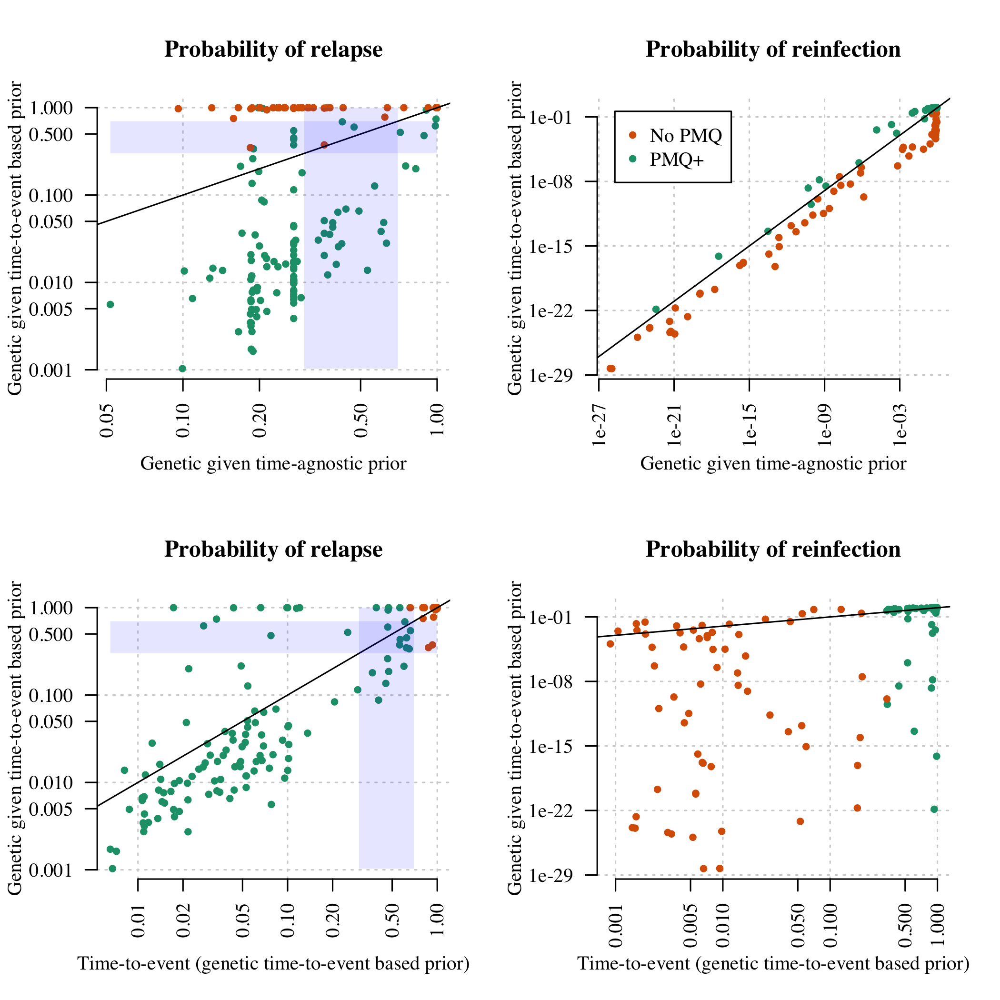
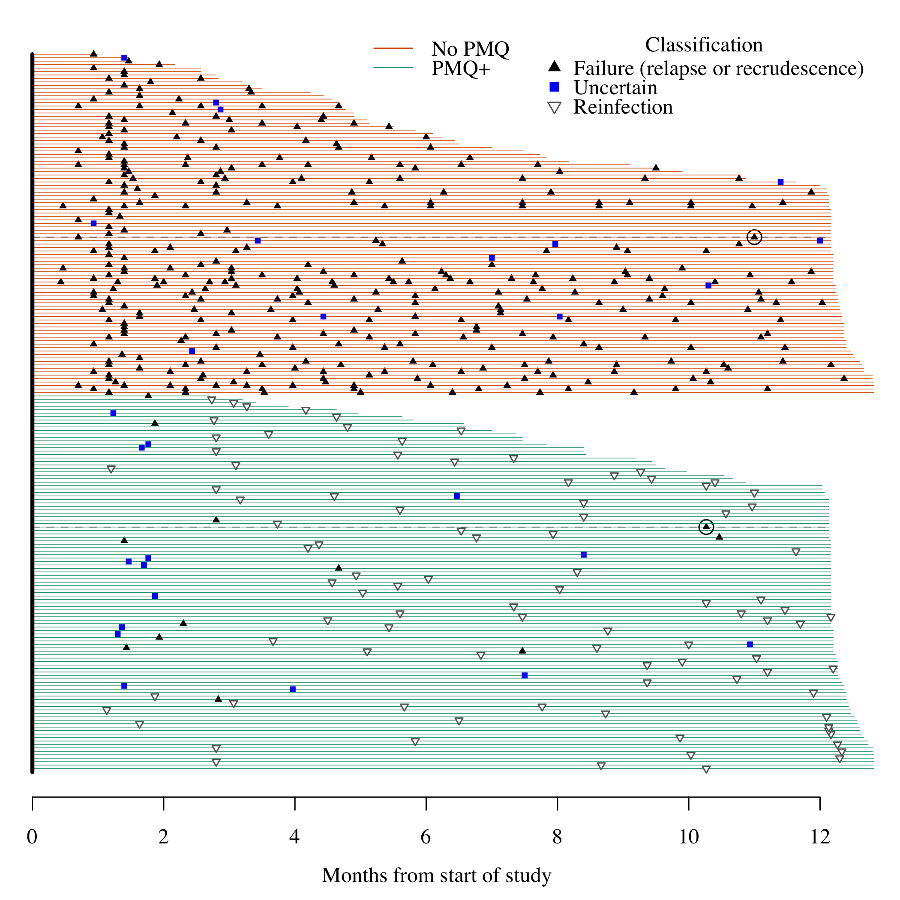

# Preamble

Load R packages, functions and data.


Summary of the data and the whole of the VHX data set versus the subset typed (in terms of number of episodes):


```
## Number of individuals in VHX and BPD trials: 644 and 655, respectively
```

```
## Number of individuals with at least one episode typed: 217
```

```
## Number of episodes typed: 710
```

```
## Number of recurrences typed: 494
```

```
## 
## Overall in the dataset: breakdown by treatment group (individuals typed):
```

```
## 
##  AS CHQ PMQ 
##  13  90 114
```

```
## 
## Within VHX: breakdown by treatment group (VHX individuals typed):
```

```
## 
##  AS CHQ PMQ 
##  13  90  34
```

```
## 
## From BPD trial there are 80 individuals with total of 167 episodes typed (enrollment: 79; recurrent 88)
```

```
## From VHX trial there are 137 individuals with total of 543 episodes typed (enrollment: 137; recurrent 406)
```


```r
#=================================================================
# Were all episodes typed if a person was selected for genotyping? 
#=================================================================
MS_pooled_summary = MS_pooled[!duplicated(MS_pooled$Episode_Identifier),] # Collapse rows due to COI > 2

# No. of typed episodes per person with one or more typed episodes in VHX and BPD
no_of_typed_epi_per_person_typed_VHX = table(MS_pooled_summary$ID[grepl('VHX',MS_pooled_summary$ID)])  
no_of_typed_epi_per_person_typed_BPD = table(MS_pooled_summary$ID[grepl('BPD',MS_pooled_summary$ID)])  

# No. of total episodes per person with one or more typed episodes in VHX and BPD
no_of_epi_per_person_typed_VHX = All_VHX_epi_count[names(All_VHX_epi_count) %in% names(no_of_typed_epi_per_person_typed_VHX)]
no_of_epi_per_person_typed_BPD = All_BPD_epi_count[names(All_BPD_epi_count) %in% names(no_of_typed_epi_per_person_typed_BPD)]

#-------------------------
# VHX data set summary: breif because genotyping VHX was not exhaustive
#-------------------------
X0 = length(no_of_typed_epi_per_person_typed_VHX) # Number of people typed
ind_untyped = no_of_epi_per_person_typed_VHX != no_of_typed_epi_per_person_typed_VHX
X1 = sum(ind_untyped) # Number of people selected for genotyping but some episodes untyped
# How many untyped per person with incomplete set of episodes typed:
X2 = range(no_of_epi_per_person_typed_VHX[ind_untyped] - no_of_typed_epi_per_person_typed_VHX[ind_untyped]) 
X3 = sum(no_of_epi_per_person_typed_VHX - no_of_typed_epi_per_person_typed_VHX) # Total number untyped
writeLines(sprintf('VHX: for %s of %s VHX individual/s selected for genotyping: %s to %s of their episodes were not typed (total of %s episodes untyped summing over the %s individuals)',X1,X0,X2[1],X2[2],X3,X1))
```

```
## VHX: for 27 of 137 VHX individual/s selected for genotyping: 1 to 7 of their episodes were not typed (total of 52 episodes untyped summing over the 27 individuals)
```

```r
#-------------------------
# BPD data set: comprehensive because genotyping BPD was exhaustive
#-------------------------
# How many people who experience one or more recurrences had one or more episodes genotyped? 
recurrences = All_BPD_epi_count[All_BPD_epi_count > 1]-1
indivs_who_recurred = names(recurrences)
indivs_who_were_typed = names(no_of_typed_epi_per_person_typed_BPD)
indivs_who_were_not_typed = indivs_who_recurred[!indivs_who_recurred %in% indivs_who_were_typed]

# Summary over individuals typed 
X0 = length(indivs_who_were_typed) # Number of people typed
ind_untyped = no_of_epi_per_person_typed_BPD != no_of_typed_epi_per_person_typed_BPD
X1 = sum(ind_untyped) # Number of episodes untyped
# How many untyped per person with incomplete set of episodes typed:
X2 = range(no_of_epi_per_person_typed_BPD[ind_untyped] - no_of_typed_epi_per_person_typed_BPD[ind_untyped])  
X3 = sum(no_of_epi_per_person_typed_BPD - no_of_typed_epi_per_person_typed_BPD)  # Total number untyped

# Individuals with not all episodes typed
ind_missing_typed_epi <- names(which(no_of_epi_per_person_typed_BPD != no_of_typed_epi_per_person_typed_BPD)) 

# All episodes of the BPD individuals missing one or episodes
X4 = lapply(ind_missing_typed_epi, function(x){
  ind = grepl(x, uncensored_patientids)
  Combined_Time_Data$episode[!censored_ind][ind]
})

# Typed episodes of the BPD individuals missing one or episodes
X5 = lapply(ind_missing_typed_epi, function(x){
  ind = grepl(x, MS_pooled_summary$ID)
  MS_pooled_summary$Episode[ind]
})

X6 = lapply(1:length(X5), function(i){setdiff(X4[[i]], X5[[i]])}) # Not typed episodes
X7 = sum(sapply(X6, function(x)sum(x>1))) # Not typed recurrence

writeLines(paste(sprintf('BPD: of %s of the people who recurred: %s person/people with %s recurrence/s was not selected for genotyping.',
                         length(unique(indivs_who_recurred)), 
                         length(unique(indivs_who_were_not_typed)), 
                         recurrences[indivs_who_were_not_typed]), 
                 sprintf('Of %s of %s BPD individual/s selected for genotyping: %s to %s of their episodes were not typed (%s episodes summing over the %s individuals).', X1,X0,X2[1],X2[2],X3,X1), 
                 sprintf('Of the %s episodes not typed %s were recurrences.',X3, X7),
                 sprintf('In total there were %s recurrences: %s untyped.', sum(recurrences), recurrences[indivs_who_were_not_typed] + X7)))
```

```
## BPD: of 81 of the people who recurred: 1 person/people with 1 recurrence/s was not selected for genotyping. Of 4 of 80 BPD individual/s selected for genotyping: 1 to 1 of their episodes were not typed (4 episodes summing over the 4 individuals). Of the 4 episodes not typed 3 were recurrences. In total there were 92 recurrences: 4 untyped.
```

<!-- -->


```r
#=================================================================
# Visual check of difference in episode counts between VHX 
# that where genetically typed and not
#=================================================================
# Condition on CQ since these were the ones selected for genotyping 
CQ_ind_epi <- Combined_Time_Data$arm_num == "CHQ" 
# vector of patientids excluding censored rows and those without CQ
uncensored_patientids = Combined_Time_Data[!censored_ind & CQ_ind_epi, 'patientid'] 
# Number of episodes per person VHX
All_VHX_epi_count = table(uncensored_patientids[grepl('VHX_',uncensored_patientids)]) 

# Condition on those that have one or more recurrence
All_VHX_rec_count = All_VHX_epi_count[All_VHX_epi_count > 1] 
x1 = no_of_epi_per_person_typed_VHX
x2 = All_VHX_rec_count[!names(All_VHX_rec_count) %in% names(x1)] # No of epi per person untyped
# setequal(names(x1), names(x2)) # Check mutually exclusive
# setequal(names(x2), unique(names(MS_pooled_summary$ID))) # Further check 
max_rec = max(All_VHX_rec_count)
```

<!-- -->

Summary of complexity of infection based on numbers of alleles observed. This is broken down by enrollment episodes (this is independent of drug given) and subsequent recurrences which could be drug dependent.


```r
COIs = data.frame(t(sapply(unique(MS_pooled$Episode_Identifier), function(x){
  ind = which(MS_pooled$Episode_Identifier == x)
  c(MOI=max(MS_pooled$MOI_id[ind]),
    Enrollment = MS_pooled$Episode[ind[1]] == 1,
    Drug = MS_pooled$Treatment[ind[1]])
})))
COIs$MOI = as.numeric(COIs$MOI)
COIs$Enrollment = COIs$Enrollment=='TRUE'
COIs$PMQ = 0 
COIs$PMQ[!COIs$Enrollment & COIs$Drug=='PMQ']=1
```

<!-- -->

```
## 
## Call:
## glm(formula = MOI ~ enrollment + drug, family = "poisson", data = data.frame(MOI = COIs$MOI - 
##     1, enrollment = as.numeric(COIs$Enrollment), drug = COIs$PMQ))
## 
## Deviance Residuals: 
##     Min       1Q   Median       3Q      Max  
## -0.9526  -0.8065  -0.7595   0.6986   2.9375  
## 
## Coefficients:
##             Estimate Std. Error z value Pr(>|z|)    
## (Intercept) -1.24337    0.09667 -12.862  < 2e-16 ***
## enrollment   0.45306    0.13982   3.240  0.00119 ** 
## drug         0.12007    0.18533   0.648  0.51707    
## ---
## Signif. codes:  0 '***' 0.001 '**' 0.01 '*' 0.05 '.' 0.1 ' ' 1
## 
## (Dispersion parameter for poisson family taken to be 1)
## 
##     Null deviance: 619.82  on 709  degrees of freedom
## Residual deviance: 609.30  on 707  degrees of freedom
## AIC: 1057.2
## 
## Number of Fisher Scoring iterations: 6
```

```
## Mean complexity of recurrent episodes is 1.29, and mean complexity of enrollment episodes is 1.45
```

```
## Median COI in VHX and BPD: 1 and 1, respectively
```

```
## 30 of 710 episodes (4 percent) with COI greater than or equal to 3
```


From this Poisson regression, there appears to be evidence that enrollment episodes have higher complexities of infection than recurrences. This implies that relapses are more likely to be single hypnozoite activated infections?


# Allele frequencies

First we define the set of microsatellite markers used in this analysis:

```r
MSs_all = c("PV.3.502","PV.3.27","PV.ms8",
            "PV.1.501","PV.ms1","PV.ms5",
            "PV.ms6","PV.ms7","PV.ms16")
```

We use a multinomial-dirichlet model with subjective weight $\omega$. $\omega = 0$ recovers the empirical allele frequencies. 


```
## Number of episodes used to compute frequencies: 216
```


```r
#==================================================================
# Save a data set of monoclonal data and allele frequencies for
# relatedness estimation
#==================================================================
monoclonal_names = rownames(COIs)[COIs$MOI == 1]
monoclonal_data = MS_pooled[MS_pooled$Episode_Identifier%in%monoclonal_names, ]
save(monoclonal_data, Fs_Combined, file = '../RData/Data_for_relatedness.RData')
```

Calculate the effective marker cardinality for each microsatellite marker using a simulation approach.


```r
N = 10^6
Effective_Allele_size = list()
for(ms in MSs_all){
  n_obs_alleles = length(table(MS_pooled[Ind_Primary,ms]))
  draw1 = sample(x = names(Fs_Combined[[ms]]), replace = T, size = N, prob = Fs_Combined[[ms]])
  draw2 = sample(x = names(Fs_Combined[[ms]]), replace = T, size = N, prob = Fs_Combined[[ms]])
  x = mean(draw1 == draw2)
  n = 1/x
  writeLines(sprintf('The effective cardinality for %s with %s observed alleles is %s', ms, n_obs_alleles, round(n,2)))
  Effective_Allele_size[[ms]] = round(n,1)
}
```

```
## The effective cardinality for PV.3.502 with 13 observed alleles is 7.04
## The effective cardinality for PV.3.27 with 33 observed alleles is 13.81
## The effective cardinality for PV.ms8 with 46 observed alleles is 28.25
## The effective cardinality for PV.1.501 with 17 observed alleles is 12.91
## The effective cardinality for PV.ms1 with 7 observed alleles is 4.32
## The effective cardinality for PV.ms5 with 24 observed alleles is 11.96
## The effective cardinality for PV.ms6 with 25 observed alleles is 11.91
## The effective cardinality for PV.ms7 with 14 observed alleles is 6.91
## The effective cardinality for PV.ms16 with 39 observed alleles is 20.01
```

```r
# The mean and range in our data set
writeLines(sprintf('The mean effective marker cardinality is %s, range: %s to %s', 
                   round(mean(unlist(Effective_Allele_size)),2), 
                   round(min(unlist(Effective_Allele_size)),2), 
                   round(max(unlist(Effective_Allele_size)),2)))
```

```
## The mean effective marker cardinality is 13.01, range: 4.3 to 28.3
```


## Plotting allele frequencies

These are the mean posterior allele frequencies (dots) and 95\% credible intervals (bars) given pooled enrollment data and $\omega=$ `D_weight_Prior`.  

<!-- -->


# Computing the probability of relatedness across infections

The approach is Bayesian and consists of the following:

* A prior probability vector for the recurrence state from the time-to-event model
* An allele frequency estimate from the posterior distribution of allele frequencies
* A likelihood based on the genetic data of being a *relapse*, a *recrudescence*, or a *reinfection* given the observed microsatellite data.

The following iterates through each individual and computes the probability of relatedness states.


```r
# First we remove MS data for which there are no recurrent data
N_episodes_typed = table(MS_pooled$ID[!duplicated(MS_pooled$Episode_Identifier)])
MS_pooled = filter(MS_pooled, ID %in% names(N_episodes_typed[N_episodes_typed>1]))
# recreate pooled summary dataset
MS_pooled_summary = MS_pooled[!duplicated(MS_pooled$Episode_Identifier),] 

writeLines(sprintf('Number of individuals with at least two typed episodes analysed: %s',
                   length(unique(MS_pooled$ID))))
```

```
## Number of individuals with at least two typed episodes analysed: 212
```

```r
writeLines(sprintf('Number of episodes in individuals with at least two typed episodes analysed: %s',
                   length(unique(MS_pooled$Episode_Identifier))))
```

```
## Number of episodes in individuals with at least two typed episodes analysed: 705
```

```r
writeLines(sprintf('Number of typed recurrences analysed: %s',
                   length(unique(MS_pooled$Episode_Identifier[MS_pooled$Episode>1]))))
```

```
## Number of typed recurrences analysed: 493
```


## Load the time-to-event priors


```r
inds = grepl('mean_theta', colnames(Mod2_ThetaEstimates)) # Extract mean
p = data.frame(Episode_Identifier = Mod2_ThetaEstimates$Episode_Identifier, 
               Mod2_ThetaEstimates[,inds],
               stringsAsFactors = F) # Reformat
colnames(p) = gsub(pattern = 'Recrudescence_mean_theta',replacement = 'C',x = colnames(p))
colnames(p) = gsub(pattern = 'Relapse_mean_theta',replacement = 'L',x = colnames(p))
colnames(p) = gsub(pattern = 'ReInfection_mean_theta',replacement = 'I',x = colnames(p))

genetic_AND_time_data_eps = intersect(p$Episode_Identifier, MS_pooled$Episode_Identifier)
p = p[p$Episode_Identifier %in% genetic_AND_time_data_eps,] # Only need priors for those with genetic data

# Extract posterior estimates only if running full posterior simple or inflated
if(RUN_MODELS_FULL_POSTERIOR_SIMPLE | RUN_MODELS_FULL_POSTERIOR_INFLATED){
  Post_samples_matrix = Post_samples_matrix[Post_samples_matrix$Episode_Identifier %in% genetic_AND_time_data_eps,]
}
```


## Computation using full dataset 

We use all 9MS markers (when available).


### Full posterior computation


# Plot results


```r
# Output of time-to-event model (sorted by episode number s.t. columns correspond)
Time_Estimates_1 = filter(Mod2_ThetaEstimates, Episode_Identifier %in% thetas_9MS$Episode_Identifier)
Time_Estimates_1 = arrange(Time_Estimates_1, Episode_Identifier)

# Outputs of genetic model w/wo time prior 
# sorted by episode number s.t. columns correspond and drug added
thetas_9MS = arrange(thetas_9MS, Episode_Identifier)
thetas_9MS_Tagnostic = arrange(thetas_9MS_Tagnostic, Episode_Identifier)
thetas_9MS$drug = Time_Estimates_1$arm_num # Add drug
thetas_9MS_Tagnostic$drug = Time_Estimates_1$arm_num # Add drug

# Extract BPD only for BPD only plots
BPD_data = Thetas_full_post[grep('BPD',rownames(Thetas_full_post)),]
Thetas_BPD = thetas_9MS[grep('BPD', thetas_9MS$Episode_Identifier),]

# Extract prior used in absence of time-to-event
Time_agnostic_p = as.list(formals(post_prob_CLI)$p)
```


## Going from time-to-event prior to posterior

Plotted by radical cure versus no radical cure, as that is the most informative distinction here.

<!-- -->

Probability of states, ordered from most to least likely:

<!-- -->


# BPD Final plot


```
## The weighted average of recurrences which are estimated to be failures is 15.92%
## The weighted average of recurrences which are estimated to be relapses is 15.78%
## Number of BPD recurrences analysed: 87
```

<!-- -->


# Extra computations for VHX: too complex episodes


We remove the IDs that can be straightforwardly calculated:


```r
ind_calculated = which(MS_pooled_summary$Episode_Identifier %in% thetas_9MS$Episode_Identifier)
IDs_calculated = unique(MS_pooled_summary$ID[ind_calculated])
IDs_remaining = unique(MS_pooled_summary$ID[! MS_pooled_summary$ID %in% IDs_calculated])
writeLines(sprintf('individuals with more than two recurrences: %s',length(IDs_remaining)))
```

```
## individuals with more than two recurrences: 54
```

We blow up the pooled analysis into all pairs within individuals:


Construct adjacency graphs and compute probabilities of relapse and reinfection.


```r
MS_pooled_summary$L_or_C_state = MS_pooled_summary$TotalEpisodes = NA
MS_pooled_summary$L_lower = MS_pooled_summary$L_upper = MS_pooled_summary$L_mean = NA
MS_pooled_summary$C_lower = MS_pooled_summary$C_upper = MS_pooled_summary$C_mean = NA
MS_pooled_summary$I_lower = MS_pooled_summary$I_upper = MS_pooled_summary$I_mean = NA
# Arrange by complexity
# Get single rows per episode (throw away the extra MOI information)
MS_inflated_summary = MS_inflated[!duplicated(MS_inflated$Episode_Identifier) & 
                                    MS_inflated$Episode==2,]
Results_Inflated$Episode_Identifier = as.character(Results_Inflated$Episode_Identifier)
for(i in 1:nrow(MS_inflated_summary)){
  if(!length(which(MS_inflated_summary$Episode_Identifier[i] == 
                   Results_Inflated$Episode_Identifier))>0){
    MS_inflated_summary = MS_inflated_summary[-i,]
    print('removing')
  }
}
```

```
## [1] "removing"
## [1] "removing"
```

```r
Results_Inflated$ID_True = MS_inflated_summary$ID_True
Results_Inflated$First_EpNumber = MS_inflated_summary$First_EpNumber
Results_Inflated$Second_EpNumber = MS_inflated_summary$Second_EpNumber


# Iterate through the ones we can calculate in one go
episodes_full_model = unique(Thetas_full_post$Episode_Identifier)
cols_remove = grep('Episode_Identifier', colnames(Thetas_full_post))
Thetas_full_post = Thetas_full_post[, -cols_remove]
for(ep in episodes_full_model){
  ind1 = (MS_pooled_summary$Episode_Identifier==ep)
  ind2 = rownames(Thetas_full_post)==ep
  
  ## Summaries for relapse
  MS_pooled_summary$L_upper[ind1] = quantile(unlist(Thetas_full_post[ind2, grep('L',colnames(Thetas_full_post))]),
                                             probs=0.9, na.rm = T)
  MS_pooled_summary$L_lower[ind1] = quantile(unlist(Thetas_full_post[ind2,
                                                                     grep('L',colnames(Thetas_full_post))]),
                                             probs=0.1, na.rm = T)
  MS_pooled_summary$L_mean[ind1] = quantile(unlist(Thetas_full_post[ind2, grep('L',colnames(Thetas_full_post))]),
                                            probs=0.5, na.rm = T)
  
  ## Summaries for recrudescence
  MS_pooled_summary$C_upper[ind1] = quantile(unlist(Thetas_full_post[ind2, grep('C',colnames(Thetas_full_post))]),
                                             probs=0.9, na.rm = T)
  MS_pooled_summary$C_lower[ind1] = quantile(unlist(Thetas_full_post[ind2, grep('C',colnames(Thetas_full_post))]),
                                             probs=0.1, na.rm = T)
  MS_pooled_summary$C_mean[ind1] = quantile(unlist(Thetas_full_post[ind2, grep('C',colnames(Thetas_full_post))]),
                                            probs=0.5, na.rm = T)
  
  ## Summaries for reinfection
  MS_pooled_summary$I_upper[ind1] = quantile(unlist(Thetas_full_post[ind2, grep('I',colnames(Thetas_full_post))]),
                                             probs=0.9, na.rm = T)
  MS_pooled_summary$I_lower[ind1] = quantile(unlist(Thetas_full_post[ind2, grep('I',colnames(Thetas_full_post))]),
                                             probs=0.1, na.rm = T)
  MS_pooled_summary$I_mean[ind1] = quantile(unlist(Thetas_full_post[ind2, grep('I',colnames(Thetas_full_post))]),
                                            probs=0.5, na.rm = T)
  
  # Just going to classify on relapse versus reinfection
  if(!is.na(MS_pooled_summary$L_upper[ind1])){
    if(MS_pooled_summary$L_upper[ind1] < Epsilon_lower){
      MS_pooled_summary$L_or_C_state[ind1] = 'I'
    } else if(MS_pooled_summary$L_lower[ind1] > Epsilon_upper){
      MS_pooled_summary$L_or_C_state[ind1] = 'L'
    } else {
      MS_pooled_summary$L_or_C_state[ind1] = 'Uncertain'
    }
  } else {
    MS_pooled_summary$L_or_C_state[ind1] = NA
  }
}
####***************####################
# Now iterate through the complex ones
for(i in 1:length(IDs_remaining)){
  id = IDs_remaining[i]
  Doubles_Thetas = filter(Results_Inflated, ID_True==id)
  
  for(ep in unique(Doubles_Thetas$Second_EpNumber)){
    ind1 = which(MS_pooled_summary$ID==id & MS_pooled_summary$Episode==ep)
    ind2 = which(Doubles_Thetas$Second_EpNumber == ep)
    
    MS_pooled_summary$L_lower[ind1] = mean(Doubles_Thetas$L_min[ind2],na.rm=T)
    MS_pooled_summary$L_upper[ind1] = mean(Doubles_Thetas$L_max[ind2],na.rm=T)
    MS_pooled_summary$L_mean[ind1] = mean(Doubles_Thetas$L_mean[ind2],na.rm=T)
    
    MS_pooled_summary$C_lower[ind1] = mean(Doubles_Thetas$C_min[ind2],na.rm=T)
    MS_pooled_summary$C_upper[ind1] = mean(Doubles_Thetas$C_max[ind2],na.rm=T)
    MS_pooled_summary$C_mean[ind1] = mean(Doubles_Thetas$C_mean[ind2],na.rm=T)
    
    MS_pooled_summary$I_lower[ind1] = mean(Doubles_Thetas$I_min[ind2],na.rm=T)
    MS_pooled_summary$I_upper[ind1] = mean(Doubles_Thetas$I_max[ind2],na.rm=T)
    MS_pooled_summary$I_mean[ind1] = mean(Doubles_Thetas$I_mean[ind2],na.rm=T)
    
    if(!is.na(MS_pooled_summary$L_upper[ind1])){
      if(MS_pooled_summary$L_upper[ind1] < MS_pooled_summary$L_lower[ind1]){
        writeLines(sprintf('Problem with ID %s',id))
        stop()
      }
      if(MS_pooled_summary$L_upper[ind1] < Epsilon_lower){
        MS_pooled_summary$L_or_C_state[ind1] = 'I'
      } else if(MS_pooled_summary$L_lower[ind1] > Epsilon_upper){
        MS_pooled_summary$L_or_C_state[ind1] = 'L'
      } else {
        MS_pooled_summary$L_or_C_state[ind1] = 'Uncertain'
      }
    }
  }
}

MS_pooled_summary$Drug = MS_pooled_summary$FU = NA
for(id in MS_pooled_summary$ID){
  ind = MS_pooled_summary$ID==id
  MS_pooled_summary$TotalEpisodes[ind] = max(MS_pooled_summary$Episode[ind])
  MS_pooled_summary$Drug[ind] = as.numeric(
    Combined_Time_Data$arm_num[Combined_Time_Data$patientid==id][1] == 'CHQ/PMQ') + 2
  MS_pooled_summary$FU[ind] = Combined_Time_Data$FU_time[Combined_Time_Data$patientid==id][1]
}

MS_pooled_summary$Plotting_pch_Values = 
  as.numeric(mapvalues(MS_pooled_summary$L_or_C_state, from = c('L','Uncertain','I'), to = c(17,15,1)))
MS_pooled_summary$Plotting_col_Values = 
  as.numeric(mapvalues(MS_pooled_summary$L_or_C_state, from = c('L','Uncertain','I'), to = 1:3))
```

```r
# How many too complex to generate estimate for? 
ind_recur = MS_pooled_summary$Episode > 1 # Filter out enrollment
ind_complex_recur = is.na(MS_pooled_summary$L_mean[ind_recur])
no_complex_recur = sum(ind_complex_recur) # Recurrences with NAs

# How many of the complex infections result in the loss of an individual
no_indiv_removed = sum(N_episodes_typed[MS_pooled_summary$ID[ind_recur][ind_complex_recur]] <= 2) 
# Final number of people with recurrences analysed total and by trial
indiv_recur_analysed = length(unique(MS_pooled_summary$ID[ind_recur][!ind_complex_recur])) 
BPD_indiv_recur_analysed = sum(grepl('BPD', unique(MS_pooled_summary$ID[ind_recur][!ind_complex_recur])))
VHX_indiv_recur_analysed = sum(grepl('VHX', unique(MS_pooled_summary$ID[ind_recur][!ind_complex_recur]))) 

writeLines(sprintf('Of %s recurrences analysed, %s were too complex to estimate recurrence state probabilities, resulting in probability estimates for a total of %s recurrences from %s individuals (%s BPD and %s VHX)',
                   sum(ind_recur), no_complex_recur,  sum(!ind_complex_recur), 
                   indiv_recur_analysed, BPD_indiv_recur_analysed, VHX_indiv_recur_analysed))
```

```
## Of 493 recurrences analysed, 7 were too complex to estimate recurrence state probabilities, resulting in probability estimates for a total of 486 recurrences from 208 individuals (77 BPD and 131 VHX)
```


<!-- -->

```
## The Coatney style plot is showing 486 recurrences in 208 individuals
```

<!-- -->

Individuals who appear to relapse very late (more than 300 days after last episode):

```r
MS_pooled = reformat_MSdata(MS_pooled)
IDs_late_relapse = MS_final[which(MS_final$timeSinceLastEpisode>300 & MS_final$L_lower>.9),'ID']

writeLines(sprintf('The episode ids of interest are: %s',
                   MS_final[which(MS_final$timeSinceLastEpisode>300 & MS_final$L_lower>.9),
                            'Episode_Identifier']))
```

```
## The episode ids of interest are: VHX_235_3
## The episode ids of interest are: BPD_27_2
```

```r
print(MS_pooled[MS_pooled$ID%in%IDs_late_relapse,])
```

```
##          ID Episode Episode_Identifier Treatment MOI_id
## 60   BPD_27       1           BPD_27_1       PMQ      1
## 61   BPD_27       2           BPD_27_2       PMQ      1
## 62   BPD_27       2           BPD_27_2       PMQ      2
## 355 VHX_235       1          VHX_235_1       CHQ      1
## 356 VHX_235       1          VHX_235_1       CHQ      2
## 357 VHX_235       2          VHX_235_2       CHQ      1
## 358 VHX_235       3          VHX_235_3       CHQ      1
##     timeSinceLastEpisode timeSinceEnrolment PV.1.501 PV.3.27 PV.3.502
## 60                     0                  0        3      33        7
## 61                   308                308        3      33        7
## 62                   308                308        3      35        7
## 355                    0                  0        1       5        2
## 356                    0                  0        1       5        2
## 357                   21                 21        1       5        3
## 358                  309                330        1       5        3
##     PV.ms1 PV.ms16 PV.ms5 PV.ms6 PV.ms7 PV.ms8
## 60       4      27     24     15      5     17
## 61       4      27     24     15      5     17
## 62       4      27     24     15      5     17
## 355      3      23     13      9     10     12
## 356      3      23     13     15     10     33
## 357      4      20     13      9     10     12
## 358      4      23     11     15     10     12
```


The summaries of the final dataset. Results for all those genotyped who did not receive primaquine (artesunate or chloroquine monotherapy):

```
## 
##  AS CHQ PMQ 
##  11  88 109
```

```
## In no-primaquine individuals, the weighted average of relapse is 99.3 (96.8-99.9), for 365 recurrences
```

```
## In no-primaquine individuals, the weighted average of recrudescences is 0.3 (0.1-0.6), for 365 recurrences
```

```
## In no-primaquine individuals, the weighted average of reinfections is 0.4 (0-2.6), for 365 recurrences
```

Results for all those genotyped who did receive primaquine (VHX and BPD studies combined):

```
## In primaquine treated individuals, the weighted average of relapses is 14.3 (12.3-16.7), for 121 recurrences
```

```
## In primaquine treated individuals, the weighted average of recrudescences is 0 (0-0.3), for 121 recurrences
```

```
## In primaquine treated individuals, the weighted average of reinfections is 85.7 (83.3-87.5), for 121 recurrences
```

Results for all those genotyped who did receive primaquine in the VHX study (unknown denominator)

```
## In primaquine treated individuals (VHX), the weighted average of relapses is 10.4 (8.5-12.7), for 34 recurrences
```

```
## In primaquine treated individuals (VHX), the weighted average of recrudescences is 0 (0-0.2), for 34 recurrences
```

```
## In primaquine treated individuals (VHX), the weighted average of reinfections is 89.6 (87.3-91.3), for 34 recurrences
```

Results for all those genotyped who did receive primaquine, only in the BPD study (known denominator)

```
## In primaquine treated individuals (BPD), the weighted average of relapses is 15.8 (13.7-18.3), for 87 recurrences
```

```
## In primaquine treated individuals (BPD), the weighted average of recrudescences is 0 (0-0.3), for 87 recurrences
```

```
## In primaquine treated individuals (BPD), the weighted average of reinfections is 84.1 (81.7-86), for 87 recurrences
```

# False positive rate of relapse

We want to know how often our model estimates evidence of relapse across pairs of episodes when the episodes are in different people (i.e. have not possibility of being a relapse)


```r
if(RUN_MODELS_FALSE_POSITIVE){
  # check if the massive pairwise dataset has been made, if not make it 
  # (takes a long time ~20hours)
  if(!"APC_MSdata.bigRData"%in%list.files()){
    # The pooled MS data from BPD and VHX
    load('../RData/GeneticModel/MS_data_PooledAnalysis.RData')
    tic()
    APC_MSdata = Make_All_Pairwise_Comparisons(MS_data = MS_pooled, ncores=42)
    save(APC_MSdata, file = 'APC_MSdata.bigRData')
    toc()
  } 
  load('APC_MSdata.bigRData')
  print('The inflated pairwise dataset is available, now running the analysis...')
  # Run the genetic model on the pairwise data
  tic()
  Inflated_Results = post_prob_CLI(MSdata = APC_MSdata, 
                                   Fs = Fs_Combined, 
                                   UpperComplexity = 10^6, 
                                   verbose = F,
                                   cores = 42)
  toc()
  save(Inflated_Results, file = 'Inflated_Results.bigRData')
} else {
  load('~/Dropbox/RecurrentVivax/Pooled_Final_Analysis/Inflated_Results.bigRData')
  Inflated_Results = Inflated_Results[!is.na(Inflated_Results$L),]
  load('~/Dropbox/RecurrentVivax/Pooled_Final_Analysis/APC_MSdata.bigRData')
}
```


```
## The false-positive discovery rate of the genetic model is estimated as 2.15 percent. 
##                    
## This is based on 90194 pairwise comparisons
```

# Analysis of radical cure efficacy in BPD

Almost all episodes in BPD were typed. Therefore we can estimate the true efficacy comparing with historical controls (VHX).


```r
Combined_Time_Data$Episode_Identifier = apply(Combined_Time_Data,1,
                                              function(x){
                                                paste(x['patientid'],as.integer(x['episode']),
                                                      sep='_')} )

# iterate over every episode and use either the joint posterior 
# or if missing the time probability (this could be time censored probability)
Combined_Time_Data$Reinfection_Probability=
  Combined_Time_Data$Reinfection_Probability_LL=
  Combined_Time_Data$Reinfection_Probability_UL = NA

Mod2_ThetaEstimates$Failure_Identifier = 
  apply(Mod2_ThetaEstimates, 1, 
        function(x) paste(x['patientid'], as.integer(x['episode'])-1,sep='_'))

sss=0
for(i in 1:nrow(Combined_Time_Data)){
  ep_id = Combined_Time_Data$Episode_Identifier[i]
  MS_id = paste(Combined_Time_Data$patientid[i],
                as.integer(Combined_Time_Data$episode[i])+1, sep='_')
  # If in MS_final then use full probability
  if(MS_id %in% MS_final$Episode_Identifier){
    Combined_Time_Data$Reinfection_Probability[i] =
      MS_final$I_mean[MS_final$Episode_Identifier==MS_id]
    Combined_Time_Data$Reinfection_Probability_UL[i] =
      MS_final$I_upper[MS_final$Episode_Identifier==MS_id]
    Combined_Time_Data$Reinfection_Probability_LL[i] =
      MS_final$I_lower[MS_final$Episode_Identifier==MS_id]
  } else { # use the time to event model
    ind = which(Mod2_ThetaEstimates$Failure_Identifier==ep_id)
    if(length(ind)>0){
      Combined_Time_Data$Reinfection_Probability[i] =
        Mod2_ThetaEstimates$ReInfection_mean_theta[ind]
      Combined_Time_Data$Reinfection_Probability_UL[i] =
        Mod2_ThetaEstimates$ReInfection_975_theta[ind]
      Combined_Time_Data$Reinfection_Probability_LL[i] =
        Mod2_ThetaEstimates$ReInfection_025_theta[ind]
      sss=sss+1
    }
  }
}
```


Now we look at whether the PK (carboxy-primaquine) can predict failure:
First we add the carboxy to the dataset:

```r
Combined_Time_Data = arrange(Combined_Time_Data, patientid, episode)
load('../RData/PK_data/BPD_pk.RData')
BPD_pk = filter(BPD_pk, !is.na(Episode))
Combined_Time_Data$log10_carboxyPMQ = NA
Combined_Time_Data$log10_PMQ = NA
Combined_Time_Data$NumberDaysPMQ = 14
for(i in 1:nrow(Combined_Time_Data)){
  id = Combined_Time_Data$patientid[i]
  ep_i = Combined_Time_Data$episode[i]
  all_id_eps = Combined_Time_Data$episode[Combined_Time_Data$patientid==id]
  pk_ind = which(BPD_pk$ID == id & BPD_pk$Episode==ep_i)
  if(length(pk_ind)>0){
    if(length(pk_ind)>1) print(id)
    Combined_Time_Data$log10_carboxyPMQ[i] = mean(BPD_pk$log10_carboxyPQ_PK[pk_ind])
    Combined_Time_Data$log10_PMQ[i] = mean(BPD_pk$log10_PQ_PK[pk_ind])
    Combined_Time_Data$NumberDaysPMQ[i] = BPD_pk$NumberofPKDays[pk_ind[1]]
  }
}
```

```
## [1] "BPD_34"
```

We exclude the two recurrences seen in patient BPD_444


```r
# These are two outliers - have discussed with Cindy
BPD444_recurrences = Combined_Time_Data$patientid=='BPD_44' & Combined_Time_Data$episode>1
BPD_598 = which(Combined_Time_Data$patientid=='BPD_598')
ind_keep = !BPD444_recurrences #& !BPD_598
require(lme4)
```

```
## Loading required package: lme4
```

```r
Combined_Time_Data$Failure_YN = Combined_Time_Data$Reinfection_Probability < 0.5
mod = glmer(Failure_YN ~ log10_carboxyPMQ + NumberDaysPMQ + 
              (1 | patientid), 
            family = 'binomial', data=Combined_Time_Data[ind_keep,])
summary(mod)
```

```
## Generalized linear mixed model fit by maximum likelihood (Laplace
##   Approximation) [glmerMod]
##  Family: binomial  ( logit )
## Formula: Failure_YN ~ log10_carboxyPMQ + NumberDaysPMQ + (1 | patientid)
##    Data: Combined_Time_Data[ind_keep, ]
## 
##      AIC      BIC   logLik deviance df.resid 
##    119.8    138.1    -55.9    111.8      717 
## 
## Scaled residuals: 
##     Min      1Q  Median      3Q     Max 
## -0.5862 -0.1303 -0.1095 -0.0912 13.6453 
## 
## Random effects:
##  Groups    Name        Variance  Std.Dev. 
##  patientid (Intercept) 1.624e-14 1.274e-07
## Number of obs: 721, groups:  patientid, 639
## 
## Fixed effects:
##                  Estimate Std. Error z value Pr(>|z|)    
## (Intercept)       2.48402    1.77436   1.400 0.161529    
## log10_carboxyPMQ -1.73527    0.49252  -3.523 0.000426 ***
## NumberDaysPMQ    -0.18324    0.09035  -2.028 0.042554 *  
## ---
## Signif. codes:  0 '***' 0.001 '**' 0.01 '*' 0.05 '.' 0.1 ' ' 1
## 
## Correlation of Fixed Effects:
##             (Intr) l10_PM
## lg10_crbPMQ -0.860       
## NumbrDysPMQ -0.728  0.315
```

```r
# Plot the data and model
xs=seq(0,4,by=.01)
par(las = 1, bty='n')
regimen_colors = brewer.pal(8, 'Dark2')[c(1,5)]
plot(Combined_Time_Data$log10_carboxyPMQ[ind_keep]*Combined_Time_Data$NumberDaysPMQ[ind_keep],
     jitter(as.numeric(Combined_Time_Data$Failure_YN[ind_keep]), factor = 0.02), 
     col = regimen_colors[mapvalues(Combined_Time_Data$NumberDaysPMQ[ind_keep],c(7,14),c(1,2))],
     pch = mapvalues(Combined_Time_Data$NumberDaysPMQ[ind_keep],c(7,14),c(3,4)),
     xlab = 'Carboxy-primaquine exposure: days * log(ng/mL)',
     panel.first = grid(), ylab = 'Probability of failure')
legend(x = 40, y = 0.3, bty='n', col =regimen_colors, 
       pch=c(3,4), legend = c('7 days','14 days'))
lines(xs*7, predict(mod, newdata=data.frame(log10_carboxyPMQ=xs, NumberDaysPMQ=7,
                                            patientid='new'),allow.new.levels=T,
                    type='response'), lwd=2, col= regimen_colors[1], lty=2)
lines(xs*14, predict(mod, newdata=data.frame(log10_carboxyPMQ=xs, NumberDaysPMQ=14,
                                             patientid='new'),allow.new.levels=T,
                     type='response'), lwd=2, col= regimen_colors[2], lty = 2)
points(Combined_Time_Data$log10_carboxyPMQ[BPD_598]*Combined_Time_Data$NumberDaysPMQ[BPD_598],
       Combined_Time_Data$Failure_YN[BPD_598], cex=2)
text(Combined_Time_Data$log10_carboxyPMQ[BPD_598[1]]*
       Combined_Time_Data$NumberDaysPMQ[BPD_598[1]]+3,
     Combined_Time_Data$Failure_YN[BPD_598[1]]-0.05, labels = 'BPD_598')
```

<!-- -->

Now we remove outliers and fit the same model (CPMQ outliers)

```r
mu_hat_7 = mean(Combined_Time_Data$log10_carboxyPMQ[Combined_Time_Data$NumberDaysPMQ==7])
sd_hat_7 = sd(Combined_Time_Data$log10_carboxyPMQ[Combined_Time_Data$NumberDaysPMQ==7])
mu_hat_14 = mean(Combined_Time_Data$log10_carboxyPMQ[Combined_Time_Data$NumberDaysPMQ==14],na.rm=T)
sd_hat_14 = sd(Combined_Time_Data$log10_carboxyPMQ[Combined_Time_Data$NumberDaysPMQ==14],na.rm=T)

par(mfrow=c(1,2))
hist(Combined_Time_Data$log10_carboxyPMQ[Combined_Time_Data$NumberDaysPMQ==7],
     main='', xlab='carboxy primaquine day 7 (ng/mL)')
abline(v = mu_hat_7 - sd_hat_7*3)

hist(Combined_Time_Data$log10_carboxyPMQ[Combined_Time_Data$NumberDaysPMQ==14],
     main = '', xlab='carboxy primaquine day 7 (ng/mL)')
abline(v = mu_hat_14 - sd_hat_14*3)
```

<!-- -->

```r
outliers7 = Combined_Time_Data$NumberDaysPMQ==7 & Combined_Time_Data$log10_carboxyPMQ<mu_hat_7 - sd_hat_7*3
outliers14 = Combined_Time_Data$NumberDaysPMQ==14 & Combined_Time_Data$log10_carboxyPMQ<mu_hat_14 - sd_hat_14*3

mod_No_Outliers = glmer(Failure_YN ~ log10_carboxyPMQ + NumberDaysPMQ + 
                          (1 | patientid), 
                        family = 'binomial', data=Combined_Time_Data[ind_keep & !outliers14 & !outliers7,])
summary(mod_No_Outliers)
```

```
## Generalized linear mixed model fit by maximum likelihood (Laplace
##   Approximation) [glmerMod]
##  Family: binomial  ( logit )
## Formula: Failure_YN ~ log10_carboxyPMQ + NumberDaysPMQ + (1 | patientid)
##    Data: Combined_Time_Data[ind_keep & !outliers14 & !outliers7, ]
## 
##      AIC      BIC   logLik deviance df.resid 
##    111.1    129.3    -51.5    103.1      706 
## 
## Scaled residuals: 
##     Min      1Q  Median      3Q     Max 
## -0.2424 -0.1310 -0.1126 -0.0957 12.0783 
## 
## Random effects:
##  Groups    Name        Variance Std.Dev. 
##  patientid (Intercept) 8.03e-14 2.834e-07
## Number of obs: 710, groups:  patientid, 632
## 
## Fixed effects:
##                  Estimate Std. Error z value Pr(>|z|)
## (Intercept)        0.3447     3.5327   0.098    0.922
## log10_carboxyPMQ  -1.0646     1.0163  -1.048    0.295
## NumberDaysPMQ     -0.1550     0.1091  -1.421    0.155
## 
## Correlation of Fixed Effects:
##             (Intr) l10_PM
## lg10_crbPMQ -0.962       
## NumbrDysPMQ -0.724  0.524
```

Compare results with and without outliers:


```r
par(las = 1, bty='n')
plot(Combined_Time_Data$log10_carboxyPMQ[ind_keep]*Combined_Time_Data$NumberDaysPMQ[ind_keep],
     jitter(as.numeric(Combined_Time_Data$Failure_YN[ind_keep]),factor = 0.03), 
     col = regimen_colors[mapvalues(Combined_Time_Data$NumberDaysPMQ[ind_keep],c(7,14),1:2)],
     pch = mapvalues(Combined_Time_Data$NumberDaysPMQ[ind_keep],c(7,14),c(3,4)),
     xlab = 'Carboxy-primaquine trough exposure: days * log(ng/mL)',
     ylab = 'Probability of failure', panel.first = grid())
legend(x = 25, y = 0.7, bty='n', col = c(1, regimen_colors, 1,1),
       pch=c(1,3,4,NA,NA), lty = c(NA,NA,NA,1,2),lwd=c(NA,NA,NA,2,2),
       legend = c('Outlier','7 days','14 days',
                  'Regression fit: all data', 'Regression fit: outliers removed'))
lines(xs*7, predict(mod, newdata=data.frame(log10_carboxyPMQ=xs, NumberDaysPMQ=7,
                                            patientid='new'),allow.new.levels=T,
                    type='response'), lwd=2, col= regimen_colors[1], lty=1)
lines(xs*14, predict(mod, newdata=data.frame(log10_carboxyPMQ=xs, NumberDaysPMQ=14,
                                             patientid='new'),allow.new.levels=T,
                     type='response'), lwd=2, col= regimen_colors[2], lty = 1)

lines(xs*7, predict(mod_No_Outliers, newdata=data.frame(log10_carboxyPMQ=xs, NumberDaysPMQ=7,
                                                        patientid='new'),allow.new.levels=T,
                    type='response'), lwd=2, col= regimen_colors[1], lty=2)
lines(xs*14, predict(mod_No_Outliers, newdata=data.frame(log10_carboxyPMQ=xs, NumberDaysPMQ=14,
                                                         patientid='new'),allow.new.levels=T,
                     type='response'), lwd=2, col= regimen_colors[2], lty = 2)

# outline the outliers
points(Combined_Time_Data$log10_carboxyPMQ[outliers14|outliers7]*Combined_Time_Data$NumberDaysPMQ[outliers14|outliers7],
       Combined_Time_Data$Failure_YN[outliers14|outliers7], cex=2)
```

<!-- -->

Now we calculate a compressed dataset and failure for each individual


```r
# now we calculate the primaquine failure rate
# For individuals with two episodes: P(failure) = 1 - P(Rec 1 = I)*P(Rec 2 = I)
Summary_data = Combined_Time_Data[!duplicated(Combined_Time_Data$patientid),]
Summary_data$Failure_UL = Summary_data$Failure_LL = 
  Summary_data$Failure = Summary_data$CPMQ = 
  Summary_data$CPMQ = NA
for(i in 1:nrow(Summary_data)){
  ind = which(Combined_Time_Data$patientid==Summary_data$patientid[i])
  Summary_data$Failure[i] = 1-prod(Combined_Time_Data$Reinfection_Probability[ind],na.rm=T)
  Summary_data$Failure_UL[i] = 1-prod(Combined_Time_Data$Reinfection_Probability_UL[ind],na.rm=T)
  Summary_data$Failure_LL[i] = 1-prod(Combined_Time_Data$Reinfection_Probability_LL[ind],na.rm=T)
  Summary_data$CPMQ[i] = median(Combined_Time_Data$log10_carboxyPMQ[ind],na.rm=T)
}
BPD_data = Summary_data[grep('BPD', Summary_data$patientid),]

P_Failure=100*sum(BPD_data$Failure)/nrow(BPD_data)
# invert the intervals here - optimistic for not failure = pessimistic for failure
P_Failure_UL = 100*sum(BPD_data$Failure_LL)/nrow(BPD_data)
P_Failure_LL = 100*sum(BPD_data$Failure_UL)/nrow(BPD_data)

writeLines(sprintf('The primaquine failure rate in the %s individuals is %s%% (%s-%s) over the course of %s years total follow-up.',
                   nrow(BPD_data), round(P_Failure,2),
                   round(P_Failure_LL,2),
                   round(P_Failure_UL,2), round(sum(BPD_data$FU_time)/365)))
```

```
## The primaquine failure rate in the 655 individuals is 2.59% (2.02-3.47) over the course of 522 years total follow-up.
```


Not in manuscript, but looking out of interest: does 2D6 correlate with carboxy ?


```r
TwoD6_dat = read.csv('~/Dropbox/RecurrentVivax/RData/PK_data/TwoD6&Vivax Genotyping_ASscore.csv')
TwoD6_dat$ID = apply(TwoD6_dat, 1, function(x) paste(x['Study'],
                                                     as.integer(x['Patient.ID']),
                                                     sep = '_'))
TwoD6_dat$Phenotype = mapvalues(TwoD6_dat$X2D6.Phenotype, 
                                from = c('PM','IM', 'EM'), to = 1:3)
Combined_Time_Data$Phenotype = Combined_Time_Data$ASscore = NA
for(i in 1:nrow(Combined_Time_Data)){
  id = Combined_Time_Data$patientid[i]
  if(sum(TwoD6_dat$ID==id)>0){
    Combined_Time_Data$ASscore[i] = TwoD6_dat$AS.score[TwoD6_dat$ID==id]
    Combined_Time_Data$Phenotype[i] = TwoD6_dat$Phenotype[TwoD6_dat$ID==id]
  }
}

mod_2D6 = lmer(log10_carboxyPMQ ~ ASscore + NumberDaysPMQ + (1 | patientid), 
               data = Combined_Time_Data)
summary(mod_2D6)
```

```
## Linear mixed model fit by REML ['lmerMod']
## Formula: log10_carboxyPMQ ~ ASscore + NumberDaysPMQ + (1 | patientid)
##    Data: Combined_Time_Data
## 
## REML criterion at convergence: 190.6
## 
## Scaled residuals: 
##     Min      1Q  Median      3Q     Max 
## -4.6041 -0.2741  0.0758  0.3798  5.0223 
## 
## Random effects:
##  Groups    Name        Variance Std.Dev.
##  patientid (Intercept) 0.07392  0.2719  
##  Residual              0.06576  0.2564  
## Number of obs: 234, groups:  patientid, 154
## 
## Fixed effects:
##                Estimate Std. Error t value
## (Intercept)    3.535077   0.113075  31.263
## ASscore       -0.085651   0.056897  -1.505
## NumberDaysPMQ -0.059412   0.006522  -9.109
## 
## Correlation of Fixed Effects:
##             (Intr) ASscor
## ASscore     -0.697       
## NumbrDysPMQ -0.710  0.055
```

```r
plot(Combined_Time_Data$ASscore, Combined_Time_Data$log10_carboxyPMQ, pch=20)
lines(xs, predict(mod_2D6, data.frame(ASscore=xs,NumberDaysPMQ=7,patientid='new'),allow.new.levels=T),lwd=3)
```

<!-- -->


```r
Combined_2D6data = filter(Combined_Time_Data, !is.na(ASscore), !Censored)
for(id in unique(Combined_2D6data$patientid)){
  ind = Combined_2D6data$patientid==id
  Combined_2D6data$Failure_YN[ind] = max(Combined_2D6data$Failure_YN[ind])
}
Combined_2D6data = Combined_2D6data[!duplicated(Combined_2D6data$patientid),]
mod_Failure = glm(Failure_YN ~ ASscore, 
                  data = Combined_2D6data, family = 'binomial')
summary(mod_Failure)
```

```
## 
## Call:
## glm(formula = Failure_YN ~ ASscore, family = "binomial", data = Combined_2D6data)
## 
## Deviance Residuals: 
##     Min       1Q   Median       3Q      Max  
## -0.3616  -0.2074  -0.1566  -0.1566   2.7748  
## 
## Coefficients:
##             Estimate Std. Error z value Pr(>|z|)  
## (Intercept)   -2.695      1.518  -1.776   0.0758 .
## ASscore       -1.134      1.327  -0.854   0.3930  
## ---
## Signif. codes:  0 '***' 0.001 '**' 0.01 '*' 0.05 '.' 0.1 ' ' 1
## 
## (Dispersion parameter for binomial family taken to be 1)
## 
##     Null deviance: 20.065  on 111  degrees of freedom
## Residual deviance: 19.366  on 110  degrees of freedom
##   (2 observations deleted due to missingness)
## AIC: 23.366
## 
## Number of Fisher Scoring iterations: 7
```


# Extra Analyses

## Looking at the effect of inbreeding coefficient

Our model has a parameter $\alpha$ which defines the level of inbreeding within the population.
Taylor is developing methods for the estimation of $\alpha$ from genetic data (in preparation).

We look at the sensitivity of the results (all the above is with $\alpha=0$) for a reasonable upper bound of $\alpha=0.175$.

We rerun the analysis on the single run isolates (low computational complexity):


```r
alphaUpper = 0.175
if(RUN_MODELS_SINGLE_SIMPLE){
  #===============================================
  # Run (with time-to-event)
  #===============================================
  # Approx 100 secs per full model run
  tic()
  thetas_9MS_alphaUpper = post_prob_CLI(MSdata = MS_pooled, Fs = Fs_Combined, 
                                        p = p, cores = 6, verbose = F, alpha = alphaUpper) 
  thetas_9MS_alphaUpper$Episode_Identifier = rownames(thetas_9MS_alphaUpper)
  save(thetas_9MS_alphaUpper, file = '../RData/GeneticModel/thetas_9MS_alphaUpper.RData')
  toc()
} else {
  load('../RData/GeneticModel/thetas_9MS_alphaUpper.RData')
}
```


```r
par(las=1, bty='n', mfrow=c(2,2))
plot(thetas_9MS$L, 
     thetas_9MS_alphaUpper$L,
     log = 'xy',
     ylab = 'Relapse: inbred',
     xlab = 'Relapse: no inbreeding',
     col= drug_cols2[thetas_9MS$drug],pch=20)
lines(c(-10,10),c(-10,10),lty=2)

plot(log10(thetas_9MS$L), log10(thetas_9MS$L)-log10(thetas_9MS_alphaUpper$L),
     ylab = 'Difference in Log Relapse Probabilities',
     xlab = 'Relapse Probability: no inbreeding',
     col= drug_cols2[thetas_9MS$drug],pch=20)
abline(h=0,lty=2)
legend('topleft', legend = c('No PMQ', 'PMQ+'), col = drug_cols2[2:3], pch = 20, bty = 'n')

###****** Reinfection : comparison *****#####
par(las=1, bty='n')
plot(thetas_9MS$I, thetas_9MS_alphaUpper$I,
     log = 'xy',
     ylab = 'Reinfection: inbred',
     xlab = 'Reinfection: no inbreeding',
     col= drug_cols2[thetas_9MS$drug],pch=20)
lines(c(-10,10),c(-10,10),lty=2)

plot(log10(thetas_9MS$I), log10(thetas_9MS$I)-log10(thetas_9MS_alphaUpper$I),
     ylab = 'Difference in Log Reinfection Probabilities',
     xlab = 'Reinfection: no inbreeding',
     col= drug_cols2[thetas_9MS$drug],pch=20)
legend('topleft', legend = c('No PMQ', 'PMQ+'), col = drug_cols2[2:3], pch = 20, bty = 'n')

abline(h=0,lty=2)
```

<!-- -->

Interpretation: Adding the inbreeding coefficent slightly changes some of the probabilities of relapse for some primaquine treated individuals (only green dots are being shifted).
This means that inbreeding would imply that fewer of the primaquine treated episodes are relapses, implying higher efficacy of the drug.

For the non-primaquine group, it is just tempering the very low probabilities of reinfection seen for some episodes.

In conclusion, this isn't changing the results significantly and would imply a greater primaquine efficacy that reported in the paper.
