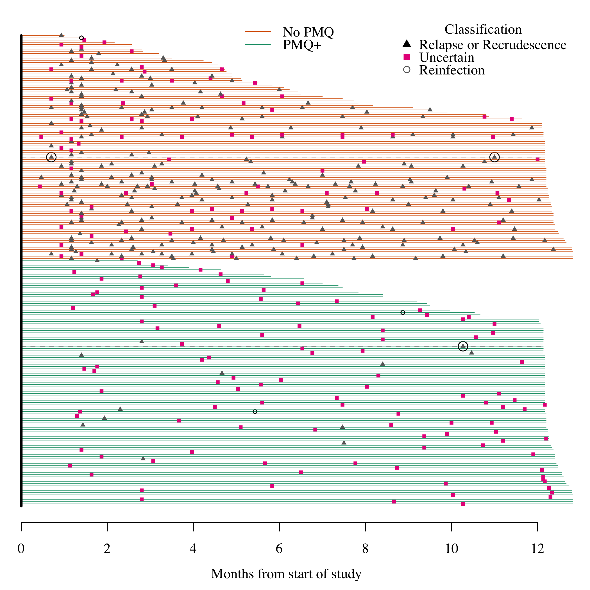

# Preamble

Load R packages, functions and data.


## Data processing


```r
# First we remove MS data for which there are no recurrent data
N_episodes_typed = table(MS_pooled$ID[!duplicated(MS_pooled$Episode_Identifier)])
MS_pooled = filter(MS_pooled, ID %in% names(N_episodes_typed[N_episodes_typed>1]))
```

```
## Warning: package 'bindrcpp' was built under R version 3.4.4
```

```r
# recreate pooled summary dataset
MS_pooled_summary = MS_pooled[!duplicated(MS_pooled$Episode_Identifier),] 

writeLines(sprintf('Number of individuals with at least two typed episodes analysed: %s',
                   length(unique(MS_pooled$ID))))
```

```
## Number of individuals with at least two typed episodes analysed: 212
```

```r
writeLines(sprintf('Number of episodes in individuals with at least two typed episodes analysed: %s',
                   length(unique(MS_pooled$Episode_Identifier))))
```

```
## Number of episodes in individuals with at least two typed episodes analysed: 705
```

```r
writeLines(sprintf('Number of typed recurrences analysed: %s',
                   length(unique(MS_pooled$Episode_Identifier[MS_pooled$Episode>1]))))
```

```
## Number of typed recurrences analysed: 493
```

First we define the set of microsatellite markers used in this analysis:

```r
MSs_all = c("PV.3.502","PV.3.27","PV.ms8",
            "PV.1.501","PV.ms1","PV.ms5",
            "PV.ms6","PV.ms7","PV.ms16")
```

We use a multinomial-dirichlet model with subjective weight $\omega$. $\omega = 0$ recovers the empirical allele frequencies. 


```
## Number of episodes used to compute frequencies: 212
```


## Run model on easy individuals


# Extra computations for VHX: complex individuals


We remove the IDs that can be straightforwardly calculated:


```r
ind_calculated = which(MS_pooled_summary$Episode_Identifier %in% Thetas_full_post_TAgnostic$Episode_Identifier)
IDs_calculated = unique(MS_pooled_summary$ID[ind_calculated])
IDs_remaining = unique(MS_pooled_summary$ID[! MS_pooled_summary$ID %in% IDs_calculated])
writeLines(sprintf('individuals with more than two recurrences: %s',length(IDs_remaining)))
```

```
## individuals with more than two recurrences: 54
```

We blow up the pooled analysis into all pairs within individuals:


Construct adjacency graphs and compute probabilities of relapse and reinfection.


```r
MS_pooled_summary$L_or_C_state = MS_pooled_summary$TotalEpisodes = NA
MS_pooled_summary$L_lower = MS_pooled_summary$L_upper = MS_pooled_summary$L_median = NA
MS_pooled_summary$C_lower = MS_pooled_summary$C_upper = MS_pooled_summary$C_median = NA
MS_pooled_summary$I_lower = MS_pooled_summary$I_upper = MS_pooled_summary$I_median = NA
# Arrange by complexity
# Get single rows per episode (throw away the extra MOI information)
MS_inflated_summary = MS_inflated[!duplicated(MS_inflated$Episode_Identifier) & 
                                    MS_inflated$Episode==2,]
Results_Inflated_TAgnostic$Episode_Identifier = as.character(Results_Inflated_TAgnostic$Episode_Identifier)
for(i in 1:nrow(MS_inflated_summary)){
  if(!length(which(MS_inflated_summary$Episode_Identifier[i] == 
                   Results_Inflated_TAgnostic$Episode_Identifier))>0){
    MS_inflated_summary = MS_inflated_summary[-i,]
    print('removing')
  }
}
```

```
## [1] "removing"
## [1] "removing"
```

```r
Results_Inflated_TAgnostic$ID_True = NA
Results_Inflated_TAgnostic$First_EpNumber = NA
Results_Inflated_TAgnostic$Second_EpNumber = NA
# The ordering has changed so need to be careful about naming
for(i in 1:nrow(Results_Inflated_TAgnostic)){
  ind_MS_inflated = which(MS_inflated_summary$Episode_Identifier==Results_Inflated_TAgnostic$Episode_Identifier[i])
  Results_Inflated_TAgnostic$ID_True[i] = 
    MS_inflated_summary$ID_True[ind_MS_inflated]
  Results_Inflated_TAgnostic$First_EpNumber[i] =
    MS_inflated_summary$First_EpNumber[ind_MS_inflated]
  Results_Inflated_TAgnostic$Second_EpNumber[i] =
    MS_inflated_summary$Second_EpNumber[ind_MS_inflated]
}


# Iterate through the ones we can calculate in one go
episodes_full_model = unique(Thetas_full_post_TAgnostic$Episode_Identifier)
cols_remove = grep('Episode_Identifier', colnames(Thetas_full_post_TAgnostic))
Thetas_full_post_TAgnostic = Thetas_full_post_TAgnostic[, -cols_remove]
for(ep in episodes_full_model){
  ind1 = (MS_pooled_summary$Episode_Identifier==ep)
  ind2 = rownames(Thetas_full_post_TAgnostic)==ep
  
  ## Summaries for relapse
  L_cols = grep('L',colnames(Thetas_full_post_TAgnostic))
  MS_pooled_summary$L_upper[ind1] = quantile(unlist(Thetas_full_post_TAgnostic[ind2,L_cols]),
                                             probs=upperCI, na.rm = T)
  MS_pooled_summary$L_lower[ind1] = quantile(unlist(Thetas_full_post_TAgnostic[ind2,L_cols]),
                                             probs=lowerCI, na.rm = T)
  MS_pooled_summary$L_median[ind1] = quantile(unlist(Thetas_full_post_TAgnostic[ind2,L_cols]),
                                              probs=0.5, na.rm = T)
  
  ## Summaries for recrudescence
  C_cols = grep('C',colnames(Thetas_full_post_TAgnostic))
  MS_pooled_summary$C_upper[ind1] = quantile(unlist(Thetas_full_post_TAgnostic[ind2,C_cols]),
                                             probs=upperCI, na.rm = T)
  MS_pooled_summary$C_lower[ind1] = quantile(unlist(Thetas_full_post_TAgnostic[ind2,C_cols]),
                                             probs=lowerCI, na.rm = T)
  MS_pooled_summary$C_median[ind1] = quantile(unlist(Thetas_full_post_TAgnostic[ind2,C_cols]),
                                              probs=0.5, na.rm = T)
  
  ## Summaries for reinfection
  I_cols = grep('I',colnames(Thetas_full_post_TAgnostic))
  MS_pooled_summary$I_upper[ind1] = quantile(unlist(Thetas_full_post_TAgnostic[ind2,I_cols]),
                                             probs=upperCI, na.rm = T)
  MS_pooled_summary$I_lower[ind1] = quantile(unlist(Thetas_full_post_TAgnostic[ind2,I_cols]),
                                             probs=lowerCI, na.rm = T)
  MS_pooled_summary$I_median[ind1] = quantile(unlist(Thetas_full_post_TAgnostic[ind2,I_cols]),
                                              probs=0.5, na.rm = T)
  
  # Just going to classify on relapse versus reinfection
  if(!is.na(MS_pooled_summary$L_upper[ind1])){
    if(MS_pooled_summary$L_upper[ind1]+MS_pooled_summary$C_upper[ind1] < Epsilon_lower){
      MS_pooled_summary$L_or_C_state[ind1] = 'I'
    } else if(MS_pooled_summary$L_lower[ind1]+MS_pooled_summary$C_lower[ind1] > Epsilon_upper){
      MS_pooled_summary$L_or_C_state[ind1] = 'L'
    } else {
      MS_pooled_summary$L_or_C_state[ind1] = 'Uncertain'
    }
  } else {
    MS_pooled_summary$L_or_C_state[ind1] = NA
  }
}
####******** Complex cases *******####################
# Now iterate through the complex ones
for(i in 1:length(IDs_remaining)){
  id = IDs_remaining[i]
  Doubles_Thetas = filter(Results_Inflated_TAgnostic, ID_True==id)
  
  for(ep in unique(Doubles_Thetas$Second_EpNumber)){
    # indices on the MS_pooled_summary
    ind1 = which(MS_pooled_summary$ID==id & MS_pooled_summary$Episode==ep)
    # indices on DOubles thetas: looking for relapse evidence
    ind2 = which(Doubles_Thetas$Second_EpNumber == ep)
    # index for recrudescence evidence
    ind3 = which(Doubles_Thetas$Second_EpNumber == ep &
                   Doubles_Thetas$First_EpNumber == (ep-1))
    
    best_match_relapse = which.max(Doubles_Thetas$L_median[ind2])
    if(length(best_match_relapse)>0){
      MS_pooled_summary$L_lower[ind1] = Doubles_Thetas$L_min[ind2[best_match_relapse]]
      MS_pooled_summary$L_upper[ind1] = Doubles_Thetas$L_max[ind2[best_match_relapse]]
      MS_pooled_summary$L_median[ind1] = Doubles_Thetas$L_median[ind2[best_match_relapse]]
      
      if(length(ind3)>0){
        MS_pooled_summary$C_lower[ind1] = Doubles_Thetas$C_min[ind3]
        MS_pooled_summary$C_upper[ind1] = Doubles_Thetas$C_max[ind3]
        MS_pooled_summary$C_median[ind1] = Doubles_Thetas$C_median[ind3]
      }
      MS_pooled_summary$I_lower[ind1] = Doubles_Thetas$I_min[ind2[best_match_relapse]]
      MS_pooled_summary$I_upper[ind1] = Doubles_Thetas$I_max[ind2[best_match_relapse]]
      MS_pooled_summary$I_median[ind1] = Doubles_Thetas$I_median[ind2[best_match_relapse]]
    }
    if(!is.na(MS_pooled_summary$C_median[ind1])){
      if(MS_pooled_summary$L_upper[ind1] < MS_pooled_summary$L_lower[ind1]){
        writeLines(sprintf('Problem with ID %s',id))
        stop()
      }
      if(MS_pooled_summary$L_upper[ind1]+MS_pooled_summary$C_upper[ind1] < Epsilon_lower){
        MS_pooled_summary$L_or_C_state[ind1] = 'I'
      } else if(MS_pooled_summary$L_lower[ind1]+MS_pooled_summary$C_lower[ind1] > Epsilon_upper){
        MS_pooled_summary$L_or_C_state[ind1] = 'L'
      } else {
        MS_pooled_summary$L_or_C_state[ind1] = 'Uncertain'
      }
    }
  }
}

MS_pooled_summary$Drug = MS_pooled_summary$FU = NA
for(id in MS_pooled_summary$ID){
  ind = MS_pooled_summary$ID==id
  MS_pooled_summary$TotalEpisodes[ind] = max(MS_pooled_summary$Episode[ind])
  MS_pooled_summary$Drug[ind] = as.numeric(
    Combined_Time_Data$arm_num[Combined_Time_Data$patientid==id][1] == 'CHQ/PMQ') + 2
  MS_pooled_summary$FU[ind] = Combined_Time_Data$FU_time[Combined_Time_Data$patientid==id][1]
}
MS_pooled_summary$Plotting_pch_Values = 
  as.numeric(mapvalues(MS_pooled_summary$L_or_C_state, from = c('L','Uncertain','I'), to = c(17,15,1)))
MS_pooled_summary$Plotting_col_Values = 
  as.numeric(mapvalues(MS_pooled_summary$L_or_C_state, from = c('L','Uncertain','I'), to = 1:3))
```


Coatney plot (genetic data informed only)
<!-- -->

```
## The Coatney style plot is showing 488 recurrences in 209 individuals
```

Break down the results depending on whether PMQ was received or not:

```
## There are 121 recurrences after PMQ+. The breakdown as % of classification is as follows:
```

```
## 
##         I         L Uncertain 
##         2        11        88
```

```
## 
## There are 367 recurrences after no PMQ. The breakdown as % of classification is as follows:
```

```
## 
##         I         L Uncertain 
##         0        75        24
```


