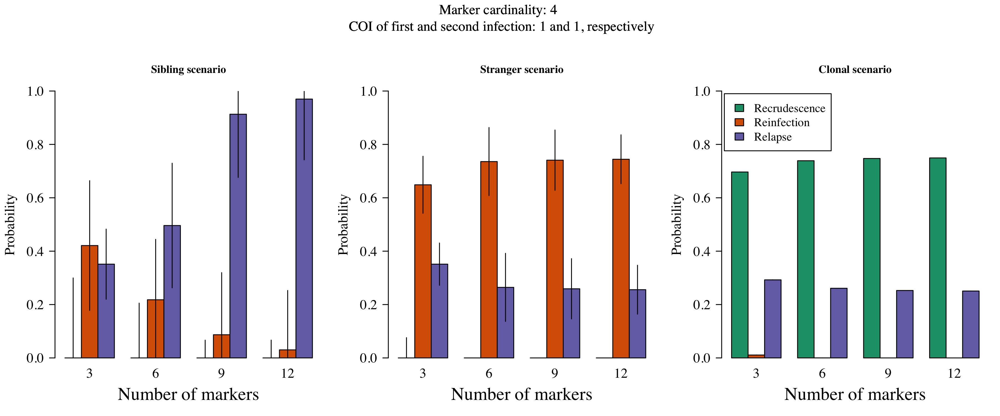
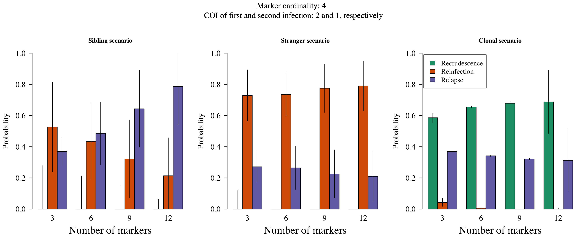
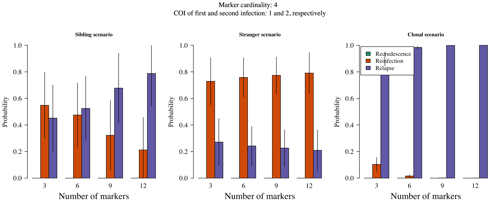
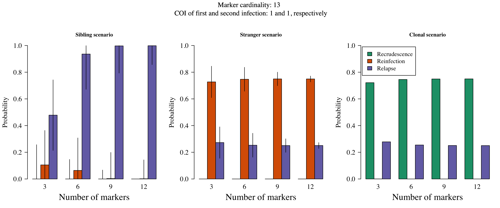
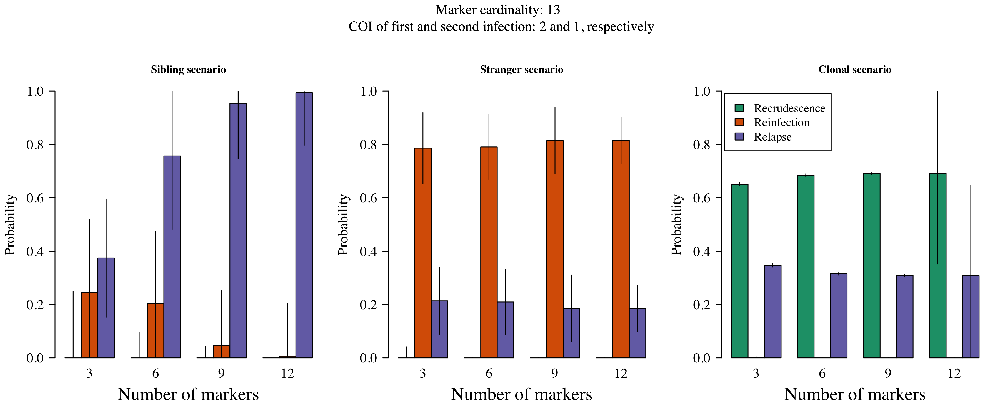
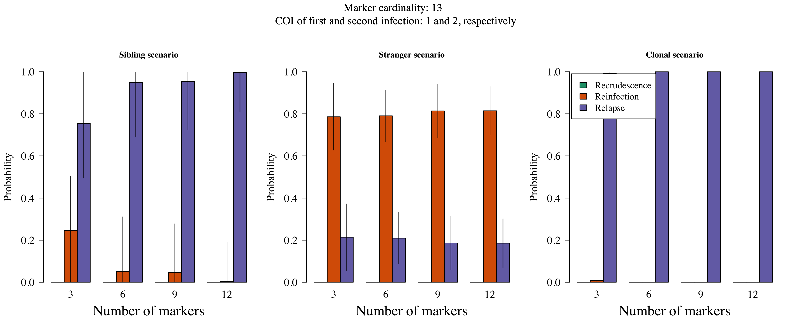
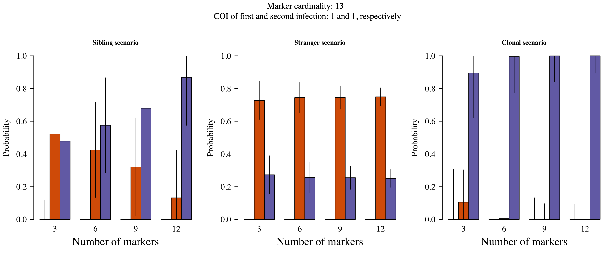
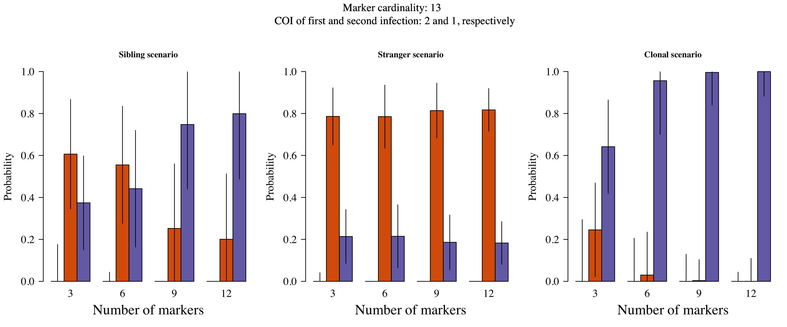
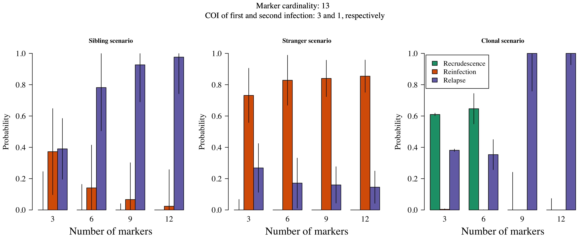

<!-- - Most relationship graphs compatible with relapse contain sibling edges.  -->
<!-- - Reviewer's example: "a recurrence with MOI of 3, containing a clone and two unrelated strains, but with overall pairwise relatedness close to 0.5." -->
<!-- - Add some plots of erroneous and higher MOI data.  -->


In this script, simulated genetic data are generated and plotted, and the results of the genetic model applied to those data are loaded and plotted. The simulated data are anlaysed under the model in a separate script called Generate_GenSimResults.R. This script relies on BuildSimData.R, a function that for a set of input parameters generates data for a graph over an initial episode and single recurrence. The graph contains a single between-episode edge representing a parasite haploid genotype with specified relationship in stranger, sibling or clone, which is among otherwise unrelated 'stranger' parasites if the input complexity of infections (COIs) exceed one. We chose this type of graph, in which the `noisy' parasite haploid geneotypes are unrelated since it is the most diverse thus most computationally challenging. In other words, it is a extreme scenario which is used to bound the performance of the model. Indeed, some of the problems we encounter in this extreme scenario do not apply to the real data. Complex infections in the real data most likely derive from either relapsing or co-inoculated parasites (there is little opportunity for superinfection due to active follow up), and thus are liable to be interrelated, therefore less diverse.  

Outline of this script:  

* For each "job", simulate data for N individuals, with M = 3 to 12 markers for two episodes, the second episode including a single clonal, sibling or stranger parasite. We consider several jobs: for each of the stranger, sibling and clonal scenario, we simulated data for an initial and recurrent infection with respective COIs: 1 and 1, with and without error; 2 and 1, with and without error; 1 and 2, with and without error; 3 and 1, without error. For the non-erroneous episodes with COIs of 1 and 2, we explored cardinalities of 4 (the minimum effective cardinality of any marker in the MS data that feature in the main text) and 13 (the mean effective cardinality of the MS data that feature in the main text). For the erroneous data and for the episodes with COIs of 3 and 1 cardinality was 13. 
* Summarise the simulated data with a series of plots. 
* Compute resulting recurrence state estimates (this is currently done in a separate file). 
* Plot resulting recurrence state estimates as a function M.


## Fraction of markers at which evidence of IBS is detected

In the first simulation, we want to assess recurrence state inference as a function of the number of markers typed, adding an extra noisy parasite into an infection when its COI exceeds one. We consider two effective cardinalities: 4 (the minimum effective cardinality of any marker in the MS data that feature in the main text) and 13 (the mean effective cardinalty of the MS data that feature in the main text). 

Under the sibling and stranger scenario, Figure \ref{fig: fraction IBS} shows the fraction of markers at which evidence of IBS is detected. On average, the mean fractions (vertical coloured bars) range from approximately 0.1 under the stranger scenario with high cardinality, to above 0.6 under the sibling scenario with lower cardinality. When the recurrent episode contains a clone of a parasite hapoid genotype in the initial episode and the data are non-erroneous (as they are here), then the fraction of markers at which evidence of IBS is detected is always one. We thus do not plot the clonal scenario. 


\section{Results}


<!-- -->


<!-- -->


<!-- -->


<!-- -->


<!-- -->


<!-- -->

```
## 1.365 sec elapsed
```










\subsubsection{Inference as a function of the number of markers typed}

The 

The genetic model relies on data that list alleles detected at genotyped microsatellite markers (i.e. alleles are either detected or not). The model does not account for error in the alleles detected, nor incorporate weighted evidence of majority versus minority alleles. First, let's consider the failure to detect minority clones, second let's consider the impact of error. 

\subsubsection{Undetected parasite haploid genotypes}

Failure to detect data from a minority parasite haploid genotype will have different consequences depending on the relationship of the minority parasite haploid genotype in relation to other parasite haploid genotypes across episodes. For example, referring to each plot in Figure XXX as an illustrative scenario where `COI x y' denotes a COI of x in the first infection and a COI of y in the second infection, 

- in the Sibling COI 2 1 case failure to detect the stranger parasite will result in the Sibling COI 1 1 case, thereby increasing the probability of relapse; meanwhile, failure to detect the sibling parasite will result in the Stranger COI 1 1 case, thereby decreasing the probability of relpase, but not erasing it. Note that the case in which the noisy parasite is unrelated demonstrates the most severe possible outcome: if the noisy parasite were related, failure to detect it would result in a Sibling COI 1 1 case thereby maintaining the probability of relapse.  
- in the Stranger COI 2 1 case failure to detect either stranger parasite in the Clone COI 2 1 case will result in the Stranger COI 1 1 case, maintaining the probability of reinfection and relapse. 

- In the Clone COI 2 1 case failure to detect the stranger parasite will result in the Clone COI 1 1 case, thereby maintaining the probability of recrudescence and relapse; meanwhile, failure to detect the clonal parasite will result in the Stranger COI 1 1 case, thereby replacing the probability of recrudescence with reinfection.

The examples above illustrate the robust versus frail nature of relapse inference versus recrudescene inference, respecitively. As we shall see in the next section, relapse inference is also robust in the prescence of error, whereas recrudescence is not. 

\subsubsection{Erroneous data}

Figure XXX shows inference in the presence of unmodelled error. The probability of error, 0.2, was set extremely high to clearly illustrate model behaviour. Realistic error rates, XXX-XXX, will have much less impact. Error largely impacts impacts inference of recrudescence: in the Clonal scenario clonal parasites are interpreted as sibling parasites and the probability of relapse tends towards one.


\subsection{Highly complex data}

A major limitation of the genetic model has to do with computational complexity. One aspect relevant to the above simulations is described below. When samples are complex and highly diverse, e.g. when they contain majority unrelated parasites, unconverged probablistic phasing is liable to miss clonally compatible combinations among the vast number of combinations that are possible. Recall that clonally compatible combinations are the only ones compatible with recrudescence. The number of possible combinations grows exponentially with the number of markers genotyped, rendering probability estimates inconsistent for recrudescence (Figure \ref{fig: COI3_1}). Such highly complex scenarios are extreme. They are helpful for illustrating the problem (Figure \ref{fig: COI3_1}), but not representative of the VHX and BPD data: all those analysed using probablistic phasing converged. Otherwise stated, inconsistency is not a problem VHX and BPD data anlysed under the model, but could be for future data sets. 

Nine individuals from the VHX and BPD datasets were deemed to have data too complex to analyse under the model. They received drugs XXX. All nine individuls appear to have had multiple relapses, based on data vizualisation, which can be used to rapidly identify clonally compatible phases, where computational methods fail (Figure XXX).


\section{Conclusion}
The current genetic model does not account for error in alleles detected, nor incorporate weighted evidence of majority versus minority alleles. These omissions render inference of recrudescence under the current model brittle, but have little impact on inference of reinfection versus relapse. As such, analyses of data from the Thailand_Myanmar border, where evidence of resistant \textit{P. vivax} is lacking, are likely robust to the above ommissions. However, the model merits extension before application to data from a region where \textit{P. vivax} resistance is suspected, or where the data are typed at many more markers. 


