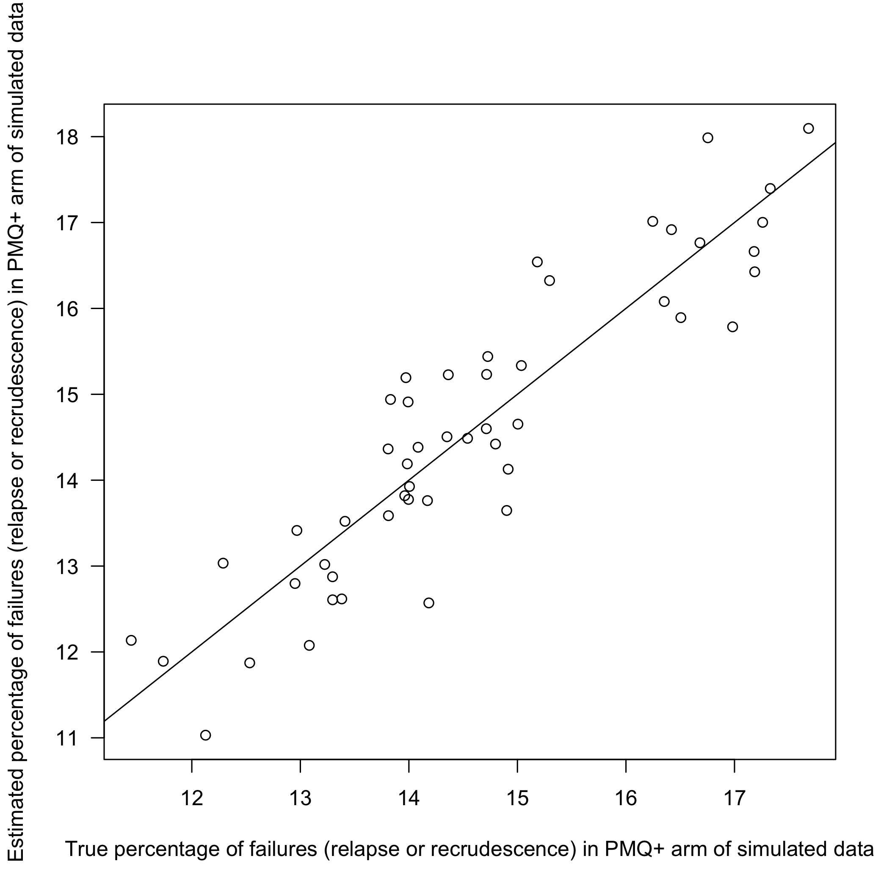
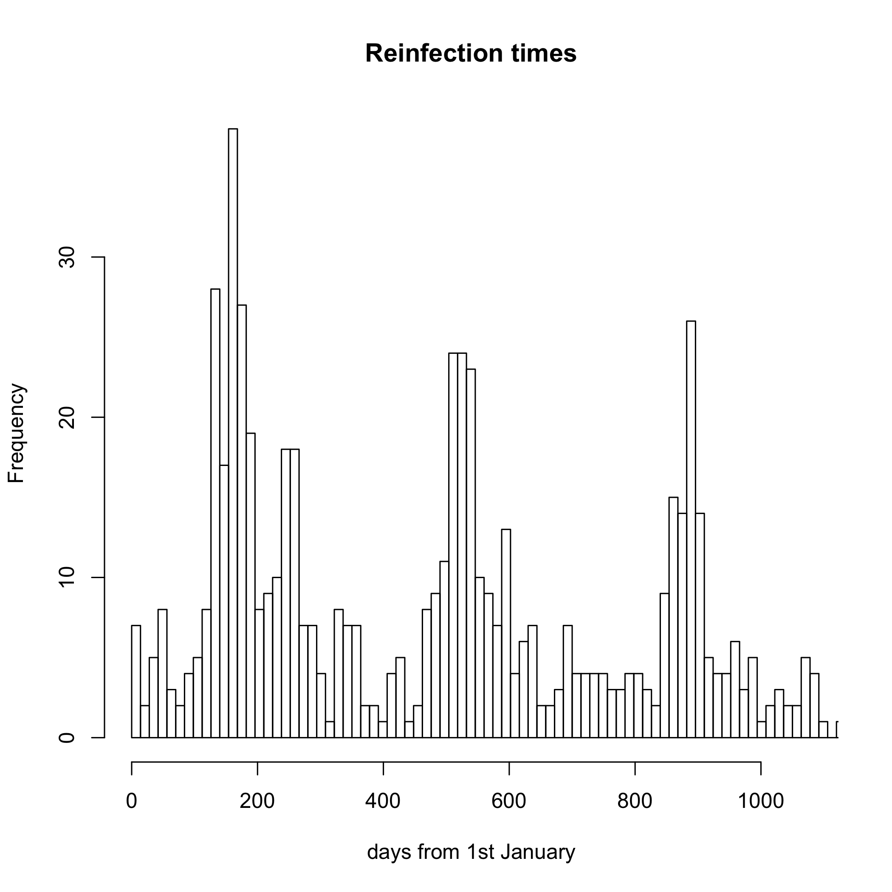
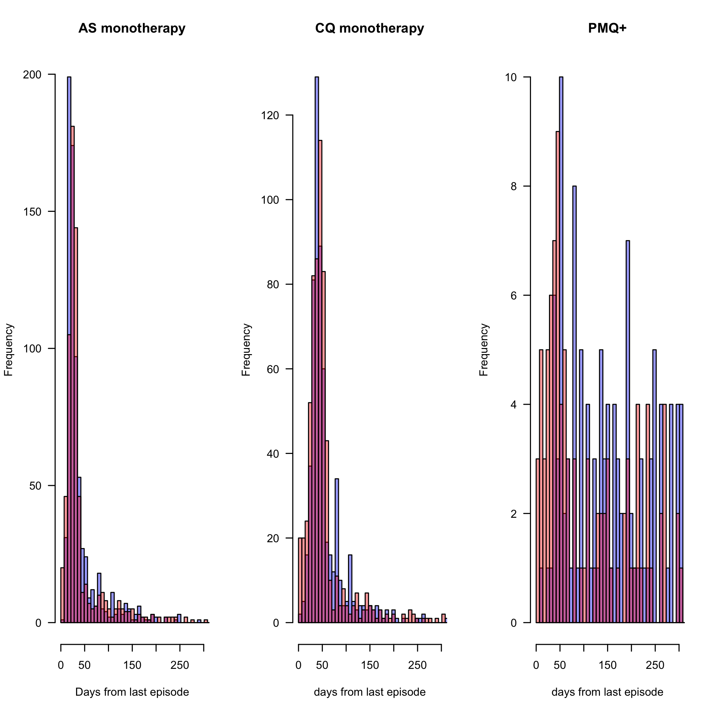

# Preamble 


Global options for stan model runs

```r
Chains = 4
options(mc.cores = Chains)
IT = 10^4
WarmUp = .5*IT
thin = 40
Sim_Iterations = 50
```

Global simulation sample sizes and follow-up time

```r
N_PMQ = 800
N_AS = 200
N_CQ = 200
FUP_time = 300
```

# Data simulation functions

We explore a few scenarios of increasing complexity to check whether:

* The model can recover correct parameters when the data generating process is correctly specified (sanity check)
* The effect of a mis-specified data generating process. For this we look at the impact of seasonality


## Data simulation for model 1

This simulates data under the assumptions of Model 1.

We set the simulation parameters:

```r
params_M1 = list(lambda = 1/1200,
                 gamma = 1/80,
                 lambda_recrud = 1/10,
                 EarlyL = 0.5,
                 c1_CQ = 0.01,
                 c1_AS = 0.01,
                 logit_mean_p = logit(0.2),
                 logit_sd_p = (-logit(0.2)+logit(0.8))/1.96,
                 AS_shape = 10,
                 AS_scale = 21,
                 CQ_shape = 10,
                 CQ_scale = 42,
                 rate_decrease = .66)
```


Generate data with these parameters:

```r
set.seed(475732)
out1 = simulate_dataset(N_PMQ = N_PMQ, N_CQ = N_CQ, 
                        N_AS = N_AS,FUP_time = FUP_time,
                        data_generation_function = generate_patient_data_Model1,
                        params = params_M1,
                        Study_Period = c(rep(1,N_PMQ/2),rep(2,N_PMQ/2 + N_AS + N_CQ)))
Simdata_Model1 = out1$Simdata
Simulation_truth1 = out1$Simulation_truth
```


# Run Stan Model 1 on simulated data generated from Model 1

Load or compile the stan model 1


Prior specification


Fit stan model to simulated data


Plot output, comparing prior, ground truth and model estimate. This gives a qualitative assessement for a single simulation run.

<!-- --><!-- --><!-- --><!-- -->


#### Multiple random simulations to assess systematic bias 

We run 50 iterations of:

1. Generate a random dataset under the model assumptions
2. Fit the model to the data

This allows us to compare model estimates versus true values to detect systematic bias.


<!-- -->

## Data simulation for model 2

Model 2 does not assume 100% efficacy of primaquine.

Ground truth model parameters for simulated data:


Generate simulated data under the assumptions of model 2

```
##                
##                  AS CHQ CHQ/PMQ
##   EarlyRelapse  358 279     107
##   LateRelapse   358 272      84
##   Recrudescence   4   4       2
##   Reinfection   148 143     960
```

```
## The proportion of reinfections in the PMQ+ arm is 83.3%
```

Prior specification for stan fit:


Load or compile the stan model 2


Fit stan model 2 to simulated data from model 2


Plot output, comparing prior, ground truth and model estimate:
<!-- --><!-- --><!-- --><!-- --><!-- -->

Compare summary statistics from simulated data and estimated:

```
## The percentage of reinfections in the PMQ+ arm in the simulated data is 16.7%. Model 2 estimates this percentage to be 18.4% (95% CI: 9.1-30.7)
```


#### Multiple random simulations to assess systematic bias 


<!-- --><!-- -->


# Simulating seasonal variation

Estimate the empirical seasonal reinfecton distribution from enrollment episodes. This assumes that the majority of enrollment episodes are reinfections which should be approximately true.
<!-- -->

Generate patient data under the assumptions of model 1 with the additional assumption of seasonality for reinfection.
<!-- -->


Generate data with these parameters:

```
## 0.971 sec elapsed
```


Fit stan model to simulated data where assumption of constant reinfection rate is wrong


Plot output, comparing prior, ground truth and model estimate:
<!-- --><!-- --><!-- --><!-- --><!-- -->

### Run multiple random iterations to assess model fit and bias


```
## For parameter lambda, 82% are below the true parameter
```

```
## For parameter gamma, 66% are below the true parameter
```

```
## For parameter logit_mean_p, 70% are below the true parameter
```

```
## For parameter rate_decrease, 66% are below the true parameter
```

```
## For parameter logit_sd_p, 40% are below the true parameter
```

<!-- -->

```
## For parameter logit_EarlyL, 64% are below the true parameter
```

<!-- -->

```
## 74% of the simulations overestimate the failure rate of PMQ
```


# Posterior predictive p-values

In this section we simulate data from the posterior predictive for Model 2. We then apply a qualitative model check by comparing summary statistics from the posterior predicitive with the true data summary statistics.

<!-- --><!-- -->


<!-- -->

```
## The posterior predictive p value for the number of recurrences per person-year in the AS arm is 0.436
```

```
## The posterior predictive p value for the number of recurrences per person-year in the CQ arm is 0.944
```

```
## The posterior predictive p value for the number of recurrences per person-year in the PMQ+ arm is 0.848
```


## Summary plot

This is a plot to summarise the simulation based model checking (sup material).

<!-- -->

