# Preliminaries

Load R packages.


# Load Stan models


## Model 1

* ReInfections occur at 'random' (exponential distribution). A random effects term is used to adjust for inter-individual variability in propensity to be reinfected.

* Recrudescences can happen in the first couple of weeks. Relapses happen as described by a Weibull with blood-stage drug dependent parameters.

* Primaquine is assumed to have 100% efficacy.


## Model 2: Mixture of three components


* ReInfections occur at 'random' (exponential distribution).
A random effects term is used to adjust for inter-individual variability in propensity to be reinfected.

* Recrudescences can happen in the first couple of weeks. 

* Relapses are broken into two components. The fast/periodic relapse component happens as described by a Weibull with blood-stage drug dependent parameters (same as in Model 1). The slow/random relapse component is described by an exponential disrtibution.

* Primaquine is assumed to have 100% efficacy.


## Model 3: Mixture of three components and reLapses after PMQ

* ReInfections occur at 'random' (exponential distribution).
A random effects term is used to adjust for inter-individual variability in propensity to be reinfected.

* Recrudescences can happen in the first couple of weeks. 

* Relapses are broken into two components (same as in Model 2).

* Primaquine is not assumed to have 100% efficacy and a random effects term describes the propensity to relapse after primaquine.


# VHX and BPD combined dataset


```r
load('../RData/TimingModel/Combined_Time_Event.RData')
# Get rid of the very short durations 
Combined_Time_Data = filter(Combined_Time_Data, Time_to_event > 5)

# deal with non-integer ids
Combined_Time_Data$patientid = factor(Combined_Time_Data$patientid)
# create a mapping from the factor to integer
map = mapLevels(x=Combined_Time_Data$patientid)
# Convert ID to integer
Combined_Time_Data$ID = as.integer(Combined_Time_Data$patientid)
Combined_Time_Data = arrange(Combined_Time_Data, ID, episode)
# We sort the ids so that ids go from 1...N
ids = unique(Combined_Time_Data$ID)
N = as.integer(length(ids))

# Create a vector that maps the kth episode to the correct individual (for storing in the stan code)
rank_ids = 1:length(ids)
Combined_Time_Data$ordered_ids = unlist(sapply(1:length(ids),
                                               function(x) rep(rank_ids[x], 
                                                               sum(Combined_Time_Data$ID==ids[x])))
)
Combined_Time_Data$N_index = as.integer(Combined_Time_Data$ordered_ids)

# Create a vector that maps the nth person to 0 (always recived Primaquine) or
noPMQ_ind = which(Combined_Time_Data$arm_num != "CHQ/PMQ")
N_noPMQ = length(unique(Combined_Time_Data$ID[noPMQ_ind]))
Combined_Time_Data$N_noPMQ_index = 0
Combined_Time_Data$N_noPMQ_index[noPMQ_ind] = as.integer(as.factor(Combined_Time_Data$ID[noPMQ_ind]))
N_noPMQ_index = Combined_Time_Data$N_noPMQ_index[!duplicated(Combined_Time_Data$ID)]

# Create a vector that maps the nth person to 0 or index
PMQ_ind = which(Combined_Time_Data$arm_num == "CHQ/PMQ")
N_PMQ = length(unique(Combined_Time_Data$ID[PMQ_ind]))
Combined_Time_Data$N_PMQ_index = 0
Combined_Time_Data$N_PMQ_index[PMQ_ind] = as.integer(as.factor(Combined_Time_Data$ID[PMQ_ind]))
N_PMQ_index = Combined_Time_Data$N_PMQ_index[!duplicated(Combined_Time_Data$ID)]

# Turn drug into a numeric vector
numeric_drug = as.integer(revalue(Combined_Time_Data$arm_num,
                                  c('AS'='0','CHQ'='1','CHQ/PMQ'='2')))
ind = !duplicated(Combined_Time_Data$patientid)
drug_received = numeric_drug[ind]
```

# Prior specification


```r
# The hierachical parameters defining the prior distributions for model 1
Prior_params_M1 = list(mu_inv_lambda = 400,
                       sigma_inv_lambda = 50,
                       mu_AS_shape = 2,
                       sigma_AS_shape = 1,
                       mu_AS_scale = 25,
                       sigma_AS_scale = 5,
                       mu_CQ_shape = 2,
                       sigma_CQ_shape = 1,
                       mu_CQ_scale = 42,
                       sigma_CQ_scale = 5,
                       Hyper_logit_mean_p = -3,
                       Hyper_logit_sd_p = .2,
                       Hyper_logit_c1_mean = -3,
                       Hyper_logit_c1_sd = .25,
                       Hyper_logit_exp_p = 1)
# Model 2 has the same parameters with a few extra
Prior_params_M2 = c(Prior_params_M1, 
                    Early_L_logit_mean = 0,
                    Early_L_logit_sd = 1,
                    mu_inv_gamma = 80,
                    sigma_inv_gamma = 10)
# Model 3: extra parameters
Prior_params_M3 = c(Prior_params_M2, 
                    Hyper_logit_mean_p_PMQ = 3,
                    Hyper_logit_sd_p_PMQ = .25)
```

# Run Model

Set up parameters for the MCMC runs.

```r
# Choose as many chains as available cores
Chains = 6
options(mc.cores = Chains)
IT = 2*10^4
WarmUp = .5*IT
thin = 1000

# put the data into stan format
# For models 1 & 2
Time_data_1_2 = list(N         = N,
                     #Number of individuals
                     Neps      = as.integer(nrow(Combined_Time_Data)),
                     #Number of durations
                     N_noPMQ   = N_noPMQ,
                     # Number of individuals who do not recieve PMQ
                     Durations = as.double(Combined_Time_Data$Time_to_event),
                     #Time to reinfection or time to censoring
                     Censored  = as.integer(Combined_Time_Data$Censored),
                     #If the duration is right censored or not
                     Drug      = numeric_drug,
                     # drug coded as an integer
                     N_index   = Combined_Time_Data$N_index,
                     # the index of the individual for each time interval
                     N_noPMQ_index = N_noPMQ_index
                     # the index mapping no PMQ individuals to their rank
)
# For model 3
Time_data_3 =list(N         = N,
                  #Number of individuals
                  Neps      = as.integer(nrow(Combined_Time_Data)),
                  #Number of durations
                  N_noPMQ   = N_noPMQ,
                  # Number of individuals who do not recieve PMQ
                  N_PMQ     = N_PMQ,
                  # Number of individuals who do not recieve PMQ
                  Durations = as.double(Combined_Time_Data$Time_to_event),
                  #Time to reinfection or time to censoring
                  Censored  = as.integer(Combined_Time_Data$Censored),
                  #If the duration is right censored or not
                  Drug      = numeric_drug,
                  # drug coded as an integer
                  N_index   = Combined_Time_Data$N_index,
                  # the index of the individual for each time interval
                  N_noPMQ_index = N_noPMQ_index,
                  # the index mapping no PMQ individuals to their rank
                  N_PMQ_index = N_PMQ_index
                  # the index mapping PMQ individuals to their rank
)
```

Run with X parallel chains. This depends on local computing power.


```r
if(RUN_MODELS){
  mod1_RE = sampling(Timing_Model1_RE,
                     data = c(Time_data_1_2, Prior_params_M1),
                     iter = IT, warmup = WarmUp,
                     chains=Chains, thin = thin)
  save(mod1_RE, file = 'OutputResults/StanModels_mod1.RData')
  
  mod2_RE = sampling(Timing_Model2_RE,
                     data = c(Time_data_1_2, Prior_params_M2),
                     iter = IT, warmup = WarmUp,
                     chains=Chains, thin = thin)
  save(mod2_RE, file = 'OutputResults/StanModels_mod2.RData')
  
  mod3_RE = sampling(Timing_Model3_RE,
                     data = c(Time_data_3, Prior_params_M3),
                     iter = IT, warmup = WarmUp,
                     chains=Chains, thin = thin)
  save(mod3_RE, file = 'OutputResults/StanModels_mod3.RData')
}
load('OutputResults/StanModels_mod1.RData')
load('OutputResults/StanModels_mod2.RData')
load('OutputResults/StanModels_mod3.RData')
```

# Plot output


Let's make some nice colors for the plotting

```r
mycols = brewer.pal(n=3, name = 'Set1')
PLOT_Censored_Obs = FALSE

if(PLOT_Censored_Obs){
  ind_plotting = 1:nrow(Combined_Time_Data)
} else {
  ind_plotting = which(!Combined_Time_Data$Censored)
}

# We jitter the time to event (days) to improve plotting
# Combined_Time_Data$Time_to_event = jitter(Combined_Time_Data$Time_to_event, amount = 1)
```


## Model 1


```r
# Traceplots
traceplot(mod1_RE,c('AS_shape', 'CQ_shape', 'AS_scale', 'CQ_scale'))
```

<!-- -->

```r
traceplot(mod1_RE, c('inv_lambda','logit_c1','Recrud_shape','Recrud_scale'))
```

<!-- -->

```r
traceplot(mod1_RE, c('logit_mean_p','logit_sd_p'))
```

<!-- -->

```r
# Extract samples
thetas = extract(mod1_RE)

par(las=1, mfrow=c(1,2))
hist(thetas$inv_lambda, main='Mean time to reinfection',
     xlab='1/lambda (days)')
hist(inv.logit(apply(thetas$logit_p,2,mean)), 
     main = 'proportion of reInfections', xlab='p')
```

<!-- -->

```r
par(las=1, mfrow=c(1,1))
# Plot the outcome of the predicted labels
#****************************** Reinfection ******************************
labels = extract(mod1_RE, 'prob_labels')$prob_labels
mean_labels_Reinfection = apply(labels[,ind_plotting,1,drop=T], 2, mean)
plot(Combined_Time_Data$Time_to_event[ind_plotting], log10(mean_labels_Reinfection), 
     col = mycols[numeric_drug[ind_plotting]+1], 
     pch = as.numeric(Combined_Time_Data$Censored[ind_plotting])+16,
     ylab='Probability of ReInfection', yaxt='n',xaxt='n',
     xlab='Months from last episode', xlim=c(0,400))
axis(1, at = seq(0, 420, by=60), labels = seq(0, 420, by=60)/30)
axis(2, at = -2:0, labels= 10^(-2:0))
axis(2, at = log10(seq(.1,1,by=.1)), labels = NA)
axis(2, at = log10(seq(.01,.1,by=.01)), labels = NA)
axis(2, at = log10(seq(.001,.01,by=.001)), labels = NA)
legend('bottomright',legend = c('AS','CQ','CQ+PMQ'), 
       col=c(mycols),pch = c(rep(1,3)), bty='n',lwd=2,lty=NA)
```

<!-- -->

```r
#****************************** Recrudescence ****************************
mean_labels_ReCrud = apply(labels[,ind_plotting,3,drop=T], 2, mean)
plot(Combined_Time_Data$Time_to_event[ind_plotting], mean_labels_ReCrud, 
     col = mycols[numeric_drug[ind_plotting]+1], xaxt='n',
     pch = as.numeric(Combined_Time_Data$Censored[ind_plotting])+16,
     ylab='ReCrudescence',
     xlab='Weeks from last episode', xlim=c(0,30))
axis(1, at = seq(0,28,by=7), labels = seq(0,28,by=7)/7)
```

<!-- -->

```r
#****************************** Relapse ****************************
mean_labels_ReLap = apply(labels[,ind_plotting,2,drop=T], 2, mean)
plot(Combined_Time_Data$Time_to_event[ind_plotting], log10(mean_labels_ReLap), 
     col = mycols[numeric_drug[ind_plotting]+1], xaxt='n',
     pch = as.numeric(Combined_Time_Data$Censored[ind_plotting])+16, 
     ylab='log10 Probability of ReLapse',yaxt='n',
     xlab='Months from last episode', xlim=c(0,100),
     ylim = c(-10,0))
axis(1, at = seq(0, 90, by= 30), labels = seq(0, 90, by=30)/30)
axis(2, at = -2:0, labels= 10^(-2:0))
```

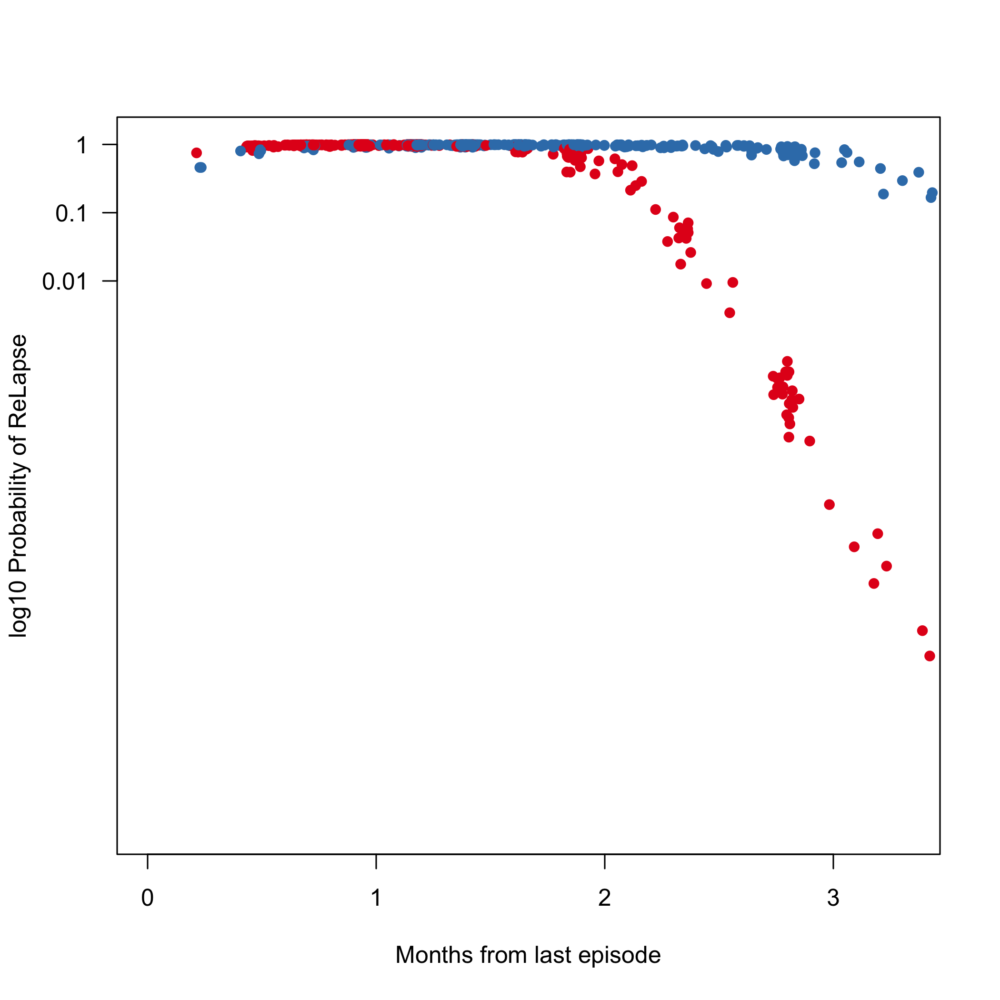<!-- -->

## Model 2


```r
par(las=1)
traceplot(mod2_RE,c('AS_shape', 'CQ_shape', 'AS_scale', 'CQ_scale'))
```

<!-- -->

```r
traceplot(mod2_RE, c('inv_lambda','logit_c1','Recrud_shape','Recrud_scale'))
```

<!-- -->

```r
traceplot(mod2_RE, c('logit_mean_p','logit_sd_p','logit_EarlyL'))
```

<!-- -->

```r
par(mfrow=c(1,2))
thetas = extract(mod2_RE)
hist(thetas$inv_lambda, main='Mean time to reinfection', xlab='1/lambda (days)')
hist(thetas$inv_gamma, main='Mean time to late reLapse', xlab='1/gamma (days)')
```

<!-- -->

```r
par(las=1, mfrow=c(1,3))

hist(inv.logit(apply(thetas$logit_p,2,mean)), xlab = 'Probability reinfection', main = '')
hist(inv.logit(thetas$logit_c1), xlab = 'proportion recrudescence', main='')
hist(inv.logit(thetas$logit_EarlyL), xlab = 'proportion early Relapse', main='')
```

<!-- -->

```r
par(las=1, mfrow=c(1,1))
# Plot the outcome of the predicted labels
#****************************** Reinfection ******************************
labels = extract(mod2_RE, 'prob_labels')$prob_labels
mean_labels_Reinfection = apply(labels[,ind_plotting,1,drop=T], 2, mean)
plot(Combined_Time_Data$Time_to_event[ind_plotting], log10(mean_labels_Reinfection), 
     col = mycols[numeric_drug[ind_plotting]+1], 
     pch = as.numeric(Combined_Time_Data$Censored[ind_plotting])+16,
     ylab='Probability of ReInfection', yaxt='n',xaxt='n',
     xlab='Months from last episode', xlim=c(0,400))
axis(1, at = seq(0, 420, by=60), labels = seq(0, 420, by=60)/30)
axis(2, at = -2:0, labels= 10^(-2:0))
axis(2, at = log10(seq(.1,1,by=.1)), labels = NA)
axis(2, at = log10(seq(.01,.1,by=.01)), labels = NA)
axis(2, at = log10(seq(.001,.01,by=.001)), labels = NA)
legend('bottomright',legend = c('Artesunate','Chloroquine','Chloroquine+\nPrimaquine'), 
       col=c(mycols),pch = rep(1,3), bty='n',lwd=2,lty=NA)
```

<!-- -->

```r
#****************************** Recrudescence ****************************
mean_labels_ReCrud = apply(labels[,ind_plotting,4,drop=T], 2, mean)
plot(Combined_Time_Data$Time_to_event[ind_plotting], mean_labels_ReCrud, 
     col = mycols[numeric_drug[ind_plotting]+1], xaxt='n',
     pch = as.numeric(Combined_Time_Data$Censored[ind_plotting])+16,
     ylab='ReCrudescence',
     xlab='Weeks from last episode', xlim=c(0,60))
axis(1, at = seq(0,54,by=7), labels = seq(0,54,by=7)/7)
```

<!-- -->

```r
#****************************** Relapse ****************************
mean_labels_ReLap1 = apply(labels[,ind_plotting,2,drop=T], 2, mean)
mean_labels_ReLap2 = apply(labels[,ind_plotting,3,drop=T], 2, mean)
mean_labels_ReLap = mean_labels_ReLap1 + mean_labels_ReLap2
plot(Combined_Time_Data$Time_to_event[ind_plotting], mean_labels_ReLap, 
     col = mycols[numeric_drug[ind_plotting]+1], xaxt='n',
     pch = as.numeric(Combined_Time_Data$Censored[ind_plotting])+16, 
     ylab='log10 Probability of ReLapse',
     xlab='Months from last episode')
axis(1, at = seq(0, 420, by= 60), labels = seq(0, 420, by=60)/30)
```

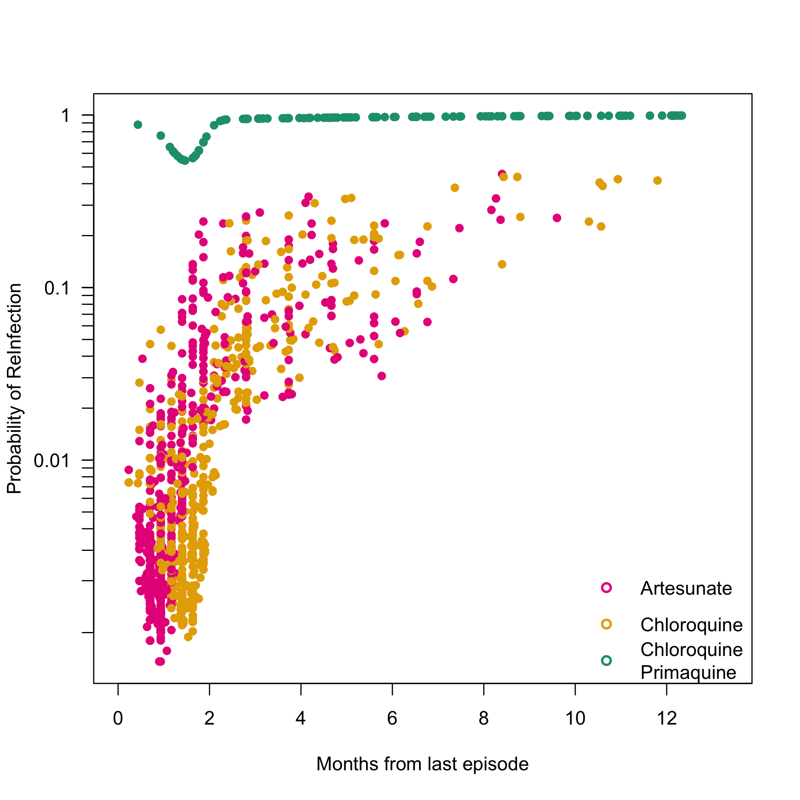<!-- -->

## Model 3


```r
traceplot(mod3_RE,c('AS_shape', 'CQ_shape', 'AS_scale', 'CQ_scale'))
```

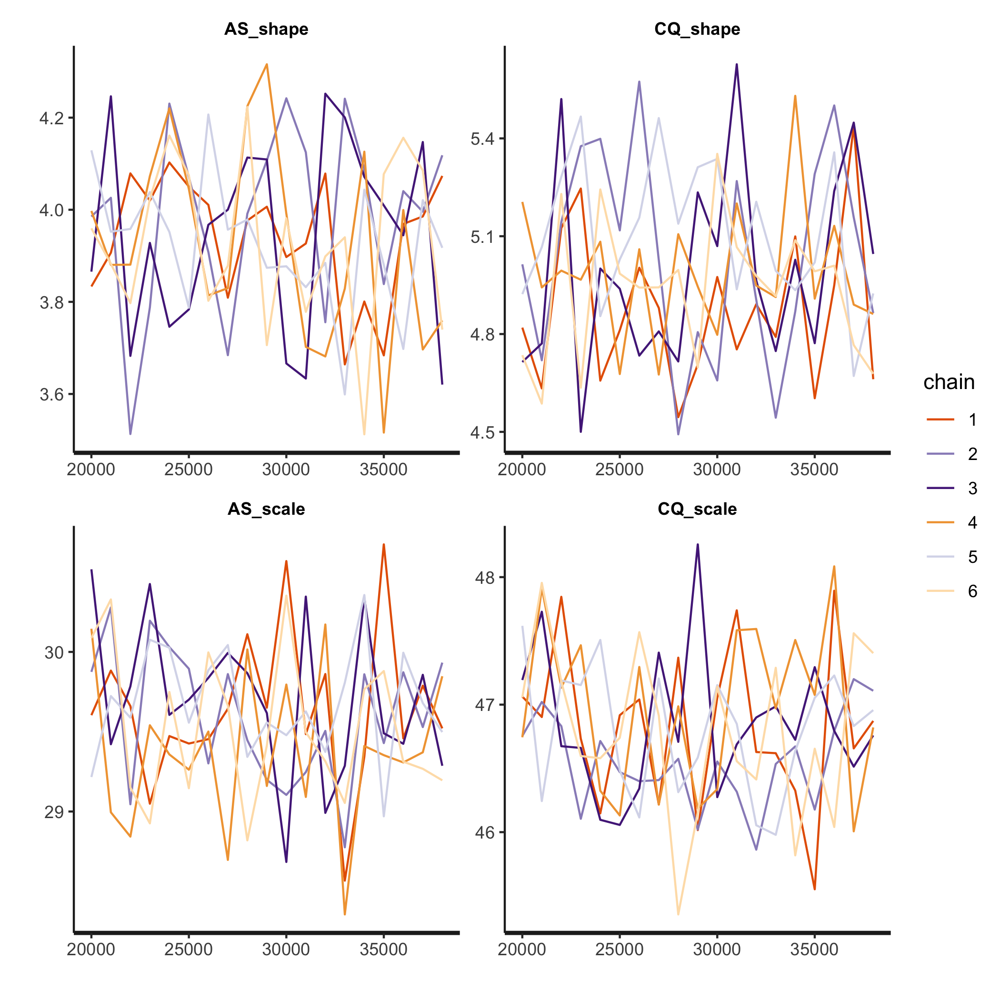<!-- -->

```r
traceplot(mod3_RE, c('inv_lambda','Recrud_shape','Recrud_scale'))
```

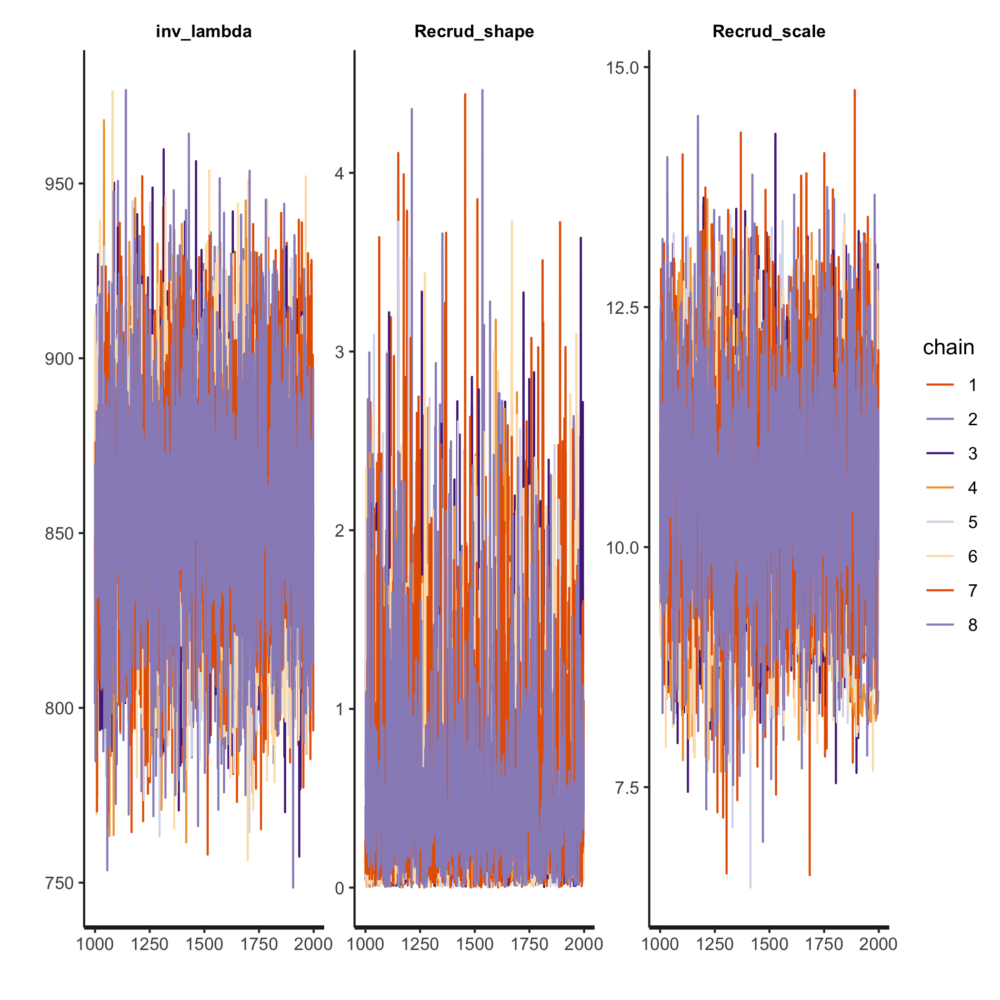<!-- -->

```r
traceplot(mod3_RE, c('logit_c1_AS','logit_c1_CQ','logit_c1_CQ_PMQ'))
```

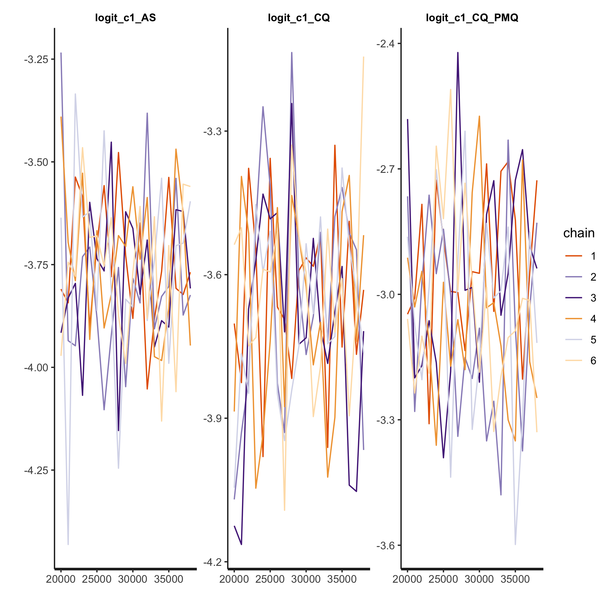<!-- -->

```r
traceplot(mod3_RE, c('logit_mean_p','logit_sd_p','logit_EarlyL'))
```

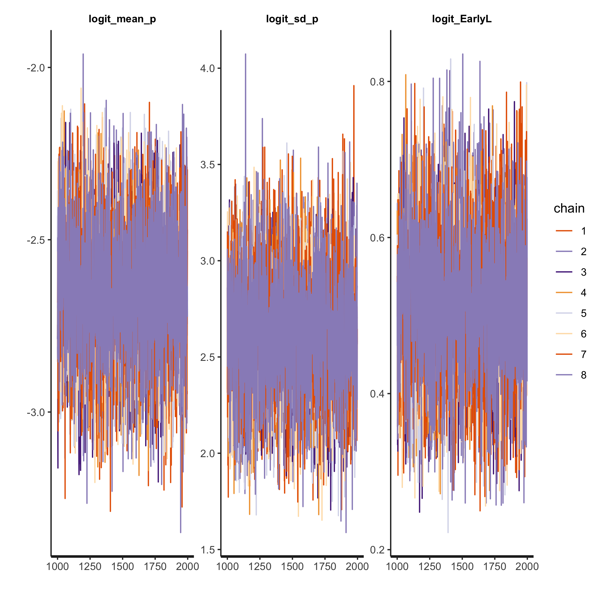<!-- -->

```r
par(mfrow=c(1,2))
thetas = extract(mod3_RE)
hist(thetas$inv_lambda, xlab='Mean time to reinfection (days)', main='')
hist(thetas$inv_gamma, xlab='Mean time to late reLapse (days)', main='')
```

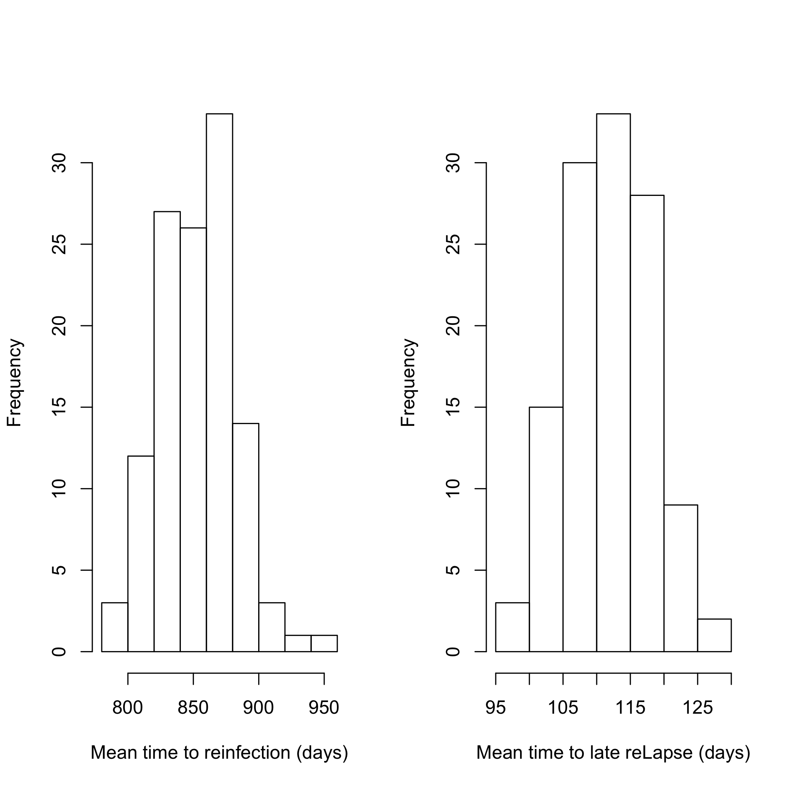<!-- -->

```r
hist(inv.logit(apply(thetas$logit_p,2,mean)),
     xlab = 'Reinfection: no PMQ', main = '',
     yaxt='n',ylab='')

hist(inv.logit(apply(thetas$logit_p_PMQ,2,mean)), 
     xlab = 'Reinfection: after PMQ', main = '',
     yaxt='n',ylab='')
```

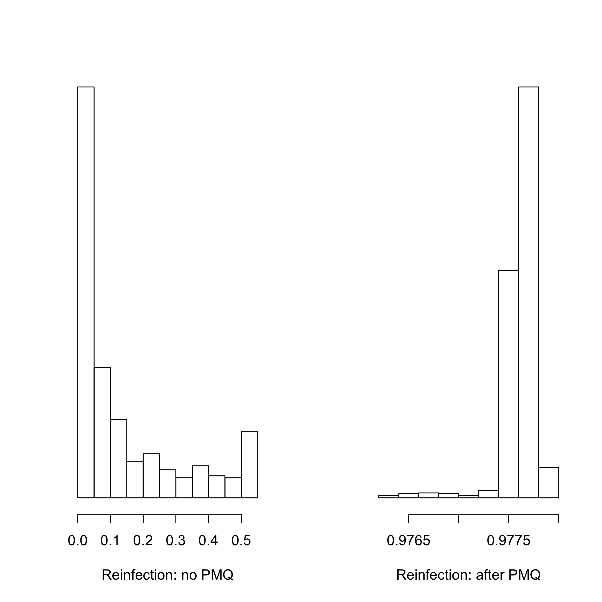<!-- -->

```r
# Recrudescence weights
plot(density(100*inv.logit(thetas$logit_c1_AS)), col = mycols[1],lwd=3,
     xlab = 'Recrudescence (%)', main='',yaxt='n',ylab='', xlim=c(0,10))
lines(density(100*inv.logit(thetas$logit_c1_CQ)), col = mycols[2],lwd=3)
lines(density(100*inv.logit(thetas$logit_c1_CQ_PMQ)), col = mycols[3], lwd=3)
legend('topright',col=mycols, legend = c('AS','CQ','CQ+PMQ'),lwd=3)

hist(inv.logit(thetas$logit_EarlyL), xlab = 'Early Relapse',
     main='',yaxt='n',ylab='')
```

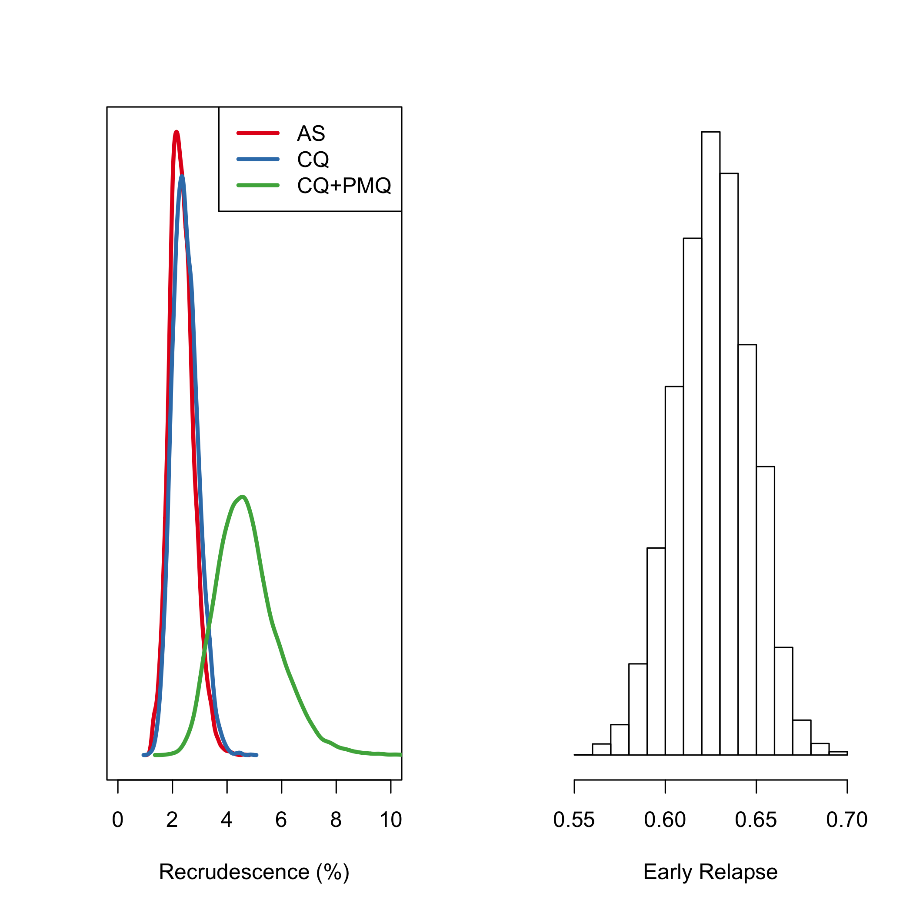<!-- -->

```r
par(las=1, mfrow=c(1,1))
# Plot the outcome of the predicted labels
#****************************** Reinfection ******************************
labels = extract(mod3_RE, 'prob_labels')$prob_labels
mean_labels_Reinfection = apply(labels[,ind_plotting,1,drop=T], 2, mean)
plot(Combined_Time_Data$Time_to_event[ind_plotting], log10(mean_labels_Reinfection), 
     col = mycols[numeric_drug[ind_plotting]+1], 
     pch = as.numeric(Combined_Time_Data$Censored[ind_plotting])+16,
     ylab='Probability of ReInfection', yaxt='n',xaxt='n',
     xlab='Months from last episode', xlim=c(0,400))
axis(1, at = seq(0, 420, by=60), labels = seq(0, 420, by=60)/30)
axis(2, at = -2:0, labels= 10^(-2:0))
axis(2, at = log10(seq(.1,1,by=.1)), labels = NA)
axis(2, at = log10(seq(.01,.1,by=.01)), labels = NA)
axis(2, at = log10(seq(.001,.01,by=.001)), labels = NA)
legend('bottomright',legend = c('Artesunate','Chloroquine','Chloroquine\nPrimaquine'), 
       col=c(mycols),pch = rep(1,3), bty='n',lwd=2,lty=NA)
```

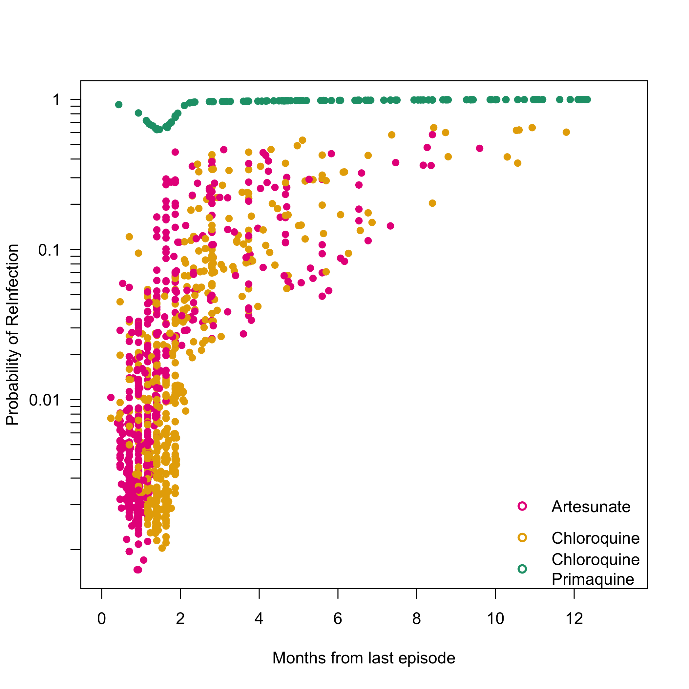<!-- -->

```r
#****************************** Recrudescence ****************************
mean_labels_ReCrud = apply(labels[,ind_plotting,4,drop=T], 2, mean)
plot(Combined_Time_Data$Time_to_event[ind_plotting], mean_labels_ReCrud, 
     col = mycols[numeric_drug[ind_plotting]+1], xaxt='n',
     pch = as.numeric(Combined_Time_Data$Censored[ind_plotting])+16,
     ylab='ReCrudescence',
     xlab='Weeks from last episode', xlim=c(0,60))
axis(1, at = seq(0,54,by=7), labels = seq(0,54,by=7)/7)
```

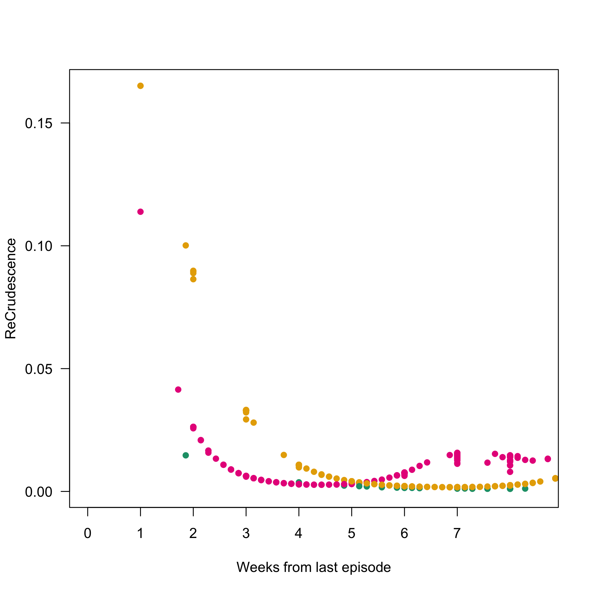<!-- -->

```r
#****************************** Relapse ****************************
mean_labels_ReLap1 = apply(labels[,ind_plotting,2,drop=T], 2, mean)
mean_labels_ReLap2 = apply(labels[,ind_plotting,3,drop=T], 2, mean)
mean_labels_ReLap = mean_labels_ReLap1 + mean_labels_ReLap2
plot(Combined_Time_Data$Time_to_event[ind_plotting], mean_labels_ReLap, 
     col = mycols[numeric_drug[ind_plotting]+1], xaxt='n',
     pch = as.numeric(Combined_Time_Data$Censored[ind_plotting])+16,
     ylab='log10 Probability of ReLapse',
     xlab='Months from last episode')
axis(1, at = seq(0, 420, by= 60), labels = seq(0, 420, by=60)/30)
```

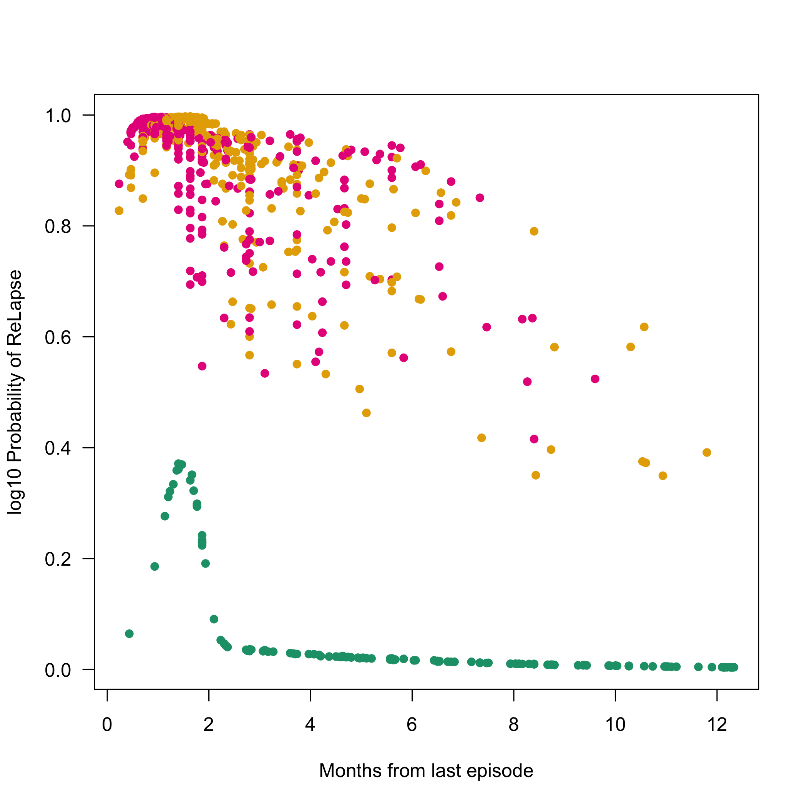<!-- -->


# Model Comparison


```r
library(loo)
```

```
## Warning: package 'loo' was built under R version 3.4.4
```

```
## This is loo version 2.0.0.
## **NOTE: As of version 2.0.0 loo defaults to 1 core but we recommend using as many as possible. Use the 'cores' argument or set options(mc.cores = NUM_CORES) for an entire session. Visit mc-stan.org/loo/news for details on other changes.
```

```r
log_lik1 <- extract_log_lik(mod1_RE)
log_lik2 <- extract_log_lik(mod2_RE)
log_lik3 <- extract_log_lik(mod3_RE)

waic1 = waic(log_lik1)
```

```
## Warning: 194 (7.2%) p_waic estimates greater than 0.4. We recommend trying
## loo instead.
```

```r
loo1 = loo(log_lik1)
```

```
## Warning: Relative effective sample sizes ('r_eff' argument) not specified.
## For models fit with MCMC, the reported PSIS effective sample sizes and 
## MCSE estimates will be over-optimistic.
```

```
## Warning: Some Pareto k diagnostic values are slightly high. See help('pareto-k-diagnostic') for details.
```

```r
waic2 = waic(log_lik2)
```

```
## Warning: 125 (4.6%) p_waic estimates greater than 0.4. We recommend trying
## loo instead.
```

```r
loo2 = loo(log_lik2)
```

```
## Warning: Relative effective sample sizes ('r_eff' argument) not specified.
## For models fit with MCMC, the reported PSIS effective sample sizes and 
## MCSE estimates will be over-optimistic.

## Warning: Some Pareto k diagnostic values are slightly high. See help('pareto-k-diagnostic') for details.
```

```r
waic3 = waic(log_lik3)
```

```
## Warning: 145 (5.4%) p_waic estimates greater than 0.4. We recommend trying
## loo instead.
```

```r
loo3 = loo(log_lik3)
```

```
## Warning: Relative effective sample sizes ('r_eff' argument) not specified.
## For models fit with MCMC, the reported PSIS effective sample sizes and 
## MCSE estimates will be over-optimistic.

## Warning: Some Pareto k diagnostic values are slightly high. See help('pareto-k-diagnostic') for details.
```

```r
compare(waic1, waic2, waic3)
```

```
##       elpd_diff elpd_waic se_elpd_waic p_waic  se_p_waic waic    se_waic
## waic2     0.0   -7731.0     123.8        150.5     8.2   15462.0   247.5
## waic3   -18.7   -7749.7     123.1        166.8     8.9   15499.4   246.3
## waic1  -126.5   -7857.5     127.8        204.1     6.9   15715.1   255.6
```

```r
compare(loo1, loo2, loo3)
```

```
##      elpd_diff elpd_loo se_elpd_loo p_loo   se_p_loo looic   se_looic
## loo2     0.0   -7729.4    123.8       148.9     8.0  15458.8   247.6 
## loo3   -19.5   -7749.0    123.2       166.0     8.8  15497.9   246.4 
## loo1  -135.9   -7865.3    127.8       211.9     7.2  15730.7   255.7
```

# Interpretation of results

The cumulative probability of time to relapse. We draw from the posterior distribution to get a predicted time to relapse (in those who will relapse before they are reinfected).


```r
thetas = extract(mod3_RE)
K = 500000
Early_relapse = sample(x = inv.logit(thetas$logit_EarlyL),replace = T, size = K) 
Mixture = sapply(Early_relapse, FUN = function(x){
  sample(x = 1:2, replace = T, size = 1 , prob = c(x,1-x))
})
# Artesunate mono-therapy
T1s = rweibull(n = K, shape = sample(x = thetas$AS_shape, size = K, replace = T),
               scale = sample(x = thetas$AS_scale, size = K, replace = T))
T2s = rexp(n = K, rate =  sample(x = 1/thetas$inv_gamma, size = K, replace = T))
Times_RelapseAS = c(T1s[Mixture==1], T2s[Mixture==2])
```


```r
par(mfrow=c(1,2), las=1)

# Chloroquine mono-therapy
T1s = rweibull(n = K, shape = sample(x = thetas$CQ_shape, size = K, replace = T),
               scale = sample(x = thetas$CQ_scale, size = K, replace = T))
T2s = rexp(n = K, rate =  sample(x = 1/thetas$inv_gamma, size = K, replace = T))
Times_RelapseCQ = c(T1s[Mixture==1], T2s[Mixture==2])

hist(Times_RelapseAS, breaks = seq(0,7000, by=7), xlim=c(0,100),
     main='', col=mycols[1], density = 15, yaxt='n',ylab = '',
     xlab='Months after treatment', xaxt='n')
hist(Times_RelapseCQ, breaks = seq(0,7000, by=7), xlim=c(0,100), 
     main='', add=T, density=15, col=mycols[2], angle= -30)
axis(1, at = seq(0,90, by=30), labels =  seq(0,90, by=30)/30)
legend('topright', col=mycols[c(1:2)], lwd=3,bty='n',
       legend = c('Artesunate','Chloroquine'))

plot(ecdf(Times_RelapseAS[Times_RelapseAS<360]), 
     col=mycols[1], xaxt='n',main='',
     xlab='Months after treatment', bty='n', yaxt='n',
     ylab = 'Relapses observed (%)', lwd=3, lty=2)
axis(2, at = c(0,.25,.5,.75,.9,1), 
     labels = 100*c(0,.25,.5,.75,.9,1))
axis(1, at = seq(0,360, by=60), labels =  seq(0,360, by=60)/30)
lines(ecdf(Times_RelapseCQ[Times_RelapseCQ<360]), 
      col=mycols[2], lwd=3, lty=2)
axis(1, at = seq(0,360, by=60), labels =  seq(0,360, by=60)/30)
abline(h=.9, lwd=2, lty=2)
abline(v=4*30, lwd=2, lty=2)
```

<!-- -->


```r
# Now we compute the fixed effect probabilities over time
Ts = 1:360
# AS
prob_labels_raw_AS = array(dim = c(4,length(Ts)))
# Reinfection
prob_labels_raw_AS[1,] = exp(mean(thetas$log_p))*dexp(Ts, rate = 1/mean(thetas$inv_lambda));
# Early Relapse
prob_labels_raw_AS[2,] = exp(mean(thetas$log_1m_p))*exp(mean(thetas$log_1m_c1_AS))*exp(mean(thetas$log_EarlyL))*dweibull(Ts , shape = mean(thetas$AS_shape), scale = mean(thetas$AS_scale))
# Late Relapse
prob_labels_raw_AS[3,] = exp(mean(thetas$log_1m_p))*exp(mean(thetas$log_1m_c1_AS))*exp(mean(thetas$log_1m_EarlyL))*dexp(Ts, rate = 1/mean(thetas$inv_gamma))
# Recrudescence
prob_labels_raw_AS[4,] = exp(mean(thetas$log_1m_p))*exp(mean(thetas$log_c1_AS))*dweibull(Ts, shape =  mean(thetas$Recrud_shape), scale = mean(thetas$Recrud_scale))

# CQ
prob_labels_raw_CQ = array(dim = c(4,length(Ts)))
# Reinfection
prob_labels_raw_CQ[1,] = exp(mean(thetas$log_p))*dexp(Ts, rate = 1/mean(thetas$inv_lambda));
# Early Relapse
prob_labels_raw_CQ[2,] = exp(mean(thetas$log_1m_p))*exp(mean(thetas$log_1m_c1_CQ))*exp(mean(thetas$log_EarlyL))*dweibull(Ts , shape = mean(thetas$CQ_shape), scale = mean(thetas$CQ_scale))
# Late Relapse
prob_labels_raw_CQ[3,] = exp(mean(thetas$log_1m_p))*exp(mean(thetas$log_1m_c1_CQ))*exp(mean(thetas$log_1m_EarlyL))*dexp(Ts, rate = 1/mean(thetas$inv_gamma))
# Recrudescence
prob_labels_raw_CQ[4,] = exp(mean(thetas$log_1m_p))*exp(mean(thetas$log_c1_CQ))*dweibull(Ts, shape =  mean(thetas$Recrud_shape), scale = mean(thetas$Recrud_scale))

# CQ+PMQ
prob_labels_raw_CQPMQ = array(dim = c(4,length(Ts)))
# Reinfection
prob_labels_raw_CQPMQ[1,] = exp(mean(thetas$log_p_PMQ))*dexp(Ts, rate = 1/mean(thetas$inv_lambda));
# Early Relapse
prob_labels_raw_CQPMQ[2,] = exp(mean(thetas$log_1m_p_PMQ))*exp(mean(thetas$log_1m_c1_CQ_PMQ))*exp(mean(thetas$log_EarlyL))*dweibull(Ts , shape = mean(thetas$CQ_shape), scale = mean(thetas$CQ_scale))
# Late Relapse
prob_labels_raw_CQPMQ[3,] = exp(mean(thetas$log_1m_p_PMQ))*exp(mean(thetas$log_1m_c1_CQ_PMQ))*exp(mean(thetas$log_1m_EarlyL))*dexp(Ts, rate = 1/mean(thetas$inv_gamma))
# Recrudescence
prob_labels_raw_CQPMQ[4,] = exp(mean(thetas$log_1m_p_PMQ))*exp(mean(thetas$log_c1_CQ_PMQ))*dweibull(Ts, shape =  mean(thetas$Recrud_shape), scale = mean(thetas$Recrud_scale))

for(i in 1:length(Ts)){
  prob_labels_raw_AS[,i] = prob_labels_raw_AS[,i]/sum(prob_labels_raw_AS[,i])
  prob_labels_raw_CQ[,i] = prob_labels_raw_CQ[,i]/sum(prob_labels_raw_CQ[,i])
  prob_labels_raw_CQPMQ[,i] = prob_labels_raw_CQPMQ[,i]/sum(prob_labels_raw_CQPMQ[,i])
}
```


```r
layout(mat = matrix(data = c(1,1,2,2,1,1,2,2,3,3,4,5,3,3,6,7),byrow = T,nrow = 4))
par(las=1,bty='n', cex.lab=1.3, cex.axis=1.3, mar=c(3,4,1,1))
#****************************** Reinfection ******************************
labels = extract(mod3_RE, 'prob_labels')$prob_labels
mean_labels_Reinfection = apply(labels[,ind_plotting,1,drop=T], 2, mean)
plot(Combined_Time_Data$Time_to_event[ind_plotting], log10(mean_labels_Reinfection),
     col = mycols[numeric_drug[ind_plotting]+1],
     pch = 20,
     cex=1,
     ylab='', yaxt='n',xaxt='n',
     xlab='', xlim=c(0,400))
mtext(text = 'Probability of ReInfection',side = 2, las=3,line=3,cex=.8)
mtext(text = 'Months from last episode',side = 1,line=2,cex=1)
axis(1, at = seq(0, 360, by=60), labels = seq(0, 360, by=60)/30)
axis(2, at = -2:0, labels= 10^(-2:0))
axis(2, at = log10(seq(.1,1,by=.1)), labels = NA)
axis(2, at = log10(seq(.01,.1,by=.01)), labels = NA)
axis(2, at = log10(seq(.001,.01,by=.001)), labels = NA)
legend('bottomright',legend = c('Artesunate mono-therapy',
                                'Chloroquine mono-therapy',
                                'Chloroquine+Primaquine'),
       col=mycols,pch = 20, bty='n',lwd=2,lty=NA)

lines(Ts, log10(prob_labels_raw_AS[1,]), col=mycols[1], lwd=2, lty=2)
lines(Ts, log10(prob_labels_raw_CQ[1,]), col=mycols[2], lwd=2, lty=2)
lines(Ts, log10(prob_labels_raw_CQPMQ[1,]), col=mycols[3], lwd=2, lty=2)


#****************************** Recrudescence ****************************
mean_labels_ReCrud = apply(labels[,ind_plotting,4,drop=T], 2, mean)
plot(Combined_Time_Data$Time_to_event[ind_plotting], (mean_labels_ReCrud),
     col = mycols[numeric_drug[ind_plotting]+1], xaxt='n',
     pch = 20,#as.numeric(Combined_Time_Data$Censored[ind_plotting])+1,
     cex=1,
     ylab='Probability of ReCrudescence',yaxt='n',
     xlab='', xlim=c(0,30))
mtext(text = 'Months from last episode',side = 1,line=2,cex=1)
axis(1, at = c(0,15,30), labels = c(0,0.5,1))
axis(2, at = c(0,.1,.2))

lines(Ts, (prob_labels_raw_AS[4,]), col=mycols[1], lwd=2, lty=2)
lines(Ts, (prob_labels_raw_CQ[4,]), col=mycols[2], lwd=2, lty=2)
lines(Ts, (prob_labels_raw_CQPMQ[4,]), col=mycols[3], lwd=2, lty=2)

#****************************** Relapse **********************************
mean_labels_ReLap1= apply(labels[,ind_plotting,2,drop=T], 2, mean)
mean_labels_ReLap2= apply(labels[,ind_plotting,3,drop=T], 2, mean)
mean_labels_ReLap = mean_labels_ReLap1 + mean_labels_ReLap2
plot(Combined_Time_Data$Time_to_event[ind_plotting], log10(mean_labels_ReLap),
     col = mycols[numeric_drug[ind_plotting]+1], xaxt='n',
     pch = 20,#as.numeric(Combined_Time_Data$Censored[ind_plotting])+16,
     cex=1,
     ylab='Probability of ReLapse',yaxt='n',
     xlab='', xlim=c(0,400))
axis(1, at = seq(0, 420, by=60), labels = seq(0, 420, by=60)/30)
axis(2, at = -2:0, labels= 10^(-2:0))
axis(2, at = log10(seq(.1,1,by=.1)), labels = NA)
axis(2, at = log10(seq(.01,.1,by=.01)), labels = NA)
axis(2, at = log10(seq(.001,.01,by=.001)), labels = NA)
mtext(text = 'Months from last episode',side = 1,line=2,cex=1)

lines(Ts, log10(prob_labels_raw_AS[2,]+prob_labels_raw_AS[3,]), col=mycols[1], lwd=2, lty=2)
lines(Ts, log10(prob_labels_raw_CQ[2,]+prob_labels_raw_CQ[3,]), col=mycols[2], lwd=2, lty=2)
lines(Ts, log10(prob_labels_raw_CQPMQ[2,]+prob_labels_raw_CQPMQ[3,]), col=mycols[3], lwd=2, lty=2)

#****************************** Histograms of key model parameters ***********************

par(cex.lab=.8, cex.axis=1)
indAS = drug_received[which(N_noPMQ_index>0)] == 0
indCQ = drug_received[which(N_noPMQ_index>0)] == 1
plot(density(inv.logit(apply(thetas$logit_p,2,mean)[indAS])), xaxt='n',
     xlab = '', main = '',
     col = mycols[1], lwd=3,
     yaxt='n',ylab='', xlim=c(0,1))
lines(density(inv.logit(apply(thetas$logit_p,2,mean)[indCQ])),
     col = mycols[2], lwd=3)
mtext(text = 'Reinfection: no PMQ',side = 1,line=2,cex=.8)
axis(1, at=c(0,.5,1))

plot(density(inv.logit(apply(thetas$logit_p_PMQ,2,mean))),
     xlab = '', main = '', col=mycols[3],lwd=3,
     yaxt='n',ylab='')
mtext(text = 'Reinfection: PMQ',side = 1,line=2,cex=.8)

plot(density(inv.logit(thetas$logit_c1_AS)), col = mycols[1],lwd=3,
     xlab = 'Recrudescence', main='',yaxt='n',ylab='', xlim=c(0.01,.08))
lines(density(inv.logit(thetas$logit_c1_CQ)), col = mycols[2],lwd=3)
lines(density(inv.logit(thetas$logit_c1_CQ_PMQ)), col = mycols[3], lwd=3)


mtext(text = 'Recrudescence',side = 1,line=2,cex=.8)
plot(density(inv.logit(thetas$logit_EarlyL)), xlab = '',
     main='',yaxt='n',ylab='', col = 'black', lwd=3)
mtext(text = 'Early Relapse',side = 1,line=2,cex=.8)
```

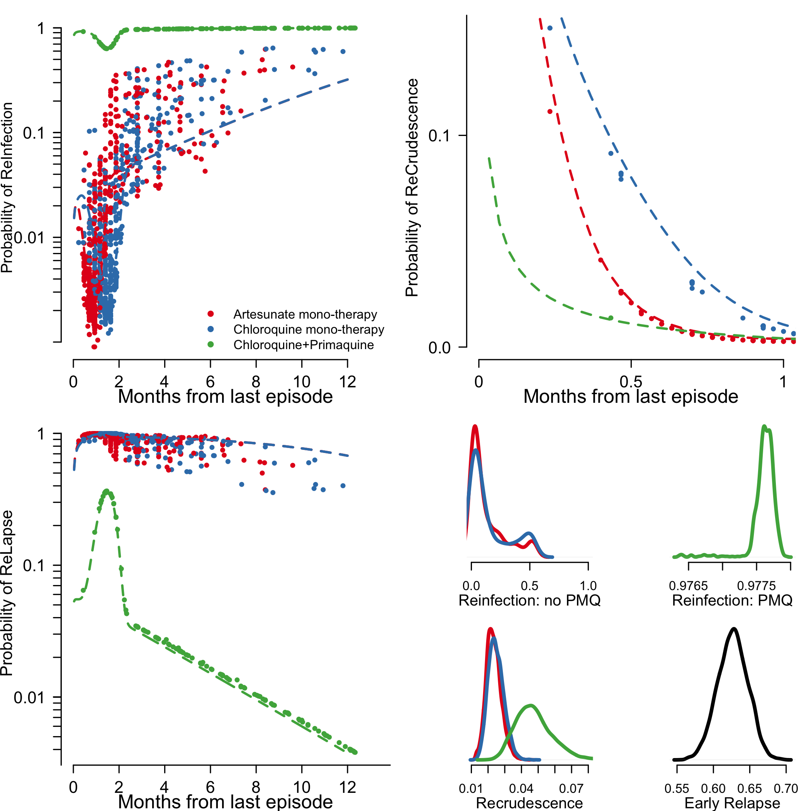<!-- -->


# Extract probabilistic information


```r
labels = extract(mod3_RE, 'prob_labels')$prob_labels
# recrudescence
Combined_Time_Data$Recrudescence_mean_theta = apply(labels[,,4,drop=T],2,mean)
Combined_Time_Data$Recrudescence_975_theta = apply(labels[,,4,drop=T],2,quantile, 
                                                   probs = 0.975)
Combined_Time_Data$Recrudescence_025_theta = apply(labels[,,4,drop=T],2,quantile, 
                                                   probs = 0.025)

# relapse
Relapse_labels = labels[,,2,drop=T] + labels[,,3,drop=T]
Combined_Time_Data$Relapse_mean_theta = apply(Relapse_labels,2,mean)
Combined_Time_Data$Relapse_975_theta = apply(Relapse_labels,2,quantile, probs = 0.975)
Combined_Time_Data$Relapse_025_theta = apply(Relapse_labels,2,quantile, probs = 0.025)

# reinfection
Combined_Time_Data$ReInfection_mean_theta = apply(labels[,,1,drop=T],2,mean)
Combined_Time_Data$ReInfection_975_theta = apply(labels[,,1,drop=T],2,quantile, 
                                                 probs = 0.975)
Combined_Time_Data$ReInfection_025_theta = apply(labels[,,1,drop=T],2,quantile, 
                                                 probs = 0.025)

# Save this for use by the genetic model
Mod3_ThetaEstimates = Combined_Time_Data[!Combined_Time_Data$Censored,]
Mod3_ThetaEstimates$episode = as.integer(Mod3_ThetaEstimates$episode)
Mod3_ThetaEstimates$episode = Mod3_ThetaEstimates$episode+1
Mod3_ThetaEstimates$patientid = as.character(Mod3_ThetaEstimates$patientid)
Mod3_ThetaEstimates$Episode_Identifier = 
  apply(Mod3_ThetaEstimates,
        1, 
        function(x) {
          paste(x['patientid'], as.integer(x['episode']), sep = '_')
        } )
save(Mod3_ThetaEstimates, file = '../RData/TimingModel/MOD3_theta_estimates.RData')
# Order by difference in posterior interval
Combined_Time_Data = Combined_Time_Data[order(-log10(Combined_Time_Data$Relapse_mean_theta)),]
```

We also save a matrix of posterior samples to be used by the genetic model for full computation of the posterior:

```r
labels = extract(mod3_RE, 'prob_labels')$prob_labels

ind_Observed = which(!Combined_Time_Data$Censored)
K_samples = min(100, dim(labels)[1])
Relapse_labels = labels[,,2,drop=T] + labels[,,3,drop=T]
random_ind = sample(1:dim(labels)[1], K_samples)
Post_samples_matrix = data.frame(cbind(t(labels[random_ind,ind_Observed,4,drop=T]),
                                       t(Relapse_labels[random_ind,ind_Observed]),
                                       t(labels[random_ind,ind_Observed,1,drop=T])))
colnames(Post_samples_matrix) = c(sapply(c('C','L','I'), rep, K_samples))
Post_samples_matrix$Episode_Identifier = apply(Combined_Time_Data[!Combined_Time_Data$Censored,], 1, 
                                               function(x) {
                                                 paste(x['patientid'], as.integer(x['episode'])+1, 
                                                       sep = '_')} )
save(Post_samples_matrix, file = '../RData/TimingModel/MOD3_Posterior_samples.RData')
```


```r
par(las = 1, mfcol=c(2,2), bty='n')
## No PMQ group
ind = Combined_Time_Data$arm_num!='CHQ/PMQ' & !Combined_Time_Data$Censored
plot(log10(Combined_Time_Data$Relapse_mean_theta[ind]), 
     ylim = c(-2.2, 0),type='l',yaxt='n', main ='No radical cure',
     ylab = 'Probability of relapse', xlab = '',lwd=2)
mtext(text = 'Recurrence index',side = 1, line = 2)
axis(2, at = 0:(-2), labels = 10^(0:(-2)))
polygon(c(1:sum(ind), rev(1:sum(ind))), 
        y = c(log10(Combined_Time_Data$Relapse_025_theta[ind]),
              rev(log10(Combined_Time_Data$Relapse_975_theta[ind]))), 
        border = NA, col = rgb(1, 0, 0,0.5))

# Time of event versus uncertainty in the interval
plot(Combined_Time_Data$Time_to_event[ind],
     log10(Combined_Time_Data$Relapse_975_theta[ind]) -
       log10(Combined_Time_Data$Relapse_025_theta[ind]),  
     ylab = 'Uncertainty (log units)', 
     col = mycols[as.integer(Combined_Time_Data$arm_num[ind] == 'CHQ') +1],
     pch=20, xlab='')
mtext(text = 'Time to event (days)',side = 1, line = 2)

#PMQ group
ind = Combined_Time_Data$arm_num=='CHQ/PMQ' & !Combined_Time_Data$Censored
plot(log10(Combined_Time_Data$Relapse_mean_theta[ind]), 
     ylim = c(-3, 0),type='l',yaxt='n', xlab = '',lwd=2,
     ylab = 'Probability of relapse', main = 'Radical cure')
mtext(text = 'Recurrence index',side = 1, line = 2)
axis(2, at = 0:(-3), labels = 10^(0:(-3)))
polygon(c(1:sum(ind), rev(1:sum(ind))), 
        y = c(log10(Combined_Time_Data$Relapse_025_theta[ind]),
              rev(log10(Combined_Time_Data$Relapse_975_theta[ind]))), 
        border = NA, col = rgb(1, 0, 0,0.5))

# Time of event versus uncertainty in the interval
plot(Combined_Time_Data$Time_to_event[ind],
     log10(Combined_Time_Data$Relapse_975_theta[ind]) -
       log10(Combined_Time_Data$Relapse_025_theta[ind]),  
     ylab = 'Uncertainty (log units)', 
     col = mycols[3],
     pch=20, xlab='')
mtext(text = 'Time to event (days)',side = 1, line = 2)
```

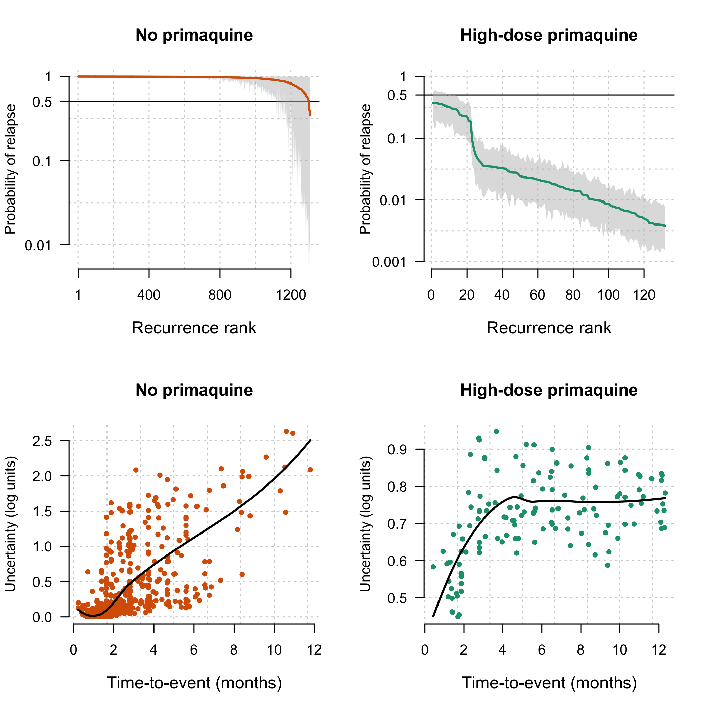<!-- -->

Some rough calculations to make sure we're not completely off track with the model output


```
## No radical cure: episodes per year:  3.97
```

```
## Radical cure: episodes per year:  0.19
```


We look at weighted averages of relapses, recrudescences and reinfections.
We pick 500 random draws from the posterior to calculate credible intervals.


The labels on the observed recurrences along with 95% credible intervals:


```
## Relapses are approximately  36.64 ( 35.2 - 38 ) % of recurrences after AS
```

```
## Recrudescences are approximately  0.3 ( 0.1 - 0.4 ) % of recurrences after AS
```

```
## Reinfections are approximately  63.05 ( 61.7 - 64.5 ) % of recurrences after AS
```

```
## Relapses are approximately  39.8 ( 38.4 - 41.2 ) % of recurrences after CQ
```

```
## Recrudescences are approximately  0.37 ( 0.2 - 0.6 ) % of recurrences after CQ
```

```
## Reinfections are approximately  59.79 ( 58.4 - 61.3 ) % of recurrences after CQ
```

```
## Relapses are approximately  13.37 ( 12.3 - 14.3 ) % of recurrences after CQ+PMQ
```

```
## Recrudescences are approximately  0.14 ( 0.1 - 0.2 ) % of recurrences after CQ+PMQ
```

```
## Reinfections are approximately  86.49 ( 85.5 - 87.5 ) % of recurrences after CQ+PMQ
```

