```
## Loading required package: lme4
```

```
## Loading required package: Matrix
```

```
## Loading required package: plyr
```

```
## Loading required package: dplyr
```

```
## 
## Attaching package: 'dplyr'
```

```
## The following objects are masked from 'package:plyr':
## 
##     arrange, count, desc, failwith, id, mutate, rename, summarise,
##     summarize
```

```
## The following objects are masked from 'package:stats':
## 
##     filter, lag
```

```
## The following objects are masked from 'package:base':
## 
##     intersect, setdiff, setequal, union
```

```
## Loading required package: gtools
```

```
## Loading required package: tictoc
```

```
## Loading required package: doParallel
```

```
## Loading required package: foreach
```

```
## Loading required package: iterators
```

```
## Loading required package: parallel
```

```
## Loading required package: matrixStats
```

```
## 
## Attaching package: 'matrixStats'
```

```
## The following object is masked from 'package:dplyr':
## 
##     count
```

```
## The following object is masked from 'package:plyr':
## 
##     count
```

```
## Loading required package: igraph
```

```
## 
## Attaching package: 'igraph'
```

```
## The following object is masked from 'package:gtools':
## 
##     permute
```

```
## The following objects are masked from 'package:dplyr':
## 
##     as_data_frame, groups, union
```

```
## The following objects are masked from 'package:stats':
## 
##     decompose, spectrum
```

```
## The following object is masked from 'package:base':
## 
##     union
```

```
## Loading required package: RColorBrewer
```

```
## Loading required package: knitr
```

```
## Loading required package: bindrcpp
```

```
## Loading required package: rstan
```

```
## Loading required package: ggplot2
```

```
## Registered S3 methods overwritten by 'ggplot2':
##   method         from 
##   [.quosures     rlang
##   c.quosures     rlang
##   print.quosures rlang
```

```
## Loading required package: StanHeaders
```

```
## rstan (Version 2.18.2, GitRev: 2e1f913d3ca3)
```

```
## For execution on a local, multicore CPU with excess RAM we recommend calling
## options(mc.cores = parallel::detectCores()).
## To avoid recompilation of unchanged Stan programs, we recommend calling
## rstan_options(auto_write = TRUE)
```

```
## Loading required package: boot
```

```
## 
## Attaching package: 'boot'
```

```
## The following objects are masked from 'package:gtools':
## 
##     inv.logit, logit
```

```
## Loading required package: gdata
```

```
## gdata: read.xls support for 'XLS' (Excel 97-2004) files ENABLED.
```

```
## 
```

```
## gdata: read.xls support for 'XLSX' (Excel 2007+) files ENABLED.
```

```
## 
## Attaching package: 'gdata'
```

```
## The following objects are masked from 'package:dplyr':
## 
##     combine, first, last
```

```
## The following object is masked from 'package:stats':
## 
##     nobs
```

```
## The following object is masked from 'package:utils':
## 
##     object.size
```

```
## The following object is masked from 'package:base':
## 
##     startsWith
```

```
## Loading required package: loo
```

```
## This is loo version 2.1.0.
## **NOTE: As of version 2.0.0 loo defaults to 1 core but we recommend using as many as possible. Use the 'cores' argument or set options(mc.cores = NUM_CORES) for an entire session. Visit mc-stan.org/loo/news for details on other changes.
```

```
## 
## Attaching package: 'loo'
```

```
## The following object is masked from 'package:rstan':
## 
##     loo
```

```
## The following object is masked from 'package:igraph':
## 
##     compare
```

```
## Loading required package: devtools
```

```
## Loading required package: truncnorm
```

```
##         lme4         plyr        dplyr       gtools       tictoc 
##         TRUE         TRUE         TRUE         TRUE         TRUE 
##   doParallel     parallel    iterators      foreach       Matrix 
##         TRUE         TRUE         TRUE         TRUE         TRUE 
##  matrixStats       igraph RColorBrewer        knitr     bindrcpp 
##         TRUE         TRUE         TRUE         TRUE         TRUE 
##        rstan  StanHeaders      ggplot2         boot        gdata 
##         TRUE         TRUE         TRUE         TRUE         TRUE 
##          loo        stats     graphics    grDevices        utils 
##         TRUE         TRUE         TRUE         TRUE         TRUE 
##     datasets      methods         base     devtools    truncnorm 
##         TRUE         TRUE         TRUE         TRUE         TRUE
```

# Preliminaries


# Stan models

## Model 1: Mixture of three components


* ReInfections occur at 'random' (exponential distribution).
A random effects term is used to adjust for inter-individual variability in propensity to be reinfected.

* Recrudescences can happen in the first couple of weeks (exponential distribution, high rate parameter). 

* Relapses are broken into two components. The fast/periodic relapse component happens as described by a Weibull with blood-stage drug dependent parameters (same as in Model 1). The slow/random relapse component is described by an exponential disrtibution.

* Primaquine is assumed to have 100% efficacy.


## Model 2: Mixture of three components and reLapses after PMQ

This is the final model reported in the paper. 

* ReInfections occur at 'random' (exponential distribution).
A random effects term is used to adjust for inter-individual variability in propensity to be reinfected.

* Recrudescences are exponentially distributed 

* Relapses are broken into two components (same as in Model 2).

* Primaquine is not assumed to have 100% efficacy and a random effects term describes the propensity to relapse after primaquine.


## Model 3: Adding seasonality

Here we explore whether a seasonality term is useful to explain some reinfections 

The seasonal term is given in units of weeks by $\exp(\beta_1  \sin (\frac{2\pi t}{T} + \beta_1))$ where $T=365/7$ (number of weeeks in the year).
This increases the reinfection mixing proportion $p_{(n)}$ for each drug treatment.

This model is still in development and not currently functional.


# VHX and BPD pooled data set


```r
load('../RData/TimingModel/Combined_Time_Event.RData')
# Get rid of the very short durations 
Combined_Time_Data = filter(Combined_Time_Data, Censored > -1, Time_to_event >= 5)
# Turn drug into a numeric vector
Combined_Time_Data$numeric_drug = as.integer(revalue(Combined_Time_Data$arm_num,
                                                     c('AS'='0','CHQ'='1','CHQ/PMQ'='2')))
# deal with non-integer ids
Combined_Time_Data$patientid = factor(Combined_Time_Data$patientid)

# Convert ID to integer
Combined_Time_Data$ID = as.integer(Combined_Time_Data$patientid)
Combined_Time_Data = arrange(Combined_Time_Data, ID, episode)
# We sort the ids so that ids go from 1...N
ids = unique(Combined_Time_Data$ID)
N = as.integer(length(ids))

# Create a vector that maps the nth person to 0 (always received Primaquine) 
# or to their rank for those who didn't receive primaquine
noPMQ_ind = which(Combined_Time_Data$arm_num != "CHQ/PMQ")
N_noPMQ = length(unique(Combined_Time_Data$ID[noPMQ_ind])) #number of IDs without PMQ
ID_mapped_to_noPMQ_rank = rep(0, N)


index = 1
for(id in 1:N){
  ind = which(Combined_Time_Data$ID==id)
  if(!2 %in% Combined_Time_Data$numeric_drug[ind]){
    ID_mapped_to_noPMQ_rank[id] = index
    index = index + 1
  }
}


# Create a vector that maps the nth person to 0 (always received Primaquine) or
PMQ_ind = which(Combined_Time_Data$arm_num == "CHQ/PMQ")
N_PMQ = length(unique(Combined_Time_Data$ID[PMQ_ind])) #number of IDs with PMQ
ID_mapped_to_PMQ_rank = rep(0, N)


index = 1
for(id in 1:N){
  ind = which(Combined_Time_Data$ID==id)
  if(2 %in% Combined_Time_Data$numeric_drug[ind]){
    ID_mapped_to_PMQ_rank[id] = index
    index = index + 1
  }
}


ind = !duplicated(Combined_Time_Data$ID)
drug_received = Combined_Time_Data$numeric_drug[ind]
```

# Prior specification


```r
# The hierachical parameters defining the prior distributions for model 1
Prior_params_M1 = list(Hyper_lambda_shape = 50,
                       Hyper_lambda_rate = 50*900,
                       Hyper_gamma_shape = 50,
                       Hyper_gamma_rate = 50*100,
                       Hyper_lambda_recrud_shape = 100,
                       Hyper_lambda_recrud_rate = 100*10,
                       Hyper_AS_shape_mean = 5,
                       Hyper_AS_shape_sd = .5,
                       Hyper_AS_scale_mean = 27,
                       Hyper_AS_scale_sd = 1,
                       Hyper_CQ_shape_mean = 5,
                       Hyper_CQ_shape_sd = .5,
                       Hyper_CQ_scale_mean = 45,
                       Hyper_CQ_scale_sd = 1,
                       Hyper_logit_mean_p_mean = logit(0.3),
                       Hyper_logit_mean_p_sd = .5,
                       Hyper_logit_sd_p_lambda = 1,
                       Hyper_logit_c1_mean = logit(0.01),
                       Hyper_logit_c1_sd = .25,
                       Early_L_logit_mean = 0,
                       Early_L_logit_sd = .25,
                       Hyper_mean_rate_decrease = 0.66,
                       Hyper_sd_rate_decrease = 0.15)
# Model 2: extra parameters
Prior_params_M2 = c(Prior_params_M1, 
                    Hyper_logit_mean_pPMQ_mean = logit(0.95),
                    Hyper_logit_mean_pPMQ_sd = .25,
                    Hyper_logit_sd_pPMQ_lambda = 1)

writeLines(sprintf('The prior specification for Model 2 is a PMQ+ failure rate of %s%% (%s-%s)',
                  round(100*inv.logit(Prior_params_M2$Hyper_logit_mean_pPMQ_mean),1),
                  round(100 - 100*inv.logit(Prior_params_M2$Hyper_logit_mean_pPMQ_mean +
                                              1.96*Prior_params_M2$Hyper_logit_mean_pPMQ_sd), 1),
                  round(100 - 100*inv.logit(Prior_params_M2$Hyper_logit_mean_pPMQ_mean -
                                              1.96*Prior_params_M2$Hyper_logit_mean_pPMQ_sd), 1)))
```

```
## The prior specification for Model 2 is a PMQ+ failure rate of 95% (3.1-7.9)
```


# Run Model

Set up parameters for the MCMC runs.

```r
# remove this once models 1-2 conform with augmented data (including Censored == -1)
Combined_Time_Data = filter(Combined_Time_Data, Censored > -1)
# Choose as many chains as available cores
Chains = 8
options(mc.cores = Chains)
IT = 10^5
WarmUp = .5*IT
thin = 400

# put the data into stan format
# For model 1 
Time_data_1 =list(N         = N,
                  #Number of individuals
                  Neps      = as.integer(nrow(Combined_Time_Data)),
                  #Number of durations
                  N_noPMQ   = as.integer(N_noPMQ),
                  # Number of individuals who do not recieve PMQ
                  N_PMQ     = as.integer(N_PMQ),
                  # Number of individuals who do not recieve PMQ
                  Durations = as.double(Combined_Time_Data$Time_to_event),
                  #Time to reinfection or time to censoring
                  Censored  = as.integer(Combined_Time_Data$Censored),
                  #If the duration is right censored or not
                  Drug      = Combined_Time_Data$numeric_drug,
                  # drug coded as an integer
                  ID_of_Patient = Combined_Time_Data$ID,
                  # the ID corresponding to each time interval
                  ID_mapped_to_noPMQ_rank = ID_mapped_to_noPMQ_rank,
                  # the index mapping PMQ individuals to their rank
                  Study_Period = as.integer(Combined_Time_Data$Study_Period)
)
# For model 2
Time_data_2 =list(N         = N,
                  #Number of individuals
                  Neps      = as.integer(nrow(Combined_Time_Data)),
                  #Number of durations
                  N_noPMQ   = N_noPMQ,
                  # Number of individuals who do not recieve PMQ
                  N_PMQ     = N_PMQ,
                  # Number of individuals who do not recieve PMQ
                  Durations = as.double(Combined_Time_Data$Time_to_event),
                  #Time to reinfection or time to censoring
                  Censored  = as.integer(Combined_Time_Data$Censored),
                  #If the duration is right censored or not
                  Drug      = Combined_Time_Data$numeric_drug,
                  # drug coded as an integer
                  ID_of_Patient   = Combined_Time_Data$ID,
                  # the index of the individual for each time interval
                  ID_mapped_to_noPMQ_rank = ID_mapped_to_noPMQ_rank,
                  # the index mapping no PMQ individuals to their rank
                  ID_mapped_to_PMQ_rank = ID_mapped_to_PMQ_rank,
                  # the index mapping PMQ individuals to their rank
                  Study_Period = as.integer(Combined_Time_Data$Study_Period))
```

Run with ```{r} Chains``` parallel chains. The choice of this number depends on compute power.


# Plot output

Let's make some nice colors for the plotting

```r
# Colour scheme
# Previous Set1 not colourblind friendly: display.brewer.all(colorblindFriendly = T)
Dark2 = brewer.pal(8, 'Dark2')
Set2 = brewer.pal(8, 'Set2')

drug_cols3 = array(Dark2[c(4,6,1)], dim = 3, dimnames = list(c('AS','CHQ','CHQ/PMQ'))) 
drug_cols2 = array(Dark2[c(2,2,1)], dim = 3, dimnames = list(c('AS','CHQ','CHQ/PMQ')))
drug_cols_light2 = array(Set2[c(2,2,1)], dim = 3, dimnames = list(c('AS','CHQ','CHQ/PMQ')))

# Vector of states
states = c(relapse = 'L', reinfection = 'I', recrudescence = 'C')

#mycols = brewer.pal(n=3, name = 'Set1')
# Do we include censored time intervals in the plots:
PLOT_Censored_Obs = F
if(PLOT_Censored_Obs){
  ind_plotting = which(Combined_Time_Data$Censored > -1)
} else {
  ind_plotting = which(Combined_Time_Data$Censored == 0)
}
```


## Model 1


```r
par(las=1)
traceplot(mod1_Fit,c('AS_shape', 'CQ_shape', 'AS_scale', 'CQ_scale'))
```

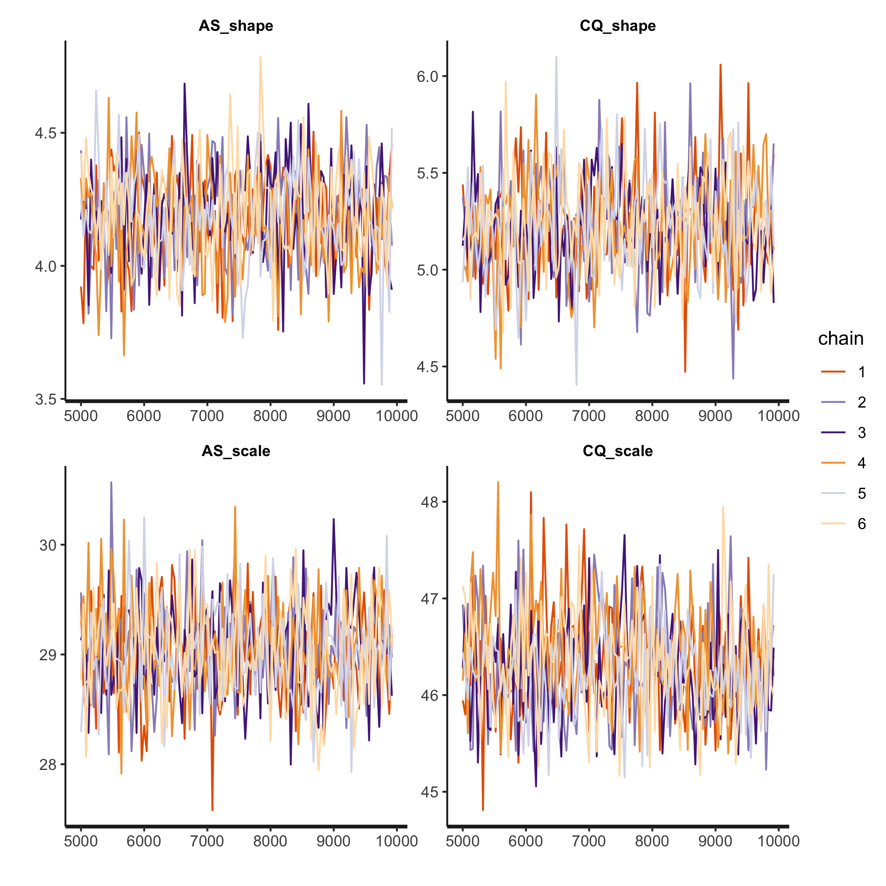<!-- -->

```r
traceplot(mod1_Fit, c('lambda','gamma','rate_decrease'))
```

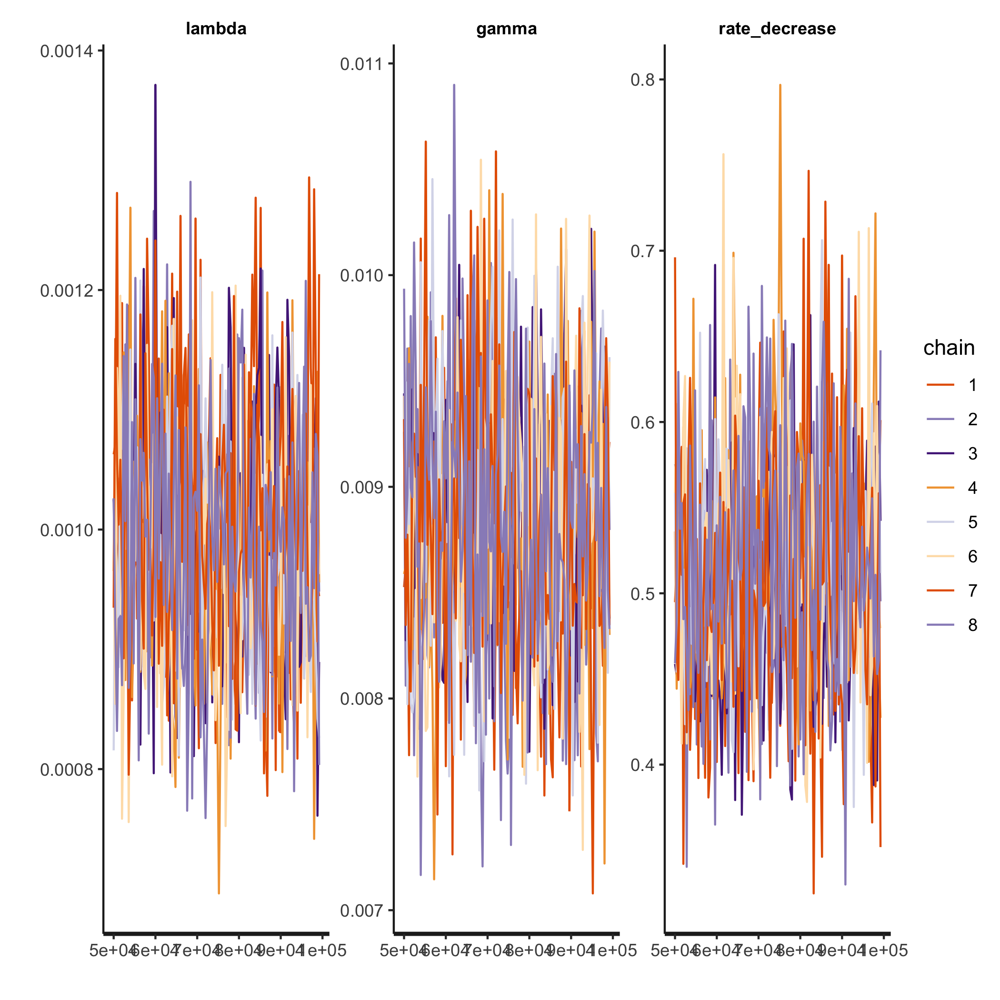<!-- -->

```r
traceplot(mod1_Fit, c('lambda_recrud','logit_EarlyL'))
```

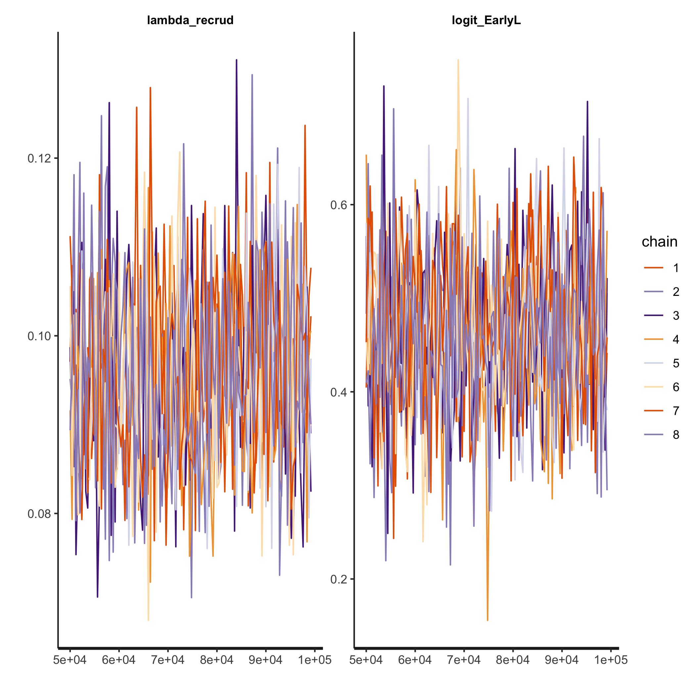<!-- -->

```r
traceplot(mod1_Fit, c('logit_c1_CQ','logit_c1_AS','logit_mean_p','logit_sd_p'))
```

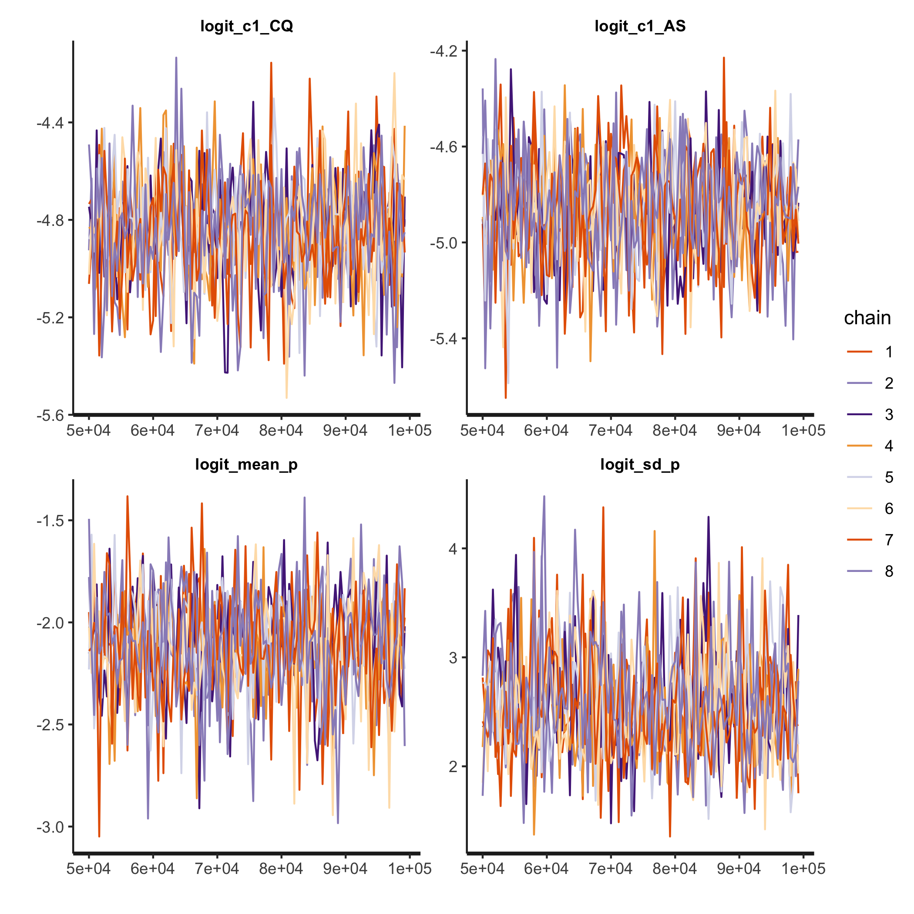<!-- -->

```r
thetas_mod1 = extract(mod1_Fit)
```


```r
par(las=1)
par(mfrow=c(1,3))
hist((1/thetas_mod1$lambda)/360, main='Mean time to reinfection (VHX)', xlab='years')
hist((1/(thetas_mod1$lambda*thetas_mod1$rate_decrease))/360, 
     main='Mean time to reinfection (BPD)', xlab='years')
hist(1/thetas_mod1$gamma, main='Mean time to late reLapse', xlab='days')
```

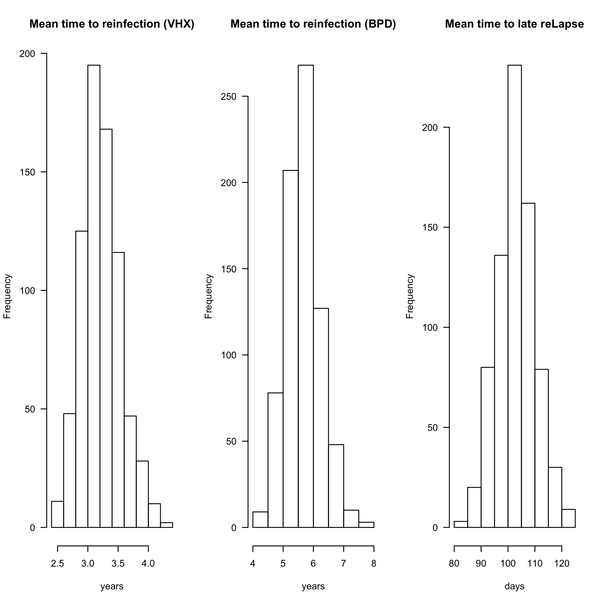<!-- -->

```r
par(las=1, mfrow=c(2,2))

hist(inv.logit(apply(thetas_mod1$logit_p,2,mean)), 
     xlab = 'Probability reinfection for no PMQ', main = '')

hist(inv.logit(thetas_mod1$logit_c1_AS), 
     xlab = 'Mixing proportion recrudescence: AS', main='')
hist(inv.logit(thetas_mod1$logit_c1_CQ), 
     xlab = 'Mixing proportion recrudescence: CQ', main='')
hist(inv.logit(thetas_mod1$logit_EarlyL), 
     xlab = 'Mixing proportion early vs late relapse', main='')
```

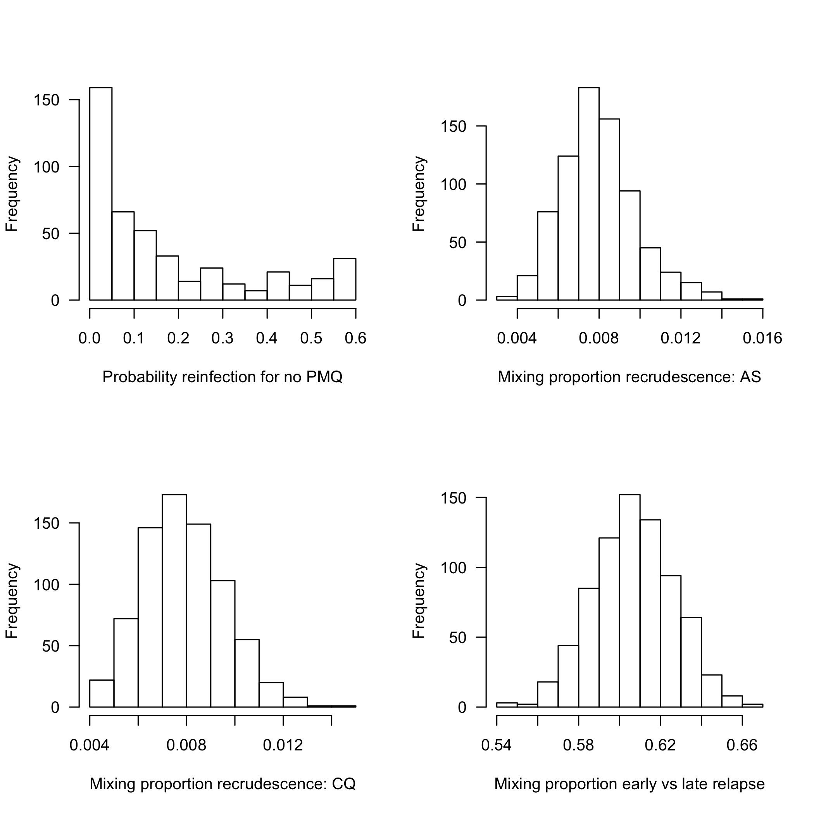<!-- -->


```r
par(las=1, mfrow=c(1,3))
# Plot the outcome of the predicted labels
#****************************** Reinfection ******************************
labels = extract(mod1_Fit, 'prob_labels')$prob_labels
mean_labels_Reinfection = apply(labels[,ind_plotting,1,drop=T], 2, mean)
plot(Combined_Time_Data$Time_to_event[ind_plotting], log10(mean_labels_Reinfection),
     col = drug_cols3[Combined_Time_Data$numeric_drug[ind_plotting]+1],
     pch = as.numeric(Combined_Time_Data$Censored[ind_plotting])+16,
     ylab='log10 probability of reinfection', yaxt='n',xaxt='n',
     xlab='Months from last episode', xlim=c(0,400))
axis(1, at = seq(0, 420, by=60), labels = seq(0, 420, by=60)/30)
axis(2, at = -2:0, labels= 10^(-2:0))
axis(2, at = log10(seq(.1,1,by=.1)), labels = NA)
axis(2, at = log10(seq(.01,.1,by=.01)), labels = NA)
axis(2, at = log10(seq(.001,.01,by=.001)), labels = NA)
legend('bottomright',legend = c('Artesunate','Chloroquine','Primaquine+'),
       col=drug_cols3,pch = rep(20,3), bty='n',lwd=2,lty=NA)


#****************************** Recrudescence ****************************
mean_labels_ReCrud = apply(labels[,ind_plotting,4,drop=T], 2, mean)
plot(Combined_Time_Data$Time_to_event[ind_plotting], log10(mean_labels_ReCrud),
     col = drug_cols3[Combined_Time_Data$numeric_drug[ind_plotting]+1], xaxt='n',
     pch = as.numeric(Combined_Time_Data$Censored[ind_plotting])+16,
     ylab='log10 probability of recrudescence',
     xlab='Months from last episode')
axis(1, at = seq(0,360,by=30), labels = seq(0,360,by=30)/30)


#****************************** Relapse ****************************
mean_labels_ReLap1 = apply(labels[,ind_plotting,2,drop=T], 2, mean)
mean_labels_ReLap2 = apply(labels[,ind_plotting,3,drop=T], 2, mean)
mean_labels_ReLap = mean_labels_ReLap1 + mean_labels_ReLap2
plot(Combined_Time_Data$Time_to_event[ind_plotting], log10(mean_labels_ReLap),
     col = drug_cols3[Combined_Time_Data$numeric_drug[ind_plotting]+1], xaxt='n',
     pch = as.numeric(Combined_Time_Data$Censored[ind_plotting])+16,
     ylab='log10 probability of relapse',
     xlab='Months from last episode')
axis(1, at = seq(0, 420, by= 60), labels = seq(0, 420, by=60)/30)
```

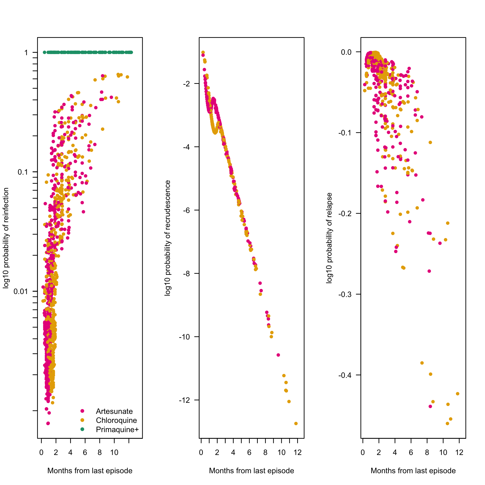<!-- -->

## Model 2

Traceplots and posterior distributions:

```r
traceplot(mod2_Fit,c('AS_shape', 'CQ_shape', 'AS_scale', 'CQ_scale'))
```

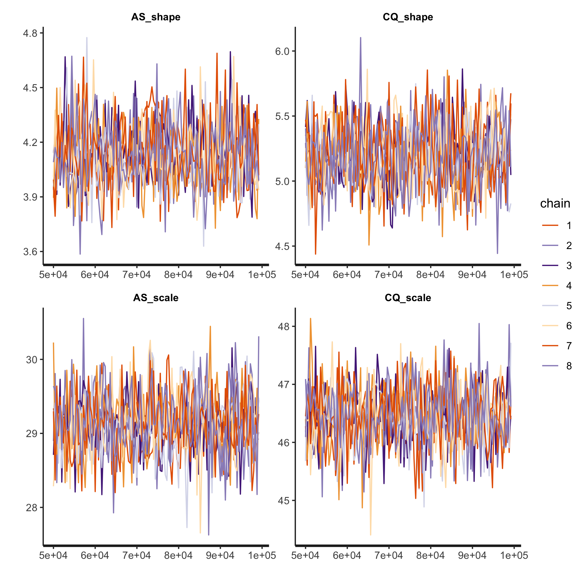<!-- -->

```r
traceplot(mod2_Fit, c('gamma','lambda','lambda_recrud','rate_decrease'))
```

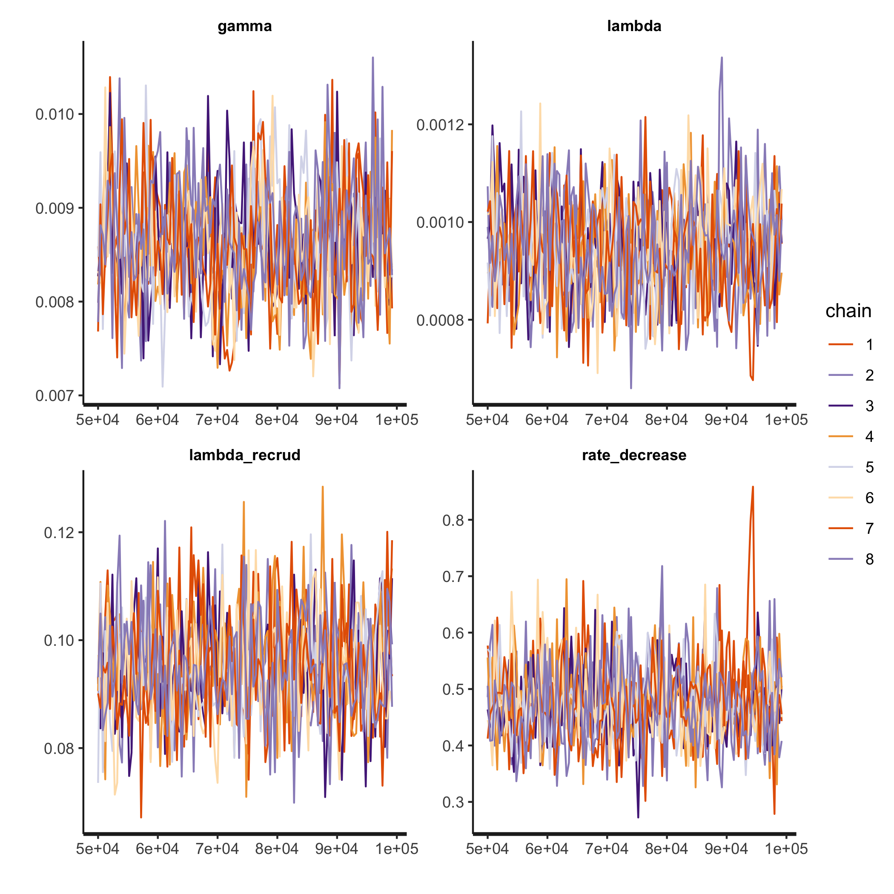<!-- -->

```r
traceplot(mod2_Fit, c('logit_c1_AS','logit_c1_CQ','logit_c1_CQ_PMQ'))
```

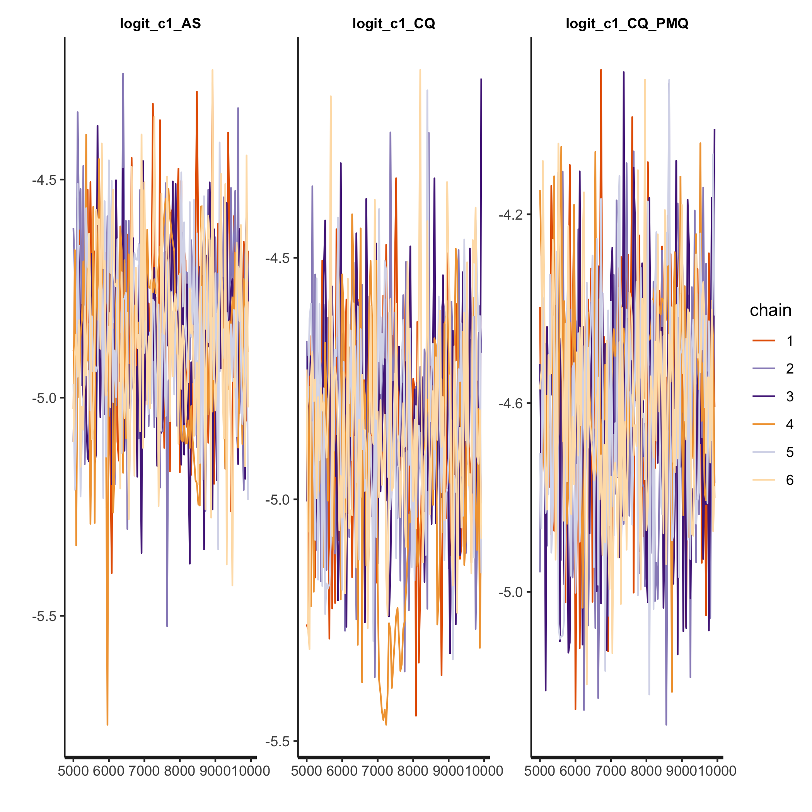<!-- -->

```r
traceplot(mod2_Fit, c('logit_mean_p','logit_sd_p','logit_EarlyL'))
```

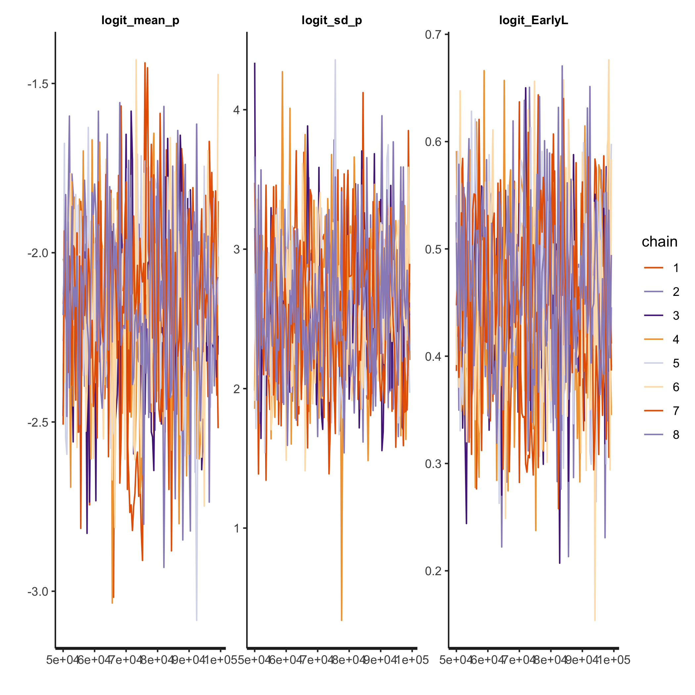<!-- -->

```r
thetas_mod2 = extract(mod2_Fit)
```


```r
# save a set of posterior parameter values for posterior predictive simulation
parameter_names = names(generate_inital_values_M2(Prior_params_M2,10,10))
parameter_names = parameter_names[!parameter_names %in% c('logit_p','logit_p_PMQ')]
N_samples = 200
thetas2_matrix = array(dim = c(N_samples, length(parameter_names)))
colnames(thetas2_matrix) = parameter_names
for(p in parameter_names){
  thetas2_matrix[,which(p==parameter_names)] = sample(thetas_mod2[[p]],size = N_samples)
}
save(thetas2_matrix, file = '../RData/TimingModel/Posterior_theta_samples.RData')
```


```r
par(mfrow=c(1,3),las=1)
hist((1/thetas_mod2$lambda)/365, xlab='Mean time to reinfection in VHX (years)', main='')
hist((1/(thetas_mod2$lambda*thetas_mod2$rate_decrease))/365, 
     xlab='Mean time to reinfection in BPD (years)', main='')
hist((1/thetas_mod2$gamma), xlab='Mean time to late reLapse (days)', main='')
```

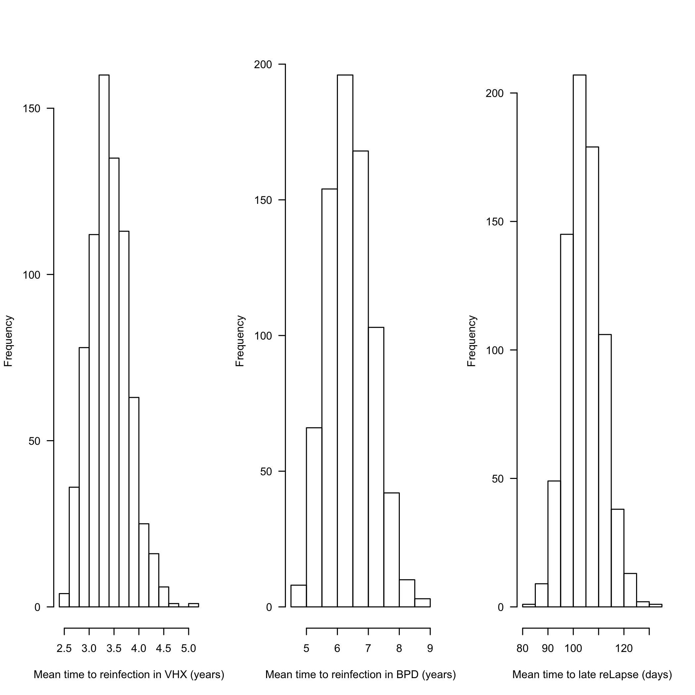<!-- -->

```r
par(mfrow=c(3,2),las=1)
# distribution of individual mixing proportions
hist(inv.logit(apply(thetas_mod2$logit_p,2,mean)),
     main = 'no PMQ', xlab = 'Individual mixing weights p',
     yaxt='n',ylab='')
hist(inv.logit(apply(thetas_mod2$logit_p_PMQ,2,mean)),
     main = 'PMQ+', xlab = 'Individual mixing weights p',
     yaxt='n',ylab='')

# posterior distribution of hierachical mixing proportions
hist(inv.logit(thetas_mod2$logit_mean_p), 
     xlab = 'Mean reinfection mixing weight', main = 'no PMQ',
     yaxt='n',ylab='')
round(100*quantile(inv.logit(thetas_mod2$logit_mean_p), probs = c(0.025,0.5,0.975)))
```

```
##  2.5%   50% 97.5% 
##     6    10    16
```

```r
hist(inv.logit(thetas_mod2$logit_mean_p_PMQ),
     xlab = 'Mean reinfection mixing weight', main = 'PMQ+',
     yaxt='n',ylab='')
round(100*quantile(inv.logit(thetas_mod2$logit_mean_p_PMQ), probs = c(0.025,0.975)))
```

```
##  2.5% 97.5% 
##    96    98
```

```r
# posterior distribution of hierachical mixing proportions
hist(inv.logit(thetas_mod2$logit_sd_p), 
     xlab = 'SD of reinfection mixing weight', main = 'no PMQ',
     yaxt='n',ylab='')
round(quantile(inv.logit(thetas_mod2$logit_sd_p), probs = c(0.025,0.5,0.975)),2)
```

```
##  2.5%   50% 97.5% 
##  0.84  0.93  0.97
```

```r
hist(inv.logit(thetas_mod2$logit_sd_p_PMQ),
     xlab = 'SD of reinfection mixing weight', main = 'PMQ+',
     yaxt='n',ylab='')
```

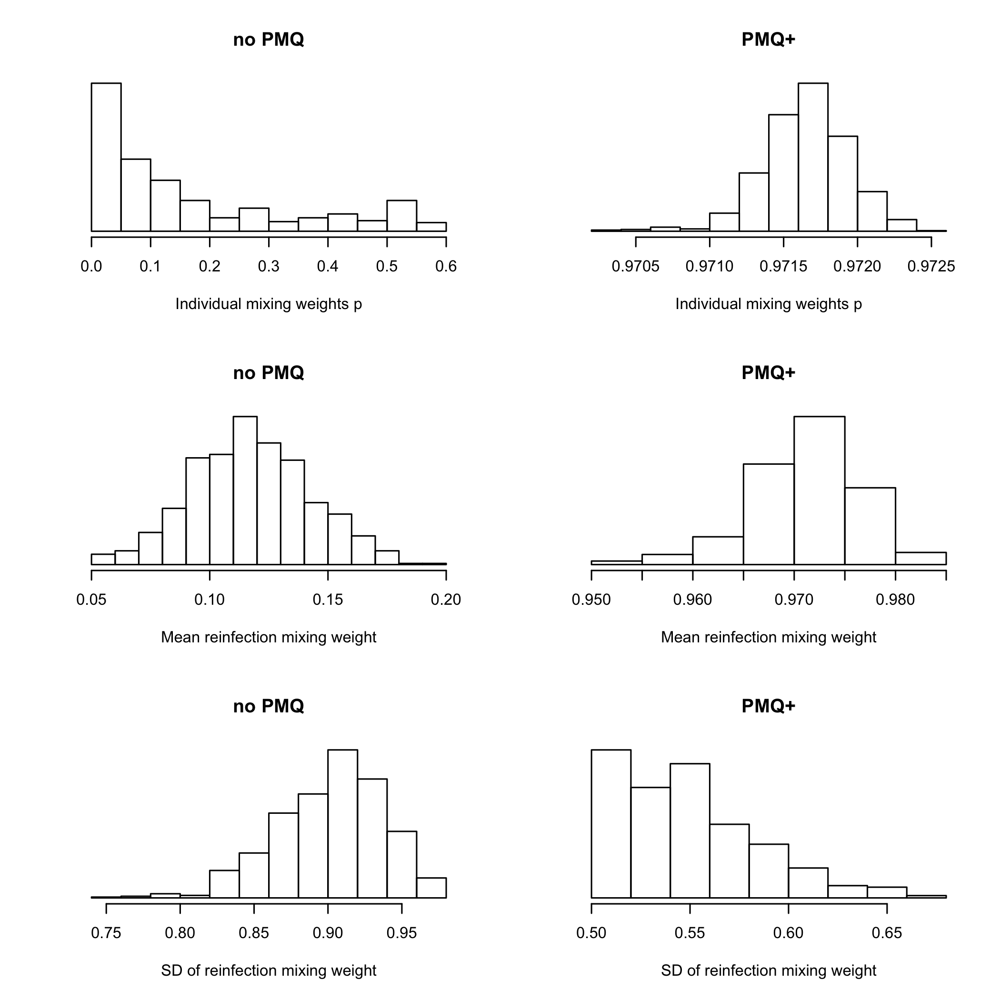<!-- -->

```r
quantile(inv.logit(thetas_mod2$logit_sd_p_PMQ), probs = c(0.025,0.975),2)
```

```
##      2.5%     97.5% 
## 0.5131797 0.6582314
```

```r
par(mfrow=c(1,1))
hist(inv.logit(thetas_mod2$logit_EarlyL), xlab = 'Mixing weight: early versus late relapse',
     main='',yaxt='n',ylab='')
```

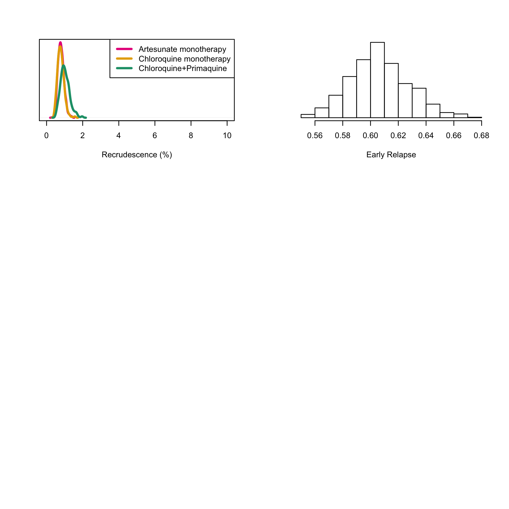<!-- -->


```r
par(las=1, mfrow=c(1,3))
# Plot the outcome of the predicted labels
#****************************** Reinfection ******************************
labels2 = extract(mod2_Fit, 'prob_labels')$prob_labels
mean_labels_Reinfection = apply(labels2[,ind_plotting,1,drop=T], 2, mean)
plot(Combined_Time_Data$Time_to_event[ind_plotting], log10(mean_labels_Reinfection),
     col = drug_cols3[Combined_Time_Data$numeric_drug[ind_plotting]+1],
     pch = as.numeric(Combined_Time_Data$Censored[ind_plotting])+16,
     ylab='log10 probability of reinfection', yaxt='n',xaxt='n',
     xlab='Months from last episode', xlim=c(0,400))
axis(1, at = seq(0, 420, by=60), labels = seq(0, 420, by=60)/30)
axis(2, at = -2:0, labels= 10^(-2:0))
axis(2, at = log10(seq(.1,1,by=.1)), labels = NA)
axis(2, at = log10(seq(.01,.1,by=.01)), labels = NA)
axis(2, at = log10(seq(.001,.01,by=.001)), labels = NA)
legend('bottomright',legend = c('Artesunate','Chloroquine','Chloroquine\nPrimaquine'),
       col=c(drug_cols3),pch = rep(1,3), bty='n',lwd=2,lty=NA)


#****************************** Recrudescence ****************************
mean_labels_ReCrud = apply(labels2[,ind_plotting,4,drop=T], 2, mean)
plot(Combined_Time_Data$Time_to_event[ind_plotting], log10(mean_labels_ReCrud),
     col = drug_cols3[Combined_Time_Data$numeric_drug[ind_plotting]+1], xaxt='n',
     pch = as.numeric(Combined_Time_Data$Censored[ind_plotting])+16,
     ylab='log10 probability of recrudescence',
     xlab='Months from last episode')
axis(1, at = seq(0,360,by=30), labels = seq(0,360,by=30)/30)

#****************************** Relapse ****************************
mean_labels_ReLap1 = apply(labels2[,ind_plotting,2,drop=T], 2, mean)
mean_labels_ReLap2 = apply(labels2[,ind_plotting,3,drop=T], 2, mean)
mean_labels_ReLap = mean_labels_ReLap1 + mean_labels_ReLap2
plot(Combined_Time_Data$Time_to_event[ind_plotting], log10(mean_labels_ReLap),
     col = drug_cols3[Combined_Time_Data$numeric_drug[ind_plotting]+1], xaxt='n',
     pch = as.numeric(Combined_Time_Data$Censored[ind_plotting])+16,
     ylab='log10 probability of relapse',
     xlab='Months from last episode')
axis(1, at = seq(0, 420, by= 60), labels = seq(0, 420, by=60)/30)
```

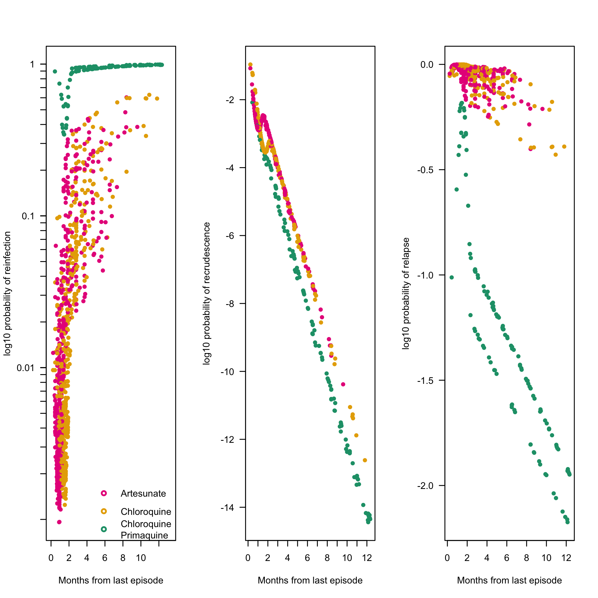<!-- -->


```r
writeLines(sprintf('The estimated decrease in reinfection rate from the VHX to BPD studies is %s%% (95 CI %s%%-%s%%)',
                   round(100-100*quantile(thetas_mod2$rate_decrease,probs = .5)),
                   round(100-100*quantile(thetas_mod2$rate_decrease,probs = .975)),
                   round(100-100*quantile(thetas_mod2$rate_decrease,probs = 0.025))
                   ))
```

```
## The estimated decrease in reinfection rate from the VHX to BPD studies is 53% (95 CI 37%-64%)
```

```r
writeLines(sprintf('The mean time to reinfection in the VHX study is estimated as %s years (95 CI %s-%s)',
                   round((1/quantile(thetas_mod2$lambda,probs = .5))/365,1),
                   round((1/quantile(thetas_mod2$lambda,probs = .975))/365,1),
                   round((1/quantile(thetas_mod2$lambda,probs = .025))/365,1)
                   ))
```

```
## The mean time to reinfection in the VHX study is estimated as 2.9 years (95 CI 2.4-3.6)
```

```r
writeLines(sprintf('The mean time to reinfection in the BPD study is estimated as %s years (95 CI %s-%s)',
                   round((1/quantile(thetas_mod2$lambda*thetas_mod2$rate_decrease,
                                     probs = .5))/365,1),
                   round((1/quantile(thetas_mod2$lambda*thetas_mod2$rate_decrease,
                                     probs = .975))/365,1),
                   round((1/quantile(thetas_mod2$lambda*thetas_mod2$rate_decrease,
                                     probs = .025))/365,1)
                   ))
```

```
## The mean time to reinfection in the BPD study is estimated as 6.2 years (95 CI 5-7.6)
```


# Model Evaluation

## Model Comparison


```r
library(loo)
log_lik1 = extract_log_lik(mod1_Fit)
log_lik2 = extract_log_lik(mod2_Fit)

loo_2 = loo(log_lik2)
```

```
## Warning: Relative effective sample sizes ('r_eff' argument) not specified.
## For models fit with MCMC, the reported PSIS effective sample sizes and 
## MCSE estimates will be over-optimistic.
```

```
## Warning: Some Pareto k diagnostic values are too high. See help('pareto-k-diagnostic') for details.
```

```r
loo_1 = loo(log_lik1)
```

```
## Warning: Relative effective sample sizes ('r_eff' argument) not specified.
## For models fit with MCMC, the reported PSIS effective sample sizes and 
## MCSE estimates will be over-optimistic.

## Warning: Some Pareto k diagnostic values are too high. See help('pareto-k-diagnostic') for details.
```

```r
loo::compare(loo_1,loo_2)
```

```
## elpd_diff        se 
##      -4.0       3.3
```

The simpler model (model 1) has higher predictive accuracy.


## Prior to Posterior plots


```r
par(mfrow=c(4,4))
# lambda: reinfection rate in VHX
hist(thetas_mod1$lambda,freq = FALSE, main='',yaxt='n',
     xlab=expression(lambda), ylab = '', col='grey', breaks=10)
xs = quantile(thetas_mod1$lambda, probs = seq(0,1,by = 0.001))
abline(v=mean(thetas_mod1$lambda),lwd=3,col='blue')
lines(xs, dgamma(x = xs,shape = Prior_params_M1$Hyper_lambda_shape, 
                 rate = Prior_params_M1$Hyper_lambda_rate),
      col='black',lwd=3)

# delta: decrease in reinfection rate in BPD
hist(thetas_mod1$rate_decrease,freq = FALSE, main='',yaxt='n',
     xlab=expression(delta), ylab = '', col='grey', breaks=10)
xs = quantile(thetas_mod1$rate_decrease, probs = seq(0,1,by = 0.001))
abline(v=mean(thetas_mod1$rate_decrease),lwd=3,col='blue')
lines(xs, dnorm(x = xs,mean = Prior_params_M1$Hyper_mean_rate_decrease, 
                sd = Prior_params_M1$Hyper_sd_rate_decrease),
      col='black',lwd=3)

# gamma: late relapse rate
hist(thetas_mod1$gamma,freq = FALSE, main='',
     xlab=expression(gamma), ylab = '', yaxt='n', 
     col='grey', breaks=10)
xs = quantile(thetas_mod1$gamma, probs = seq(0,1,by = 0.001))
abline(v=mean(thetas_mod1$gamma),lwd=3,col='blue')
lines(xs, dgamma(x = xs,shape = Prior_params_M1$Hyper_gamma_shape, 
                 rate = Prior_params_M1$Hyper_gamma_rate),
      col='black',lwd=3)

# lambda_RC:recrudescence rate
hist(thetas_mod1$lambda_recrud,freq = FALSE, main='',
     xlab=expression(lambda[RC]), ylab = '', yaxt='n', 
     col='grey', breaks=10)
xs = quantile(thetas_mod1$lambda_recrud, probs = seq(0,1,by = 0.001))
abline(v=mean(thetas_mod1$lambda_recrud),lwd=3,col='blue')
lines(xs, dgamma(x = xs,shape = Prior_params_M1$Hyper_lambda_recrud_shape, 
                 rate = Prior_params_M1$Hyper_lambda_recrud_rate),
      col='black',lwd=3)

# mixing weight: early versus late relapse
hist(thetas_mod1$logit_EarlyL, freq = F, main='',
     xlab= 'logit(q)', yaxt='n', ylab='', col='grey', breaks=10)
xs = quantile(thetas_mod1$logit_EarlyL, probs = seq(0,1,by = 0.001))
abline(v=mean(thetas_mod1$logit_EarlyL),lwd=3,col='blue')
lines(xs, dnorm(x = xs, mean = Prior_params_M1$Early_L_logit_mean, 
                sd = Prior_params_M1$Early_L_logit_sd),
      col='black',lwd=3)

# AS_scale (Weibull scale parameter for AS monotherapy)
hist(thetas_mod1$AS_scale, freq = F, main='',
     xlab= expression(mu[AS]), yaxt='n', ylab='', col=drug_cols3['AS'], breaks=10)
xs = quantile(thetas_mod1$AS_scale, probs = seq(0,1,by = 0.001))
abline(v=mean(thetas_mod1$AS_scale),lwd=3,col='blue')
lines(xs, dnorm(x = xs, mean = Prior_params_M1$Hyper_AS_scale_mean, 
                sd = Prior_params_M1$Hyper_AS_scale_sd),
      col='black',lwd=3)

# CQ_scale (Weibull scale parameter for CQ with or without PMQ)
hist(thetas_mod1$CQ_scale, freq = F, main='',
     xlab= expression(mu[CQ]), yaxt='n', ylab='', col=drug_cols3['CHQ'], breaks=10)
xs = quantile(thetas_mod1$CQ_scale, probs = seq(0,1,by = 0.001))
abline(v=mean(thetas_mod1$CQ_scale),lwd=3,col='blue')
lines(xs, dnorm(x = xs,mean = Prior_params_M1$Hyper_CQ_scale_mean, 
                sd = Prior_params_M1$Hyper_CQ_scale_sd),
      col='black',lwd=3)

# AS_shape (Weibull shape parameter for AS monotherapy)
hist(thetas_mod1$AS_shape, freq = F, main='',
     xlab= expression(k[AS]), yaxt='n', ylab='', col=drug_cols3['AS'], breaks=10)
xs = quantile(thetas_mod1$AS_shape, probs = seq(0,1,by = 0.001))
abline(v=mean(thetas_mod1$AS_shape),lwd=3,col='blue')
lines(xs, dnorm(x = xs,mean = Prior_params_M1$Hyper_AS_shape_mean, 
                sd = Prior_params_M1$Hyper_AS_shape_sd),
      col='black',lwd=3)

# CQ_shape (Weibull shape parameter for CQ with or without PMQ)
hist(thetas_mod1$CQ_shape,  freq = F, main='',
     xlab= expression(k[CQ]), yaxt='n', ylab='', col=drug_cols3['CHQ'], breaks=10)
xs = quantile(thetas_mod1$CQ_shape, probs = seq(0,1,by = 0.001))
abline(v=mean(thetas_mod1$CQ_shape),lwd=3,col='blue')
lines(xs, dnorm(x = xs,mean = Prior_params_M1$Hyper_CQ_shape_mean, 
                sd = Prior_params_M1$Hyper_CQ_shape_sd),
      col='black',lwd=3)

# Mean logit p (hierachical mean reinfection proportion): no PMQ
hist(thetas_mod1$logit_mean_p, freq = F, main='',
     xlab= expression(p[AS/CQ]^mu), yaxt='n', ylab='', col=drug_cols2['AS'], breaks=10)
xs = quantile(thetas_mod1$logit_mean_p, probs = seq(0,1,by = 0.001))
abline(v=mean(thetas_mod1$logit_mean_p),lwd=3,col='blue')
lines(xs, dnorm(x = xs, mean = Prior_params_M1$Hyper_logit_mean_p_mean, 
                sd = Prior_params_M1$Hyper_logit_mean_p_sd),
      col='black',lwd=3)


# SD logit p (hierachical sd reinfection proportion): no PMQ
hist(thetas_mod1$logit_sd_p, freq = F, main='',
     xlab= expression(p[AS/CQ]^sigma), yaxt='n', ylab='', col=drug_cols2['AS'], breaks=10)
xs = quantile(thetas_mod1$logit_sd_p, probs = seq(0,1,by = 0.001))
abline(v=mean(thetas_mod1$logit_sd_p),lwd=3,col='blue')
lines(xs, dexp(x = xs, rate = Prior_params_M1$Hyper_logit_sd_p_lambda),
      col='black',lwd=3)


# Mean c1 AS : mixing weight for recrudescence following AS
hist(thetas_mod1$logit_c1_AS, freq = F, main='',
     xlab= 'c(AS)', yaxt='n', ylab='', col=drug_cols3['AS'], breaks=10)
xs = quantile(thetas_mod1$logit_c1_AS, probs = seq(0,1,by = 0.001))
abline(v=mean(thetas_mod1$logit_c1_AS),lwd=3,col='blue')
lines(xs, dnorm(x = xs, mean = Prior_params_M1$Hyper_logit_c1_mean,
                sd = Prior_params_M1$Hyper_logit_c1_sd),
      col='black',lwd=3)

# Mean c1 CQ : mixing weight for recrudescence following CQ
hist(thetas_mod1$logit_c1_CQ, freq = F, main='',
     xlab= 'c(CQ)', yaxt='n', ylab='', col=drug_cols3['CHQ'], breaks=10)
xs = quantile(thetas_mod1$logit_c1_CQ, probs = seq(0,1,by = 0.001))
abline(v=mean(thetas_mod1$logit_c1_CQ),lwd=3,col='blue')
lines(xs, dnorm(x = xs, mean = Prior_params_M1$Hyper_logit_c1_mean,
                sd = Prior_params_M1$Hyper_logit_c1_sd),
      col='black',lwd=3)
```

<!-- -->


```r
par(mfrow=c(4,4))
# lambda: reinfection rate in VHX
hist(thetas_mod2$lambda,freq = FALSE, main='',yaxt='n',
     xlab=expression(lambda), ylab = '', col='grey', breaks=10)
xs = quantile(thetas_mod2$lambda, probs = seq(0,1,by = 0.001))
abline(v=mean(thetas_mod2$lambda),lwd=3,col='blue')
lines(xs, dgamma(x = xs,shape = Prior_params_M2$Hyper_lambda_shape, 
                 rate = Prior_params_M2$Hyper_lambda_rate),
      col='black',lwd=3)

# delta: decrease in reinfection rate in BPD
hist(thetas_mod2$rate_decrease,freq = FALSE, main='',yaxt='n',
     xlab=expression(delta), ylab = '', col='grey', breaks=10)
xs = quantile(thetas_mod2$rate_decrease, probs = seq(0,1,by = 0.001))
abline(v=mean(thetas_mod2$rate_decrease),lwd=3,col='blue')
lines(xs, dnorm(x = xs,mean = Prior_params_M2$Hyper_mean_rate_decrease, 
                 sd = Prior_params_M2$Hyper_sd_rate_decrease),
      col='black',lwd=3)

# gamma: late relapse rate
hist(thetas_mod2$gamma,freq = FALSE, main='',
     xlab=expression(gamma), ylab = '', yaxt='n', 
     col='grey', breaks=10)
xs = quantile(thetas_mod2$gamma, probs = seq(0,1,by = 0.001))
abline(v=mean(thetas_mod2$gamma),lwd=3,col='blue')
lines(xs, dgamma(x = xs,shape = Prior_params_M2$Hyper_gamma_shape, 
                 rate = Prior_params_M2$Hyper_gamma_rate),
      col='black',lwd=3)

# lambda_RC:recrudescence rate
hist(thetas_mod2$lambda_recrud,freq = FALSE, main='',
     xlab=expression(lambda[RC]), ylab = '', yaxt='n', 
     col='grey', breaks=10)
xs = quantile(thetas_mod2$lambda_recrud, probs = seq(0,1,by = 0.001))
abline(v=mean(thetas_mod2$lambda_recrud),lwd=3,col='blue')
lines(xs, dgamma(x = xs,shape = Prior_params_M2$Hyper_lambda_recrud_shape, 
                 rate = Prior_params_M2$Hyper_lambda_recrud_rate),
      col='black',lwd=3)

# mixing weight: early versus late relapse
hist(thetas_mod2$logit_EarlyL, freq = F, main='',
     xlab= 'logit(q)', yaxt='n', ylab='', col='grey', breaks=10)
xs = quantile(thetas_mod2$logit_EarlyL, probs = seq(0,1,by = 0.001))
abline(v=mean(thetas_mod2$logit_EarlyL),lwd=3,col='blue')
lines(xs, dnorm(x = xs, mean = Prior_params_M2$Early_L_logit_mean, 
                sd = Prior_params_M2$Early_L_logit_sd),
      col='black',lwd=3)

# AS_scale (Weibull scale parameter for AS monotherapy)
hist(thetas_mod2$AS_scale, freq = F, main='',
     xlab= expression(mu[AS]), yaxt='n', ylab='', col=drug_cols3['AS'], breaks=10)
xs = quantile(thetas_mod2$AS_scale, probs = seq(0,1,by = 0.001))
abline(v=mean(thetas_mod2$AS_scale),lwd=3,col='blue')
lines(xs, dnorm(x = xs, mean = Prior_params_M2$Hyper_AS_scale_mean, 
                sd = Prior_params_M2$Hyper_AS_scale_sd),
      col='black',lwd=3)

# CQ_scale (Weibull scale parameter for CQ with or without PMQ)
hist(thetas_mod2$CQ_scale, freq = F, main='',
     xlab= expression(mu[CQ]), yaxt='n', ylab='', col=drug_cols3['CHQ'], breaks=10)
xs = quantile(thetas_mod2$CQ_scale, probs = seq(0,1,by = 0.001))
abline(v=mean(thetas_mod2$CQ_scale),lwd=3,col='blue')
lines(xs, dnorm(x = xs,mean = Prior_params_M2$Hyper_CQ_scale_mean, 
                sd = Prior_params_M2$Hyper_CQ_scale_sd),
      col='black',lwd=3)

# AS_shape (Weibull shape parameter for AS monotherapy)
hist(thetas_mod2$AS_shape, freq = F, main='',
     xlab= expression(k[AS]), yaxt='n', ylab='', col=drug_cols3['AS'], breaks=10)
xs = quantile(thetas_mod2$AS_shape, probs = seq(0,1,by = 0.001))
abline(v=mean(thetas_mod2$AS_shape),lwd=3,col='blue')
lines(xs, dnorm(x = xs,mean = Prior_params_M2$Hyper_AS_shape_mean, 
                sd = Prior_params_M2$Hyper_AS_shape_sd),
      col='black',lwd=3)

# CQ_shape (Weibull shape parameter for CQ with or without PMQ)
hist(thetas_mod2$CQ_shape,  freq = F, main='',
     xlab= expression(k[CQ]), yaxt='n', ylab='', col=drug_cols3['CHQ'], breaks=10)
xs = quantile(thetas_mod2$CQ_shape, probs = seq(0,1,by = 0.001))
abline(v=mean(thetas_mod2$CQ_shape),lwd=3,col='blue')
lines(xs, dnorm(x = xs,mean = Prior_params_M2$Hyper_CQ_shape_mean, 
                sd = Prior_params_M2$Hyper_CQ_shape_sd),
      col='black',lwd=3)

# Mean logit p (hierachical mean reinfection proportion): no PMQ
hist(thetas_mod2$logit_mean_p, freq = F, main='',
     xlab= expression(p[AS/CQ]^mu), yaxt='n', ylab='', col=drug_cols2['AS'], breaks=10)
xs = quantile(thetas_mod2$logit_mean_p, probs = seq(0,1,by = 0.001))
abline(v=mean(thetas_mod2$logit_mean_p),lwd=3,col='blue')
lines(xs, dnorm(x = xs, mean = Prior_params_M2$Hyper_logit_mean_p_mean, 
                sd = Prior_params_M2$Hyper_logit_mean_p_sd),
      col='black',lwd=3)

# Mean logit p PMQ+ (hierachical mean reinfection proportion): PMQ+
hist(thetas_mod2$logit_mean_p_PMQ, freq = F, main='',
     xlab= expression(p['PMQ+']^mu), yaxt='n', ylab='', col=drug_cols3['CHQ/PMQ'], breaks=10)
xs = quantile(thetas_mod2$logit_mean_p_PMQ, probs = seq(0,1,by = 0.001))
abline(v=mean(thetas_mod2$logit_mean_p_PMQ),lwd=3,col='blue')
lines(xs, dnorm(x = xs, mean = Prior_params_M2$Hyper_logit_mean_pPMQ_mean, 
                sd = Prior_params_M2$Hyper_logit_mean_pPMQ_sd),
      col='black',lwd=3)

# SD logit p (hierachical sd reinfection proportion): no PMQ
hist(thetas_mod2$logit_sd_p, freq = F, main='',
     xlab= expression(p[AS/CQ]^sigma), yaxt='n', ylab='', col=drug_cols2['AS'], breaks=10)
xs = quantile(thetas_mod2$logit_sd_p, probs = seq(0,1,by = 0.001))
abline(v=mean(thetas_mod2$logit_sd_p),lwd=3,col='blue')
lines(xs, dexp(x = xs, rate = Prior_params_M2$Hyper_logit_sd_p_lambda),
      col='black',lwd=3)

# SD logit p PMQ+ (hierachical sd reinfection proportion): PMQ+
hist(thetas_mod2$logit_sd_p_PMQ, freq = F, main='',
     xlab= expression(p['PMQ+']^sigma), yaxt='n', ylab='', col=drug_cols2['CHQ/PMQ'], breaks=10)
xs = quantile(thetas_mod2$logit_sd_p_PMQ, probs = seq(0,1,by = 0.001))
abline(v=mean(thetas_mod2$logit_sd_p_PMQ),lwd=3,col='blue')
lines(xs, dexp(x = xs, rate = Prior_params_M2$Hyper_logit_sd_pPMQ_lambda),
      col='black',lwd=3)

# Mean c1 AS : mixing weight for recrudescence following AS
hist(thetas_mod2$logit_c1_AS, freq = F, main='',
     xlab= 'c(AS)', yaxt='n', ylab='', col=drug_cols3['AS'], breaks=10)
xs = quantile(thetas_mod2$logit_c1_AS, probs = seq(0,1,by = 0.001))
abline(v=mean(thetas_mod2$logit_c1_AS),lwd=3,col='blue')
lines(xs, dnorm(x = xs, mean = Prior_params_M2$Hyper_logit_c1_mean,
                sd = Prior_params_M2$Hyper_logit_c1_sd),
      col='black',lwd=3)

# Mean c1 CQ : mixing weight for recrudescence following CQ
hist(thetas_mod2$logit_c1_CQ, freq = F, main='',
     xlab= 'c(CQ)', yaxt='n', ylab='', col=drug_cols3['CHQ'], breaks=10)
xs = quantile(thetas_mod2$logit_c1_CQ, probs = seq(0,1,by = 0.001))
abline(v=mean(thetas_mod2$logit_c1_CQ),lwd=3,col='blue')
lines(xs, dnorm(x = xs, mean = Prior_params_M2$Hyper_logit_c1_mean,
                sd = Prior_params_M2$Hyper_logit_c1_sd),
      col='black',lwd=3)

# Mean c1 PMQ+ : mixing weight for recrudescence following PMQ+
hist(thetas_mod2$logit_c1_CQ_PMQ, freq = F, main='',
     xlab= 'c(PMQ+)', yaxt='n', ylab='', col=drug_cols3['CHQ/PMQ'], breaks=10)
xs = quantile(thetas_mod2$logit_c1_CQ_PMQ, probs = seq(0,1,by = 0.001))
abline(v=mean(thetas_mod2$logit_c1_CQ_PMQ),lwd=3,col='blue')
lines(xs, dnorm(x = xs, mean = Prior_params_M2$Hyper_logit_c1_mean,
                sd = Prior_params_M2$Hyper_logit_c1_sd),
      col='black',lwd=3)
```

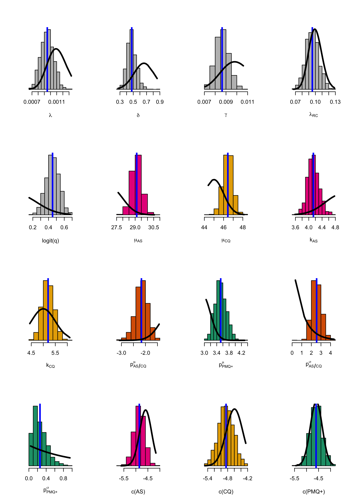<!-- -->

### Posterior summaries of parameters

Model 2 posterior median values with 95% CIs:

```r
writeLines(sprintf('lambda: %s [%s;%s]', round(median(thetas_mod2$lambda),5),
                   round(quantile(thetas_mod2$lambda, 0.025),5),
                   round(quantile(thetas_mod2$lambda, 0.975),5)))
```

```
## lambda: 0.00095 [0.00077;0.00115]
```

```r
writeLines(sprintf('delta: %s [%s;%s]', round(median(thetas_mod2$rate_decrease),2),
                   round(quantile(thetas_mod2$rate_decrease, 0.025),2),
                   round(quantile(thetas_mod2$rate_decrease, 0.975),2)))
```

```
## delta: 0.47 [0.36;0.63]
```

```r
writeLines(sprintf('gamma: %s [%s;%s]', round(median(thetas_mod2$gamma),4),
                   round(quantile(thetas_mod2$gamma, 0.025),4),
                   round(quantile(thetas_mod2$gamma, 0.975),4)))
```

```
## gamma: 0.0086 [0.0075;0.0099]
```

```r
writeLines(sprintf('lambda_RC: %s [%s;%s]', round(median(thetas_mod2$lambda_recrud),3),
                   round(quantile(thetas_mod2$lambda_recrud, 0.025),3),
                   round(quantile(thetas_mod2$lambda_recrud, 0.975),3)))
```

```
## lambda_RC: 0.095 [0.077;0.115]
```

```r
writeLines(sprintf('logit(q): %s [%s;%s]', round(median(thetas_mod2$logit_EarlyL),2),
                   round(quantile(thetas_mod2$logit_EarlyL, 0.025),2),
                   round(quantile(thetas_mod2$logit_EarlyL, 0.975),2)))
```

```
## logit(q): 0.45 [0.29;0.61]
```

```r
writeLines(sprintf('mu_AS: %s [%s;%s]', round(median(thetas_mod2$AS_scale),0),
                   round(quantile(thetas_mod2$AS_scale, 0.025),0),
                   round(quantile(thetas_mod2$AS_scale, 0.975),0)))
```

```
## mu_AS: 29 [28;30]
```

```r
writeLines(sprintf('mu_CQ: %s [%s;%s]', round(median(thetas_mod2$CQ_scale),0),
                   round(quantile(thetas_mod2$CQ_scale, 0.025),0),
                   round(quantile(thetas_mod2$CQ_scale, 0.975),0)))
```

```
## mu_CQ: 46 [45;47]
```

```r
writeLines(sprintf('k_AS: %s [%s;%s]', round(median(thetas_mod2$AS_shape),1),
                   round(quantile(thetas_mod2$AS_shape, 0.025),1),
                   round(quantile(thetas_mod2$AS_shape, 0.975),1)))
```

```
## k_AS: 4.1 [3.8;4.5]
```

```r
writeLines(sprintf('k_CQ: %s [%s;%s]', round(median(thetas_mod2$CQ_shape),1),
                   round(quantile(thetas_mod2$CQ_shape, 0.025),1),
                   round(quantile(thetas_mod2$CQ_shape, 0.975),1)))
```

```
## k_CQ: 5.2 [4.8;5.7]
```

```r
writeLines(sprintf('p_n: %s [%s;%s]', round(median(apply(thetas_mod2$logit_p,1,median)),1),
                   round(median(apply(thetas_mod2$logit_p,1,quantile, probs=0)),1),
                   round(median(apply(thetas_mod2$logit_p,1,quantile, probs=1)),1)))
```

```
## p_n: -2.3 [-9.8;5.2]
```

```r
writeLines(sprintf('pPMQ_n: %s [%s;%s]', round(median(apply(thetas_mod2$logit_p_PMQ,1,median)),1),
                   round(median(apply(thetas_mod2$logit_p_PMQ,1,quantile, probs=0)),1),
                   round(median(apply(thetas_mod2$logit_p_PMQ,1,quantile, probs=1)),1)))
```

```
## pPMQ_n: 3.5 [2.8;4.2]
```

```r
writeLines(sprintf('p^mu_AS/CQ: %s [%s;%s]', round(median(thetas_mod2$logit_mean_p),1),
                   round(quantile(thetas_mod2$logit_mean_p, 0.025),1),
                   round(quantile(thetas_mod2$logit_mean_p, 0.975),1)))
```

```
## p^mu_AS/CQ: -2.2 [-2.7;-1.7]
```

```r
writeLines(sprintf('p^mu_PMQ: %s [%s;%s]', round(median(thetas_mod2$logit_mean_p_PMQ),1),
                   round(quantile(thetas_mod2$logit_mean_p_PMQ, 0.025),1),
                   round(quantile(thetas_mod2$logit_mean_p_PMQ, 0.975),1)))
```

```
## p^mu_PMQ: 3.5 [3.2;3.9]
```

```r
writeLines(sprintf('p^sigma_AS/CQ: %s [%s;%s]', round(median(thetas_mod2$logit_sd_p),1),
                   round(quantile(thetas_mod2$logit_sd_p, 0.025),1),
                   round(quantile(thetas_mod2$logit_sd_p, 0.975),1)))
```

```
## p^sigma_AS/CQ: 2.5 [1.7;3.6]
```

```r
writeLines(sprintf('p^sigma_PMQ: %s [%s;%s]', round(median(thetas_mod2$logit_sd_p_PMQ),1),
                   round(quantile(thetas_mod2$logit_sd_p_PMQ, 0.025),1),
                   round(quantile(thetas_mod2$logit_sd_p_PMQ, 0.975),1)))
```

```
## p^sigma_PMQ: 0.2 [0.1;0.7]
```

```r
writeLines(sprintf('c1_AS: %s [%s;%s]', round(median(thetas_mod2$logit_c1_AS),1),
                   round(quantile(thetas_mod2$logit_c1_AS, 0.025),1),
                   round(quantile(thetas_mod2$logit_c1_AS, 0.975),1)))
```

```
## c1_AS: -4.9 [-5.3;-4.4]
```

```r
writeLines(sprintf('c1_CQ: %s [%s;%s]', round(median(thetas_mod2$logit_c1_CQ),1),
                   round(quantile(thetas_mod2$logit_c1_CQ, 0.025),1),
                   round(quantile(thetas_mod2$logit_c1_CQ, 0.975),1)))
```

```
## c1_CQ: -4.8 [-5.3;-4.4]
```

```r
writeLines(sprintf('c1_PMQ: %s [%s;%s]', round(median(thetas_mod2$logit_c1_CQ_PMQ),1),
                   round(quantile(thetas_mod2$logit_c1_CQ_PMQ, 0.025),1),
                   round(quantile(thetas_mod2$logit_c1_CQ_PMQ, 0.975),1)))
```

```
## c1_PMQ: -4.6 [-5.1;-4.1]
```


# Interpretation of results

The cumulative probability of time to relapse. We draw from the posterior distribution to get a predicted time to relapse (in those who will relapse before they are reinfected).


```r
thetas_mod2 = extract(mod2_Fit)
K = 500000
Early_relapse = sample(x = inv.logit(thetas_mod2$logit_EarlyL),replace = T, size = K) 
Mixture = sapply(Early_relapse, FUN = function(x){
  sample(x = 1:2, replace = T, size = 1 , prob = c(x,1-x))
})
# Artesunate mono-therapy
T1s = rweibull(n = K, shape = sample(x = thetas_mod2$AS_shape, size = K, replace = T),
               scale = sample(x = thetas_mod2$AS_scale, size = K, replace = T))
T2s = rexp(n = K, rate =  sample(x = thetas_mod2$gamma, size = K, replace = T))
Times_RelapseAS = c(T1s[Mixture==1], T2s[Mixture==2])
```


```r
par(mfrow=c(1,2), las=1)

# Chloroquine mono-therapy
T1s = rweibull(n = K, shape = sample(x = thetas_mod2$CQ_shape, size = K, replace = T),
               scale = sample(x = thetas_mod2$CQ_scale, size = K, replace = T))
T2s = rexp(n = K, rate =  sample(x = thetas_mod2$gamma, size = K, replace = T))
Times_RelapseCQ = c(T1s[Mixture==1], T2s[Mixture==2])

hist(Times_RelapseAS, breaks = seq(0,7000, by=7), xlim=c(0,100),
     main='', col=drug_cols3['AS'], density = 15, yaxt='n',ylab = '',
     xlab='Months after treatment', xaxt='n')
hist(Times_RelapseCQ, breaks = seq(0,7000, by=7), xlim=c(0,100), 
     main='', add=T, density=15, col=drug_cols3['CHQ'], angle= -30)
axis(1, at = seq(0,90, by=30), labels =  seq(0,90, by=30)/30)
legend('topright', col=drug_cols3[1:2], lwd=3,bty='n',
       legend = c('Artesunate','Chloroquine'))

plot(ecdf(Times_RelapseAS[Times_RelapseAS<360]), 
     col=drug_cols3['AS'], xaxt='n',main='',
     xlab='Months after treatment', bty='n', yaxt='n',
     ylab = 'Relapses observed (%)', lwd=3, lty=1)
axis(2, at = c(0,.25,.5,.75,.9,1), 
     labels = 100*c(0,.25,.5,.75,.9,1))
axis(1, at = seq(0,360, by=60), labels =  seq(0,360, by=60)/30)
lines(ecdf(Times_RelapseCQ[Times_RelapseCQ<360]), 
      col=drug_cols3['CHQ'], lwd=3, lty=1)
axis(1, at = seq(0,360, by=60), labels =  seq(0,360, by=60)/30)
abline(h=.9, lwd=2, lty=2)
abline(v=4*30, lwd=2, lty=2)
```

<!-- -->


```r
# Now we compute the fixed effect probabilities over time
Ts = 1:360
# AS
prob_labels_raw_AS = array(dim = c(4,length(Ts)))
# Reinfection
prob_labels_raw_AS[1,] = 
  exp(mean(thetas_mod2$log_p))*
  dexp(Ts, rate = mean(thetas_mod2$lambda));
# Early Relapse
prob_labels_raw_AS[2,] = 
  exp(mean(thetas_mod2$log_1m_p))*
  exp(mean(thetas_mod2$log_1m_c1_AS))*
  exp(mean(thetas_mod2$log_EarlyL))*
  dweibull(Ts , shape = mean(thetas_mod2$AS_shape), 
           scale = mean(thetas_mod2$AS_scale))
# Late Relapse
prob_labels_raw_AS[3,] =
  exp(mean(thetas_mod2$log_1m_p))*
  exp(mean(thetas_mod2$log_1m_c1_AS))*
  exp(mean(thetas_mod2$log_1m_EarlyL))*
  dexp(Ts, rate = mean(thetas_mod2$gamma))
# Recrudescence
prob_labels_raw_AS[4,] =
  exp(mean(thetas_mod2$log_1m_p))*
  exp(mean(thetas_mod2$log_c1_AS))*
  dexp(Ts, rate = mean(thetas_mod2$lambda_recrud))

# CQ
prob_labels_raw_CQ = array(dim = c(4,length(Ts)))
# Reinfection
prob_labels_raw_CQ[1,] = 
  exp(mean(thetas_mod2$log_p))*
  dexp(Ts, rate = mean(thetas_mod2$lambda));
# Early Relapse
prob_labels_raw_CQ[2,] =
  exp(mean(thetas_mod2$log_1m_p))*
  exp(mean(thetas_mod2$log_1m_c1_CQ))*
  exp(mean(thetas_mod2$log_EarlyL))*
  dweibull(Ts , shape = mean(thetas_mod2$CQ_shape), 
           scale = mean(thetas_mod2$CQ_scale))
# Late Relapse
prob_labels_raw_CQ[3,] =
  exp(mean(thetas_mod2$log_1m_p))*
  exp(mean(thetas_mod2$log_1m_c1_CQ))*
  exp(mean(thetas_mod2$log_1m_EarlyL))*
  dexp(Ts, rate = mean(thetas_mod2$inv_gamma))
```

```
## Warning in mean.default(thetas_mod2$inv_gamma): argument is not numeric or
## logical: returning NA
```

```r
# Recrudescence
prob_labels_raw_CQ[4,] =
  exp(mean(thetas_mod2$log_1m_p))*
  exp(mean(thetas_mod2$log_c1_CQ))*
  dexp(Ts, rate = mean(thetas_mod2$lambda_recrud))

# CQ+PMQ
prob_labels_raw_CQPMQ = array(dim = c(4,length(Ts)))
# Reinfection
prob_labels_raw_CQPMQ[1,] = 
  exp(mean(thetas_mod2$log_p_PMQ))*
  dexp(Ts, rate = mean(thetas_mod2$lambda));
# Early Relapse
prob_labels_raw_CQPMQ[2,] =
  exp(mean(thetas_mod2$log_1m_p_PMQ))*
  exp(mean(thetas_mod2$log_1m_c1_CQ_PMQ))*
  exp(mean(thetas_mod2$log_EarlyL))*
  dweibull(Ts , shape = mean(thetas_mod2$CQ_shape), 
           scale = mean(thetas_mod2$CQ_scale))
# Late Relapse
prob_labels_raw_CQPMQ[3,] =
  exp(mean(thetas_mod2$log_1m_p_PMQ))*
  exp(mean(thetas_mod2$log_1m_c1_CQ_PMQ))*
  exp(mean(thetas_mod2$log_1m_EarlyL))*
  dexp(Ts, rate = mean(thetas_mod2$gamma))
# Recrudescence
prob_labels_raw_CQPMQ[4,] =
  exp(mean(thetas_mod2$log_1m_p_PMQ))*
  exp(mean(thetas_mod2$log_c1_CQ_PMQ))*
  dexp(Ts, rate = mean(thetas_mod2$lambda_recrud))

for(i in 1:length(Ts)){
  prob_labels_raw_AS[,i] = prob_labels_raw_AS[,i]/sum(prob_labels_raw_AS[,i])
  prob_labels_raw_CQ[,i] = prob_labels_raw_CQ[,i]/sum(prob_labels_raw_CQ[,i])
  prob_labels_raw_CQPMQ[,i] = prob_labels_raw_CQPMQ[,i]/sum(prob_labels_raw_CQPMQ[,i])
}
```


Function to compute the conditional probability of each label given the time to event.

```r
Label_probability = function(drug,t, thetas){
  
  # drug independent parameters
  q = inv.logit(mean(thetas$logit_EarlyL))
  
  if(drug == 'AS'){
    p = inv.logit(mean(thetas$logit_p))
    c = inv.logit(mean(thetas$logit_c1_AS))
    
    p_relapse = (1-p) * (1-c) * (q * dexp(x = t, rate = mean(thetas$gamma)) +
                                   (1-q) * dweibull(x = t,shape = mean(thetas$AS_shape),
                                                    scale = mean(thetas$AS_scale)))
    
    p_recrudes = (1-p) * c * dexp(x = t,rate = mean(thetas$lambda_recrud))
    
    p_reinfect = p * dexp(x = t,rate = mean(thetas$lambda))
  }
  if(drug == 'CHQ'){
    p = inv.logit(mean(thetas$logit_p))
    c = inv.logit(mean(thetas$logit_c1_CQ))
    
    p_relapse = (1-p) * (1-c) * (q * dexp(x = t, rate = mean(thetas$gamma)) +
                                   (1-q) * dweibull(x = t,shape = mean(thetas$CQ_shape),
                                                    scale = mean(thetas$CQ_scale)))
    
    p_recrudes = (1-p) * c * dexp(x = t,rate = mean(thetas$lambda_recrud))
    
    p_reinfect = p * dexp(x = t,rate = mean(thetas$lambda))
    
  }
  if(drug == 'PMQ+'){
    p = inv.logit(mean(thetas$logit_p_PMQ))
    c = inv.logit(mean(thetas$logit_c1_CQ_PMQ))
    
    p_relapse = (1-p) * (1-c) * (q * dexp(x = t, rate = mean(thetas$gamma)) +
                                   (1-q) * dweibull(x = t,shape = mean(thetas$CQ_shape),
                                                    scale = mean(thetas$CQ_scale)))
    
    p_recrudes = (1-p) * c * dexp(x = t,rate = mean(thetas$lambda_recrud))
    
    p_reinfect = p * dexp(x = t,rate = mean(thetas$lambda))
    
  }
  probs = data.frame(p_relapse=p_relapse,p_recrudes=p_recrudes,p_reinfect=p_reinfect)
  for(i in 1:nrow(probs)){
    probs[i,] = probs[i,]/sum(probs[i,])
  }
  
  return(probs)
}
```


```r
labels2 = extract(mod2_Fit, 'prob_labels')$prob_labels

layout(mat = matrix(data = c(1,1,2,2,1,1,2,2,3,3,4,5,3,3,4,5),byrow = T,nrow = 4))
par(las=1,bty='n', cex.lab=1.3, cex.axis=1.3, mar=c(4,5,3,1), family = 'serif')

#****************************** Relapse **********************************
mean_labels_ReLap1= apply(labels2[,ind_plotting,2,drop=T], 2, mean)
mean_labels_ReLap2= apply(labels2[,ind_plotting,3,drop=T], 2, mean)
mean_labels_ReLap = mean_labels_ReLap1 + mean_labels_ReLap2
plot(Combined_Time_Data$Time_to_event[ind_plotting], log10(mean_labels_ReLap),
     col = drug_cols3[Combined_Time_Data$numeric_drug[ind_plotting]+1], xaxt='n',
     pch = mapvalues(x = Combined_Time_Data$Study_Period[ind_plotting],
                     from = 1:2,to = c(20,18)), 
     cex=1,panel.first = grid(),
     ylab='',yaxt='n',
     xlab='', xlim=c(0,360))
mtext(text='A: Relapse', side = 3, adj = 0, line=0.5)
mtext(text = 'Probability',side = 2,line=3.5,cex=.8,las=3)
axis(side=2, at = -2:0, c(expression(10^-2, 10^-1),1))
axis(1, at = seq(0, 360, by=60), labels = seq(0, 360, by=60)/30)
axis(2, at = log10(seq(.1,1,by=.1)), labels = NA)
axis(2, at = log10(seq(.01,.1,by=.01)), labels = NA)
mtext(text = 'Months from last episode',side = 1,line=3,cex=.9)

# lines(Ts, log10(prob_labels_raw_AS[2,]+prob_labels_raw_AS[3,]), col=drug_cols3[1], lwd=2, lty=2)
# lines(Ts, log10(prob_labels_raw_CQ[2,]+prob_labels_raw_CQ[3,]), col=drug_cols3[2], lwd=2, lty=2)
# lines(Ts, log10(prob_labels_raw_CQPMQ[2,]+prob_labels_raw_CQPMQ[3,]), col=drug_cols3[3], lwd=2, lty=2)


#****************************** Recrudescence ****************************
mean_labels_ReCrud = apply(labels2[,ind_plotting,4,drop=T], 2, mean)
plot(Combined_Time_Data$Time_to_event[ind_plotting], log10(mean_labels_ReCrud),
     col = drug_cols3[Combined_Time_Data$numeric_drug[ind_plotting]+1], xaxt='n',
     pch = mapvalues(x = Combined_Time_Data$Study_Period[ind_plotting],
                     from = 1:2,to = c(20,18)), 
     cex=1,panel.first = grid(),
     ylab='',yaxt='n',
     xlab='', xlim=c(0,360), ylim= c(min(log10(mean_labels_ReCrud)),0))
mtext(text='B: Recrudescence', side = 3, adj = 0, line=0.5)
mtext(text = 'Months from last episode',side = 1,line=3,cex=.9)
mtext(text = 'Probability',side = 2,line=3.5,cex=.8,las=3)
axis(1, at = seq(0,12,by=2)*30, labels = seq(0,12,by=2))
axis(side=2, at = c(-14, -12,-10,-8,-6,-4,-2,0), 
     c(expression(10^-14,10^-12, 10^-10, 10^-8, 10^-6, 10^-4, 10^-2),1))

# lines(Ts, log10(prob_labels_raw_AS[4,]), col=drug_cols3[1], lwd=2, lty=2)
# lines(Ts, log10(prob_labels_raw_CQ[4,]), col=drug_cols3[2], lwd=2, lty=2)
# lines(Ts, log10(prob_labels_raw_CQPMQ[4,]), col=drug_cols3[3], lwd=2, lty=2)


#****************************** Reinfection ******************************
mean_labels_Reinfection = apply(labels2[,ind_plotting,1,drop=T], 2, mean)
plot(Combined_Time_Data$Time_to_event[ind_plotting], log10(mean_labels_Reinfection),
     col = drug_cols3[Combined_Time_Data$numeric_drug[ind_plotting]+1],
     pch = mapvalues(x = Combined_Time_Data$Study_Period[ind_plotting],
                     from = 1:2,to = c(20,18)), 
     cex=1,panel.first = grid(),
     ylab='', yaxt='n',xaxt='n',
     xlab='', xlim=c(0,360))
mtext(text = 'Probability',side = 2, las=3,line=3.5,cex=.8)
mtext(text = 'Months from last episode',side = 1,line=3,cex=.9)
mtext(text='C: Reinfection', side = 3, adj = 0, line=0.5)
axis(1, at = seq(0, 360, by=60), labels = seq(0, 360, by=60)/30)
axis(side=2, at = c(-3,-2,-1,0), c(expression(10^-3, 10^-2, 10^-1),1))
axis(2, at = log10(seq(.1,1,by=.1)), labels = NA)
axis(2, at = log10(seq(.01,.1,by=.01)), labels = NA)
axis(2, at = log10(seq(.001,.01,by=.001)), labels = NA)
legend('bottomright',legend = c('Artesunate',
                                'Chloroquine',
                                'Primaquine+'),
       col=drug_cols3,pch = 20, bty='o',lwd=2,bg='white',
       family('serif'), inset = 0.01, lty=NA, cex=1.35)

# lines(Ts, log10(prob_labels_raw_AS[1,]), col=drug_cols3[1], lwd=2, lty=2)
# lines(Ts, log10(prob_labels_raw_CQ[1,]), col=drug_cols3[2], lwd=2, lty=2)
# lines(Ts, log10(prob_labels_raw_CQPMQ[1,]), col=drug_cols3[3], lwd=2, lty=2)


#******************** Plot of overall probability conditional on time to event ***********************
Recurrence_cols_PMQ = brewer.pal(4,'Greens')[2:4]
Recurrence_cols_noPMQ = brewer.pal(4,'Oranges')[2:4]

LinesTypes = c(1,3,2)
par(cex.lab=.7, cex.axis=.75)
t_points = seq(0,360,by=1)/30
PMQ_labels = Label_probability(drug = 'PMQ+',t = t_points*30, thetas = thetas_mod2)
plot(t_points, PMQ_labels[,1], lwd=2, type='l', ylim = c(0,1),
     main = 'PMQ+', col=Recurrence_cols_PMQ[1],panel.first = grid(), 
     xlab='', ylab='Recurrence probability',yaxt='n',xaxt='n',lty=LinesTypes[1])
lines(t_points, PMQ_labels[,2], lwd=2,col=Recurrence_cols_PMQ[2],lty=LinesTypes[2])
lines(t_points, PMQ_labels[,3], lwd=2,col=Recurrence_cols_PMQ[3],lty=LinesTypes[3])
mtext(text='D', side = 3, adj = 0, line=0.5)
mtext(text = 'Months from last episode',side = 1,line=3,cex=.65)
axis(2, at = c(0,.25,.5,.75,1))
axis(1, at = c(0,3,6,9,12))

CQ_labels = Label_probability(drug = 'CHQ',t = t_points*30, thetas = thetas_mod2)
plot(t_points, CQ_labels[,1], lwd=2, type='l', ylim = c(0,1),
     main = 'CQ', col=Recurrence_cols_noPMQ[1],xlab='',lty=LinesTypes[1],
     panel.first = grid(), ylab = 'Recurrence probability',xaxt='n',yaxt='n')
axis(2, at = c(0,.25,.5,.75,1))
axis(1, at = c(0,3,6,9,12))
lines(t_points, CQ_labels[,2], lwd=2,col=Recurrence_cols_noPMQ[2],lty=LinesTypes[2])
lines(t_points, CQ_labels[,3], lwd=2,col=Recurrence_cols_noPMQ[3],lty=LinesTypes[3])
mtext(text = 'Months from last episode',side = 1,line=3,cex=.65)
legend('right',legend = c('Relapse',
                          'Recrudescence',
                          'Reinfection'),
       col='black',pch = NA, bty='o',
       lwd=1,bg='white',lty=LinesTypes, cex=.6,
       inset = 0.01)
```

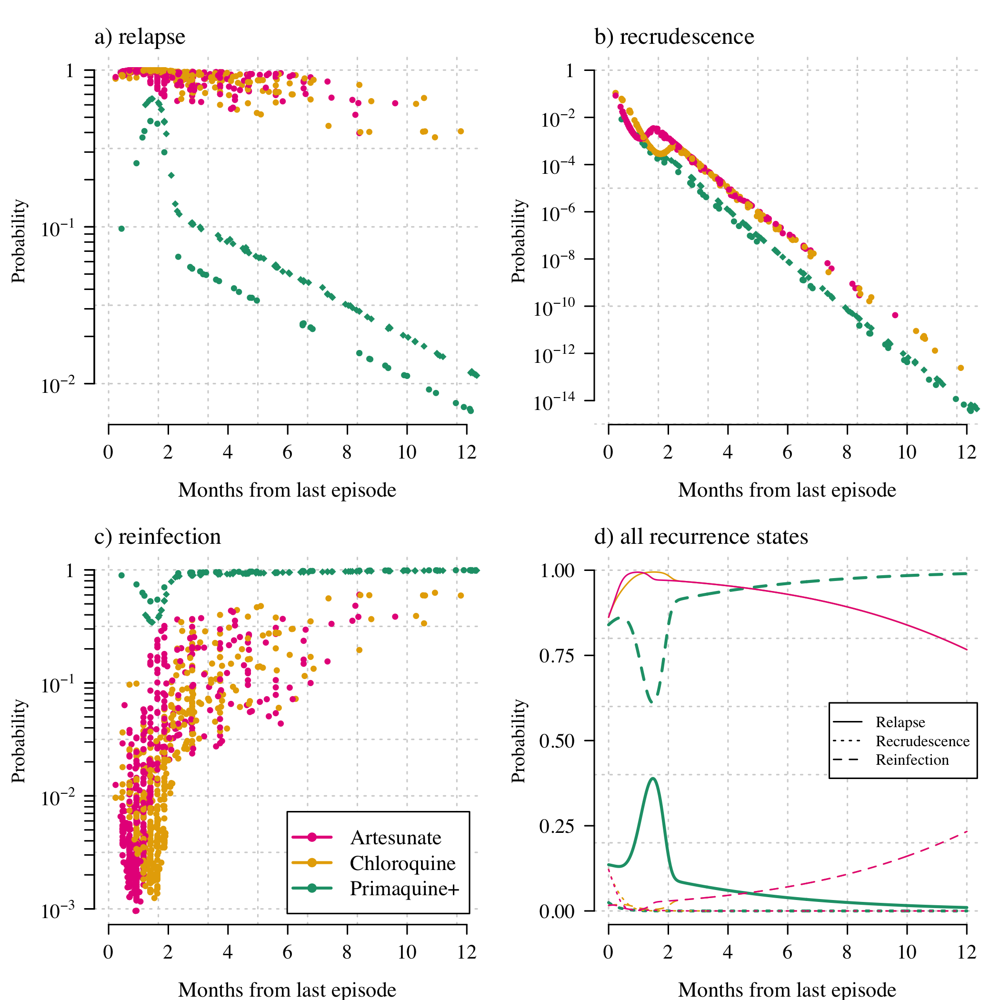<!-- -->


# Extract probabilistic information


```r
labels = extract(mod2_Fit, 'prob_labels')$prob_labels
# recrudescence
Combined_Time_Data$Recrudescence_mean_theta = apply(labels[,,4,drop=T],2,median)
Combined_Time_Data$Recrudescence_975_theta = apply(labels[,,4,drop=T],2,quantile, 
                                                   probs = 0.975)
Combined_Time_Data$Recrudescence_025_theta = apply(labels[,,4,drop=T],2,quantile, 
                                                   probs = 0.025)

# relapse
Relapse_labels = labels[,,2,drop=T] + labels[,,3,drop=T]
Combined_Time_Data$Relapse_mean_theta = apply(Relapse_labels,2,median)
Combined_Time_Data$Relapse_975_theta = apply(Relapse_labels,2,quantile, probs = 0.975)
Combined_Time_Data$Relapse_025_theta = apply(Relapse_labels,2,quantile, probs = 0.025)

# reinfection
Combined_Time_Data$ReInfection_mean_theta = apply(labels[,,1,drop=T],2,median)
Combined_Time_Data$ReInfection_975_theta = apply(labels[,,1,drop=T],2,quantile, 
                                                 probs = 0.975)
Combined_Time_Data$ReInfection_025_theta = apply(labels[,,1,drop=T],2,quantile, 
                                                 probs = 0.025)

# Save this for use by the genetic model
Mod2_ThetaEstimates = Combined_Time_Data
Mod2_ThetaEstimates$episode = as.integer(Mod2_ThetaEstimates$episode)
Mod2_ThetaEstimates$episode = Mod2_ThetaEstimates$episode
Mod2_ThetaEstimates$patientid = as.character(Mod2_ThetaEstimates$patientid)
Mod2_ThetaEstimates$Episode_Identifier = 
  apply(Mod2_ThetaEstimates,
        1, 
        function(x) {
          paste(x['patientid'], as.integer(x['episode']), sep = '_')
        } )
save(Mod2_ThetaEstimates, file = '../RData/TimingModel/MOD2_theta_estimates.RData')
```

We also save a matrix of posterior samples to be used by the genetic model for full computation of the posterior:

```r
labels = extract(mod2_Fit, 'prob_labels')$prob_labels
K_samples = min(100, dim(labels)[1])
random_ind = sample(1:dim(labels)[1], K_samples)
Relapse_labels = labels[random_ind,,2,drop=T] + labels[random_ind,,3,drop=T]
Post_samples_matrix = data.frame(cbind(t(labels[random_ind, ,4,drop=T]),
                                       t(Relapse_labels[, ]),
                                       t(labels[random_ind, ,1,drop=T])))
colnames(Post_samples_matrix) = c(sapply(c('C','L','I'), rep, K_samples))
Post_samples_matrix$Episode_Identifier = apply(Combined_Time_Data, 1, 
                                               function(x) {
                                                 paste(x['patientid'], as.integer(x['episode']), 
                                                       sep = '_')} )
save(Post_samples_matrix, file = '../RData/TimingModel/MOD2_Posterior_samples.RData')
```


```r
## Threshold value for classification
Epsilon_upper = 0.7
Epsilon_lower = 0.3

transp_grey = adjustcolor('grey', alpha.f = 0.5)
transparent_pink_band = adjustcolor(Dark2[4], alpha.f = 0.2)

# Order by difference in posterior interval
Combined_Time_Data = Combined_Time_Data[order(-log10(Combined_Time_Data$Relapse_mean_theta)),]

par(las = 1, bty='n', family = 'serif')
layout(mat= matrix(data = c(1,2,3,3),nrow = 2,byrow = T))
## No PMQ group
ind = Combined_Time_Data$arm_num!='CHQ/PMQ' & !Combined_Time_Data$Censored
plot(log10(Combined_Time_Data$Relapse_mean_theta[ind]), 
     ylim = c(min(log10(Combined_Time_Data$Relapse_025_theta[ind]),na.rm = T), 0),
     type='p',yaxt='n', main ='No PMQ',pch=20,cex=.3,
     ylab = 'Probability of relapse', xlab = '',panel.first = grid(),
     col = drug_cols3[Combined_Time_Data$arm_num[ind]], xaxt='n')
Nrecs = length(Combined_Time_Data$Relapse_mean_theta[ind])
polygon(x = c(0,Nrecs,Nrecs,0),
        y = log10(c(Epsilon_lower,Epsilon_lower,Epsilon_upper,Epsilon_upper)),
        col = transparent_pink_band, border = NA)
axis(1, at = c(1, 400, 800, 1200))
mtext(text = 'Recurrence rank',side = 1, line = 3)
axis(2, at = c(0:(-2),log10(0.5),log10(0.05)), labels = c(10^(0:(-2)),0.5,0.05))
polygon(c(1:sum(ind), rev(1:sum(ind))), 
        y = c(log10(Combined_Time_Data$Relapse_025_theta[ind]),
              rev(log10(Combined_Time_Data$Relapse_975_theta[ind]))), 
        border = NA, col = adjustcolor(drug_cols2[2],alpha.f = 0.2))
legend('bottomleft',legend = c('Artesunate',
                                'Chloroquine',
                                'Primaquine+'),
       col=drug_cols3,pch = 20, bty='o',lwd=2,bg='white',
       family('serif'), inset = 0.03, lty=NA, cex=0.9)


#PMQ group
ind = Combined_Time_Data$arm_num=='CHQ/PMQ' & !Combined_Time_Data$Censored
plot(log10(Combined_Time_Data$Relapse_mean_theta[ind]), 
     ylim = c(min(log10(Combined_Time_Data$Relapse_025_theta[ind])), 0),
     type='p',cex=.3, yaxt='n', xlab = '',col=drug_cols2[3],
     ylab = 'Probability of relapse',panel.first = grid(),
     main = 'PMQ+', pch=20)
Nrecs = length(Combined_Time_Data$Relapse_mean_theta[ind])
polygon(x = c(0,Nrecs,Nrecs,0),
        y = log10(c(Epsilon_lower,Epsilon_lower,Epsilon_upper,Epsilon_upper)),
        col = transparent_pink_band, border = NA)
mtext(text = 'Recurrence rank',side = 1, line = 3)
axis(2, at = c(0:(-2),log10(c(0.5,0.05))), labels = c(10^(0:(-2)),0.5,0.05))
polygon(c(1:sum(ind), rev(1:sum(ind))), 
        y = c(log10(Combined_Time_Data$Relapse_025_theta[ind]),
              rev(log10(Combined_Time_Data$Relapse_975_theta[ind]))), 
        border = NA, col = adjustcolor(drug_cols2[3],alpha.f = 0.2))

#****** Time of event versus uncertainty in the interval ******
# Time of event versus uncertainty in the interval
## No PMQ
ind = Combined_Time_Data$arm_num!='CHQ/PMQ' & !Combined_Time_Data$Censored
df = data.frame(time=Combined_Time_Data$Time_to_event[ind],
                uncertainty=log10(Combined_Time_Data$Relapse_975_theta[ind]) -
                  log10(Combined_Time_Data$Relapse_025_theta[ind]), 
                col = drug_cols3[Combined_Time_Data$arm_num[ind]], group=1)
ind = Combined_Time_Data$arm_num=='CHQ/PMQ' & !Combined_Time_Data$Censored
df = rbind(df, data.frame(time=Combined_Time_Data$Time_to_event[ind],
                uncertainty=log10(Combined_Time_Data$Relapse_975_theta[ind]) -
                  log10(Combined_Time_Data$Relapse_025_theta[ind]),
                col = drug_cols3[Combined_Time_Data$arm_num[ind]], group=2))
# permute the rows for better visualisation
set.seed(653467)
df = df[sample(1:nrow(df), size = nrow(df), replace = F),]

plot(df$time,df$uncertainty,  xaxt='n',
     ylab = expression('Log'[10]*' uncertainty'), panel.first = grid(),
     col = df$col,pch=20, xlab='', main = '')
axis(1, at = seq(0,360, by = 60), labels = seq(0,360,by=60)/30)
mtext(text = 'Months from last episode',side = 1, line = 3)

# add spline fits to show trends
f = loess(uncertainty ~ time, df[df$group==2,], span = .32)
lines((0:400), predict(f, data.frame(time=0:400)),lwd=2,lty=2, col = drug_cols2['CHQ/PMQ'])

f = loess(uncertainty ~ time, df[df$group==1,])
lines(0:400, predict(f, data.frame(time=0:400)),lwd=2,lty=2, col = drug_cols2['AS'])
```

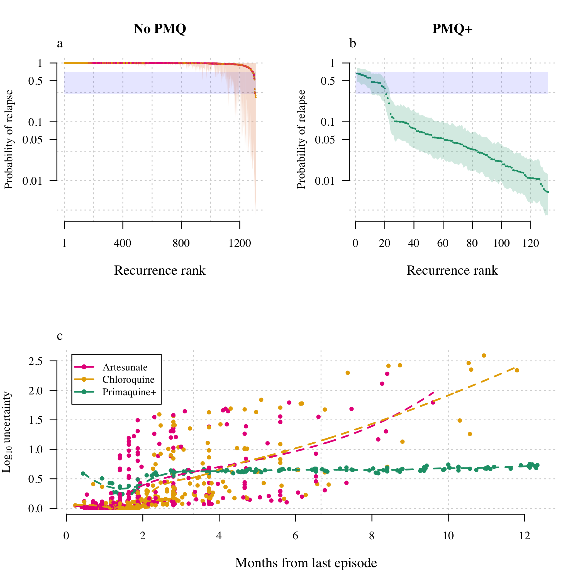<!-- -->

Some rough calculations to make sure we're not completely off track with the model output


```
## No radical cure: episodes per year:  3.97
```

```
## Radical cure: episodes per year:  0.2
```

```
## AS patients had a total follow-up of 161 years and 722 observed recurrences
```

```
## CQ patients had a total follow-up of 169 years and 587 observed recurrences
```

```
## PMQ+ patients had a total follow-up of 677 years and 132 observed recurrences
```

```
## PMQ+ patients in VHX had a total follow-up of 155 years and 40 observed recurrences
```

```
## PMQ+ patients in BPD had a total follow-up of 522 years and 92 observed recurrences
```


We look at weighted averages of relapses, recrudescences and reinfections.
We pick 500 random draws from the posterior to calculate credible intervals.


The labels on the observed recurrences along with 95% credible intervals:


```
## Relapses are approximately  96 ( 94.4 - 97.3 ) % of recurrences after AS
```

```
## Recrudescences are approximately  0.3 ( 0.2 - 0.5 ) % of recurrences after AS
```

```
## Reinfections are approximately  3.7 ( 2.4 - 5.3 ) % of recurrences after AS
```

```
## Relapses are approximately  95 ( 93 - 96.6 ) % of recurrences after CQ
```

```
## Recrudescences are approximately  0.2 ( 0.1 - 0.4 ) % of recurrences after CQ
```

```
## Reinfections are approximately  4.8 ( 3.2 - 6.8 ) % of recurrences after CQ
```

```
## Relapses are approximately  12.2 ( 8.8 - 15.5 ) % of recurrences after PMQ+
```

```
## Recrudescences are approximately  0.01 ( 0.01 - 0.03 ) % of recurrences after PMQ+
```

```
## Reinfections are approximately  87.8 ( 84.5 - 91.2 ) % of recurrences after PMQ+
```

```
## 
## VHX: Relapses are approximately  9.2 ( 6.2 - 12.1 ) % of recurrences after PMQ+
```

```
## VHX: Recrudescences are approximately  0.03 ( 0.02 - 0.06 ) % of recurrences after PMQ+
```

```
## VHX: Reinfections are approximately  90.7 ( 87.9 - 93.7 ) % of recurrences after PMQ+
```

```
## BPD: Relapses are approximately  13.5 ( 9.8 - 17.3 ) % of recurrences after PMQ+
```

```
## BPD: Recrudescences are approximately  0.01 ( 0 - 0.01 ) % of recurrences after PMQ+
```

```
## BPD: Reinfections are approximately  86.5 ( 82.7 - 90.2 ) % of recurrences after PMQ+
```


```r
toc()
```

```
## 31.182 sec elapsed
```
