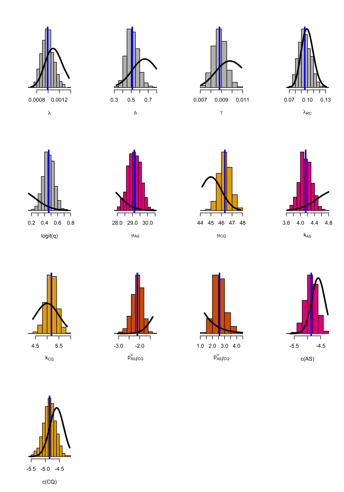

# Preliminaries

Load R packages.


```
## Warning: package 'dplyr' was built under R version 3.4.4
```

```
## 
## Attaching package: 'dplyr'
```

```
## The following objects are masked from 'package:plyr':
## 
##     arrange, count, desc, failwith, id, mutate, rename, summarise,
##     summarize
```

```
## The following objects are masked from 'package:stats':
## 
##     filter, lag
```

```
## The following objects are masked from 'package:base':
## 
##     intersect, setdiff, setequal, union
```

```
## Warning: package 'rstan' was built under R version 3.4.4
```

```
## Loading required package: ggplot2
```

```
## Warning: package 'ggplot2' was built under R version 3.4.4
```

```
## Loading required package: StanHeaders
```

```
## Warning: package 'StanHeaders' was built under R version 3.4.4
```

```
## rstan (Version 2.18.1, GitRev: 2e1f913d3ca3)
```

```
## For execution on a local, multicore CPU with excess RAM we recommend calling
## options(mc.cores = parallel::detectCores()).
## To avoid recompilation of unchanged Stan programs, we recommend calling
## rstan_options(auto_write = TRUE)
```

```
## Loading required package: gdata
```

```
## gdata: read.xls support for 'XLS' (Excel 97-2004) files ENABLED.
```

```
## 
```

```
## gdata: read.xls support for 'XLSX' (Excel 2007+) files ENABLED.
```

```
## 
## Attaching package: 'gdata'
```

```
## The following objects are masked from 'package:dplyr':
## 
##     combine, first, last
```

```
## The following object is masked from 'package:stats':
## 
##     nobs
```

```
## The following object is masked from 'package:utils':
## 
##     object.size
```

```
## The following object is masked from 'package:base':
## 
##     startsWith
```


# Load Stan models


## Model 0

This is the most unrealistic model. We include it to get some idea of how bad it is. Not included in the paper for simplicity.

* ReInfections occur at 'random' (exponential distribution). A random effects term is used to adjust for inter-individual variability in propensity to be reinfected.

* Recrudescences can happen in the first couple of weeks. Relapses happen as described by a Weibull with blood-stage drug dependent parameters.

* Primaquine is assumed to have 100% efficacy.


## Model 1: Mixture of three components


* ReInfections occur at 'random' (exponential distribution).
A random effects term is used to adjust for inter-individual variability in propensity to be reinfected.

* Recrudescences can happen in the first couple of weeks. 

* Relapses are broken into two components. The fast/periodic relapse component happens as described by a Weibull with blood-stage drug dependent parameters (same as in Model 1). The slow/random relapse component is described by an exponential disrtibution.

* Primaquine is assumed to have 100% efficacy.


## Model 2: Mixture of three components and reLapses after PMQ

This is the final model reported in the paper. 

* ReInfections occur at 'random' (exponential distribution).
A random effects term is used to adjust for inter-individual variability in propensity to be reinfected.

* Recrudescences can happen in the first couple of weeks. 

* Relapses are broken into two components (same as in Model 2).

* Primaquine is not assumed to have 100% efficacy and a random effects term describes the propensity to relapse after primaquine.


## Model 3: Adding seasonality

Here we explore whether a seasonality term is useful to explain some reinfections 

The seasonal term is given in units of weeks by $\exp(\beta_1  \sin (\frac{2\pi t}{T} + \beta_1))$ where $T=365/7$ (number of weeeks in the year).
This increases the reinfection mixing proportion $p_{(n)}$ for each drug treatment.

This model is still in development.


# VHX and BPD combined dataset


```r
load('../RData/TimingModel/Combined_Time_Event.RData')
# Get rid of the very short durations 
Combined_Time_Data = filter(Combined_Time_Data, !(Censored > -1 & Time_to_event < 5))
```

```
## Warning: package 'bindrcpp' was built under R version 3.4.4
```

```r
###***** Testing ******##### To be removed
#Combined_Time_Data = filter(Combined_Time_Data, Censored == -1)

# This is so that stan can compute the seasonality factor (can't handle missing values)
Combined_Time_Data$WeekTime[is.na(Combined_Time_Data$WeekTime)]=0

# deal with non-integer ids
Combined_Time_Data$patientid = factor(Combined_Time_Data$patientid)
# create a mapping from the factor to integer
map = mapLevels(x=Combined_Time_Data$patientid)
# Convert ID to integer
Combined_Time_Data$ID = as.integer(Combined_Time_Data$patientid)
Combined_Time_Data = arrange(Combined_Time_Data, ID, episode)
# We sort the ids so that ids go from 1...N
ids = unique(Combined_Time_Data$ID)
N = as.integer(length(ids))


# Turn drug into a numeric vector
Combined_Time_Data$numeric_drug = as.integer(revalue(Combined_Time_Data$arm_num,
                                                     c('AS'='0','CHQ'='1','CHQ/PMQ'='2')))

# Create a vector that maps the nth person to 0 (always received Primaquine) or
noPMQ_ind = which(Combined_Time_Data$arm_num != "CHQ/PMQ")
N_noPMQ = length(unique(Combined_Time_Data$ID[noPMQ_ind])) #number of IDs without PMQ
ID_mapped_to_noPMQ_rank = rep(0, N)

index = 1
for(id in 1:N){
  ind = which(Combined_Time_Data$ID==id)
  if(!2 %in% Combined_Time_Data$numeric_drug[ind]){
    ID_mapped_to_noPMQ_rank[id] = index
    index = index + 1
  }
}

# Create a vector that maps the nth person to 0 (always received Primaquine) or
PMQ_ind = which(Combined_Time_Data$arm_num == "CHQ/PMQ")
N_PMQ = length(unique(Combined_Time_Data$ID[PMQ_ind])) #number of IDs with PMQ
ID_mapped_to_PMQ_rank = rep(0, N)

index = 1
for(id in 1:N){
  ind = which(Combined_Time_Data$ID==id)
  if(2 %in% Combined_Time_Data$numeric_drug[ind]){
    ID_mapped_to_PMQ_rank[id] = index
    index = index + 1
  }
}


ind = !duplicated(Combined_Time_Data$ID)
drug_received = Combined_Time_Data$numeric_drug[ind]
```

# Prior specification


```r
# The hierachical parameters defining the prior distributions for model 1
Prior_params_M0 = list(mu_inv_lambda = 900,
                       sigma_inv_lambda = 100,
                       mu_AS_shape = 3,
                       sigma_AS_shape = 1,
                       mu_AS_scale = 25,
                       sigma_AS_scale = 5,
                       mu_CQ_shape = 3,
                       sigma_CQ_shape = 1,
                       mu_CQ_scale = 42,
                       sigma_CQ_scale = 5,
                       Hyper_logit_mean_p = -3,
                       Hyper_logit_sd_p = .25,
                       Hyper_logit_c1_mean = -3,
                       Hyper_logit_c1_sd = .25,
                       Hyper_logit_exp_p = 1)
# Model 1 has the same parameters with a few extra
Prior_params_M1 = c(Prior_params_M0, 
                    Early_L_logit_mean = 0,
                    Early_L_logit_sd = .5,
                    mu_inv_gamma = 120,
                    sigma_inv_gamma = 20)
# Model 2: extra parameters
Prior_params_M2 = c(Prior_params_M1, 
                    Hyper_logit_mean_p_PMQ = 3,
                    Hyper_logit_sd_p_PMQ = .25)
# Model 3: extra parameters
Prior_params_M3 = c(Prior_params_M2,
                    beta_1_mean = 1,
                    beta_1_sigma = 0.25,
                    beta_0_mean = 1,
                    beta_0_sigma = 2)
```

# Run Model

Set up parameters for the MCMC runs.

```r
# remove this once models 1-2 conform with augmented data (including Censored == -1)
Combined_Time_Data = filter(Combined_Time_Data, Censored > -1)
# Choose as many chains as available cores
Chains = 8
options(mc.cores = Chains)
IT = 10^6
WarmUp = .5*IT
thin = 4000

# put the data into stan format
# For model 1 
Time_data_1 =list(N         = N,
                  #Number of individuals
                  Neps      = as.integer(nrow(Combined_Time_Data)),
                  #Number of durations
                  N_noPMQ   = as.integer(N_noPMQ),
                  # Number of individuals who do not recieve PMQ
                  N_PMQ     = as.integer(N_PMQ),
                  # Number of individuals who do not recieve PMQ
                  Durations = as.double(Combined_Time_Data$Time_to_event),
                  #Time to reinfection or time to censoring
                  Censored  = as.integer(Combined_Time_Data$Censored),
                  #If the duration is right censored or not
                  Drug      = Combined_Time_Data$numeric_drug,
                  # drug coded as an integer
                  ID_of_Episode = Combined_Time_Data$ID,
                  # the ID corresponding to each time interval
                  ID_mapped_to_noPMQ_rank = ID_mapped_to_noPMQ_rank
                  # the index mapping PMQ individuals to their rank
)
# For model 2
Time_data_2 =list(N         = N,
                  #Number of individuals
                  Neps      = as.integer(nrow(Combined_Time_Data)),
                  #Number of durations
                  N_noPMQ   = N_noPMQ,
                  # Number of individuals who do not recieve PMQ
                  N_PMQ     = N_PMQ,
                  # Number of individuals who do not recieve PMQ
                  Durations = as.double(Combined_Time_Data$Time_to_event),
                  #Time to reinfection or time to censoring
                  Censored  = as.integer(Combined_Time_Data$Censored),
                  #If the duration is right censored or not
                  Drug      = Combined_Time_Data$numeric_drug,
                  # drug coded as an integer
                  ID_of_Episode   = Combined_Time_Data$ID,
                  # the index of the individual for each time interval
                  ID_mapped_to_noPMQ_rank = ID_mapped_to_noPMQ_rank,
                  # the index mapping no PMQ individuals to their rank
                  ID_mapped_to_PMQ_rank = ID_mapped_to_PMQ_rank
                  # the index mapping PMQ individuals to their rank
)
# For model 3
Time_data_3 =list(N         = N,
                  #Number of individuals
                  Neps      = as.integer(nrow(Combined_Time_Data)),
                  #Number of durations
                  N_noPMQ   = as.integer(N_noPMQ),
                  # Number of individuals who do not recieve PMQ
                  N_PMQ     = as.integer(N_PMQ),
                  # Number of individuals who do not recieve PMQ
                  Durations = as.double(Combined_Time_Data$Time_to_event),
                  #Time to reinfection or time to censoring
                  Censored  = as.integer(Combined_Time_Data$Censored),
                  #If the duration is right censored or not
                  WeekTime  = as.double(Combined_Time_Data$WeekTime),
                  #Time of year in units of weeks
                  Drug      = as.integer(Combined_Time_Data$numeric_drug),
                  # drug coded as an integer
                  ID_of_Episode   = Combined_Time_Data$ID,
                  # the index of the individual for each time interval
                  ID_mapped_to_noPMQ_rank = as.integer(ID_mapped_to_noPMQ_rank),
                  # the index mapping no PMQ individuals to their rank
                  ID_mapped_to_PMQ_rank = as.integer(ID_mapped_to_PMQ_rank),
                  # the index mapping PMQ individuals to their rank
                  Nweeks = as.double(365/7) 
)
```

Run with X parallel chains. This depends on local computing power.


```r
if(RUN_MODELS){
  # mod0_Fit = sampling(Timing_Model0,
  #                    data = c(Time_data_1, Prior_params_M1),
  #                    iter = IT, warmup = WarmUp,
  #                    chains=Chains, thin = thin)
  # save(mod0_Fit, file = 'OutputResults/StanModels_mod0.RData')
  # 
  mod1_Fit = sampling(Timing_Model1,
                      data = c(Time_data_1, Prior_params_M1),
                      iter = IT, warmup = WarmUp,
                      chains=Chains, thin = thin)
  save(mod1_Fit, file = 'OutputResults/StanModels_mod1.RData')
  
  mod2_Fit = sampling(Timing_Model2,
                      data = c(Time_data_2, Prior_params_M2),
                      iter = IT, warmup = WarmUp,
                      chains=Chains, thin = thin)
  save(mod2_Fit, file = 'OutputResults/StanModels_mod2.RData')
  
  # mod3_Fit = sampling(Timing_Model3,
  #                     data = c(Time_data_3, Prior_params_M3),
  #                     iter = IT, warmup = WarmUp,
  #                     chains=Chains, thin = thin)
  # save(mod3_Fit, file = 'OutputResults/StanModels_mod3.RData')
}
# load('OutputResults/StanModels_mod1.RData')
load('OutputResults/StanModels_mod1.RData')
load('OutputResults/StanModels_mod2.RData')
```

# Plot output


Let's make some nice colors for the plotting

```r
# Colour scheme
# Previous Set1 not colourblind friendly: display.brewer.all(colorblindFriendly = T)
Dark2 = brewer.pal(8, 'Dark2')
Set2 = brewer.pal(8, 'Set2')

drug_cols3 = array(Dark2[c(4,6,1)], dim = 3, dimnames = list(c('AS','CHQ','CHQ/PMQ'))) 
drug_cols2 = array(Dark2[c(2,2,1)], dim = 3, dimnames = list(c('AS','CHQ','CHQ/PMQ')))
drug_cols_light2 = array(Set2[c(2,2,1)], dim = 3, dimnames = list(c('AS','CHQ','CHQ/PMQ')))

# Vector of states
states = c(relapse = 'L', reinfection = 'I', recrudescence = 'C')

#mycols = brewer.pal(n=3, name = 'Set1')
# Do we include censored time intervals in the plots:
PLOT_Censored_Obs = F
if(PLOT_Censored_Obs){
  ind_plotting = which(Combined_Time_Data$Censored > -1)
} else {
  ind_plotting = which(Combined_Time_Data$Censored == 0)
}
```


## Model 0

Not included in analysis - mainly here as a base model to help debugging.


```r
# # Traceplots
# traceplot(mod0_Fit,c('AS_shape', 'CQ_shape', 'AS_scale', 'CQ_scale'))
# traceplot(mod0_Fit, c('inv_lambda','logit_c1','Recrud_shape','Recrud_scale'))
# traceplot(mod0_Fit, c('logit_mean_p','logit_sd_p'))
# 
# # Extract samples
# thetas_mod2 = extract(mod0_Fit)
# 
# par(las=1, mfrow=c(1,2))
# hist(thetas_mod2$inv_lambda, main='Mean time to reinfection',
#      xlab='1/lambda (days)')
# hist(inv.logit(apply(thetas_mod2$logit_p,2,mean)),
#      main = 'proportion of reInfections', xlab='p')
# 
# par(las=1, mfrow=c(1,1))
# # Plot the outcome of the predicted labels
# #****************************** Reinfection ******************************
# labels = extract(mod0_Fit, 'prob_labels')$prob_labels
# mean_labels_Reinfection = apply(labels[,ind_plotting,1,drop=T], 2, mean)
# plot(Combined_Time_Data$Time_to_event[ind_plotting], log10(mean_labels_Reinfection),
#      col = mycols[numeric_drug[ind_plotting]+1],
#      pch = as.numeric(Combined_Time_Data$Censored[ind_plotting])+16,
#      ylab='Probability of ReInfection', yaxt='n',xaxt='n',
#      xlab='Months from last episode', xlim=c(0,400))
# axis(1, at = seq(0, 420, by=60), labels = seq(0, 420, by=60)/30)
# axis(2, at = -2:0, labels= 10^(-2:0))
# axis(2, at = log10(seq(.1,1,by=.1)), labels = NA)
# axis(2, at = log10(seq(.01,.1,by=.01)), labels = NA)
# axis(2, at = log10(seq(.001,.01,by=.001)), labels = NA)
# legend('bottomright',legend = c('AS','CQ','CQ+PMQ'),
#        col=c(mycols),pch = c(rep(1,3)), bty='n',lwd=2,lty=NA)
# 
# 
# #****************************** Recrudescence ****************************
# mean_labels_ReCrud = apply(labels[,ind_plotting,3,drop=T], 2, mean)
# plot(Combined_Time_Data$Time_to_event[ind_plotting], mean_labels_ReCrud,
#      col = mycols[numeric_drug[ind_plotting]+1], xaxt='n',
#      pch = as.numeric(Combined_Time_Data$Censored[ind_plotting])+16,
#      ylab='ReCrudescence',
#      xlab='Weeks from last episode', xlim=c(0,30))
# axis(1, at = seq(0,28,by=7), labels = seq(0,28,by=7)/7)
# 
# 
# #****************************** Relapse ****************************
# mean_labels_ReLap = apply(labels[,ind_plotting,2,drop=T], 2, mean)
# plot(Combined_Time_Data$Time_to_event[ind_plotting], log10(mean_labels_ReLap),
#      col = mycols[numeric_drug[ind_plotting]+1], xaxt='n',
#      pch = as.numeric(Combined_Time_Data$Censored[ind_plotting])+16,
#      ylab='log10 Probability of ReLapse',yaxt='n',
#      xlab='Months from last episode', xlim=c(0,100),
#      ylim = c(-10,0))
# axis(1, at = seq(0, 90, by= 30), labels = seq(0, 90, by=30)/30)
# axis(2, at = -2:0, labels= 10^(-2:0))
```

## Model 1


```r
par(las=1)
traceplot(mod1_Fit,c('AS_shape', 'CQ_shape', 'AS_scale', 'CQ_scale'))
```

<!-- -->

```r
traceplot(mod1_Fit, c('inv_lambda','Recrud_shape','Recrud_scale'))
```

<!-- -->

```r
traceplot(mod1_Fit, c('logit_c1_CQ','logit_c1_AS'))
```

<!-- -->

```r
traceplot(mod1_Fit, c('logit_mean_p','logit_sd_p','logit_EarlyL'))
```

<!-- -->

```r
par(mfrow=c(1,2))
thetas_mod1 = extract(mod1_Fit)
#save(thetas_mod1, file = 'OutputResults/thetas_mod1.RData')
hist(thetas_mod1$inv_lambda, main='Mean time to reinfection', xlab='1/lambda (days)')
hist(thetas_mod1$inv_gamma, main='Mean time to late reLapse', xlab='1/gamma (days)')
```

<!-- -->

```r
par(las=1, mfrow=c(2,2))

hist(inv.logit(apply(thetas_mod1$logit_p,2,mean)), xlab = 'Probability reinfection', main = '')
hist(inv.logit(thetas_mod1$logit_c1_AS), xlab = 'proportion recrudescence: AS', main='')
hist(inv.logit(thetas_mod1$logit_c1_CQ), xlab = 'proportion recrudescence: AS', main='')
hist(inv.logit(thetas_mod1$logit_EarlyL), xlab = 'proportion early Relapse', main='')
```

<!-- -->


```r
par(las=1, mfrow=c(1,1))
# Plot the outcome of the predicted labels
#****************************** Reinfection ******************************
labels = extract(mod1_Fit, 'prob_labels')$prob_labels
mean_labels_Reinfection = apply(labels[,ind_plotting,1,drop=T], 2, mean)
plot(Combined_Time_Data$Time_to_event[ind_plotting], log10(mean_labels_Reinfection),
     col = drug_cols3[Combined_Time_Data$numeric_drug[ind_plotting]+1],
     pch = as.numeric(Combined_Time_Data$Censored[ind_plotting])+16,
     ylab='Probability of ReInfection', yaxt='n',xaxt='n',
     xlab='Months from last episode', xlim=c(0,400))
axis(1, at = seq(0, 420, by=60), labels = seq(0, 420, by=60)/30)
axis(2, at = -2:0, labels= 10^(-2:0))
axis(2, at = log10(seq(.1,1,by=.1)), labels = NA)
axis(2, at = log10(seq(.01,.1,by=.01)), labels = NA)
axis(2, at = log10(seq(.001,.01,by=.001)), labels = NA)
legend('bottomright',legend = c('Artesunate','Chloroquine','Chloroquine+\nPrimaquine'),
       col=drug_cols3,pch = rep(1,3), bty='n',lwd=2,lty=NA)
```

<!-- -->

```r
#****************************** Recrudescence ****************************
mean_labels_ReCrud = apply(labels[,ind_plotting,4,drop=T], 2, mean)
plot(Combined_Time_Data$Time_to_event[ind_plotting], log10(mean_labels_ReCrud),
     col = drug_cols3[Combined_Time_Data$numeric_drug[ind_plotting]+1], xaxt='n',
     pch = as.numeric(Combined_Time_Data$Censored[ind_plotting])+16,
     ylab='ReCrudescence',
     xlab='Weeks from last episode', xlim=c(0,60))
axis(1, at = seq(0,54,by=7), labels = seq(0,54,by=7)/7)
```

<!-- -->

```r
#****************************** Relapse ****************************
mean_labels_ReLap1 = apply(labels[,ind_plotting,2,drop=T], 2, mean)
mean_labels_ReLap2 = apply(labels[,ind_plotting,3,drop=T], 2, mean)
mean_labels_ReLap = mean_labels_ReLap1 + mean_labels_ReLap2
plot(Combined_Time_Data$Time_to_event[ind_plotting], mean_labels_ReLap,
     col = drug_cols3[Combined_Time_Data$numeric_drug[ind_plotting]+1], xaxt='n',
     pch = as.numeric(Combined_Time_Data$Censored[ind_plotting])+16,
     ylab='log10 Probability of ReLapse',
     xlab='Months from last episode')
axis(1, at = seq(0, 420, by= 60), labels = seq(0, 420, by=60)/30)
```

<!-- -->

## Model 2

Traceplots and posterior distributions:

```r
traceplot(mod2_Fit,c('AS_shape', 'CQ_shape', 'AS_scale', 'CQ_scale'))
```

<!-- -->

```r
traceplot(mod2_Fit, c('inv_lambda','Recrud_shape','Recrud_scale'))
```

<!-- -->

```r
traceplot(mod2_Fit, c('logit_c1_AS','logit_c1_CQ','logit_c1_CQ_PMQ'))
```

<!-- -->

```r
traceplot(mod2_Fit, c('logit_mean_p','logit_sd_p','logit_EarlyL'))
```

<!-- -->

```r
par(mfrow=c(1,2))
thetas_mod2 = extract(mod2_Fit)
hist(thetas_mod2$inv_lambda, xlab='Mean time to reinfection (days)', main='')
hist(thetas_mod2$inv_gamma, xlab='Mean time to late reLapse (days)', main='')
```

<!-- -->

```r
hist(inv.logit(apply(thetas_mod2$logit_p,2,mean)),
     xlab = 'Reinfection: no PMQ', main = '',
     yaxt='n',ylab='')

hist(inv.logit(apply(thetas_mod2$logit_p_PMQ,2,mean)),
     xlab = 'Reinfection: PMQ', main = '',
     yaxt='n',ylab='')
```

<!-- -->

```r
# Recrudescence weights
plot(density(100*inv.logit(thetas_mod2$logit_c1_AS)), col = drug_cols3['AS'],lwd=3,
     xlab = 'Recrudescence (%)', main='',yaxt='n',ylab='', xlim=c(0,10))
lines(density(100*inv.logit(thetas_mod2$logit_c1_CQ)), col = drug_cols3['CHQ'],lwd=3)
lines(density(100*inv.logit(thetas_mod2$logit_c1_CQ_PMQ)), col = drug_cols3['CHQ/PMQ'], lwd=3)
legend('topright',col=drug_cols3, legend = c('Artesunate monotherapy','Chloroquine monotherapy','Chloroquine+Primaquine'),lwd=3)

hist(inv.logit(thetas_mod2$logit_EarlyL), xlab = 'Early Relapse',
     main='',yaxt='n',ylab='')
```

<!-- -->


```r
par(las=1, mfrow=c(1,1))
# Plot the outcome of the predicted labels
#****************************** Reinfection ******************************
labels2 = extract(mod2_Fit, 'prob_labels')$prob_labels
mean_labels_Reinfection = apply(labels2[,ind_plotting,1,drop=T], 2, mean)
plot(Combined_Time_Data$Time_to_event[ind_plotting], log10(mean_labels_Reinfection),
     col = drug_cols3[Combined_Time_Data$numeric_drug[ind_plotting]+1],
     pch = as.numeric(Combined_Time_Data$Censored[ind_plotting])+16,
     ylab='Probability of ReInfection', yaxt='n',xaxt='n',
     xlab='Months from last episode', xlim=c(0,400))
axis(1, at = seq(0, 420, by=60), labels = seq(0, 420, by=60)/30)
axis(2, at = -2:0, labels= 10^(-2:0))
axis(2, at = log10(seq(.1,1,by=.1)), labels = NA)
axis(2, at = log10(seq(.01,.1,by=.01)), labels = NA)
axis(2, at = log10(seq(.001,.01,by=.001)), labels = NA)
legend('bottomright',legend = c('Artesunate','Chloroquine','Chloroquine\nPrimaquine'),
       col=c(drug_cols3),pch = rep(1,3), bty='n',lwd=2,lty=NA)
```

<!-- -->

```r
#****************************** Recrudescence ****************************
mean_labels_ReCrud = apply(labels2[,ind_plotting,4,drop=T], 2, mean)
plot(Combined_Time_Data$Time_to_event[ind_plotting], mean_labels_ReCrud,
     col = drug_cols3[Combined_Time_Data$numeric_drug[ind_plotting]+1], xaxt='n',
     pch = as.numeric(Combined_Time_Data$Censored[ind_plotting])+16,
     ylab='ReCrudescence',
     xlab='Weeks from last episode', xlim=c(0,60))
axis(1, at = seq(0,54,by=7), labels = seq(0,54,by=7)/7)
```

<!-- -->

```r
#****************************** Relapse ****************************
mean_labels_ReLap1 = apply(labels2[,ind_plotting,2,drop=T], 2, mean)
mean_labels_ReLap2 = apply(labels2[,ind_plotting,3,drop=T], 2, mean)
mean_labels_ReLap = mean_labels_ReLap1 + mean_labels_ReLap2
plot(Combined_Time_Data$Time_to_event[ind_plotting], mean_labels_ReLap,
     col = drug_cols3[Combined_Time_Data$numeric_drug[ind_plotting]+1], xaxt='n',
     pch = as.numeric(Combined_Time_Data$Censored[ind_plotting])+16,
     ylab='log10 Probability of ReLapse',
     xlab='Months from last episode')
axis(1, at = seq(0, 420, by= 60), labels = seq(0, 420, by=60)/30)
```

<!-- -->

## Model 3

In development


```r
# traceplot(mod3_Fit,c('AS_shape', 'CQ_shape', 'AS_scale', 'CQ_scale'))
# traceplot(mod3_Fit, c('inv_lambda','Recrud_shape','Recrud_scale'))
# traceplot(mod3_Fit, c('logit_c1_AS','logit_c1_CQ','logit_c1_CQ_PMQ'))
# traceplot(mod3_Fit, c('logit_mean_p','logit_sd_p','logit_EarlyL'))
# traceplot(mod3_Fit, c('logit_mean_p_PMQ','logit_sd_p_PMQ'))
# traceplot(mod3_Fit, c('beta0','beta1'))
# par(mfrow=c(1,2))
# thetas_mod3 = extract(mod3_Fit)
# hist(thetas_mod3$inv_lambda, xlab='Mean time to reinfection (days)', main='')
# hist(thetas_mod3$inv_gamma, xlab='Mean time to late reLapse (days)', main='')
# 
# hist(inv.logit(apply(thetas_mod3$logit_p,2,mean)),
#      xlab = 'Reinfection: no PMQ', main = '',
#      yaxt='n',ylab='')
# 
# hist(inv.logit(apply(thetas_mod3$logit_p_PMQ,2,mean)),
#      xlab = 'Reinfection: PMQ', main = '',
#      yaxt='n',ylab='')
# # Recrudescence weights
# plot(density(100*inv.logit(thetas_mod3$logit_c1_AS)), col = drug_cols3['AS'],lwd=3,
#      xlab = 'Recrudescence (%)', main='',yaxt='n',ylab='', xlim=c(0,10))
# lines(density(100*inv.logit(thetas_mod3$logit_c1_CQ)), col = drug_cols3['CHQ'],lwd=3)
# lines(density(100*inv.logit(thetas_mod3$logit_c1_CQ_PMQ)), col = drug_cols3['CHQ/PMQ'], lwd=3)
# legend('topright',col=drug_cols3, legend = c('Artesunate monotherapy','Chloroquine monotherapy','Chloroquine+Primaquine'),lwd=3)
# 
# hist(inv.logit(thetas_mod3$logit_EarlyL), xlab = 'Early Relapse',
#      main='',yaxt='n',ylab='')
# 
# par(las=1, mfrow=c(1,1))
# # Plot the outcome of the predicted labels
# #****************************** Reinfection ******************************
# labels3 = extract(mod3_Fit, 'prob_labels')$prob_labels
# mean_labels_Reinfection = apply(labels3[,ind_plotting,1,drop=T], 2, mean)
# plot(Combined_Time_Data$Time_to_event[ind_plotting], log10(mean_labels_Reinfection),
#      col = drug_cols3[Combined_Time_Data$numeric_drug[ind_plotting]+1],
#      pch = as.numeric(Combined_Time_Data$Censored[ind_plotting])+16,
#      ylab='Probability of ReInfection', yaxt='n',xaxt='n',
#      xlab='Months from last episode', xlim=c(0,400))
# axis(1, at = seq(0, 420, by=60), labels = seq(0, 420, by=60)/30)
# axis(2, at = -2:0, labels= 10^(-2:0))
# axis(2, at = log10(seq(.1,1,by=.1)), labels = NA)
# axis(2, at = log10(seq(.01,.1,by=.01)), labels = NA)
# axis(2, at = log10(seq(.001,.01,by=.001)), labels = NA)
# legend('bottomright',legend = c('Artesunate','Chloroquine','Chloroquine\nPrimaquine'),
#        col=c(drug_cols3),pch = rep(1,3), bty='n',lwd=2,lty=NA)
# 
# 
# #****************************** Recrudescence ****************************
# mean_labels_ReCrud = apply(labels3[,ind_plotting,4,drop=T], 2, mean)
# plot(Combined_Time_Data$Time_to_event[ind_plotting], mean_labels_ReCrud,
#      col = drug_cols3[Combined_Time_Data$numeric_drug[ind_plotting]+1], xaxt='n',
#      pch = as.numeric(Combined_Time_Data$Censored[ind_plotting])+16,
#      ylab='ReCrudescence',
#      xlab='Weeks from last episode', xlim=c(0,60))
# axis(1, at = seq(0,54,by=7), labels = seq(0,54,by=7)/7)
# 
# #****************************** Relapse ****************************
# mean_labels_ReLap1 = apply(labels3[,ind_plotting,2,drop=T], 2, mean)
# mean_labels_ReLap2 = apply(labels3[,ind_plotting,3,drop=T], 2, mean)
# mean_labels_ReLap = mean_labels_ReLap1 + mean_labels_ReLap2
# plot(Combined_Time_Data$Time_to_event[ind_plotting], mean_labels_ReLap,
#      col = drug_cols3[Combined_Time_Data$numeric_drug[ind_plotting]+1], xaxt='n',
#      pch = as.numeric(Combined_Time_Data$Censored[ind_plotting])+16,
#      ylab='log10 Probability of ReLapse',
#      xlab='Months from last episode')
# axis(1, at = seq(0, 420, by= 60), labels = seq(0, 420, by=60)/30)
# 
# # The probabilities that the primary infections are reinfections
# ind_enrolment = Combined_Time_Data$Censored == -1
# plot(Combined_Time_Data$WeekTime[ind_enrolment], 
#      apply(labels3[,ind_enrolment, 1, drop=T], 2, mean),
#      xlab = 'Week of the year of enrollment',
#      ylab = 'Probability reinfection')
```


# Model Evaluation

## Model Comparison


```r
library(loo)
```

```
## Warning: package 'loo' was built under R version 3.4.4
```

```
## This is loo version 2.0.0.
## **NOTE: As of version 2.0.0 loo defaults to 1 core but we recommend using as many as possible. Use the 'cores' argument or set options(mc.cores = NUM_CORES) for an entire session. Visit mc-stan.org/loo/news for details on other changes.
```

```
## 
## Attaching package: 'loo'
```

```
## The following object is masked from 'package:rstan':
## 
##     loo
```

```r
log_lik1 = extract_log_lik(mod1_Fit)
log_lik2 = extract_log_lik(mod2_Fit)
#log_lik3 = extract_log_lik(mod3_Fit)

#waic3 = waic(log_lik3)
loo_2 = loo(log_lik2)
```

```
## Warning: Relative effective sample sizes ('r_eff' argument) not specified.
## For models fit with MCMC, the reported PSIS effective sample sizes and 
## MCSE estimates will be over-optimistic.
```

```
## Warning: Some Pareto k diagnostic values are slightly high. See help('pareto-k-diagnostic') for details.
```

```r
loo_1 = loo(log_lik1)
```

```
## Warning: Relative effective sample sizes ('r_eff' argument) not specified.
## For models fit with MCMC, the reported PSIS effective sample sizes and 
## MCSE estimates will be over-optimistic.

## Warning: Some Pareto k diagnostic values are slightly high. See help('pareto-k-diagnostic') for details.
```

```r
print(compare(loo_1,loo_2))
```

```
## elpd_diff        se 
##      -6.7       2.4
```

The simpler model (model 1) has higher predictive accuracy.


## Prior to Posterior plots


```r
par(mfrow=c(4,3))
# lambda: reinfection rate
hist(1/thetas_mod1$lambda,freq = FALSE, xlim = c(300,1400), main='',
     xlab='Time to reinfection (1/lambda)', ylab = '', yaxt='n', col='grey', breaks=10)
lines(dnorm(x = 1:1600,mean = Prior_params_M1$mu_inv_lambda, 
            sd = Prior_params_M1$sigma_inv_lambda),
      col='red',lwd=3)

# gamma: late relapse rate
hist(1/thetas_mod1$gamma,freq = FALSE, xlim = c(0,200), main='',
     xlab='Time to late relapse (1/gamma)', ylab = '', yaxt='n', 
     col='grey', breaks=10)
lines(dnorm(x = 1:1000,mean = Prior_params_M1$mu_inv_gamma, 
            sd = Prior_params_M1$sigma_inv_gamma),
      col='red',lwd=3)

# AS_shape (Weibull shape parameter for AS monotherapy)
hist(thetas_mod1$AS_shape, xlim = c(0,5), freq = F, main='',
     xlab= 'AS shape parameter', yaxt='n', ylab='', col='grey', breaks=10)
lines(seq(0,10,by=0.1), dnorm(x = seq(0,10,by=0.1),
                              mean = Prior_params_M1$mu_AS_shape, 
                              sd = Prior_params_M1$sigma_AS_shape),
      col='red',lwd=3)

# AS_scale (Weibull scale parameter for AS monotherapy)
hist(thetas_mod1$AS_scale, xlim = c(15,35), freq = F, main='',
     xlab= 'AS scale parameter', yaxt='n', ylab='', col='grey', breaks=10)
lines(seq(0,50,by=1), dnorm(x = seq(0,50,by=1),
                            mean = Prior_params_M1$mu_AS_scale, 
                            sd = Prior_params_M1$sigma_AS_scale),
      col='red',lwd=3)

# CQ_shape (Weibull shape parameter for CQ with or without PMQ)
hist(thetas_mod1$CQ_shape, xlim = c(0,6), freq = F, main='',
     xlab= 'CQ shape parameter', yaxt='n', ylab='', col='grey', breaks=10)
lines(seq(0,10,by=0.1), dnorm(x = seq(0,10,by=0.1),
                              mean = Prior_params_M1$mu_CQ_shape, 
                              sd = Prior_params_M1$sigma_CQ_shape),
      col='red',lwd=3)

# CQ_scale (Weibull scale parameter for CQ with or without PMQ)
hist(thetas_mod1$CQ_scale, xlim = c(35,55), freq = F, main='',
     xlab= 'CQ scale parameter', yaxt='n', ylab='', col='grey', breaks=10)
lines(seq(30,70,by=1), dnorm(x = seq(30,70,by=1),
                             mean = Prior_params_M1$mu_CQ_scale, 
                             sd = Prior_params_M1$sigma_CQ_scale),
      col='red',lwd=3)

# Mean logit p (hierachical mean reinfection proportion)
hist(thetas_mod1$logit_mean_p, xlim = c(-4,-1), freq = F, main='',
     xlab= 'Population logit p', yaxt='n', ylab='', col='grey', breaks=10)
lines(seq(-5,3,by=.01), dnorm(x = seq(-5,3,by=.01),
                              mean = Prior_params_M1$Hyper_logit_mean_p, 
                              sd = Prior_params_M1$Hyper_logit_sd_p),
      col='red',lwd=3)

# Mean c1 AS (hierachical mean early relapse)
hist(thetas_mod1$logit_c1_AS, xlim = c(-5,-2), freq = F, main='',
     xlab= 'Population logit c1: AS', yaxt='n', ylab='', col='grey', breaks=10)
lines(seq(-5,5,by=.01), dnorm(x = seq(-5,5,by=.01),
                              mean = Prior_params_M1$Hyper_logit_c1_mean, 
                              sd = Prior_params_M1$Hyper_logit_c1_sd),
      col='red',lwd=3)

# Mean c1: CQ (hierachical mean early relapse)
hist(thetas_mod1$logit_c1_CQ,  xlim = c(-5,-2), freq = F, main='',
     xlab= 'Population logit c1: CQ', yaxt='n', ylab='', col='grey', breaks=10)
lines(seq(-5,5,by=.01), dnorm(x = seq(-5,5,by=.01),
                              mean = Prior_params_M1$Hyper_logit_c1_mean, 
                              sd = Prior_params_M1$Hyper_logit_c1_sd),
      col='red',lwd=3)

# logit_EarlyL relapse 
hist(thetas_mod1$logit_EarlyL, xlim = c(-1,1), freq = F, main='',
     xlab= 'logit EarlyL', yaxt='n', ylab='', col='grey', breaks=10)
lines(seq(-1,5,by=.01), dnorm(x = seq(-1,5,by=.01),
                              mean = Prior_params_M1$Early_L_logit_mean, 
                              sd = Prior_params_M1$Early_L_logit_sd),
      col='red',lwd=3)
```

<!-- -->


```r
par(mfrow=c(4,3))
# lambda: reinfection rate
hist(1/thetas_mod2$lambda,freq = FALSE, xlim = c(300,1400), main='',
     xlab='Time to reinfection (1/lambda)', ylab = '', yaxt='n', col='grey', breaks=10)
lines(dnorm(x = 1:1400,mean = Prior_params_M2$mu_inv_lambda, 
            sd = Prior_params_M2$sigma_inv_lambda),
      col='red',lwd=3)

# gamma: late relapse rate
hist(1/thetas_mod2$gamma,freq = FALSE, xlim = c(0,160), main='',
     xlab='Time to late relapse (1/gamma)', ylab = '', yaxt='n', col='grey', breaks=10)
lines(dnorm(x = 1:1000,mean = Prior_params_M2$mu_inv_gamma, 
            sd = Prior_params_M2$sigma_inv_gamma),
      col='red',lwd=3)

# AS_shape (Weibull shape parameter for AS monotherapy)
hist(thetas_mod2$AS_shape, xlim = c(0,5), freq = F, main='',
     xlab= 'AS shape parameter', yaxt='n', ylab='', col='grey', breaks=10)
lines(seq(0,10,by=0.1), dnorm(x = seq(0,10,by=0.1),
                              mean = Prior_params_M2$mu_AS_shape, 
                              sd = Prior_params_M2$sigma_AS_shape),
      col='red',lwd=3)

# AS_scale (Weibill scale parameter for AS monotherapy)
hist(thetas_mod2$AS_scale, xlim = c(15,35), freq = F, main='',
     xlab= 'AS scale parameter', yaxt='n', ylab='', col='grey', breaks=10)
lines(seq(0,50,by=1), dnorm(x = seq(0,50,by=1),
                            mean = Prior_params_M2$mu_AS_scale, 
                            sd = Prior_params_M2$sigma_AS_scale),
      col='red',lwd=3)

# CQ_shape (Weibull shape parameter for CQ with or without PMQ)
hist(thetas_mod2$CQ_shape, xlim = c(0,6), freq = F, main='',
     xlab= 'CQ shape parameter', yaxt='n', ylab='', col='grey', breaks=10)
lines(seq(0,10,by=0.1), dnorm(x = seq(0,10,by=0.1),
                              mean = Prior_params_M2$mu_CQ_shape, 
                              sd = Prior_params_M2$sigma_CQ_shape),
      col='red',lwd=3)

# CQ_scale (Weibull scale parameter for CQ with or without PMQ)
hist(thetas_mod2$CQ_scale, xlim = c(35,55), freq = F, main='',
     xlab= 'CQ scale parameter', yaxt='n', ylab='', col='grey', breaks=10)
lines(seq(30,70,by=1), dnorm(x = seq(30,70,by=1),
                             mean = Prior_params_M2$mu_CQ_scale, 
                             sd = Prior_params_M2$sigma_CQ_scale),
      col='red',lwd=3)

# Mean logit p (hierachical mean reinfection proportion)
hist(thetas_mod2$logit_mean_p, xlim = c(-4,-1), freq = F, main='',
     xlab= 'Population logit p', yaxt='n', ylab='', col='grey', breaks=10)
lines(seq(-5,3,by=.01), dnorm(x = seq(-5,3,by=.01),
                              mean = Prior_params_M2$Hyper_logit_mean_p, 
                              sd = Prior_params_M2$Hyper_logit_sd_p),
      col='red',lwd=3)

# Mean logit p_PMQ (hierachical mean reinfection proportion after PMQ)
hist(thetas_mod2$logit_mean_p_PMQ, xlim = c(2,5), freq = F, main='',
     xlab= 'Population logit p_PMQ', yaxt='n', ylab='', col='grey', breaks=10)
lines(seq(0,5,by=.01), dnorm(x = seq(0,5,by=.01),
                             mean = Prior_params_M2$Hyper_logit_mean_p_PMQ, 
                             sd = Prior_params_M2$Hyper_logit_sd_p_PMQ),
      col='red',lwd=3)

# Mean c1 AS (hierachical mean early relapse)
hist(thetas_mod2$logit_c1_AS, xlim = c(-5,-2), freq = F, main='',
     xlab= 'Population logit c1: AS', yaxt='n', ylab='', col='grey', breaks=10)
lines(seq(-5,5,by=.01), dnorm(x = seq(-5,5,by=.01),
                              mean = Prior_params_M2$Hyper_logit_c1_mean, 
                              sd = Prior_params_M2$Hyper_logit_c1_sd),
      col='red',lwd=3)

# Mean c1: CQ (hierachical mean early relapse)
hist(thetas_mod2$logit_c1_CQ,  xlim = c(-5,-2), freq = F, main='',
     xlab= 'Population logit c1: CQ', yaxt='n', ylab='', col='grey', breaks=10)
lines(seq(-5,5,by=.01), dnorm(x = seq(-5,5,by=.01),
                              mean = Prior_params_M2$Hyper_logit_c1_mean, 
                              sd = Prior_params_M2$Hyper_logit_c1_sd),
      col='red',lwd=3)

# Mean c1: CQ_PMQ (hierachical mean early relapse)
hist(thetas_mod2$logit_c1_CQ_PMQ,  xlim = c(-5,-2), freq = F, main='',
     xlab= 'Population logit c1: PMQ+', yaxt='n', ylab='', col='grey', breaks=10)
lines(seq(-5,5,by=.01), dnorm(x = seq(-5,5,by=.01),
                              mean = Prior_params_M2$Hyper_logit_c1_mean, 
                              sd = Prior_params_M2$Hyper_logit_c1_sd),
      col='red',lwd=3)

# logit_EarlyL relapse 
hist(thetas_mod2$logit_EarlyL, xlim = c(-1,1), freq = F, main='',
     xlab= 'logit EarlyL', yaxt='n', ylab='', col='grey', breaks=10)
lines(seq(-1,5,by=.01), dnorm(x = seq(-1,5,by=.01),
                              mean = Prior_params_M2$Early_L_logit_mean, 
                              sd = Prior_params_M2$Early_L_logit_sd),
      col='red',lwd=3)
```

<!-- -->


```r
# thetas_mod3 = extract(mod3_Fit)
# par(mfrow=c(4,3))
# # lambda: reinfection rate
# hist(1/thetas_mod3$lambda,freq = FALSE, xlim = c(300,1400), main='',
#      xlab='Time to reinfection (1/lambda)', ylab = '', yaxt='n', col='grey', breaks=10)
# lines(dnorm(x = 1:1400,mean = Prior_params_M2$mu_inv_lambda, 
#             sd = Prior_params_M2$sigma_inv_lambda),
#       col='red',lwd=3)
# 
# # gamma: late relapse rate
# hist(1/thetas_mod3$gamma,freq = FALSE, xlim = c(0,160), main='',
#      xlab='Time to late relapse (1/gamma)', ylab = '', yaxt='n', col='grey', breaks=10)
# lines(dnorm(x = 1:1000,mean = Prior_params_M2$mu_inv_gamma, 
#             sd = Prior_params_M2$sigma_inv_gamma),
#       col='red',lwd=3)
# 
# # AS_shape (Weibull shape parameter for AS monotherapy)
# hist(thetas_mod3$AS_shape, xlim = c(0,5), freq = F, main='',
#      xlab= 'AS shape parameter', yaxt='n', ylab='', col='grey', breaks=10)
# lines(seq(0,10,by=0.1), dnorm(x = seq(0,10,by=0.1),
#                               mean = Prior_params_M2$mu_AS_shape, 
#                               sd = Prior_params_M2$sigma_AS_shape),
#       col='red',lwd=3)
# 
# # AS_scale (Weibill scale parameter for AS monotherapy)
# hist(thetas_mod3$AS_scale, xlim = c(15,35), freq = F, main='',
#      xlab= 'AS scale parameter', yaxt='n', ylab='', col='grey', breaks=10)
# lines(seq(0,50,by=1), dnorm(x = seq(0,50,by=1),
#                             mean = Prior_params_M2$mu_AS_scale, 
#                             sd = Prior_params_M2$sigma_AS_scale),
#       col='red',lwd=3)
# 
# # CQ_shape (Weibull shape parameter for CQ with or without PMQ)
# hist(thetas_mod3$CQ_shape, xlim = c(0,6), freq = F, main='',
#      xlab= 'CQ shape parameter', yaxt='n', ylab='', col='grey', breaks=10)
# lines(seq(0,10,by=0.1), dnorm(x = seq(0,10,by=0.1),
#                               mean = Prior_params_M2$mu_CQ_shape, 
#                               sd = Prior_params_M2$sigma_CQ_shape),
#       col='red',lwd=3)
# 
# # CQ_scale (Weibull scale parameter for CQ with or without PMQ)
# hist(thetas_mod3$CQ_scale, xlim = c(35,55), freq = F, main='',
#      xlab= 'CQ scale parameter', yaxt='n', ylab='', col='grey', breaks=10)
# lines(seq(30,70,by=1), dnorm(x = seq(30,70,by=1),
#                              mean = Prior_params_M2$mu_CQ_scale, 
#                              sd = Prior_params_M2$sigma_CQ_scale),
#       col='red',lwd=3)
# 
# # Mean logit p (hierachical mean reinfection proportion)
# hist(thetas_mod3$logit_mean_p, xlim = c(-4,-1), freq = F, main='',
#      xlab= 'Population logit p', yaxt='n', ylab='', col='grey', breaks=10)
# lines(seq(-5,3,by=.01), dnorm(x = seq(-5,3,by=.01),
#                               mean = Prior_params_M2$Hyper_logit_mean_p, 
#                               sd = Prior_params_M2$Hyper_logit_sd_p),
#       col='red',lwd=3)
# 
# # Mean logit p_PMQ (hierachical mean reinfection proportion after PMQ)
# hist(thetas_mod3$logit_mean_p_PMQ, xlim = c(2,5), freq = F, main='',
#      xlab= 'Population logit p_PMQ', yaxt='n', ylab='', col='grey', breaks=10)
# lines(seq(0,5,by=.01), dnorm(x = seq(0,5,by=.01),
#                              mean = Prior_params_M2$Hyper_logit_mean_p_PMQ, 
#                              sd = Prior_params_M2$Hyper_logit_sd_p_PMQ),
#       col='red',lwd=3)
# 
# # Mean c1 AS (hierachical mean early relapse)
# hist(thetas_mod3$logit_c1_AS, xlim = c(-5,-2), freq = F, main='',
#      xlab= 'Population logit c1: AS', yaxt='n', ylab='', col='grey', breaks=10)
# lines(seq(-5,5,by=.01), dnorm(x = seq(-5,5,by=.01),
#                               mean = Prior_params_M2$Hyper_logit_c1_mean, 
#                               sd = Prior_params_M2$Hyper_logit_c1_sd),
#       col='red',lwd=3)
# 
# # Mean c1: CQ (hierachical mean early relapse)
# hist(thetas_mod3$logit_c1_CQ,  xlim = c(-5,-2), freq = F, main='',
#      xlab= 'Population logit c1: CQ', yaxt='n', ylab='', col='grey', breaks=10)
# lines(seq(-5,5,by=.01), dnorm(x = seq(-5,5,by=.01),
#                               mean = Prior_params_M2$Hyper_logit_c1_mean, 
#                               sd = Prior_params_M2$Hyper_logit_c1_sd),
#       col='red',lwd=3)
# 
# # Mean c1: CQ_PMQ (hierachical mean early relapse)
# hist(thetas_mod3$logit_c1_CQ_PMQ,  xlim = c(-5,-2), freq = F, main='',
#      xlab= 'Population logit c1: PMQ+', yaxt='n', ylab='', col='grey', breaks=10)
# lines(seq(-5,5,by=.01), dnorm(x = seq(-5,5,by=.01),
#                               mean = Prior_params_M2$Hyper_logit_c1_mean, 
#                               sd = Prior_params_M2$Hyper_logit_c1_sd),
#       col='red',lwd=3)
# 
# # logit_EarlyL relapse 
# hist(thetas_mod3$logit_EarlyL, xlim = c(-1,1), freq = F, main='',
#      xlab= 'logit EarlyL', yaxt='n', ylab='', col='grey', breaks=10)
# lines(seq(-1,5,by=.01), dnorm(x = seq(-1,5,by=.01),
#                               mean = Prior_params_M2$Early_L_logit_mean, 
#                               sd = Prior_params_M2$Early_L_logit_sd),
#       col='red',lwd=3)
```

# Interpretation of results

The cumulative probability of time to relapse. We draw from the posterior distribution to get a predicted time to relapse (in those who will relapse before they are reinfected).


```r
thetas_mod2 = extract(mod2_Fit)
K = 500000
Early_relapse = sample(x = inv.logit(thetas_mod2$logit_EarlyL),replace = T, size = K) 
Mixture = sapply(Early_relapse, FUN = function(x){
  sample(x = 1:2, replace = T, size = 1 , prob = c(x,1-x))
})
# Artesunate mono-therapy
T1s = rweibull(n = K, shape = sample(x = thetas_mod2$AS_shape, size = K, replace = T),
               scale = sample(x = thetas_mod2$AS_scale, size = K, replace = T))
T2s = rexp(n = K, rate =  sample(x = 1/thetas_mod2$inv_gamma, size = K, replace = T))
Times_RelapseAS = c(T1s[Mixture==1], T2s[Mixture==2])
```


```r
par(mfrow=c(1,2), las=1)

# Chloroquine mono-therapy
T1s = rweibull(n = K, shape = sample(x = thetas_mod2$CQ_shape, size = K, replace = T),
               scale = sample(x = thetas_mod2$CQ_scale, size = K, replace = T))
T2s = rexp(n = K, rate =  sample(x = 1/thetas_mod2$inv_gamma, size = K, replace = T))
Times_RelapseCQ = c(T1s[Mixture==1], T2s[Mixture==2])

hist(Times_RelapseAS, breaks = seq(0,7000, by=7), xlim=c(0,100),
     main='', col=drug_cols3['AS'], density = 15, yaxt='n',ylab = '',
     xlab='Months after treatment', xaxt='n')
hist(Times_RelapseCQ, breaks = seq(0,7000, by=7), xlim=c(0,100), 
     main='', add=T, density=15, col=drug_cols3['CHQ'], angle= -30)
axis(1, at = seq(0,90, by=30), labels =  seq(0,90, by=30)/30)
legend('topright', col=drug_cols3[1:2], lwd=3,bty='n',
       legend = c('Artesunate','Chloroquine'))

plot(ecdf(Times_RelapseAS[Times_RelapseAS<360]), 
     col=drug_cols3['AS'], xaxt='n',main='',
     xlab='Months after treatment', bty='n', yaxt='n',
     ylab = 'Relapses observed (%)', lwd=3, lty=1)
axis(2, at = c(0,.25,.5,.75,.9,1), 
     labels = 100*c(0,.25,.5,.75,.9,1))
axis(1, at = seq(0,360, by=60), labels =  seq(0,360, by=60)/30)
lines(ecdf(Times_RelapseCQ[Times_RelapseCQ<360]), 
      col=drug_cols3['CHQ'], lwd=3, lty=1)
axis(1, at = seq(0,360, by=60), labels =  seq(0,360, by=60)/30)
abline(h=.9, lwd=2, lty=2)
abline(v=4*30, lwd=2, lty=2)
```

<!-- -->


```r
# Now we compute the fixed effect probabilities over time
Ts = 1:360
# AS
prob_labels_raw_AS = array(dim = c(4,length(Ts)))
# Reinfection
prob_labels_raw_AS[1,] = exp(mean(thetas_mod2$log_p))*dexp(Ts, rate = 1/mean(thetas_mod2$inv_lambda));
# Early Relapse
prob_labels_raw_AS[2,] = exp(mean(thetas_mod2$log_1m_p))*exp(mean(thetas_mod2$log_1m_c1_AS))*exp(mean(thetas_mod2$log_EarlyL))*dweibull(Ts , shape = mean(thetas_mod2$AS_shape), scale = mean(thetas_mod2$AS_scale))
# Late Relapse
prob_labels_raw_AS[3,] = exp(mean(thetas_mod2$log_1m_p))*exp(mean(thetas_mod2$log_1m_c1_AS))*exp(mean(thetas_mod2$log_1m_EarlyL))*dexp(Ts, rate = 1/mean(thetas_mod2$inv_gamma))
# Recrudescence
prob_labels_raw_AS[4,] = exp(mean(thetas_mod2$log_1m_p))*exp(mean(thetas_mod2$log_c1_AS))*dweibull(Ts, shape =  mean(thetas_mod2$Recrud_shape), scale = mean(thetas_mod2$Recrud_scale))

# CQ
prob_labels_raw_CQ = array(dim = c(4,length(Ts)))
# Reinfection
prob_labels_raw_CQ[1,] = exp(mean(thetas_mod2$log_p))*dexp(Ts, rate = 1/mean(thetas_mod2$inv_lambda));
# Early Relapse
prob_labels_raw_CQ[2,] = exp(mean(thetas_mod2$log_1m_p))*exp(mean(thetas_mod2$log_1m_c1_CQ))*exp(mean(thetas_mod2$log_EarlyL))*dweibull(Ts , shape = mean(thetas_mod2$CQ_shape), scale = mean(thetas_mod2$CQ_scale))
# Late Relapse
prob_labels_raw_CQ[3,] = exp(mean(thetas_mod2$log_1m_p))*exp(mean(thetas_mod2$log_1m_c1_CQ))*exp(mean(thetas_mod2$log_1m_EarlyL))*dexp(Ts, rate = 1/mean(thetas_mod2$inv_gamma))
# Recrudescence
prob_labels_raw_CQ[4,] = exp(mean(thetas_mod2$log_1m_p))*exp(mean(thetas_mod2$log_c1_CQ))*dweibull(Ts, shape =  mean(thetas_mod2$Recrud_shape), scale = mean(thetas_mod2$Recrud_scale))

# CQ+PMQ
prob_labels_raw_CQPMQ = array(dim = c(4,length(Ts)))
# Reinfection
prob_labels_raw_CQPMQ[1,] = exp(mean(thetas_mod2$log_p_PMQ))*dexp(Ts, rate = 1/mean(thetas_mod2$inv_lambda));
# Early Relapse
prob_labels_raw_CQPMQ[2,] = exp(mean(thetas_mod2$log_1m_p_PMQ))*exp(mean(thetas_mod2$log_1m_c1_CQ_PMQ))*exp(mean(thetas_mod2$log_EarlyL))*dweibull(Ts , shape = mean(thetas_mod2$CQ_shape), scale = mean(thetas_mod2$CQ_scale))
# Late Relapse
prob_labels_raw_CQPMQ[3,] = exp(mean(thetas_mod2$log_1m_p_PMQ))*exp(mean(thetas_mod2$log_1m_c1_CQ_PMQ))*exp(mean(thetas_mod2$log_1m_EarlyL))*dexp(Ts, rate = 1/mean(thetas_mod2$inv_gamma))
# Recrudescence
prob_labels_raw_CQPMQ[4,] = exp(mean(thetas_mod2$log_1m_p_PMQ))*exp(mean(thetas_mod2$log_c1_CQ_PMQ))*dweibull(Ts, shape =  mean(thetas_mod2$Recrud_shape), scale = mean(thetas_mod2$Recrud_scale))

for(i in 1:length(Ts)){
  prob_labels_raw_AS[,i] = prob_labels_raw_AS[,i]/sum(prob_labels_raw_AS[,i])
  prob_labels_raw_CQ[,i] = prob_labels_raw_CQ[,i]/sum(prob_labels_raw_CQ[,i])
  prob_labels_raw_CQPMQ[,i] = prob_labels_raw_CQPMQ[,i]/sum(prob_labels_raw_CQPMQ[,i])
}
```


Function to compute the conditional probability of each label given the time to event.

```r
Label_probability = function(drug,t, thetas){
  
  # drug independent parameters
  q = inv.logit(mean(thetas$logit_EarlyL))
  
  if(drug == 'AS'){
    p = inv.logit(mean(thetas$logit_p))
    c = inv.logit(mean(thetas$logit_c1_AS))
    
    p_relapse = (1-p) * (1-c) * (q * dexp(x = t, rate = 1/mean(thetas$inv_gamma)) +
                                   (1-q) * dweibull(x = t,shape = mean(thetas$AS_shape),
                                                    scale = mean(thetas$AS_scale)))
    
    p_recrudes = (1-p) * c * dweibull(x = t,shape = mean(thetas$Recrud_shape),
                                      scale = mean(thetas$Recrud_scale))
    p_reinfect = p * dexp(x = t,rate = 1/mean(thetas$inv_lambda))
  }
  if(drug == 'CHQ'){
    p = inv.logit(mean(thetas$logit_p))
    c = inv.logit(mean(thetas$logit_c1_CQ))
    
    p_relapse = (1-p) * (1-c) * (q * dexp(x = t, rate = 1/mean(thetas$inv_gamma)) +
                                   (1-q) * dweibull(x = t,shape = mean(thetas$CQ_shape),
                                                    scale = mean(thetas$CQ_scale)))
    
    p_recrudes = (1-p) * c * dweibull(x = t,shape = mean(thetas$Recrud_shape),
                                      scale = mean(thetas$Recrud_scale))
    p_reinfect = p * dexp(x = t,rate = 1/mean(thetas$inv_lambda))
    
  }
  if(drug == 'PMQ+'){
    p = inv.logit(mean(thetas$logit_p_PMQ))
    c = inv.logit(mean(thetas$logit_c1_CQ_PMQ))
  
    p_relapse = (1-p) * (1-c) * (q * dexp(x = t, rate = 1/mean(thetas$inv_gamma)) +
                                   (1-q) * dweibull(x = t,shape = mean(thetas$CQ_shape),
                                                    scale = mean(thetas$CQ_scale)))
    
    p_recrudes = (1-p) * c * dweibull(x = t,shape = mean(thetas$Recrud_shape),
                                      scale = mean(thetas$Recrud_scale))
    p_reinfect = p * dexp(x = t,rate = 1/mean(thetas$inv_lambda))

  }
  probs = data.frame(p_relapse=p_relapse,p_recrudes=p_recrudes,p_reinfect=p_reinfect)
  for(i in 1:nrow(probs)){
    probs[i,] = probs[i,]/sum(probs[i,])
  }
  
  return(probs)
}
```


```r
layout(mat = matrix(data = c(1,1,2,2,1,1,2,2,3,3,4,5,3,3,4,5),byrow = T,nrow = 4))
par(las=1,bty='n', cex.lab=1.3, cex.axis=1.3, mar=c(4,4,2,1))
#****************************** Reinfection ******************************
labels = extract(mod2_Fit, 'prob_labels')$prob_labels
mean_labels_Reinfection = apply(labels[,ind_plotting,1,drop=T], 2, mean)
plot(Combined_Time_Data$Time_to_event[ind_plotting], log10(mean_labels_Reinfection),
     col = drug_cols3[Combined_Time_Data$numeric_drug[ind_plotting]+1],
     pch = 20,
     cex=1,panel.first = grid(),
     ylab='', yaxt='n',xaxt='n',
     xlab='', xlim=c(0,360))
mtext(text = 'Probability of Reinfection',side = 2, las=3,line=3,cex=.8)
mtext(text = 'Months from last episode',side = 1,line=3,cex=1)
mtext(text='A', side = 3, adj = 0, line=0.5)
axis(1, at = seq(0, 360, by=60), labels = seq(0, 360, by=60)/30)
axis(2, at = -2:0, labels= 10^(-2:0))
axis(2, at = log10(seq(.1,1,by=.1)), labels = NA)
axis(2, at = log10(seq(.01,.1,by=.01)), labels = NA)
axis(2, at = log10(seq(.001,.01,by=.001)), labels = NA)
legend('bottomright',legend = c('Artesunate',
                                'Chloroquine',
                                'Primaquine+'),
       col=drug_cols3,pch = 20, bty='o',lwd=2,bg='white',lty=NA, cex=1.35)

lines(Ts, log10(prob_labels_raw_AS[1,]), col=drug_cols3[1], lwd=2, lty=2)
lines(Ts, log10(prob_labels_raw_CQ[1,]), col=drug_cols3[2], lwd=2, lty=2)
lines(Ts, log10(prob_labels_raw_CQPMQ[1,]), col=drug_cols3[3], lwd=2, lty=2)


#****************************** Recrudescence ****************************
mean_labels_ReCrud = apply(labels[,ind_plotting,4,drop=T], 2, mean)
plot(Combined_Time_Data$Time_to_event[ind_plotting], log10(mean_labels_ReCrud),
     col = drug_cols3[Combined_Time_Data$numeric_drug[ind_plotting]+1], xaxt='n',
     pch = 20,
     cex=1,panel.first = grid(),
     ylab='Probability of Recrudescence',yaxt='n',
     xlab='', xlim=c(0,6*30), 
     ylim = log10(c(0.0003, 0.2)))
mtext(text='B', side = 3, adj = 0, line=0.5)
mtext(text = 'Months from last episode',side = 1,line=3,cex=1)
axis(1, at = (0:6)*30, labels = 0:6)
axis(2, at = log10(c(0.001,0.01,.1, .2)), labels = c(0.001,0.01,.1, .2))
axis(2, at = log10(seq(.01,.1,by=.01)), labels = NA)
axis(2, at = log10(seq(.001,.01,by=.001)), labels = NA)

lines(Ts, log10(prob_labels_raw_AS[4,]), col=drug_cols3[1], lwd=2, lty=2)
lines(Ts, log10(prob_labels_raw_CQ[4,]), col=drug_cols3[2], lwd=2, lty=2)
lines(Ts, log10(prob_labels_raw_CQPMQ[4,]), col=drug_cols3[3], lwd=2, lty=2)

#****************************** Relapse **********************************
mean_labels_ReLap1= apply(labels[,ind_plotting,2,drop=T], 2, mean)
mean_labels_ReLap2= apply(labels[,ind_plotting,3,drop=T], 2, mean)
mean_labels_ReLap = mean_labels_ReLap1 + mean_labels_ReLap2
plot(Combined_Time_Data$Time_to_event[ind_plotting], log10(mean_labels_ReLap),
     col = drug_cols3[Combined_Time_Data$numeric_drug[ind_plotting]+1], xaxt='n',
     pch = 20,#as.numeric(Combined_Time_Data$Censored[ind_plotting])+16,
     cex=1,panel.first = grid(),
     ylab='Probability of Relapse',yaxt='n',
     xlab='', xlim=c(0,360))
mtext(text='C', side = 3, adj = 0, line=0.5)
axis(1, at = seq(0, 360, by=60), labels = seq(0, 360, by=60)/30)
axis(2, at = -2:0, labels= 10^(-2:0))
axis(2, at = log10(seq(.1,1,by=.1)), labels = NA)
axis(2, at = log10(seq(.01,.1,by=.01)), labels = NA)
axis(2, at = log10(seq(.001,.01,by=.001)), labels = NA)
mtext(text = 'Months from last episode',side = 1,line=3,cex=1)

lines(Ts, log10(prob_labels_raw_AS[2,]+prob_labels_raw_AS[3,]), col=drug_cols3[1], lwd=2, lty=2)
lines(Ts, log10(prob_labels_raw_CQ[2,]+prob_labels_raw_CQ[3,]), col=drug_cols3[2], lwd=2, lty=2)
lines(Ts, log10(prob_labels_raw_CQPMQ[2,]+prob_labels_raw_CQPMQ[3,]), col=drug_cols3[3], lwd=2, lty=2)

#****************************** Histograms of key model parameters ***********************
Recurrence_cols_PMQ = brewer.pal(4,'Greens')[2:4]
Recurrence_cols_noPMQ = brewer.pal(4,'Oranges')[2:4]

LinesTypes = c(1,3,4)
par(cex.lab=.7, cex.axis=.75)
t_points = seq(0,360,by=1)/30
PMQ_labels = Label_probability(drug = 'PMQ+',t = t_points*30, thetas = thetas_mod2)
plot(t_points, PMQ_labels[,1], lwd=3, type='l', ylim = c(0,1),
     main = 'PMQ+', col=Recurrence_cols_PMQ[1],panel.first = grid(), 
     xlab='', ylab='Recurrence probability',yaxt='n',lty=LinesTypes[1])
lines(t_points, PMQ_labels[,2], lwd=3,col=Recurrence_cols_PMQ[2],lty=LinesTypes[2])
lines(t_points, PMQ_labels[,3], lwd=3,col=Recurrence_cols_PMQ[3],lty=LinesTypes[3])
mtext(text='D', side = 3, adj = 0, line=0.5)
mtext(text = 'Months from last episode',side = 1,line=3,cex=.7)
axis(2, at = c(0,.25,.5,.75,1))
# legend('right',legend = c('Relapse',
#                           'Recrudescence',
#                           'Reinfection'),
#        col=Recurrence_cols_PMQ,pch = NA, bty='o',
#        lwd=3,bg='white',lty=LinesTypes, cex=.8)

CQ_labels = Label_probability(drug = 'CHQ',t = t_points*30, thetas = thetas_mod2)
plot(t_points, CQ_labels[,1], lwd=3, type='l', ylim = c(0,1),
     main = 'No PMQ', col=Recurrence_cols_noPMQ[1],xlab='',lty=LinesTypes[1],
     panel.first = grid(), ylab = 'Recurrence probability',yaxt='n')
axis(2, at = c(0,.25,.5,.75,1))
lines(t_points, CQ_labels[,2], lwd=3,col=Recurrence_cols_noPMQ[2],lty=LinesTypes[2])
lines(t_points, CQ_labels[,3], lwd=3,col=Recurrence_cols_noPMQ[3],lty=LinesTypes[3])
mtext(text = 'Months from last episode',side = 1,line=3,cex=.7)
legend('right',legend = c('Relapse',
                          'Recrudescence',
                          'Reinfection'),
       col='black',pch = NA, bty='o',
       lwd=2,bg='white',lty=LinesTypes, cex=.7)
```

<!-- -->

```r
# indAS = ID_mapped_to_noPMQ_rank[Combined_Time_Data$ID[!duplicated(Combined_Time_Data$ID)&
#                                                         Combined_Time_Data$numeric_drug==0]]
# indCQ = ID_mapped_to_noPMQ_rank[Combined_Time_Data$ID[!duplicated(Combined_Time_Data$ID)&
#                                                         Combined_Time_Data$numeric_drug==1]]
# plot(density((1-inv.logit(apply(thetas_mod2$logit_p,2,mean)[indAS]))*(1-inv.logit(mean(thetas_mod2$logit_c1_AS)))),
#      xaxt='n',
#      xlab = '', main = '',
#      col = drug_cols3['AS'], lwd=3,
#      yaxt='n',ylab='', xlim=c(0,1))
# lines(density(1-inv.logit(apply(thetas_mod2$logit_p,2,mean)[indCQ])),
#       col = drug_cols3['CHQ'], lwd=3)
# mtext(text = 'Relapse: no PMQ',side = 1,line=3,cex=.8)
# axis(1, at=c(0,.5,1))
# 
# plot(density(1-inv.logit(apply(thetas_mod2$logit_p_PMQ,2,mean))),
#      xlab = '', main = '', col=drug_cols3['CHQ/PMQ'],lwd=3,
#      yaxt='n',ylab='')
# mtext(text = 'Relapse: PMQ',side = 1,line=3,cex=.8)
# 
# plot(density(inv.logit(mean(thetas_mod2$logit_c1_AS))*(1-inv.logit(apply(thetas_mod2$logit_p,2,mean)[indAS]))), 
#      col = drug_cols3['AS'],lwd=3,xlim = c(0, 0.03),
#      xlab = '', main='',yaxt='n',ylab='')
# lines(density(inv.logit(mean(thetas_mod2$logit_c1_CQ))*(1-inv.logit(apply(thetas_mod2$logit_p,2,mean)[indCQ]))), 
#       col = drug_cols3['CHQ'],lwd=3)
# #lines(density(inv.logit(mean(thetas_mod2$logit_c1_CQ_PMQ))*(1-inv.logit(apply(thetas_mod2$logit_p_PMQ,2,mean)))), 
# #       col = drug_cols3['CHQ/PMQ'], lwd=3)
# mtext(text = 'Recrudescence',side = 1,line=3,cex=.8)
# plot(density(inv.logit(thetas_mod2$logit_EarlyL)), xlab = '',
#      main='',yaxt='n',ylab='', col = 'black', lwd=3)
# mtext(text = 'Early Relapse',side = 1,line=3,cex=.8)
```


# Extract probabilistic information


```r
labels = extract(mod2_Fit, 'prob_labels')$prob_labels
# recrudescence
Combined_Time_Data$Recrudescence_mean_theta = apply(labels[,,4,drop=T],2,mean)
Combined_Time_Data$Recrudescence_975_theta = apply(labels[,,4,drop=T],2,quantile, 
                                                   probs = 0.975)
Combined_Time_Data$Recrudescence_025_theta = apply(labels[,,4,drop=T],2,quantile, 
                                                   probs = 0.025)

# relapse
Relapse_labels = labels[,,2,drop=T] + labels[,,3,drop=T]
Combined_Time_Data$Relapse_mean_theta = apply(Relapse_labels,2,mean)
Combined_Time_Data$Relapse_975_theta = apply(Relapse_labels,2,quantile, probs = 0.975)
Combined_Time_Data$Relapse_025_theta = apply(Relapse_labels,2,quantile, probs = 0.025)

# reinfection
Combined_Time_Data$ReInfection_mean_theta = apply(labels[,,1,drop=T],2,mean)
Combined_Time_Data$ReInfection_975_theta = apply(labels[,,1,drop=T],2,quantile, 
                                                 probs = 0.975)
Combined_Time_Data$ReInfection_025_theta = apply(labels[,,1,drop=T],2,quantile, 
                                                 probs = 0.025)

# Save this for use by the genetic model
Mod2_ThetaEstimates = Combined_Time_Data
Mod2_ThetaEstimates$episode = as.integer(Mod2_ThetaEstimates$episode)
Mod2_ThetaEstimates$episode = Mod2_ThetaEstimates$episode
Mod2_ThetaEstimates$patientid = as.character(Mod2_ThetaEstimates$patientid)
Mod2_ThetaEstimates$Episode_Identifier = 
  apply(Mod2_ThetaEstimates,
        1, 
        function(x) {
          paste(x['patientid'], as.integer(x['episode']), sep = '_')
        } )
save(Mod2_ThetaEstimates, file = '../RData/TimingModel/MOD2_theta_estimates.RData')
```

We also save a matrix of posterior samples to be used by the genetic model for full computation of the posterior:

```r
labels = extract(mod2_Fit, 'prob_labels')$prob_labels
K_samples = min(100, dim(labels)[1])
random_ind = sample(1:dim(labels)[1], K_samples)
Relapse_labels = labels[random_ind,,2,drop=T] + labels[random_ind,,3,drop=T]
Post_samples_matrix = data.frame(cbind(t(labels[random_ind, ,4,drop=T]),
                                       t(Relapse_labels[, ]),
                                       t(labels[random_ind, ,1,drop=T])))
colnames(Post_samples_matrix) = c(sapply(c('C','L','I'), rep, K_samples))
Post_samples_matrix$Episode_Identifier = apply(Combined_Time_Data, 1, 
                                               function(x) {
                                                 paste(x['patientid'], as.integer(x['episode'])+1, 
                                                       sep = '_')} )
save(Post_samples_matrix, file = '../RData/TimingModel/MOD2_Posterior_samples.RData')
```


```r
# addalpha <- function(colors, alpha=0.5) {
#   r <- col2rgb(colors, alpha=T)
#   # Apply alpha
#   r[4,] <- alpha*255
#   r <- r/255.0
#   return(rgb(r[1,], r[2,], r[3,], r[4,]))
# }
# transp_grey = addalpha()
## Threshold value for classification
Epsilon_upper = 0.7
Epsilon_lower = 0.3

transp_grey = adjustcolor('grey', alpha.f = 0.5)
transparent_pink_band = adjustcolor(Dark2[4], alpha.f = 0.2)

# Order by difference in posterior interval
Combined_Time_Data = Combined_Time_Data[order(-log10(Combined_Time_Data$Relapse_mean_theta)),]

par(las = 1, mfcol=c(2,2), bty='n')
## No PMQ group
ind = Combined_Time_Data$arm_num!='CHQ/PMQ' & !Combined_Time_Data$Censored
plot(log10(Combined_Time_Data$Relapse_mean_theta[ind]), 
     ylim = c(min(log10(Combined_Time_Data$Relapse_025_theta[ind]),na.rm = T), 0),
              type='l',yaxt='n', main ='No PMQ',
     ylab = 'Probability of relapse', xlab = '',panel.first = grid(),
     lwd=2, col = drug_cols2[2], xaxt='n')
Nrecs = length(Combined_Time_Data$Relapse_mean_theta[ind])
polygon(x = c(0,Nrecs,Nrecs,0),
        y = log10(c(Epsilon_lower,Epsilon_lower,Epsilon_upper,Epsilon_upper)),
        col = transparent_pink_band, border = NA)
axis(1, at = c(1, 400, 800, 1200))
mtext(text = 'Recurrence rank',side = 1, line = 3)
axis(2, at = c(0:(-1),log10(0.5),log10(0.05)), labels = c(10^(0:(-1)),0.5,0.05))
polygon(c(1:sum(ind), rev(1:sum(ind))), 
        y = c(log10(Combined_Time_Data$Relapse_025_theta[ind]),
              rev(log10(Combined_Time_Data$Relapse_975_theta[ind]))), 
        border = NA, col = adjustcolor(drug_cols2[2],alpha.f = 0.2))
lines(log10(Combined_Time_Data$Relapse_mean_theta[ind]), 
      lwd=2, col = drug_cols2[2])
# Time of event versus uncertainty in the interval
df = data.frame(time=Combined_Time_Data$Time_to_event[ind],
                uncertainty=log10(Combined_Time_Data$Relapse_975_theta[ind]) -
                  log10(Combined_Time_Data$Relapse_025_theta[ind]))
plot(df$time,df$uncertainty,  xaxt='n',
     ylab = 'Uncertainty (log units)', panel.first = grid(),
     col = drug_cols2[as.integer(Combined_Time_Data$arm_num[ind] == 'CHQ/PMQ') + 2],
     pch=20, xlab='', main = 'No PMQ')
axis(1, at = seq(0,360, by = 60), labels = seq(0,360,by=60)/30)
f = loess(uncertainty ~ time, df)
lines(0:400, predict(f, data.frame(time=0:400)),lwd=2)
mtext(text = 'Months from last episode',side = 1, line = 3)

#PMQ group
ind = Combined_Time_Data$arm_num=='CHQ/PMQ' & !Combined_Time_Data$Censored
plot(log10(Combined_Time_Data$Relapse_mean_theta[ind]), 
     ylim = c(min(log10(Combined_Time_Data$Relapse_025_theta[ind])), 0),
     type='l',yaxt='n', xlab = '',lwd=2,col=drug_cols2[3],
     ylab = 'Probability of relapse',panel.first = grid(),
     main = 'PMQ+')
Nrecs = length(Combined_Time_Data$Relapse_mean_theta[ind])
polygon(x = c(0,Nrecs,Nrecs,0),
        y = log10(c(Epsilon_lower,Epsilon_lower,Epsilon_upper,Epsilon_upper)),
        col = transparent_pink_band, border = NA)
mtext(text = 'Recurrence rank',side = 1, line = 3)
axis(2, at = c(0:(-2),log10(c(0.5,0.05))), labels = c(10^(0:(-2)),0.5,0.05))
polygon(c(1:sum(ind), rev(1:sum(ind))), 
        y = c(log10(Combined_Time_Data$Relapse_025_theta[ind]),
              rev(log10(Combined_Time_Data$Relapse_975_theta[ind]))), 
        border = NA, col = adjustcolor(drug_cols2[3],alpha.f = 0.2))
lines(log10(Combined_Time_Data$Relapse_mean_theta[ind]), 
      lwd=2,col=drug_cols2[3])
# Time of event versus uncertainty in the interval
df = data.frame(time=Combined_Time_Data$Time_to_event[ind],
                uncertainty=log10(Combined_Time_Data$Relapse_975_theta[ind]) -
                  log10(Combined_Time_Data$Relapse_025_theta[ind]))
plot(df$time, df$uncertainty,  
     ylab = 'Uncertainty (log units)', panel.first = grid(),
     col = drug_cols2[3], xaxt='n',
     pch=20, xlab='', main = 'PMQ+')
axis(1, at = seq(0,360, by = 60), labels = seq(0,360,by=60)/30)
mtext(text = 'Months from last episode',side = 1, line = 3)
f = loess(uncertainty ~ time, df, span = .3)
lines((0:400), predict(f, data.frame(time=0:400)),lwd=2)
```

<!-- -->

Some rough calculations to make sure we're not completely off track with the model output


```
## No radical cure: episodes per year:  3.97
```

```
## Radical cure: episodes per year:  0.2
```


We look at weighted averages of relapses, recrudescences and reinfections.
We pick 500 random draws from the posterior to calculate credible intervals.


The labels on the observed recurrences along with 95% credible intervals:


```
## Relapses are approximately  97.06 ( 96.1 - 98.1 ) % of recurrences after AS
```

```
## Recrudescences are approximately  0.84 ( 0.2 - 1.4 ) % of recurrences after AS
```

```
## Reinfections are approximately  2.1 ( 1.4 - 2.9 ) % of recurrences after AS
```

```
## Relapses are approximately  96.4 ( 95.1 - 97.6 ) % of recurrences after CQ
```

```
## Recrudescences are approximately  0.73 ( 0.2 - 1.2 ) % of recurrences after CQ
```

```
## Reinfections are approximately  2.83 ( 1.8 - 4 ) % of recurrences after CQ
```

```
## Relapses are approximately  9.4 ( 7 - 12 ) % of recurrences after CQ+PMQ
```

```
## Recrudescences are approximately  0.1 ( 0 - 0.2 ) % of recurrences after CQ+PMQ
```

```
## Reinfections are approximately  90.5 ( 87.9 - 93 ) % of recurrences after CQ+PMQ
```

